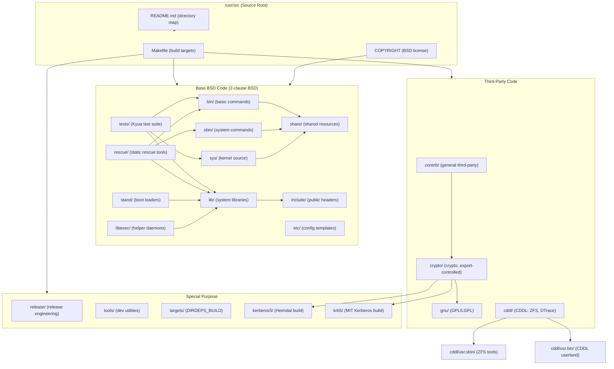

# Source Tree — Layout and Conventions
<!-- This file is auto-generated by generate-doc.py -- do not edit manually -->

---
**Navigation:**
  **Related:** [Kernel Core — Structure and Entry Point](sys/README.md) | [Build System — buildworld and buildkernel](share/mk/README.md)
  **All chapters:** [Boot Process — UEFI Bootloader to Kernel Handoff](stand/efi/loader/README.md) | [Kernel Core — Structure and Entry Point](sys/README.md) | [Build System — buildworld and buildkernel](share/mk/README.md) | [Virtual Memory Subsystem — vm_page, UMA, and Pagers](sys/vm/README.md) | [Process Management — Scheduling and Lifecycle](sys/kern/README_process.md) | [Locking Primitives — Mutexes, sx, rmlocks, and Atomics](sys/kern/README_locking.md) | [Buffer Cache — Block I/O Subsystem](sys/vm/README_bcache.md) | [GEOM — Storage Framework](sys/geom/README.md) ...
---


## Quick Summary

The FreeBSD source tree is organized as a flat hierarchy of top-level directories, each with a well-defined purpose. The layout follows a single guiding principle: source location mirrors install path. Code that ends up in `/bin` lives under `bin/`, code that goes to `/sbin` lives under `sbin/`, and so on. This convention means that anyone who knows the FreeBSD filesystem layout can navigate the source tree without reading documentation. The root of the tree — conventionally mounted at `/usr/src` on a build machine — contains roughly 26 top-level directories, each serving a distinct role in the construction of the operating system.

The tree is divided into four broad categories by license and origin. The base system — including kernel sources in `sys/`, libraries in `lib/`, commands in `bin/` and `sbin/`, and shared resources in `share/` and `etc/` — is developed by the FreeBSD Project under the 2-clause BSD license. Third-party code arrives under three licenses: `contrib/` and `crypto/` hold software under various permissive licenses (the separation exists because U.S. export law historically classified cryptographic software as munitions); `gnu/` contains code under the GPL or LGPL; and `cddl/` holds the CDDL-licensed ZFS and DTrace implementations. Each group is kept in its own directory so that license compliance is straightforward and automated build knobs can selectively include or exclude them.

Beyond the major directories, several specialized trees serve distinct purposes. `stand/` contains the boot loader source, split between architecture-independent code and platform-specific loaders for UEFI, U-Boot, and traditional BIOS. `rescue/` builds a self-contained set of statically linked commands that survive a broken userland — useful for recovery when `/bin` or `/sbin` no longer function. `tests/` mirrors the source hierarchy to provide a comprehensive test suite driven by Kyua. `include/` holds the public header files installed to `/usr/include`, and `libexec/` contains commands designed to be executed by other programs rather than invoked directly by users, such as the dynamic linker `rtld-elf` and the init daemon `rc`.

At the top level, a single `Makefile` defines build targets, and a `README.md` provides a quick-reference table of every directory. The kernel source tree has its own `README.md` under `sys/` with its own detailed documentation. The build system itself — including `Makefile.inc1`, the `share/mk/` rule library, and the `src.conf(5)` configuration framework — is documented in the Build System chapter; this chapter focuses solely on what lives where and why.

## Architecture

The FreeBSD source tree uses a directory-per-component model where each top-level directory corresponds to an install destination and contains a `Makefile` that drives compilation of its contents. The top-level `Makefile` (at `/usr/src/Makefile`) defines high-level targets such as `buildworld`, `buildkernel`, and `universe`, and delegates to `Makefile.inc1` for the orchestration logic. The `README.md` at the tree root provides a quick-reference table mapping each directory to its purpose.

```
Top-level Makefile targets:
  buildworld    - Rebuild everything including upgrade glue
  buildkernel   - Rebuild kernel and kernel modules
  universe      - Build everything on all supported architectures
  installworld  - Install everything built by buildworld
  installkernel - Install the kernel and kernel modules
```

The directory taxonomy breaks down as follows:

**`bin/`** — Basic system and user commands. This directory contains the foundational utilities that form the core of a working FreeBSD system: `sh`, `cp`, `ls`, `cat`, `chmod`, `mkdir`, `rm`, `date`, `df`, `ps`, and `freebsd-version`. These programs are compiled as part of the base system and installed to `/bin`. Each subdirectory under `bin/` is a separate program, and the `Makefile` lists them in the `SUBDIR` variable. For example, `bin/cp/Makefile` compiles the `cp` command from `bin/cp/cp.c`.

**`sbin/`** — System administration commands. Programs here manage the system: `ifconfig`, `fsck`, `kldload`, `dump`, `dmesg`, `geom`, `fdisk`, `bsdlabel`, `devfs`, and `dhclient`. They are installed to `/sbin` and typically require root privileges. The `sbin/Makefile` uses the same `SUBDIR` pattern, listing each command as a subdirectory.

**`usr.bin/`** — User utilities that were originally developed elsewhere and later integrated into the base system. This directory contains tools such as `clang`, `awk`, `bmake`, `bzip2`, `less`, `flex`, `byacc`, `libedit`, `expat`, `jemalloc`, and `kyua`. The `usr.` prefix signals that these are not FreeBSD-native projects; they are third-party sources with FreeBSD patches applied. They are installed to `/usr/bin` alongside the base utilities.

**`usr.sbin/`** — Advanced system administration tools, also often originating from third-party projects or developed specifically for FreeBSD but considered too specialized for the core `sbin/` set. This includes `bhyve`, `bhyvectl`, `config`, `auditd`, `cron`, `ntpd`, `snmpd`, `pfctl`, `ipfw`, `btrace`, and `bsdconfig`. These are installed to `/usr/sbin`.

**`lib/`** — System libraries. This is the largest directory by number of subdirectories, containing over 150 libraries. The core C library (`libc/`) provides the standard C runtime, POSIX functions, and libc-specific extensions. Other notable libraries include `libpthread` for threading, `libarchive` for archive format support, `libcrypt` for cryptographic primitives, `libgeom` for GEOM framework userspace tools, `libcasper` for capability-based security, `libbsdstat` for system statistics, and `lib80211` for 802.11 wireless support. The `lib/Makefile` uses `SUBDIR_BOOTSTRAP` for libraries needed during the bootstrap phase of the build, followed by the full library list.

**`libexec/`** — System commands intended to be executed by other commands or daemons rather than invoked directly by users. This includes `rtld-elf` (the dynamic linker), `getty` (console login daemon), `rc` (the init script interpreter), `bootpd`, `fingerd`, `tcpd`, and various helper programs. These are installed to `/usr/libexec`.

**`sys/`** — Kernel sources. The kernel tree is organized by architecture (subdirectories like `amd64/`, `arm/`, `arm64/`, `i386/`, `powerpc/`, `riscv/`) and by subsystem (`kern/` for process management and scheduling, `vm/` for virtual memory, `net/` for the network stack, `geom/` for the storage framework, `fs/` for filesystems, `dev/` for device drivers). The `sys/README.md` file provides a detailed map of the kernel source structure. Each architecture has its own entry point in `sys/<arch>/<arch>/locore.S`, and architecture-independent code lives in `sys/kern/`, `sys/vm/`, and `sys/libkern/`. The kernel build produces a single kernel binary (plus loadable modules) installed to `/boot/kernel/`.

**`stand/`** — Boot loader sources. This directory contains the code that runs before the kernel is loaded, including the EFI loader, U-Boot port, traditional BIOS boot blocks, and common libraries like `libsa` (standalone C library for boot code) and `liblua` (Lua scripting support). The directory is split by platform: `stand/efi/` for UEFI, `stand/uboot/` for U-Boot, `stand/i386/` for BIOS, `stand/arm64/` for ARM64 boot, and `stand/common/` for shared code. The `stand/Makefile` uses conditional `SUBDIR` directives to include only the platforms relevant to the current build.

**`include/`** — Public header files installed to `/usr/include`. This directory contains C header files for the C library, network protocols, RPC, and architecture-specific definitions. The `include/Makefile` lists subdirectories such as `arpa/`, `protocols/`, `rpc/`, `rpcsvc/`, `ssp/`, and `xlocale/`. Files like `paths.h`, `unistd.h`, `pthread.h`, and `elf.h` are distributed to userspace.

**`share/`** — Shared resources that do not belong to a specific program. This includes manual pages (`share/man/`), locale data (`share/i18n/`), DTrace probe definitions (`share/dtrace/`), terminal capabilities (`share/termcap/`), keyboard mappings (`share/vt/`), firmware images (`share/firmwares/`), the Makefile rule library (`share/mk/`), and example files (`share/examples/`). The `share/Makefile` uses conditional `SUBDIR` directives to include only the components enabled by build knobs.

**`etc/`** — Template files for `/etc`. This directory contains skeleton configuration files, mtree specifications for directory permissions, sendmail configuration, and terminal capabilities. The `etc/termcap/` and `etc/sendmail/` subdirectories are built and installed as part of the base system.

**`contrib/`** — Third-party software that is not subject to export controls. This directory contains raw source trees obtained from upstream projects, with FreeBSD-specific patches applied. Notable contributors include `libarchive`, `jemalloc`, `bmake`, `kyua`, `libedit`, `expat`, `bzip2`, `less`, `flex`, `byacc`, `elftoolchain`, `libevent`, `bzip2`, `bzip2`, `bc`, `bearssl`, `bdsnmp`, `bzip2`, `dialog`, `dma`, `ee`, `file`, `gdtoa`, `googletest`, `hyperv`, `ldns`, `lib9p`, `libbegemot`, `libc-vis`, `libcbor`, `libcxxrt`, `libder`, `libdivsufsort`, `libexecinfo`, and `bmake`. The `contrib/Makefile` does not directly build anything; each subdirectory has its own build system.

**`crypto/`** — Third-party cryptographic software, kept separate from `contrib/` due to historical U.S. export restrictions on encryption software. The `crypto/README` explains: "This directory is for the EXACT same use as src/contrib, except it holds crypto sources." The actual build happens from `src/secure/`, which pulls sources from both `contrib/` and `crypto/`. This directory contains `openssh`, `openssl`, `heimdal`, `krb5`, and `libecc`.

**`gnu/`** — GNU-licensed software under the GPL or LGPL. The `gnu/COPYING` file contains the full text of the GNU General Public License Version 2. This directory contains `lib/` (GNU libraries) and `usr.bin/` (GNU userland tools). The `gnu/Makefile` uses conditional `SUBDIR` directives to include only the enabled components.

**`cddl/`** — Common Development and Distribution License software. This directory contains CDDL-licensed code, primarily the ZFS implementation and DTrace enhancements. The `cddl/Makefile` builds libraries (`cddl/lib/`), userland commands (`cddl/usr.bin/`, `cddl/usr.sbin/`), system administration tools (`cddl/sbin/`), and shared resources (`cddl/share/`).

**`tests/`** — The Kyua test suite. The `tests/README` explains that the test hierarchy mirrors the source hierarchy wherever possible: `src/bin/cp/` maps to `src/tests/bin/cp/`, `src/lib/libc/` maps to `src/tests/lib/libc/`, and so on. Test programs for specific utilities live next to their source code in a `tests/` subdirectory (e.g., `src/lib/libcrypt/tests/`), while `src/tests/` provides generic infrastructure and cross-functional tests. The `tests/Makefile` builds the test suite using the `MK_TESTS` build knob.

**`rescue/`** — Statically linked rescue commands. The `rescue/README` explains that `/rescue` contains a self-contained set of tools that do not depend on `/bin` or `/sbin`. This directory includes `librescue/` (the rescue library and crunchgen infrastructure) and `rescue/` (the individual command definitions). The `rescue/Makefile` uses `crunchgen` to produce a single statically linked binary containing multiple commands.

**`release/`** — Makefiles and scripts for building FreeBSD releases and VM images. This directory is not part of the normal `buildworld` flow; it is used by release engineers to produce distribution media.

**`tools/`** — Ancillary utilities and tests that are not included in the build. These are development aids, not part of the installed system.

**`targets/`** — Support for the experimental `DIRDEPS_BUILD` system. This directory is not built by default.

**`kerberos5/`** and **`krb5/`** — Build systems for Kerberos 5 (Heimdal and MIT implementations, respectively). These directories contain build infrastructure but not raw source code; the actual Kerberos sources come from `crypto/heimdal/` and `crypto/krb5/`.

The separation between base BSD code and third-party code is enforced at multiple levels. The `COPYRIGHT` file at the tree root declares the 2-clause BSD license for the FreeBSD Project's contributions. The `gnu/COPYING` and `gnu/COPYING.LIB` files contain the GPL and LGPL texts. The `cddl/` directory contains CDDL-licensed code with its own license headers. Each directory's `Makefile` includes only the components that the current build configuration enables, using `src.conf(5)` knobs such as `WITHOUT_GNU`, `WITHOUT_CDDL`, and `WITHOUT_TESTS`.

Architecture-specific code under `sys/` follows a consistent pattern. Each supported architecture has a directory under `sys/` named after the architecture (e.g., `sys/amd64/`, `sys/arm64/`, `sys/riscv/`). Within each architecture directory, `locore.S` contains the assembly entry point, and `clock.c`, `pmap.c`, `vm_machdep.c`, and similar files contain architecture-specific implementations of kernel interfaces. The architecture-independent code lives in `sys/kern/`, `sys/vm/`, `sys/net/`, and other subsystem directories. The `sys/conf/` directory contains the kernel configuration framework, including the `newvers.sh` script that generates the version string.

Under `stand/`, the boot loader code follows a similar pattern. The `stand/common/` directory contains architecture-independent boot loader code, while `stand/efi/`, `stand/uboot/`, `stand/i386/`, and other directories contain platform-specific loaders. The `stand/libsa/` and `stand/libsa32/` directories provide a minimal C library for boot code, and `stand/ficl/` and `stand/lua/` provide scripting language support.

## Flow / Diagram



## Advanced Notes

The source tree layout has evolved over decades, and some historical artifacts remain. The `crypto/` and `contrib/` separation is a direct result of U.S. export regulations on cryptographic software; `crypto/` holds export-controlled sources while `contrib/` holds everything else. The build system in `src/secure/` pulls from both directories. This split is invisible to users of the build system — `make buildworld` handles it automatically — but it is important for developers who need to understand why cryptographic sources are scattered across multiple directories.

The `usr.bin/` and `usr.sbin/` directories exist because FreeBSD imports third-party software as "ports" into the base system. The `usr.` prefix distinguishes these from FreeBSD-native code in `bin/` and `sbin/`. This convention helps developers identify which code was written for FreeBSD and which was imported from elsewhere. It also helps automated tools like `check-old` and `delete-old` determine which files are part of the base system and which are third-party additions.

The test suite's mirroring of the source hierarchy (`src/tests/bin/` for `src/bin/`, `src/tests/lib/` for `src/lib/`, etc.) is a deliberate design choice. The `tests/README` explains that this "simplifies the discoverability of tests" — a developer working on `src/bin/cp/` knows to look in `src/tests/bin/cp/` for related tests. Test programs that cover multiple components (such as filesystem-level tests or cross-library tests) live in `src/tests/` directly, analogous to how `share/man/` holds generic manual pages while tool-specific man pages live next to their source.

The `rescue/` directory's use of `crunchgen` to produce a single statically linked binary is a practical solution to a specific problem: when `/bin` and `/sbin` are broken, the system may not be able to run any dynamically linked programs. The statically linked `/rescue/mount` can still mount a filesystem, after which the dynamic `/sbin/mount_nfs` (or any other dynamic program) becomes available again. This design means `/rescue/mount` calls `/rescue/mount_nfs` internally rather than invoking `/sbin/mount_nfs`, ensuring the recovery path works even when `/sbin` is corrupted.

Under `sys/`, the architecture-specific code in `sys/<arch>/<arch>/locore.S` follows a strict convention: the entry point symbol (e.g., `btext` on x86_64) is the first instruction executed after the bootloader transfers control. This assembly code switches the CPU to the appropriate mode (long mode on x86_64, MMU enabled on ARM64), establishes a kernel stack, and calls the C entry point. The `sys/README.md` documents this sequence in detail.

The `share/mk/` directory contains the Makefile rule library that defines how each component is built. This is the domain of the Build System chapter; the key point for this chapter is that `share/mk/README.md` exists and documents the build rules, including `bsd.prog.mk`, `bsd.kmod.mk`, `bsd.sys.mk`, and the `src.conf(5)` configuration framework. The top-level `Makefile` delegates to `Makefile.inc1`, which orchestrates the full build sequence.

When navigating the source tree, keep in mind that some directories are build-system only and do not contain source code. `kerberos5/` and `krb5/` are build directories that invoke the actual Kerberos sources from `crypto/heimdal/` and `crypto/krb5/`. `release/` contains release engineering scripts, not runtime code. `targets/` is experimental infrastructure for the `DIRDEPS_BUILD` system. `tools/` contains development utilities that are not installed as part of the base system.

The `UPDATING` file at the tree root contains notes for developers about changes that affect the build process. It is updated regularly and includes items such as build knob changes, API modifications, and deprecation notices. The `UPDATING` file is the first place to look when a build fails after updating the source tree.

## See Also
- [Kernel Core — Structure and Entry Point](sys/README.md)
- [Build System — buildworld and buildkernel](share/mk/README.md)


- `sys/README.md` — Kernel source structure and entry points
- `share/mk/README.md` — Build system documentation (Makefile rules, build phases, src.conf(5))
- `tests/README` — Test suite organization and usage
- `rescue/README` — Rescue command build system
- `crypto/README` — Export-controlled source separation
- `COPYRIGHT` — BSD license text for the FreeBSD Project
- `gnu/COPYING` — GPL license text for GNU-licensed code
- `UPDATING` — Developer update notes and build changes
- [FreeBSD Handbook — Building from Source](https://docs.freebsd.org/en/books/handbook/cutting-edge/#makeworld) — User-facing build documentation
- [FreeBSD Handbook — Kernel Configuration](https://docs.freebsd.org/en/books/handbook/kernelconfig/) — Kernel build documentation

---

> _Generated by [DaemonDocs](https://github.com/ocochard/DaemonDocs) on 2026-04-30 23:39 UTC using model `Qwen3.6-35B-A3B-UD-Q4_K_XL` (llama.cpp build `b8985-27aef3dd9`). AI-generated content — verify against source before relying on it._
