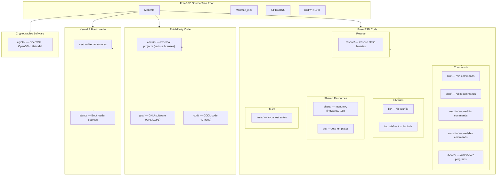

# Source Tree — Layout and Conventions
<!-- This file is auto-generated by generate-doc.py -- do not edit manually -->

---
**Navigation:**
  **Related:** [Kernel Core — Structure and Entry Point](sys/README.md) | [Build System — buildworld and buildkernel](share/mk/README.md)
  **All chapters:** [Boot Process — UEFI Bootloader to Kernel Handoff](stand/efi/loader/README.md) | [Kernel Core — Structure and Entry Point](sys/README.md) | [Build System — buildworld and buildkernel](share/mk/README.md) | [Virtual Memory Subsystem — vm_page, UMA, and Pagers](sys/vm/README.md) | [Process Management — Scheduling and Lifecycle](sys/kern/README_process.md) | [Locking Primitives — Mutexes, sx, rmlocks, and Atomics](sys/kern/README_locking.md) | [Buffer Cache — Block I/O Subsystem](sys/vm/README_bcache.md) | [GEOM — Storage Framework](sys/geom/README.md) ...
---


> ⚠ **UNVERIFIED DRAFT** — reviewer did not explicitly approve this draft. Treat claims as suspect until manually reviewed.


## Quick Summary

The FreeBSD source tree is organized so that the directory structure mirrors the final install layout. If a binary lands in `/usr/bin`, its source lives in `usr.bin/`; if it goes to `/sbin`, its source is in `sbin/`. This convention lets developers and auditors find the code for any installed file by reversing the install path. The top-level directories are roughly grouped into four categories: base system code (the directories that contain FreeBSD's own implementation), third-party code (contrib, gnu, cddl), kernel and boot loader sources (sys, stand), and supporting infrastructure (lib, share, tests, etc).

The base BSD code makes up the core operating system: the kernel in `sys/`, the boot loader in `stand/`, system libraries in `lib/`, user commands in `bin/` and `usr.bin/`, system commands in `sbin/` and `usr.sbin/`, and shared resources like man pages and configuration templates in `share/` and `etc/`. This code is licensed under the BSD 2-Clause and 4-Clause licenses, with some files under other permissive licenses. The separation between base code and third-party code is marked by directory boundaries — everything under the top-level directories listed above is FreeBSD's own implementation, while `contrib/`, `gnu/`, and `cddl/` contain code from outside the FreeBSD Project.

Third-party code is segregated by license family. The `contrib/` directory holds code from various external projects under their original licenses, which can range from permissive (ISC, MIT, BSD-style) to copyleft (GPL, LGPL). The `gnu/` directory is reserved for GNU software that has been integrated into the base system, typically under the GPL or LGPL. The `cddl/` directory contains code licensed under the Common Development and Distribution License, most notably the DTrace implementation. This license separation is important for legal compliance: the build system treats these directories differently, and the FreeBSD Project's policy requires that third-party code remain in its designated directory rather than being merged into base BSD code.

The kernel source tree under `sys/` is itself organized by subsystem and by architecture. Architecture-independent kernel code lives in `sys/kern/`, `sys/vm/`, `sys/net/`, and similar directories, while architecture-specific code is placed under `sys/<arch>/` (for example, `sys/amd64/` or `sys/arm64/`). The boot loader sources under `stand/` follow the same pattern, with `stand/common/` holding shared code and `stand/efi/`, `stand/i386/`, and `stand/arm64/` providing platform-specific boot loaders. The build system is responsible for assembling all of these pieces into the final install; this chapter describes *what* lives where, not *how* the pieces are compiled.

## Architecture

The FreeBSD source tree begins at the top level with a `README.md` that provides a source roadmap describing each top-level directory. The roadmap uses a table format to list each directory and its purpose:

```
Source Roadmap:
---------------
| Directory | Description |
| --------- | ----------- |
| bin | System/user commands. |
| cddl | Source code for third-party software under the Common Development and Distribution License. |
| contrib | Source code for third-party software. |
| crypto | Source code for cryptographic libraries and commands (see [crypto/README](crypto/README)). |
| etc | Template files for /etc. |
| gnu | Source code for third-party software under the GNU General Public License (GPL) or Lesser General Public License (LGPL). |
| lib | System libraries. |
| sbin | System commands. |
| share | Shared resources. |
| stand | Boot loader sources. |
| sys | Kernel sources (see [sys/README.md](sys/README.md)). |
| tests | Tests which can be run by Kyua. |
| usr.bin | User commands. |
| usr.sbin | System administration commands. |
```

A `Makefile` defines high-level targets such as `buildworld`, `installworld`, `buildkernel`, and `installkernel`. The `Makefile` delegates most of its work to `Makefile.inc1`, which orchestrates the build phases. The top-level `Makefile` is mostly a comment block listing available targets, then delegates to `Makefile.inc1`:

```
# The common user-driven targets are (for a complete list, see build(7)):
#
# buildworld          - Rebuild *everything*, including glue to help do
#                       upgrades.
# installworld        - Install everything built by "buildworld".
# buildkernel         - Rebuild the kernel and the kernel-modules.
# installkernel       - Install the kernel and the kernel-modules.
# ...
# Most of the user-driven targets (as listed above) are implemented in
# Makefile.inc1.  The exceptions are universe, tinderbox and targets.
```

The `UPDATING` file records changes that affect source-tree consumers, such as API breaks or directory renames. Each entry begins with a `YYYYMMDD` date header followed by a description of the change:

```
20260412:
	The /etc/rc.d/NETWORKING script no longer provides the legacy
	NETWORK alias. Third-party or local RC scripts that still use
	"REQUIRE: NETWORK" shall be updated to use "REQUIRE: NETWORKING"
	instead.

20260129:
	The "net.inet6.ip6.use_stableaddr" sysctl is now on by default.
	This changes the default algorithm to choose IPv6 SLAAC autogenerated
	addresses from embedding the interface hardware address to using
	SHA256-HMAC hash as described in RFC 7217 to derive an opaque but
	stable Address.
```

The `COPYRIGHT` file at the root summarizes the licensing of the entire tree; each subdirectory may contain its own `COPYING` or `LICENSE` file for more granular attribution.

### Base System Directories

**`bin/`** contains system and user commands that are built as part of the base system and installed to `/bin`. These are fundamental utilities like `cat`, `cp`, `ls`, `sh`, and `date`. The `bin/` Makefile enumerates each command as a SUBDIR entry. For example, the `bin/cat/` subdirectory contains the source for the `cat(1)` command.

**`sbin/`** holds system administration commands that are installed to `/sbin`. These include tools like `ifconfig`, `fsck`, `mount`, and `dump`. Commands in `sbin/` typically require root privileges and interact with kernel interfaces. The `sbin/` Makefile lists each program as a SUBDIR entry.

**`usr.bin/`** contains user commands that are installed to `/usr/bin`. This directory is larger than `bin/` and includes tools like `awk`, `bmake`, `clang`, `diff`, `gcc`, `vim`, and `perl`. The `usr.bin/` Makefile uses SUBDIR entries to list all 276+ command subdirectories. Some of these programs, like `clang` and `gcc`, are compilers; others, like `bmake`, are build tools.

**`usr.sbin/`** holds system administration commands installed to `/usr/sbin`. This includes daemons and management tools like `cron`, `bhyve`, `ndiscvt`, `sysctl`, and `tcpdump`. The `usr.sbin/` Makefile lists 229+ subdirectories. Many of these programs interact with kernel subsystems through sysctl, procfs, devfs, or device nodes.

**`lib/`** contains system libraries installed to `/lib` and `/usr/lib`. This includes the C standard library (`libc`), the C++ standard library (`libc++`), and dozens of other libraries like `libarchive`, `libcam`, `libedit`, `libz`, and `libthr` (the POSIX threads implementation). The dynamic linker, `rtld-elf`, is located in `libexec/rtld-elf/`. The `libexecinfo` library provides a backtrace API. The `lib/` Makefile lists 155+ subdirectories, each containing the source for a single library or a set of related libraries.

**`libexec/`** holds system commands that are executed by other commands or daemons rather than directly by users. The most notable example is `rtld-elf`, the ELF dynamic linker. Other programs in `libexec/` include `bootpd`, `getty`, `tcpd`, and `rc`. These programs are installed to `/usr/libexec/`.

**`share/`** contains shared resources that do not belong to any single program. This includes man pages (`share/man/`), DTrace provider definitions (`share/dtrace/`), terminal capabilities (`share/termcap/`, `share/vt/`), locale data (`share/i18n/`), firmware images (`share/firmwares/`), and the build rule library (`share/mk/`). The `share/mk/` directory is particularly important: it contains the `bsd.*.mk` files that define the build rules used throughout the source tree.

**`etc/`** holds template files for `/etc`. This includes `etc/rc.d/` scripts, `etc/mtree/` directory specifications, `etc/termcap/`, and `etc/sendmail/`. These files are installed to their corresponding locations in the root filesystem during `installworld`.

**`include/`** contains system header files installed to `/usr/include`. These headers define the interfaces for system libraries and kernel interfaces that are exposed to userland. The directory mirrors the structure of `lib/` and `sys/`.

### Third-Party Code Directories

**`contrib/`** contains source code from external projects. This directory is the catch-all for third-party code that does not fit into `gnu/` or `cddl/`. It includes projects like `bmake`, `bzip2`, `expat`, `file`, `flex`, `libarchive`, `libedit`, `less`, `llvm/clang` (parts), `openssl`, and `zlib`. Each subdirectory typically contains the upstream source tree with minimal FreeBSD-specific modifications. The licenses of contrib code vary by project.

**`gnu/`** contains GNU software integrated into the base system. The current `gnu/` directory structure includes `gnu/lib/` for libraries, `gnu/usr.bin/` for userland programs, and `gnu/tests/` for test suites. Programs in `gnu/` are typically licensed under the GPL or LGPL. The `gnu/COPYING` and `gnu/COPYING.LIB` files at the root of this directory summarize the applicable licenses.

**`cddl/`** contains code licensed under the Common Development and Distribution License. The most significant component is DTrace, which was ported from Solaris. The `cddl/` directory structure mirrors the base tree: `cddl/sbin/` contains DTrace-related system commands, `cddl/usr.bin/` contains user commands, `cddl/usr.sbin/` contains administration tools, `cddl/lib/` contains libraries, `cddl/share/` contains shared resources, and `cddl/contrib/` contains third-party contributions under CDDL.

### Kernel and Boot Loader Directories

**`sys/`** contains all kernel source code. The `sys/` directory is organized by subsystem and architecture. Architecture-independent code lives in directories like `sys/kern/` (kernel core), `sys/vm/` (virtual memory), `sys/net/` (networking), `sys/fs/` (filesystems), `sys/cam/` (storage), and `sys/geom/` (storage framework). Architecture-specific code is placed under `sys/<arch>/` — for example, `sys/amd64/` for x86_64, `sys/arm64/` for ARM64, `sys/riscv/` for RISC-V. The `sys/` Makefile lists `modules` as a SUBDIR, and the kernel modules are built from source in `sys/modules/`. The `sys/conf/` directory contains the kernel configuration file templates and the build infrastructure for kernel compilation. For details on the kernel's internal structure, see the Kernel Core, Virtual Memory, and Process Management chapters.

**`stand/`** contains boot loader sources. The `stand/` directory is organized similarly to `sys/`: `stand/common/` holds shared code used by all boot loaders, `stand/libsa/` provides the boot loader C library, and platform-specific boot loaders live in `stand/efi/` (UEFI), `stand/i386/` (BIOS), `stand/arm64/` (ARM64), `stand/powerpc/` (PowerPC), and `stand/ficl/` (Forth-based boot loader). The `stand/` Makefile uses conditional SUBDIR entries to build only the boot loaders for the target architecture.

### Supporting Directories

**`rescue/`** contains the build system for statically linked rescue commands. During `buildworld`, the rescue commands are built as a set of statically linked binaries that are installed to `/rescue`. These commands are available even when the dynamic linker or shared libraries are broken, making them useful for recovery. The `rescue/rescue/` subdirectory contains the list of commands to include, and `rescue/librescue/` provides the static library that the rescue commands link against.

**`tests/`** contains test suites that can be run by Kyua. The `tests/` directory is organized by subsystem: `tests/sys/` contains kernel tests, `tests/etc/` contains configuration tests, and `tests/freebsd_test_suite/` contains the broader test suite. Each test directory contains a Makefile, test scripts, and expected output files. The `tests/README` file provides additional documentation on how to run and write tests.

**`crypto/`** contains cryptographic software, including OpenSSL, OpenSSH, and Heimdal Kerberos. This directory is a transitional structure: much of the code has been moved to `contrib/` and `secure/`, but `crypto/` still serves as a container for some legacy components. The `crypto/README` file explains the current organization.

**`tools/`** contains ancillary utilities and tests that are not included in the build. These are developer tools used during development but not distributed with the base system.

**`release/`** contains Makefiles and scripts used for building FreeBSD releases and VM images. This directory is not part of the normal build process but is used by the release engineering team.

**`targets/`** contains support for the experimental `DIRDEPS_BUILD` system, which tracks inter-directory dependencies to enable parallel builds. This feature is not yet the default build mode.

### Licensing Groups

The FreeBSD source tree is divided into three licensing groups:

1. **Base BSD code** — All directories except `contrib/`, `gnu/`, and `cddl/` contain FreeBSD's own implementation, licensed primarily under the BSD 2-Clause and 4-Clause licenses. This includes `bin/`, `sbin/`, `usr.bin/`, `usr.sbin/`, `lib/`, `libexec/`, `sys/`, `stand/`, `share/`, `etc/`, `include/`, `rescue/`, and `tests/`.

2. **GNU code** — The `gnu/` directory contains code licensed under the GPL or LGPL. This code is integrated into the base system but remains in a separate directory to maintain license compliance.

3. **CDDL code** — The `cddl/` directory contains code licensed under the Common Development and Distribution License, primarily DTrace. This code is also integrated into the base system but remains in a separate directory.

4. **Contrib code** — The `contrib/` directory contains code from various external projects under their original licenses. The licenses range from permissive (ISC, MIT, BSD-style) to copyleft (GPL, LGPL, Apache). Each subdirectory may contain its own `LICENSE` or `COPYING` file.

The principle that source location mirrors install path is a cornerstone of the FreeBSD source tree organization. A developer who wants to modify `ls(1)` edits `bin/ls/`; a developer who wants to modify the ELF dynamic linker edits `libexec/rtld-elf/`; a developer who wants to modify the virtual memory system edits `sys/vm/`. This convention reduces the cognitive load of navigating the source tree and makes it easier to find the code for any installed file.

## Flow / Diagram



## Advanced Notes

### Directory Navigation for Developers

When working on the FreeBSD source tree, the first skill to develop is knowing where to look. The rule of thumb is simple: reverse the install path. If a binary is in `/usr/bin/awk`, its source is in `usr.bin/awk/`. If a library is in `/usr/lib/libarchive.so`, its source is in `lib/libarchive/`. If a kernel module is loaded from `/boot/kernel/geom.ko`, its source is in `sys/modules/geom/`.

For kernel work, start with `sys/README.md` to understand the kernel source organization. The `sys/kern/` directory contains the kernel core (process management, scheduling, sysinit), `sys/vm/` contains the virtual memory system, `sys/net/` contains the networking stack, `sys/fs/` contains filesystem code, and `sys/cam/` and `sys/geom/` contain storage subsystems. Architecture-specific code is in `sys/<arch>/` — for x86_64 work, look at `sys/amd64/`; for ARM64, look at `sys/arm64/`.

For userland work, the `Makefile` in each command's directory is the entry point. The `SUBDIR` variable lists the programs to build, and each program's Makefile defines the source files and dependencies. The `share/mk/` directory contains the `bsd.*.mk` files that define the common build rules; these are included by every command's Makefile.

### Build System Reference

This chapter does not explain the build system in detail — that is the subject of the Build System chapter. The top-level `Makefile` delegates to `Makefile.inc1`, which orchestrates the build phases. The `share/mk/` directory contains the `bsd.*.mk` files that define build rules. The `src.conf(5)` file documents build-time configuration options. The `make buildworld` target rebuilds the entire userland; the `make buildkernel` target rebuilds the kernel. For details on build phases, dependency tracking, out-of-tree builds, and cross-compilation, see the Build System chapter.

### Licensing Compliance

The separation between base BSD code and third-party code is not just organizational — it is a legal requirement. The FreeBSD Project's policy requires that third-party code remain in its designated directory (`contrib/`, `gnu/`, or `cddl/`) and that the license of each file be correctly attributed. When integrating new third-party code, the developer must ensure that the license is compatible with FreeBSD's distribution model and that the code is placed in the correct directory based on its license family.

The `COPYRIGHT` file at the root of the source tree provides an overview of the licensing. Each subdirectory may contain its own `COPYING` or `LICENSE` file for more granular attribution. When modifying third-party code, developers should be aware that upstream changes may be pulled in periodically, and that the FreeBSD-specific modifications should be tracked separately to facilitate merging.

### Architecture-Specific Code

The FreeBSD source tree supports many CPU architectures: amd64, i386, arm, arm64, powerpc, riscv, mips, sparc64, and others. Architecture-specific code is organized under `sys/<arch>/` for the kernel and `stand/<arch>/` for the boot loader. The `sys/<arch>/` directory (e.g., `sys/amd64/amd64/`) contains assembly language entry points, context switching code, and architecture-specific system call handling. The `sys/<arch>/conf/` directory contains architecture-specific kernel configuration options.

The `stand/` directory follows the same pattern: `stand/efi/` contains the UEFI boot loader for all architectures that support UEFI, `stand/i386/` contains the BIOS boot loader for x86, `stand/arm64/` contains the boot loader for ARM64, and so on. The `stand/common/` directory contains code shared by all boot loaders, such as the file system driver and the command interpreter.

### The Rescue Mechanism

The `rescue/` directory provides a safety net for system recovery. During `buildworld`, the rescue commands are built as statically linked binaries that do not depend on any shared libraries. These binaries are installed to `/rescue` and are available even when the dynamic linker (`rtld-elf`) or shared libraries are broken. The `rescue/rescue/` directory contains the list of commands to include, and the `rescue/librescue/` directory provides the static library that the rescue commands link against. This mechanism is particularly useful for recovery after a failed `installworld`.

### Tests and Quality Assurance

The `tests/` directory contains the FreeBSD test suite, which is run by Kyua. The tests are organized by subsystem: `tests/sys/` contains kernel tests, `tests/etc/` contains configuration tests, and `tests/freebsd_test_suite/` contains the broader test suite. Each test directory contains a Makefile, test scripts, and expected output files. The `tests/README` file provides documentation on how to run and write tests.

Running the test suite is important for verifying changes before committing. The `make checkworld` target runs the test suite on the installed world. The tests can also be run manually using the `kyua` command. Writing tests for new functionality is encouraged, as it helps prevent regressions and documents expected behavior.

## See Also
- [Kernel Core — Structure and Entry Point](../../sys/README.md)
- [Build System — buildworld and buildkernel](../../../share/mk/README.md)


- **Build System** — `share/mk/README.md`, `Makefile.inc1`, `src.conf(5)`, `build(7)`
- **Kernel Core** — `sys/README.md`, `sys/kern/`, `sys/conf/`
- **Boot Process** — `stand/efi/loader/README.md`, `stand/efi/`, `stand/i386/`
- **Virtual Memory** — `sys/vm/`
- **Process Management** — `sys/kern/`
- **Locking Primitives** — `sys/kern/`
- **GEOM** — `sys/geom/`
- **Man Pages** — `share/man/`
- **FreeBSD Handbook** — [Building from Source](https://docs.freebsd.org/en/books/handbook/cutting-edge/#makeworld), [Kernel Configuration](https://docs.freebsd.org/en/books/handbook/kernelconfig/)
- **UPDATING** — `UPDATING` (update notes for source tree consumers)
- **COPYRIGHT** — `COPYRIGHT` (licensing overview)

---

> _Generated by [DaemonDocs](https://github.com/ocochard/DaemonDocs) on 2026-04-30 16:29 UTC using model `Qwen3.6-35B-A3B-UD-Q4_K_XL` (llama.cpp build `b8985-27aef3dd9`). AI-generated content — verify against source before relying on it._
