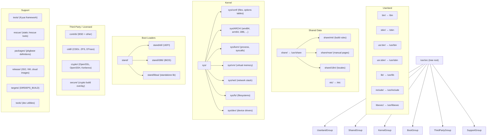

# Source Tree — Layout and Conventions
<!-- This file is auto-generated by generate-doc.py -- do not edit manually -->

---
**Navigation:**
  **Related:** [Kernel Core — Structure and Entry Point](sys/README.md) | [Build System — buildworld and buildkernel](share/mk/README.md)
  **All chapters:** [Boot Process — UEFI Bootloader to Kernel Handoff](stand/efi/loader/README.md) | [Kernel Core — Structure and Entry Point](sys/README.md) | [Build System — buildworld and buildkernel](share/mk/README.md) | [System Calls and Image Activation — Entry, sysent, and exec](sys/kern/README_syscall.md) | [Kernel Modules and the Linker — KLD, SYSINIT, and linker sets](sys/kern/README_kld.md) | [Virtual Memory Subsystem — vm_page, UMA, and Pagers](sys/vm/README.md) | [Process Management — Scheduling and Lifecycle](sys/kern/README_process.md) | [Locking Primitives — Mutexes, sx, rmlocks, and Atomics](sys/kern/README_locking.md) ...
---


## Quick Summary

The FreeBSD source tree is a single directory, conventionally checked out at `/usr/src`, that contains every program, library, kernel object, boot loader, and configuration template needed to produce a complete operating system. The tree is organized so that the path of a file inside the source tree directly predicts where that file will appear on an installed system: `bin/ls/` becomes `/bin/ls`, `lib/libc/` becomes `/usr/lib/libc`, and `share/man/man1/` becomes `/usr/share/man/man1/`. This one-to-one mapping means a developer can locate the source for any installed binary by removing the leading `/` from its path and prepending `/usr/src/`. The top-level `Makefile` and its companion `Makefile.inc1` drive the recursive build; each subdirectory contains its own `Makefile` that names its inputs and pulls in a shared rule file from `share/mk/` (see the Build System chapter for details).

The tree is not a monolith of a single license. It is a collection of licensing groups, each with its own top-level directory. The bulk of the code — the kernel in `sys/`, the userland in `bin/`, `sbin/`, `usr.bin/`, `usr.sbin/`, `lib/`, and the shared data in `share/` — is under the two-clause or four-clause BSD license, as stated in the top-level `COPYRIGHT` file. Third-party code that is not BSD-licensed lives in `contrib/` (general third-party software), `cddl/` (Common Development and Distribution License code, primarily the ZFS filesystem and DTrace), and `crypto/` (OpenSSL, OpenSSH, and Kerberos). This separation is not merely bureaucratic: it lets the build system, the package system, and downstream distributors treat each group under its own license terms without ambiguity.

The kernel sources in `sys/` and the boot loader sources in `stand/` are further subdivided by CPU architecture. On an amd64 machine, the architecture-specific code lives in `sys/amd64/` and `stand/i386/` (for the legacy BIOS path) or `stand/efi/` (for UEFI). The architecture-independent kernel code lives in `sys/kern/`, `sys/vm/`, `sys/net/`, and their siblings. A per-architecture `files` table in `sys/conf/` (for example, `sys/conf/files.amd64`) enumerates exactly which source files are compiled into a given kernel configuration, and it uses an `include` directive to pull in shared entries from `sys/conf/files.x86` or the machine-independent `sys/conf/files`.

Finally, the tree contains a parallel test hierarchy under `tests/` that mirrors the source layout: the tests for `bin/cp/` live in `bin/cp/tests/`, and the installed test programs appear at `/usr/tests/bin/cp/`. The top-level `tests/` directory provides the Kyua test-runner glue and cross-functional tests that do not belong to a single component. The `rescue/` directory builds a small, statically linked set of utilities installed to `/rescue/`, designed to remain functional even when the dynamic linker and `/bin` are damaged.

## Architecture

### Top-Level Directory Taxonomy

The top-level `README.md` at the root of the tree provides a "Source Roadmap" table that lists every top-level directory with a one-line description. That table is the authoritative index; this section expands on it.

**Userland command directories.** The four directories `bin/`, `sbin/`, `usr.bin/`, and `usr.sbin/` hold the source for userland executables. The naming convention follows the historical Unix split: `bin/` contains essential user commands (`ls`, `cp`, `mv`, `sh`, `echo`, `test`, `kill`, `ps`, `pax`, `stty`), and `sbin/` contains system administration commands (`mount`, `ifconfig`, `init`, `dmesg`, `fsck`, `newfs`, `route`, `devfs`). The `usr.bin/` and `usr.sbin/` directories hold, respectively, non-essential user commands (`grep`, `find`, `awk`, `diff`, `file`, `fetch`, `gzip`) and non-essential system administration commands (`cron`, `iostat`, `newsyslog`, `adduser`, `bsdconfig`, `devinfo`, `diskinfo`, `memcontrol`). The split between `bin/` and `usr.bin/` (and similarly `sbin/` and `usr.sbin/`) is not purely historical: the `rescue/` build system and the `packages/` system use the `bin/` + `sbin/` + `lib/` set as the minimal "runtime" package, so the boundary determines what is available on a system with only the base runtime installed. Each of these directories has a `Makefile` that defines a `SUBDIR` list naming every program subdirectory, and a `Makefile.inc` (or `Makefile.inc` equivalent) that sets the install destination variable — for example, `bin/Makefile.inc` sets `BINDIR?= /bin` (line 3 of `bin/Makefile.inc`).

**Library directory.** `lib/` contains the source for all system libraries. Its `Makefile` defines a `SUBDIR_BOOTSTRAP` list (line 8 of `lib/Makefile`) that names the small set of libraries — `csu`, `libc`, `libc_nonshared`, `libcompiler_rt`, `libc++`, `libelf`, `libssp`, `libsys`, `msun` — that must be built before the rest, separated by a `.WAIT` barrier. The remaining libraries are listed in the main `SUBDIR` variable, kept in alphabetical order with the noted exception of `libsqlite3` being placed first to improve parallelism. The install destination is `/usr/lib`.

**System include files.** `include/` holds the C header files installed to `/usr/include/`. Its `Makefile` (line 1 comment: "Doing a 'make install' builds /usr/include.") lists every header in an `INCS` variable and defines `SUBDIR` for the subdirectories `arpa`, `protocols`, `rpcsvc`, `rpc`, `ssp`, `xlocale`, plus an architecture-specific subdirectory (`i386` on amd64, `arm` on aarch64).

**Shared resources.** `share/` holds data files that are not code: manual pages (`share/man/`), locale definitions (`share/i18n/`, `share/colldef/`, `share/monetdef/`, etc.), the build rule library (`share/mk/`), terminal capability databases (`share/termcap/`, `share/tabset/`), DTrace provider definitions (`share/dtrace/`), and skeleton files for new user accounts (`share/skel/`). The `share/Makefile` conditionally adds subdirectories based on `MK_*` knobs — for example, `MK_LOCALES` controls whether the `colldef`, `monetdef`, `msgdef`, `numericdef`, and `timedef` directories are built, and `MK_MAN` controls `man`.

**Configuration templates.** `etc/` contains the template files installed to `/etc/`. It is not a source directory in the sense of containing C code; rather, it holds static configuration files (`group`, `master.passwd`, `shells`, `termcap/`), the `mtree/` directory that defines the directory skeleton of the installed system, and subdirectories for `sendmail/`, `gss/`, and `gss-krb5/`. The `etc/Makefile` uses the `FILESGROUPS= FILES` mechanism to install these files and runs `mtree` to create the directory structure.

**Kernel sources.** `sys/` contains the entire kernel. Its `README.md` (the Kernel Core chapter) describes the internal structure in detail; from the tree-layout perspective, what matters is the two-level split. The first level separates architecture-independent subsystems (`sys/kern/` for process management and system calls, `sys/vm/` for virtual memory, `sys/net/` for the network stack, `sys/fs/` for filesystems, `sys/dev/` for device drivers, `sys/geom/` for the [GEOM](sys/vm/README_bcache.md#glossary) disk layer, `sys/ufs/` for the UFS filesystem, `sys/nfs/` for NFS, `sys/bsm/` for security auditing, `sys/ddb/` for the kernel debugger, `sys/conf/` for the kernel build configuration tables) from architecture-specific code (`sys/amd64/`, `sys/arm/`, `sys/arm64/`, `sys/i386/`, `sys/powerpc/`, `sys/riscv/`). The second level, visible in `sys/amd64/`, further splits into `amd64/` (the actual amd64-specific C and assembly), `conf/` (per-architecture kernel configuration files), `include/` (architecture-specific headers), `ia32/` (32-bit compatibility), `linux/` and `linux32/` (Linux compatibility), `pci/`, `pt/` (processor trace), `sgx/`, and `vmm/` (the bhyve hypervisor). The `sys/conf/` directory holds the `files` and `files.<arch>` tables that enumerate which source files are compiled into a kernel, the `options` and `options.<arch>` tables that define the kernel configuration options, and the `Makefile.<arch>` files that drive the kernel build.

**Boot loader sources.** `stand/` contains the source for all boot loaders. Its `Makefile` assembles the `S` variable (the list of subdirectories to build) conditionally: `S.yes+= libsa` is always included, while `S.${MK_EFI}+= efi`, `S.${MK_FORTH}+= ficl forth`, `S.${MK_LOADER_LUA}+= liblua lua`, and `S.${MK_LOADER_KBOOT}+= kboot` are added based on `MK_*` knobs. Architecture-specific directories are included when they exist: `if exists(${.CURDIR}/${MACHINE}/.) S.yes+= ${MACHINE}`. On amd64, this pulls in `stand/i386/` (the legacy BIOS boot path with `boot0`, `boot2`, `btx`, `mbr`, `gptboot`, `isoboot`, `pxeldr`, and the `loader` itself) and `stand/efi/` (the UEFI boot path with `loader`, `gptboot`, `boot1`, `libefi`, and `libsa`). The `stand/common/` directory holds code shared across architectures, and `stand/libsa/` is the standalone library that the loader links against.

**GNU code.** Earlier FreeBSD releases had a top-level `gnu/` directory holding GNU tools (binutils, GCC, etc.). In the current tree, that code has been absorbed into `contrib/` (for example, `contrib/elftoolchain/` for the binutils equivalent, and `contrib/llvm-project/` for the compiler). The only remaining `gnu/` subdirectory is `sys/gnu/`, which holds a small amount of GNU-licensed kernel code (`sys/gnu/dev/` and `sys/gnu/gcov/`).

**Third-party and licensed code.** `contrib/` holds third-party software that is incorporated into FreeBSD but is not part of the original BSD codebase. Examples visible in the directory listing include `contrib/bmake/` (the `make` implementation), `contrib/llvm-project/` (the Clang/LLVM compiler), `contrib/jemalloc/` (the memory allocator), `contrib/ncurses/`, `contrib/sqlite3/`, `contrib/tcpdump/`, `contrib/sendmail/`, `contrib/ntp/`, `contrib/pf/` (the packet filter), `contrib/elftoolchain/`, `contrib/kyua/` (the test framework), and `contrib/libpcap/`. The `cddl/` directory holds code under the Common Development and Distribution License, primarily the OpenSolaris-derived ZFS filesystem (`cddl/contrib/opensolaris/`) and its associated userland tools (`cddl/usr.sbin/zfsd`, `cddl/usr.sbin/zdb`, `cddl/usr.sbin/zhack`, `cddl/usr.sbin/dtrace`, `cddl/usr.sbin/dwatch`, `cddl/usr.sbin/lockstat`). The `cddl/lib/` directory holds the ZFS libraries (`libzfs`, `libzpool`, `libzutil`, `libnvpair`, `libzfsbootenv`, `libumem`, `libavl`, `libctf`, `libdtrace`, `libspl`, `libicp`). The `crypto/` directory holds `crypto/openssl/`, `crypto/openssh/`, `crypto/heimdal/`, `crypto/krb5/`, and `crypto/libecc/`. The `secure/` directory is a build-system overlay for the cryptographic tools, with subdirectories `lib/`, `libexec/`, `usr.bin/`, and `usr.sbin/` that mirror the main tree's layout.

**Testing infrastructure.** `tests/` provides the Kyua test-runner framework and cross-functional tests. Its `README` (in `tests/README`) states the design principle: "The goal for /usr/tests/ (the installed test programs) is to follow the same hierarchy as /usr/src/ wherever possible." Per-component tests live next to the source they test (for example, `bin/cp/tests/`, `lib/libc/tests/`), and the top-level `tests/` directory holds the Kyuafile that auto-discovers all per-component Kyuafiles at runtime. The `tests/Kyuafile` is the entry point for `kyua test -k /usr/tests/Kyuafile`.

**Rescue tools.** `rescue/` builds a statically linked set of utilities installed to `/rescue/`. Its `README` states three goals: (1) produce a reliable standalone set of tools that do not depend on anything in `/bin` or `/sbin`, (2) demonstrate use of `crunchgen` (the tool that merges multiple executables into a single binary with a dispatch table), and (3) produce a toolkit suitable for small distributions. The `rescue/` directory contains `rescue/librescue/` (the library sources) and `rescue/rescue/` (the crunchgen-based program wrappers).

**Support directories.** `packages/` defines the base system packages (the `pkgbase` system), with per-architecture `Makefile.<arch>` files and a subdirectory for each package (e.g., `packages/clibs/`, `packages/dtrace/`, `packages/bootloader/`). `release/` contains the scripts and Makefiles for building release ISO images, VM images, and cloud images (`release/Makefile.vm`, `release/Makefile.ec2`, `release/Makefile.gce`, `release/Makefile.firecracker`, `release/Makefile.oci`, `release/Makefile.vagrant`). `targets/` provides support for the experimental `DIRDEPS` (Directory Dependencies) build system, invoked via `DIRDEPS_BUILD`, which replaces the recursive `make` with a graph-based scheduler. `tools/` contains ancillary utilities and scripts that are not part of the build (`tools/build/`, `tools/qemu/`, `tools/coccinelle/`, `tools/kerneldoc/`, `tools/tinder.sh`).

**Top-level files.** Besides `README.md` and `Makefile`, the tree root contains `UPDATING`, which documents user-visible changes between releases. Developers must read it before upgrading their source tree, as it records breaking changes, new dependencies, and required configuration updates.

### The Source-Location-Mirrors-Install-Path Principle

The most important convention in the tree is that the source path of a file, relative to the tree root, is the install path of that file, relative to the root of the installed system. This is not a coincidence or a loose guideline; it is enforced by the build system. The `bsd.prog.mk` rule file (included by every program's `Makefile`) uses the `BINDIR` variable to determine where the binary is installed, and each top-level directory sets `BINDIR` in its `Makefile.inc`: `bin/Makefile.inc` sets `BINDIR?= /bin`, `sbin/Makefile.inc` sets `BINDIR?= /sbin`, `usr.bin/Makefile.inc` sets `BINDIR?= /usr/bin`, and `usr.sbin/Makefile.inc` sets `BINDIR?= /usr/sbin`. Similarly, the library install destination resolves to `/usr/lib` (via the `LIBDIR_BASE` variable defined in `share/mk/src.libnames.mk`), and `include/Makefile` sets `INCLUDEDIR?= /usr/include`.

This convention has a practical consequence for developers: to find the source for `/usr/bin/grep`, you look in `usr.bin/grep/`; to find the source for `/sbin/mount`, you look in `sbin/mount/`; to find the source for the header `/usr/include/elf.h`, you look in `include/elf.h`. The `mtree` files in `etc/mtree/` (for example, `etc/mtree/BSD.root.dist` and `etc/mtree/BSD.usr.dist`) define the complete directory skeleton of the installed system and use `tags=package=<name>` annotations to assign each directory to a base package, which the `packages/` system uses to build individual `.txz` files.

### Architecture-Specific Organization

Under `sys/`, the architecture split is clean: machine-independent code lives in `sys/kern/`, `sys/vm/`, `sys/net/`, `sys/fs/`, `sys/dev/`, `sys/geom/`, `sys/ufs/`, `sys/nfs/`, `sys/bsm/`, `sys/ddb/`, `sys/netinet/`, `sys/netinet6/`, `sys/netgraph/`, `sys/net80211/`, `sys/netipsec/`, `sys/netpfil/`, `sys/netlink/`, `sys/nfsclient/`, `sys/nfsserver/`, `sys/nlm/`, `sys/opencrypto/`, `sys/rpc/`, `sys/security/`, `sys/teken/`, `sys/xdr/`, `sys/xen/`, `sys/cam/`, `sys/compat/`, `sys/crypto/`, `sys/gnu/`, `sys/libkern/`, `sys/modules/`, `sys/ofed/`, and `sys/tests/`. Architecture-specific code lives in `sys/<arch>/` where `<arch>` is one of `amd64`, `arm`, `arm64`, `i386`, `powerpc`, or `riscv`. Within `sys/amd64/`, the subdirectory `amd64/` holds the amd64-specific C and assembly files, `include/` holds amd64-specific headers, `conf/` holds amd64-specific kernel configuration files, `ia32/` holds the 32-bit compatibility code, `linux/` and `linux32/` hold the Linux compatibility layers, `pci/` holds PCI-related code, `pt/` holds processor trace support, `sgx/` holds SGX support, and `vmm/` holds the bhyve hypervisor code.

The `sys/conf/files.<arch>` mechanism is the bridge between the architecture-specific and machine-independent code. The file `sys/conf/files.amd64` begins with `include "conf/files.x86"` to pull in the x86-shared entries, and then adds amd64-specific entries. Each entry in a `files` table has the form:

```
<output-file>	<standard|optional>	<option-name>		dependency	"<source-files>"		compile-with	"<command>"		no-obj no-implicit-rule
```

The `standard` keyword means the file is always compiled into the kernel; `optional <option-name>` means it is compiled only when the corresponding kernel option is enabled. The `dependency` field lists the source files, and `compile-with` specifies a custom compile command (used for generated files, assembly files, and special cases). The machine-independent `sys/conf/files` table holds entries that apply to all architectures.

Under `stand/`, the architecture split follows the same pattern. `stand/libsa/` is the architecture-independent standalone library. `stand/i386/` holds the legacy BIOS boot path (used on both i386 and amd64 for BIOS/MBR boot), with subdirectories for each boot stage: `boot0/` (the 446-byte MBR bootloader), `boot2/` (the second-stage BIOS bootloader), `btx/` (the BIOS-to-X86 transition code), `mbr/`, `gptboot/`, `isoboot/`, `pxeldr/` (PXE network boot), and `loader/` (the interactive loader). `stand/efi/` holds the UEFI boot path, with `loader/`, `gptboot/`, `boot1/`, `libefi/`, and `libsa/` (the 64-bit standalone library). `stand/arm64/` holds the ARM64-specific boot code. `stand/common/` holds code shared across all boot paths.

### Licensing Groups

The top-level `COPYRIGHT` file states that "The compilation of software known as FreeBSD is distributed under the following terms" and then lists the FreeBSD Project's two-clause BSD license (Copyright 1992-2026 The FreeBSD Project), followed by the four-clause BSD license for the 4.4BSD and 4.4BSD-Lite code (Copyright 1979-1994 The Regents of the University of California). The four-clause license includes the advertising clause ("All advertising materials mentioning features or use of this software must display the following acknowledgement: This product includes software developed by the University of California, Berkeley and its contributors."), which the two-clause license does not.

The `contrib/` directory is the home for third-party software that is not under the BSD license. Each subdirectory in `contrib/` typically has its own `LICENSE` or `COPYRIGHT` file. The `cddl/` directory is specifically for code under the Common Development and Distribution License (CDDL), which is an open-source license but is not compatible with the BSD license. The `cddl/contrib/opensolaris/` subdirectory holds the OpenSolaris-derived code, and `cddl/lib/`, `cddl/sbin/`, `cddl/share/`, `cddl/usr.bin/`, `cddl/usr.libexec/`, and `cddl/usr.sbin/` mirror the main tree's layout for the CDDL-licensed userland components. The `crypto/` directory holds OpenSSL, OpenSSH, Heimdal Kerberos, and MIT Kerberos, each under its own license.

The `sys/` directory also contains subdirectories for third-party code: `sys/cddl/` (CDDL-licensed kernel code, primarily the ZFS kernel module), `sys/contrib/` (other third-party kernel code), and `sys/gnu/` (GNU-licensed kernel code, currently `sys/gnu/dev/` and `sys/gnu/gcov/`). This mirrors the top-level licensing separation within the kernel.

### The Build System Boundary

The top-level `Makefile` is described in its own comments as "simple by design." It lists the user-driven targets (`buildworld`, `installworld`, `buildkernel`, `installkernel`, `world`, `kernel`, `universe`, `tinderbox`, `checkworld`, `xdev`, `native-xtools`, `makeman`, `sysent`, `doxygen`, `delete-old`, etc.) and then includes `Makefile.inc1`, which contains the actual target implementations. The per-directory `Makefile` files are thin: they name their inputs (`SRCS`, `LIBADD`, `MAN`, `INCS`, `DIRS`) and then include the appropriate rule file from `share/mk/`. The Build System chapter (`share/mk/README.md`) covers the full rule library and the details of the recursive build mechanism.

## Flow / Diagram



The diagram shows the top-level directory groups and their primary subdirectories. The arrows from `ROOT` to each subgraph indicate that all top-level directories are siblings under the tree root. The internal arrows show the key subdirectory relationships within each group. The "→" notation in the userland node labels indicates the source-to-install path mapping.

## Advanced Notes

**Finding the source for an installed file.** The source-location-mirrors-install-path convention means that the source for any installed file can be found by a simple path transformation. For a binary at `/usr/bin/grep`, the source is in `usr.bin/grep/`. For a library at `/usr/lib/libc.so.7`, the source is in `lib/libc/`. For a header at `/usr/include/elf.h`, the source is `include/elf.h`. For a manual page at `/usr/share/man/man1/ls.1`, the source is `bin/ls/ls.1`. For a configuration file at `/etc/shells`, the template is in `etc/shells`. The `mtree` files in `etc/mtree/` (`BSD.root.dist`, `BSD.usr.dist`, `BSD.include.dist`, `BSD.lib32.dist`, `BSD.tests.dist`, `BSD.var.dist`, `BSD.debug.dist`, `BSD.release.dist`, `BSD.sendmail.dist`) define the complete directory skeleton and assign each directory to a package via `tags=package=<name>` annotations. The `packages/` directory uses these annotations to build individual `.txz` package files.

**The `files` table and kernel composition.** The `sys/conf/files` and `sys/conf/files.<arch>` tables are the single source of truth for which source files are compiled into a kernel. When [`config(8)`](usr.sbin/config/config.8) processes a kernel configuration file (such as `GENERIC`), it reads the `files` table to determine the list of object files, the `options` table to determine which `#ifdef` guards are active, and the `Makefile.<arch>` to determine the compile and link commands. The `files` table format uses a tab-separated layout with continuation lines (backslash-newline). The `standard` keyword means unconditional inclusion; `optional <option>` means inclusion only when the kernel option is set. The `compile-with` field allows custom compile commands for generated files (e.g., `acpi_quirks.h` is generated by an AWK script from `sys/dev/acpica/acpi_quirks`), assembly files, and special cases. The `no-obj` and `no-implicit-rule` keywords control whether the build system creates a `.o` file and whether it applies the default C compile rule.

**SDT probes and DTrace.** The kernel and userland code contain Statically Defined Tracing (SDT) [probe](sys/kern/README_driver.md#glossary) points, defined by the macros in `sys/sys/sdt.h`. The userland macros (`DTRACE_PROBE`, `DTRACE_PROBE1`, `DTRACE_PROBE2`, etc.) emit calls to `__dtrace_<prov>___<name>` functions that are resolved at link time by the DTrace linker. The kernel macros (`DTRACE_PROBE` in kernel context) use a different mechanism based on the `SDT_PROBE` macro and the `dtrace` provider. The `share/dtrace/` directory holds the DTrace provider definition files (`.d` files) that describe the probe points for the DTrace scripting language. The `cddl/usr.sbin/dtrace/` directory contains the DTrace userland tool itself. SDT probes are a key debugging mechanism: they allow a DTrace script to observe kernel and userland events without modifying the source code, and they are compiled into the binary as no-op calls when DTrace is not active.

**The rescue system and crunchgen.** The `rescue/` directory uses `crunchgen` (the source is in `tools/` or is built as part of the bootstrap tools) to merge multiple statically linked executables into a single binary. The `crunchgen` tool generates a C source file containing a dispatch table that maps command names to entry points in the merged binary. The result is a single `/rescue` binary that can act as `mount`, `fsck`, `vi`, `gzip`, `bzip2`, or any other tool in the rescue set. This is important for system recovery: if `/bin` and `/sbin` are damaged (for example, by a failed `installworld`), the `/rescue` tools remain functional because they are statically linked and do not depend on the dynamic linker (`/libexec/rtld-elf`) or any shared library. The `rescue/README` notes the trade-off: statically linked tools cannot use `nsswitch`, locales, or PAM, all of which rely on dynamic linking.

**Parallel build and `.WAIT` barriers.** `.WAIT` tokens in `SUBDIR` lists control build ordering in parallel builds; the full semantics are covered in the Build System chapter (`share/mk/README.md`).

**The `targets/` directory and DIRDEPS_BUILD.** The `targets/` directory provides support for the experimental `DIRDEPS_BUILD` system, which replaces the recursive `make` with a graph-based parallel build scheduler. In a traditional `make buildworld`, the build system descends into subdirectories recursively, and parallelism is limited by the depth of the directory tree and the `.WAIT` barriers. In a `DIRDEPS_BUILD`, the build system first analyzes the dependency graph of all directories and files, and then schedules the build tasks in topological order, maximizing parallelism. The `targets/` directory contains the `pseudo/` subdirectory, which holds the pseudo-target definitions that the [DIRDEPS](share/mk/README.md#glossary) build system uses. The implementation details of the DIRDEPS machinery are covered in the Build System chapter (`share/mk/README.md`).

**Common pitfalls.** (1) Adding a new program to `usr.bin/` requires not only creating the `usr.bin/<prog>/` directory with its `Makefile` but also adding `<prog>` to the `SUBDIR` list in `usr.bin/Makefile`. Forgetting to update the `SUBDIR` list means the program will not be built. (2) Adding a new kernel source file requires adding an entry to the appropriate `sys/conf/files` or `sys/conf/files.<arch>` table. The [`config(8)`](usr.sbin/config/config.8) tool will not compile a file that is not listed in the `files` table, even if it exists in the directory. (3) The `contrib/` directory is not a place to put FreeBSD code. If you are writing new code for FreeBSD, it belongs in the appropriate top-level directory (`bin/`, `sbin/`, `lib/`, `sys/`, etc.), not in `contrib/`. The `contrib/` directory is for code that originated outside the FreeBSD project. (4) The `etc/` directory contains templates, not live configuration. Changes to `etc/` files in the source tree do not affect the running system; they only affect what is installed by `make installworld` or `etcupdate`. (5) The `include/` directory contains the public headers installed to `/usr/include/`. Private headers that are used only within the kernel or within a specific library should not be placed in `include/`; they belong in the library's own source directory or in `sys/sys/` for kernel-internal headers.

**Connection to OS theory.** The directory layout of the FreeBSD source tree is a concrete instantiation of the Unix philosophy of "one program, one job" and the principle of composability. The separation of `bin/` (essential user commands) from `usr.bin/` (non-essential user commands) reflects the Unix convention of separating the "essential" commands (those needed to boot and maintain the system) from the "convenience" commands. The separation of `sbin/` (system administration) from `usr.sbin/` (non-essential system administration) reflects the same principle at the system level. The `lib/` directory reflects the Unix convention of separating the C library (`libc`) from the system call interface (`libsys`), which in turn reflects the kernel's separation of the system call entry point (in `sys/kern/syscalls.c`) from the system call implementations (in `sys/kern/` and the various subsystem directories). The `share/` directory reflects the Unix convention of separating architecture-independent data (manual pages, locale definitions, terminal capabilities) from architecture-specific code. The `sys/` directory's split into machine-independent and architecture-specific subdirectories reflects the kernel's layered architecture: the machine-independent layer (process management, virtual memory, networking, filesystems) sits on top of the machine-specific layer (CPU initialization, interrupt handling, memory management unit setup), and the `files` table in `sys/conf/` is the mechanism that composes these layers into a single kernel image for a specific architecture and configuration.

## See Also
- [Kernel Core — Structure and Entry Point](sys/README.md)
- [Build System — buildworld and buildkernel](share/mk/README.md)


- **Build System chapter** ([`share/mk/README.md`](share/mk/README.md)): covers `make buildworld`, `make buildkernel`, the [`share/mk/`](share/mk) rule library, [`src.conf(5)`](share/man/man5/src.conf.5), out-of-tree builds, and cross-compilation.
- **Kernel Core chapter** ([`sys/README.md`](sys/README.md)): covers the kernel entry point, `SYSINIT` (the kernel's static initialization macro that orders boot-time setup functions) ordering, and the boot sequence from `_start` to `init`.
- **Boot Process chapter** ([`stand/efi/loader/README.md`](stand/efi/loader/README.md)): covers the UEFI boot loader from firmware handoff to kernel entry.
- **System Calls chapter** ([`sys/kern/README_syscall.md`](sys/kern/README_syscall.md)): covers the system call entry point, the `sysent` table, and `execve`.
- **Virtual Memory chapter** ([`sys/vm/README.md`](sys/vm/README.md)): covers `vm_page`, `vm_map`, UMA (User-Managed Allocation, the kernel's small-object allocator), and the pagers.
- **Process Management chapter** ([`sys/kern/README_process.md`](sys/kern/README_process.md)): covers process creation, scheduling, and lifecycle.
- **Locking Primitives chapter** ([`sys/kern/README_locking.md`](sys/kern/README_locking.md)): covers mutexes, sx locks, rmlocks, and atomics.
- **Kernel Modules chapter** ([`sys/kern/README_kld.md`](sys/kern/README_kld.md)): covers the KLD (Kernel Loadable Driver) loader, `SYSINIT`, and linker sets.
- [`build(7)`](share/man/man7/build.7): the man page for the build system targets.
- [`config(8)`](usr.sbin/config/config.8): the man page for the kernel configuration tool.
- [`make(1)`](contrib/bmake/make.1): the man page for the build tool.
- [`src.conf(5)`](share/man/man5/src.conf.5): the man page for the build configuration file.
- [`tests(7)`](share/man/man7/tests.7): the man page for the test suite.
- [`mtree(8)`](contrib/mtree/mtree.8): the man page for the directory skeleton tool.
- [`crunchgen(1)`](usr.sbin/crunch/crunchgen/crunchgen.1): the man page for the binary merging tool.
- `kyua(1)`: the man page for the test runner.
- [`dtrace(1)`](cddl/contrib/opensolaris/cmd/dtrace/dtrace.1): the man page for the dynamic tracing tool.
- `sdt(3)`: the man page for the SDT probe macros.

---

> _Generated by [DaemonDocs](https://github.com/ocochard/DaemonDocs) on 2026-09-01 16:01 UTC using model `Qwen3.8-27B-Q8_0` (llama.cpp build `b10553-cd26896c1`). AI-generated content — verify against source before relying on it._
