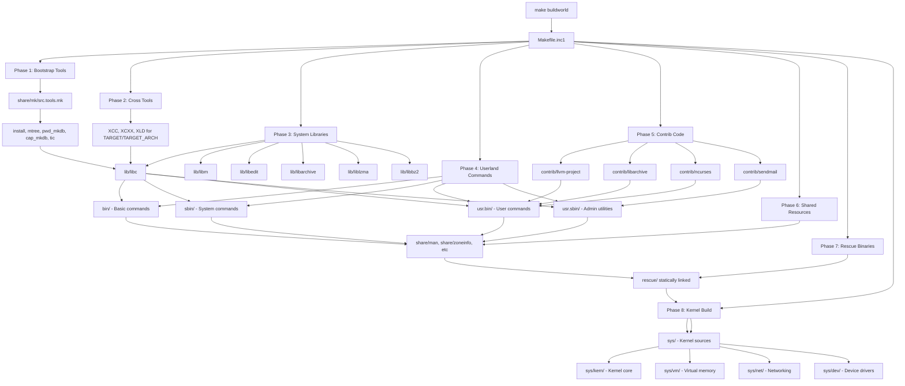

# FreeBSD Source Tree Overview
<!-- This file is auto-generated by generate-doc.py -- do not edit manually -->

---
**Navigation:**
  **Related:** [Kernel Core — Structure and Entry Point](sys/README.md) | [Build System — buildworld and buildkernel](share/mk/README.md)
  **All chapters:** [Boot Process — UEFI Bootloader to Kernel Handoff](stand/efi/loader/README.md) | [Kernel Core — Structure and Entry Point](sys/README.md) | [Build System — buildworld and buildkernel](share/mk/README.md) | [Virtual Memory Subsystem — vm_page, UMA, and Pagers](sys/vm/README.md) | [Process Management — Scheduling and Lifecycle](sys/kern/README_process.md) | [Locking Primitives — Mutexes, sx, rmlocks, and Atomics](sys/kern/README_locking.md) | [Buffer Cache — Block I/O Subsystem](sys/vm/README_bcache.md) | [GEOM — Storage Framework](sys/geom/README.md) ...
---


> ⚠ **UNVERIFIED DRAFT** — reviewer did not explicitly approve this draft. Treat claims as suspect until manually reviewed.


## Quick Summary

The FreeBSD source tree is a large, carefully organized collection of over ten thousand files that together constitute the entire operating system: the kernel, system libraries, base userland commands, boot loaders, configuration templates, and third-party software incorporated under various open-source licenses. Every file in this tree is necessary for building a complete FreeBSD system from scratch. Understanding the layout of this tree is the first step toward reading and modifying FreeBSD source code, whether you are adding a new device driver, patching a system utility, or trying to understand how the operating system works.

The tree is organized around a clear principle: code lives in the directory that matches the destination path where it will be installed. Commands that run on every FreeBSD system, whether invoked by regular users or by root, live in `bin/` and `sbin/` respectively. Commands that are part of the broader userland ecosystem but not strictly required by the base system live in `usr.bin/` and `usr.sbin/`. Libraries that provide the fundamental C API live in `lib/`, kernel sources live in `sys/`, and third-party software contributed from outside the FreeBSD Project lives in `contrib/`, `gnu/`, and `cddl/`. This mapping between source location and installation path is not accidental; it is enforced by the build system itself.

The top-level `README.md` file provides a concise source roadmap, listing each major directory with a one-line description:

```
| Directory | Description |
| --------- | ----------- |
| bin | System/user commands. |
| cddl | Source code for third-party software under the Common Development and Distribution License. |
| contrib | Source code for third-party software. |
| crypto | Source code for cryptographic libraries and commands (see [crypto/README](crypto/README)). |
| etc | Template files for /etc. |
| gnu | Source code for third-party software under the GNU General Public License (GPL) or Lesser General Public License (LGPL). |
| lib | System libraries. |
| rescue | Build system for statically linked /rescue commands. |
| sbin | System commands. |
| share | Shared resources. |
| stand | Boot loader sources. |
| sys | Kernel sources (see [sys/README.md](sys/README.md)). |
| tests | Tests which can be run by Kyua. |
| usr.bin | User commands. |
| usr.sbin | System administration commands. |
```

This file also references the `COPYRIGHT` file for licensing information and links to the FreeBSD handbook for build instructions.

Building the entire FreeBSD tree, commonly called "building world," is initiated by running `make buildworld` from the top-level source directory. The build system, built around the FreeBSD make utility and a collection of include files under `share/mk/`, traverses the directory tree in a carefully defined order. It first builds bootstrap tools that are needed to compile later components, then cross-compilation tools for architectures other than the host, then system libraries, then userland commands, and finally the kernel. Each phase depends on the previous one completing successfully, and the build system uses object directories (`/usr/obj`) to keep build artifacts separate from source files, enabling clean builds and parallel compilation.

The source tree also reflects FreeBSD's commitment to open-source licensing. Code written by FreeBSD contributors is released under the BSD license, but the tree contains substantial amounts of code from other projects: the GNU Compiler Collection runtime libraries under `gnu/`, cryptographic software under `crypto/` and `secure/`, the LLVM/Clang toolchain under `contrib/llvm-project`, and many utilities such as `less`, `ntp`, `sqlite3`, and `sendmail` under `contrib/`. The build system tracks which code belongs to which license group and applies the appropriate build flags and installation rules. This separation allows FreeBSD to incorporate high-quality third-party software while maintaining clear licensing boundaries and making it possible to selectively exclude components by defining `WITHOUT_` variables in `src.conf(5)`.

## Architecture

The top-level `Makefile` at the root of the source tree is intentionally minimal. It delegates the bulk of the build logic to `Makefile.inc1`, which is included by the FreeBSD make utility. This design ensures that even if the installed `make` utility has different built-in variables, the build system can always fall back to the `mk` files shipped in the source tree itself. The `Makefile` itself contains only the `buildworld`, `installworld`, `buildkernel`, and `installkernel` targets; all other targets such as `universe`, `tinderbox`, and `kernels` are implemented in `Makefile.inc1`.

```
make buildworld
    |
    v
Makefile (top-level)
    |
    +--> Makefile.inc1 (included via .include)
              |
              +--> share/mk/src.tools.mk (bootstrap tools)
              +--> share/mk/bsd.own.mk (library, program, kernel rules)
              +--> sys/conf/Makefile.* (kernel build rules)
```

The build process in `Makefile.inc1` proceeds through several distinct phases, each building a subset of the tree. The first phase builds **bootstrap tools** — tiny programs such as `install`, `mtree`, `pwd_mkdb`, and `cap_mkdb` that are compiled against the host compiler and used by the install targets. These are defined in `share/mk/src.tools.mk`. The second phase builds **cross tools** when cross-compiling for a different `TARGET`/`TARGET_ARCH` pair. The third phase builds **system libraries** by walking the `lib/` directory tree. Libraries in `lib/` are categorized by whether they are shared (`SHLIB`), static-only (`LIB`), internal (`INTERNALLIB`), or private (`PRIVATELIB`), and the build system generates appropriate versioned `.so` files and symlink stubs.

The fourth phase builds **userland commands**. Commands are split across four directories based on their intended audience and installation path:

- `bin/` — Basic system commands installed to `/bin` (e.g., `sh`, `ls`, `cp`, `cat`, `chmod`, `date`, `dd`, `df`, `kill`, `mkdir`, `rm`). These are the commands available even in minimal recovery environments.
- `sbin/` — System administration commands installed to `/sbin` (e.g., `init`, `ifconfig`, `mount`, `fsck`, `newfs`, `dump`, `restore`, `reboot`, `kldload`, `kldunload`, `devfs`, `geom`). These require root privileges and manage hardware and system configuration.
- `usr.bin/` — Userland commands installed to `/usr/bin` (e.g., `awk`, `bmake`, `clang`, `diff`, `find`, `ftp`, `less`, `make`, `nc`, `passwd`, `ssh`, `tar`, `vi`). These are part of the broader userland but not strictly required for boot or recovery.
- `usr.sbin/` — System administration utilities installed to `/usr/sbin` (e.g., `bhyve`, `cron`, `config`, `dumpcis`, `ntpd`, `pfctl`, `sendmail`, `snmpd`). These are advanced administration tools.

The build system uses `SUBDIR` variables in each directory's `Makefile` to declare which subdirectories to recurse into. Each subdirectory's `Makefile` specifies `SRCS` (the source files), `CFLAGS` (compiler flags), and installation targets. The `Makefile.inc1` script iterates over these `SUBDIR` lists in a specific order: first `tools/` for ancillary utilities, then `lib/` for libraries, then `bin/`, `sbin/`, `usr.bin/`, `usr.sbin/`, and finally `share/` for shared resources like man pages and locale data.

Third-party code is organized into three main directories. `contrib/` contains software from various open-source projects that is not specifically GNU or CDDL licensed, including `llvm-project`, `bmake`, `bzip2`, `expat`, `flex`, `jemalloc`, `libarchive`, `libedit`, `libevent`, `libpcap`, `lua`, `mandoc`, `ncurses`, `ntp`, `openpam`, `pf`, `sendmail`, `sqlite3`, `tcsh`, and `tcpdump`. `gnu/` contains software under the GPL or LGPL, organized as `gnu/lib/` and `gnu/usr.bin/` to mirror the structure of the base system. Currently, `gnu/lib/` contains `libdialog` and `gnu/usr.bin/` contains `dialog`. `cddl/` contains code licensed under the Common Development and Distribution License, primarily the DTrace implementation.

Architecture-specific kernel code lives under `sys/<arch>/`, where `<arch>` is one of `amd64`, `arm`, `arm64`, `i386`, `powerpc`, `riscv`, or `xen`. The `sys/` directory itself is organized into subsystem directories: `sys/kern/` for the kernel core (process scheduling, thread management, syscalls), `sys/vm/` for virtual memory, `sys/net/` for the networking stack, `sys/fs/` for the virtual file system layer, `sys/ufs/` for the UFS filesystem, `sys/cam/` for the SCSI architecture model, `sys/dev/` for device drivers, and `sys/conf/` for kernel configuration files and build scripts. As noted in `sys/README.md`, the kernel startup sequence bridges the gap between firmware execution and a fully operational userland environment, using the `sysinit` framework to order initialization.

The boot loader sources live in `stand/`, organized by architecture (`stand/i386/`, `stand/efi/`, `stand/arm64/`, `stand/powerpc/`) with shared code in `stand/common/`. The `stand/libsa/` directory contains the System Abstraction layer, a portable C library used by all boot loaders. The `rescue/` directory builds statically linked binaries of all `bin/` and `sbin/` commands into a single binary installed to `/rescue`, providing a recovery environment when the main system libraries are incompatible after an upgrade.

The build system uses object directories (`/usr/obj`) to separate build artifacts from source. The `OBJTOP` variable controls the root of the object directory tree. This separation enables incremental builds, parallel compilation, and clean removal of all build artifacts. The `SRCDIR` variable points to the source tree root, and `DESTDIR` points to the staging area where files are installed before being moved to their final locations.

## Flow / Diagram



## Advanced Notes

The FreeBSD build system supports fine-grained control through `src.conf(5)`. Developers can selectively disable components using `WITHOUT_` variables such as `WITHOUT_CASPER`, `WITHOUT_GCOV`, `WITHOUT_INETD`, `WITHOUT_MAN`, `WITHOUT_NLS`, `WITHOUT_TESTS`, and `WITHOUT_WIRELESS`. These flags propagate through the `SUBDIR` recursion, preventing unnecessary compilation of components that are not needed for a given build. The `WITH_` variables enable optional features such as `WITH_CTF` (DTrace CTF conversion), `WITH_DEBUG` (build debug symbols), and `WITH_LIB32` (build 32-bit compatibility libraries on 64-bit hosts).

The `UPDATING` file in the source tree root contains release-specific notes about changes that may affect building or upgrading the system. Each entry is dated and describes build-related changes, such as new dependencies, KAPI changes, or required rebuild sequences. For example:

```
20251222:
    Commit 9f49f436a9ec changed the internal KAPI between the NFS
    modules. As such, nfscommon, nfscl and nfsd must all be rebuilt
    from sources.
```

Users should consult `UPDATING` before performing a `buildworld` on a -CURRENT or -STABLE tree to ensure they follow any required steps in the correct order. The file also notes that items affecting the ports and packages system can be found in `/usr/ports/UPDATING`, and directs users to the FreeBSD handbook for general build guidance.

The `SUBDIR_OVERRIDE` variable is a useful debugging tool. Setting `SUBDIR_OVERRIDE="lib/libc usr.bin/awk"` causes the build system to skip all other directories and only build the specified ones. This is invaluable when iterating on a single component without waiting for the entire tree to rebuild. However, it requires that all dependencies of the overridden components already exist in `DESTDIR`, so it is typically used after a full build has completed.

The `DIRDEPS_BUILD` system, referenced in the `targets/` directory, was an experimental dependency-tracking build system that analyzed the actual file-level dependencies between components and built them in the correct order without requiring explicit `SUBDIR` ordering. While not the default, it demonstrates FreeBSD's ongoing interest in improving build performance for large trees.

When building the kernel, the `make buildkernel` target reads kernel configuration files from `sys/conf/` and architecture-specific directories. The kernel build process uses makefiles in `sys/conf/` (such as `config.mk`, `kern.mk`, and architecture-specific `Makefile.*` files) to process configuration options and generate the appropriate source files and headers. The kernel build uses a separate object directory tree under `${OBJTOP}/usr/obj/sys/`, keeping kernel build artifacts separate from userland.

The `rescue/` directory is particularly important for system upgrades. When `installworld` is run, it first installs a statically linked rescue binary to `/rescue` before replacing the shared libraries. This ensures that even if the new libraries are incompatible with the old binaries, administrators can still run essential commands like `fsck`, `mount`, and `ifconfig` from the rescue environment to repair the system. The rescue binary is built by compiling all `bin/` and `sbin/` commands with `-static` and linking them into a single executable using the `librescue/` infrastructure.

DTrace integration is controlled by the `MK_CTF` and `MK_DTRACE` variables. When enabled, the build system runs the `ctfconvert` and `ctfmerge` tools on compiled objects to embed CTF (Compact C Type Format) data, which DTrace uses for type information at runtime. The `WITHOUT_CTF` flag disables this step. The DTrace probes themselves are defined as SDT (System DTrace Provider) probes in kernel source files, with probe names such as `ip:::receive` and `kern:::fork`. These probes are used extensively by the DTrace tooling for performance analysis and debugging.

The `share/mk/` directory contains the core build rules that are included by every Makefile in the tree. The most important files are `bsd.README.mk` (the makefile documentation), `bsd.compiler.mk` (compiler detection and flags), `bsd.lib.mk` (library build rules), `bsd.prog.mk` (program build rules), `bsd.kern.mk` (kernel module build rules), and `bsd.obj.mk` (object directory management). These files define the variables and targets that make every component in the tree buildable with a consistent interface.

## See Als
- [The FreeBSD Kernel — Structure and Entry Point](../../sys/README.md)
o

- `sys/README.md` — Kernel structure, entry points, and the `sysinit` framework
- `sys/vm/` — Virtual memory subsystem (covered in its own chapter)
- `sys/kern/` — Kernel core: process management, scheduling, and syscalls (covered in its own chapter)
- `sys/net/` — Network stack architecture (covered in its own chapter)
- `sys/fs/` — Virtual file system layer (covered in its own chapter)
- `sys/dev/` — Device driver infrastructure
- `stand/` — Boot loader sources and System Abstraction layer
- `rescue/` — Rescue binary infrastructure for system upgrades
- `share/mk/` — Build system include files (`bsd.lib.mk`, `bsd.prog.mk`, `bsd.compiler.mk`)
- `build(7)` — Manual page for the build system
- `src.conf(5)` — Configuration variables for selective build components
- `UPDATING` — Release-specific build instructions and known issues
- `tests/` — Test suite infrastructure (see `tests/README`)

---

> _Generated by [DaemonDocs](https://github.com/ocochard/DaemonDocs) on 2026-04-29 07:10 UTC using model `Qwen3.6-35B-A3B-UD-Q4_K_XL` (llama.cpp build `b8929-9d34231bb`). AI-generated content — verify against source before relying on it._
