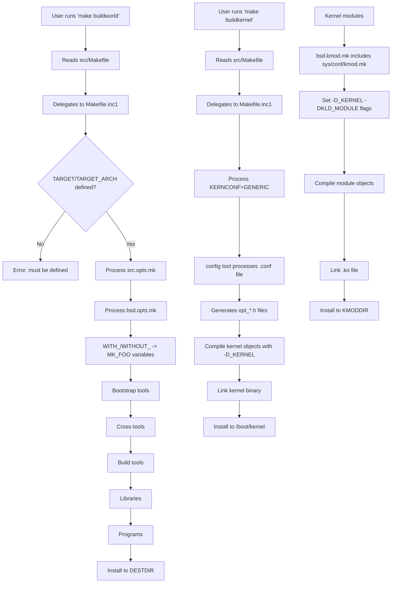

# Build System — buildworld and buildkernel
<!-- This file is auto-generated by generate-doc.py -- do not edit manually -->

---
**Navigation:**
  **Up:** [Source Tree — Layout and Conventions](../../README_internals.md)
  **Related:** [Source Tree — Layout and Conventions](../../README_internals.md) | [Boot Process — UEFI Bootloader to Kernel Handoff](../../stand/efi/loader/README.md)
  **All chapters:** [Source Tree — Layout and Conventions](../../README_internals.md) | [Boot Process — UEFI Bootloader to Kernel Handoff](../../stand/efi/loader/README.md) | [Kernel Core — Structure and Entry Point](../../sys/README.md) | [Virtual Memory Subsystem — vm_page, UMA, and Pagers](../../sys/vm/README.md) | [Process Management — Scheduling and Lifecycle](../../sys/kern/README_process.md) | [Locking Primitives — Mutexes, sx, rmlocks, and Atomics](../../sys/kern/README_locking.md) | [Buffer Cache — Block I/O Subsystem](../../sys/vm/README_bcache.md) | [GEOM — Storage Framework](../../sys/geom/README.md) ...
---


> ⚠ **UNVERIFIED DRAFT** — reviewer did not explicitly approve this draft. Treat claims as suspect until manually reviewed.


## Quick Summary

FreeBSD uses a hierarchical Makefile-based build system that can compile the entire operating system — userland programs, libraries, kernel, and documentation — from a single source tree. The system is built around the `make(1)` command and a collection of `.mk` include files that define how to compile, link, and install each component. At the top level, a simple `Makefile` delegates to `Makefile.inc1`, which orchestrates the full build sequence through targets like `buildworld` and `buildkernel`.

The build system separates concerns into modular pieces. `bsd.prog.mk` handles building userland programs with compiler flags and linker options. `bsd.kmod.mk` handles kernel modules. `bsd.sys.mk` defines common compiler settings and warning levels. Each directory in the source tree has a `Makefile` that includes the appropriate `.mk` files and lists source files or subdirectories. The system supports out-of-tree builds where object files are placed in separate directories, keeping the source tree clean.

Kernel builds work differently from userland builds. A kernel configuration file (like `GENERIC`) is processed by the `config` tool, which generates C source files for device drivers and syscall tables. These generated files are then compiled and linked into a single kernel binary. The build system tracks dependencies between source files and headers, and can rebuild only what is necessary when sources change.

The build system also supports cross-compilation, allowing FreeBSD to be built for different architectures from a single host. The `universe` target builds all supported architectures and kernels simultaneously. Build options are controlled through `src.conf(5)`, which allows fine-grained control over what gets built and which features are enabled or disabled.

## Architecture

The FreeBSD build system follows a layered architecture where each layer builds on the previous one. At the entry point, the top-level `Makefile` (101 lines) is deliberately simple. It does not contain build rules; instead, it delegates to `Makefile.inc1` through a child `make` process. This design ensures that the build uses the `.mk` files from the source tree rather than any installed versions, which is critical during system upgrades.

```makefile
# From src/Makefile, lines 55-63
# This makefile is simple by design. The FreeBSD make automatically reads
# the /usr/share/mk/sys.mk unless the -m argument is specified on the
# command line. By keeping this makefile simple, it doesn't matter too
# much how different the installed mk files are from those in the source
# tree. This makefile executes a child make process, forcing it to use
# the mk files from the source tree which are supposed to DTRT.
```

`Makefile.inc1` at the source root is the central orchestrator. It defines the `buildworld` and `buildkernel` targets, sets up cross-compilation variables (`XCC`, `XCXX`, `XLD`, `XCPP`), and manages the build order. The file enforces that `TARGET` and `TARGET_ARCH` are defined before any build proceeds:

```makefile
# From Makefile.inc1, lines 50-52
.if !defined(TARGET) || !defined(TARGET_ARCH)
.error Both TARGET and TARGET_ARCH must be defined.
.endif
```

The `.mk` files in `share/mk/` form the core library of build rules. Key files include:

- `bsd.sys.mk` — Defines compiler settings including C standards (`CSTD`, `CXXSTD`), warning levels (`WARNS`), and compiler-specific flags. The `WARNS` variable controls compiler warning severity from 1 to 6.
- `bsd.prog.mk` — Handles building userland programs with support for ELF hardening features like RELRO (`-zrelro`), PIE (`-fPIE`/`-pie`), and retpoline (`-mretpoline`).
- `bsd.kmod.mk` — Handles kernel module building, includes `bsd.sysdir.mk` and `sys/conf/kmod.mk`.
- `bsd.dep.mk` — Manages dependency tracking between source files and headers.
- `bsd.obj.mk` — Manages object directory creation for out-of-tree builds.

The `tools/build/make.py` script provides a Python wrapper that bootstraps a compatible version of `bmake` and infers required compiler variables, making it easier to build on non-FreeBSD systems.

### Makefile Include Chain

The include chain in the build system follows a specific order to ensure proper variable initialization:

1. `bsd.opts.mk` — Defines option lists (`__DEFAULT_YES_OPTIONS`, `__DEFAULT_NO_OPTIONS`, etc.) and includes `bsd.mkopt.mk` to process them
2. `bsd.compiler.mk` — Detects compiler type (clang/gcc), version, and features
3. `bsd.init.mk` — Includes `bsd.opts.mk`, `Makefile.inc`, and `bsd.own.mk`
4. `bsd.obj.mk` — Sets up object directory handling
5. `bsd.dep.mk` — Sets up dependency tracking
6. `bsd.prog.mk` / `bsd.kmod.mk` — Final build rules

This layered approach means that each `.mk` file only needs to know about the variables set by its predecessors, creating a clean separation of concerns.

### Option Processing

Build options are processed through a systematic mechanism. Users define `WITH_FOO` or `WITHOUT_FOO` in `/etc/src.conf` or on the command line. The `bsd.opts.mk` file defines the option lists (which options default to `yes` vs `no`), and then includes `bsd.mkopt.mk` which provides the generic mechanism to translate `WITH_`/`WITHOUT_` options into `MK_FOO={yes,no}` variables:

```makefile
# From bsd.mkopt.mk
# For each option FOO in __DEFAULT_YES_OPTIONS, MK_FOO is set to
# "yes", unless WITHOUT_FOO is defined, in which case it is set to "no".
# For each option FOO in __DEFAULT_NO_OPTIONS, MK_FOO is set to "no",
# unless WITH_FOO is defined, in which case it is set to "yes".
```

The `src.opts.mk` file defines FreeBSD-specific options like `ACPI`, `DTRACE`, `ZFS`, and `JAIL`. The `bsd.opts.mk` file defines build-system options like `WARNS`, `RELRO`, `SSP`, and `CTF`.

## Key Data Structures

The FreeBSD build system manages complex state and relationships through several internal data structures, primarily governed by `make(1)` and the `.mk` include files. These structures govern how options are processed, how dependencies are tracked, and how the build environment is propagated.

### The Makefile Variable Environment

At the core of the build system is the `make(1)` variable environment. Variables are defined hierarchically and cascade through the include chain. When a `.mk` file is included, it may define or override variables that affect subsequent files. The build system relies heavily on `MK_FOO` variables (e.g., `MK_ZFS`, `MK_CTF`) which are derived from `WITH_FOO`/`WITHOUT_FOO` options set by the user in `src.conf(5)`.

The variable environment is also responsible for propagating compiler flags (`CFLAGS`, `CXXFLAGS`, `LDFLAGS`) and tool paths (`CC`, `CXX`, `LD`) across different build stages. Cross-compilation is achieved by setting `XCC`, `XCXX`, `XLD`, and `XCPP` variables, which override the default host compiler with the target-specific toolchain.

### Dependency Graph (DIRDEPS_BUILD Mode)

In standard build mode, dependencies are tracked at the file level using `.depend` files generated by `mkdep`. However, when `MK_DIRDEPS_BUILD` is enabled, the build system constructs a directed acyclic graph (DAG) of directory dependencies. This graph represents the build order at the directory level, ensuring that parent directories are built before child directories that depend on them.

The dependency graph is calculated once at the beginning of the build (`.MAKE.LEVEL==0`) and is used to order build targets. This approach significantly reduces the overhead of file-level dependency checking for large source trees, as entire directories can be processed in parallel once their parent dependencies are satisfied.

### Option Processing State (`bsd.opts.mk`)

The option processing mechanism maintains a state that maps user-defined `WITH_`/`WITHOUT_` options to internal `MK_FOO` variables. This state is managed by `bsd.opts.mk` and `bsd.mkopt.mk`. The process involves:

1. Defining default option lists (`__DEFAULT_YES_OPTIONS`, `__DEFAULT_NO_OPTIONS`) in `bsd.opts.mk`.
2. Processing user overrides from `src.conf(5)` or the command line.
3. Translating `WITH_FOO`/`WITHOUT_FOO` into `MK_FOO={yes,no}` variables.

This state machine ensures that build options are consistently applied across all `.mk` files, allowing fine-grained control over which features are compiled into the system.

## Deep Dive

### The buildworld Target

The `buildworld` target orchestrates the full userland build. It follows a specific sequence:

1. **Bootstrap tools** — Build essential tools needed for the build process itself (like `mktemp`, `install`)
2. **Cross-tools** — Build cross-compilation tools if building for a different architecture
3. **Build tools** — Build tools used during the build process
4. **Libraries** — Build system libraries
5. **Programs** — Build userland programs
6. **Install** — Install everything to `DESTDIR`

The actual buildworld orchestration is implemented in `share/mk/src.tools.mk`, which defines tool targets such as `INSTALL_CMD`, `MTREE_CMD`, `PWD_MKDB_CMD`, and others. The `Makefile.inc1` file includes `share/mk/src.tools.mk` and sets up cross-compilation variables before including it:

```makefile
# From Makefile.inc1, line 62
.include "share/mk/src.tools.mk"
```

The `src.tools.mk` file defines the tool commands used during `buildworld`:

```makefile
# From share/mk/src.tools.mk
INSTALL_CMD?=   install
MTREE_CMD?=     mtree
PWD_MKDB_CMD?=  pwd_mkdb
SERVICES_MKDB_CMD?=   services_mkdb
CAP_MKDB_CMD?=  cap_mkdb
TIC_CMD?=       tic
```

### The buildkernel Target

The `buildkernel` target works differently from `buildworld`. It processes kernel configuration files and builds the kernel binary. The `KERNCONF` variable defaults to `GENERIC` and can be overridden on the command line (e.g., `make buildkernel KERNCONF=MYKERNEL`):

```makefile
# From sys/conf/kern.pre.mk, lines 15-16
.if exists(${SRCTOP}/src.conf)
SRCCONF?=       ${SRCTOP}/src.conf
.else
SRCCONF?=       /etc/src.conf
.endif
```

The kernel build processes the configuration file (defaulting to `GENERIC` unless overridden with `KERNCONF=`) through the `config` tool. This generates C source files for device drivers and syscall tables, which are then compiled and linked. The generated files include `opt_global.h`, `opt_inet.h`, `opt_inet6.h`, and other `opt_*.h` files that encode kernel configuration options:

```makefile
# From sys/conf/config.mk
opt_global.h:
        touch ${.TARGET}
        @echo "#define SMP 1" >> ${.TARGET}
        @echo "#define MAC 1" >> ${.TARGET}
        @echo "#define VIMAGE 1" >> ${.TARGET}
        @awk '$$1 == "options" && $$2 !~ "GEOM_" { print "#define ", $$2, " 1"; }'              < ${SYSDIR}/${MACHINE}/conf/DEFAULTS                >>  ${.TARGET}
```

The kernel CFLAGS include the generated option headers:

```makefile
# From sys/conf/kern.pre.mk, line 81
CFLAGS+= ${INCLUDES} -D_KERNEL -DHAVE_KERNEL_OPTION_HEADERS -include opt_global.h
```

### Kernel Module Building

Kernel modules are built using `bsd.kmod.mk`, which includes `sys/conf/kmod.mk`. The key variables for building a kernel module include:

```makefile
# From sys/conf/kmod.mk
KMOD          The name of the kernel module to build.
KMODDIR       Base path for kernel modules (see kld(4)). [/boot/kernel]
SRCS          List of source files.
KMODLOAD      Command to load a kernel module [/sbin/kldload]
KMODUNLOAD    Command to unload a kernel module [/sbin/kldunload]
```

The `bsd.kmod.mk` file sets up the compiler flags for kernel module compilation, including `-D_KERNEL` and `-DKLD_MODULE`:

```makefile
# From sys/conf/kmod.mk
CFLAGS+=      -D_KERNEL
CFLAGS+=      -DKLD_MODULE
.if defined(MODULE_TIED)
CFLAGS+=      -DKLD_TIED
.endif
```

### Dependency Tracking

Dependency tracking is managed by `bsd.dep.mk`. The system uses `mkdep` to generate dependency files that track which headers each source file includes. These dependencies are stored in `${DEPENDFILE}` (typically `.depend`).

```makefile
# From bsd.dep.mk
.if ${MK_DIRDEPS_BUILD} == "no"
.MAKE.DEPENDFILE= ${DEPENDFILE}
.endif
CLEANDEPENDFILES+=        ${DEPENDFILE} ${DEPENDFILE}.*
```

The dependency tracking supports several modes:
- **Standard mode** — Uses `.depend` files generated by `mkdep`
- **META_MODE** — Uses the filemon kernel module to track file access at runtime
- **DIRDEPS_BUILD** — Uses a directed acyclic graph of directory dependencies

### Out-of-Tree Builds

Out-of-tree builds are a key feature of the FreeBSD build system. Object files are placed in a separate directory tree, keeping the source tree clean. This is managed by `bsd.obj.mk`:

```makefile
# From bsd.obj.mk
# The following directories are tried in order for ${.OBJDIR}:
# 1.  ${MAKEOBJDIRPREFIX}/`pwd`
# 2.  ${MAKEOBJDIR}
# 3.  obj.${MACHINE}
# 4.  obj
# 5.  /usr/obj/`pwd`
# 6.  ${.CURDIR}
```

Environment variables `MAKEOBJDIR` and `MAKEOBJDIRPREFIX` allow users to specify custom object directory locations. If neither is set, objects are placed in `/usr/obj/`pwd`` by default.

### Cross-Compilation

Cross-compilation is supported through the `TARGET` and `TARGET_ARCH` variables. The build system sets up cross-compilation variables (`XCC`, `XCXX`, `XLD`, `XCPP`) that point to the cross-compiler toolchain:

```makefile
# From Makefile.inc1
.if defined(CROSS_TOOLCHAIN)
.if exists(${LOCALBASE}/share/toolchains/${CROSS_TOOLCHAIN}.mk)
.include "${LOCALBASE}/share/toolchains/${CROSS_TOOLCHAIN}.mk"
.elif exists(${CROSS_TOOLCHAIN})
.include "${CROSS_TOOLCHAIN}"
.else
.error CROSS_TOOLCHAIN ${CROSS_TOOLCHAIN} not found
.endif
CROSSENV+=CROSS_TOOLCHAIN="${CROSS_TOOLCHAIN}"
.endif
```

The `tools/build/make.py` script provides a convenient wrapper for cross-compilation, allowing users to specify a cross toolchain path:

```python
# From tools/build/make.py
# On Linux and MacOS you may need to explicitly indicate the cross toolchain
# to use. You can do this by:
# - setting XCC/XCXX/XLD/XCPP to the paths of each tool
# - using --cross-bindir to specify the path to the cross-compiler bindir
```

## Flow / Diagram



## Advanced Notes

### META_MODE and filemon

META_MODE is an advanced build mode that uses the filemon kernel module to track file access at runtime. This provides more accurate dependency tracking than traditional `.depend` files, as it captures files accessed during compilation (like include files found through compiler search paths) rather than just those explicitly mentioned in the source.

```makefile
# From bsd.dep.mk
.if ${MK_META_MODE} == "yes"
CLEANDEPENDFILES+=        *.meta
.endif
```

To use META_MODE effectively, load the filemon module before building:

```sh
kldload filemon
```

### DIRDEPS_BUILD

DIRDEPS_BUILD is an experimental build mode that uses a directed acyclic graph (DAG) of directory dependencies to optimize build ordering. This mode is controlled by the `MK_DIRDEPS_BUILD` variable:

```makefile
# From bsd.dep.mk
.if ${MK_DIRDEPS_BUILD} == "no"
.MAKE.DEPENDFILE= ${DEPENDFILE}
.endif
```

In DIRDEPS_BUILD mode, the dependency graph is calculated only at `.MAKE.LEVEL==0`, and build targets are ordered based on the graph rather than individual file dependencies. This can significantly speed up builds for large source trees.

### Performance Tuning

Several variables can be used to tune build performance:

- `MAKE_JOBS` — Number of parallel jobs (default is determined by the system)
- `MAKE_JOBS_NUMBER` — Override the number of parallel jobs
- `MK_CCACHE_BUILD` — Enable ccache for faster recompilation
- `MK_AUTO_OBJ` — Enable automatic object directory creation

For example, to build with 8 parallel jobs and ccache:

```sh
env MAKE_JOBS=8 MK_CCACHE_BUILD=yes make -j8 buildworld
```

### Common Pitfalls

1. **Stale object directories** — If object directories become corrupted, clean them with `make cleandir` before rebuilding.

2. **Compiler mismatch** — Ensure the compiler version matches what the source tree expects. The `bsd.compiler.mk` file detects compiler features automatically, but mismatched compilers can cause build failures.

3. **Missing dependencies** — If a header file changes but the `.depend` file is not updated, the affected source files may not be recompiled. Run `make cleandepend` to regenerate dependency files.

4. **DESTDIR confusion** — Remember that `buildworld` installs to `DESTDIR`, not to the live system. To install to the live system, use `make installworld DESTDIR=/`.

5. **Cross-compilation environment** — When cross-compiling, ensure all toolchain variables (`XCC`, `XCXX`, `XLD`, `XCPP`) are correctly set, or use the `CROSS_TOOLCHAIN` mechanism.

### Connection to OS Theory

The FreeBSD build system exemplifies several concepts from operating system theory:

- **Modularity** — The layered architecture of `.mk` files mirrors the principle of separation of concerns, where each layer has a single responsibility.

- **Incremental builds** — Dependency tracking enables incremental builds, a fundamental concept in build systems that minimizes rebuild time by only recompiling changed components.

- **Cross-compilation** — The ability to build for different architectures demonstrates the concept of toolchain isolation, where the build environment is independent of the target environment.

- **Out-of-tree builds** — Separating build artifacts from source code is a best practice that enables multiple builds from the same source tree and simplifies cleanup.

## See Also
- [Boot Process — UEFI Bootloader to Kernel Handoff](../../stand/efi/loader/README.md)
- [Source Tree — Layout and Conventions](../../README_internals.md)


Key source files to explore:
- `src/Makefile` — Top-level makefile
- `src/Makefile.inc1` — Central orchestrator
- `share/mk/bsd.sys.mk` — Common compiler settings
- `share/mk/bsd.prog.mk` — Userland program building
- `share/mk/bsd.kmod.mk` — Kernel module building
- `share/mk/bsd.obj.mk` — Object directory management
- `share/mk/bsd.dep.mk` — Dependency tracking
- `share/mk/bsd.opts.mk` — Option processing
- `share/mk/bsd.mkopt.mk` — Option translation mechanism
- `share/mk/src.opts.mk` — FreeBSD-specific options
- `sys/conf/kmod.mk` — Kernel module compilation rules
- `sys/conf/config.mk` — Kernel config processing
- `sys/conf/kern.pre.mk` — Kernel build settings
- `usr.sbin/config/config.h` — Config tool data structures
- `tools/build/make.py` — Python wrapper for building

---

> _Generated by [DaemonDocs](https://github.com/ocochard/DaemonDocs) on 2026-05-01 02:36 UTC using model `Qwen3.6-35B-A3B-UD-Q4_K_XL` (llama.cpp build `b8985-27aef3dd9`). AI-generated content — verify against source before relying on it._
