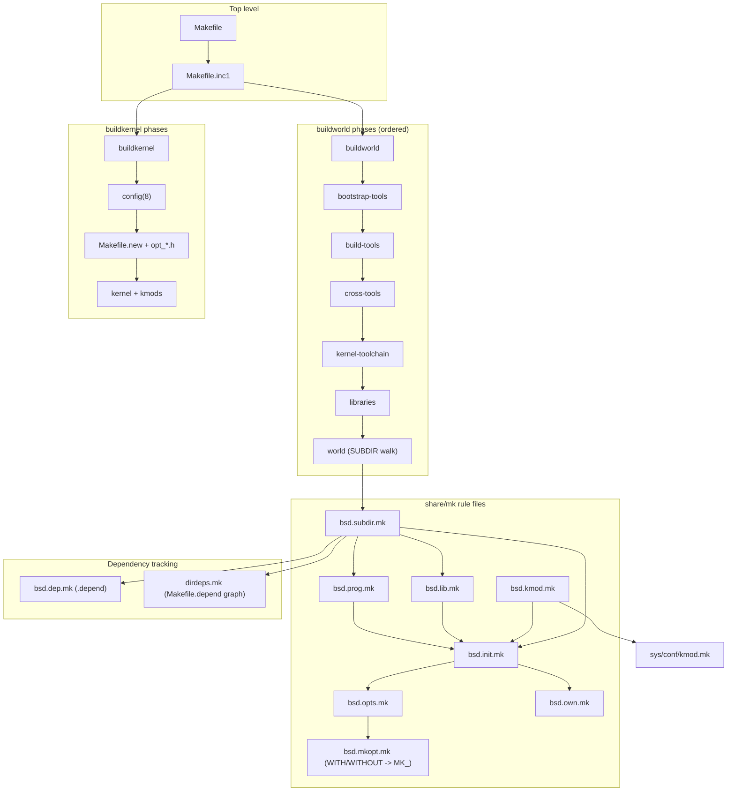

# Build System — buildworld and buildkernel
<!-- This file is auto-generated by generate-doc.py -- do not edit manually -->

---
**Navigation:**
  **Up:** [Source Tree — Layout and Conventions](../../README_internals.md)
  **Related:** [Source Tree — Layout and Conventions](../../README_internals.md) | [Boot Process — UEFI Bootloader to Kernel Handoff](../../stand/efi/loader/README.md)
  **All chapters:** [Source Tree — Layout and Conventions](../../README_internals.md) | [Boot Process — UEFI Bootloader to Kernel Handoff](../../stand/efi/loader/README.md) | [Kernel Core — Structure and Entry Point](../../sys/README.md) | [System Calls and Image Activation — Entry, sysent, and exec](../../sys/kern/README_syscall.md) | [Kernel Modules and the Linker — KLD, SYSINIT, and linker sets](../../sys/kern/README_kld.md) | [Virtual Memory Subsystem — vm_page, UMA, and Pagers](../../sys/vm/README.md) | [Process Management — Scheduling and Lifecycle](../../sys/kern/README_process.md) | [Locking Primitives — Mutexes, sx, rmlocks, and Atomics](../../sys/kern/README_locking.md) ...
---


## Quick Summary

FreeBSD is built from a single source tree by a hierarchical [`make(1)`](../../contrib/bmake/make.1) system. A developer runs `make buildworld` (to build the entire userspace and the toolchain it needs) or `make buildkernel` (to build one kernel from a configuration file), and that one command fans out into thousands of smaller `make` invocations, one per source directory. The policy of *how* to build is not written in any one place: it lives in a shared library of rule files under `share/mk/`, each of which knows how to compile, link, and install one *kind* of thing — a program, a shared library, a kernel module, or a directory that merely recurses into its children. Every per-directory `Makefile` is thin: it names its inputs (`SRCS`, `LIB`, `PROG`) and then pulls in the appropriate rule file, so the *how* is centralized while the *what* is local. This split is what lets the tree build tens of thousands of components with a single consistent set of rules instead of one-off recipes per directory.

The two top-level targets differ in what they produce. `buildworld` rebuilds the whole userspace in a fixed sequence of phases — first a minimal set of host tools, then the build tools, then the cross compilers, then the kernel toolchain, then the libraries, and finally the rest of the tree — so that each phase is compiled with the newest available compiler rather than the host's possibly-older one. `buildkernel` takes a declarative kernel configuration (such as `GENERIC`) and turns it into one monolithic kernel image plus a set of loadable kernel modules. The bridge between the two is the [`config(8)`](../../usr.sbin/config/config.8) tool, which reads the `.conf` file and the `files`/`options` tables and generates both the C preprocessor headers that select which source code to compile and the `Makefile` that lists exactly which object files to build. This translation is what lets a single kernel source tree yield a tiny embedded kernel or a full-featured one without editing any C code.

The build is *out of tree* by default: object files and generated sources are placed under a parallel object directory (conventionally `/usr/obj` mirroring the source path, controlled by `OBJDIR`/`OBJTOP`), so the source tree stays clean and several different target architectures can be built side by side from the same checkout. Options are controlled through [`src.conf(5)`](../man/man5/src.conf.5) and [`make.conf(5)`](../man/man5/make.conf.5) using `WITH_*`/`WITHOUT_*` names, which the build system internally rewrites into `MK_*` variables that every rule file tests.

Finally, the build tracks dependencies at two scales — a per-object `.depend` file generated by the preprocessor, and a directory-level graph (`dirdeps`) that orders and parallelizes the whole tree — so an incremental build recompiles only what actually changed.

## Glossary

**MK_ option** — the internal `yes`/`no` build variable (e.g. `MK_OPENSSH`) that rule files test; it is the canonical form of a user-facing `WITH_*`/`WITHOUT_*` choice after the build system has applied defaults, dependent options, and per-arch overrides.

**bootstrap-tools** — the first phase of `buildworld`, which builds a minimal set of host tools from the new source (a small `make`, a `cc` wrapper, and a handful of libc stubs) before the rest of the tree is compiled, so the build does not depend on the host's older toolchain.

**out-of-tree build** — a build in which every generated file (objects, `.depend`, generated headers) is written to a parallel object directory, conventionally `/usr/obj`, instead of next to the sources, keeping the checkout clean and read-only.

**dirdeps** — the directory-level dependency graph maintained by `share/mk/dirdeps.mk`; it records which source directories depend on which others so `make` can order and parallelize the whole tree rather than trusting a fixed `SUBDIR` list.

**.depend file** — the per-directory dependency file (`DEPENDFILE`) produced by the C preprocessor during `make depend`, mapping each object to the headers it includes so that a changed header triggers a recompile of only the affected objects.

**kernel configuration file (.conf)** — a declarative file (e.g. `GENERIC`) listing the `cpu`, `ident`, `device` lines, and `options` that select which kernel source files and preprocessor macros to compile; it is the input to [`config(8)`](../../usr.sbin/config/config.8).

**files table** — the `sys/conf/files` (and `files.<machine>`) table that maps each kernel source file to the option that gates it, the object-name prefix, and any special `compile-with` rule; [`config(8)`](../../usr.sbin/config/config.8) reads it to decide what to build.

**WORLDTMP** — a staging directory (a scratch root) where the bootstrap and build tools are installed before they are used to compile the rest of the tree, so a freshly built `cc`/`make` can be exercised before the real `installworld`.

## Architecture

The entry point is the top-level `Makefile`, which is deliberately simple: it documents the user-facing targets (`buildworld`, `buildkernel`, `universe`, `worlds`, `kernels`, `installworld`, `installkernel`, `xdev`, and the `check-old`/`delete-old` upgrade helpers) and then spawns a child `make` forced to use the rule files from the source tree rather than the installed `/usr/share/mk` ones. The comment in that file states the design intent directly — "This makefile is simple by design ... By keeping this makefile simple, it doesn't matter too much how different the installed mk files are from those in the source tree." Most of the user-driven targets are implemented in `Makefile.inc1`, which is the real orchestrator.

`Makefile.inc1` begins by enforcing that `TARGET` and `TARGET_ARCH` are both defined (`.error Both TARGET and TARGET_ARCH must be defined.`), then includes `share/mk/src.tools.mk` and sets up cross-toolchain variables (`XCC`, `XCXX`, `XCPP`, `XLD`, `CROSS_TOOLCHAIN`). It exposes a family of `LOCAL_*` variables — `LOCAL_DIRS`, `LOCAL_ITOOLS`, `LOCAL_LIB_DIRS`, `LOCAL_BSTOOL_DIRS`, `LOCAL_TOOL_DIRS`, `LOCAL_XTOOL_DIRS`, `LOCAL_MTREE`, `LOCAL_LEGACY_DIRS` — that let a developer inject extra directories or tools into each buildworld phase, and `WORLD_FLAGS`/`KERNEL_FLAGS` to pass extra flags into the recursive `make` calls. `SUBDIR_OVERRIDE` lets a developer build only a slice of the tree. The `buildworld` target walks the phases in order; `buildkernel` runs [`config(8)`](../../usr.sbin/config/config.8) and then recurses into the kernel build directory.

The rule files under `share/mk/` form a small include lattice. Every rule file that actually builds something starts by including `share/mk/bsd.init.mk`, whose job (per its header comment) is to "include `<bsd.opts.mk>`, `../Makefile.inc` and `<bsd.own.mk>`; this is used at the top of all `<bsd.*.mk>` files that actually build something." `bsd.init.mk` pulls in `bsd.opts.mk` *early* "so Makefile.inc can use the MK_FOO variables," then the per-tree `../Makefile.inc` if present, then `bsd.own.mk`. It also implements the `_SKIP_BUILD` logic: when `MK_DIRDEPS_BUILD == "yes"` and `.MAKE.LEVEL == 0`, the top-level `make` only walks the dependency graph and does not compile anything, so a full tree build can be planned before any object is produced.

The option mechanism is the connective tissue between [`src.conf(5)`](../man/man5/src.conf.5) and the rule files. `share/mk/bsd.opts.mk` declares which options exist and their defaults in four lists — `__DEFAULT_YES_OPTIONS`, `__DEFAULT_NO_OPTIONS`, `__DEFAULT_DEPENDENT_OPTIONS`, and `__SINGLE_OPTIONS` — and then includes `share/mk/bsd.mkopt.mk`. `bsd.mkopt.mk` is the generic translator: for each option in `__DEFAULT_YES_OPTIONS` it sets `MK_FOO=yes` unless `WITHOUT_FOO` is defined (in which case `MK_FOO=no`); for `__DEFAULT_NO_OPTIONS` it inverts the sense; and "If both WITH_FOO and WITHOUT_FOO are defined, WITHOUT_FOO wins." Dependent options (`FOO/BAR`) inherit `MK_BAR`'s value unless the user overrides them. The userland options that build `/usr/src` live in `src.opts.mk` (included by the top-level build), while `bsd.opts.mk` itself carries only the options the `bsd.*.mk` rule files need directly.

The per-kind rule files are the leaves of the lattice. `share/mk/bsd.prog.mk` builds an executable from `SRCS` (deriving `OBJS`, handling PIE (Position Independent Executable) via `MK_PIE`, splitting out `.debug` files via `MK_DEBUG_FILES`, and applying ELF hardening like `-zrelro`/`-znow`); `share/mk/bsd.lib.mk` builds static and shared libraries (with `INTERNALLIB` and `PRIVATELIB` variants); `share/mk/bsd.kmod.mk` builds kernel modules by including `bsd.sysdir.mk` (which locates `SYSDIR`) and then `${SYSDIR}/conf/kmod.mk`; and `share/mk/bsd.subdir.mk` is the recursion engine that visits each entry in `SUBDIR` and runs the same target in each child, using `SUBDIR_PARALLEL` and `.WAIT` to order and parallelize. The dependency layer is `share/mk/bsd.dep.mk` (per-object `.depend`) plus `share/mk/dirdeps.mk` (the directory graph driven by `Makefile.depend` files).

Beneath these rule files sits a shared settings file, `share/mk/bsd.sys.mk`, whose header comment states that it "contains common settings used for building FreeBSD sources." It provides the common build variables and rules shared across the tree's builds — and, in particular, the kernel build, where the monolithic kernel and the kmod builds both draw on the same compiler and warning settings rather than each redeclaring them. It includes `<bsd.compiler.mk>`, pins the C/C++ language standard (`CSTD`/`CXXSTD`), and turns the `WARNS` level into the concrete `CWARNFLAGS` that the objects are compiled with. Key variables it sets:

```make
# share/mk/bsd.sys.mk
.include <bsd.compiler.mk>
CSTD?=		gnu17
CXXSTD?=	gnu++17
CFLAGS+=	-std=${CSTD}
.if defined(WARNS) && ${WARNS} >= 2
CWARNFLAGS+=	-Wall -Wno-format-y2k
.endif
```

## Key Data Structures

The kernel configuration tool [`config(8)`](../../usr.sbin/config/config.8) (in `usr.sbin/config/`) is a yacc/lex program whose in-memory model of a `.conf` file is a handful of singly-linked lists declared in `usr.sbin/config/config.h`. These structures are the bridge between the declarative config language and the generated `Makefile`/headers, so they are worth reading directly. The file-table and device lists are `STAILQ`s (singly-linked tail queues), the option lists are `SLIST`s (singly-linked lists).

The `files` table is parsed into `struct file_list`, one entry per line of `sys/conf/files`. Each entry remembers the source name, the gating option (`f_compilewith`/`f_depends`), and the object-name prefix, which is exactly what `mkmakefile.cc` needs to emit the object list and the `compile-with` rules:

```c
/* usr.sbin/config/config.h */
struct file_list {
	STAILQ_ENTRY(file_list) f_next;
	char	*f_fn;			/* the name */
	int     f_type;                 /* type */
	u_char	f_flags;		/* see below */
	char	*f_compilewith;		/* special make rule if present */
	char	*f_depends;		/* additional dependencies */
	char	*f_clean;		/* File list to add to clean rule */
	char	*f_warn;		/* warning message */
	const char *f_objprefix;	/* prefix string for object name */
	const char *f_srcprefix;	/* source prefix such as $S/ */
};
```

The flags on `f_flags` come from the same header and are the `files`-table keywords made numeric: `NO_IMPLCT_RULE 1`, `NO_OBJ 2`, `BEFORE_DEPEND 4`, `NOWERROR 16`, `NO_CTFCONVERT 32`, with the type words `NORMAL 1`, `NODEPEND 4`, `LOCAL 5`. A `files` line such as `acpi_quirks.h optional acpi ... no-obj no-implicit-rule before-depend` therefore sets both a type and several of these flags, which is why a generated header can be built by an awk rule before the normal dependency pass.

Devices named in the `.conf` file are collected in `struct device`, and the `d_done`/`DEVDONE` bit is how [`config(8)`](../../usr.sbin/config/config.8) remembers which devices it has already resolved against the `files` table:

```c
/* usr.sbin/config/config.h */
struct device {
	int	d_done;			/* processed */
	char	*d_name;		/* name of device (e.g. rk11) */
	char	*yyfile;		/* name of the file that first include the device */
#define	UNKNOWN -2	/* -2 means not set yet */
	STAILQ_ENTRY(device) d_next;	/* Next one in list */
};
```

The remaining lists are shorter and serve the option/header machinery. `struct cputype` (`cpu_name`, `cpu_next`) holds the `cpu` directive; `struct opt` (`op_name`, `op_value`, `op_next`, `op_append`) holds each `options`/`makeoptions` entry; `struct opt_list` (`o_name`, `o_file`, `o_flags`, `o_next`) is the parsed `sys/conf/options` table that maps an option name to the `opt_*.h` file it should be written into; `struct envvar` (`env_str`, `env_is_file`, `envvar_next`) holds `env` lines; `struct hint` (`hint_name`, `hint_next`) holds `hints`; `struct includepath` (`path`, `path_next`) holds search paths; and `struct cfgfile` (`cfg_next`, `cfg_path`) tracks the stack of `include`d config files:

```c
/* usr.sbin/config/config.h */
struct cfgfile {
	STAILQ_ENTRY(cfgfile)	cfg_next;
	char	*cfg_path;
};
extern STAILQ_HEAD(cfgfile_head, cfgfile) cfgfiles;

struct files_name {
	char *f_name;
	STAILQ_ENTRY(files_name) f_next;
};

struct config {
	char	*s_sysname;
};
```

The grammar in `usr.sbin/config/config.y` defines the tokens that feed these lists — `ARCH`, `CPU`/`NOCPU`, `DEVICE`/`NODEVICE`, `ENV`/`ENVVAR`, `HINTS`, `IDENT`, `MAXUSERS`, `OPTIONS`/`NOOPTION`, `MAKEOPTIONS`/`NOMAKEOPTION`, `INCLUDE`, `INCLUDEOPTIONS`, and `FILES` — so a `.conf` file is really a sequence of list-building statements that populate the structures above.

## Deep Dive

### How `make buildworld` orchestrates the full build

`buildworld` is not one makefile rule that compiles everything; it is a *sequence of phases*, each a recursive `make` into a different subtree, each phase compiled with the most recent toolchain the previous phase produced. The reason for the sequencing is a bootstrapping problem: the tree's own `cc` and `make` may be newer than the host's, so you cannot build the new compiler with the old one and expect the new code to compile. The phase order is therefore:

1. **[bootstrap-tools](#glossary)** — build a tiny, self-contained `make`/`cc`/libc set (the `tools/build/mk/Makefile.boot` machinery, which points its includes and libs at `${WORLDTMP}/legacy/usr/include` and `${WORLDTMP}/legacy/usr/lib` so the bootstrapped libc is what gets linked).
2. **build-tools** — build the tree's own build utilities with that bootstrap compiler.
3. **cross-tools** — build the cross compilers for the target when `TARGET` differs from the host.
4. **kernel-toolchain** — build the subset of the world needed to build a kernel (the headers and a `cc` that can target the kernel ABI).
5. **libraries** — build the shared/static libraries, because everything else links against them.
6. **world** — the remaining `SUBDIR` walk over the rest of the tree.

Each phase is a separate `make` invocation, so a failure in one phase does not leave a half-compiled later phase, and `make -j` parallelizes *within* a phase while the phases themselves stay ordered. The `LOCAL_*` variables in `Makefile.inc1` are the documented seams for inserting your own directories into any of these phases.

### The role of `Makefile.inc1`

`Makefile.inc1` is the policy layer. It does not compile anything itself; it defines the top-level targets and the variables that parameterize them. Two things stand out. First, it is the only place that knows the *names* of the buildworld phases and the order they run in, so it is the file to read when you want to understand "what does `buildworld` actually do." Second, it is where cross-compilation is wired up: it reads `CROSS_TOOLCHAIN`/`CROSS_COMPILER_PREFIX` and sets `XCC`/`XCXX`/`XCPP`/`XLD` so that sub-makes inherit the right compilers, and it disables `MK_CLANG_BOOTSTRAP` when a full path to an external cross compiler is given (the comment notes this is so "sub-makes see the option as disabled"). The per-directory `Makefile` files never see this logic — they only see the resolved `CC`/`CXX` in their environment.

### How kernel `.conf` files are processed into source sets

`buildkernel` runs [`config(8)`](../../usr.sbin/config/config.8) in the kernel build directory. The tool reads the `.conf` file (e.g. `GENERIC`) with the yacc grammar in `config.y`, building the `file_list`, `device`, `opt`, `cputype`, and `envvar` lists. It then reads the `files` and `options` tables from `sys/conf/`. Three output generators turn that model into build inputs:

- **`makefile()`** in `usr.sbin/config/mkmakefile.cc` opens the machine template (`open_makefile_template()` looks for `../../conf/Makefile.${machinename}`, falling back to `Makefile.${machinename}`), then writes `Makefile.new`, starting with `KERN_IDENT`, `MACHINE`, and the object lists. This is the Makefile that the subsequent `make` in the kernel build directory actually runs.
- **`options()`** in `usr.sbin/config/mkoptions.cc` generates the `opt_*.h` preprocessor headers. It "fakes" the `cpu` types and `MAXUSERS` as options (allocating `struct opt` entries and inserting them at the head of `opt`), maps option aliases via the `opt_list` table, and then iterates over that table (`otab`) and writes the `#define` lines into the appropriate `opt_*.h` file for each option. An option that has no owning file and is not a `DEV_*` option is an error: `"%s: unknown option \"%s\""`.
- **`headers()`** in `usr.sbin/config/mkheaders.c` is the historical header generator; its current role is just to report unresolved devices by walking `dtab` and warning on any `dp->d_done` that lacks the `DEVDONE` bit, then `errx(1, "%d errors", errors)` if any were found.

The `sys/conf/config.mk` file shows the "untied" path: when there is no `KERNBUILDDIR` yet, it generates `opt_global.h` (defining `SMP`, `MAC`, `VIMAGE`, and the `DEFAULTS` options) and per-feature headers like `opt_inet.h`/`opt_inet6.h` gated on `MK_INET_SUPPORT`/`MK_INET6_SUPPORT`, and assembles `KERN_OPTS`. When a `KERNBUILDDIR` exists, it instead derives `KERN_OPTS` from the already-generated `opt*.h` files (`cat ${KERNBUILDDIR}/opt*.h | awk '{print $2;}' | sort -u`) and exports it so the module build sees the same option set as the monolithic kernel.

### Dependency tracking and out-of-tree builds

Two independent dependency mechanisms keep incremental builds correct. At the object level, `share/mk/bsd.dep.mk` sets `DEPENDFILE` (default `.depend`) and, when `MK_DIRDEPS_BUILD == "no"`, reads it back via `.MAKE.DEPENDFILE=${DEPENDFILE}` so each object re-runs only when a header it includes changes; it also pre-populates `OBJS_DEPEND_GUESS` and generates the lex/yacc rules that turn `.l`/`.y` sources into `.c` before compilation. At the directory level, `share/mk/dirdeps.mk` builds a graph from the `Makefile.depend` files (the `DIRDEPS` variable is "a list of directories - relative to SRCTOP"), so `make` can schedule independent directories in parallel and only re-walk the parts of the tree whose dependencies changed. The out-of-tree layout is what makes both of these cheap: because objects and `.depend` live under `OBJDIR` (mirroring the source path under `OBJTOP`, conventionally `/usr/obj`), a `make obj`/`cleandir` never touches the checkout, and multiple `TARGET` builds can coexist in sibling object directories.

## Flow / Diagram



## Advanced Notes

**Debugging the build.** Because every phase is a recursive `make`, the single most useful tool is `make -n` (dry run) at the top level, which prints the commands without executing them — the FreeBSD system-programming literature explicitly recommends redirecting that output to a file for a large tree. To see *which* `MK_*` options a given `WITH_*`/`WITHOUT_*` produced, run `make showconfig` (handled in `Makefile.inc1` via `_MKSHOWCONFIG=t`); that target exists precisely because the `WITH_*`→`MK_*` translation in `bsd.mkopt.mk` is otherwise invisible. To watch the directory graph being built, `share/mk/dirdeps.mk` only computes it at `.MAKE.LEVEL 0`, so a `make` with no build target is a pure graph walk — useful for confirming that a new `SUBDIR`/`Makefile.depend` entry is being discovered.

**Performance and parallelism.** The Handbook's canonical advice is `make -j4 buildworld buildkernel`: a `buildworld` must complete before a `buildkernel` that depends on changed userspace, but the two can be requested together and the kernel phase runs after the world phases. `-j` parallelizes *within* a phase; the phases themselves stay ordered, so throwing more jobs at the build helps until the phase boundaries (notably the libraries→world boundary) become the bottleneck. The `dirdeps` graph is what lets independent directories run concurrently rather than forcing a fixed `SUBDIR` order, which is why a `Makefile.depend` that omits a real dependency can both misorder the build and, worse, silently skip a rebuild.

**Common pitfalls.** (1) Testing `WITH_FOO`/`WITHOUT_FOO` directly in a rule file is wrong — the `bsd.opts.mk` header is explicit that "Makefiles should never test WITH_FOO or WITHOUT_FOO directly"; test `MK_FOO == "no"` / `!= "no"`. (2) Defining a `SUBDIR.${MK_FOO}` where `MK_FOO` was never converted (because `<src.opts.mk>` was not included) produces the literal `SUBDIR.` variable, which `bsd.subdir.mk` catches with a hard `.error`. (3) Editing a generated file in the object directory (a `.depend`, an `opt_*.h`, a `Makefile.new`) is futile — the next `make depend`/`config` regenerates it; edit the `files`/`options` tables or the `.conf` file instead. (4) Forgetting that `WITHOUT_*` always wins over `WITH_*` when both are set, which surprises people who set both in `src.conf` and `make.conf`.

**Connection to OS theory.** Textbooks describe a build system as a dependency graph over files; FreeBSD splits that graph into two layers on purpose. The object-level `.depend` files are the classic "recompile when a header changes" mechanism that any compiler course covers. The directory-level `dirdeps` graph is an optimization on top: it lets the scheduler treat an entire directory as a node, which is what makes `-j` scale on a tree with thousands of directories. The bootstrapping phase order (bootstrap-tools → build-tools → cross-tools → kernel-toolchain → libraries → world) is the same "build a toolchain that can build a newer toolchain" problem that compiler textbooks raise when discussing self-hosting — the ordering exists to guarantee each phase is compiled by the newest available compiler, not the host's.

## See Also
- [Boot Process — UEFI Bootloader to Kernel Handoff](../../stand/efi/loader/README.md)
- [Source Tree — Layout and Conventions](../../README_internals.md)


- `Makefile` and [`Makefile.inc1`](../../Makefile.inc1) — the top-level target definitions and phase ordering.
- [`share/mk/bsd.init.mk`](bsd.init.mk), [`share/mk/bsd.opts.mk`](bsd.opts.mk), [`share/mk/bsd.mkopt.mk`](bsd.mkopt.mk) — the option translation and rule-file lattice.
- [`share/mk/bsd.prog.mk`](bsd.prog.mk), [`share/mk/bsd.lib.mk`](bsd.lib.mk), [`share/mk/bsd.kmod.mk`](bsd.kmod.mk), [`share/mk/bsd.subdir.mk`](bsd.subdir.mk) — the per-kind build rules and the recursion engine.
- [`share/mk/bsd.sys.mk`](bsd.sys.mk) — the common build settings (C standard, warning flags) shared by the kernel and kmod builds.
- [`share/mk/bsd.dep.mk`](bsd.dep.mk), [`share/mk/dirdeps.mk`](dirdeps.mk), [`share/mk/gendirdeps.mk`](gendirdeps.mk) — object-level and directory-level dependency tracking.
- [`usr.sbin/config/`](../../usr.sbin/config) (`config.y`, `config.h`, `mkmakefile.cc`, `mkoptions.cc`, `mkheaders.c`) — the [`config(8)`](../../usr.sbin/config/config.8) kernel configuration tool.
- [`sys/conf/`](../../sys/conf) (`files`, `options`, `kern.mk`, `kern.opts.mk`, `kmod.mk`, `config.mk`, `Makefile.<machine>`, `ldscript.<machine>`) — the kernel build tables and templates.
- [`tools/build/`](../../tools/build) (`mk/Makefile.boot`, `make.py`, `options/`) — the bootstrap-tools and build-tools machinery.
- [`src.conf(5)`](../man/man5/src.conf.5), [`make.conf(5)`](../man/man5/make.conf.5), [`config(8)`](../../usr.sbin/config/config.8), [`build(7)`](../man/man7/build.7), [`make(1)`](../../contrib/bmake/make.1) — the user-facing configuration and build man pages.

---

> _Generated by [DaemonDocs](https://github.com/ocochard/DaemonDocs) on 2026-09-04 12:19 UTC using model `Qwen3.8-27B-Q8_0` (llama.cpp build `b10788-e107984bc`). AI-generated content — verify against source before relying on it._
