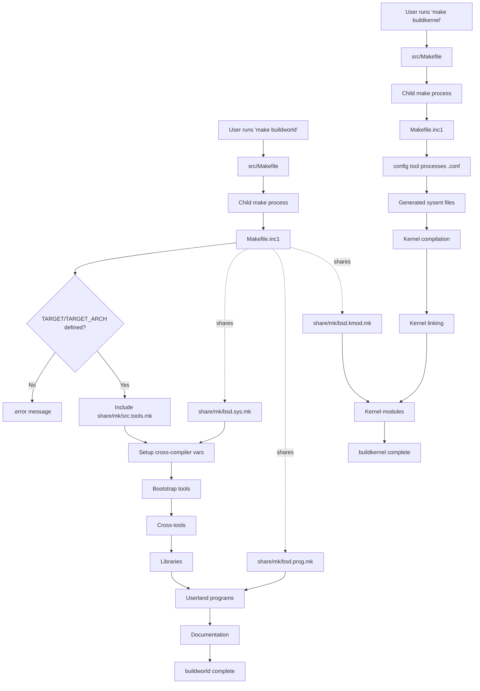

# The FreeBSD Build System
<!-- This file is auto-generated by generate-doc.py -- do not edit manually -->

---
**Navigation:**
  **Related:** [Source Tree — Layout and Conventions](../../README_internals.md) | [Boot Process — UEFI Bootloader to Kernel Handoff](../../stand/efi/loader/README.md)
  **All chapters:** [Source Tree — Layout and Conventions](../../README_internals.md) | [Boot Process — UEFI Bootloader to Kernel Handoff](../../stand/efi/loader/README.md) | [Kernel Core — Structure and Entry Point](../../sys/README.md) | [Virtual Memory Subsystem — vm_page, UMA, and Pagers](../../sys/vm/README.md) | [Process Management — Scheduling and Lifecycle](../../sys/kern/README_process.md) | [Locking Primitives — Mutexes, sx, rmlocks, and Atomics](../../sys/kern/README_locking.md) | [Buffer Cache — Block I/O Subsystem](../../sys/vm/README_bcache.md) | [GEOM — Storage Framework](../../sys/geom/README.md) ...
---


## Quick Summary

FreeBSD uses a hierarchical Makefile-based build system that can compile the entire operating system — userland programs, libraries, kernel, and documentation — from a single source tree. The system is built around the `make(1)` command and a collection of `.mk` include files that define how to compile, link, and install each component. At the top level, a simple `Makefile` delegates to `Makefile.inc1`, which orchestrates the full build sequence through targets like `buildworld` and `buildkernel`.

The build system separates concerns into modular pieces. `bsd.prog.mk` handles building userland programs with compiler flags and linker options. `bsd.kmod.mk` handles kernel modules. `bsd.sys.mk` defines common compiler settings and warning levels. Each directory in the source tree has a `Makefile` that includes the appropriate `.mk` files and lists source files or subdirectories. The system supports out-of-tree builds where object files are placed in separate directories, keeping the source tree clean.

Kernel builds work differently from userland builds. A kernel configuration file (like `GENERIC`) is processed by the `config` tool, which generates C source files for device drivers and syscall tables. These generated files are then compiled and linked into a single kernel binary. The build system tracks dependencies between source files and headers, and can rebuild only what is necessary when sources change.

The build system also supports cross-compilation, allowing FreeBSD to be built for different architectures from a single host. The `universe` target builds all supported architectures and kernels simultaneously. Build options are controlled through `src.conf(5)`, which allows fine-grained control over what gets built and which features are enabled or disabled.

## Architecture

The FreeBSD build system follows a layered architecture where each layer builds on the previous one. At the entry point, the top-level `Makefile` at `src/Makefile` (72 lines) is deliberately simple. It does not contain build rules; instead, it delegates to `Makefile.inc1` through a child `make` process. This design ensures that the build uses the `.mk` files from the source tree rather than any installed versions, which is critical during system upgrades.

```makefile
# From src/Makefile, line 55-63
# This makefile is simple by design. The FreeBSD make automatically reads
# the /usr/share/mk/sys.mk unless the -m argument is specified on the
# command line. By keeping this makefile simple, it doesn't matter too
# much how different the installed mk files are from those in the source
# tree. This makefile executes a child make process, forcing it to use
# the mk files from the source tree which are supposed to DTRT.
```

`Makefile.inc1` at the source root is the central orchestrator. It defines the `buildworld` and `buildkernel` targets, sets up cross-compilation variables (`XCC`, `XCXX`, `XLD`, `XCPP`), and manages the build order. The file enforces that `TARGET` and `TARGET_ARCH` are defined before any build proceeds:

```makefile
# From Makefile.inc1, line 47-49
.if !defined(TARGET) || !defined(TARGET_ARCH)
.error Both TARGET and TARGET_ARCH must be defined.
.endif
```

The `.mk` files in `share/mk/` form the core library of build rules. Key files include:

- `bsd.sys.mk` — Defines compiler settings including C standards (`CSTD`, `CXXSTD`), warning levels (`WARNS`), and compiler-specific flags. The `WARNS` variable controls compiler warning severity from 1 to 6.
- `bsd.prog.mk` — Handles building userland programs with support for ELF hardening features like RELRO (`-zrelro`), PIE (`-fPIE`/`-pie`), and retpoline (`-mretpoline`).
- `bsd.kmod.mk` — Handles kernel module building, includes `bsd.sysdir.mk` and `sys/conf/kmod.mk`.
- `bsd.dep.mk` — Manages dependency tracking between source files and headers.
- `bsd.obj.mk` — Manages object directory creation for out-of-tree builds.

The `tools/build/make.py` script provides a Python wrapper that bootstraps `bmake` (the FreeBSD make implementation) on non-FreeBSD systems. It handles cross-compilation toolchain detection and provides a consistent interface across platforms:

```python
# From tools/build/make.py
# List of targets that are independent of TARGET/TARGET_ARCH
mach_indep_targets = [
    "cleanuniverse", "universe", "universe-toolchain", "tinderbox",
    "worlds", "kernels", "kernel-toolchains", "targets",
    "toolchains", "makeman", "sysent",
]
```

## Key Data Structures

The build system does not use complex C data structures in the traditional sense — it is a Makefile-based system. However, several key concepts and configuration variables define how the build operates:

**Build Environment Variables** (from `Makefile.inc1`):

```makefile
SRCDIR?=       ${.CURDIR}
LOCALBASE?=    /usr/local
TIME_ENV ?=    time env
```

These variables define the source directory root, local base path, and the command wrapper for timing builds.

**Compiler Variable Sets** (from `Makefile.inc1`):

```makefile
XCOMPILERS=    CC CXX CPP
.for COMPILER in ${XCOMPILERS}
.if defined(CROSS_COMPILER_PREFIX)
X${COMPILER}?= ${CROSS_COMPILER_PREFIX}${${COMPILER}}
.else
X${COMPILER}?= ${${COMPILER}}
.endif
.endfor
```

This loop creates cross-compiler variable sets (`XCC`, `XCXX`, `XCPP`) for each compiler type, allowing the build system to use different compilers for host and target.

**Kernel Module Variables** (from `share/mk/bsd.kmod.mk`):

```makefile
.include <bsd.sysdir.mk>
.include "${SYSDIR}/conf/kmod.mk"
```

The kernel module build includes system directory definitions and kernel-specific make rules from `sys/conf/kmod.mk`.

**Build Options** (from `share/mk/bsd.opts.mk` and `share/mk/src.opts.mk`):

The build system uses `src.conf(5)` for configuration options. Options like `MK_WARNS`, `MK_CLANG_BOOTSTRAP`, `MK_RELRO`, `MK_PIE`, and `MK_RETPOLINE` control various build behaviors. These are evaluated at build time and can override defaults.

## Deep Dive

### The buildworld Target

The `buildworld` target in `Makefile.inc1` orchestrates the complete userland build. Here is the flow:

1. **Validation**: `Makefile.inc1` first checks that `TARGET` and `TARGET_ARCH` are defined.

2. **Tool Setup**: The file includes `share/mk/src.tools.mk` which defines commands like `INSTALL_CMD`, `MTREE_CMD`, `PWD_MKDB_CMD`, `SERVICES_MKDB_CMD`, `CAP_MKDB_CMD`, and `TIC_CMD`. These are the "bootstrap tools" used for installation and distribution.

3. **Cross-Compiler Setup**: If `CROSS_TOOLCHAIN` or `UNIVERSE_TOOLCHAIN` is defined, the system sets up cross-compiler paths. The `MK_CLANG_BOOTSTRAP` variable controls whether to build a bootstrap Clang toolchain.

4. **Build Order**: `buildworld` builds components in dependency order:
   - First, bootstrap tools (small utilities needed for the build)
   - Then, cross-tools (tools that run on the host but produce target objects)
   - Then, libraries (libc, libm, etc.)
   - Then, userland programs
   - Finally, documentation

Each subdirectory in the source tree has a `Makefile` that uses the `SUBDIR` variable to list subdirectories to recurse into, or lists source files to compile. The `bsd.prog.mk` file handles the actual compilation and linking:

```makefile
# From share/mk/bsd.prog.mk
.if defined(PROG_CXX)
PROG= ${PROG_CXX}
.endif

# ELF hardening
.if ${MK_BIND_NOW} != "no"
LDFLAGS+= -Wl,-znow
.endif
.if ${MK_RELRO} == "no"
LDFLAGS+= -Wl,-znorelro
.else
LDFLAGS+= -Wl,-zrelro
.endif
```

### The buildkernel Target

The `buildkernel` target handles kernel compilation. The process differs from userland builds:

1. **Kernel Config Processing**: The kernel configuration file (e.g., `GENERIC`) is processed by the `config` tool. This tool parses the config file and generates C source files for each device driver and option specified. The generated files are placed in the kernel build directory.

2. **Sysent Generation**: The `sysent` target rebuilds syscall entries from `syscalls.master`. This is a separate step that generates the syscall table and related files.

3. **Compilation**: The kernel source files are compiled with kernel-specific flags. The `bsd.kmod.mk` file handles kernel module compilation, which includes additional steps for module loading infrastructure.

4. **Linking**: The kernel object files are linked into a single kernel binary. The linker script and flags are kernel-specific.

The `bsd.kmod.mk` file is minimal by design:

```makefile
# From share/mk/bsd.kmod.mk
.-include <local.kmod.mk>
.include <bsd.sysdir.mk>
.include "${SYSDIR}/conf/kmod.mk"
```

It includes local overrides, system directory definitions, and kernel-specific make rules from `sys/conf/kmod.mk`.

### Dependency Tracking

The build system tracks dependencies between source files and headers. The `bsd.dep.mk` file provides rules for dependency generation. When a source file is compiled, the compiler generates a dependency file (`.d` file) that lists all headers included. On subsequent builds, only files with changed dependencies are recompiled.

The `tools/build/Makefile.depend` file manages dependency generation for the build tools themselves.

### Out-of-Tree Builds

FreeBSD supports out-of-tree builds where object files are placed in separate directories. This is controlled by the `OBJDIR` and `OBJTOP` variables. The `bsd.obj.mk` file handles object directory creation and management. Out-of-tree builds keep the source tree clean and allow multiple build configurations to coexist.

## Flow / Diagram



## Advanced Notes

### Debugging with DTrace

The FreeBSD build system itself can be traced using DTrace. The `dtrace -n 'syscall:::entry { trace(execname); }'' command can track which system calls are made during the build. For build-specific tracing, the `make -d` flags provide detailed output about make's internal state.

The `-d` flag has many sub-options:
- `-d b` — Show built-in rules
- `-d c` — Show command execution
- `-d e` — Show environment variable changes
- `-d i` — Show include file processing
- `-d m` — Show makefile search paths
- `-d p` — Show variable assignments
- `-d s` — Show secondary expansion
- `-d t` — Show timestamp checking
- `-d v` — Show variable value lookups

### Performance Implications

The build system supports parallel builds with the `-j` flag. The `jobs.mk` file in `share/mk/` handles job control. For large builds, using multiple jobs can significantly reduce build time. However, too many jobs can cause resource contention on systems with limited memory or I/O bandwidth.

The `tools/build/make.py` script provides a convenient wrapper for parallel builds on non-FreeBSD systems:

```bash
# Build with 4 parallel jobs
./tools/build/make.py -j4 buildworld buildkernel
```

### Common Pitfalls

1. **Stale .mk files**: If the installed `.mk` files differ from the source tree versions, the build may fail. The top-level `Makefile` mitigates this by using a child make process with explicit `-m` flags.

2. **Missing TARGET/TARGET_ARCH**: Both variables must be defined before any build. Cross-compilation requires both, and the build will abort with an error if either is missing.

3. **Insufficient disk space**: A full `universe` build requires significant disk space. The `Makefile` comments note that r340283 required 167 GB (81 GB with ZFS lz4 compression).

4. **Kernel config changes**: When modifying kernel configuration files, remember that the `config` tool must be run to regenerate source files. The build system handles this automatically, but custom kernel builds may require manual intervention.

5. **Build directory cleanup**: The `clean` and `cleandir` targets remove object files and intermediate files. `cleandir` is more aggressive than `clean`. Use `clean` for incremental rebuilds and `cleandir` for full rebuilds.

### Connection to OS Theory

The FreeBSD build system exemplifies several concepts from operating systems theory:

- **Dependency graphs**: The build system constructs a directed acyclic graph (DAG) of build dependencies, similar to how a scheduler orders process execution.
- **Separation of concerns**: The layered architecture (top-level Makefile → Makefile.inc1 → .mk files → per-directory Makefiles) mirrors the principle of modularity in software engineering.
- **Out-of-tree builds**: The ability to build objects in separate directories is analogous to virtual memory's separation of code and data segments.
- **Cross-compilation**: Building for a different architecture requires careful handling of endianness, word size, and calling conventions — concepts central to computer architecture.

## Comparison

### Linux Build System

Linux uses the Kbuild system, which is also Makefile-based but with significant differences. Linux's `Makefile` at the kernel root is more complex than FreeBSD's, containing many more rules and options. The Kbuild system uses `Kconfig` for kernel configuration, which generates a `.config` file that is then processed by the build system. FreeBSD's kernel configuration uses the `config` tool directly, which generates C source files rather than a configuration file.

FreeBSD's `bsd.prog.mk` handles userland program building with a more modular approach than Linux's `Makefile` structure. Linux tends to have more per-directory Makefiles with inline rules, while FreeBSD centralizes common rules in the `.mk` files.

### macOS/XNU

macOS's XNU kernel uses a build system that combines Makefiles with custom tools. The XNU build system is less modular than FreeBSD's, with more inline rules in per-directory Makefiles. macOS also uses `xcodebuild` for userland components, which is a completely different build system based on Xcode project files.

### NetBSD/OpenBSD

NetBSD and OpenBSD have build systems similar to FreeBSD's, as they share a common heritage. However, each has evolved differently. NetBSD uses a more centralized build system with fewer `.mk` files, while OpenBSD has simplified its build system over time. All three systems support out-of-tree builds and cross-compilation.

### Key Structural Differences

FreeBSD's approach of keeping the top-level `Makefile` simple and delegating to `Makefile.inc1` is unique among major Unix-like systems. This design allows the build system to work correctly even when the installed `.mk` files are outdated, as long as the source tree's `.mk` files are used. Linux's Kbuild system does not have this property — it relies on the installed `make` and kernel source tree being consistent.

FreeBSD's use of `src.conf(5)` for build options is similar to Linux's `.config` file but provides more granular control over individual components. FreeBSD's `src.conf` can enable or disable individual libraries, programs, and kernel modules independently.

## See Als
- [UEFI Bootloader-to-Kernel Handoff](../../../../stand/efi/loader/README.md)
- [FreeBSD Source Tree Overview](README_internals.md)
o

- `share/mk/` — The directory containing all `.mk` include files
- `sys/conf/` — Kernel configuration files and kernel-specific make rules
- `tools/build/` — Build helper scripts including `make.py`
- `build(7)` — Man page for the build system
- `src.conf(5)` — Configuration options for the build system
- `sys/vm/` — Virtual memory subsystem (for understanding kernel modules)
- `sys/kern/` — Kernel core (for understanding kernel build)

See related chapters for coverage of kernel module development, cross-compilation setup, and troubleshooting build failures.

---

> _Generated by [DaemonDocs](https://github.com/ocochard/DaemonDocs) on 2026-04-29 03:53 UTC using model `Qwen3.6-35B-A3B-UD-Q4_K_XL` (llama.cpp build `b8929-9d34231bb`). AI-generated content — verify against source before relying on it._
