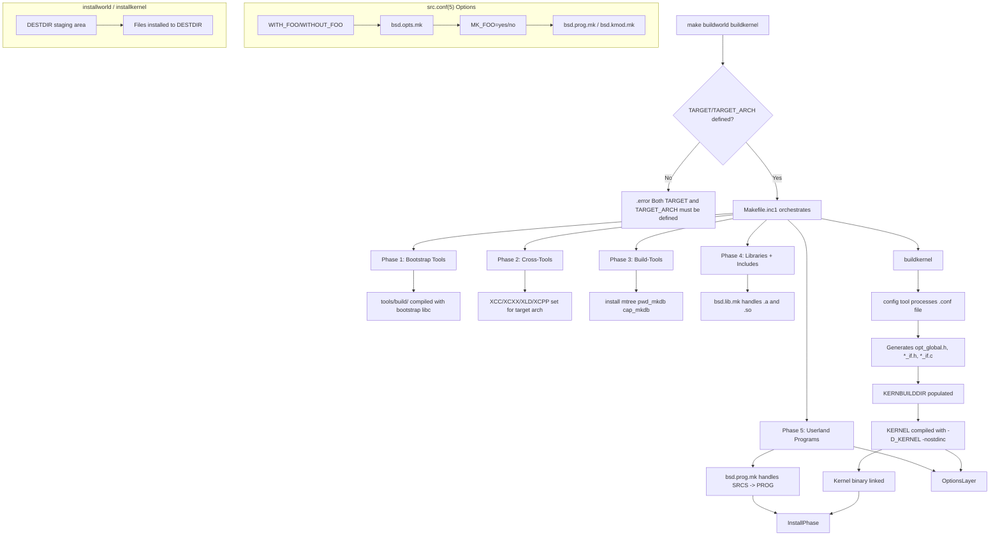

# Build System — buildworld and buildkernel
<!-- This file is auto-generated by generate-doc.py -- do not edit manually -->

---
**Navigation:**
  **Up:** [Source Tree — Layout and Conventions](../../README_internals.md)
  **Related:** [Source Tree — Layout and Conventions](../../README_internals.md) | [Boot Process — UEFI Bootloader to Kernel Handoff](../../stand/efi/loader/README.md)
  **All chapters:** [Source Tree — Layout and Conventions](../../README_internals.md) | [Boot Process — UEFI Bootloader to Kernel Handoff](../../stand/efi/loader/README.md) | [Kernel Core — Structure and Entry Point](../../sys/README.md) | [Virtual Memory Subsystem — vm_page, UMA, and Pagers](../../sys/vm/README.md) | [Process Management — Scheduling and Lifecycle](../../sys/kern/README_process.md) | [Locking Primitives — Mutexes, sx, rmlocks, and Atomics](../../sys/kern/README_locking.md) | [Buffer Cache — Block I/O Subsystem](../../sys/vm/README_bcache.md) | [GEOM — Storage Framework](../../sys/geom/README.md) ...
---


## Quick Summary

FreeBSD uses a hierarchical Makefile-based build system that compiles the entire operating system — userland programs, libraries, kernel, and documentation — from a single source tree. The system is built around the [`make(1)`](../../contrib/bmake/make.1) command and a collection of `.mk` include files that define how to compile, link, and install each component. At the top level, a simple `Makefile` delegates to `Makefile.inc1`, which orchestrates the full build sequence through targets like `buildworld` and `buildkernel`.

The build system separates concerns into modular pieces. `bsd.prog.mk` handles building userland programs with compiler flags and linker options. `bsd.kmod.mk` handles kernel modules. `bsd.sys.mk` defines common compiler settings and warning levels. Each directory in the source tree has a `Makefile` that includes the appropriate `.mk` files and lists source files or subdirectories. The system supports out-of-tree builds where object files are placed in separate directories, keeping the source tree clean.

Kernel builds work differently from userland builds. A kernel configuration file (like `GENERIC`) is processed by the `config` tool, which generates C source files for device drivers and syscall tables. These generated files are then compiled and linked into a single kernel binary. The build system tracks dependencies between source files and headers, and can rebuild only what is necessary when sources change.

The build system also supports cross-compilation, allowing FreeBSD to be built for different architectures from a single host. The `universe` target builds all supported architectures and kernels simultaneously. Build options are controlled through [`src.conf(5)`](../man/man5/src.conf.5), which allows fine-grained control over what gets built and which features are enabled or disabled.

## Architecture

The FreeBSD build system follows a layered architecture where each layer builds on the previous one. At the entry point, the top-level `Makefile` (101 lines) is deliberately simple. It does not contain build rules; instead, it delegates to `Makefile.inc1` through a child `make` process. This design ensures that the build uses the `.mk` files from the source tree rather than any installed versions, which is critical during system upgrades.

```makefile
# From src/Makefile, lines 55-63
# This makefile is simple by design. The FreeBSD make automatically reads
# the /usr/share/mk/sys.mk unless the -m argument is specified on the
# command line. By keeping this makefile simple, it doesn't matter too
# much how different the installed mk files are from those in the source
# tree. This makefile executes a child make process, forcing it to use
# the mk files from the source tree which are supposed to DTRT.
```

`Makefile.inc1` at the source root is the central orchestrator. It defines the `buildworld` and `buildkernel` targets, sets up cross-compilation variables (`XCC`, `XCXX`, `XLD`, `XCPP`), and manages the build order. The file enforces that `TARGET` and `TARGET_ARCH` are defined before any build proceeds:

```makefile
# From Makefile.inc1, lines 51-53
.if !defined(TARGET) || !defined(TARGET_ARCH)
.error Both TARGET and TARGET_ARCH must be defined.
.endif
```

The `.mk` files in `share/mk/` form the core library of build rules. Key files include:

- `bsd.sys.mk` — Defines compiler settings including C standards (`CSTD`, `CXXSTD`), warning levels (`WARNS`), and compiler-specific flags. The `WARNS` variable controls compiler warning severity from 1 to 6.
- `bsd.prog.mk` — Handles building userland programs with support for ELF hardening features like RELRO (`-zrelro`), PIE (`-fPIE`/`-pie`), and retpoline (`-mretpoline`).
- `bsd.kmod.mk` — Handles kernel module building, includes `bsd.sysdir.mk` and `sys/conf/kmod.mk`.
- `bsd.own.mk` — Defines directory paths, ownership, and mode defaults for installed files.
- `bsd.opts.mk` — Translates `WITH_FOO`/`WITHOUT_FOO` from [`src.conf(5)`](../man/man5/src.conf.5) into `MK_FOO=yes`/`MK_FOO=no` variables that build rules test.

The build is organized into phases. `buildworld` first builds bootstrap tools (tiny utilities needed for the build itself), then cross-tools (compilers and related utilities for the target architecture), then build-tools (utilities needed for installation), then libraries, then includes, and finally userland programs. `buildkernel` runs the `config` tool on the kernel configuration file to generate driver and syscall source files, then compiles and links them into a kernel binary.

Kernel configuration processing uses the `config` tool defined in `sys/conf/config`. When `buildkernel` is invoked, `config` reads a `.conf` file like `GENERIC` and generates:
- `opt_global.h` — Kernel compile-time options
- `opt_*.h` — Per-subsystem options
- `*_if.h` — Bus method interface files
- `*_if.c` — Bus method glue code

These generated files are placed in the kernel build directory (typically `${KERNBUILDDIR}`), which is separate from the source tree to support out-of-tree builds. The `KERNBUILDDIR` variable tells the build system where to find these generated headers.

Cross-compilation is handled through the `XCC`, `XCXX`, `XLD`, and `XCPP` variables. When `CROSS_TOOLCHAIN` is defined, the build system includes a toolchain-specific `.mk` file from `${LOCALBASE}/share/toolchains/`. For `universe` builds, cross-toolchains are built into `${HOST_OBJTOP}/tmp/usr/bin/` and referenced from there.

## Key Data Structures

The build system does not use C structs in the traditional sense — it is a Makefile-based system. However, the kernel build generates data structures that are critical to the kernel's operation. The `spacectl_range` struct, for example, is defined in `tools/build/fcntl.h`:

```c
/* From tools/build/fcntl.h */
struct spacectl_range {
	off_t	r_offset;
	off_t	r_len;
};
```

This struct is used by the `fspacectl()` system call, which is implemented as a stub in `tools/build/fspacectl.c`. The build system includes these stub implementations in the libc-bootstrap phase to provide minimal headers needed during cross-compilation.

The kernel module build uses the `KMOD` variable to name the module file (e.g., `${KMOD}.ko`). The `sys/conf/kmod.mk` file defines the compilation flags for kernel modules, including `-D_KERNEL` and `-DKLD_MODULE`. It also sets `NOSTDINC=-nostdinc` to prevent the compiler from using system headers, ensuring kernel modules only see kernel-defined types.

## Deep Dive

Let us trace through what happens when a developer runs `make buildworld buildkernel` from the source tree root.

**Phase 1: Bootstrap Tools**

The build first constructs a minimal set of tools needed for the rest of the build. These are compiled against a bootstrap libc and do not depend on any FreeBSD-specific headers. The `tools/build` directory contains the source for these tools. The `bsd.prog.mk` file handles the compilation, using the `OBJ_EXT` variable to determine the object file extension. When PIE is enabled (default on most architectures), objects get the `.pieo` extension instead of `.o`:

```makefile
# From share/mk/bsd.prog.mk
.if ${MK_PIE} != "no" && (!defined(NO_SHARED) || ${NO_SHARED:tl} == "no")
CFLAGS+= -fPIE
CXXFLAGS+= -fPIE
LDFLAGS+= -pie
OBJ_EXT=pieo
.else
OBJ_EXT=o
.endif
```

This distinction matters because PIE objects cannot be mixed with non-PIE objects in the same link.

**Phase 2: Cross-Tools**

If cross-compiling, the build constructs a full toolchain for the target architecture. The `XCC`, `XCXX`, `XLD`, and `XCPP` variables are set to point to these cross-tools. The `MK_CLANG_BOOTSTRAP` variable controls whether a bootstrap compiler is built; it is set to `no` when an external cross-compiler path is provided:

```makefile
# From Makefile.inc1, lines 97-98
.if ${XCC:N${CCACHE_BIN}:M/*}
MK_CLANG_BOOTSTRAP=	no
```

**Phase 3: Build-Tools**

These are utilities needed for installation, such as `install`, `mtree`, `pwd_mkdb`, and `cap_mkdb`. The `share/mk/src.tools.mk` file defines the commands:

```makefile
# From share/mk/src.tools.mk
INSTALL_CMD?=	install
MTREE_CMD?=	mtree
PWD_MKDB_CMD?=	pwd_mkdb
SERVICES_MKDB_CMD?=	services_mkdb
CAP_MKDB_CMD?=	cap_mkdb
TIC_CMD?=	tic
```

**Phase 4: Libraries and Includes**

Libraries are built next, followed by header installation. The `bsd.lib.mk` file (included from `bsd.prog.mk`) handles library building, supporting both static and shared libraries. The `NO_SHARED` variable can force static-only builds.

**Phase 5: Userland Programs**

Userland programs are built using `bsd.prog.mk`. Each program's `Makefile` lists its source files in `SRCS` and includes `bsd.prog.mk`. The build system automatically compiles each `.c` file to an object file and links them together. ELF hardening options are applied based on [`src.conf(5)`](../man/man5/src.conf.5) settings:

```makefile
# From share/mk/bsd.prog.mk
.if ${MK_RELRO} == "no"
LDFLAGS+= -Wl,-znorelro
.else
LDFLAGS+= -Wl,-zrelro
.endif
```

**Kernel Build**

`buildkernel` takes a different path. It first runs `config` on the kernel configuration file. The `config` tool parses the `.conf` file and generates C source files for device drivers, bus methods, and syscall tables. These generated files are placed in `${KERNBUILDDIR}`. The kernel is then compiled using flags from `sys/conf/kmod.mk`:

```makefile
# From sys/conf/kmod.mk
CFLAGS+=	-D_KERNEL
CFLAGS+=	-DKLD_MODULE
NOSTDINC=	-nostdinc
CFLAGS:=	${CFLAGS:N-I*} ${NOSTDINC} ${INCLMAGIC} ${CFLAGS:M-I*}
```

The `-nostdinc` flag prevents the compiler from finding system headers, ensuring kernel code only sees kernel-defined types. The generated `opt_global.h` is included via `-include ${KERNBUILDDIR}/opt_global.h` to provide compile-time options.

**[src.conf(5)](../man/man5/src.conf.5) Options Handling**

Build options are defined in `/etc/src.conf` using `WITH_FOO` and `WITHOUT_FOO` syntax. The `bsd.opts.mk` file translates these into `MK_FOO=yes`/`MK_FOO=no` variables. The translation happens through `bsd.mkopt.mk`, which is included by `bsd.opts.mk`:

```makefile
# From share/mk/bsd.opts.mk
# Users define WITH_FOO and WITHOUT_FOO on the command line or in /etc/src.conf
# and /etc/make.conf files. These translate in the build system to MK_FOO={yes,no}
# with (usually) sensible defaults.
```

The default values are split into three categories: `__DEFAULT_YES_OPTIONS`, `__DEFAULT_NO_OPTIONS`, and `__DEFAULT_DEPENDENT_OPTIONS`. For example, `WARNS` defaults to `yes` (enabling warnings), while `ASAN` defaults to `no` (disabling AddressSanitizer).

**Out-of-Tree Builds**

FreeBSD supports out-of-tree builds where object files are placed in a separate directory from the source tree. This is controlled by the `OBJTOP` and `HOST_OBJTOP` variables. When set, the build system creates a parallel directory structure under `OBJTOP` and places all object files there. This keeps the source tree clean and allows multiple builds for different configurations.

The `DESTDIR` variable controls where installed files are placed, enabling staged installs. This is critical for `installworld` and `installkernel`, which install into `${DESTDIR}` rather than the running system.

## Flow / Diagram



## Advanced Notes

**Debugging Build Failures**

When a build fails, the first step is to examine the `make` output for the specific target that failed. FreeBSD's build system uses recursive `make` invocations, so the error may be buried in sub-make output. Use `make -dB` to enable debugging output showing dependency resolution, or `make -n` to see what commands would be executed without running them. The `-j` flag for parallel builds can make output harder to read; use `-j1` for sequential builds when debugging.

**Dependency Tracking**

FreeBSD uses dependency files generated by the compiler (`-MMD` flag) to track header dependencies. When a header file changes, only the source files that include it are recompiled. The `bsd.dep.mk` file manages this process. In out-of-tree builds, dependency files are placed in the object directory alongside the object files.

**Performance Considerations**

The `WARNS` variable controls compiler warning levels. Higher warning levels (up to 6) catch more potential bugs but can slow compilation due to additional compiler passes. The default `DEFAULTWARNS=6` is appropriate for source tree builds but may be too aggressive for third-party code. The `MK_WERROR` variable controls whether warnings are treated as errors; it defaults to `yes` for FreeBSD source but can be disabled for specific components.

**Common Pitfalls**

1. **Stale object files**: When switching between configurations, old object files may persist and cause link errors. Run `make cleandir` to remove all object files before rebuilding.

2. **Cross-compiler header conflicts**: When building with `CROSS_TOOLCHAIN`, ensure the cross-compiler's headers are compatible with the target kernel version. The `MK_CLANG_BOOTSTRAP=no` setting bypasses bootstrap compiler building when an external cross-compiler is used.

3. **src.conf not taking effect**: Options in `/etc/src.conf` are only read when building from the source tree. They are not read by ports or packages. Use `make showconfig` to verify which options are active.

4. **DESTDIR confusion**: `installworld` and `installkernel` install into `${DESTDIR}`, not the running system. To install to the running system, omit `DESTDIR` or set it to `/`. This is dangerous during upgrades — always use a separate `DESTDIR` for staged installs.

**Connection to OS Theory**

The FreeBSD build system's layered architecture mirrors the Unix philosophy of small, composable tools. Each `.mk` file is a module that can be included by any Makefile, similar to how kernel subsystems are modularized. The out-of-tree build support is analogous to build systems in other operating systems (Linux's `O=` option, NetBSD's `OBJDIR`), but FreeBSD's implementation is notable for its use of recursive `make` with explicit dependency ordering.

The kernel configuration processing through `config` is a classic example of code generation. The `config` tool is a domain-specific language processor that transforms a declarative configuration into imperative C code. This approach allows device drivers to be described in a high-level format while still achieving zero-cost abstractions — the generated code is as efficient as if it had been written by hand.

## See Also
- [Boot Process — UEFI Bootloader to Kernel Handoff](../../stand/efi/loader/README.md)
- [Source Tree — Layout and Conventions](../../README_internals.md)


- [`src.conf(5)`](../man/man5/src.conf.5) — Manual page for build options
- [`config(8)`](../../usr.sbin/config/config.8) — Kernel configuration tool
- [`make(1)`](../../contrib/bmake/make.1) — The build command
- [`share/mk/bsd.prog.mk`](bsd.prog.mk) — Userland program build rules
- [`share/mk/bsd.kmod.mk`](bsd.kmod.mk) — Kernel module build rules
- [`sys/conf/kmod.mk`](../../sys/conf/kmod.mk) — Kernel-specific compilation flags

---

> _Generated by [DaemonDocs](https://github.com/ocochard/DaemonDocs) on 2026-05-02 22:18 UTC using model `Qwen3.6-35B-A3B-UD-Q8_K_XL` (llama.cpp build `b8985-27aef3dd9`). AI-generated content — verify against source before relying on it._
