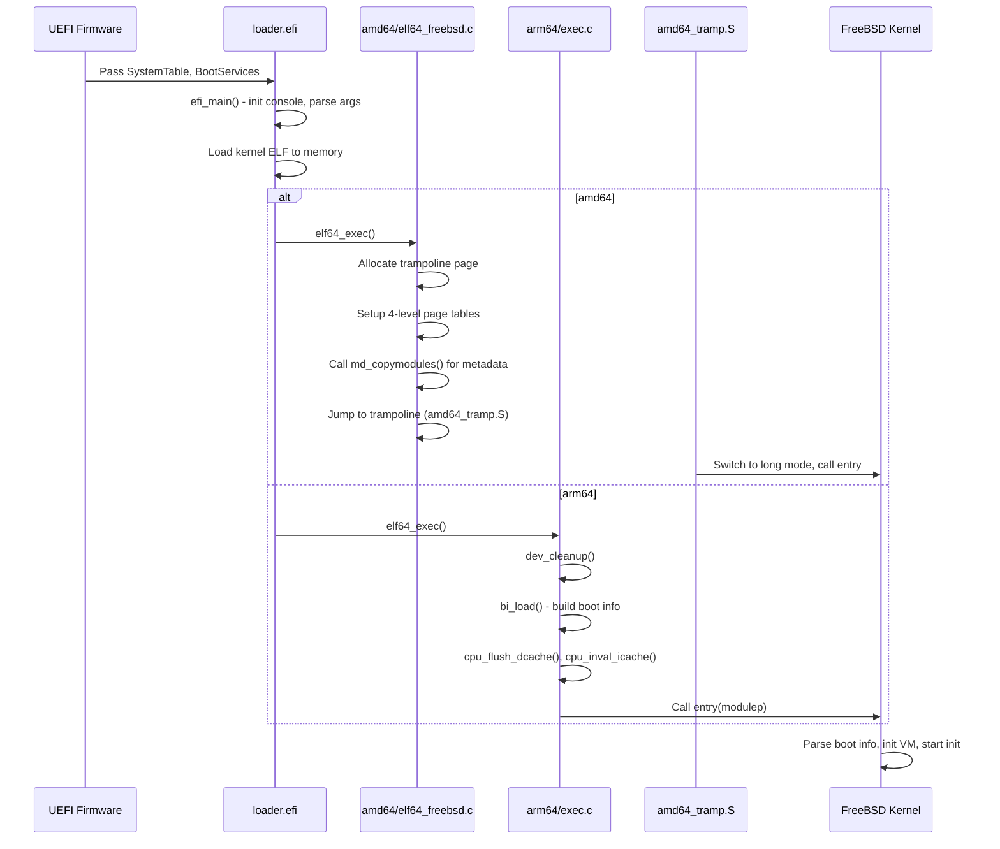

# Boot Process — UEFI Bootloader to Kernel Handoff
<!-- This file is auto-generated by generate-doc.py -- do not edit manually -->

---
**Navigation:**
  **Up:** [Source Tree — Layout and Conventions](../../../README_internals.md)
  **Related:** [Kernel Core — Structure and Entry Point](../../../sys/README.md) | [Build System — buildworld and buildkernel](../../../share/mk/README.md)
  **All chapters:** [Source Tree — Layout and Conventions](../../../README_internals.md) | [Kernel Core — Structure and Entry Point](../../../sys/README.md) | [Build System — buildworld and buildkernel](../../../share/mk/README.md) | [Virtual Memory Subsystem — vm_page, UMA, and Pagers](../../../sys/vm/README.md) | [Process Management — Scheduling and Lifecycle](../../../sys/kern/README_process.md) | [Locking Primitives — Mutexes, sx, rmlocks, and Atomics](../../../sys/kern/README_locking.md) | [Buffer Cache — Block I/O Subsystem](../../../sys/vm/README_bcache.md) | [GEOM — Storage Framework](../../../sys/geom/README.md) ...
---


> ⚠ **UNVERIFIED DRAFT** — reviewer did not explicitly approve this draft. Treat claims as suspect until manually reviewed.


## Quick Summary
The transition from UEFI firmware to the FreeBSD kernel involves a carefully orchestrated handoff that bridges the firmware environment and the operating system's early initialization phase. The `loader.efi` program acts as the intermediary, responsible for reading the kernel binary from the EFI System Partition, mapping it into physical memory, and preparing the execution environment. This stage is critical because the kernel assumes that certain hardware resources are already configured and that memory regions are correctly classified before it begins its own initialization routines.

A central component of this handoff is the EFI memory map, which enumerates every physical memory region known to the firmware along with its type and attributes. The bootloader extracts this map and embeds it into a boot information structure that the kernel reads immediately upon entry. The kernel uses this data to construct its physical memory management structures, marking reserved regions, ACPI tables, and memory-mapped I/O as off-limits to virtual memory allocation. Without this map, the kernel would lack the necessary context to safely manage physical pages.

The mechanism for passing control differs between architectures due to divergent calling conventions and early boot models. On x86_64, the bootloader sets up a minimal page table, copies the kernel to its final virtual address if relocation is required, and invokes a trampoline routine that switches the CPU into a trusted stack before calling into the kernel's initialization path. On ARM64, the process is more direct: the bootloader flushes instruction and data caches, invokes the kernel entry point with a single argument pointing to the boot information structure, and the kernel immediately configures its early page tables and stack. These architectural variations reflect the different hardware initialization sequences and memory management unit designs of each platform.

## Architecture
The EFI bootloader-to-kernel handoff spans the `stand/efi/loader` tree and architecture-specific kernel entry points. The primary entry point resides in `stand/efi/loader/efi_main.c`, where the UEFI firmware passes the system table and boot services table. After initializing console output and EFI library support, the loader proceeds to load the kernel ELF binary. The architecture-specific ELF loaders handle the actual memory mapping and control transfer.

On amd64, `stand/efi/loader/arch/amd64/elf64_freebsd.c` implements `elf64_exec()`. This function allocates a dedicated trampoline page using `BS->AllocatePages`, copies the trampoline assembly code (`amd64_tramp.S`), and sets up early 4-level page tables if copy staging is enabled. It constructs the module metadata chain by calling `md_copymodules()` from `stand/common/modinfo.c`, which iterates over preloaded files and emits self-describing metadata entries. Finally, it jumps to the trampoline, passing the stack pointer, kernel end address, module list pointer, page table base, and kernel entry point.

On arm64, `stand/efi/loader/arch/arm64/exec.c` provides a simpler `elf64_exec()`. Before calling `BS->ExitBootServices()`, the loader calls `dev_cleanup()` to release driver resources. It then builds the module information structure via `bi_load()`, flushes the D-cache and invalidates the I-cache for the kernel region using `cpu_flush_dcache()` and `cpu_inval_icache()`, and calls the kernel entry point directly with the module pointer as the sole argument.

Boot information construction is centralized in `stand/common/modinfo.c` and `stand/common/metadata.c`. The `md_copymodules()` function walks the preloaded file chain, emitting identifiers, sizes, addresses, and environment variables into a contiguous memory region. The EFI loader in `stand/efi/loader/bootinfo.c` wraps this process, attaching the EFI memory map and command-line arguments to the boot information structure before the kernel reads it.

## Key Data Structures
The boot information passed from `loader.efi` to the kernel is built using a chain of `struct file_metadata` entries. Each entry describes a loaded module or a piece of kernel metadata. The `struct file_metadata` type is defined in `stand/common/bootstrap.h` and contains fields for the data pointer, size, type identifier, and a next-pointer for chain traversal. The `md_type` field uses identifiers like `MODINFOMD_ELFHDR` to distinguish between the ELF header, kernel end address, and environment pointers. These are assembled by macros in `stand/common/modinfo.c` such as `MOD_ADDR` and `MOD_SIZE`.

The preloaded file chain is represented by `struct preloaded_file`, defined in `stand/common/bootstrap.h`. Each entry tracks the file name, type, arguments, address, size, and a pointer to associated metadata via `f_metadata`. The kernel reads this chain to discover its own ELF header, the location of additional modules (like kernel modules or device trees), and the boot command line.

**The boot information structure (`struct bootinfo`)** is the central data structure that the kernel reads upon entry. Defined in `sys/i386/include/bootinfo.h`, it contains version information (`bi_version`), the kernel name string (`bi_kernelname`), environment pointers (`bi_envp`), and a pointer to the module chain (`bi_modulep`). 

**The `bi_module` field (`bi_modulep`)** is a pointer to a self-describing chain of module metadata entries constructed by the bootloader. Each entry in the chain consists of a 32-bit type identifier followed by a 32-bit size field and the data payload. The kernel's `start()` function (in `sys/amd64/amd64/locore.S` / `sys/kern/init_main.c`) reads `bootinfo.bi_modulep` to locate the module chain, iterates through it to find the memory map entry (`MODINFO_MEMMAP`), and uses that to initialize the physical memory manager. This design allows the bootloader to pass arbitrary metadata in a self-describing format where each entry carries its type and size, enabling extensibility without changing the kernel entry point signature.

The EFI loader constructs this structure in `stand/efi/loader/bootinfo.c` by first calling `md_copymodules()` to build the module metadata chain, then embedding the EFI memory map as a `MODINFO_MEMMAP` entry within that chain.

## Deep Dive
The boot sequence begins in `stand/efi/loader/efi_main.c`. After the UEFI firmware hands over control, `efi_main()` initializes the EFI library, parses the command line, and probes for a bootable device. Once a device is selected, the kernel ELF file is loaded into memory.

On amd64, the handoff is complex due to the need for early virtual memory support. In `stand/efi/loader/arch/amd64/elf64_freebsd.c`, `elf64_exec()` first determines whether copy staging is required. If the kernel is relocatable, staging is disabled; otherwise, it is enabled. The loader allocates a page for the trampoline code (`amd64_tramp.S`):
```c
trampcode = copy_staging == COPY_STAGING_ENABLE ?
    (vm_offset_t)G(1) : (vm_offset_t)G(4);
err = BS->AllocatePages(AllocateMaxAddress, EfiLoaderData, 1,
    (EFI_PHYSICAL_ADDRESS *)&trampcode);
```
If staging is enabled, three additional pages are allocated for the 4-level page table (`PT4`). The trampoline code is copied, and the page tables are populated to map the kernel and the boot information structure. Finally, the trampoline is invoked:
```c
trampoline(trampstack, efi_copy_finish, kernend, modulep, PT4, entry);
```
The trampoline switches the CPU to long mode, sets up a stack, and jumps to the kernel entry point.

On arm64, the process is streamlined. In `stand/efi/loader/arch/arm64/exec.c`, `elf64_exec()` calls `dev_cleanup()` to free EFI driver resources before exiting boot services. It then calls `bi_load()` to build the boot information structure:
```c
err = bi_load(fp->f_args, &modulep, &kernendp, true);
```
The loader then ensures cache coherency by cleaning the D-cache over the kernel region and invalidating the I-cache:
```c
cpu_flush_dcache((void *)clean_addr, clean_size);
cpu_inval_icache();
```
Finally, it calls the kernel entry point directly:
```c
(*entry)(modulep);
```
The kernel entry point on arm64 immediately interprets the `modulep` pointer to reconstruct the boot information structure and begin initialization.

## Flow / Diagram


## Advanced Notes
When debugging the boot process, `dmesg` output early in the boot sequence can be sparse. The `loader.efi` environment provides commands like `show bootinfo` to inspect the memory map and module chain before the kernel takes over. If the kernel panics immediately upon entry, the issue often lies in the boot information structure layout or the EFI memory map classification.

On amd64, enabling or disabling copy staging (`set loader.efi.copy_staging=on/off`) can resolve memory layout conflicts on systems with unusual EFI memory maps. The staging mechanism manages the temporary mapping of the kernel into high virtual addresses.

Race conditions are minimal in the bootloader phase because it runs single-threaded under EFI boot services. However, failing to call `dev_cleanup()` on arm64 before `BS->ExitBootServices()` can lead to resource leaks or firmware crashes, as the firmware may reclaim memory that the kernel still expects to be accessible.

## Comparison
Linux uses a different approach for the EFI handoff. Instead of a custom module metadata chain, Linux relies on the EFI memory map passed via the `efi_memmap` structure and a device tree or ACPI tables for hardware description. The Linux bootloader (often `bzImage` with `setup.x86_64`) performs its own early page table setup and decompression, whereas FreeBSD's `loader.efi` fully loads the kernel ELF before transferring control.

macOS/XNU uses a different boot architecture entirely: the booter (`boot.efi`) loads the kernel and passes a boot-args string and a device-tree blob via a simple handoff structure, rather than a self-describing module metadata chain. The XNU kernel entry point expects a device tree and does not use a FreeBSD-style `struct bootinfo` with `bi_modulep` chains. This contrasts with FreeBSD's extensible module chain design where each entry carries its own type and size.

FreeBSD's use of `struct file_metadata` allows for a highly extensible boot environment where additional modules (like ZFS drivers or custom kernel modules) can be preloaded and described without changing the kernel's entry point signature. This contrasts with Linux's more rigid reliance on firmware-provided tables.

## See Also
- [Kernel Core — Structure and Entry Point](../../../sys/README.md)
- [Build System — buildworld and buildkernel](../../../share/mk/README.md)


- `stand/efi/loader/efi_main.c` — UEFI entry point and initialization
- `sys/kern/init_main.c` — Kernel entry point and early initialization
- `sys/vm/vm_page.c` — Physical memory management using the EFI memory map
- `stand/common/modinfo.c` — Module metadata construction
- `sys/x86/x86/identcpu.c` — CPU identification during early boot

---

> _Generated by [DaemonDocs](https://github.com/ocochard/DaemonDocs) on 2026-05-01 04:06 UTC using model `Qwen3.6-35B-A3B-UD-Q4_K_XL` (llama.cpp build `b8985-27aef3dd9`). AI-generated content — verify against source before relying on it._
