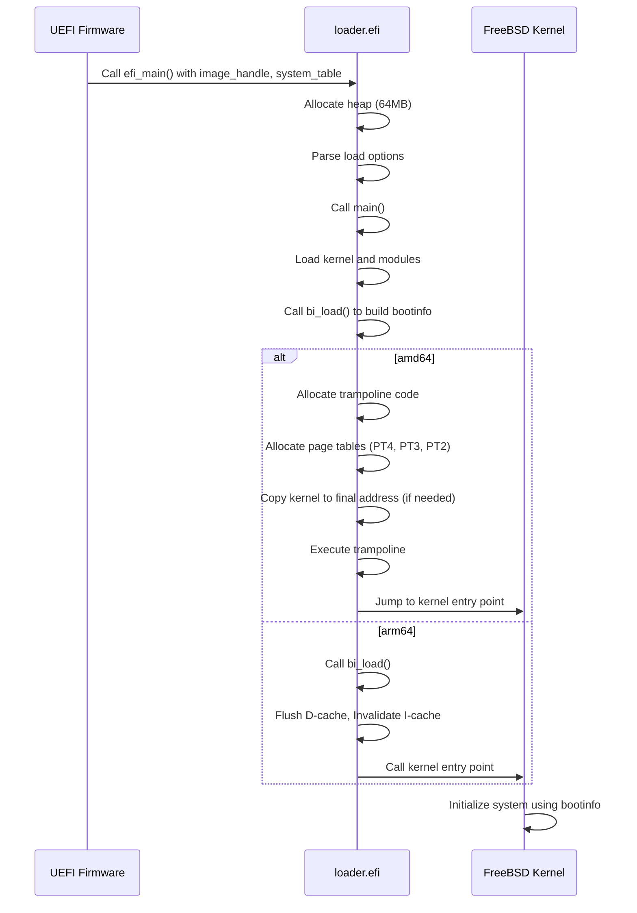

# Boot Process — UEFI Bootloader to Kernel Handoff
<!-- This file is auto-generated by generate-doc.py -- do not edit manually -->

---
**Navigation:**
  **Up:** [Source Tree — Layout and Conventions](../../../README_internals.md)
  **Related:** [Kernel Core — Structure and Entry Point](../../../sys/README.md) | [Build System — buildworld and buildkernel](../../../share/mk/README.md)
  **All chapters:** [Source Tree — Layout and Conventions](../../../README_internals.md) | [Kernel Core — Structure and Entry Point](../../../sys/README.md) | [Build System — buildworld and buildkernel](../../../share/mk/README.md) | [Virtual Memory Subsystem — vm_page, UMA, and Pagers](../../../sys/vm/README.md) | [Process Management — Scheduling and Lifecycle](../../../sys/kern/README_process.md) | [Locking Primitives — Mutexes, sx, rmlocks, and Atomics](../../../sys/kern/README_locking.md) | [Buffer Cache — Block I/O Subsystem](../../../sys/vm/README_bcache.md) | [GEOM — Storage Framework](../../../sys/geom/README.md) ...
---


## Quick Summary

The FreeBSD EFI bootloader bridges the gap between UEFI firmware and the FreeBSD kernel. It performs three critical tasks:

1. **Memory Map Preservation**: The bootloader receives the EFI memory map from firmware and passes it to the kernel via `struct bootinfo`, enabling the kernel to identify usable memory regions.
2. **Module Loading**: ELF kernel and module files are loaded into memory, with their metadata (headers, symbols) preserved for kernel consumption.
3. **Handoff**: The bootloader constructs a `struct bootinfo` containing the memory map, loaded modules (`struct preloaded_file`), and boot arguments, then jumps to the kernel entry point with a pointer to this structure.

This chapter explains how these mechanisms work, why they are designed this way, and how FreeBSD's approach compares to Linux and other systems.

## Architecture

FreeBSD's boot process on UEFI systems follows a multi-stage design:

```
UEFI Firmware → boot1 (GPT boot code) → loader.efi → kernel
```

The `loader.efi` binary is the second-stage bootloader. It runs in UEFI runtime services mode, with access to:

- UEFI Boot Services (memory allocation, protocol handles)
- UEFI Runtime Services (time, variables, reset)
- GOP (Graphics Output Protocol) for console output
- Simple File System protocol for disk access

The bootloader operates in a minimal environment with no MMU protection, no virtual memory, and no kernel services. All memory management is done through UEFI Boot Services `AllocatePages()` calls.

**Key Design Principle**: The bootloader must preserve the EFI memory map because the kernel uses it to identify which memory regions are usable, reserved, or ACPI data. Without this map, the kernel cannot safely initialize the virtual memory subsystem.

## Key Data Structures

### struct bootinfo

The `struct bootinfo` is the central data structure passed from the bootloader to the kernel. It contains:

- **Memory Map**: The EFI memory map received from firmware, with entries describing each memory region (type, physical address, length, attributes).
- **preloaded module list**: A linked list of loaded modules (kernel, kernel modules, device tree blobs), each described by a `struct preloaded_file` structure.
- **Boot Arguments**: Command line arguments, howto flags (e.g., `RB_SINGLE`, `RB_KDB`), console settings.
- **Metadata Pointers**: Pointers to architecture-specific metadata (e.g., ELF headers, FDT blobs).

The structure is allocated by the bootloader in loader memory and passed to the kernel via the `rdi` register (on amd64) or `x0` register (on arm64) at handoff time.

### preloaded_file Structure

Each loaded module (kernel, kld, FDT) is described by a `struct preloaded_file` structure, defined in `stand/common/bootstrap.h`. It contains:

- A pointer to the file (`f_fp`)
- A linked list link (`f_next`)
- Module metadata (type, name, address, size)
- A metadata list (`f_metadata`) containing ELF headers, linker hints, and other file-specific information

This structure is used throughout the loader to track all loaded files. The kernel accesses the module list via the `bi_modulep` field of `struct bootinfo`, which points to the first `struct preloaded_file` in the chain.

### EFI Memory Map

The EFI memory map is a list of memory descriptor structures received from UEFI firmware via `GetMemoryMap()`. Each entry describes:

- **Type**: Memory type (Conventional, Reserved, ACPI Reclaim, Runtime Services, etc.)
- **Physical Start**: Starting physical address
- **Page Count**: Number of 4KB pages
- **Attributes**: Memory attributes (Write-back, Write-protect, Runtime, etc.)

**Why This Matters**: The kernel uses the EFI memory map during VM initialization to:

1. Identify usable memory for the kernel heap and page tables
2. Skip reserved regions that may contain firmware data
3. Preserve ACPI tables in memory
4. Set up the physical map (pmap) with correct attributes

Without the EFI memory map, the kernel would have no reliable way to determine which memory is safe to use.

## Deep Dive

### Entry Point: `efi_main`

The entry point for `loader.efi` is `efi_main()` in `stand/efi/loader/efi_main.c`. This function is called by UEFI firmware with the image handle and system table.

```c
EFI_STATUS
efi_main(EFI_HANDLE image_handle, EFI_SYSTEM_TABLE *system_table)
{
    // ...
    IH = image_handle;
    ST = system_table;
    BS = ST->BootServices;
    RS = ST->RuntimeServices;

    // Allocate 64MB heap for loader use
    heapsize = 64 * 1024 * 1024;
    status = BS->AllocatePages(AllocateAnyPages, EfiLoaderData,
        EFI_SIZE_TO_PAGES(heapsize), &heap);
    // ...
    setheap((void *)(uintptr_t)heap, (void *)(uintptr_t)(heap + heapsize));
    // ...
}
```

The bootloader allocates a 64MB heap using `AllocatePages()` and initializes the standard library heap. It then parses the load options (command line arguments) and calls `main()`.

### Building Boot Info: `bi_load`

The core function for building the boot information is `bi_load()` in `stand/efi/loader/bootinfo.c`. This function:

1. Collects all loaded modules (kernel, modules, FDT).
2. Retrieves the EFI memory map from firmware.
3. Constructs the `struct bootinfo` structure.
4. Populates the module list with `struct preloaded_file` entries.

The `bi_getboothowto()` function in the same file parses boot arguments and sets flags like `RB_SERIAL` or `RB_KDB`.

### Handoff: amd64

On amd64, the handoff is complex due to the need to set up page tables and potentially relocate the kernel. The entry point is `elf64_exec()` in `stand/efi/loader/arch/amd64/elf64_freebsd.c`.

```c
static int
elf64_exec(struct preloaded_file *fp)
{
    // ...
    // Allocate trampoline code
    trampcode = (vm_offset_t)G(1);
    err = BS->AllocatePages(AllocateMaxAddress, EfiLoaderData, 1,
        (EFI_PHYSICAL_ADDRESS *)&trampcode);
    // ...
    bcopy((void *)&amd64_tramp, (void *)trampcode, amd64_tramp_size);
    trampoline = (void *)trampcode;

    // Allocate page tables
    PT4 = (pml4_entry_t *)G(1);
    err = BS->AllocatePages(AllocateMaxAddress, EfiLoaderData, 3,
        (EFI_PHYSICAL_ADDRESS *)&PT4);
    // ...
}
```

The amd64 handoff involves:

1. **Trampoline Allocation**: A small piece of code (`amd64_tramp.S`) is allocated and copied. This trampoline sets up the final page tables and jumps to the kernel.
2. **Page Table Setup**: The bootloader allocates page tables (`PT4`, `PT3`, `PT2`) and maps the kernel and modules into the final address space.
3. **Staging Copy**: If the kernel is loaded in a temporary location (staging), it is copied to its final address using the trampoline.
4. **Jump to Kernel**: The trampoline is executed, which sets up the identity-mapped page tables, copies the kernel if needed, and jumps to the kernel entry point.

### Handoff: arm64

On arm64, the handoff is simpler. The entry point is `elf64_exec()` in `stand/efi/loader/arch/arm64/exec.c`.

```c
static int
elf64_exec(struct preloaded_file *fp)
{
    // ...
    dev_cleanup();
    efi_time_fini();
    err = bi_load(fp->f_args, &modulep, &kernendp, true);
    // ...
    entry = efi_translate(ehdr->e_entry);

    // Clean D-cache under kernel area and invalidate whole I-cache
    clean_addr = (vm_offset_t)efi_translate(fp->f_addr);
    clean_size = (vm_offset_t)efi_translate(kernendp) - clean_addr;
    cpu_flush_dcache((void *)clean_addr, clean_size);
    cpu_inval_icache();

    (*entry)(modulep);
    // ...
}
```

The arm64 handoff involves:

1. **Cleanup**: Device drivers and EFI time services are cleaned up.
2. **Boot Info Build**: `bi_load()` is called to build the boot information.
3. **Cache Maintenance**: The D-cache is cleaned and the I-cache is invalidated to ensure the kernel code is coherent.
4. **Jump to Kernel**: The kernel entry point is called directly with the `modulep` pointer.

## Flow / Diagram



## Advanced Notes

### Staging Copy

On amd64, the kernel may be loaded in a temporary location (staging) if the final address is not available or if the kernel is relocatable. The `copy_staging` variable controls this behavior. The trampoline code is responsible for copying the kernel to its final address and setting up the page tables.

### Multiboot2 Support

FreeBSD's EFI bootloader also supports booting via Multiboot2, primarily for Xen Dom0. The `multiboot2.c` file in `stand/efi/loader/arch/amd64/` implements a subset of the Multiboot2 specification. This allows the bootloader to be used as a multiboot2-compliant bootloader, passing a `multiboot_header` and related tags to the kernel.

### Cache Maintenance

On arm64, cache maintenance is critical before jumping to the kernel. The `cpu_flush_dcache()` and `cpu_inval_icache()` functions ensure that the kernel code is coherent and visible to the CPU. Failure to do so can result in unpredictable behavior.

### EFI Memory Map Preservation

The EFI memory map is critical for the kernel's virtual memory initialization. The bootloader must ensure that the memory map is passed correctly to the kernel via `struct bootinfo`. The kernel uses this map to identify usable memory regions and set up the physical map (pmap) accordingly.

## Comparison

### Linux

Linux uses a different approach. The `efi_stub` code is integrated into the kernel image and is executed directly by UEFI firmware, bypassing a separate bootloader. This simplifies the boot process but reduces flexibility. FreeBSD's `loader.efi` provides more flexibility, allowing for module loading, configuration, and user interaction.

### NetBSD/OpenBSD

NetBSD and OpenBSD also use separate bootloaders (`bootxx`, `boot`). Their EFI bootloaders are similar in concept to FreeBSD's `loader.efi`, but the implementation details differ. For example, NetBSD's EFI bootloader (`bootxx_efi`) passes a `struct bootinfo` to the kernel that uses `bi_machdep` for architecture-specific data rather than FreeBSD's flat field layout. OpenBSD's EFI bootloader uses a different module loading strategy where modules are loaded via the `modload` command and stored in a linked list of `struct file` entries rather than FreeBSD's `struct preloaded_file` chain.

## See Also
- [Kernel Core — Structure and Entry Point](../../../sys/README.md)
- [Build System — buildworld and buildkernel](../../../share/mk/README.md)


---

> _Generated by [DaemonDocs](https://github.com/ocochard/DaemonDocs) on 2026-05-02 20:58 UTC using model `Qwen3.6-35B-A3B-UD-Q8_K_XL` (llama.cpp build `b8985-27aef3dd9`). AI-generated content — verify against source before relying on it._
