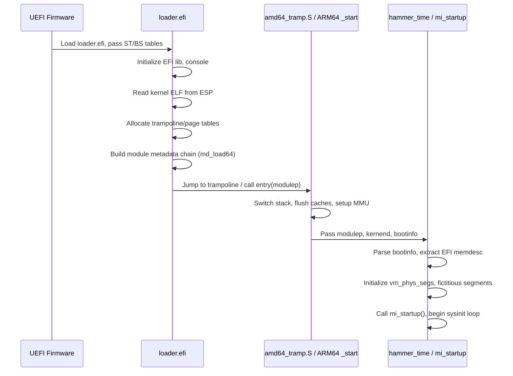

# UEFI Bootloader-to-Kernel Handoff
<!-- This file is auto-generated by generate-doc.py -- do not edit manually -->

---
**Navigation:**
  **Related:** [Kernel Core — Structure and Entry Point](../../../sys/README.md) | [Build System — buildworld and buildkernel](../../../share/mk/README.md)
  **All chapters:** [Source Tree — Layout and Conventions](../../../README_internals.md) | [Kernel Core — Structure and Entry Point](../../../sys/README.md) | [Build System — buildworld and buildkernel](../../../share/mk/README.md) | [Virtual Memory Subsystem — vm_page, UMA, and Pagers](../../../sys/vm/README.md) | [Process Management — Scheduling and Lifecycle](../../../sys/kern/README_process.md) | [Locking Primitives — Mutexes, sx, rmlocks, and Atomics](../../../sys/kern/README_locking.md) | [Buffer Cache — Block I/O Subsystem](../../../sys/vm/README_bcache.md) | [GEOM — Storage Framework](../../../sys/geom/README.md) ...
---


## Quick Summary
The transition from UEFI firmware to the FreeBSD kernel involves a carefully orchestrated handoff that bridges the firmware environment and the operating system's early initialization phase. The `loader.efi` program acts as the intermediary, responsible for reading the kernel binary from the EFI System Partition, mapping it into physical memory, and preparing the execution environment. This stage is critical because the kernel assumes that certain hardware resources are already configured and that memory regions are correctly classified before it begins its own initialization routines.

A central component of this handoff is the EFI memory map, which enumerates every physical memory region known to the firmware along with its type and attributes. The bootloader extracts this map and embeds it into a boot information structure that the kernel reads immediately upon entry. The kernel uses this data to construct its physical memory management structures, marking reserved regions, ACPI tables, and memory-mapped I/O as off-limits to virtual memory allocation. Without this map, the kernel would lack the necessary context to safely manage physical pages.

The mechanism for passing control differs between architectures due to divergent calling conventions and early boot models. On x86_64, the bootloader sets up a minimal page table, copies the kernel to its final virtual address if relocation is required, and invokes a trampoline routine that switches the CPU into a trusted stack before calling into the kernel's initialization path. On ARM64, the process is more direct: the bootloader flushes instruction and data caches, invokes the kernel entry point with a single argument pointing to the boot information structure, and the kernel immediately configures its early page tables and stack. These architectural variations reflect the different hardware initialization sequences and memory management unit designs of each platform.

## Architecture
The EFI bootloader-to-kernel handoff spans the `stand/efi/loader` tree and architecture-specific kernel entry points. The primary entry point resides in `stand/efi/loader/efi_main.c`, where the UEFI firmware passes the system table and boot services table. After initializing console output and EFI library support, the loader proceeds to load the kernel ELF binary. The architecture-specific ELF loaders handle the actual memory mapping and control transfer.

On amd64, `stand/efi/loader/arch/amd64/elf64_freebsd.c` implements `elf64_exec()`. This function allocates a dedicated trampoline page using `BS->AllocatePages`, copies the trampoline assembly code (`amd64_tramp.S`), and sets up early 4-level page tables if copy staging is enabled. It constructs the module metadata chain by calling `md_load64()` from `stand/common/modinfo.c`, which iterates over preloaded files and emits self-describing metadata entries. Finally, it jumps to the trampoline, passing the stack pointer, kernel end address, module list pointer, page table base, and kernel entry point.

On arm64, `stand/efi/loader/arch/arm64/exec.c` provides a simpler `elf64_exec()`. Before invoking `BS->ExitBootServices()`, the loader calls `dev_cleanup()` to release driver resources. It then builds the module information structure via `bi_load()`, flushes the D-cache and invalidates the I-cache for the kernel region using `cpu_flush_dcache()` and `cpu_inval_icache()`, and calls the kernel entry point directly with the module pointer as the sole argument.

Boot information construction is centralized in `stand/common/modinfo.c` and `stand/common/metadata.c`. The `md_copymodules()` function walks the preloaded file chain, emitting identifiers, sizes, addresses, and environment variables into a contiguous memory region. The EFI loader in `stand/efi/loader/bootinfo.c` wraps this process, attaching the EFI memory map and command-line arguments to the boot information structure before the kernel reads it.

## Key Data Structures
The bootloader and kernel communicate through a chain of self-describing metadata entries and a unified boot information structure.

The self-describing metadata format uses 32-bit identifiers (`MODINFO_NAME`, `MODINFO_ADDR`, `MODINFO_SIZE`, `MODINFO_METADATA`, etc.) followed by a 32-bit size field and variable-length data. This format enables the kernel to parse only the metadata it understands while safely ignoring extensions.

```c
struct bootinfo {
    void *bi_modules;
    char *cmdline;
    char *env;
    struct memdesc *memdesc;
    uint64_t memdesc_size;
    uint64_t memdesc_count;
    /* Architecture-specific fields follow */
};
```
The `struct bootinfo` aggregates all handoff data. The `bi_modules` field contains the head of the module metadata chain built by `md_copymodules()`. The `cmdline` and `env` pointers reference the parsed kernel arguments and environment variables copied into kernel space. The `memdesc` array holds the EFI memory map, where each descriptor specifies a physical base address, length, type, and attributes. The `memdesc_size` and `memdesc_count` fields allow the kernel to iterate safely over the map without relying on firmware callouts after `ExitBootServices()`.

```c
struct memdesc {
    uint64_t md_addr;
    uint64_t md_size;
    uint32_t md_type;
    uint64_t md_attrs;
};
```
The `struct memdesc` mirrors the EFI `EFI_MEMORY_DESCRIPTOR` layout. The kernel uses this structure during physical memory initialization to classify regions as conventional memory, reserved, ACPI NVS, or runtime code/data. Attributes such as `EFI_MEMORY_RUNTIME` and `EFI_MEMORY_WB` are preserved to ensure correct cache and access control settings during early boot.

## Deep Dive
The handoff process can be traced through the loader's ELF execution path and the kernel's early entry points. On amd64, `elf64_exec()` in `stand/efi/loader/arch/amd64/elf64_freebsd.c` begins by locating the ELF header via `file_findmetadata(fp, MODINFOMD_ELFHDR)`. It allocates a trampoline page and copies the trampoline code. If copy staging is active, it allocates three pages for the PML4, PDP, and PD, then maps the kernel and loader regions.

The loader constructs the module list by calling `md_load64()`. This function initializes a temporary buffer, iterates over preloaded files, and calls `md_copymodules()` to write metadata headers and data. The resulting pointer is stored in `modulep`. The trampoline is invoked with arguments matching the x86_64 System V ABI for the early boot context: stack pointer, copy finish function, kernel end address, module list pointer, page table base, and kernel entry point.

Upon entering the trampoline in `amd64_tramp.S`, the code switches to a trusted stack located at `bootstack`, extracts the module pointer and kernel end address from the stack frame, and calls `hammer_time()`. The relevant assembly snippet shows how the metadata pointer is passed:
```assembly
ENTRY(btext)
    pushq   $PSL_KERNEL
    popfq
    movq    %rsp, %rbp
    movq    $bootstack,%rsp
    movl    4(%rbp),%edi      /* modulep (arg 1) */
    movl    8(%rbp),%esi      /* kernend (arg 2) */
    xorq    %rbp, %rbp
    call    hammer_time
```
`hammer_time()` reads the module pointer, calls `mi_startup()`, and initializes the virtual memory subsystem. The kernel extracts the EFI memory map from `bootinfo->memdesc` and populates `vm_phys_segs[]` in `sys/vm/vm_phys.c`. Reserved regions are registered as fictitious segments via `vm_phys_fictitious_seg`, preventing the page allocator from claiming firmware-managed memory.

On ARM64, `elf64_exec()` in `stand/efi/loader/arch/arm64/exec.c` calls `dev_cleanup()` to release EFI drivers, then invokes `bi_load()` to build the module list. Cache maintenance is performed explicitly:
```c
clean_addr = (vm_offset_t)efi_translate(fp->f_addr);
clean_size = (vm_offset_t)efi_translate(kernendp) - clean_addr;
cpu_flush_dcache((void *)clean_addr, clean_size);
cpu_inval_icache();
(*entry)(modulep);
```
The kernel entry point `_start` in `sys/arm64/arm64/locore.S` receives the module pointer in `x0`. It configures identity mappings, enables the MMU, switches to virtual addressing, zeroes the BSS, and backs up the module pointer to the boot parameters structure before calling `mi_startup()`.

## Flow / Diagram


## Advanced Notes
Debugging early boot failures often requires tracing memory map parsing and module metadata chains. DTrace probes attached to `vm_phys_seg_init` and `vm_phys_fictitious_init` reveal how the kernel classifies physical regions. Setting `vm.kmem_map.max_free_contig` or inspecting `sysctl vm.physmem` during early boot can expose memory fragmentation caused by incorrect EFI memory type classification.

Performance implications center on cache maintenance and copy staging. On ARM64, explicit D-cache flushing and I-cache invalidation are mandatory before transferring control; missing these steps causes instruction fetch faults when the kernel executes relocated code. On x86_64, copy staging allocates additional pages for page tables and performs a full memory copy when the kernel is relocatable. Disabling copy staging for fixed-address kernels reduces boot time and memory overhead but requires matching the kernel's `KERNBASE` and `KERNLOAD` configuration.

A common pitfall involves the `ExitBootServices()` timing. The EFI memory map becomes invalid after this call, and any firmware services that depend on it will fail. The loader must complete all memory map extraction and module list construction before invoking `BS->ExitBootServices()`. Another frequent issue is misaligned metadata chains; the `MOD_ALIGN` macro in `stand/common/modinfo.c` rounds lengths to architecture boundaries. Misalignment causes the kernel's metadata parser to read garbage or trigger alignment faults on strict architectures.

Theoretical connections to OS design literature emphasize the separation of hardware discovery and operating system initialization. UEFI firmware handles low-level hardware enumeration, while the kernel assumes a clean slate for its own memory management. The EFI memory map serves as the bridge, translating firmware-defined physical regions into kernel-manageable physical pages. This pattern aligns with the early boot model described in standard operating systems textbooks, where the kernel's first task is to build a physical memory descriptor table before virtual memory allocation can begin.

## Comparison
Linux handles the bootloader handoff through the `boot_params` structure, which contains an `efi_info` substructure holding the EFI memory map. Linux uses the `memblock` allocator during early boot to manage physical memory, parsing the EFI map to reserve regions and populate the `memblock` arrays before transitioning to the buddy allocator. FreeBSD's `vm_phys_seg` and fictitious segment approach differs by maintaining a direct mapping between EFI descriptors and physical memory segments, avoiding the two-stage allocation model.

NetBSD and OpenBSD use a similar monolithic bootinfo structure but parse the EFI memory map through device tree or ACPI tables depending on the platform. They rely on early page table setup in architecture-specific assembly before calling `main()`, much like FreeBSD's trampoline and `_start` routines. macOS/XNU initializes through the I/O Kit, where the bootloader passes a `boot_args` structure containing the EFI memory map and device tree. XNU uses the `IOService` framework to classify memory regions, whereas FreeBSD handles classification directly in the kernel's physical memory subsystem.

FreeBSD's self-describing module metadata chain contrasts with Linux's fixed-layout `boot_params`. The chain format allows the loader to append arbitrary metadata without kernel recompilation, while Linux relies on versioned struct layouts and offset-based parsing. FreeBSD's approach provides greater flexibility for third-party modules and custom boot configurations, at the cost of slightly more complex parsing logic in the early boot path.

## See Als
- [The FreeBSD Kernel — Structure and Entry Point](../../sys/README.md)
- [The FreeBSD Build System](../../../share/mk/README.md)
o
- [The FreeBSD Kernel — Structure and Entry Point](../../../sys/README.md)
- [Virtual Memory Subsystem](../../../sys/vm/README.md)
- [The Buffer Cache and I/O Subsystem](../../../sys/vm/README_bcache.md)
- `sys/amd64/amd64/locore.S`
- `sys/arm64/arm64/locore.S`
- `sys/vm/vm_phys.c`
- `sys/vm/vm_init.c`
- `stand/efi/loader/arch/amd64/elf64_freebsd.c`
- `stand/efi/loader/arch/arm64/exec.c`
- `stand/common/modinfo.c`

---

> _Generated by [DaemonDocs](https://github.com/ocochard/DaemonDocs) on 2026-04-29 00:35 UTC using model `Qwen3.6-35B-A3B-UD-Q4_K_XL` (llama.cpp build `b8961-f42e29fdf`). AI-generated content — verify against source before relying on it._
