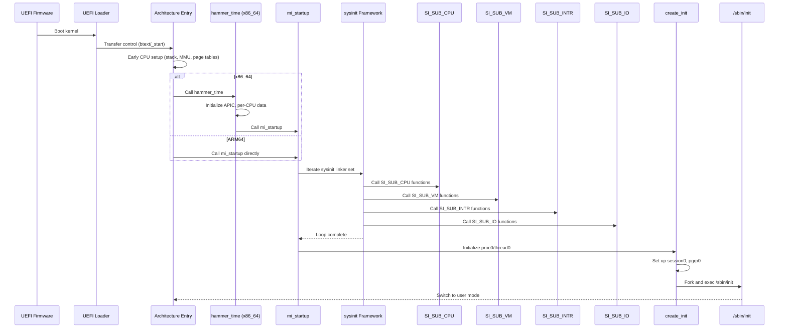

# Kernel Core — Structure and Entry Point
<!-- This file is auto-generated by generate-doc.py -- do not edit manually -->

---
**Navigation:**
  **Up:** [Source Tree — Layout and Conventions](../README_internals.md)
  **Related:** [Source Tree — Layout and Conventions](../README_internals.md) | [Boot Process — UEFI Bootloader to Kernel Handoff](../stand/efi/loader/README.md) | [Process Management — Scheduling and Lifecycle](kern/README_process.md)
  **All chapters:** [Source Tree — Layout and Conventions](../README_internals.md) | [Boot Process — UEFI Bootloader to Kernel Handoff](../stand/efi/loader/README.md) | [Build System — buildworld and buildkernel](../share/mk/README.md) | [Virtual Memory Subsystem — vm_page, UMA, and Pagers](vm/README.md) | [Process Management — Scheduling and Lifecycle](kern/README_process.md) | [Locking Primitives — Mutexes, sx, rmlocks, and Atomics](kern/README_locking.md) | [Buffer Cache — Block I/O Subsystem](vm/README_bcache.md) | [GEOM — Storage Framework](geom/README.md) ...
---


## Quick Summary

The FreeBSD kernel startup sequence bridges the gap between firmware execution and a fully operational userland environment. When the bootloader finishes, it transfers control to a small assembly stub that switches the CPU into long mode (on x86_64) or enables the MMU (on ARM64), establishes a trusted stack, and passes metadata pointers (such as the module list and memory layout) to the C entry point. From this moment, the kernel must initialize hardware abstractions, memory management, interrupt dispatch, and scheduling before any user process can run.

FreeBSD uses a strict, ordered initialization framework called `sysinit`. Every subsystem registers a startup function with a numeric level and an ordering value. The build system and linker script arrange these registrations into a contiguous linker set, which `mi_startup` iterates in order, guaranteeing that foundational services like the virtual memory system and interrupt controller are ready before higher-level components like network stacks or filesystems attempt to use them. This deterministic ordering prevents race conditions and dangling pointer dereferences during early boot.

Once the `sysinit` loop completes, the kernel initializes the initial process (`proc0`), which represents the idle thread and the boot context. The final step of the startup sequence spawns the first userland process (`/sbin/init`), establishes its execution environment, and switches the CPU to user mode. The transition marks the end of kernel bootstrap and the beginning of normal system operation.

## Architecture

Kernel entry points are architecture-specific and live in `sys/<arch>/<arch>/locore.S`. On x86_64, the symbol `btext` serves as the entry point. It validates CPU flags, switches to a kernel-controlled stack, and calls `hammer_time` (defined in `sys/amd64/amd64/machdep.c`), which prepares the architecture for C execution. `hammer_time` sets up the per-CPU data structures, enables the local APIC, and eventually calls `mi_startup` (defined in `sys/kern/init_main.c`), which iterates the sysinit framework.

```asm
# From sys/amd64/amd64/locore.S
ENTRY(btext)
    /* Don't trust what the loader gives for rflags. */
    pushq   $PSL_KERNEL
    popfq
    /* Get onto a stack that we can trust - there is no going back now. */
    movq    %rsp, %rbp
    movq    $bootstack,%rsp
    /* Grab metadata pointers from the loader. */
    movl    4(%rbp),%edi    /* modulep (arg 1) */
    movl    8(%rbp),%esi    /* kernend (arg 2) */
    xorq    %rbp, %rbp
    call    hammer_time     /* set up cpu for unix operation */
    movq    %rax,%rsp       /* set up kstack for mi_startup() */
    call    mi_startup      /* autoconfiguration, mountroot etc */
0:  hlt
    jmp     0b
```

On ARM64, the entry point is `_start` (defined in `sys/arm64/arm64/locore.S`), which follows a different flow. Rather than relying on a separate early CPU setup function, ARM64 performs substantial early setup directly in assembly: entering the kernel exception level, creating page tables, enabling the MMU, and setting up the bootstrap stack. The module pointer (originally in x0) is preserved in x1, and after zeroing the BSS section, the code calls `mi_startup()` directly. Unlike x86_64, where a large portion of CPU setup is delegated to C code for early CPU initialization, ARM64 handles these low-level operations in `locore.S` before transitioning to C code, keeping the assembly stub focused on getting the MMU and stack operational.

```asm
# From sys/arm64/arm64/locore.S
ENTRY(_start)
    /* Enter the kernel exception level */
    bl  enter_kernel_el
    /* Set the context id */
    msr contextidr_el1, xzr
    /* Get the virt -> phys offset */
    bl  get_load_phys_addr
    /* Create the page tables */
    bl  create_pagetables
    /* Enable the mmu */
    bl  start_mmu
    /* Jump to the virtual address space */
    ldr x15, .Lvirtdone
    br  x15
```

The `sysinit` framework relies on ELF linker sets to collect registration macros (`SYSINIT`) scattered across the source tree. The linker concatenates these entries into contiguous memory regions marked by `__start_set_sysinit` and `__stop_set_sysinit`. `mi_startup` iterates over this set, sorting entries by `si_sub` and `si_order` values at runtime using `sysinit_compar`, and invokes each function. The ordering guarantees that CPU-specific setup (`SI_SUB_CPU`) runs before virtual memory initialization (`SI_SUB_VM`), which in turn precedes interrupt handling (`SI_SUB_INTR`) and I/O subsystem setup (`SI_SUB_IO`).

The `struct sysinit` type, defined in `sys/sys/kernel.h`, is the core data structure of the framework:

```c
# From sys/sys/kernel.h
struct sysinit {
    sub_t           si_sub;           /* sub-id (level) */
    order_t         si_order;         /* ordering value */
    void            (*si_func)(void *); /* function pointer */
    void            *si_arg;          /* function argument */
    const char      *si_name;         /* name */
    TAILQ_ENTRY(sysinit) si_list;     /* list of sysinit entries */
};
```

Each `SYSINIT` macro invocation creates a `struct sysinit` entry placed in the linker set. The enumeration `enum sysinit_sub_id` in `sys/sys/kernel.h` defines the sub-id levels, with values chosen explicitly for binary compatibility rather than implicit ordering.

## Key Data Structures

### `struct sysinit`

The `struct sysinit` is the fundamental unit of the initialization framework. Each subsystem registers one or more entries using the `SYSINIT` macro. The fields are:

- `si_sub`: The sub-id level (e.g., `SI_SUB_CPU`, `SI_SUB_VM`, `SI_SUB_INTR`). These are defined in `sys/sys/kernel.h` as an enumeration `enum sysinit_sub_id`.
- `si_order`: Within the same sub-id level, entries are sorted by this value. Lower values execute first.
- `si_func`: A function pointer to the initialization routine, taking a `void *` argument.
- `si_arg`: An argument passed to the function.
- `si_name`: A human-readable name for debugging and tracing.
- `si_list`: A `TAILQ_ENTRY` used to link sysinit entries into a doubly-linked list.

The framework also includes `struct sysinit_tslog` for timestamping sysinit entries, which records `func`, `data`, and `name` fields for performance analysis.

### `proc0` and `thread0_storage`

The initial process and thread are statically allocated and never freed. In `sys/kern/init_main.c`:

```c
# From sys/kern/init_main.c
static struct session session0;
static struct pgrp pgrp0;
struct  proc proc0;
struct thread0_storage thread0_st __aligned(32) = {
    .t0st_thread = {
        /*
         * thread0.td_pflags is set with TDP_NOFAULTING to
         * short-cut the vm page fault handler until it is
         * ready.  It is cleared in vm_init() after VM
         * initialization.
         */
        .td_pflag = TDP_NOFAULTING,
    },
};
```

The `thread0_st` structure is aligned to 32 bytes. The `TDP_NOFAULTING` flag is set initially to short-circuit the VM page fault handler until `vm_init()` clears it, preventing page faults during early initialization before the virtual memory system is fully operational.

### `enum sysinit_sub_id`

Defined in `sys/sys/kernel.h`, this enumeration specifies the initialization levels:

- `SI_SUB_DUMMY` (0x0000000): Not executed; a placeholder.
- `SI_SUB_CPU`: CPU-specific initialization.
- `SI_SUB_VM`: Virtual memory system initialization.
- `SI_SUB_INTR`: Interrupt handling setup.
- `SI_SUB_IO`: I/O subsystem setup.
- `SI_SUB_LAST`: Must have the highest value; marks the end of the enumeration.

These values are explicit rather than implicit to provide binary compatibility with inserted elements. The numbers are chosen only for ordering purposes.

## Deep Dive

### The Boot Sequence: From Firmware to Userland

The kernel startup sequence proceeds in distinct phases:

**Phase 1: Firmware to Assembly Entry**

The bootloader (UEFI loader on current platforms, or legacy boot loaders) loads the kernel into memory and transfers control. On x86_64, the entry point is `btext` in `sys/amd64/amd64/locore.S`. The loader provides the stack with metadata: a 32-bit return address at `0(%rsp)`, a module pointer at `4(%rsp)`, and `kernend` at `8(%rbp)`. The assembly code discards the loader's rflags, switches to a trusted stack (`bootstack`), and extracts these metadata pointers into registers.

On ARM64, `_start` in `sys/arm64/arm64/locore.S` receives the module pointer in x0. The code enters the kernel exception level, creates page tables with `create_pagetables`, enables the MMU with `start_mmu`, and jumps to the virtual address space. After setting up the bootstrap stack and zeroing the BSS section, it preserves the module pointer in x1 and prepares the boot parameters structure.

**Phase 2: Architecture-Specific C Initialization**

On x86_64, `hammer_time` in `sys/amd64/amd64/machdep.c` performs the bulk of early CPU setup. It initializes per-CPU data structures, configures the local APIC, sets up interrupt vectors, and prepares the machine for C execution. The function returns a stack pointer in `%rax`, which becomes the stack for `mi_startup`.

On ARM64, most of this work happens in assembly before the C transition. The `machdep.c` file in `sys/arm64/arm64/` handles some early setup, but the bulk of MMU and page table work is done in `locore.S`.

**Phase 3: The sysinit Loop**

`mi_startup` in `sys/kern/init_main.c` is the heart of the initialization framework. It iterates over the linker set from `__start_set_sysinit` to `__stop_set_sysinit`, sorting entries by `si_sub` and `si_order` using `sysinit_compar` (also defined in `init_main.c`). For each entry, it calls the registered function with the provided argument.

The ordering guarantees that:
1. `SI_SUB_CPU` functions run first, initializing CPU-specific features.
2. `SI_SUB_VM` functions run next, setting up the virtual memory system.
3. `SI_SUB_INTR` functions configure interrupt handling.
4. `SI_SUB_IO` functions initialize I/O subsystems.
5. Higher-level subsystems (networking, filesystems, etc.) run in subsequent sub-id levels.

This strict ordering eliminates the need for locks during early boot, as there are no concurrent execution contexts at that stage. Each subsystem must complete its initialization before any subsystem that depends on it can begin.

**Phase 4: Process Creation**

After the sysinit loop completes, `mi_startup` calls `create_init`, which initializes `proc0` and the initial thread. The `session0` and `pgrp0` structures, also statically allocated, form the session and process group for the initial process. `create_init` configures resource limits, sets up the initial execution context, and eventually forks a child process to execute `/sbin/init`.

The transition to user mode involves setting up the userland execution environment: the stack, registers, and program counter are configured to point to the init executable. The CPU switches from kernel mode to user mode, marking the end of the bootstrap phase.

### Architecture-Specific Differences

The x86_64 and ARM64 boot paths differ significantly in how they handle early setup:

**x86_64** delegates substantial CPU initialization to C code via `hammer_time`. This approach keeps the assembly stub minimal but requires the MMU to be enabled by the bootloader before jumping to `btext`. The `la57_trampoline` function (also in `locore.S`) handles the transition from 4-level to 5-level paging when LA57 is enabled.

**ARM64** performs MMU setup, page table creation, and exception level transitions entirely in assembly. This is necessary because ARM64 starts in a lower exception level (EL2 or EL1) and must enter the kernel exception level (EL1 for normal operation) before the MMU can be safely enabled. The `enter_kernel_el`, `create_pagetables`, and `start_mmu` functions in `locore.S` handle these transitions.

## Flow / Diagram



## Advanced Notes

### Debugging with Boot Trace

FreeBSD includes a boot trace mechanism (`kern_boottrace.c`) that records sysinit events for performance analysis. The `boottrace()` function logs the start and end of each sysinit entry, providing timing data that can be dumped via DDB or the `boottrace` sysctl. The `bt_event` and `bt_table` structures in `sys/kern/kern_boottrace.c` store event records, while `boottrace_init()` initializes the trace buffer.

DTrace Static Tracing (SDT) probes are available during kernel startup for performance analysis. The `sys/sys/dtrace_bsd.h` header provides the `DTRACE_PROBE` macros used throughout the kernel, including in `init_main.c`. During `mi_startup`, SDT probes can fire at key points such as sysinit entry and exit, allowing precise measurement of initialization times.

### Performance Considerations

The sysinit framework's sorting step adds overhead during boot. `sysinit_compar` performs a comparison-based sort on the linker set entries at runtime. For systems with many subsystems, this sort can be noticeable. The `opt_verbose_sysinit.h` option enables verbose output during boot, printing each sysinit entry as it executes, which is useful for identifying slow initialization functions.

The `sysinit_mklist` and `sysinit_add` functions in `init_main.c` provide mechanisms for dynamically adding sysinit entries at runtime, which is used by kernel modules. Modules that load after the initial boot can register their own initialization functions, which are appended to the sysinit framework.

### Common Pitfalls

1. **Ordering dependencies**: If a subsystem registers a sysinit entry with an incorrect sub-id or order value, it may execute before its dependencies are ready. For example, registering a network subsystem at `SI_SUB_CPU` instead of a higher level will cause failures if the network code depends on the virtual memory system.

2. **Missing sysinit entries**: If a subsystem's initialization function is not registered via `SYSINIT`, it will not be called during boot. This can lead to subtle bugs where the subsystem appears to work in some configurations but fails in others.

3. **Thread0 page fault flag**: The `TDP_NOFAULTING` flag on `thread0` must be cleared by `vm_init()` after virtual memory initialization. If this flag is not cleared, page faults in the initial thread will be silently ignored, leading to silent data corruption or kernel panics later.

4. **Linker set boundaries**: The `__start_set_sysinit` and `__stop_set_sysinit` symbols must be correctly defined in the linker script. If the linker set is not contiguous, `mi_startup` may read garbage entries or miss valid ones.

5. **ARM64 exception level transitions**: On ARM64, incorrect exception level transitions in `locore.S` can lead to kernel panics that are difficult to debug, as the CPU may be in an unexpected state. The `enter_kernel_el` function must correctly configure the exception level and security state.

### Connection to OS Theory

The sysinit framework embodies the principle of layered initialization, a concept found in many operating systems. Unlike monolithic kernels that initialize everything in a single function, FreeBSD's approach allows subsystems to be developed, tested, and reordered independently. The explicit ordering values (sub-id and order) provide a form of dependency management that is simpler than the dependency graphs used in some systems but sufficient for the boot-time phase where concurrency is absent.

The use of linker sets (ELF sections) for collecting initialization entries is a technique shared with Linux's `initcall` mechanism and NetBSD's `init` framework. FreeBSD's implementation is notable for its runtime sorting, which allows new entries to be inserted without requiring recompilation of the entire kernel.

## See Also
- [Source Tree — Layout and Conventions](../README_internals.md)
- [Boot Process — UEFI Bootloader to Kernel Handoff](../stand/efi/loader/README.md)
- [Process Management — Scheduling and Lifecycle](kern/README_process.md)


- [`sys/kern/init_main.c`](kern/init_main.c): The main file containing `mi_startup`, `create_init`, and the sysinit framework implementation.
- [`sys/amd64/amd64/locore.S`](amd64/amd64/locore.S): x86_64 assembly entry point (`btext`) and `hammer_time` call.
- [`sys/arm64/arm64/locore.S`](arm64/arm64/locore.S): ARM64 assembly entry point (`_start`) with MMU setup.
- [`sys/sys/kernel.h`](sys/kernel.h): Definition of `struct sysinit`, `enum sysinit_sub_id`, and the `SYSINIT` macro.
- [`sys/kern/kern_boottrace.c`](kern/kern_boottrace.c): Boot trace infrastructure for performance analysis.

---

> _Generated by [DaemonDocs](https://github.com/ocochard/DaemonDocs) on 2026-05-03 22:07 UTC using model `Qwen3.6-35B-A3B-UD-Q8_K_XL` (llama.cpp build `b8985-27aef3dd9`). AI-generated content — verify against source before relying on it._
