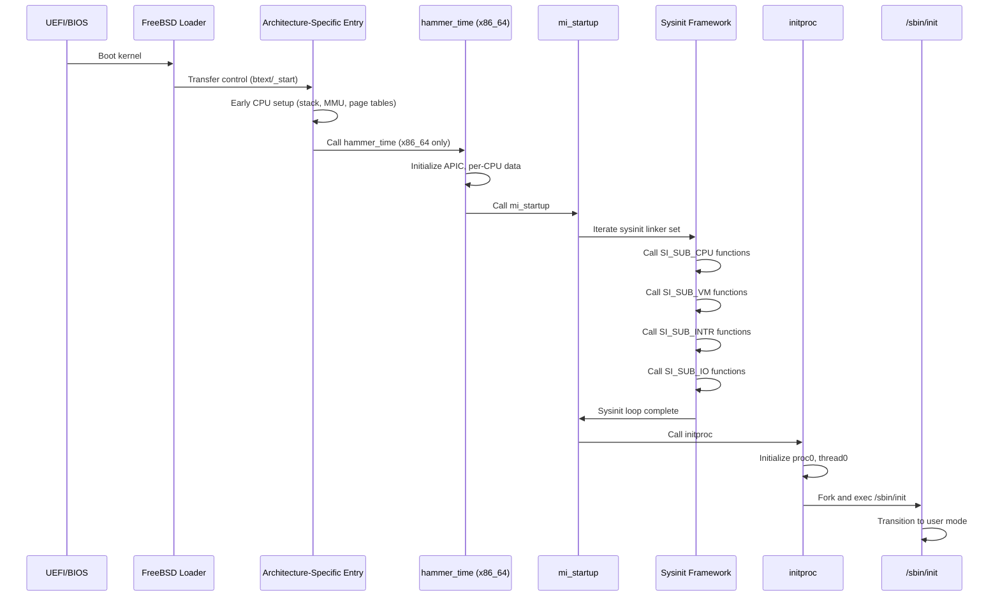

# Kernel Core — Structure and Entry Point
<!-- This file is auto-generated by generate-doc.py -- do not edit manually -->

---
**Navigation:**
  **Up:** [Source Tree — Layout and Conventions](../README_internals.md)
  **Related:** [Source Tree — Layout and Conventions](../README_internals.md) | [Boot Process — UEFI Bootloader to Kernel Handoff](../stand/efi/loader/README.md) | [Process Management — Scheduling and Lifecycle](kern/README_process.md)
  **All chapters:** [Source Tree — Layout and Conventions](../README_internals.md) | [Boot Process — UEFI Bootloader to Kernel Handoff](../stand/efi/loader/README.md) | [Build System — buildworld and buildkernel](../share/mk/README.md) | [Virtual Memory Subsystem — vm_page, UMA, and Pagers](vm/README.md) | [Process Management — Scheduling and Lifecycle](kern/README_process.md) | [Locking Primitives — Mutexes, sx, rmlocks, and Atomics](kern/README_locking.md) | [Buffer Cache — Block I/O Subsystem](vm/README_bcache.md) | [GEOM — Storage Framework](geom/README.md) ...
---


> ⚠ **UNVERIFIED DRAFT** — reviewer did not explicitly approve this draft. Treat claims as suspect until manually reviewed.


## Quick Summary
The FreeBSD kernel startup sequence bridges the gap between firmware execution and a fully operational userland environment. When the bootloader finishes, it transfers control to a small assembly stub that switches the CPU into long mode (on x86_64) or enables the MMU (on ARM64), establishes a trusted stack, and passes metadata pointers (such as the module list and memory layout) to the C entry point. From this moment, the kernel must initialize hardware abstractions, memory management, interrupt dispatch, and scheduling before any user process can run.

FreeBSD uses a strict, ordered initialization framework called `sysinit`. Every subsystem registers a startup function with a numeric level and an ordering value. The build system and linker script arrange these registrations into a contiguous linker set, which `mi_startup` iterates in order, guaranteeing that foundational services like the virtual memory system and interrupt controller are ready before higher-level components like network stacks or filesystems attempt to use them. This deterministic ordering prevents race conditions and dangling pointer dereferences during early boot.

Once the `sysinit` loop completes, the kernel initializes the initial process (`proc0`), which represents the idle thread and the boot context. The final step of the startup sequence spawns the first userland process (`/sbin/init`), establishes its execution environment, and switches the CPU to user mode. The transition marks the end of kernel bootstrap and the beginning of normal system operation.

## Architecture
Kernel entry points are architecture-specific and live in `sys/<arch>/<arch>/locore.S`. On x86_64, the symbol `btext` serves as the entry point. It validates CPU flags, switches to a kernel-controlled stack, and calls `hammer_time` (defined in `sys/amd64/amd64/machdep.c`), which prepares the architecture for C execution. `hammer_time` sets up the per-CPU data structures, enables the local APIC, and eventually calls `mi_startup` (defined in `sys/kern/init_main.c`), which iterates the sysinit framework.

On ARM64, the entry point is `_start` (defined in `sys/arm64/arm64/locore.S`), which follows a different flow. Rather than relying on a separate early CPU setup function, ARM64 performs substantial early setup directly in assembly: entering the kernel exception level, creating page tables, enabling the MMU, and setting up the bootstrap stack. The module pointer (originally in x0) is preserved in x1, and after zeroing the BSS section, the code calls `mi_startup()` directly. Unlike x86_64, where a large portion of CPU setup is delegated to C code for early CPU initialization, ARM64 handles these low-level operations in `locore.S` before transitioning to C code, keeping the assembly stub focused on getting the MMU and stack operational.

The `sysinit` framework relies on ELF linker sets to collect registration macros (`SYSINIT`) scattered across the source tree. The linker concatenates these entries into contiguous memory regions marked by `__start_set_sysinit` and `__stop_set_sysinit`. `mi_startup` iterates over this set, sorting entries by `si_sub` and `si_order` values at runtime using `sysinit_compar`, and invokes each function. The ordering guarantees that CPU-specific setup (`SI_SUB_CPU`) runs before virtual memory initialization (`SI_SUB_VM`), which in turn precedes interrupt handling (`SI_SUB_INTR`) and I/O subsystem setup (`SI_SUB_IO`).

After the `sysinit` loop finishes, `mi_startup` calls `initproc`, which initializes `proc0`, sets up the initial thread, configures resource limits, and eventually forks a child process and calls `kern_execve` on `/sbin/init`. The kernel then transitions to user mode, completing the bootstrap phase.

Machine-dependent initialization continues in architecture-specific files such as `sys/amd64/amd64/machdep.c`, which contains the `cpu_init` function and other x86-specific setup routines. This file is responsible for configuring CPU features detected during early boot, setting up the local APIC, initializing per-CPU data structures, and registering architecture-specific sysinit hooks.

## Key Data Structures
The `sysinit` framework is built around the `struct sysinit` type, defined in `sys/sys/kernel.h`. Each registration creates an entry in this structure, containing a function pointer, a subsystem identifier, an ordering value, and a name. The structure is organized into a linker set, allowing `mi_startup` to iterate over all registered entries.

```c
struct sysinit {
    void (*func) (void *);      /* Function to call */
    void *data;                 /* Data pointer */
    int si_sub;                 /* Subsystem order */
    int si_order;               /* Order within subsystem */
    const char *name;           /* Name */
};
```

The `SYSINIT` macro simplifies registration:
```c
#define SYSINIT(uniquifier, subsystem, order, func, ident)
```

This macro expands to a `struct sysinit` entry placed in the linker set. The `subsystem` parameter specifies the initialization phase (e.g., `SI_SUB_CPU`, `SI_SUB_VM`), while `order` determines the sequence within that phase.

The `struct sysinit_tslog` is used for timestamping sysinit entries, providing additional metadata for debugging and performance analysis.

## Deep Dive
The kernel startup sequence begins with the bootloader transferring control to the architecture-specific entry point. On x86_64, this is `btext` in `sys/amd64/amd64/locore.S`. The entry point performs minimal setup: it validates CPU flags, switches to a kernel-controlled stack, and calls `hammer_time`.

```assembly
ENTRY(btext)
    /* Don't trust what the loader gives for rflags. */
    pushq   $PSL_KERNEL
    popfq

    /* Get onto a stack that we can trust - there is no going back now. */
    movq    %rsp, %rbp
    movq    $bootstack, %rsp

    /* Grab metadata pointers from the loader. */
    movl    4(%rbp), %edi     /* modulep (arg 1) */
    movl    8(%rbp), %esi     /* kernend (arg 2) */
    xorq    %rbp, %rbp

    call    hammer_time       /* set up cpu for unix operation */
    movq    %rax, %rsp        /* set up kstack for mi_startup() */
    call    mi_startup        /* autoconfiguration, mountroot etc */
0:  hlt
    jmp     0b
```

The `hammer_time` function in `sys/amd64/amd64/machdep.c` performs extensive CPU setup: it initializes the local APIC, configures CPU features, sets up the per-CPU data structures, and prepares the architecture for C execution. After `hammer_time` returns, `mi_startup` is called with a fresh kernel stack.

`mi_startup` in `sys/kern/init_main.c` iterates over the sysinit linker set:

```c
void
mi_startup(void)
{
    struct sysinit *sip, *si_start, *si_end;
    size_t si_start_size, si_end_size;

    /*
     * Get the start and end of the sysinit set from the linker.
     */
    GET_SET(sysinit, si_start, si_start_size, si_end, si_end_size);

    /*
     * Sort the sysinit entries by subsystem and order.
     */
    qsort(sysinit_set, sysinit_set_size, sizeof(struct sysinit), sysinit_compar);

    /*
     * Iterate over the sorted sysinit entries and call each function.
     */
    for (sip = si_start; sip < si_end; sip++) {
        sip->func(sip->data);
    }

    /*
     * After the sysinit loop, call initproc to initialize proc0
     * and spawn the first userland process.
     */
    initproc();
}
```

The sysinit entries are sorted by `si_sub` and `si_order` values before iteration, ensuring that foundational services are initialized before higher-level components. The `sysinit_compar` function handles the comparison logic.

After the sysinit loop completes, `initproc` is called. This function initializes `proc0`, sets up the initial thread (`thread0`), configures resource limits, and eventually forks a child process and calls `kern_execve` on `/sbin/init`.

```c
struct proc proc0;
struct thread0_storage thread0_st __aligned(32) = {
    .t0st_thread = {
        /*
         * thread0.td_pflags is set with TDP_NOFAULTING to
         * short-cut the vm page fault handler until it is
         * ready.  It is cleared during VM initialization
         * after the virtual memory subsystem is fully operational.
         */
        .td_pflag = TDP_NOFAULTING,
        ...
    }
};
```

On ARM64, the startup flow is different. The `_start` entry point in `sys/arm64/arm64/locore.S` performs extensive early setup directly in assembly:

```assembly
ENTRY(_start)
    /* Enter the kernel exception level */
    bl  enter_kernel_el

    /* Set the context id */
    msr contextidr_el1, xzr

    /* Get the virt -> phys offset */
    bl  get_load_phys_addr

    /* Create the page tables */
    bl  create_pagetables

    /* Enable the mmu */
    bl  start_mmu

    /* Jump to the virtual address space */
    ldr x15, .Lvirtdone
    br  x15

virtdone:
    BTI_J

    /* Set up the stack */
    adrp    x25, initstack_end
    add x25, x25, :lo12:initstack_end
    sub sp, x25, #PCB_SIZE

    /* Zero the BSS */
    ldr x15, .Lbss
    ldr x14, .Lend
1:
    stp xzr, xzr, [x15], #16
    cmp x15, x14
    b.lo  1b
```

After zeroing the BSS section, the ARM64 code preserves the module pointer in x1, sets up the bootstrap stack, and calls `mi_startup()` directly.

## Flow / Diagram


## Advanced Notes
The sysinit framework provides a deterministic initialization order that prevents race conditions during early boot. Each subsystem registers its startup function with a specific `si_sub` and `si_order` value, ensuring that foundational services are initialized before higher-level components depend on them.

The linker set mechanism uses ELF linker sets (`__start_set_sysinit` and `__stop_set_sysinit`) to collect all `SYSINIT` registrations. This approach allows the build system to automatically discover and include all subsystem initializations without manual tracking.

Debugging the sysinit framework can be done using the `opt_verbose_sysinit.h` option, which enables detailed logging of each sysinit entry as it is called.

The `thread0` structure is aligned to 32 bytes and includes the `TDP_NOFAULTING` flag, which short-circuits the VM page fault handler until the virtual memory system is fully initialized. This flag is cleared during VM initialization after the virtual memory subsystem is ready to handle page faults.

Performance implications of the sysinit framework include the sorting step, which uses `qsort` to order entries by `si_sub` and `si_order`. While this adds a small overhead during boot, it ensures correct initialization order and simplifies subsystem registration.

Common pitfalls include incorrect `si_sub` or `si_order` values, which can lead to initialization failures or race conditions. Developers should carefully review the sysinit ordering when adding new subsystems or modifying existing ones.

## Comparison
FreeBSD's sysinit framework differs significantly from Linux's initialization model. Linux uses a combination of `arch_initcall`, `core_initcall`, `postcore_initcall`, and other initcall levels, which are similarly ordered but implemented differently. FreeBSD's linker set approach provides a more uniform mechanism, while Linux's approach relies on section attributes and explicit ordering.

In terms of process management, FreeBSD's `proc0` represents the idle thread and boot context, initialized after the sysinit loop. Linux's `init_task` serves a similar purpose but is initialized earlier in the boot process. FreeBSD's approach of initializing `proc0` after the sysinit loop allows for more flexible subsystem initialization.

The virtual memory initialization differs between FreeBSD and Linux. FreeBSD uses UMA (Uniform Memory Allocator) for small object allocation, while Linux uses SLUB. FreeBSD's `vm_map` uses a red-black tree (`vm_map_tree`) for address space management, whereas Linux uses an augmented interval tree (`vm_area_struct` with `rb_tree`) — FreeBSD's implementation is optimized for the kernel heap mapping while Linux's interval tree supports more complex VMA operations like `split_vma` and `merge_vma`.

macOS/XNU uses a hybrid approach, combining elements of BSD and Mach. Its bootstrap sequence begins with Mach-specific code (`start_kernel` → `bootstrap` → `os_init0`), which initializes the Mach IPC port system and Mach bootstrap services before any BSD subsystems are initialized. Unlike FreeBSD's static linker sets, XNU uses Mach ports and a dynamic bootstrap namespace for subsystem registration. Additionally, XNU's `thread0` equivalent is created in `os_init1` after Mach kernel threads and the Mach scheduler are already running, meaning the Mach microkernel handles early scheduling and IPC before the BSD layer takes over process management.

NetBSD uses a different sysinit ordering model: instead of FreeBSD's two-level `si_sub`/`si_order` scheme, NetBSD uses a single `si_order` field with a flat ordering, and its `mi_startup` function processes entries in a single pass without the explicit subsystem grouping that FreeBSD provides.

OpenBSD's initialization sequence uses `config_init()` and `config_rootsearch()` for device configuration rather than FreeBSD's sysinit framework. OpenBSD also employs the `pax` memory protection model (W^X) at boot time, enforcing write-execute separation on kernel code sections, which is not present in FreeBSD's default boot sequence.

## See Also
- [Source Tree — Layout and Conventions](../README_internals.md)
- [Boot Process — UEFI Bootloader to Kernel Handoff](../stand/efi/loader/README.md)
- [Process Management — Scheduling and Lifecycle](kern/README_process.md)


---

> _Generated by [DaemonDocs](https://github.com/ocochard/DaemonDocs) on 2026-04-30 18:53 UTC using model `Qwen3.6-35B-A3B-UD-Q4_K_XL` (llama.cpp build `b8985-27aef3dd9`). AI-generated content — verify against source before relying on it._
