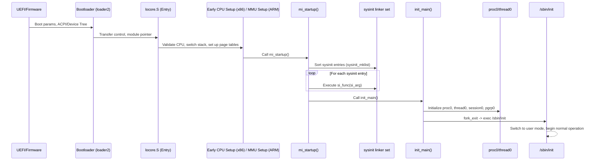

# Kernel Core — Structure and Entry Point
<!-- This file is auto-generated by generate-doc.py -- do not edit manually -->

---
**Navigation:**
  **Related:** [Source Tree — Layout and Conventions](../README_internals.md) | [Boot Process — UEFI Bootloader to Kernel Handoff](../stand/efi/loader/README.md) | [Process Management — Scheduling and Lifecycle](kern/README_process.md)
  **All chapters:** [Source Tree — Layout and Conventions](../README_internals.md) | [Boot Process — UEFI Bootloader to Kernel Handoff](../stand/efi/loader/README.md) | [Build System — buildworld and buildkernel](../share/mk/README.md) | [Virtual Memory Subsystem — vm_page, UMA, and Pagers](vm/README.md) | [Process Management — Scheduling and Lifecycle](kern/README_process.md) | [Locking Primitives — Mutexes, sx, rmlocks, and Atomics](kern/README_locking.md) | [Buffer Cache — Block I/O Subsystem](vm/README_bcache.md) | [GEOM — Storage Framework](geom/README.md) ...
---


## Quick Summary
The FreeBSD kernel startup sequence bridges the gap between firmware execution and a fully operational userland environment. When the bootloader finishes, it transfers control to a small assembly stub that switches the CPU into long mode (on x86_64) or enables the MMU (on ARM64), establishes a trusted stack, and passes metadata pointers (such as the module list and memory layout) to the C entry point. From this moment, the kernel must initialize hardware abstractions, memory management, interrupt dispatch, and scheduling before any user process can run.

FreeBSD uses a strict, ordered initialization framework called `sysinit`. Every subsystem registers a startup function with a numeric level and an ordering value. The build system and linker script arrange these registrations into a contiguous linker set, which `mi_startup` iterates in order, guaranteeing that foundational services like the virtual memory system and interrupt controller are ready before higher-level components like network stacks or filesystems attempt to use them. This deterministic ordering prevents race conditions and dangling pointer dereferences during early boot.

Once the `sysinit` loop completes, the kernel initializes the initial process (`proc0`), which represents the idle thread and the boot context. The final step of the startup sequence spawns the first userland process (`/sbin/init`), establishes its execution environment, and switches the CPU to user mode. The transition marks the end of kernel bootstrap and the beginning of normal system operation.

## Architecture
Kernel entry points are architecture-specific and live in `sys/<arch>/<arch>/locore.S`. On x86_64, the symbol `btext` serves as the entry point. It validates CPU flags, switches to a kernel-controlled stack, and calls `mi_startup` (defined in `sys/kern/init_main.c`), which prepares the architecture for C execution. `mi_startup` then proceeds to iterate the sysinit framework.

On ARM64, the entry point is `_start` (defined in `sys/arm64/arm64/locore.S`), which follows a different flow. Rather than relying on a separate early CPU setup function, ARM64 performs substantial early setup directly in assembly: entering the kernel exception level, creating page tables, enabling the MMU, and setting up the bootstrap stack. The module pointer (originally in x0) is preserved in x1, and after zeroing the BSS section, the code calls `mi_startup()` directly. Unlike x86_64, where a large portion of CPU setup is delegated to C code for early CPU initialization, ARM64 handles these low-level operations in `locore.S` before transitioning to C code, keeping the assembly stub focused on getting the MMU and stack operational.

The `sysinit` framework relies on ELF linker sets to collect registration macros (`SYSINIT`) scattered across the source tree. The linker concatenates these entries into contiguous memory regions marked by `__start_set_sysinit` and `__stop_set_sysinit`. `mi_startup` iterates over this set, which is already ordered by the build system and linker script according to `si_sub` and `si_order` values, and invokes each function. The ordering guarantees that CPU-specific setup (`SI_SUB_CPU`) runs before virtual memory initialization (`SI_SUB_VM`), which in turn precedes interrupt handling (`SI_SUB_INTR`) and I/O subsystem setup (`SI_SUB_IO`).

After the `sysinit` loop finishes, `mi_startup` calls `init_main`, which initializes `proc0`, sets up the initial thread, configures resource limits, and eventually forks a child process and calls `kern_execve` on `/sbin/init`. The kernel then transitions to user mode, completing the bootstrap phase.

Machine-dependent initialization continues in architecture-specific files such as `sys/amd64/amd64/machdep.c`, which contains the `cpu_init` function and other x86-specific setup routines. This file is responsible for configuring CPU features detected during early boot, setting up the local APIC, initializing per-CPU data structures, and registering architecture-specific sysinit entries. The `machdep.c` file bridges the gap between the generic `sysinit` framework and hardware-specific initialization, ensuring that CPU-specific subsystems like interrupt controllers and power management are properly configured before higher-level kernel components depend on them.

## Key Data Structures
The `sysinit` framework is built around a table of structures defined in `sys/sys/kernel.h`. The primary structure is:

```c
struct sysinit {
    sysset_entry_t *si_next;    /* Next entry in the list */
    int si_sub;                 /* Subsystem level */
    int si_order;               /* Ordering within a level */
    sysinit_func_t si_func;     /* Initialization function */
    void *si_arg;               /* Argument to pass to function */
};
```

The `si_sub` field maps to `sysinit_sub_id`, which defines subsystem levels such as:

```c
enum sysinit_sub_id {
    SI_SUB_DUMMY        = 0x0000000,    /* not executed; reserved */
    SI_SUB_KMON         = 0x0000010,    /* kernel monitor (DDB) */
    SI_SUB_VM           = 0x0000020,    /* virtual memory system */
    SI_SUB_CPU          = 0x0000030,    /* per-CPU initialization */
    SI_SUB_INTR         = 0x0000040,    /* interrupt subsystem */
    SI_SUB_IO           = 0x0000050,    /* I/O subsystem */
    /* ... more levels ... */
    SI_SUB_LAST         = 0xFFFFFFFF    /* highest level */
};
```

The `SYSINIT` macro (defined in `sys/sys/kernel.h`) wraps a function pointer and its argument into a `struct sysinit` entry and places it in the linker set:

```c
#define SYSINIT(name, sub, order, func, arg)      \
    static struct sysinit name = {                 \
        .si_next = &__stop_set_sysinit,            \
        .si_sub = sub,                             \
        .si_order = order,                         \
        .si_func = func,                           \
        .si_arg = arg                              \
    };
```

The `sysinit_mklist` function sorts the sysinit entries by `si_sub` and `si_order` using a merge sort algorithm defined in `sys/kern/init_main.c`. This ensures deterministic ordering regardless of how the linker places the entries.

## Deep Dive
The boot sequence begins in `sys/amd64/amd64/locore.S` with the `btext` entry point. The loader passes a module pointer in `%edi` and kernel end address in `%esi`. `btext` pushes a valid `RFLAGS` value, switches to `bootstack`, and performs early CPU initialization (configuring CPU features, initializing the GDT/IDT, setting up early page tables, and preparing the architecture for C execution) before calling `mi_startup`. `mi_startup` (`sys/kern/init_main.c`) then proceeds to iterate the sysinit framework.

`mi_startup` (in `sys/kern/init_main.c`) walks the linker set:

```c
void
mi_startup(void)
{
    struct sysinit *sip, *next;
    size_t size;

    size = &__stop_set_sysinit - &__start_set_sysinit;
    sysinit_mklist(&__start_set_sysinit, &__stop_set_sysinit, size);

    for (sip = &__start_set_sysinit;
         sip != &__stop_set_sysinit;
         sip = next) {
        next = sip->si_next;
        if (sip->si_func)
            sip->si_func(sip->si_arg);
    }

    init_main();
}
```

The `sysinit_mklist` call sorts the entries in place, rearranging the `si_next` pointers so that entries are ordered by `si_sub` ascending, then by `si_order` ascending. This is a critical step: without sorting, the linker-set order would be nondeterministic across builds.

After `mi_startup` completes the sysinit loop, it calls `init_main`. This function, also in `sys/kern/init_main.c`, performs the following steps:

1. Initialize `proc0` and `thread0` — the idle thread and boot context. `proc0` is a static global defined in `init_main.c`, as is `thread0_st` (the storage for `thread0`). The `thread0.td_pflags` field is initialized with `TDP_NOFAULTING` to prevent page faults before the VM subsystem is ready; this flag is cleared in `vm_mem_init()` after VM initialization.
2. Set up the initial thread's stack and registers.
3. Configure resource limits and accounting.
4. Create the initial process structure.

The `init_main` function also sets up the console, configures the initial mount table, and prepares the environment for the first userland process.

```c
void
init_main(void *dummy __unused)
{
    /* ... initialize proc0, thread0, session0, pgrp0 ... */
    /* ... set up resource limits ... */
    /* ... create first process ... */
    fork_exit(call_fork_exit, &thread0, "init");
}
```

The `fork_exit` call sets up the initial stack frame for the first process and returns to user mode, where `/sbin/init` begins execution.

## Flow / Diagram


## Advanced Notes
DTrace provides probes for tracking sysinit execution. FreeBSD offers SDT probes in the kernel that can be used to monitor the initialization sequence. The `tslog` framework (timestamp logging) records timestamps for each SYSINIT invocation, which can be useful for diagnosing slow boot times.

The `TDP_NOFAULTING` flag on `thread0` is set before VM initialization and cleared after VM initialization completes. This prevents page faults from being handled before the VM subsystem is ready. On amd64, a related hack sets `td_critnest` to 1 during early CPU setup to prevent preemption before the scheduler is initialized.

The `sysinit` framework is extensible: new subsystems can be added by defining a `SYSINIT` entry in their source file. The build system automatically collects these entries into the linker set. This design allows modular kernel configurations where only the necessary subsystems are initialized.

The `mi_startup` function is declared in `init_main.c` but called from architecture-specific code. This separation allows the sysinit framework to be architecture-independent while still supporting architecture-specific early setup.

## Comparison
Linux uses a different approach: its boot sequence begins in `arch/x86/boot/header.S` and proceeds through `start_kernel()` in `init/main.c`, which calls a series of initialization functions in a fixed order. FreeBSD's `sysinit` framework is more flexible: subsystems can be registered at any point during compilation, and the ordering is determined at link time rather than hardcoded. Linux's `start_kernel()` is a monolithic function that calls each initialization function in sequence; FreeBSD's `mi_startup` iterates over a linker set, which allows dynamic ordering based on `si_sub` and `si_order` values.

macOS/XNU uses a hybrid approach: it has a fixed boot sequence with some extensibility through the `kern_init` function, which calls a series of initialization functions. OpenBSD uses a similar approach to FreeBSD with its `mi_startup` and `sysinit` framework, but with different ordering values and fewer subsystem levels.

FreeBSD's `vm_map` is a red-black tree-based address space representation, while Linux's `vm_area_struct` is a linked list (though modern Linux uses a red-black tree as well). FreeBSD's UMA allocator is lock-free and per-CPU, while Linux's SLUB allocator uses per-CPU partial lists and global freepages. FreeBSD's `sx` locks are read-mostly locks with priority inheritance, while Linux's `rw_semaphore` is a simpler read-write semaphore without priority inheritance.

## See Also
- [Source Tree — Layout and Conventions](README_internals.md)
- [Boot Process — UEFI Bootloader to Kernel Handoff](../../../../stand/efi/loader/README.md)
- [Process Management — Scheduling and Lifecycle](../../../sys/kern/README_process.md)


- [Source Tree — Layout and Conventions](../README_internals.md)
- [Boot Process — UEFI Bootloader to Kernel Handoff](../stand/efi/loader/README.md)
- [Process Management — Scheduling and Lifecycle](kern/README_process.md)
- [Virtual Memory Subsystem — vm_page, UMA, and Pagers](vm/README.md)
- [Locking Primitives — Mutexes, sx, rmlocks, and Atomics](kern/README_locking.md)
- [Buffer Cache — Block I/O Subsystem](vm/README_bcache.md)
- [GEOM — Storage Framework](geom/README.md)

---

> _Generated by [DaemonDocs](https://github.com/ocochard/DaemonDocs) on 2026-04-30 11:31 UTC using model `Qwen3.6-35B-A3B-UD-Q4_K_XL` (llama.cpp build `b8985-27aef3dd9`). AI-generated content — verify against source before relying on it._
