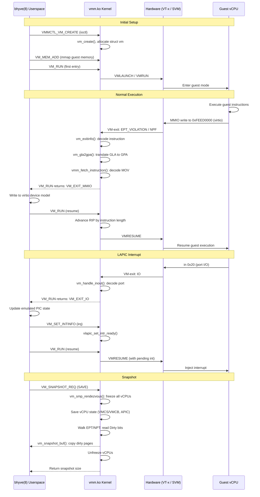

# bhyve — VMM Kernel Module and Hypervisor
<!-- This file is auto-generated by generate-doc.py -- do not edit manually -->

---
**Navigation:**
  **Up:** [Kernel Core — Structure and Entry Point](../../README.md) ▸ [Source Tree — Layout and Conventions](../../../README_internals.md)
  **Related:** [Virtual Memory Subsystem — vm_page, UMA, and Pagers](../../vm/README.md) | [Process Management — Scheduling and Lifecycle](../../kern/README_process.md) | [VNET — Virtual Network Stacks](../../net/README_vnet.md) | [Device Driver Framework — newbus and devclass](../../kern/README_driver.md)
  **All chapters:** [Source Tree — Layout and Conventions](../../../README_internals.md) | [Boot Process — UEFI Bootloader to Kernel Handoff](../../../stand/efi/loader/README.md) | [Kernel Core — Structure and Entry Point](../../README.md) | [Build System — buildworld and buildkernel](../../../share/mk/README.md) | [System Calls and Image Activation — Entry, sysent, and exec](../../kern/README_syscall.md) | [Kernel Modules and the Linker — KLD, SYSINIT, and linker sets](../../kern/README_kld.md) | [Virtual Memory Subsystem — vm_page, UMA, and Pagers](../../vm/README.md) | [Process Management — Scheduling and Lifecycle](../../kern/README_process.md) ...
---


## Quick Summary

The FreeBSD bhyve hypervisor is a type-2 hypervisor that runs as a kernel module (`vmm.ko`) plus a userspace daemon ([`bhyve(8)`](../../../usr.sbin/bhyve/bhyve.8)). The kernel module owns the hardware virtualization machinery: it programs the CPU's VT-x or SVM (AMD's Secure Virtual Machine extension) extensions, maintains per-vCPU execution [state](../../netpfil/pf/README.md#glossary), manages the guest's physical address space through extended page tables (EPT on Intel, NPT on AMD), and dispatches every VM-exit event. The userspace daemon owns the device model — PCI bus emulation, virtio devices, UEFI firmware, and CPUID (the x86 instruction that returns CPU identification/capabilities) tables — and is driven by the kernel through an ioctl interface on the `/dev/vmm` device.

When a guest vCPU executes, it runs directly on the host hardware. Certain events — a memory access to an MMIO region, a port I/O instruction, an `hlt`, an MSR read/write, or a pending interrupt — cause the CPU to exit guest mode and transfer control to the kernel. The kernel's `vm_exitinfo()` dispatcher examines the exit reason and decides how to handle it. Stateful operations that the kernel can resolve on its own (APIC register writes, MTRR (Memory Type Range Register) accesses, CPUID) are handled inline. Operations that require the userspace device model (MMIO to a virtio queue, port I/O to a serial console) are packaged into a `struct vm_exit` and returned to userspace through the `VM_RUN` ioctl, which then updates the emulated device and re-enters the kernel to resume the guest.

The kernel also provides the infrastructure for live migration and snapshots. EPT and NPT page-table entries carry hardware-maintained Accessed and Dirty bits. The kernel exposes these through the `VM_SNAPSHOT_REQ` ioctl, allowing the userspace management tool to identify which guest memory pages have been modified since the last snapshot and transfer only those pages during migration. This design keeps the high-frequency path (guest execution, VM-exit handling) in the kernel and the low-frequency path (device emulation, management) in userspace.


## Architecture

The VMM (Virtual Machine Monitor) kernel module resides in `sys/amd64/vmm/` and follows a strict separation between machine-independent dispatch and architecture-specific implementation.

**Machine-independent layer.** The core file `sys/amd64/vmm/vmm.c` implements the ioctl interface, vCPU lifecycle management, and the central VM-exit dispatcher. It uses the `DEFINE_VMMOPS_IFUNC` macro (defined at the top of `vmm.c`) to create indirect function pointers that route each operation to either the Intel or AMD implementation based on the host CPU vendor:

```c
/* From sys/amd64/vmm/vmm.c */
#define	DEFINE_VMMOPS_IFUNC(ret_type, opname, args)			\
    DEFINE_IFUNC(, ret_type, vmmops_##opname, args)			\
    {									\
    	if (vmm_is_intel())						\
    		return (vmm_ops_intel.opname);				\
    	else if (vmm_is_svm())						\
    		return (vmm_ops_amd.opname);				\
    	else								\
    		return ((ret_type (*)args)vmmops_panic);		\
    }

DEFINE_VMMOPS_IFUNC(int, modinit, (int ipinum))
DEFINE_VMMOPS_IFUNC(int, modcleanup, (void))
DEFINE_VMMOPS_IFUNC(void, modsuspend, (void))
DEFINE_VMMOPS_IFUNC(void, modresume, (void))
```

The `vmm_ops` structure (defined in `sys/amd64/include/vmm.h`) is the vtable that both `vmx.c` and `svm.c` fill in at module load time. The machine-independent code in `vmm.c` calls `vmmops_run(vcpu)`, which dispatches to `vmx_run()` or `svm_run()`.

The machine-dependent ioctl table in `sys/amd64/vmm/vmm_dev_machdep.c` maps each ioctl command to its locking requirements:

```c
/* From sys/amd64/vmm/vmm_dev_machdep.c */
const struct vmmdev_ioctl vmmdev_machdep_ioctls[] = {
	VMMDEV_IOCTL(VM_RUN, VMMDEV_IOCTL_LOCK_ONE_VCPU),
	VMMDEV_IOCTL(VM_GET_SEGMENT_DESCRIPTOR, VMMDEV_IOCTL_LOCK_ONE_VCPU),
	VMMDEV_IOCTL(VM_SET_SEGMENT_DESCRIPTOR, VMMDEV_IOCTL_LOCK_ONE_VCPU),
	VMMDEV_IOCTL(VM_INJECT_EXCEPTION, VMMDEV_IOCTL_LOCK_ONE_VCPU),
	VMMDEV_IOCTL(VM_SET_X2APIC_STATE, VMMDEV_IOCTL_LOCK_ONE_VCPU),
	VMMDEV_IOCTL(VM_GLA2GPA, VMMDEV_IOCTL_LOCK_ONE_VCPU),
	VMMDEV_IOCTL(VM_GLA2GPA_NOFAULT, VMMDEV_IOCTL_LOCK_ONE_VCPU),
	VMMDEV_IOCTL(VM_SET_INTINFO, VMMDEV_IOCTL_LOCK_ONE_VCPU),
	VMMDEV_IOCTL(VM_GET_INTINFO, VMMDEV_IOCTL_LOCK_ONE_VCPU),
	VMMDEV_IOCTL(VM_RESTART_INSTRUCTION, VMMDEV_IOCTL_LOCK_ONE_VCPU),
	VMMDEV_IOCTL(VM_GET_KERNEMU_DEV, VMMDEV_IOCTL_LOCK_ONE_VCPU),
	VMMDEV_IOCTL(VM_SET_KERNEMU_DEV, VMMDEV_IOCTL_LOCK_ONE_VCPU),
	VMMDEV_IOCTL(VM_BIND_PPTDEV,
	    VMMDEV_IOCTL_XLOCK_MEMSEGS | VMMDEV_IOCTL_LOCK_ALL_VCPUS |
	    VMMDEV_IOCTL_PPT),
	/* ... */
};
```

**Intel VT-x layer.** The `sys/amd64/vmm/intel/` directory contains:
- `vmx.c` — the main VT-x implementation: VMCS setup, `vmx_run()` loop, VM-exit handling, EPT fault handling, APIC virtualization, and posted-interrupt support.
- `vmcs.c` / `vmcs.h` — VMCS field read/write wrappers built on top of the `vmread()`/`vmwrite()` inline assembly in `vmx_cpufunc.h`.
- `vmx_cpufunc.h` — inline assembly for `vmxon()`, `vmclear()`, `vmptrld()`, `vmwrite()`, `vmread()`, `invept()`, and `invvpid()`.
- `ept.c` / `ept.h` — EPT capability detection and initialization.
- `vmx_msr.c` / `vmx_msr.h` — MSR bitmap management for selective MSR interception.
- `vtd.c` — Intel VT-d IOMMU support for PCI passthrough.

**AMD SVM layer.** The `sys/amd64/vmm/amd/` directory contains:
- `svm.c` — the main SVM implementation: VMCB setup, `svm_run()` loop, VM-exit handling, NPT fault handling, and intercept management.
- `vmcb.c` / `vmcb.h` — VMCB field definitions and read/write accessors. The VMCB (Virtual Machine Control Block) is a 4 KB aligned page that the hardware uses to save and restore guest state on every VMRUN (the AMD instruction that enters/exits guest mode) and VMEXIT.
- `svm_softc.h` — the `struct svm_vcpu` and `struct svm_softc` definitions.
- `npt.c` / `npt.h` — NPT capability detection and vmspace allocation.
- `svm_msr.c` / `svm_msr.h` — MSR intercept handling.
- `amdvi_hw.c`, `ivrs_drv.c`, `amdviiommu.c` — AMD-Vi IOMMU support.

**Instruction emulation.** The file `sys/amd64/vmm/vmm_instruction_emul.c` contains a self-contained x86 instruction decoder. It is compiled into both the kernel and the userspace [`bhyve(8)`](../../../usr.sbin/bhyve/bhyve.8) binary (the `#ifdef _KERNEL` guard at the top of the file selects the appropriate includes). The decoder walks the guest instruction byte-by-byte, handling prefixes, opcode, ModRM, SIB, displacement, and immediate fields. It produces a `struct vie` that describes the decoded instruction, which is then passed to `vmm_emulate_instruction()` to compute the effect on guest registers and memory.

**LAPIC (Local APIC — the per-core interrupt controller in x86 systems) emulation.** The file `sys/amd64/vmm/vmm_lapic.c` provides the machine-independent LAPIC entry points: `lapic_set_intr()` for injecting a vector into a vCPU's local APIC, `lapic_intr_msi()` for decoding MSI address/data pairs, and `lapic_rdmsr()`/`lapic_wrmsr()` for x2APIC MSR accesses. The per-vCPU APIC state lives in `struct vlapic` (defined in `sys/amd64/vmm/io/vlapic_priv.h`), which contains a 4 KB `apic_page` that mirrors the hardware APIC register layout.

**MMIO and memory.** The file `sys/amd64/vmm/vmm_mem_machdep.c` implements `vmm_mmio_alloc()` and `vmm_mmio_free()`, which map host physical addresses into the guest's EPT/NPT address space as uncachable pages.

```c
/* From sys/amd64/vmm/vmm_mem_machdep.c */
int
vmm_mmio_alloc(struct vmspace *vmspace, vm_paddr_t gpa, size_t len,
    vm_paddr_t hpa)
{
	struct sglist *sg;
	vm_object_t obj;
	int error;

	if (gpa + len < gpa || hpa + len < hpa || (gpa & PAGE_MASK) != 0 ||
	    (hpa & PAGE_MASK) != 0 || (len & PAGE_MASK) != 0)
		return (EINVAL);

	sg = sglist_alloc(1, M_WAITOK);
	error = sglist_append_phys(sg, hpa, len);
	KASSERT(error == 0, ("error %d appending physaddr to sglist", error));

	obj = vm_pager_allocate(OBJT_SG, sg, len, VM_PROT_RW, 0, NULL);
	if (obj == NULL)
		return (ENOMEM);

	/*
	 * VT-x ignores the MTRR settings when figuring out the memory type for
	 * translations obtained through EPT.
	 *
	 * Therefore we explicitly force the pages provided by this object to be
	 * mapped as uncacheable.
	 */
	VM_OBJECT_WLOCK(obj);
	error = vm_object_set_memattr(obj, VM_MEMATTR_UNCACHEABLE);
	VM_OBJECT_WUNLOCK(obj);
	if (error != KERN_SUCCESS)
		panic("vmm_mmio_alloc: vm_object_set_memattr error %d", error);

	vm_map_lock(&vmspace->vm_map);
	error = vm_map_insert(&vmspace->vm_map, obj, 0, gpa, gpa + len,
	    VM_PROT_RW, VM_PROT_RW, 0);
	vm_map_unlock(&vmspace->vm_map);
	...
}

void
vmm_mmio_free(struct vmspace *vmspace, vm_paddr_t gpa, size_t len)
{
	vm_map_remove(&vmspace->vm_map, gpa, gpa + len);
}
```

The file `sys/amd64/vmm/vmm_snapshot.c` implements the snapshot buffer protocol: `vm_snapshot_buf()` copies data between kernel and userspace using `copyout()`/`copyin()`, and `vm_get_snapshot_size()` reports how many bytes have been consumed.

**PCI passthrough.** The `sys/amd64/vmm/io/ppt.c` file implements the PCI passthrough (PPT) device model, binding a physical PCI function to a VM and setting up IOMMU mappings so the device can DMA (Direct Memory Access) directly into guest memory.


## Key Data Structures

### `struct vcpu`

The per-vCPU state is defined in `sys/dev/vmm/vmm_vm.h`. The machine-dependent fields are injected via the `VMM_VCPU_MD_FIELDS` macro from `sys/amd64/include/vmm.h`:

```c
/* From sys/dev/vmm/vmm_vm.h */
struct vcpu {
	struct mtx 	mtx;		/* (o) protects 'state' and 'hostcpu' */
	enum vcpu_state	state;		/* (o) vcpu state */
	int		vcpuid;		/* (o) */
	int		hostcpu;	/* (o) vcpu's host cpu */
	int		reqidle;	/* (i) request vcpu to idle */
	struct vm	*vm;		/* (o) */
	void		*cookie;	/* (i) cpu-specific data */
	void		*stats;		/* (a,i) statistics */

	VMM_VCPU_MD_FIELDS;
};
```

The `cookie` field points to either `struct vmx_vcpu` (Intel) or `struct svm_vcpu` (AMD). The `VMM_VCPU_MD_FIELDS` macro expands to:

```c
/* From sys/amd64/include/vmm.h */
#define	VMM_VCPU_MD_FIELDS						\
	struct vlapic	*vlapic;	/* (i) APIC device model */	\
	enum x2apic_state x2apic_state;	/* (i) APIC mode */		\
	uint64_t	exitintinfo;	/* (i) events pending at VM exit */ \
	int		nmi_pending;	/* (i) NMI pending */		\
	int		extint_pending;	/* (i) INTR pending */		\
	int		exception_pending; /* (i) exception pending */	\
	int		exc_vector;	/* (x) exception collateral */	\
	int		exc_errcode_valid;				\
	uint32_t	exc_errcode;					\
	struct savefpu	*guestfpu;	/* (a,i) guest fpu state */	\
	uint64_t	guest_xcr0;	/* (i) guest %xcr0 register */	\
	struct vm_exit	exitinfo;	/* (x) exit reason and collateral */ \
	cpuset_t	exitinfo_cpuset; /* (x) storage for vmexit handlers */ \
	uint64_t	nextrip;	/* (x) next instruction to execut
```

The `exitinfo` field is the union that `vm_exitinfo()` fills in after a VM-exit and that the `VM_RUN` ioctl returns to userspace. The `nextrip` field records the guest RIP (the instruction-pointer register) of the next instruction to execute, which is needed when the kernel restarts the trapping instruction after userspace has handled the MMIO access.


### `struct vmx_vcpu`

The Intel per-vCPU state is defined in `sys/amd64/vmm/intel/vmx.h`:

```c
/* From sys/amd64/vmm/intel/vmx.h */
struct vmx_vcpu {
	struct vmx	*vmx;
	struct vcpu	*vcpu;
	struct vmcs	*vmcs;
	struct apic_page *apic_page;
	struct pir_desc	*pir_desc;
	uint64_t	guest_msrs[GUEST_MSR_NUM];
	struct vmxctx	ctx;
	struct vmxcap	cap;
	struct vmxstate	state;
	struct vm_mtrr  mtrr;
	int		vcpuid;
};
```

The `vmcs` pointer references the per-vCPU Virtual Machine Control Structure, a 4 KB page that the hardware reads and writes on every VM-entry and VM-exit. The `apic_page` is a 4 KB page that mirrors the hardware APIC register layout, used when APIC virtualization is enabled. The `pir_desc` is a 64-byte Posted Interrupt Descriptor that allows the IOMMU and other vCPUs to post interrupts directly into this vCPU's APIC page without causing a VM-exit:

```c
/* From sys/amd64/vmm/intel/vmx.h */
struct apic_page {
	uint32_t reg[PAGE_SIZE / 4];
};
CTASSERT(sizeof(struct apic_page) == PAGE_SIZE);

/* Posted Interrupt Descriptor (described in section 29.6 of the Intel SDM) */
struct pir_desc {
	uint64_t	pir[4];
	uint64_t	pending;
	uint64_t	unused[3];
} __aligned(64);
CTASSERT(sizeof(struct pir_desc) == 64);
```

The `vmxctx` structure holds the general-purpose registers that are not saved by the VMCS:

```c
/* From sys/amd64/vmm/intel/vmx.h */
struct vmxctx {
	register_t	guest_rdi;		/* Guest state */
	register_t	guest_rsi;
	register_t	guest_rdx;
	register_t	guest_rcx;
	register_t	guest_r8;
	register_t	guest_r9;
	register_t	guest_rax;
	register_t	guest_rbx;
	register_t	guest_rbp;
	register_t	guest_r10;
	register_t	guest_r11;
	register_t	guest_r12;
	register_t	guest_r13;
	register_t	guest_r14;
	register_t	guest_r15;
	register_t	guest_cr2;
	register_t	guest_dr0;
	register_t	guest_dr1;
	register_t	guest_dr2;
	register_t	guest_dr3;
	register_t	guest_dr6;

	register_t	host_r15;		/* Host state */
	register_t	host_r14;
	register_t	host_r13;
	register_t	host_r12;
	register_t	host_rbp;
	register_t	host_rsp;
	register_t	host_rbx;
	register_t	host_dr0;
	register_t	host_dr1;
	register_t	host_dr2;
	register_t	host_dr3;
	register_t	host_dr6;
	register_t	host_dr7;
	uint64_t	host_debugctl;
	int		host_tf;

	int		inst_fail_status;

	/*
	 * The pmap needs to be deactivated in vmx_enter_guest()
	 * so keep a copy of the 'pmap' in each vmxctx.
	 */
	struct pmap	*pmap;
};
```

The `vmxstate` structure tracks the vCPU's position across host CPUs:

```c
/* From sys/amd64/vmm/intel/vmx.h */
struct vmxstate {
	uint64_t nextrip;	/* next instruction to be executed by guest */
	int	lastcpu;	/* host cpu that this 'vcpu' last ran on */
	uint16_t vpid;
};
```


### `struct svm_vcpu`

The AMD per-vCPU state is defined in `sys/amd64/vmm/amd/svm_softc.h`:

```c
/* From sys/amd64/vmm/amd/svm_softc.h */
struct svm_vcpu {
	struct svm_softc *sc;
	struct vcpu	*vcpu;
	struct vmcb	*vmcb;	 /* hardware saved vcpu context */
	struct svm_regctx swctx; /* software saved vcpu context */
	uint64_t	vmcb_pa; /* VMCB physical address */
	uint64_t	nextrip; /* next instruction to be executed by guest */
        int		lastcpu; /* host cpu that the vcpu last ran on */
	uint32_t	dirty;	 /* state cache bits that must be cleared */
	long		eptgen;	 /* pmap->pm_eptgen when the vcpu last ran */
	struct asid	asid;
	struct vm_mtrr  mtrr;
	int		vcpuid;
	struct dbg	dbg;
	int		caps;	 /* optional vm capabilities */
};
```

The `dirty` field is a bitmask of VMCB state-cache bits (defined in `vmcb.h` as `VMCB_CACHE_I`, `VMCB_CACHE_IOPM`, `VMCB_CACHE_ASID`, etc.) that must be cleared before the next `VMRUN`. When the kernel modifies a cached VMCB field (for example, after a TLB flush or an ASID change), it sets the corresponding bit via `svm_set_dirty()`. The `asid` structure tracks the Address Space Identifier used for NPT TLB tagging:

```c
/* From sys/amd64/vmm/amd/svm_softc.h */
struct asid {
	uint64_t	gen;	/* range is [1, ~0UL] */
	uint32_t	num;	/* range is [1, nasid - 1] */
};
```

### `struct vmcb`

The AMD VMCB is a 4 KB page that the hardware uses to save and restore guest state. It is divided into three regions: `ctrl` (intercept bits and control fields), `state` (guest registers saved/restored by VMRUN/VMEXIT), and `pad`:

```c
/* From sys/amd64/vmm/amd/vmcb.h — intercept bit definitions */
#define	VMCB_INTCPT_INTR		BIT(0)
#define	VMCB_INTCPT_NMI			BIT(1)
#define	VMCB_INTCPT_SMI			BIT(2)
#define	VMCB_INTCPT_INIT		BIT(3)
#define	VMCB_INTCPT_VINTR		BIT(4)
#define	VMCB_INTCPT_CR0_WRITE		BIT(5)
#define	VMCB_INTCPT_IDTR_READ		BIT(6)
#define	VMCB_INTCPT_GDTR_READ		BIT(7)
#define	VMCB_INTCPT_LDTR_READ		BIT(8)
#define	VMCB_INTCPT_TR_READ		BIT(9)
#define	VMCB_INTCPT_IDTR_WRITE		BIT(10)
#define	VMCB_INTCPT_GDTR_WRITE		BIT(11)
#define	VMCB_INTCPT_LDTR_WRITE		BIT(12)
#define	VMCB_INTCPT_TR_WRITE		BIT(13)
#define	VMCB_INTCPT_RDTSC		BIT(14)
#define	VMCB_INTCPT_RDPMC		BIT(15)
#define	VMCB_INTCPT_PUSHF		BIT(16)
#define	VMCB_INTCPT_POPF		BIT(17)
#define	VMCB_INTCPT_CPUID		BIT(18)
#define	VMCB_INTCPT_RSM			BIT(19)
#define	VMCB_INTCPT_IRET		BIT(20)
#define	VMCB_INTCPT_INTn		BIT(21)
#define	VMCB_INTCPT_INVD		BIT(22)
#define	VMCB_INTCPT_PAUSE		BIT(23)
#define	VMCB_INTCPT_HLT			BIT(24)
#define	VMCB_INTCPT_INVLPG		BIT(25)
#define	VMCB_INTCPT_INVLPGA		BIT(26)
#define	VMCB_INTCPT_IO			BIT(27)
#define	VMCB_INTCPT_MSR			BIT(28)
#define	VMCB_INTCPT_TASK_SWITCH		BIT(29)
#define	VMCB_INTCPT_FERR_FREEZE		BIT(30)
#define	VMCB_INTCPT_SHUTDOWN		BIT(31)
```


### `struct vmcs`

The Intel VMCS is also a 4 KB page, but its layout is opaque to software — fields are accessed by encoding through `vmread()`/`vmwrite()`:

```c
/* From sys/amd64/vmm/intel/vmcs.h */
struct vmcs {
	uint32_t	identifier;
	uint32_t	abort_code;
	char		_impl_specific[PAGE_SIZE - sizeof(uint32_t) * 2];
};
CTASSERT(sizeof(struct vmcs) == PAGE_SIZE);
```

Field access is done through macros that call `vmcs_read()`/`vmcs_write()`:

```c
/* From sys/amd64/vmm/intel/vmcs.h */
#define	vmexit_instruction_length()	vmcs_read(VMCS_EXIT_INSTRUCTION_LENGTH)
#define	vmcs_guest_rip()		vmcs_read(VMCS_GUEST_RIP)
#define	vmcs_instruction_error()	vmcs_read(VMCS_INSTRUCTION_ERROR)
#define	vmcs_exit_reason()		(vmcs_read(VMCS_EXIT_REASON) & 0xffff)
#define	vmcs_exit_qualification()	vmcs_read(VMCS_EXIT_QUALIFICATION)
#define	vmcs_guest_cr3()		vmcs_read(VMCS_GUEST_CR3)
#define	vmcs_gpa()			vmcs_read(VMCS_GUEST_PHYSICAL_ADDRESS)
#define	vmcs_gla()			vmcs_read(VMCS_GUEST_LINEAR_ADDRESS)
#define	vmcs_idt_vectoring_info()	vmcs_read(VMCS_IDT_VECTORING_INFO)
#define	vmcs_idt_vectoring_err()	vmcs_read(VMCS_IDT_VECTORING_ERROR)
```

### `struct vm_run` and `struct vm_exit`

The `VM_RUN` ioctl is the primary interface between userspace and the kernel. Userspace fills in `struct vm_run` with the vCPU id and a pointer to a `struct vm_exit` buffer, then calls `ioctl(fd, VM_RUN, &run)`. The kernel runs the vCPU until a VM-exit occurs, fills in the `vm_exit` structure with the exit reason and collateral, and returns:

```c
/* From sys/amd64/include/vmm_dev.h */
struct vm_run {
	int		cpuid;
	cpuset_t	*cpuset;	/* CPU set storage */
	size_t		cpusetsize;
	struct vm_exit	*vm_exit;
};
```

The `struct vm_exit` (defined in `sys/amd64/include/vmm.h`) is a tagged union that carries the exit reason and the data needed by userspace to handle it. The fields include `exitcode` (the `VM_EXIT_*` reason), `rip` (the guest RIP at the time of the exit), and a union with members for `inout` (port I/O), `inout_str` (string port I/O), `gpa` (guest physical address for MMIO), and `fault_type` (page fault information).

### `struct vie`

The instruction decoder produces a `struct vie` that describes the decoded guest instruction. It is defined in `sys/amd64/include/vmm.h` and contains the decoded opcode, register operands, memory addressing mode, and the number of bytes consumed:

```c
/* From sys/amd64/include/vmm.h — partial field list from resolve_c_definition */
struct vie {
	/* fields include: num_processed, rex_r:1, rex_x:1, rex_b:1, rex_present:1 */
};
```

The decoder's opcode tables are static arrays in `vmm_instruction_emul.c`:

```c
/* From sys/amd64/vmm/vmm_instruction_emul.c */
static const struct vie_op one_byte_opcodes[256] = {
	[0x03] = {
		.op_byte = 0x03,
		.op_type = VIE_OP_TYPE_ADD,
	},
	[0x0F] = {
		.op_byte = 0x0F,
		.op_type = VIE_OP_TYPE_TWO_BYTE
	},
	[0x0B] = {
		.op_byte = 0x0B,
		.op_type = VIE_OP_TYPE_OR,
	},
	[0x2B] = {
		.op_byte = 0x2B,
		.op_type = VIE_OP_TYPE_SUB,
	},
	[0x39] = {
		.op_byte = 0x39,
		.op_type = VIE_OP_TYPE_CMP,
	},
	[0x3B] = {
		.op_byte = 0x3B,
		.op_type = VIE_OP_TYPE_CMP,
	},
	[0x6E] = {
		.op_byte = 0x6E,
		.op_type = VIE_OP_TYPE_OUTS,
		.op_flags = VIE_OP_F_NO_MODRM | VIE_OP_F_NO_GLA_VERIFICATION,
	},
	[0x6F] = {
		.op_byte = 0x6F,
		.op_type = VIE_OP_TYPE_OUTS,
		.op_flags = VIE_OP_F_NO_MODRM | VIE_OP_F_NO_GLA_VERIFICATION,
	},
	[0x88] = {
		.op_byte = 0x88,
		.op_type = VIE_OP_TYPE_MOV,
	},
	[0x89] = {
		.op_byte = 0x89,
		.op_type = VIE_OP_TYPE_MOV,
	},
	[0x8A] = {
		.op_byte = 0x8A,
		.op_type = VIE_OP_TYPE_MOV,
	},
	/* ... */
};
```

### `struct vlapic`

The per-vCPU virtual LAPIC is defined in `sys/amd64/vmm/io/vlapic_priv.h`. It contains a pointer to the 4 KB `apic_page` that mirrors the hardware APIC register layout, a pointer to the `vlapic_ops` vtable (which differs between Intel and AMD for interrupt delivery), and timer state:

```c
/* From sys/amd64/vmm/io/vlapic_priv.h — register offset definitions */
#define APIC_OFFSET_ID		0x20	/* Local APIC ID		*/
#define APIC_OFFSET_VER		0x30	/* Local APIC Version		*/
#define APIC_OFFSET_TPR		0x80	/* Task Priority Register	*/
#define APIC_OFFSET_APR		0x90	/* Arbitration Priority		*/
#define APIC_OFFSET_PPR		0xA0	/* Processor Priority Register	*/
#define APIC_OFFSET_EOI		0xB0	/* EOI Register			*/
#define APIC_OFFSET_LDR		0xD0	/* Logical Destination		*/
#define APIC_OFFSET_DFR		0xE0	/* Destination Format Register	*/
#define APIC_OFFSET_SVR		0xF0	/* Spurious Vector Register	*/
#define APIC_OFFSET_ISR0	0x100	/* In Service Register		*/
#define APIC_OFFSET_TMR0	0x180	/* Trigger Mode Register	*/
#define APIC_OFFSET_IRR0	0x200	/* Interrupt Request Register	*/
#define APIC_OFFSET_ESR		0x280	/* Error Status Register	*/
#define APIC_OFFSET_ICR_LOW	0x300	/* Interrupt Command Register	*/
#define APIC_OFFSET_ICR_HI	0x310
#define APIC_OFFSET_TIMER_LVT	0x320	/* Local Vector Table (Timer)	*/
#define APIC_OFFSET_TIMER_ICR	0x380	/* Timer's Initial Count	*/
#define APIC_OFFSET_TIMER_CCR	0x390	/* Timer's Current Count	*/
#define APIC_OFFSET_TIMER_DCR	0x3E0	/* Timer's Divide Configuration	*/
```


## Deep Dive

### The vCPU Run Loop

The entry point for running a vCPU is the `VM_RUN` ioctl. Userspace calls `ioctl(fd, VM_RUN, &run)` where `run.cpuid` identifies the vCPU and `run.vm_exit` points to a `struct vm_exit` buffer. The kernel's `vmmdev_machdep_ioctl()` handler (in `vmm_dev_machdep.c`) validates the vCPU, acquires the vCPU lock (`VMMDEV_IOCTL_LOCK_ONE_VCPU`), and calls `vmmops_run(vcpu)`.

On Intel, `vmmops_run()` dispatches to `vmx_run()` in `sys/amd64/vmm/intel/vmx.c`. The function performs the following steps:

1. **Reload the VMCS.** If the vCPU has migrated to a different host CPU since its last run (`vmxstate.lastcpu != curcpu`), the VMCS must be reloaded via `VMPTRLD()`. The `vmxstate.lastcpu` field tracks this.

2. **Synchronize state.** The kernel writes any pending guest register changes into the VMCS via `vmcs_write()`. For example, if userspace called `VM_SET_REGISTER` to modify `RIP`, the new value is written to `VMCS_GUEST_RIP`.

3. **Handle pending events.** If `vcpu->exception_pending` is set, the kernel encodes the exception into the VMCS's `VMCS_IDT_VECTORING_INFO` field so that the hardware injects it on VM-entry. Similarly, `vcpu->extint_pending` and `vcpu->nmi_pending` are handled.

4. **Enter guest mode.** The kernel executes `VMLAUNCH` (first entry) or `VMPTRLD` + `VMRESUME` (subsequent entries). The actual instruction is in `vmx_cpufunc.h`:

```c
/* From sys/amd64/vmm/intel/vmx_cpufunc.h */
static __inline int
vmwrite(uint64_t reg, uint64_t val)
{
	int error;

	__asm __volatile("vmwrite %[val], %[reg];"
			 VMX_SET_ERROR_CODE
			 : [error] "=r" (error)
			 : [val] "r" (val), [reg] "r" (reg)
			 : "memory");

	return (error);
}
```

5. **VM-exit.** When the CPU exits guest mode, it stores the exit reason, exit qualification, guest RIP, and other collateral into the VMCS. The kernel reads these via `vmcs_exit_reason()`, `vmcs_exit_qualification()`, `vmcs_guest_rip()`, etc.

6. **Dispatch.** The exit reason is passed to `vm_exitinfo()` in `vmm.c`, which fills in `vcpu->exitinfo` (the `struct vm_exit`). The dispatcher handles the exit inline if possible (APIC write, MTRR, CPUID) or returns to userspace (MMIO, port I/O).

On AMD, `svm_run()` in `sys/amd64/vmm/amd/svm.c` follows the same pattern but uses `VMRUN` instead of `VMLAUNCH`/`VMRESUME`, and reads the exit code from the VMCB's `ctrl.exitcode` field.

### VM-Exit Dispatch

The `vm_exitinfo()` function in `vmm.c` is the central dispatcher. It examines the exit reason and routes to the appropriate handler:

- **`VM_EXIT_HLT`** — handled by `vm_handle_hlt()`. The vCPU is put into the `VCPU_SLEEPING` state and the [thread](../../kern/README_process.md#glossary) is descheduled. The vCPU will be woken by an interrupt or an IPI (inter-Processor Interrupt).

- **`VM_EXIT_MMIO`** — handled by `vm_handle_inst_emul()`. The kernel decodes the trapping instruction using `vmm_fetch_instruction()` (which calls `vie_init()` and `vie_advance()` in `vmm_instruction_emul.c`), computes the guest physical address via `vm_gla2gpa()`, and packages the result into `vcpu->exitinfo`. The exit is returned to userspace, which performs the MMIO read/write on the emulated device.

- **`VM_EXIT_IO`** — handled by `vm_handle_inout()` in `sys/amd64/vmm/vmm_ioport.c`. The kernel decodes the `in`/`out` instruction and returns the port number and data to userspace.

- **`VM_EXIT_MSR`** — handled inline. The kernel reads or writes the MSR from the `guest_msrs[]` array (Intel) or from the VMCB's MSR save area (AMD). x2APIC MSRs are routed to `lapic_rdmsr()`/`lapic_wrmsr()`.

- **`VM_EXIT_EPT_VIOLATION` / `VM_EXIT_NPF`** — handled by `vm_handle_paging()`. The kernel walks the EPT/NPT page tables to resolve the fault. If the fault is a guest page fault (a trap when a referenced page is not present — the guest's own page table has a missing entry), it is reinjected into the guest via `vm_inject_pf()`. If it is a hypervisor-induced fault (the EPT/NPT mapping is missing), the kernel updates the mapping.

- **`VM_EXIT_CPUID`** — handled inline by `x86_emulate_cpuid()` in `sys/amd64/vmm/x86.c`. The kernel reads the guest's `EAX`/`ECX` registers, computes the CPUID result, and writes it back to `EAX`/`EBX`/`ECX`/`EDX`.

- **`VM_EXIT_EXTERNAL_INTERRUPT`** — handled by `vm_exit_intinfo()`. The kernel checks whether the interrupt can be delivered to the guest (RFLAGS.IF is set, no interrupt shadow) and either injects it or defers it.

- **`VM_EXIT_APIC_WRITE`** — handled inline. The kernel writes the data into the `vlapic->apic_page` and calls the appropriate write handler (e.g., `vlapic_id_write_handler()`).

- **`VM_EXIT_AST_PENDING`** — handled by `vm_exit_astpending()`. The kernel checks for pending ASTs (asynchronous system traps) such as process exit or [preemption](../../kern/README_process.md#glossary) (a higher-priority context forcing the CPU away from the current one).


### Instruction Emulation for MMIO

When a guest executes a memory access that hits an MMIO region, the EPT/NPT translation triggers an EPT violation (Intel) or nested page fault (AMD) because the MMIO page is mapped as uncacheable (UC) — the UC memory type causes the hardware to generate the fault, not an absent mapping. The kernel's `vm_handle_paging()` handler calls `vm_gla2gpa()` to translate the guest linear address to a guest physical address. If the GPA falls within a registered MMIO region, the exit is classified as `VM_EXIT_MMIO`.

The kernel then decodes the trapping instruction. `vmm_fetch_instruction()` in `vmm_instruction_emul.c` fetches the instruction bytes from guest memory and decodes them using the `vie_init()`/`vie_advance()` functions. Because the guest's physical pages are mapped into the kernel's address space through the guest's `vmspace`, the fetch reads the instruction bytes directly from that mapping — there is no separate wrapper; the kernel dereferences the guest's instruction stream at the exit RIP directly. The decoder handles:
- Prefixes (operand-size, address-size, REX, segment override)
- Opcode (one-byte, two-byte `0F`, three-byte `0F 38`/`0F 3A`)
- ModRM byte (register/memory operand)
- SIB byte (indexed addressing)
- Displacement (8-bit or 32-bit)
- Immediate operand (8-bit, 16-bit, or 32-bit)

The decoded `struct vie` is passed to `vmm_emulate_instruction()`, which computes the effect of the instruction on guest registers and memory. For a store to an MMIO region, the kernel extracts the data value and the destination address, packages them into `vcpu->exitinfo`, and returns to userspace. Userspace performs the write on the emulated device, then calls `VM_RUN` again to resume the guest. The kernel advances the guest RIP by the instruction length (stored in `vmexit_instruction_length()` on Intel, or in the VMCB's instruction-length field on AMD) so that the trapping instruction is not re-executed.

For a load from an MMIO region, the kernel decodes the instruction to determine the destination register. Userspace performs the read, writes the result into the `struct vm_exit` buffer, and calls `VM_RUN` again. The kernel writes the value into the guest register via `vm_set_register()` before resuming.


### EPT and NPT

The guest's physical address space is mapped through EPT (Intel) or NPT (AMD). These are second-level page tables that the hardware walks in addition to the guest's own page tables. The EPT/NPT root pointer is stored in a special register: `VMCS_EPT_POINTER` for Intel (written via `vmwrite()`) and `VMCB_NPT` for AMD (written via `vmcb_write()`).

The EPT initialization in `sys/amd64/vmm/intel/ept.c` checks the CPU's EPT capabilities via `MSR_VMX_EPT_VPID_CAP`:

```c
/* From sys/amd64/vmm/intel/ept.c */
int
ept_init(int ipinum)
{
	int use_hw_ad_bits, use_superpages, use_exec_only;
	uint64_t cap;

	cap = rdmsr(MSR_VMX_EPT_VPID_CAP);

	/*
	 * Verify that:
	 * - page walk length is 4 steps
	 * - extended page tables can be laid out in write-back memory
	 * - invvpid instruction with all possible types is supported
	 * - invept instruction with all possible types is supported
	 */
	if (!EPT_PWL4(cap) ||
	    !EPT_MEMORY_TYPE_WB(cap) ||
	    !INVVPID_SUPPORTED(cap) ||
	    !INVVPID_ALL_TYPES_SUPPORTED(cap) ||
	    !INVEPT_SUPPORTED(cap) ||
	    !INVEPT_ALL_TYPES_SUPPORTED(cap))
		return (EINVAL);

	ept_pmap_flags = ipinum & PMAP_NESTED_IPIMASK;

	use_superpages = 1;
	TUNABLE_INT_FETCH("hw.vmm.ept.use_superpages", &use_superpages);
	if (use_superpages && EPT_PDE_SUPERPAGE(cap))
		ept_pmap_flags |= PMAP_PDE_SUPERPAGE;	/* 2MB superpage */

	use_hw_ad_bits = 1;
	TUNABLE_INT_FETCH("hw.vmm.ept.use_hw_ad_bits", &use_hw_ad_bits);
	if (use_hw_ad_bits && AD_BITS_SUPPORTED(cap))
		ept_enable_ad_bits = 1;
	else
		ept_pmap_flags |= PMAP_EMULATE_AD_BITS;

	use_exec_only = 1;
	TUNABLE_INT_FETCH("hw.vmm.ept.use_exec_only", &use_exec_only);
	if (use_exec_only && EPT_SUPPORTS_EXEC_ONLY(cap))
		ept_pmap_flags |= PMAP_SUPPORTS_EXEC_ONLY;
```

The key capability bits are:
- `EPT_PWL4` — 4-level page walk (required)
- `EPT_MEMORY_TYPE_WB` — EPT can be in write-back (a cache/memory policy that defers writes to backing store — the physical RAM or disk that ultimately holds the data) memory (required)
- `AD_BITS_SUPPORTED` — hardware-maintained Accessed/Dirty bits (optional, used for dirty-page tracking)
- `EPT_PDE_SUPERPAGE` — 2 MB superpages (optional, reduces TLB pressure)
- `EPT_PDPTE_SUPERPAGE` — 1 GB superpages (optional)

The NPT initialization in `sys/amd64/vmm/amd/npt.c` is simpler:

```c
/* From sys/amd64/vmm/amd/npt.c */
int
svm_npt_init(int ipinum)
{
	int enable_superpage = 1;

	npt_flags = ipinum & NPT_IPIMASK;
	TUNABLE_INT_FETCH("hw.vmm.npt.enable_superpage", &enable_superpage);
	if (enable_superpage)
		npt_flags |= PMAP_PDE_SUPERPAGE;

	return (0);
}
```

The EPT/NPT page tables are managed by the host pmap (FreeBSD's page-map layer that builds virtual→physical mappings) subsystem. Each VM gets its own `pmap_t` (stored in `struct vmx.pmap` or allocated via `svm_npt_alloc()`). The pmap maps the guest's physical pages (backed by `vm_object`s — the VM abstraction backing a set of pages, e.g. a file or anonymous memory (memory with no backing file, as from mmap MAP_ANONYMOUS or malloc)) into the EPT/NPT address space. When the guest modifies a page, the hardware sets the Dirty bit in the EPT/NPT PTE (if `AD_BITS_SUPPORTED` is set). The kernel reads these bits during snapshot operations to identify modified pages.


### LAPIC Emulation

The virtual LAPIC is implemented in `sys/amd64/vmm/io/vlapic.c`. Each vCPU has its own `struct vlapic` with a 4 KB `apic_page` that mirrors the hardware APIC register layout. When the guest writes to an APIC register (via MMIO in legacy mode or via MSR in x2APIC mode), the kernel intercepts the write and updates the `apic_page`.

The `lapic_intr_msi()` function in `sys/amd64/vmm/vmm_lapic.c` decodes MSI messages:

```c
/* From sys/amd64/vmm/vmm_lapic.c */
int
lapic_intr_msi(struct vm *vm, uint64_t addr, uint64_t msg)
{
	int delmode, vec;
	uint32_t dest;
	bool phys;

	VM_CTR2(vm, "lapic MSI addr: %#lx msg: %#lx", addr, msg);

	if ((addr & MSI_X86_ADDR_MASK) != MSI_X86_ADDR_BASE) {
		VM_CTR1(vm, "lapic MSI invalid addr %#lx", addr);
		return (-1);
	}

	/*
	 * Extract the x86-specific fields from the MSI addr/msg
	 * params according to the Intel Arch spec, Vol3 Ch 10.
	 */
	dest = (addr >> 12) & 0xff;
	/*
	 * Extended Destination ID support uses bits 5-11 of the address:
	 * http://david.woodhou.se/ExtDestId.pdf
	 */
	dest |= ((addr >> 5) & 0x7f) << 8;
	phys = ((addr & (MSI_X86_ADDR_RH | MSI_X86_ADDR_LOG)) !=
	    (MSI_X86_ADDR_RH | MSI_X86_ADDR_LOG));
	delmode = msg & APIC_DELMODE_MASK;
	vec = msg & 0xff;

	VM_CTR3(vm, "lapic MSI %s dest %#x, vec %d",
	    phys ? "physical" : "logical", dest, vec);

	vlapic_deliver_intr(vm, LAPIC_TRIG_EDGE, dest, phys, delmode, vec);
	return (0);
}
```

The `vlapic_deliver_intr()` function resolves the destination APIC ID to a vCPU and calls `vlapic_set_intr_ready()` to set the vector in the IRR (Interrupt Request Register). If the target vCPU is running on a different host CPU, the interrupt is delivered via a posted interrupt (Intel) or an IPI.

### Dirty-Page Tracking and Snapshots

The snapshot system is implemented in `sys/amd64/vmm/vmm_snapshot.c`. The `vm_snapshot_buf()` function copies data between kernel and userspace:

```c
/* From sys/amd64/vmm/vmm_snapshot.c */
int
vm_snapshot_buf(void *data, size_t data_size, struct vm_snapshot_meta *meta)
{
	struct vm_snapshot_buffer *buffer;
	int op, error;

	buffer = &meta->buffer;
	op = meta->op;

	if (buffer->buf_rem < data_size) {
		printf("%s: buffer too small\r\n", __func__);
		return (E2BIG);
	}

	if (op == VM_SNAPSHOT_SAVE)
		error = copyout(data, buffer->buf, data_size);
	else if (op == VM_SNAPSHOT_RESTORE)
		error = copyin(buffer->buf, data, buffer->buf, data_size);
	else
		error = EINVAL;

	if (error)
		return (error);

	buffer->buf += data_size;
	buffer->buf_rem -= data_size;

	return (0);
}
```

The snapshot protocol works as follows:
1. Userspace calls `VM_SNAPSHOT_REQ` with `op = VM_SNAPSHOT_SAVE` and a buffer.
2. The kernel freezes all vCPUs (via `vm_smp_rendezvous()`), saves the vCPU state (registers, APIC state, VMCS/VMCB contents), and saves the device state.
3. For memory, the kernel walks the EPT/NPT page tables and reads the Dirty bits. Pages with the Dirty bit set are copied into the userspace buffer via `vm_snapshot_buf()`.
4. The kernel unfreezes the vCPUs and returns.

The `vm_get_snapshot_size()` function reports how many bytes have been consumed from the buffer:

```c
/* From sys/amd64/vmm/vmm_snapshot.c */
size_t
vm_get_snapshot_size(struct vm_snapshot_meta *meta)
{
	size_t length;
	struct vm_snapshot_buffer *buffer;

	buffer = &meta->buffer;

	if (buffer->buf_size < buffer->buf_rem) {
		printf("%s: Invalid buffer: size = %zu, rem = %zu\r\n",
		       buffer->buf_size, buffer->buf_rem);
		length = 0;
	} else {
		length = buffer->buf_size - buffer->buf_rem;
	}

	return (length);
}
```

## Flow / Diagram



## Advanced Notes

### Debugging with KTR

The VMM module uses the kernel trace ([KTR](../../kern/README_kdb.md#glossary)) facility for debugging. The macros `VM_CTR0()` through `VM_CTR4()` and `VCPU_CTR0()` through `VCPU_CTR4()` (defined in `sys/dev/vmm/vmm_ktr.h`) emit trace messages tagged with the VM name and vCPU id:

```c
/* From sys/dev/vmm/vmm_ktr.h */
#define	VCPU_CTR0(vm, vcpuid, format)					\
CTR2(KTR_VMM, "vm %s[%d]: " format, vm_name((vm)), (vcpuid))

#define	VM_CTR0(vm, format)						\
CTR1(KTR_VMM, "vm %s: " format, vm_name((vm)))
```

`KTR_VMM` is a C preprocessor trace-class constant (falling back to `KTR_GEN` if the build does not define a dedicated class), not a kernel-config option. To enable KTR tracing for the VMM, build the kernel with `options KTR`, then use `kdump` to examine the trace buffer. The trace messages include VM-exit reasons, MMIO addresses, LAPIC register writes, and MSI delivery events.

### Performance Considerations

The VM-exit path is the critical performance bottleneck. Each VM-exit incurs a context switch (swapping one execution context for another) between guest and host state, which costs hundreds to thousands of cycles. The design minimizes VM-exits by:
- **APIC virtualization** (Intel): When `APICv` is enabled, the hardware handles APIC register reads/writes and interrupt delivery without a VM-exit. The `apic_page` and `pir_desc` structures support this.
- **Posted interrupts** (Intel): The `pir_desc` allows the IOMMU and other vCPUs to post interrupts directly into the target vCPU's APIC page, avoiding a VM-exit for interrupt delivery.
- **MSR bitmaps** (Intel): The `msr_bitmap_initialize()` and `msr_bitmap_change_access()` functions in `vmx_msr.c` control which MSRs cause a VM-exit. Frequently accessed MSRs (e.g., `TSC`, `APIC_BASE`) can be passed through.
- **VMCB state caching** (AMD): The `dirty` bitmask in `struct svm_vcpu` tracks which VMCB fields have been modified. On `VMRUN`, the hardware only writes back the dirty fields, reducing the state-save/restore overhead.

### EPT/NPT TLB Invalidation

When the guest modifies its page tables (e.g., `invlpg`), the guest's TLB entries must be invalidated. On Intel, the `invvpid()` instruction (defined in `vmx_cpufunc.h`) invalidates guest TLB entries without a VM-exit. The `invept()` instruction invalidates EPT TLB entries. Both are used by the pmap subsystem when the guest's CR3 changes or when the EPT mapping is modified.

On AMD, the VMCB's TLB control field (`VMCB_TLB_FLUSH_ALL`, `VMCB_TLB_FLUSH_GUEST`, etc.) controls TLB invalidation on `VMRUN`. The `flush_by_asid()` function in `svm.c` invalidates all TLB entries for a given ASID when the ASID is recycled.

### Race Conditions and Locking

The vCPU lock (`vcpu->mtx`) is a spinlock that protects the vCPU's state and host CPU assignment. It is held during the `VM_RUN` ioctl to prevent concurrent access to the same vCPU. The VM-level locks (`vm->vcpus_init_lock`, `vm->mem_segs_lock`) protect the vCPU array and memory segment list.

The `vm_smp_rendezvous()` function is used to synchronize all vCPUs for operations that require a consistent global state (e.g., snapshot, reset). It sends an IPI to all target vCPUs, which stall at the next VM-exit and execute the rendezvous callback. The callback must not sleep.

### Common Pitfalls

- **MMIO alignment**: The `vmm_mmio_alloc()` function requires page-aligned GPAs and HPAs. Misaligned mappings will return `EINVAL`.
- **EPT A/D bits**: If the hardware does not support A/D bits (`AD_BITS_SUPPORTED` is false), the kernel emulates them in software, which adds overhead to every EPT page table walk. The `hw.vmm.ept.use_hw_ad_bits` tunable controls this.
- **ASID exhaustion**: On AMD, the number of ASIDs is limited (typically 8-16). When all ASIDs are in use, the kernel must flush the entire TLB before recycling an ASID. The `flush_by_asid()` function handles this.
- **Instruction decoder coverage**: The `vmm_instruction_emul.c` decoder does not support all x86 instructions. If a guest executes an unsupported instruction that triggers an MMIO VM-exit, the kernel will fail to decode it and return an error to userspace. The decoder covers the common memory access instructions (`MOV`, `ADD`, `SUB`, `AND`, `OR`, `CMP`, `TEST`, `PUSH`, `POP`, `STOS`, `MOVS`, `IN`, `OUT`, `INS`, `OUTS`, `BEXTR`, `BITTEST`, `MOVSX`, `MOVZX`).

### Connection to OS Theory

Tanenbaum and Bos (*Modern Operating Systems*, 5th ed., Section 7.6 "Memory Virtualization") describe the fundamental problem that EPT/NPT solves: without hardware-assisted second-level translation, the hypervisor must intercept every guest page table access and maintain shadow page tables, which is expensive because page faults in the guest cause VM-exits. EPT/NPT offloads the second-level translation to the [MMU](../../README.md#glossary) hardware, so the guest's page table walks are performed directly by the CPU. The hypervisor only intervenes when the EPT/NPT walk itself fails (an EPT violation or nested page fault), which is a much rarer event.

The dirty-bit tracking mechanism described in the snapshot section is analogous to the dirty-bit mechanism used by the host OS for page replacement and write-back. In both cases, the hardware sets a bit in the page table entry when the CPU writes to the page, and the software periodically scans the page table to identify modified pages. The difference is that in the VMM case, the dirty bits are in the second-level (EPT/NPT) page tables, not the guest's own page tables, so the guest is unaware of the tracking.

## See Also
- [Virtual Memory Subsystem — vm_page, UMA, and Pagers](../../vm/README.md)
- [Process Management — Scheduling and Lifecycle](../../kern/README_process.md)
- [Device Driver Framework — newbus and devclass](../../kern/README_driver.md)
- [VNET — Virtual Network Stacks](../../net/README_vnet.md)


- [`sys/amd64/vmm/vmm.c`](vmm.c) — machine-independent VM-exit dispatch and ioctl interface
- [`sys/amd64/vmm/intel/vmx.c`](intel/vmx.c) — Intel VT-x implementation
- [`sys/amd64/vmm/amd/svm.c`](amd/svm.c) — AMD SVM implementation
- [`sys/amd64/vmm/vmm_instruction_emul.c`](vmm_instruction_emul.c) — x86 instruction decoder
- [`sys/amd64/vmm/io/vlapic.c`](io/vlapic.c) — virtual LAPIC
- [`sys/amd64/vmm/vmm_mem_machdep.c`](vmm_mem_machdep.c) — MMIO memory mapping
- [`sys/amd64/vmm/vmm_snapshot.c`](vmm_snapshot.c) — snapshot buffer protocol
- [`sys/amd64/vmm/intel/ept.c`](intel/ept.c) — EPT initialization
- [`sys/amd64/vmm/amd/npt.c`](amd/npt.c) — NPT initialization
- [`sys/dev/vmm/vmm_dev.h`](../../dev/vmm/vmm_dev.h) — ioctl interface definitions
- [`sys/dev/vmm/vmm_vm.h`](../../dev/vmm/vmm_vm.h) — `struct vcpu` and `struct vm`
- [`sys/amd64/include/vmm.h`](../include/vmm.h) — `struct vm_exit`, `struct vm_guest_paging`, `struct vie`
- [`sys/amd64/include/vmm_dev.h`](../include/vmm_dev.h) — `struct vm_run`, `struct vm_memseg`
- [`sys/amd64/include/vmm_instruction_emul.h`](../include/vmm_instruction_emul.h) — `vmm_emulate_instruction()` API
- [`bhyve(8)`](../../../usr.sbin/bhyve/bhyve.8) — userspace bhyve daemon
- [`vmm(4)`](../../../share/man/man4/vmm.4) — VMM kernel module
- Virtual Memory Subsystem — [`sys/vm/`](../../vm) (pmap, vm_page, UMA — the kernel's user-Managed Allocator)
- Device Driver Framework — [`sys/kern/`](../../kern) (newbus — FreeBSD's device-driver bus framework, devclass — the newbus device-class container)

---

> _Generated by [DaemonDocs](https://github.com/ocochard/DaemonDocs) on 2026-08-29 13:09 UTC using model `Qwen3.8-27B-Q8_0` (llama.cpp build `b10553-cd26896c1`). AI-generated content — verify against source before relying on it._
