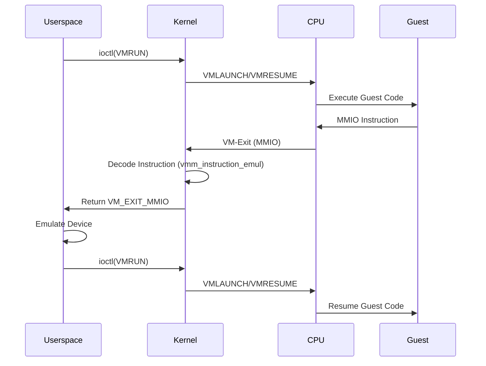

# bhyve — VMM Kernel Module and Hypervisor
<!-- This file is auto-generated by generate-doc.py -- do not edit manually -->

---
**Navigation:**
  **Up:** [Kernel Core — Structure and Entry Point](../../README.md) ▸ [Source Tree — Layout and Conventions](../../../README_internals.md)
  **Related:** [Virtual Memory Subsystem — vm_page, UMA, and Pagers](../../vm/README.md) | [Process Management — Scheduling and Lifecycle](../../kern/README_process.md) | [VNET — Virtual Network Stacks](../../net/README_vnet.md) | [Device Driver Framework — newbus and devclass](../../kern/README_driver.md)
  **All chapters:** [Source Tree — Layout and Conventions](../../../README_internals.md) | [Boot Process — UEFI Bootloader to Kernel Handoff](../../../stand/efi/loader/README.md) | [Kernel Core — Structure and Entry Point](../../README.md) | [Build System — buildworld and buildkernel](../../../share/mk/README.md) | [Virtual Memory Subsystem — vm_page, UMA, and Pagers](../../vm/README.md) | [Process Management — Scheduling and Lifecycle](../../kern/README_process.md) | [Locking Primitives — Mutexes, sx, rmlocks, and Atomics](../../kern/README_locking.md) | [Buffer Cache — Block I/O Subsystem](../../vm/README_bcache.md) ...
---


## Quick Summary
The FreeBSD bhyve hypervisor divides its responsibilities between a userspace daemon and a kernel module. The userspace component, [`bhyve(8)`](../../../usr.sbin/bhyve/bhyve.8), manages the device model — emulating PCI endpoints, virtio devices, UEFI firmware, and CPUID tables. The kernel module, `vmm.ko`, owns the hardware virtualization machinery. It directly controls the CPU's VT-x or SVM extensions, maintains vCPU execution state, manages extended page tables (EPT) or nested page tables (NPT), and handles the low-level VM-exit dispatch logic.

When a guest virtual CPU runs, it executes instructions directly on the host hardware. Certain instructions or hardware events trigger a VM-exit, temporarily suspending guest execution and transferring control to the kernel. The VMM module evaluates the exit reason to determine the appropriate handling path. Internal state changes, such as APIC timer updates or MSR accesses, are resolved entirely within the kernel to minimize overhead. External device interactions, such as MMIO reads or writes to emulated hardware, require cooperation from the userspace device model. The kernel decodes the trapping instruction, extracts the relevant data, and returns control to userspace via an ioctl, which then updates the emulated device state before resuming the guest.

The kernel also provides support for live migration and snapshots through dirty-bit tracking. As the guest modifies memory, the hardware paging subsystem marks corresponding pages in the EPT/NPT structures. The kernel monitors these markers, allowing the userspace management tool to identify which memory regions have changed and transfer them efficiently during migration. This design separates high-frequency hardware control from lower-frequency device emulation, optimizing both performance and architectural clarity.

## Architecture
The VMM kernel module resides in `sys/amd64/vmm/` and follows a strict separation between machine-independent dispatch and architecture-specific implementation. The core file `sys/amd64/vmm/vmm.c` implements the ioctl interface, vCPU lifecycle management, and the central VM-exit dispatcher. It uses `DEFINE_VMMOPS_IFUNC` to route operations to either the Intel or AMD implementation based on the host CPU vendor.

The architecture-specific code lives in `sys/amd64/vmm/intel/` and `sys/amd64/vmm/amd/`. The Intel directory contains `vmx.c`, which translates VMX instructions and VMCS field reads/writes, and `ept.c`, which manages Extended Page Table structures. It also includes `vtd.c` for VT-d IOMMU support. The AMD directory contains `svm.c`, which handles SVM intercepts and VMCB state management, and `npt.c` for Nested Page Table allocation and teardown. `amdvi_hw.c` implements AMD-Vi IOMMU support.

Instruction emulation for MMIO and port I/O is centralized in `sys/amd64/vmm/vmm_instruction_emul.c`. This file contains a x86 instruction decoder that reconstructs the guest instruction's opcode, registers, and immediates. When a VM-exit occurs due to an MMIO access, the kernel uses this emulator to determine the guest's intended operation, extract the data payload, and prepare a structure for userspace. Local APIC emulation is handled in `sys/amd64/vmm/vmm_lapic.c`, which implements x2APIC MSR ranges and MSI message injection. Memory management for MMIO mappings and snapshot dirty-bit tracking is split across `vmm_dev_machdep.c`, `vmm_mem_machdep.c`, and `vmm_snapshot.c`.

## Key Data Structures
The VMM module relies on several core data structures to track vCPU state, hardware extensions, and emulation context. These structures are defined across `sys/amd64/include/vmm_dev.h`, `sys/amd64/vmm/intel/vmx.h`, and `sys/amd64/vmm/amd/svm_softc.h`.

**`struct vm_run`** (`sys/amd64/include/vmm_dev.h`): The primary user-kernel communication structure for running a vCPU.
```c
struct vm_run {
    uint64_t cpuid;
    uint64_t cpusetsize;
    struct vm_exit *vm_exit;
};
```
This structure is passed to the `VMRUN` ioctl. The kernel populates the `vm_exit` pointer upon return, indicating the reason for the exit.

**`struct vm_exit`** (`sys/amd64/include/vmm.h`): Describes a VM-exit.
```c
struct vm_exit {
    uint64_t rip;
    uint64_t exitcode;
    uint64_t inst_length;
    union {
        struct {
            uint64_t gpa;
            uint64_t fault_type;
        } npf;
        struct {
            uint64_t cr8;
            uint64_t rflags;
        } intr;
        struct {
            uint64_t gpa;
            uint64_t data;
        } mmio;
    } payload;
};
```
The `exitcode` field maps to hardware-specific reasons (e.g., `VM_EXIT_INOUT` for I/O ports, `VM_EXIT_EPT_VIOLATION` for EPT faults).

**`struct vmx_vcpu`** (`sys/amd64/vmm/intel/vmx.h`): Intel-specific vCPU context.
```c
struct vmx_vcpu {
    struct vmx *vmx;
    struct vcpu *vcpu;
    struct vmcs *vmcs;
    struct apic_page *apic_page;
    struct pir_desc *pir_desc;
    uint64_t guest_msrs[GUEST_MSR_NUM];
    struct vmxctx ctx;
    struct vmxcap cap;
    struct vmxstate state;
    struct vm_mtrr mtrr;
    int vcpuid;
};
```
Holds the VMCS pointer and the cached VMX state.

**`struct svm_vcpu`** (`sys/amd64/vmm/amd/svm_softc.h`): AMD-specific vCPU context.
```c
struct svm_vcpu {
    struct svm_softc *sc;
    struct vcpu *vcpu;
    struct vmcb *vmcb;
    struct svm_regctx swctx;
    uint64_t vmcb_pa;
    uint64_t nextrip;
    int lastcpu;
    uint32_t dirty;
    long eptgen;
    struct asid asid;
    struct vm_mtrr mtrr;
    int vcpuid;
    struct dbg dbg;
    int caps;
};
```
Holds the VMCB pointer, VMCB physical address, and the saved register context.

**`struct vmcb`** (`sys/amd64/vmm/amd/vmcb.h`): The VMCB (Virtual Machine Control Block) is a 4KB aligned page in memory that describes the virtual machine.
```c
struct vmcb {
    struct vmcb_state state;
    struct vmcb_ctrl ctrl;
};
```
The `state` field contains guest registers, while `ctrl` contains intercept bits and control fields.

**`struct vie_op`** (`sys/riscv/include/vmm_instruction_emul.h`): Represents a decoded x86 instruction.
```c
struct vie_op {
    uint8_t op_byte;
    uint8_t op_type;
    uint8_t op_flags;
    // ...
};
```
Used by `vmm_instruction_emul.c` to reconstruct guest instructions for emulation.

## Deep Dive

### The VM Run Loop
The entry point for guest execution is `vm_run()` in `sys/amd64/vmm/vmm.c`. This function is called by userspace via the `VMRUN` ioctl.

1. **Validation**: The function validates the vCPU ID and checks the vCPU state.
2. **Dispatch**: It calls the architecture-specific `vmm_ops->run()` function, which is either `vmx_run()` in `sys/amd64/vmm/intel/vmx.c` or `svm_run()` in `sys/amd64/vmm/amd/svm.c`.
3. **Execution**: The architecture-specific function executes the `VMRUN` (AMD) or `VMLAUNCH`/`VMRESUME` (Intel) instruction, transferring control to the guest.
4. **VM-Exit**: When the guest triggers a VM-exit, control returns to the kernel. The architecture-specific code reads the exit reason from the VMCS (Intel) or VMCB (AMD).
5. **Handling**: The kernel dispatches the exit reason. Some exits are handled inline (e.g., APIC timer writes, MSR accesses), while others require userspace intervention (e.g., MMIO, I/O port access).
6. **Return**: The kernel populates the `struct vm_exit` structure and returns to userspace, which may then resume the vCPU or perform device emulation.

### VM-Exit Handling
VM-exits are categorized into two types: those handled in the kernel and those returned to userspace.

**Kernel-Handled Exits**:
- **APIC/MSR Access**: When the guest writes to the local APIC or specific MSRs, the kernel updates the virtual APIC state or saves the MSR value. This is handled in `sys/amd64/vmm/vmm_lapic.c` and architecture-specific MSR handling code.
- **HLT**: The `vm_handle_hlt()` function in `sys/amd64/vmm/vmm.c` handles the HLT instruction by marking the vCPU as idle and returning to userspace.

**Userspace-Handled Exits**:
- **MMIO**: When the guest accesses a memory-mapped I/O address, the EPT/NPT subsystem triggers a page fault. The kernel decodes the instruction using `vmm_instruction_emul.c`, extracts the data, and returns the exit code `VM_EXIT_MMIO` to userspace.
- **I/O Port**: Similar to MMIO, I/O port accesses trigger an exit, and the kernel returns the port number and data to userspace.

The `vm_exitinfo()` function in `sys/amd64/vmm/vmm.c` is responsible for populating the `struct vm_exit` structure with the relevant details of the exit.

### Instruction Emulation
The `vmm_instruction_emul.c` file provides a software emulation layer for x86 instructions. This is crucial for handling MMIO and I/O port accesses, where the kernel needs to know the guest's intended operation (e.g., read vs. write, size, destination register).

The emulation process involves:
1. **Decoding**: The `vmm_fetch_instruction()` function fetches and decodes the guest instruction at the current RIP. It handles prefixes, opcodes, ModR/M, SIB, and displacement fields.
2. **Validation**: The emulator validates the instruction and calculates the guest linear address (GLA) for memory accesses.
3. **Extraction**: For I/O instructions, the emulator extracts the port number and data register (e.g., EAX, EDX).
4. **Data Transfer**: The kernel reads/writes the data to/from the guest's memory or registers and populates the `struct vm_exit` structure.

### EPT and NPT
EPT (Extended Page Tables) and NPT (Nested Page Tables) provide hardware-assisted virtual memory for guests. The kernel manages these structures to map guest physical addresses to host physical addresses.

**Intel EPT** (`sys/amd64/vmm/intel/ept.c`):
- The EPT structures are allocated in `ept_init()`.
- Page table entries include dirty and accessed bits for live migration.
- EPT violations trigger VM-exits, which are handled by `ept_emulation_fault()`.

**AMD NPT** (`sys/amd64/vmm/amd/npt.c`):
- The NPT structures are allocated in `svm_npt_init()`.
- Similar to EPT, NPT uses dirty bits for migration.
- NPT faults are handled by `svm_npf_emul_fault()`.

The kernel uses the `vm_gla2gpa()` function to translate guest linear addresses to guest physical addresses, which is essential for instruction emulation and page fault handling.

### EPT/NPT and the Host VM System
The VMM's EPT/NPT management interfaces directly with the host's virtual memory subsystem, bridging two layers of address translation. The host VM system (described in Chapter 4) manages physical memory through `vm_page` structures, UMA zones, and pagers. The EPT/NPT subsystem consumes this host memory infrastructure to build the second-level address translation.

When a guest virtual address is translated, the CPU first walks the guest's page tables (GVA → GPA), then walks the EPT/NPT structures (GPA → HPA). The EPT/NPT entries are backed by host physical pages allocated from UMA zones. The EPT/NPT management code in `ept.c` and `npt.c` uses the host's pmap framework — including `PMAP_NESTED_IPIMASK`, `PMAP_PDE_SUPERPAGE`, and `PMAP_EMULATE_AD_BITS` flags — to configure the hardware paging structures for the nested translation.

This tight coupling means that EPT/NPT faults (page walks that fail) are handled through the same mechanisms as host virtual memory faults. When the guest modifies memory, the hardware sets dirty bits in the EPT/NPT entries, which the kernel can query for live migration. The dirty-bit tracking relies on the same infrastructure that the host VM subsystem uses for pager operations and pageout, allowing the bhyve snapshot code to access the same dirty-page infrastructure used by the host VM subsystem for pager operations and pageout.

### Dirty-Bit Tracking
For live migration and snapshots, the kernel tracks which guest pages have been modified. This is achieved using the dirty bits in the EPT/NPT page table entries.

1. **Setting Dirty Bits**: When the guest writes to a page, the hardware sets the dirty bit in the corresponding EPT/NPT entry.
2. **Clearing Dirty Bits**: The kernel clears the dirty bits after they have been processed (e.g., during a snapshot).
3. **Querying Dirty Pages**: The userspace tool queries the kernel for dirty pages using the `VM_SNAPSHOT` ioctl. The kernel iterates over the EPT/NPT structures and collects the physical addresses of dirty pages.

The `vm_snapshot_buf()` function in `sys/amd64/vmm/vmm_snapshot.c` handles the snapshot buffer management, collecting dirty page information.

## Flow / Diagram



## Advanced Notes

### DTrace and KTR
The VMM module provides DTrace probes and KTR (kernel trace) points for debugging and performance analysis.
- **DTrace Probes**: Defined in `sys/amd64/vmm/vmm_stat.h`, these probes allow tracing of VM-exits, instruction emulation, and page faults.
- **KTR Points**: Defined in `sys/dev/vmm/vmm_ktr.h`, these points provide detailed trace information for low-level debugging.

### Performance Considerations
- **Inline Handling**: Minimizing VM-exits is critical for performance. The kernel handles common operations (e.g., APIC writes) inline to avoid the overhead of returning to userspace.
- **Instruction Emulation**: The instruction emulator is optimized for speed, using lookup tables and efficient decoding algorithms.
- **EPT/NPT Management**: Efficient management of shadow page tables is essential. The kernel uses UMA zones for allocating EPT/NPT entries to reduce fragmentation and improve allocation speed.

### Common Pitfalls
- **VM-Exit Storms**: Excessive VM-exits can degrade performance. Developers should ensure that the guest is not triggering unnecessary exits (e.g., by using paravirtualized drivers).
- **Dirty Bit Leaks**: Failing to clear dirty bits can lead to incorrect snapshot data and increased migration time.
- **Race Conditions**: The VMM module uses locks to protect shared state. Developers must be careful to avoid deadlocks and race conditions, especially in the VM-exit handling path.

## See Also
- [Virtual Memory Subsystem — vm_page, UMA, and Pagers](../../vm/README.md)
- [Process Management — Scheduling and Lifecycle](../../kern/README_process.md)
- [Device Driver Framework — newbus and devclass](../../kern/README_driver.md)
- [VNET — Virtual Network Stacks](../../net/README_vnet.md)


---

> _Generated by [DaemonDocs](https://github.com/ocochard/DaemonDocs) on 2026-05-03 18:57 UTC using model `Qwen3.6-35B-A3B-UD-Q8_K_XL` (llama.cpp build `b8985-27aef3dd9`). AI-generated content — verify against source before relying on it._
