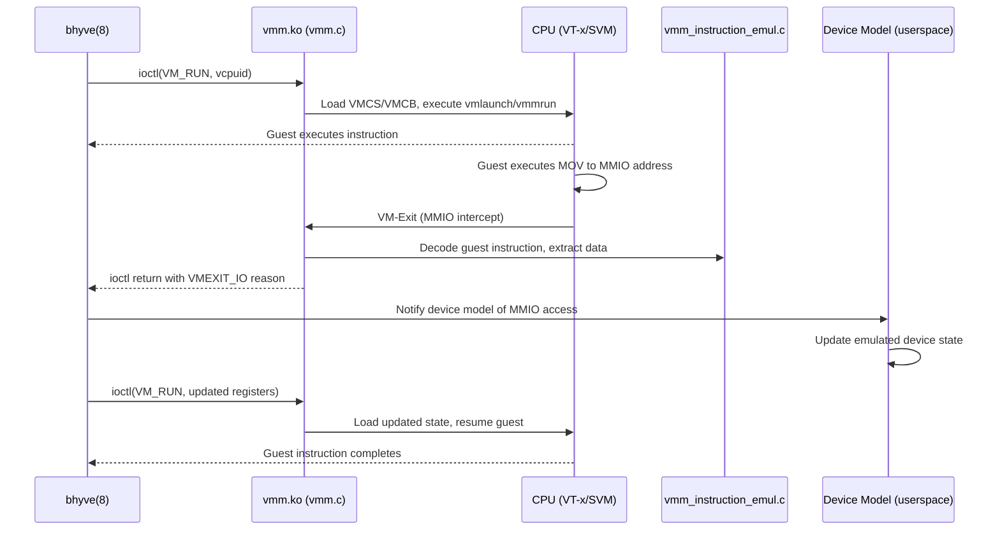

# bhyve — VMM Kernel Module and Hypervisor
<!-- This file is auto-generated by generate-doc.py -- do not edit manually -->

---
**Navigation:**
  **Related:** [Virtual Memory Subsystem — vm_page, UMA, and Pagers](../../vm/README.md) | [Process Management — Scheduling and Lifecycle](../../kern/README_process.md) | [VNET — Virtual Network Stacks](../../net/README_vnet.md) | [Device Driver Framework — newbus and devclass](../../kern/README_driver.md)
  **All chapters:** [Source Tree — Layout and Conventions](../../../README_internals.md) | [Boot Process — UEFI Bootloader to Kernel Handoff](../../../stand/efi/loader/README.md) | [Kernel Core — Structure and Entry Point](../../README.md) | [Build System — buildworld and buildkernel](../../../share/mk/README.md) | [Virtual Memory Subsystem — vm_page, UMA, and Pagers](../../vm/README.md) | [Process Management — Scheduling and Lifecycle](../../kern/README_process.md) | [Locking Primitives — Mutexes, sx, rmlocks, and Atomics](../../kern/README_locking.md) | [Buffer Cache — Block I/O Subsystem](../../vm/README_bcache.md) ...
---


## Quick Summary
The FreeBSD bhyve hypervisor divides its responsibilities between a userspace daemon and a kernel module. The userspace component, `bhyve(8)`, manages the device model, emulating PCI endpoints, virtio devices, UEFI firmware, and CPUID tables. The kernel module, `vmm.ko`, owns the hardware virtualization machinery. It directly controls the CPU''s VT-x or SVM extensions, maintains vCPU execution state, manages extended page tables (EPT) or nested page tables (NPT), and handles the low-level VM-exit dispatch logic.

When a guest virtual CPU runs, it executes instructions directly on the host hardware. Certain instructions or hardware events trigger a VM-exit, temporarily suspending guest execution and transferring control to the kernel. The VMM module evaluates the exit reason to determine the appropriate handling path. Internal state changes, such as APIC timer updates or MSR accesses, are resolved entirely within the kernel to minimize overhead. External device interactions, such as MMIO reads or writes to emulated hardware, require cooperation from the userspace device model. The kernel decodes the trapping instruction, extracts the relevant data, and returns control to userspace via an ioctl, which then updates the emulated device state before resuming the guest.

The kernel also provides support for live migration and snapshots through dirty-bit tracking. As the guest modifies memory, the hardware paging subsystem marks corresponding pages in the EPT/NPT structures. The kernel monitors these markers, allowing the userspace management tool to identify which memory regions have changed and transfer them efficiently during migration. This design separates high-frequency hardware control from lower-frequency device emulation, optimizing both performance and architectural clarity.

## Architecture
The VMM kernel module resides in `sys/amd64/vmm/` and follows a strict separation between machine-independent dispatch and architecture-specific implementation. The core file `sys/amd64/vmm/vmm.c` implements the ioctl interface, vCPU lifecycle management, and the central VM-exit dispatcher. It uses `DEFINE_VMMOPS_IFUNC` to route operations to either the Intel or AMD implementation based on the host CPU vendor.

The architecture-specific code lives in `sys/amd64/vmm/intel/` and `sys/amd64/vmm/amd/`. The Intel directory contains `vmx.c`, which translates VMX instructions and VMCS field reads/writes, and `ept.c`, which manages Extended Page Table structures. It also includes `vtd.c` for VT-d IOMMU support. The AMD directory contains `svm.c`, which handles SVM intercepts and VMCB state management, and `npt.c` for Nested Page Table allocation and teardown. `amdvi_hw.c` implements AMD-Vi IOMMU support.

Instruction emulation for MMIO and port I/O is centralized in `sys/amd64/vmm/vmm_instruction_emul.c`. This file contains a x86 instruction decoder that reconstructs the guest instruction''s opcode, registers, and immediates. When a VM-exit occurs due to an MMIO access, the kernel uses this emulator to determine the guest''s intended operation, extract the data payload, and prepare a structure for userspace. Local APIC emulation is handled in `sys/amd64/vmm/vmm_lapic.c`, which implements x2APIC MSR ranges and MSI message injection. Memory management for MMIO mappings and snapshot dirty-bit tracking is split across `vmm_mem_machdep.c` and `vmm_snapshot.c`.

## Key Data Structures
The VMM module relies on several core data structures to track vCPU state, hardware extensions, and emulation context. These structures are defined across multiple headers in `sys/amd64/vmm/` and `sys/machine/`.

The machine-independent exit/run structures used in the ioctl interface are defined in `sys/amd64/vmm/vmm_dev_machdep.c`. They capture the exact CPU state at the moment of a VM-exit and the state required to resume execution.

```c
struct vm_exit_13 {
    uint32_t exitcode;
    int32_t inst_length;
    uint64_t rip;
    uint64_t u[120 / sizeof(uint64_t)];
};
```

The Intel-specific vCPU context is defined in `sys/amd64/vmm/intel/vmx.h`. It wraps the VMCS pointer and tracks VMX-specific state.

```c
struct vmx_vcpu {
    struct vmx    *vmx;
    struct vcpu   *vcpu;
    struct vmcs   *vmcs;
    struct apic_page *apic_page;
    struct pir_desc *pir_desc;
    uint64_t guest_msrs[GUEST_MSR_NUM];
    struct vmxctx ctx;
    struct vmxcap cap;
    struct vmxstate state;
    struct vm_mtrr  mtrr;
    int vcpuid;
};
```

The AMD-specific vCPU context is defined in `sys/amd64/vmm/amd/svm_softc.h`. It manages the VMCB page and SVM-specific control structures.

```c
struct svm_vcpu {
    struct svm_softc *sc;
    struct vcpu   *vcpu;
    struct vmcb   *vmcb;
    struct svm_regctx swctx;
    uint64_t vmcb_pa;
    uint64_t nextrip;
    int lastcpu;
    uint32_t dirty;
    long eptgen;
    struct asid asid;
    struct vm_mtrr  mtrr;
    int vcpuid;
    struct dbg dbg;
    int caps;
};
```

Memory type configuration for the guest is tracked using `struct vm_mtrr` from `sys/amd64/vmm/x86.h`:

```c
struct vm_mtrr {
	uint64_t def_type;
	uint64_t fixed4k[8];
	uint64_t fixed16k[2];
	uint64_t fixed64k;
	struct {
		uint64_t base;
		uint64_t mask;
	} var[VMM_MTRR_VAR_MAX];
};
```

## Deep Dive
The vCPU execution loop is initiated when userspace issues the `VM_RUN` ioctl. The kernel validates the vCPU state and dispatches the request through the machine-independent `vmmops` interface in `vmm.c`, which routes execution to the architecture-specific run logic in `sys/amd64/vmm/intel/vmx.c` or `sys/amd64/vmm/amd/svm.c`. These functions load the guest register state into the VMCS or VMCB, set up the MSRs, and execute the `vmlaunch`/`vmresume` or `vmmrun` instructions. The CPU transitions to root mode (VMX) or guest mode (SVM) and begins executing the guest code.

When the guest executes an instruction that requires hypervisor attention, the CPU triggers a VM-exit. Control returns to the kernel with the exit reason stored in the VMCS/VMCB. The kernel saves the full guest context into `struct vm_exit_13` and passes it to the dispatcher in `vmm.c`. The dispatcher examines the exit reason. For reasons like `VMX_EXIT_REASON_APIC_WRITE` or `VMX_EXIT_REASON_MSR_READ`, the kernel handles the operation inline. It updates the virtual APIC state or reads the guest''s MSR table, modifies the VMCS/VMCB to advance the instruction pointer, and resumes the guest without leaving kernel mode.

MMIO exits require userspace involvement. When the guest executes a `MOV` to a guest-physical address mapped to MMIO, the EPT/NPT paging structures trigger a page fault VM-exit. The kernel intercepts this in `vmm_instruction_emul.c`. It reads the guest''s instruction pointer, fetches the guest instruction bytes, and runs the decoder. The decoder populates a `struct vie_op` with the opcode, destination register, and data size. The kernel extracts the guest''s intended data from the saved register state, places it into the `vm_exit_13` structure, and returns to userspace via the ioctl with the `VMEXIT_IO` reason. The `bhyve(8)` daemon receives the exit, emulates the virtio or PCI device operation, updates the internal device model, and issues another `VM_RUN` ioctl with the modified register state to complete the guest instruction.

EPT and NPT provide the guest with its own physical address space. The host''s virtual memory subsystem (`sys/vm/`) manages host physical pages, while `ept.c` or `npt.c` constructs a second-level page table that maps guest-physical addresses to host-physical addresses. When the guest modifies a page, the hardware sets the dirty bit in the EPT/NPT entry. The kernel checks these bits during snapshot operations (`vmm_snapshot.c`), allowing it to identify changed memory regions for live migration. This two-level paging design isolates the guest''s memory layout from the host''s `vm_map` and `pmap` structures, fulfilling the virtualization requirement of address space translation.

## Flow / Diagram
The following diagram illustrates the control flow when a vCPU executes an MMIO instruction and the kernel handles the resulting VM-exit.



## Advanced Notes
Debugging the VMM module benefits from the SDT probes defined in `sys/amd64/vmm/vmm.c`. Macros like `VCPU_CTR0`, `VCPU_CTR1`, and `VCPU_CTR2` emit trace points for VM-exit reasons, instruction emulation steps, and memory mapping events. DTrace scripts can attach to these probes to monitor exit frequency, identify hot paths, and verify that inline handling is occurring as expected. For performance tuning, minimizing VM-exits is critical. Frequent traps to userspace, such as excessive APIC timer interrupts or port I/O, introduce context-switch overhead. The kernel handles APIC writes inline to avoid this penalty, but complex device emulation inevitably requires userspace roundtrips.

Dirty-bit tracking for snapshots relies on the hardware-managed dirty bits in EPT/NPT page table entries. The kernel periodically scans these bits or relies on page fault callbacks to update in-kernel tracking structures. When a snapshot is taken, `vmm_snapshot.c` iterates over the dirty pages, copies them to a migration buffer, and clears the bits. Care must be taken to synchronize this scanning with the vCPU run loop to avoid capturing inconsistent memory states. The `sx` locks in `vmm.c` protect the vCPU state during ioctl operations, but the run loop itself runs without holding the vCPU lock to allow hardware execution. This design prevents deadlock but requires atomic operations for shared flags.

A common pitfall is misconfiguring the MSRs or control fields in the VMCS/VMCB. Invalid VM-entry parameters cause a VM-fail during `vmlaunch`, which the kernel catches and reports via the ioctl error code. Another consideration is the handling of x2APIC MSRs. Current guests expect x2APIC support, which requires the kernel to enable the appropriate VMX controls and expose the x2APIC MSR range. Failure to configure these controls correctly results in guest crashes during boot.

## Comparison
Linux KVM implements its virtualization interface through `arch/x86/kvm/`, using a single `struct kvm_vcpu` to track both machine-independent state and architecture-specific extensions. FreeBSD's VMM module separates the machine-independent dispatcher (`vmm.c`) from the architecture implementations (`vmx.c`, `svm.c`), creating a cleaner boundary that mirrors the hardware''s own split between VMCS and VMCB. KVM integrates EPT/NPT management directly into the host''s page fault handling path, mapping guest physical pages to host PFNs on demand. FreeBSD's VMM module constructs EPT/NPT structures more explicitly in `ept.c` and `npt.c`, managing the full second-level page table lifecycle within the hypervisor module itself.

macOS/XNU's Hypervisor Framework takes a different approach, relying on a user-space daemon that communicates with a kernel extension via Mach ports, rather than a character device ioctl interface like FreeBSD or Linux. NetBSD and OpenBSD have historically lacked a fully functional type-2 hypervisor in their main trees, focusing instead on paravirtualization or containerization. FreeBSD's VMM module stands out for its strict separation of concerns, where the kernel handles only the CPU and paging machinery, leaving all device emulation to userspace. This design simplifies the kernel module but requires careful synchronization between the kernel and `bhyve(8)` to maintain performance.

## See Also
- [Virtual Memory Subsystem — vm_page, UMA, and Pagers](../../../sys/vm/README.md)
- [Process Management — Scheduling and Lifecycle](../../../sys/kern/README_process.md)
- [Device Driver Framework — newbus and devclass](../../../sys/kern/README_driver.md)
- [VNET — Virtual Network Stacks](../../../sys/net/README_vnet.md)

- [Virtual Memory Subsystem — vm_page, UMA, and Pagers](../../../sys/vm/README.md)
- [Process Management — Scheduling and Lifecycle](../../../sys/kern/README_process.md)
- [Device Driver Framework — newbus and devclass](../../../sys/kern/README_driver.md)
- [VNET — Virtual Network Stacks](../../../sys/net/README_vnet.md)


- [Virtual Memory Subsystem — vm_page, UMA, and Pagers](../vm/README.md) for host physical memory management
- [Locking Primitives — Mutexes, sx, rmlocks, and Atomics](../kern/README_locking.md) for synchronization in the VMM module
- [Process Management — Scheduling and Lifecycle](../kern/README_process.md) for how vCPUs interact with the host scheduler
- `sys/amd64/vmm/` source directory for the complete VMM implementation
- `sys/amd64/vmm/intel/vmx.c` and `sys/amd64/vmm/amd/svm.c` for architecture-specific VMCS/VMCB handling
- `sys/amd64/vmm/vmm_instruction_emul.c` for the x86 instruction decoder and MMIO emulation logic

---

> _Generated by [DaemonDocs](https://github.com/ocochard/DaemonDocs) on 2026-04-29 20:46 UTC using model `Qwen3.6-35B-A3B-UD-Q4_K_XL` (llama.cpp build `b8929-9d34231bb`). AI-generated content — verify against source before relying on it._
