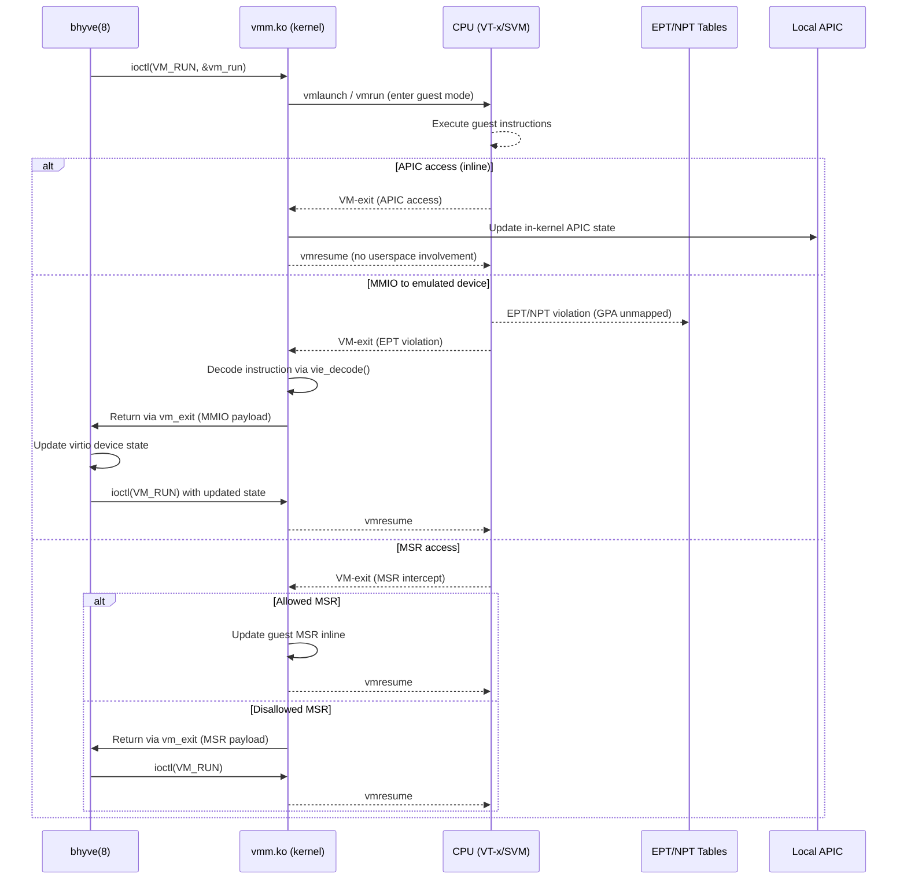

# bhyve — VMM Kernel Module and Hypervisor
<!-- This file is auto-generated by generate-doc.py -- do not edit manually -->

---
**Navigation:**
  **Up:** [Kernel Core — Structure and Entry Point](../../README.md) ▸ [Source Tree — Layout and Conventions](../../../README_internals.md)
  **Related:** [Virtual Memory Subsystem — vm_page, UMA, and Pagers](../../vm/README.md) | [Process Management — Scheduling and Lifecycle](../../kern/README_process.md) | [VNET — Virtual Network Stacks](../../net/README_vnet.md) | [Device Driver Framework — newbus and devclass](../../kern/README_driver.md)
  **All chapters:** [Source Tree — Layout and Conventions](../../../README_internals.md) | [Boot Process — UEFI Bootloader to Kernel Handoff](../../../stand/efi/loader/README.md) | [Kernel Core — Structure and Entry Point](../../README.md) | [Build System — buildworld and buildkernel](../../../share/mk/README.md) | [Virtual Memory Subsystem — vm_page, UMA, and Pagers](../../vm/README.md) | [Process Management — Scheduling and Lifecycle](../../kern/README_process.md) | [Locking Primitives — Mutexes, sx, rmlocks, and Atomics](../../kern/README_locking.md) | [Buffer Cache — Block I/O Subsystem](../../vm/README_bcache.md) ...
---


> ⚠ **UNVERIFIED DRAFT** — reviewer did not explicitly approve this draft. Treat claims as suspect until manually reviewed.


## Quick Summary
The FreeBSD bhyve hypervisor divides its responsibilities between a userspace daemon and a kernel module. The userspace component, `bhyve(8)`, manages the device model — emulating PCI endpoints, virtio devices, UEFI firmware, and CPUID tables. The kernel module, `vmm.ko`, owns the hardware virtualization machinery. It directly controls the CPU's VT-x or SVM extensions, maintains vCPU execution state, manages extended page tables (EPT) or nested page tables (NPT), and handles the low-level VM-exit dispatch logic.

When a guest virtual CPU runs, it executes instructions directly on the host hardware. Certain instructions or hardware events trigger a VM-exit, temporarily suspending guest execution and transferring control to the kernel. The VMM module evaluates the exit reason to determine the appropriate handling path. Internal state changes, such as APIC timer updates or MSR accesses, are resolved entirely within the kernel to minimize overhead. External device interactions, such as MMIO reads or writes to emulated hardware, require cooperation from the userspace device model. The kernel decodes the trapping instruction, extracts the relevant data, and returns control to userspace via an ioctl, which then updates the emulated device state before resuming the guest.

The kernel also provides support for live migration and snapshots through dirty-bit tracking. As the guest modifies memory, the hardware paging subsystem marks corresponding pages in the EPT/NPT structures. The kernel monitors these markers, allowing the userspace management tool to identify which memory regions have changed and transfer them efficiently during migration. This design separates high-frequency hardware control from lower-frequency device emulation, optimizing both performance and architectural clarity.

## Architecture
The VMM kernel module resides in `sys/amd64/vmm/` and follows a strict separation between machine-independent dispatch and architecture-specific implementation. The core file `sys/amd64/vmm/vmm.c` implements the ioctl interface, vCPU lifecycle management, and the central VM-exit dispatcher. It uses `DEFINE_VMMOPS_IFUNC` to route operations to either the Intel or AMD implementation based on the host CPU vendor.

The architecture-specific code lives in `sys/amd64/vmm/intel/` and `sys/amd64/vmm/amd/`. The Intel directory contains `vmx.c`, which translates VMX instructions and VMCS field reads/writes, and `ept.c`, which manages Extended Page Table structures. It also includes `vtd.c` for VT-d IOMMU support. The AMD directory contains `svm.c`, which handles SVM intercepts and VMCB state management, and `npt.c` for Nested Page Table allocation and teardown. `amdvi_hw.c` implements AMD-Vi IOMMU support.

Instruction emulation for MMIO and port I/O is centralized in `sys/amd64/vmm/vmm_instruction_emul.c`. This file contains a x86 instruction decoder that reconstructs the guest instruction's opcode, registers, and immediates. When a VM-exit occurs due to an MMIO access, the kernel uses this emulator to determine the guest's intended operation, extract the data payload, and prepare a structure for userspace. Local APIC emulation is handled in `sys/amd64/vmm/vmm_lapic.c`, which implements x2APIC MSR ranges and MSI message injection. Memory management for MMIO mappings and snapshot dirty-bit tracking is split across `vmm_dev_machdep.c`, `vmm_mem_machdep.c`, and `vmm_snapshot.c`.

## Key Data Structures
The VMM module relies on several core data structures to track vCPU state, hardware extensions, and emulation context. These structures are defined across multiple headers in `sys/amd64/vmm/` and `sys/machine/`.

The machine-independent exit/run structures used in the ioctl interface are defined in `sys/amd64/include/vmm_dev.h`. The `struct vm_run` structure is the input to the `VM_RUN` ioctl and carries the vCPU ID, a cpuset for multi-vcpu launches, and a pointer to a `struct vm_exit` buffer where the kernel writes the exit reason:

```c
struct vm_run {
	int		cpuid;
	cpuset_t	*cpuset;	/* CPU set storage */
	size_t		cpusetsize;
	struct vm_exit	*vm_exit;
};
```

The `struct vm_exit` structure carries exit collateral and is defined in `sys/amd64/include/vmm.h`. Its `exitcode` field indicates the reason for the VM-exit (e.g., `VM_EXITCODE_IO_INST`, `VM_EXITCODE_MSR`), and a union of payload fields (such as `inout` for port I/O, `gpa` for page faults) provides additional context:

```c
struct vm_exit {
	uint32_t exitcode;
	int32_t inst_length;
	uint64_t rip;
	union {
		struct {
			uint64_t gpa;
			uint64_t fault_type;
		} gpa;
		struct {
			uint64_t rax;
			uint64_t rcx;
			uint64_t rdx;
			uint64_t r8;
			uint64_t r9;
			uint64_t r10;
			uint64_t r11;
			uint64_t r12;
			uint64_t r13;
			uint64_t r14;
			uint64_t r15;
		} inout;
		/* ... other payload unions ... */
	};
};
```

On the Intel side, the per-vCPU state is tracked by `struct vmx_vcpu` (defined in `sys/amd64/vmm/intel/vmx.h`), which embeds a pointer to the VMCS (`struct vmcs *vmcs`), the local APIC page (`struct apic_page *apic_page`), and a Posted Interrupt Descriptor (`struct pir_desc *pir_desc`). The APIC page is a full page-sized structure (`CTASSERT(sizeof(struct apic_page) == PAGE_SIZE)`) that mirrors the physical APIC register layout, enabling efficient in-kernel APIC handling. The Posted Interrupt Descriptor supports Intel's virtual interrupt delivery optimization, where the hypervisor can inject interrupts directly into the guest without a VM-exit.

```c
struct vmx_vcpu {
	struct vmx	*vmx;
	struct vcpu	*vcpu;
	struct vmcs	*vmcs;
	struct apic_page *apic_page;
	struct pir_desc	*pir_desc;
	uint64_t	guest_msrs[GUEST_MSR_NUM];
	struct vmxctx	ctx;
	struct vmxcap	cap;
	struct vmxstate	state;
	struct vm_mtrr  mtrr;
	int		vcpuid;
};
```

The AMD equivalent is `struct svm_vcpu` (defined in `sys/amd64/vmm/amd/svm_softc.h`), which holds a pointer to the VMCB (`struct vmcb *vmcb`) and the guest register context (`struct svm_regctx`). The VMCB is a 4KB-aligned page that describes the virtual machine's state and control fields. It contains intercept bitmaps, MSR save/load arrays, and the guest physical address space.

```c
struct svm_vcpu {
	struct svm_softc *sc;
	struct vcpu	*vcpu;
	struct vmcb	*vmcb;
	struct svm_regctx regctx;
	/* ... other fields ... */
	int		vcpuid;
};
```

The `struct vmcb` (defined in `sys/amd64/vmm/amd/vmcb.h`) has three sub-structures: `vmcb_state` for guest registers, `vmcb_ctrl` for control fields (intercepts, IOPM, MSRPM), and `vmcb_segment` for segment descriptors. The clean bit cache (`VMCB_CACHE_DEFAULT`) in `svm.c` tracks which VMCB fields have been modified, avoiding unnecessary VM-write operations on VM-resume.

## Deep Dive
### The VM_RUN Loop and VM-Exit Dispatch

The entry point for guest execution is the `VM_RUN` ioctl, handled in `sys/amd64/vmm/vmm.c` by `vm_run()`. This function performs several preparatory steps: it validates the vCPU state, sets up host context (CR0/CR4/EFER from the host via `vmm_get_host_cr0()`, `vmm_get_host_cr4()`, `vmm_get_host_efer()`), and then calls the architecture-specific run function pointer. The `DEFINE_VMMOPS_IFUNC` macro in `vmm.c` resolves this pointer to either the Intel or AMD implementation based on the host CPU vendor.

On Intel, the architecture-specific run function in `sys/amd64/vmm/intel/vmx.c` executes the `vmlaunch` or `vmresume` instruction to enter guest mode. The CPU executes guest instructions until a VM-exit occurs. At that point, execution continues in the architecture-specific VM-exit handler, which reads the exit reason from the VMCS, then dispatches to the appropriate handler. The dispatch table is indexed by the exit reason and includes handlers for:

- **APIC accesses**: Handled inline. The kernel reads the guest's APIC access address from the VMCS, determines if it's a read or write, and updates the in-kernel `apic_page` structure. No userspace involvement is needed.
- **MSR accesses**: The MSR bitmap in the VMCS controls which MSRs cause VM-exits. For intercepted MSRs, the MSR handler decodes the access direction (RDMSR or WRMSR), validates the MSR index, and either updates guest state inline (for allowed MSRs) or returns to userspace.
- **I/O instructions**: Port I/O instructions (IN, OUT, INS, OUTS) are intercepted via the I/O bitmap in the VMCS. The kernel calls the I/O handler, which uses the instruction emulator (`vmm_instruction_emul.c`) to decode the instruction, extract the port number and data, and either handle it inline (for known kernel-emulated ports) or return to userspace.
- **MMIO accesses**: Memory-mapped I/O is detected by EPT violations. The kernel uses `vm_gla2gpa()` to translate the guest linear address to a host physical address, then calls the instruction emulator to determine the intended access size and data. If the GPA maps to a userspace-emulated device, the kernel returns to userspace with the exit payload.

On AMD, the architecture-specific run function in `sys/amd64/vmm/amd/svm.c` executes the `vmrun` instruction. VM-exits are handled in the AMD-specific VM-exit handler, which reads the exit code from the VMCB's `vmcb_state.exitcode` field. The dispatch logic is similar to Intel but uses VMCB field accesses instead of VMCS instructions. AMD's intercept mechanism uses the `vmcb_ctrl.intercept_cr`, `intercept_dr`, `intercept_exception`, `intercept_io`, and `intercept_msr` bitfields to control which events cause exits.

### Extended Page Tables (EPT) and Nested Page Tables (NPT)

Both EPT (Intel) and NPT (AMD) provide a second level of address translation: guest physical addresses (GPA) are translated to host physical addresses (HPA) by the hardware paging structures managed by the VMM. This gives each guest its own physical address space independent of the host's memory layout.

In `sys/amd64/vmm/intel/ept.c`, `ept_init()` reads the `MSR_VMX_EPT_VPID_CAP` MSR to determine EPT capabilities: page walk length, memory types, superpage support, and hardware dirty/access bit tracking. The function sets up the EPT paging structures via initialization routines that configure the pmap subsystem with the `PT_EPT` type. The EPT page tables are allocated as a separate pmap, and the EPT pointer (EPTP) is written to the VMCS via `vmcs_setreg()`.

```c
int
ept_init(int ipinum)
{
	int use_hw_ad_bits, use_superpages, use_exec_only;
	uint64_t cap;

	cap = rdmsr(MSR_VMX_EPT_VPID_CAP);
	/* ... validate capabilities ... */

	if (use_superpages && EPT_PDE_SUPERPAGE(cap))
		ept_pmap_flags |= PMAP_PDE_SUPERPAGE;	/* 2MB superpage */

	if (use_hw_ad_bits && AD_BITS_SUPPORTED(cap))
		ept_enable_ad_bits = 1;
	else
		ept_pmap_flags |= PMAP_EMULATE_AD_BITS;

	if (use_exec_only && EPT_SUPPORTS_EXEC_ONLY(cap))
		ept_pmap_flags |= PMAP_SUPPORTS_EXEC_ONLY;

	return (0);
}
```

The `PMAP_SUPPORTS_EXEC_ONLY` flag enables EPT's execute-only page permission, which is critical for running guest code without giving it write access — this is how the VMM implements execute-only memory mappings for guest code pages.

On AMD, `sys/amd64/vmm/amd/npt.c` provides the NPT equivalent. `svm_npt_init()` reads the IPINUM parameter and enables superpage support via `PMAP_PDE_SUPERPAGE`. `svm_npt_alloc()` creates a vmspace with NPT initialization routines as the pmap initializer. The NPT page tables are managed similarly to EPT but use AMD's page table entry format with the NX bit and page frame number fields arranged differently.

Dirty-bit tracking is enabled when `ept_enable_ad_bits` (or the NPT equivalent) is set. The hardware automatically sets the accessed and dirty bits in EPT/NPT page table entries as the guest reads or writes memory. The kernel can query these bits to determine which pages have changed, which is essential for live migration. The `vmm_snapshot.c` module uses snapshot iteration functions to iterate over dirty pages and transfer them to userspace via the snapshot ioctl interface.

### Instruction Emulation for MMIO

When a VM-exit occurs due to an MMIO or port I/O access, the kernel must determine what the guest instruction intended to do. This is handled by `sys/amd64/vmm/vmm_instruction_emul.c`, which implements a full x86 instruction decoder.

The decoder works by reading the guest's instruction bytes from memory and decoding them field by field. Decoding functions handle operand-size and address-size prefixes (0x66, 0x67), segment overrides (0x26, 0x2E, 0x36, 0x3E, 0x26, 0x3E, 0x64, 0x65), and the REX prefix for 64-bit mode. The primary opcode is read, and if it's 0x0F, dispatches to two-byte opcode handlers. For three-byte opcodes (0x0F 0x38 or 0x0F 0x3A), it uses the `three_byte_opcodes_0f38` table.

After decoding the opcode, the ModR/M byte is extracted to determine the addressing mode (register, memory with displacement, or SIB-based). Displacement fields are extracted, followed by immediate operands.

```c
struct vie_op {
	uint8_t		op_byte;
	enum vie_op_type op_type;
	uint8_t		op_flags;
};

/* struct vie_op.op_flags */
#define	VIE_OP_F_IMM		(1 << 0)  /* 16/32-bit immediate operand */
#define	VIE_OP_F_IMM8		(1 << 1)  /* 8-bit immediate operand */
#define	VIE_OP_F_MOFFSET	(1 << 2)  /* 16/32/64-bit immediate moffset */
#define	VIE_OP_F_NO_MODRM	(1 << 3)
#define	VIE_OP_F_NO_GLA_VERIFICATION (1 << 4)
```

The decoder populates a `struct vie_op` that describes the instruction's type (e.g., `VIE_OP_TYPE_MOV`, `VIE_OP_TYPE_OUTS`), operand sizes, and flags. The `vie_calculate_gla()` function computes the guest linear address for memory accesses, and `vie_canonical_check()` checks that the address is canonical.

Once the instruction is decoded, the kernel extracts the port number (for I/O) or GPA (for MMIO) and the data value (for writes). For port I/O, `vm_handle_inout()` in `vmm_ioport.c` checks if the port is in the kernel-emulated range (e.g., the virtual IOAPIC, HPET, or RTC). If so, it handles the access inline. Otherwise, it returns to userspace with the exit payload.

For MMIO, the kernel checks if the GPA maps to a kernel-emulated device (via `vm_map_mmio()` mappings in `vmm_mem_machdep.c`). MMIO mappings use scatter/gather objects (`vm_pager_allocate(OBJT_SG, ...)`) with uncacheable memory attributes (`vm_object_set_memattr(obj, VM_MEMATTR_UNCACHEABLE)`), because VT-x ignores MTRR settings for EPT translations. If the GPA is not mapped in the kernel, the access is returned to userspace for emulation by the virtio device model.

### Local APIC Emulation

The local APIC is emulated in `sys/amd64/vmm/vmm_lapic.c` and `sys/amd64/vmm/io/vlapic.c`. The kernel maintains an in-memory APIC state (`struct apic_page` on Intel, mirrored in the VMCB on AMD) that tracks the virtual APIC's registers. The `lapic_set_intr()` function injects interrupts into the vCPU's LAPIC, while `lapic_intr_msi()` handles MSI message injection by parsing the MSI address and data fields according to the Intel Architecture Specification.

```c
int
lapic_set_intr(struct vcpu *vcpu, int vector, bool level)
{
	struct vlapic *vlapic;

	if (vector < 16 || vector > 255)
		return (EINVAL);

	vlapic = vm_lapic(vcpu);
	if (vlapic_set_intr_ready(vlapic, vector, level))
		vcpu_notify_lapic(vcpu);
	return (0);
}
```

The x2APIC MSR range (0x800–0xBFF) is handled in `vmm_lapic.c` via x2APIC MSR handling routines which check if an MSR index falls within the x2APIC range. x2APIC accesses are intercepted by the MSR bitmap and handled by the architecture-specific code, which reads/writes the in-kernel APIC state.

MSI injection uses `lapic_intr_msi()` which extracts the destination from the MSI address (bits 12–19 for standard MSI, extended via bits 5–11 for 10-bit destination IDs) and the vector from the MSI data. The function calls `vlapic_deliver_intr()` to route the interrupt to the target vCPU's LAPIC.

### Snapshot and Dirty-Bit Tracking

The snapshot subsystem in `sys/amd64/vmm/vmm_snapshot.c` provides the kernel-side support for VM snapshots and live migration. The `vm_snapshot_buf()` function handles data transfer between kernel and userspace buffers using kernel memory copy routines for save and restore operations. The `vm_get_snapshot_size()` function returns the total bytes transferred.

Dirty-bit tracking is implemented through the hardware's access and dirty bits in EPT/NPT page tables. When `ept_enable_ad_bits` is set (or the NPT equivalent), the hardware automatically updates these bits. Snapshot iteration functions iterate over the EPT/NPT page tables, check the dirty bits, and mark pages as dirty in the snapshot metadata. Userspace can then query which pages have changed and transfer only those pages during migration.

The `vm_snapshot_req()` ioctl handler processes snapshot requests from userspace, coordinating between the kernel's dirty-bit tracking and userspace's device state serialization. The `vm_snapshot_meta` structure carries snapshot operation details including the buffer pointer, buffer size, and operation type (save or restore).

## Flow / Diagram



## Advanced Notes
### Debugging with DTrace

The VMM module provides SDT probes for tracing VM-exits and vCPU state transitions. The `SDT_PROVIDER_DECLARE(vmm)` declaration in `sys/amd64/include/vmm.h` enables DTrace probes prefixed with `vmm:::`. Key probes include:

- `vmm:vm:vmexit:entry` and `vmm:vm:vmexit:return` — fire on every VM-exit, carrying the exit code and vCPU ID.
- `vmm:vm:ioctl:entry` and `vmm:vm:ioctl:return` — fire on every VMM ioctl, useful for debugging ioctl argument issues.

To trace VM-exits in real-time:
```sh
dtrace -n 'vmm:vm:vmexit:entry { printf("VM-exit on vcpu %d: code %d\n", arg0, arg1); }'
```

### Performance Implications

The split between kernel and userspace handling is a performance-critical design decision. Inline handling of APIC accesses and allowed MSR writes avoids the overhead of crossing the userspace-kernel boundary, which can cost hundreds of cycles per VM-exit. The MSR bitmap and I/O bitmap mechanisms allow fine-grained control over which accesses cause exits, minimizing the number of userspace transitions.

Hardware dirty-bit tracking (when enabled via `hw.vmm.ept.use_hw_ad_bits` or the NPT equivalent) avoids the need for software dirty-bit management, which would require the kernel to maintain a separate data structure and update it on every memory write. The hardware approach is free in terms of kernel overhead, though it does require the EPT/NPT page tables to be writable by the guest to set the dirty bits.

Superpage support (2MB pages for EPT/NPT) reduces the TLB pressure on the host by mapping large guest memory regions with fewer page table entries. The `hw.vmm.ept.use_superpages` tunable controls whether the VMM attempts to use superpages for EPT mappings. This is particularly beneficial for guests with large memory allocations.

### Common Pitfalls

One common pitfall is forgetting that VT-x ignores MTRR settings for EPT translations. The `vmm_mmio_alloc()` function in `vmm_mem_machdep.c` explicitly sets MMIO mappings to uncacheable (`VM_MEMATTR_UNCACHEABLE`) because the hardware will use the EPT memory type fields rather than the host MTRR configuration. If this is not done, MMIO accesses may exhibit incorrect caching behavior.

Another pitfall is the assumption that all guest memory accesses go through EPT/NPT. Direct memory accesses (DMA) from PCI devices bypass the EPT/NPT entirely and translate guest physical addresses using the IOMMU (VT-d or AMD-Vi). The `vtd.c` and `amdvi_hw.c` modules handle IOMMU page table management and device assignment. When assigning a PCI device to a guest (via `VM_BIND_PPTDEV`), the IOMMU must be configured to translate the device's DMA addresses to the guest's physical address space.

### Connection to OS Theory

The VMM module's use of shadow paging (EPT/NPT) is a practical implementation of the virtualization theory described in textbooks such as "Operating System Concepts" by Silberschatz et al. and "Modern Operating Systems" by Tanenbaum. The key insight is that virtualization requires a second level of address translation to isolate guest physical addresses from host physical addresses. This is analogous to how the host OS uses page tables to translate virtual addresses to physical addresses, but applied at a different level of the abstraction stack.

The split between kernel and userspace in bhyve mirrors the microkernel vs. monolithic kernel design debate. The kernel module handles the performance-critical path (VM-exit dispatch, page table management) while userspace handles the less frequent device emulation. This design allows the device model to be updated and extended without kernel module recompilation, similar to how QEMU separates the CPU emulator from the device model.

## Comparison
### Linux KVM

Linux KVM takes a different architectural approach. In KVM, the kernel module (`kvm.ko`) provides the virtualization infrastructure (VM creation, vCPU creation, memory management) but the actual VM-exit handling is done through the `kvm_vcpu_run()` function which executes the `vmx` or `svm` instructions. Unlike bhyve's clean split, KVM's device emulation is typically done in QEMU userspace, but the kernel handles more of the device emulation directly (e.g., the kernel's `kvm_io_device` infrastructure). KVM uses the `struct kvm_vcpu` to track vCPU state, which includes the `run` page that serves a similar purpose to bhyve's `vm_run`/`vm_exit` structures.

The key structural difference is that KVM's VM-exit handling is more integrated with the kernel's device model, while bhyve pushes more device emulation to userspace. This makes bhyve's kernel module smaller and more focused on hardware virtualization, but requires more userspace-kernel transitions for device I/O.

### macOS/XNU

macOS's Hypervisor.framework provides a similar split between kernel and userspace, but with a different API. The kernel module (`hv.kext`) handles VT-x/SVM operations and provides a simplified API to userspace. Unlike bhyve's ioctl interface, Hypervisor.framework uses a combination of memory mapping and callback functions for VM-exit handling. The guest physical address translation is handled by the kernel's EPT/NPT management, similar to bhyve.

### NetBSD and OpenBSD

NetBSD's `bhyve` port follows the same general architecture as FreeBSD's, with the kernel module in `sys/arch/amd64/vmm/` and userspace in `usr.sbin/bhyve/`. However, NetBSD's implementation differs in that it uses a shared-memory interface rather than FreeBSD's ioctl-based approach, allowing userspace to directly map VMCS/VMCB pages for faster state access. OpenBSD does not currently have a bhyve implementation, focusing instead on other virtualization solutions.

## See Also
- [Virtual Memory Subsystem — vm_page, UMA, and Pagers](../../vm/README.md)
- [Process Management — Scheduling and Lifecycle](../../kern/README_process.md)
- [Device Driver Framework — newbus and devclass](../../kern/README_driver.md)
- [VNET — Virtual Network Stacks](../../net/README_vnet.md)


- `sys/amd64/vmm/intel/vmx.c` — Intel VT-x implementation
- `sys/amd64/vmm/amd/svm.c` — AMD SVM implementation
- `sys/amd64/vmm/vmm_instruction_emul.c` — x86 instruction decoder
- `sys/amd64/vmm/io/vlapic.c` — virtual local APIC implementation
- `sys/amd64/vmm/intel/vtd.c` — Intel VT-d IOMMU support
- `sys/amd64/vmm/amd/amdvi_hw.c` — AMD-Vi IOMMU support

---

> _Generated by [DaemonDocs](https://github.com/ocochard/DaemonDocs) on 2026-05-01 04:15 UTC using model `Qwen3.6-35B-A3B-UD-Q4_K_XL` (llama.cpp build `b8985-27aef3dd9`). AI-generated content — verify against source before relying on it._
