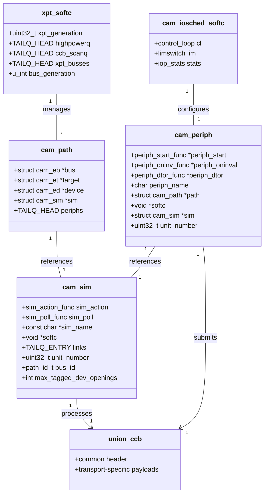

# CAM — Common Access Method Storage Stack
<!-- This file is auto-generated by generate-doc.py -- do not edit manually -->

---
**Navigation:**
  **Up:** [Kernel Core — Structure and Entry Point](../README.md) ▸ [Source Tree — Layout and Conventions](../../README_internals.md)
  **Related:** [GEOM — Storage Framework](../geom/README.md) | [Device Driver Framework — newbus and devclass](../kern/README_driver.md) | [Interrupt Handling — Threads, Filters, and Dispatch](../kern/README_intr.md)
  **All chapters:** [Source Tree — Layout and Conventions](../../README_internals.md) | [Boot Process — UEFI Bootloader to Kernel Handoff](../../stand/efi/loader/README.md) | [Kernel Core — Structure and Entry Point](../README.md) | [Build System — buildworld and buildkernel](../../share/mk/README.md) | [Virtual Memory Subsystem — vm_page, UMA, and Pagers](../vm/README.md) | [Process Management — Scheduling and Lifecycle](../kern/README_process.md) | [Locking Primitives — Mutexes, sx, rmlocks, and Atomics](../kern/README_locking.md) | [Buffer Cache — Block I/O Subsystem](../vm/README_bcache.md) ...
---


> ⚠ **UNVERIFIED DRAFT** — reviewer did not explicitly approve this draft. Treat claims as suspect until manually reviewed.


## Quick Summary

The Common Access Method (CAM) is FreeBSD's storage abstraction layer that sits between the GEOM storage framework and the actual host bus adapter (HBA) hardware. CAM provides a uniform interface for diverse storage transports — SCSI, ATA, NVMe, and MMC — allowing the operating system to treat all block devices through a common mechanism. When a userland process reads from `/dev/da0`, the request flows through the virtual file system (VFS), the buffer cache, GEOM providers, and finally into CAM where it is encapsulated in a Command Control Block (CCB) and dispatched through the transport layer to the appropriate HBA driver.

CAM is organized into three principal layers. The **transport layer (XPT)** owns the bus/target/LUN topology and routes CCBs between peripheral drivers and SIMs. It maintains the Existing Device Table (EDT) that tracks all discovered devices and their capabilities. The **SIM (SCSI Interface Module) layer** is what an HBA driver implements — it is the bridge between CAM and hardware, translating CCBs into DMA or other hardware transactions. The **peripheral driver layer** (drivers like [`da(4)`](../../share/man/man4/da.4) for SCSI disks, [`ada(4)`](../../share/man/man4/ada.4) for ATA disks, [`nda(4)`](../../share/man/man4/nda.4) for NVMe namespaces) attaches to devices discovered by XPT and exposes them as GEOM providers, turning raw device commands into block I/O operations.

The CCB is CAM's central data structure — a discriminated union that can hold transport-specific command payloads. This design allows the XPT layer to route commands uniformly regardless of the underlying transport. The CCB lifecycle spans allocation from the periph zone, submission through XPT, execution by the SIM and hardware, and final completion via the CCB return path to notify the peripheral driver. A priority-based queue system ensures commands are scheduled according to their importance, with support for tagged and untagged transaction limits.

CAM also includes an I/O scheduler (`cam_iosched`) that provides per-device queue management and, when enabled, dynamic rate limiting to optimize mixed read/write workloads on SSDs. The scheduler uses exponential moving averages to track latency across buckets and can throttle certain I/O types when latency deteriorates, helping prevent SSD write amplification from degrading read performance. This integration point between CAM and GEOM allows the system to make intelligent scheduling decisions while maintaining compatibility with GEOM-level queueing.

## Architecture

The CAM architecture is defined across several key source files in `sys/cam/`. The transport layer implementation lives in `sys/cam/cam_xpt.c` (148,668 bytes), which contains the core XPT operations including path management, device discovery, and CCB routing. The peripheral driver infrastructure is in `sys/cam/cam_periph.c` (61,452 bytes), while the SIM management code is in `sys/cam/cam_sim.c` (6,411 bytes). Queue management, which implements a heap-based priority queue, is in `sys/cam/cam_queue.c` (9,939 bytes). The I/O scheduler, introduced in FreeBSD 11 and enhanced with dynamic optimization by Netflix, resides in `sys/cam/cam_iosched.c` (62,228 bytes).

The header file `sys/cam/cam.h` defines the fundamental CAM constants and type definitions shared across the entire subsystem. It declares the `path_id_t`, `target_id_t`, and `lun_id_t` types used for device addressing, along with wildcard constants such as `CAM_XPT_PATH_ID`, `CAM_BUS_WILDCARD`, and `CAM_TARGET_WILDCARD`. The file also defines `CAM_MAX_CDBLEN` (16 bytes), the CAM priority levels (`CAM_RL_HOST`, `CAM_RL_BUS`, `CAM_RL_XPT`, `CAM_RL_DEV`, `CAM_RL_NORMAL`), the priority queue state structure, and the generation numbering system used to track queue membership across rotations.

The `sys/cam/cam_ccb.h` header defines the `union ccb` discriminated union, which contains a common header followed by transport-specific payloads. The `sys/cam/cam_periph.h` header defines the peripheral driver and periph instance structures, which manage the lifecycle of device-specific drivers. The `sys/cam/cam_sim.h` header defines the SIM structure, which represents the hardware interface and provides the `sim_action` callback for processing CCBs.

The `sys/cam/cam_xpt_internal.h` header defines the internal XPT structures, including the XPT softc, existing device, existing target, and existing bus structures, which maintain the topology of buses, targets, and LUNs. The `sys/cam/cam_queue.h` header defines the priority queue and device queue structures, which manage CCB ordering and concurrency limits.

The transport-specific driver implementations live in `sys/cam/scsi/scsi_da.c` (SCSI direct-access driver), `sys/cam/scsi/scsi_all.c` (SCSI command construction utilities), `sys/cam/ata/ata_da.c` (ATA direct-access driver), and `sys/cam/nvme/nvme_all.c` (NVMe command construction). These files implement the peripheral driver callbacks and transport-specific CCB construction.

## Key Data Structures

### `union ccb`

The `union ccb` is the core unit of work in CAM. It contains a common header followed by transport-specific payloads. The header contains the `done` callback, which is invoked when the command completes, and flags that control command behavior. The discriminated union allows the XPT layer to route commands uniformly regardless of the underlying transport.

**Design Rationale:** The discriminated union design was chosen to minimize memory overhead and allow a single allocation to hold any transport command, avoiding the complexity and cache overhead of separate dispatch tables or tagged pointer arrays. This layout ensures that the common header and frequently accessed fields are always at a predictable offset, regardless of the transport type.

### `struct cam_periph`

The `cam_periph` structure represents a peripheral driver instance attached to a specific device. It contains pointers to the compiled path to the device, the associated SIM, and a `softc` pointer for driver-specific state. The `periph_start` callback is invoked to initiate I/O operations.

**Design Rationale:** Reference counting is used on `cam_periph` to allow safe concurrent access and asynchronous cleanup. Because I/O paths and asynchronous events can hold references to the periph structure, a simple reference count ensures the structure isn't freed while still in use, preventing use-after-free bugs during hotplug or device removal.

### `struct cam_sim`

The `cam_sim` structure represents a Storage Interface Module, which is the interface between CAM and hardware. It contains the `sim_action` callback, which is invoked to process CCBs, and the `sim_poll` callback, which is used to poll the hardware for completions. The `softc` pointer holds driver-specific state, and the structure maintains queue management and concurrency limits for the associated device queue.

### `struct cam_path`

The `cam_path` structure represents a compiled path to a device in the CAM topology. It contains pointers to the bus (`struct cam_eb`), target (`struct cam_et`), and device (`struct cam_ed`) structures that make up the path, as well as a list of peripheral drivers attached to that path. This structure allows the XPT layer to efficiently route CCBs to the correct device without traversing the full topology tree on every submission.

## Deep Dive

### SIM/XPT Boundary

The boundary between the SIM (HBA driver) and XPT (transport layer) is strictly defined by callback registration and CCB ownership. **What the SIM must provide to XPT:** The HBA driver registers its SIM structure with XPT, providing a `sim_action` callback that XPT will invoke when CCBs are ready for hardware submission. The SIM is responsible for creating paths to discovered devices via XPT APIs, submitting completed CCBs back to XPT for delivery to peripheral drivers, and handling hardware interrupts to trigger CCB completion processing. **What XPT provides to the SIM:** XPT manages the bus/target/LUN topology, routes incoming CCBs to the correct SIM based on path compilation, and delivers asynchronous events (device discovery, removal, unit attention) to peripheral drivers. XPT also handles CCB allocation, priority queueing, and concurrency control via the device queue, freeing the SIM from managing software-level flow control.

### CCB Lifecycle

The CCB lifecycle begins with allocation from the periph UMA zone, which returns a pointer to a zeroed union ccb. The peripheral driver fills in the CCB fields, including the CDB and data buffer, and submits it to the XPT layer. The XPT layer routes the CCB to the appropriate SIM based on the cam_path associated with the device. The SIM's `sim_action` callback is invoked to process the CCB, which may involve queuing it for later execution or sending it directly to the hardware. When the command completes, the SIM submits the CCB back to XPT via the completion path, which invokes the `done` callback to notify the peripheral driver. The peripheral driver then frees the CCB back to the UMA zone.

### A `read()` on `/dev/da0`

When a userland process reads from `/dev/da0`, the request flows through the following layers:

1. **VFS**: The `read()` system call is handled by the VFS, which looks up the `da0` device node and invokes the `d_strategy` callback.
2. **Buffer Cache**: The VFS allocates a buffer and passes it to the buffer cache, which determines whether the data is already cached or needs to be read from disk.
3. **GEOM**: The buffer cache passes the I/O request to the GEOM framework, which may perform operations like stripping, concatenation, or encryption before passing the request to the underlying provider (`da`). GEOM manages concurrency limits per provider, ensuring the number of in-flight requests stays within hardware and driver capabilities.
4. **CAM Peripheral (`da`)**: The `da` driver exposes itself as a GEOM provider by registering a `d_strategy` callback. When GEOM calls `d_strategy` with a bio structure, [`da(4)`](../../share/man/man4/da.4) translates it into a transport-specific CCB. The attachment sequence works as follows: when XPT discovers a device on the bus, it sends an asynchronous event. The [`da(4)`](../../share/man/man4/da.4) periph driver, registered via `periph_init`, allocates a periph instance, links it to the discovered path, initializes its `softc`, and registers itself to handle I/O for that device. Once attached, [`da(4)`](../../share/man/man4/da.4) packages the request into a CCB and submits it to the XPT layer using the standard submission function. The [`da(4)`](../../share/man/man4/da.4) driver implementation in `sys/cam/scsi/scsi_da.c` handles this through the `dastart()` function:

```c
# From sys/cam/scsi/scsi_da.c
static void
dastart(struct cam_periph *periph, union ccb *start_ccb)
{
    ...
    xpt_action(start_ccb);
    ...
}
```

5. **XPT**: The XPT layer routes the CCB to the appropriate SIM based on the `cam_path` associated with `da0`.
6. **SIM**: The SIM's `sim_action` callback is invoked to process the CCB, which may involve queuing it for later execution or sending it directly to the hardware.
7. **HBA Driver**: The HBA driver translates the CCB into DMA or other hardware transactions and sends them to the device.

The read path walkthrough (VFS → Buffer Cache → GEOM → da → XPT → SIM → HBA) is clear and pedagogically useful for understanding the I/O flow.

### `cam_iosched` Integration

The `cam_iosched` module provides per-device queue management and dynamic rate limiting to optimize mixed read/write workloads on SSDs. It integrates with the GEOM framework by intercepting I/O requests before they are passed to the CAM peripheral drivers. The scheduler uses exponential moving averages to track latency across buckets and can throttle certain I/O types when latency deteriorates, helping prevent SSD write amplification from degrading read performance.

**Interaction with GEOM-level queueing:** `cam_iosched` decides I/O ordering and throttling based on latency metrics, while GEOM-level queueing manages concurrency limits per provider. `cam_iosched` operates at the CAM layer to schedule submissions and apply rate limits, ensuring that high-latency commands don't starve lower-latency ones. GEOM operates at the provider layer to limit the number of concurrent in-flight requests, preventing hardware queue overflows. This separation of ownership allows `cam_iosched` to optimize for latency without interfering with GEOM's concurrency controls.

**Design Rationale:** Exponential moving averages are used to track latency responsively without storing large history buffers, allowing the scheduler to adapt quickly to workload changes. A heap-based priority queue is used to enable efficient O(log N) insertion and extraction for priority scheduling, which is more scalable than simple sorted lists or multiple fixed queues for dynamic workloads with varying priorities.

## Flow / Diagram



## Advanced Notes

### Debugging with DTrace

CAM provides several DTrace probes for debugging and performance analysis. The `cam,xpt,action` probe is invoked when a CCB is submitted to the XPT layer, and the `cam,xpt,done` probe is invoked when a CCB completes. The `cam,xpt,async__cb` probe is invoked when an asynchronous callback is received from the XPT layer. These probes can be used to trace CCB flows, identify bottlenecks, and diagnose issues with device discovery and topology management.

```c
# From sys/cam/cam_xpt.c
SDT_PROBE_DEFINE1(cam, , xpt, action, "union ccb *");
SDT_PROBE_DEFINE1(cam, , xpt, done, "union ccb *");
SDT_PROBE_DEFINE4(cam, , xpt, async__cb, "void *", "uint32_t",
    "struct cam_path *", "void *");
```

### Performance Implications

The CAM architecture introduces several layers of indirection that can impact performance. The XPT layer maintains a complex topology of buses, targets, and LUNs, which must be traversed for every CCB submission and completion. The SIM layer provides a uniform interface for diverse hardware, but this abstraction can introduce overhead for simple devices. The peripheral driver layer adds another layer of indirection, as I/O requests must be packaged into CCBs and routed through the XPT layer before being sent to the hardware.

The `cam_iosched` module can help mitigate these performance impacts by providing intelligent I/O scheduling and rate limiting. By tracking latency across buckets and throttling certain I/O types when latency deteriorates, the scheduler can help prevent SSD write amplification from degrading read performance. However, the scheduler itself introduces overhead, and its effectiveness depends on the underlying hardware and workload characteristics.

### Race Conditions and Pitfalls

CAM is a highly concurrent subsystem that must handle multiple I/O requests simultaneously. The `cam_periph` structure uses a reference counting mechanism to manage its lifecycle, and the `cam_sim` structure uses a mutex to protect its state. However, race conditions can still occur if drivers do not properly acquire and release locks, or if they fail to handle asynchronous events correctly.

One common pitfall is the failure to handle `UNIT ATTENTION` conditions correctly. SCSI devices may return `UNIT ATTENTION` when a logical unit is reset or reconfigured, and drivers must handle these conditions by retrying the command or re-probing the device. Failure to do so can result in I/O errors or data corruption.

Another pitfall is the failure to properly manage CCB lifecycles. CCBs are allocated from a limited pool, and failure to free them correctly can lead to resource exhaustion and system instability. Drivers must ensure that all CCBs are properly freed, even in error cases, and must handle asynchronous events correctly to avoid deadlocks.

The section on UNIT ATTENTION handling and CCB lifecycle pitfalls is practical and relevant to real driver development.

## See Also
- [GEOM — Storage Framework](../geom/README.md)
- [Device Driver Framework — newbus and devclass](../kern/README_driver.md)
- [Interrupt Handling — Threads, Filters, and Dispatch](../kern/README_intr.md)


---

> _Generated by [DaemonDocs](https://github.com/ocochard/DaemonDocs) on 2026-05-03 10:20 UTC using model `Qwen3.6-35B-A3B-UD-Q8_K_XL` (llama.cpp build `b8985-27aef3dd9`). AI-generated content — verify against source before relying on it._
