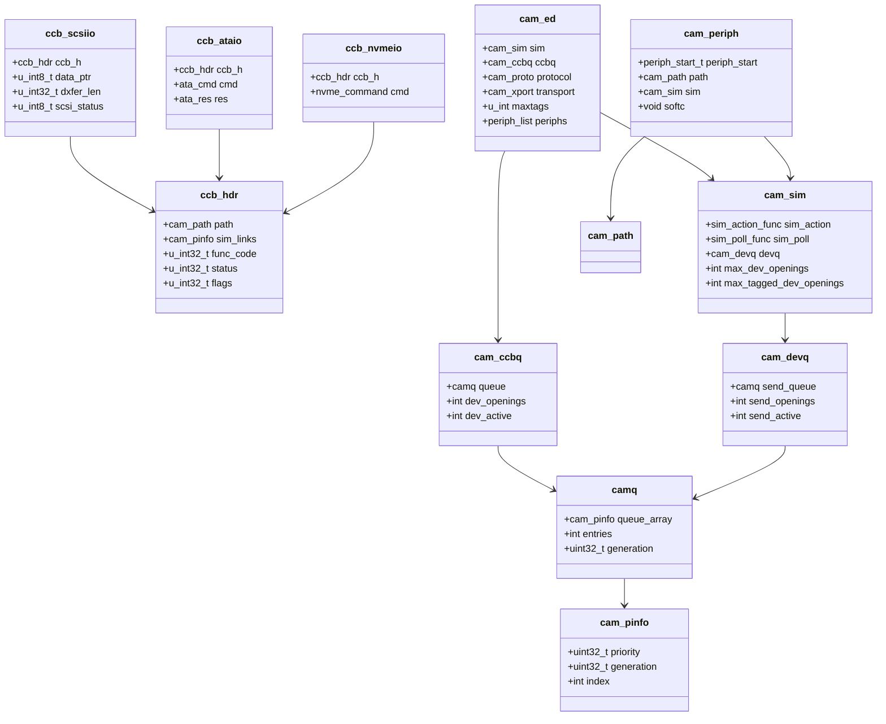

# CAM — Common Access Method Storage Stack
<!-- This file is auto-generated by generate-doc.py -- do not edit manually -->

---
**Navigation:**
  **Up:** [Kernel Core — Structure and Entry Point](../README.md) ▸ [Source Tree — Layout and Conventions](../../README_internals.md)
  **Related:** [GEOM — Storage Framework](../geom/README.md) | [Device Driver Framework — newbus and devclass](../kern/README_driver.md) | [Interrupt Handling — Threads, Filters, and Dispatch](../kern/README_intr.md)
  **All chapters:** [Source Tree — Layout and Conventions](../../README_internals.md) | [Boot Process — UEFI Bootloader to Kernel Handoff](../../stand/efi/loader/README.md) | [Kernel Core — Structure and Entry Point](../README.md) | [Build System — buildworld and buildkernel](../../share/mk/README.md) | [System Calls and Image Activation — Entry, sysent, and exec](../kern/README_syscall.md) | [Kernel Modules and the Linker — KLD, SYSINIT, and linker sets](../kern/README_kld.md) | [Virtual Memory Subsystem — vm_page, UMA, and Pagers](../vm/README.md) | [Process Management — Scheduling and Lifecycle](../kern/README_process.md) ...
---


## Quick Summary

The Common Access Method (CAM) is the layer that turns a [GEOM](../vm/README_bcache.md#glossary) block request into a hardware command and back. GEOM (chapter 9) hands a [`g_bio(9)`](../../share/man/man9/g_bio.9) to a provider; the provider's [strategy](../vm/README_bcache.md#glossary) routine is the top of CAM. From there the request is wrapped in a **Command Control Block ([CCB](#glossary))**, routed down through the transport layer ([XPT](#glossary)) to the specific host bus adapter (HBA) driver, executed by the hardware, and returned up the same path. CAM exists to break a two-dimensional problem into two one-dimensional ones: the code that knows how to talk to a *disk* (the [`da(4)`](../../share/man/man4/da.4) driver) is written once and works on top of any SCSI controller, while the code that knows how to talk to a *particular controller* (the HBA driver, implemented as a [SIM](#glossary)) is written once and works for every disk, tape, and optical device behind it. The same CCB mechanism also carries ATA (Advanced Technology Attachment), NVMe, and MMC (MultiMedia Card) traffic, so four transport families share one routing and queueing framework.

CAM is organized into three layers. The **transport layer (XPT)** owns the bus/target/LUN topology, keeps the Existing Device Table ([EDT](#glossary)) of every discovered device, and routes CCBs between peripheral drivers and SIMs. The **SIM (SCSI Interface Module)** is what an HBA driver actually implements: it is the hardware-facing half of the boundary, translating a CCB into DMA or other controller transactions and reporting completion. The **peripheral drivers** — [`da(4)`](../../share/man/man4/da.4) for SCSI direct-access disks, [`ada(4)`](../../share/man/man4/ada.4) for ATA disks, the NVMe namespace driver `nda`, [`cd(4)`](../../share/man/man4/cd.4) for optical media, and [`sa(4)`](../../share/man/man4/sa.4) for tape — [attach](../kern/README_driver.md#glossary) to the devices the XPT discovers and expose them as GEOM providers, converting block I/O into transport commands.

The CCB is a discriminated union: one opaque object whose payload is a SCSI CDB, an ATA command, an NVMe command, or a transport-management command, selected by a [function code](#glossary) in the common header. The XPT never needs to know which one it is; it routes on the path and lets the SIM switch on the function code. A CCB's lifecycle runs from allocation (from a per-peripheral [UMA](../vm/README_bcache.md#glossary) (Userland Memory Allocator) [zone](../vm/README.md#glossary)), through setup and scheduling in the XPT, execution by the SIM and hardware, and completion back up to the [peripheral driver](#glossary). Two levels of priority queueing bound concurrency: a per-SIM queue limits the controller's total outstanding commands, and a per-device queue limits each LUN's outstanding commands against its tagged-queue depth.

CAM also hosts the I/O scheduler, `cam_iosched`. It reorders the [`g_bio(9)`](../../share/man/man9/g_bio.9) requests a peripheral has accepted before they become CCBs and, when built with dynamic optimization, steers one class of traffic to protect another (for example, throttling writes when read latency on an SSD degrades). This is the point where CAM's per-device scheduling meets GEOM's per-provider queueing: GEOM decides which provider a [bio](../vm/README_bcache.md#glossary) goes to and how many bios a provider may hold; CAM decides the order in which those bios hit the wire and how many may be in flight per LUN.
## Glossary

**CCB** — Command Control Block, the `union ccb` object that carries one I/O request through CAM; a common header plus a payload that is a SCSI, ATA, NVMe, or transport-management command.

**XPT** — the CAM transport layer (`cam_xpt.c`); owns the bus/target/LUN topology and the EDT, and routes CCBs between peripherals and SIMs.

**SIM** — SCSI Interface Module; the hardware-facing structure an HBA driver implements, exposing an action routine and a poll routine to the XPT.

**EDT** — Existing Device Table; the XPT's list of `cam_ed` entries, one per discovered bus/target/LUN, holding that device's queue, async handlers, and attached peripherals.

**devq** — device queue; the per-LUN priority queue (`cam_ccbq`) that bounds how many CCBs may be outstanding to one target against its tagged-queue depth.

**simq / SIM queue** — the per-controller queue (`cam_devq`) shared by all LUNs on a SIM, bounding the controller's total outstanding commands.

**tagged command queuing (TCQ)** — a SCSI feature letting a target accept and reorder out-of-order commands; the per-LUN opening count is raised when a device advertises TCQ.

**peripheral driver** — a CAM type driver (`da`, `ada`, `nda`, `cd`, `sa`, ...) that attaches to a discovered device and turns it into a GEOM provider.

**function code** — the field in `ccb_hdr` that selects which member of the `union ccb` is valid (`XPT_SCSI_IO`, `ATA_PASS_THROUGH`, `XPT_PATH_INQ`, ...).

**openings** — the count of in-flight CCB slots a queue advertises; a CCB may only be sent when an opening is available, which is how CAM enforces queue depth.

## Architecture

CAM is split across a small set of files in `sys/cam/`. The XPT is `sys/cam/cam_xpt.c` (about 149 KB) — by far the largest file in the subsystem — and holds path management, bus/target/LUN discovery, the EDT, async-event dispatch, and the CCB routing entry points `xpt_action` and `xpt_done`. The peripheral-driver framework is `sys/cam/cam_periph.c` (about 61 KB); the SIM management helpers are `sys/cam/cam_sim.c` (about 6 KB); the heap-based priority queues are `sys/cam/cam_queue.c` (about 10 KB); and the I/O scheduler is `sys/cam/cam_iosched.c` (about 62 KB). The CCB types are declared in `sys/cam/cam_ccb.h`; the path, priority, and async types are in `sys/cam/cam.h`; the SIM type in `sys/cam/cam_sim.h`; the EDT and transport/protocol registration in `sys/cam/cam_xpt_internal.h`.

The three layers meet at two narrow interfaces. A peripheral driver talks to the XPT through `xpt_action(union ccb *)` to send a CCB and receives completions through the `periph_start`/done callbacks the XPT invokes. An HBA driver talks to the XPT through the `struct cam_sim` it registers: it supplies a `sim_action` routine (called when a CCB is routed to it) and a `sim_poll` routine, and it reports completion by calling `xpt_done(union ccb *)`. The XPT is the only component that knows both sides; it looks up the `cam_ed` for a CCB's path, finds the SIM, and hands the CCB down, then on the way back it releases the queue [openings](#glossary) and calls the peripheral's done handler.

Transport and protocol are registered as separate, composable sets. `struct xpt_xport` (in `sys/cam/cam_xpt_internal.h`) describes a *transport* — SPI, SAS (Serial Attached SCSI), FC, USB, NVMe, MMC — with an ops table (`alloc_device`, `reldev`, `action`, `async`, `announce_sbuf`). `struct xpt_proto` describes a *protocol* — SCSI, ATA, NVMe — with its own ops table for announcing and debugging. A device in the EDT records both its `protocol` and its `transport`, which is how the same XPT can route a SCSI CDB over SAS and an NVMe command over PCIe without special-casing: the routing key is the path, and the payload interpretation is deferred to the SIM via the function code.

The queueing machinery is the reason CAM can bound hardware concurrency without the peripheral driver doing bookkeeping. Every queue entry begins with a `cam_pinfo` (priority, generation, index) so that a single binary heap (`struct camq`) can order CCBs by priority level and, within a level, round-robin by generation number. Two queues are layered: the per-LUN `cam_ccbq` (device queue) and the per-controller `cam_devq` (SIM queue). A CCB must acquire an opening from both before it is handed to the SIM; when it completes, both openings are released. This is the "two levels of priority queueing" that keeps a busy LUN from starving the rest of the bus and keeps the controller from being oversubscribed.
## Key Data Structures

### The CCB: a discriminated union

The unit of work in CAM is `union ccb`. Every member begins with the same `struct ccb_hdr`, so the XPT can treat any CCB uniformly for routing and completion, and only the SIM — which switches on the function code — interprets the payload. The header is defined in `sys/cam/cam_ccb.h`; the load-bearing fields are:

```c
/* sys/cam/cam_ccb.h — common CCB header (load-bearing fields) */
struct ccb_hdr {
	struct cam_path	*path;		/* Path to the target device. */
	cam_pinfo sim_links;	/* Queue linkage and priority. */
	u_int32_t	func_code;	/* CCB function code. */
	u_int32_t	status;		/* Completion status. */
	u_int32_t	retry_count;	/* Number of retries. */
	/* ... */
	u_int32_t	flags;		/* CCB flags. */
	ccb_ppriv_area	periph_priv;	/* Private area for the peripheral. */
	ccb_spriv_area	sim_priv;	/* Private area for the SIM. */
	u_int32_t	timeout;		/* Timeout value. */
};
```

The `periph_priv` and `sim_priv` areas are fixed-size scratch space (two `ptr`/`field` slots each, sized by `CCB_PERIPH_PRIV_SIZE` and `CCB_SIM_PRIV_SIZE`) that let a peripheral and its SIM stash a private pointer without the other layer having to know about it. The `flags` field is a dense bitfield; the CCB flags in `cam_ccb.h` include the data direction (`CAM_DIR_IN`, `CAM_DIR_OUT`, `CAM_DIR_NONE`, masked by `CAM_DIR_MASK`), the data type (`CAM_DATA_VADDR`, `CAM_DATA_PADDR`, `CAM_DATA_SG`, `CAM_DATA_BIO`, masked by `CAM_DATA_MASK`), `CAM_CDB_POINTER` (the CDB field is a pointer rather than inline bytes), `CAM_DIS_AUTOSENSE`, `CAM_NEGOTIATE`, and the queue-freeze controls `CAM_DEV_QFREEZE`/`CAM_DEV_QFRZDIS`.

The SCSI payload is `struct ccb_scsiio`, also in `cam_ccb.h`:

```c
/* sys/cam/cam_ccb.h — SCSI I/O CCB (head of the struct) */
struct ccb_scsiio {
	struct ccb_hdr ccb_h;	/* Header information fields. */
	union ccb *next_ccb;	/* Next CCB to process. */
	u_int8_t  *req_map;	/* Mapping information. */
	u_int8_t  *data_ptr;	/* Data buffer or S/G list. */
	/* ... cdb_io (union of cdb_bytes / cdb_ptr), dxfer_len,
	 *     scsi_status, sense_len, sense_data ... */
};
```

`data_ptr` is where the peripheral points the CCB at the bio's data (or a scatter/gather list); `dxfer_len` is the transfer length; the `cdb_io` union holds the actual SCSI command bytes (up to `CAM_MAX_CDBLEN`, 16, inline) or a pointer to them when `CAM_CDB_POINTER` is set. The ATA and NVMe payloads follow the same shape — `struct ccb_ataio` carries an `ata_cmd`/`ata_res` pair, and `struct ccb_nvmeio` carries an `nvme_command`/completion pair — so the XPT's routing code is identical for all three. The helpers `cam_fill_scsiio`, `cam_fill_ataio`, and `cam_fill_nvmeio` (in `cam_ccb.h`) zero and initialize the right member, and `scsiio_cdb_ptr`/`atio_cdb_ptr` resolve the CDB pointer given the `CAM_CDB_POINTER` flag.

### The SIM

`struct cam_sim` (in `sys/cam/cam_sim.h`) is what an HBA driver hands to the XPT. The comment in the header makes the design intent explicit: a driver may create one SIM per channel of a multi-channel controller and share one queue across them, so the queue — not the SIM — is the unit of resource sharing.

```c
/* sys/cam/cam_sim.h */
struct cam_sim {
	sim_action_func		sim_action;	/* Called to run a CCB. */
	sim_poll_func		sim_poll;	/* Called to poll the HBA. */
	const char		*sim_name;
	void			*softc;		/* Driver's private state. */
	struct mtx		*mtx;
	TAILQ_ENTRY(cam_sim)	links;
	uint32_t		path_id;
	uint32_t		unit_number;
	uint32_t		bus_id;
	int			max_tagged_dev_openings;
	int			max_dev_openings;
	uint32_t		flags;
	struct cam_devq 	*devq;	/* Device Queue for this SIM. */
	int			refcount;
};
```

The SIM is created with `cam_sim_alloc(sim_action, sim_poll, sim_name, softc, unit, mtx, max_dev_transactions, max_tagged_dev_transactions, queue)`, where `queue` is the return value of `cam_simq_alloc()`. The `max_dev_openings` and `max_tagged_dev_openings` values seed the per-LUN device queue: a LUN that advertises TCQ gets up to `max_tagged_dev_openings` in flight; one that does not gets `max_dev_openings`. The accessor inlines `cam_sim_path()`, `cam_sim_name()`, `cam_sim_softc()`, `cam_sim_unit()`, and `cam_sim_bus()` let the XPT reach the SIM's identity without touching the rest of the structure.
### The EDT entry

`struct cam_ed` (in `sys/cam/cam_xpt_internal.h`) is one row of the Existing Device Table — one per discovered bus/target/LUN. It is the pivot of the XPT: it owns the per-device queue, the async handler list, and the list of attached peripherals, and it records the device's protocol, transport, and negotiated tag counts.

```c
/* sys/cam/cam_xpt_internal.h */
struct cam_ed {
	cam_pinfo	 devq_entry;	/* Entry in the SIM's devq. */
	TAILQ_ENTRY(cam_ed) links;
	struct	cam_et	 *target;
	struct	cam_sim  *sim;
	lun_id_t	 lun_id;
	struct	cam_ccbq ccbq;		/* Queue of pending ccbs. */
	struct	async_list asyncs;	/* Async callbacks for this B/T/L. */
	struct	periph_list periphs;	/* All attached peripherals. */
	u_int		 generation;	/* Generation number. */
	void		 *quirk;	/* Oddities about this device. */
	u_int		 maxtags;
	u_int		 mintags;
	cam_proto	 protocol;
	u_int		 protocol_version;
	cam_xport	 transport;
	u_int		 transport_version;
	struct		 scsi_inquiry_data inq_data;
	/* ... supported_vpds, device_id ... */
};
```

The `ccbq` member is the per-LUN device queue; the `periphs` list holds every peripheral driver that has attached to this B/T/L (a single LUN can back more than one peripheral in edge cases); the `asyncs` list is where SIMs and peripherals register to be notified of async events (device reset, medium change, link failure). `maxtags`/`mintags` are the negotiated tagged-queue depth; `inq_data` caches the SCSI INQUIRY result so the XPT can match peripheral drivers to device types without re-querying.

### The peripheral driver

`struct cam_periph` (in `sys/cam/cam_periph.h`) is one instantiated peripheral — one `da0`, one `cd1`, etc. It carries the callbacks the XPT uses to drive it and the path/sim it is bound to:

```c
/* sys/cam/cam_periph.h */
struct cam_periph {
	periph_start_t		*periph_start;	/* Build+send a CCB. */
	periph_oninv_t		*periph_oninval;	/* Device invalidated. */
	periph_dtor_t		*periph_dtor;	/* Peripheral destroyed. */
	char			*periph_name;
	struct cam_path		*path;	/* Compiled path to device. */
	void			*softc;		/* Driver's private state. */
	struct cam_sim		*sim;
	uint32_t		 unit_number;
	cam_periph_type		 type;
	uint32_t		 flags;
	/* CAM_PERIPH_RUNNING, CAM_PERIPH_LOCKED, ... */
};
```

`struct periph_driver` is the per-type descriptor that the XPT uses to find and instantiate peripherals; each type driver registers one via the `PERIPHDRIVER_DECLARE(name, driver)` macro, which wraps a `DECLARE_MODULE` at `SI_SUB_DRIVERS`:

```c
/* sys/cam/cam_periph.h */
struct periph_driver {
	periph_init_t		*init;		/* Run when XPT is up. */
	char			*driver_name;
	TAILQ_HEAD(,cam_periph)	 units;	/* Instantiated peripherals. */
	u_int			 generation;
	u_int			 flags;
	periph_deinit_t		*deinit;
};
```

The `units` list is how the XPT walks every `da*` when it needs to, say, notify all SCSI disks of a bus reset. The `init` callback (e.g. `dainit`) is what the XPT calls once, after the XPT itself is fully up, to let the type driver scan the EDT and attach to matching devices.

### The queueing machinery

The queues are binary heaps ordered by a `cam_pinfo` embedded at the head of every entry. The `cam_pinfo` type (in `sys/cam/cam.h`) is the sort key:

```c
/* sys/cam/cam.h */
typedef struct {
	uint32_t priority;	/* CAM_PRIORITY_HOST/BUS/XPT/DEV/NORMAL. */
	uint32_t generation;	/* Round-robin within a priority level. */
	int       index;	/* CAM_UNQUEUED/ACTIVE/DONEQ/... */
} cam_pinfo;
```

The priority levels — host, bus, XPT, device, normal — let the XPT interleave its own management traffic (resets, path inquiries) ahead of or behind ordinary I/O. The `generation` counter is incremented each time an entry is queued, and `GENERATIONCMP()` compares generations with modular arithmetic so the queue round-robins fairly within a level even as the counter wraps. `struct camq` is the heap itself:

```c
/* sys/cam/cam_queue.h */
struct camq {
	cam_pinfo **queue_array;	/* The heap. */
	int	   array_size;
	int	   entries;
	uint32_t  generation;
	uint32_t  qfrozen_cnt;
};
```

`struct cam_ccbq` is the per-LUN device queue built on top of a `camq`, plus an "extra" list for CCBs that cannot be sent because the controller is full:

```c
/* sys/cam/cam_queue.h */
struct cam_ccbq {
	struct	camq queue;
	struct ccb_hdr_tailq	queue_extra_head;
	int	queue_extra_entries;
	int	total_openings;
	int	allocated;
	int	dev_openings;
	int	dev_active;
};

struct cam_devq {
	struct mtx	 send_mtx;
	struct camq	 send_queue;
	int		 send_openings;
	int		 send_active;
};
```

The opening counters are the heart of concurrency control: `dev_openings`/`dev_active` track the per-LUN depth, `send_openings`/`send_active` track the per-controller depth. `cam_ccbq_take_opening()`/`cam_ccbq_release_opening()` and the analogous `xpt_freeze_simq()`/`xpt_release_simq()` are what a CCB acquires on the way down and returns on the way up.
## Deep Dive

### Tracing a read() on /dev/da0

The path from a userland `read()` to the HBA and back crosses six boundaries. Each boundary is a function call into the next layer; the CCB is the object that threads through the middle four.

1. **VFS → [buffer cache](../vm/README_bcache.md#glossary).** [`read(2)`](../../lib/libsys/read.2) on the `da0` vnode goes through the VFS and the buffer layer. The buffer layer determines which disk block(s) are needed and, on a miss, allocates a `struct buf` and marks it for I/O. The buffer layer is device-agnostic; it does not know the device is SCSI.

2. **Buffer cache → GEOM.** The `buf` is converted into a [`g_bio(9)`](../../share/man/man9/g_bio.9) and dispatched to the provider. `da0` is a GEOM disk (`g_disk`), so the bio is routed to the da provider. GEOM's job here is to pick the provider and to enforce the provider's queue limit; it does not order the I/O.

3. **GEOM → peripheral (dastrategy).** The da provider's strategy routine is `dastrategy` (in `sys/cam/scsi/scsi_da.c`), installed when the peripheral registered its disk via `dasetgeom`. `dastrategy` locks the peripheral, pulls the `da_softc` from the peripheral's `softc`, and enqueues the bio into the I/O scheduler with `cam_iosched_queue_work()`. It does not build a CCB yet — the scheduler decides when and in what order bios become CCBs.

4. **Scheduler → CCB (daschedule / dastart).** The scheduler's drive callback (`cam_iosched_schedule`, wired to `daschedule`) pulls the next bio with `cam_iosched_next_bio()` and hands it to the peripheral's `periph_start`, which for da is `dastart`. `dastart` is where the bio becomes a CCB: it allocates a `ccb_scsiio` (via `cam_periph_getccb`/`xpt_alloc_ccb`), fills in a SCSI READ(10) CDB, sets `data_ptr` to the bio's data and `dxfer_len` to the transfer size, sets the direction flag, and calls `cam_periph_runccb()`. The [probe](../kern/README_driver.md#glossary) [state](../netpfil/pf/README.md#glossary) machine at the top of `scsi_da.c` (`DA_STATE_PROBE_RC`, `DA_STATE_PROBE_CACHE`, `DA_STATE_PROBE_LBP`, ...) is how `dastart` issues the one-shot management CCBs (READ CAPACITY, MODE SENSE, etc.) during attach before it ever issues a data CCB.

5. **CCB → XPT → SIM → HBA.** `cam_periph_runccb()` (in `sys/cam/cam_periph.c`) takes a device-queue opening and either inserts the CCB into the `cam_ed`'s `ccbq` or sends it. The XPT's `xpt_action()` (in `sys/cam/cam_xpt.c`) looks up the `cam_ed` from the CCB's path, takes a SIM-queue opening, and calls `sim->sim_action(sim, ccb)`. That is the HBA driver's action routine (for example `ahc_action` in an Adaptec driver). The SIM translates the CCB into controller transactions — loading the data buffer into a DMA map, programming the command queue — and returns. The CCB now sits in the hardware, holding one opening at each queue level.

6. **Completion: HBA → SIM → XPT → peripheral → GEOM.** When the hardware finishes, the HBA's interrupt handler runs its done routine (e.g. `ahc_done`), which sets `ccb->ccb_h.status` (to `CAM_REQ_CMP` on success, or a SCSI-status/autosense error) and calls `xpt_done(ccb)`. `xpt_done()` (in `cam_xpt.c`) releases both queue openings and invokes the peripheral's completion path, `camperiphdone()` in `cam_periph.c`, which dispatches to `dadone()` in `scsi_da.c`. On success `dadone()` completes the bio (`cam_iosched_bio_complete()`), which returns control to GEOM; GEOM marks the buffer valid, the buffer layer wakes the sleeping `read()`, and the data is copied to userland. On error, `dadone()` maps the CAM status to an errno and the bio completes with that error.

The same skeleton runs for every peripheral, only the CCB payload and the CDB differ: `adastrategy`/`adastart` build a `ccb_ataio` with an `ata_cmd` (via `ata_28bit_cmd`/`ata_48bit_cmd`/`ata_ncq_cmd` in `sys/cam/ata/ata_all.c`); the NVMe namespace driver builds a `ccb_nvmeio` (via `nvme_ns_cmd` in `sys/cam/nvme/nvme_all.c`); `cdstrategy` and `sastart` build SCSI CDBs for MMC and tape commands respectively. The XPT and the queueing code are shared verbatim.
### The SCSI command-helper layer: scsi_all.c

`scsi_da.c` is not where the SCSI command blocks actually get built. The CDB layout structs and the byte-packing helpers that fill them live in the shared SCSI utility layer `sys/cam/scsi/scsi_all.c` (with its declarations in `sys/cam/scsi/scsi_all.h`), the file whose header comment calls it the implementation of utility functions for all SCSI device types. This is the SCSI-side counterpart to `ata_all.c` and `nvme_all.c`: it is the command-helper layer that `scsi_da.c`, `scsi_cd.c`, `scsi_sa.c`, and the other SCSI peripherals all call so that no peripheral has to hand-write command bytes. `scsi_all.h` defines one CDB layout struct per command — `scsi_generic`, `scsi_test_unit_ready`, `scsi_request_sense`, and the READ, WRITE, INQUIRY, and MODE SENSE command blocks — and `scsi_all.c` provides the helper routines that populate them. The multi-byte fields of a READ(10) or WRITE(10) CDB (the 32-bit LBA (Logical Block Address) and the 16-bit transfer length) are not written byte-by-byte by the caller; the peripheral calls the conversion helpers `scsi_ulto2b()`, `scsi_ulto3b()`, and `scsi_ulto4b()` to pack an integer into the big-endian CDB field. A CDB layout looks like this:

```c
/* sys/cam/scsi/scsi_all.h — example CDB layout structs */
struct scsi_generic {
	uint8_t opcode;
	uint8_t bytes[11];
};

struct scsi_test_unit_ready {
	uint8_t opcode;
	uint8_t byte2;
	uint8_t unused[3];
	uint8_t control;
};
```

So when `dastart` issues a READ(10) it is really filling in a READ(10) CDB struct and calling `scsi_ulto4b()` on the LBA and `scsi_ulto2b()` on the length; the INQUIRY, MODE SENSE, and REQUEST SENSE management CCBs in the probe state machine use the same shared structs and helpers. This is why the same `scsi_da.c` works unchanged on every SCSI controller: the command construction is factored out of the peripheral and into the utility layer.


### How da attaches and becomes a GEOM provider

When the XPT finishes scanning a bus, it has a `cam_ed` for each discovered LUN, populated with `inq_data` (the SCSI INQUIRY page) and the negotiated `maxtags`. Each registered peripheral type driver gets a chance to match. The da type driver's `init` (`dainit`, called from `periphdriver_init` at `SI_SUB_DRIVERS`) walks the EDT; for each LUN whose INQUIRY reports a direct-access device, it calls `cam_periph_alloc()` to create a `struct cam_periph`, fills in the `periph_start`/`periph_oninval`/`periph_dtor` callbacks and the path, and registers the peripheral so the XPT will route CCBs to it. `daregister` then creates the `g_disk` GEOM provider, sets the media geometry via `dasetgeom`, and links the disk's `d_drv1` back to the `da_softc`. From that point, GEOM bios for that disk arrive at `dastrategy`, and the device is visible to userland as `/dev/daN`. The probe state machine in `dastart` then issues the management CCBs (READ CAPACITY, READ BUFFER LIMITS, MODE SENSE for caching and LBP) that fill in the disk's sector size, write-cache behavior, and maximum transfer size before the first data I/O is allowed.

### The ada peripheral driver: ata_da.c

`sys/cam/ata/ata_da.c` is the ATA counterpart to `scsi_da.c`: it contains the [`ada(4)`](../../share/man/man4/ada.4) peripheral driver itself, not the shared command helpers. That is what makes the two-file split in `sys/cam/ata/` meaningful — `ata_all.c` holds the shared ATA command helpers (the `ata_28bit_cmd`/`ata_48bit_cmd`/`ata_ncq_cmd` builders that `adastart` calls), while `ata_da.c` holds the peripheral: the `adastrategy`/`adastart`/`adadone` callbacks, the ATA probe state machine that negotiates the disk's sector size and capabilities during attach, and the GEOM registration that turns the discovered ATA disk into a `g_disk` provider (the `daregister`-equivalent in the ATA world). Structurally it is the same peripheral-driver pattern as da — a `cam_periph` with a `periph_start` that builds a `ccb_ataio` and a done routine that completes the bio — but the CCB payload is an `ata_cmd`/`ata_res` pair rather than a SCSI CDB, and the probe state machine walks the ATA IDENTIFY and feature pages instead of the SCSI INQUIRY and MODE SENSE pages. The XPT, the queues, and the I/O scheduler are shared verbatim with the SCSI path.

### The I/O scheduler

`cam_iosched` (in `sys/cam/cam_iosched.c`) sits between the peripheral's strategy routine and its `periph_start`. Its job is to hold the bios a peripheral has accepted and release them to the hardware in an order that the device will service efficiently. The header comment is candid about the base implementation: it is "a thin veneer over the `bioq_*` interface, with notions of separate calls for normal I/O and for trims." Bios are queued with `cam_iosched_queue_work()` and dequeued with `cam_iosched_next_bio()`; TRIM (unmap) requests are kept on a separate path — `cam_iosched_next_trim()`, `cam_iosched_get_trim()`, `cam_iosched_submit_trim()`, `cam_iosched_put_back_trim()` — so that a burst of TRIMs cannot starve ordinary reads and writes.

When built with `CAM_IOSCHED_DYNAMIC`, the scheduler measures per-class latency with an exponential moving average (the `alpha_bits` sysctl sets the EMA window; the default 9 gives roughly a 1025-sample lookback for 86% of the data) and buckets latencies starting at `bucket_base` (20 µs) in a geometric progression. It then steers: if read latency degrades, it throttles writes to protect reads. The tunables live under `kern.cam.iosched` — `dynamic` (enable/disable steering), `alpha_bits`, and the read-only bucket parameters — and the scheduler's working memory is allocated from the `M_CAMSCHED` malloc type ("CAM I/O Scheduler"). The scheduler is created per peripheral by `cam_iosched_init()` and torn down by `cam_iosched_fini()`.

This is the seam between the two queueing systems. GEOM enforces *how many* bios a provider may hold and *which* provider a bio goes to. `cam_iosched` decides the *order* in which those bios are turned into CCBs. The CAM device/SIM queues then decide *how many* CCBs may actually be in flight to the LUN and the controller. Three distinct concurrency decisions, three distinct owners.
## Flow / Diagram

The diagram shows the core CAM structures and how they reference one another. The `union ccb` is drawn as three of its payload members, each embedding the same `ccb_hdr`; the EDT entry (`cam_ed`) links a peripheral's device queue to the SIM's controller queue; and both queues are binary heaps (`camq`) keyed on `cam_pinfo`.


## Advanced Notes

**Debugging with DTrace and `camdebug`.** The XPT and peripheral layers are instrumented with SDT probes (`cam_xpt.c` declares `SDT_PROBE_DEFINE` sites). The classic tool for CAM debugging is the `camdebug(4)` utility (or [`camcontrol(8)`](../../sbin/camcontrol/camcontrol.8) for a higher-level view). `camcontrol inquiry` dumps the cached `inq_data` from the EDT; `camcontrol devlist` walks the `cam_ed` list and prints each device's path, protocol, and transport. For live tracing, `camcontrol scan` forces a rescan (issuing `ccb_rescan` CCBs through the XPT), and `camcontrol passthr` issues an arbitrary CCB — the same `ccb_scsiio` a peripheral would build — which is invaluable for testing a suspect controller or a device that misbehaves under the normal driver. The `cam_iosched` sysctl tree under `kern.cam.iosched` exposes the scheduler's live state (latency buckets, IOPS, the dynamic-steering on/off flag) for tuning without a reboot.

**Queue-depth and the opening model.** The two-level opening model is the single most important performance knob in CAM. A LUN that advertises a deep tagged queue (say 256 tags) will be given up to `max_tagged_dev_openings` in-flight CCBs; a LUN that does not will be capped at `max_dev_openings`. If the controller's `cam_devq` is smaller than the sum of its LUNs' device queues, the controller becomes the bottleneck and CCBs pile up on the `queue_extra_head` list. The `qfrozen_cnt` field in `camq` tracks how many times a queue has been frozen (via `xpt_freeze_simq`/`xpt_freeze_devq`), which is how the XPT temporarily halts I/O to a device during a reset or a topology change. A frozen queue that is not released is the classic cause of a hung disk: the CCBs are stuck, the openings are never returned, and the device appears dead.

**The probe state machine and ordering hazards.** The `da_state` enum at the top of `scsi_da.c` is a linear state machine that `dastart`/`dadone` step through during attach. The comment in the source is explicit about the ordering constraints: READ CAPACITY must come before READ CAPACITY(16) (unless RC16 is known to be supported), READ BUFFER LIMITS must come before any ATA probe, and the ATA probes must go in the order ATA → LOGDIR → IDDIR → SUP → ATA_ZONE. Violating this order produces wrong geometry or wrong sector-size detection. The `dadone_probe*` functions (one per probe state) are where the management CCBs' results are parsed; a failure at any step leaves the peripheral in a degraded state but does not prevent it from attaching — the disk comes up with conservative defaults.

**Race conditions and the peripheral lock.** The `cam_periph` structure is protected by a mutex (`cam_periph_mtx`), which is taken by `cam_periph_acquire()` and released by `cam_periph_release()`. The strategy routine (`dastrategy`) takes this lock before touching the scheduler; the done routine (`dadone`) takes it before completing the bio. The XPT's `xpt_done` runs in interrupt context (from the HBA's interrupt handler), so the peripheral must be careful not to sleep while holding the lock. The `CAM_PERIPH_LOCKED` flag in `cam_periph.flags` is set while the lock is held and is checked by the async path to defer work. A common bug in third-party SIM drivers is calling `xpt_done` while still holding the SIM's mutex, which can deadlock if the done path tries to acquire the same SIM lock.

**Connection to OS theory.** CAM is a concrete instance of the device-driver layering described in Tanenbaum and Bos's operating-systems textbook: a device-independent layer (the XPT, which knows about paths and queues but not about SCSI CDBs) sits above a device-dependent layer (the SIM, which knows about a specific controller's registers and DMA engine). The discriminated-union CCB is the same pattern as a generic I/O request structure in any OS: a common header that the generic layer can inspect (for routing, completion, and accounting) plus a payload that only the specific driver interprets. The two-level priority queue is a form of weighted fair queuing: the per-LUN queue ensures one busy disk cannot starve the others on the same bus, and the per-controller queue ensures the controller is not oversubscribed. The `cam_iosched` scheduler with its EMA-based latency measurement and dynamic steering is a more dynamic form of the same idea — it adapts the weights based on observed behavior, which is the difference between a static and a feedback-controlled scheduler.

## See Also
- [GEOM — Storage Framework](../geom/README.md)
- [Device Driver Framework — newbus and devclass](../kern/README_driver.md)
- [Interrupt Handling — Threads, Filters, and Dispatch](../kern/README_intr.md)


- [`sys/cam/cam_xpt.c`](cam_xpt.c) — the XPT: path management, EDT, CCB routing, async dispatch.
- [`sys/cam/cam_periph.c`](cam_periph.c) — the peripheral-driver framework: allocation, scheduling, completion.
- [`sys/cam/cam_sim.c`](cam_sim.c) — SIM allocation and reference counting.
- [`sys/cam/cam_queue.c`](cam_queue.c) — the heap-based priority queues.
- [`sys/cam/cam_iosched.c`](cam_iosched.c) — the I/O scheduler.
- [`sys/cam/scsi/scsi_da.c`](scsi/scsi_da.c) — the SCSI disk peripheral driver.
- [`sys/cam/ata/ata_da.c`](ata/ata_da.c) — the ATA disk peripheral driver.
- [`sys/cam/nvme/nvme_da.c`](nvme/nvme_da.c) — the NVMe namespace peripheral driver.
- Man pages: `cam(4)`, [`da(4)`](../../share/man/man4/da.4), [`ada(4)`](../../share/man/man4/ada.4), [`cd(4)`](../../share/man/man4/cd.4), [`sa(4)`](../../share/man/man4/sa.4), [`camcontrol(8)`](../../sbin/camcontrol/camcontrol.8), `camdebug(4)`, [`g_bio(9)`](../../share/man/man9/g_bio.9), [`g_provider(9)`](../../share/man/man9/g_provider.9), `xpt_action(9)`, `xpt_done(9)`, `cam_sim_alloc(9)`.

---

> _Generated by [DaemonDocs](https://github.com/ocochard/DaemonDocs) on 2026-09-02 12:59 UTC using model `Qwen3.8-27B-Q8_0` (llama.cpp build `b10553-cd26896c1`). AI-generated content — verify against source before relying on it._
