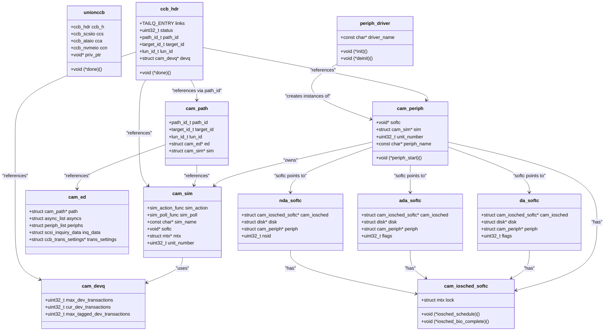

# CAM — Common Access Method Storage Stack
<!-- This file is auto-generated by generate-doc.py -- do not edit manually -->

---
**Navigation:**
  **Up:** [Kernel Core — Structure and Entry Point](../README.md) ▸ [Source Tree — Layout and Conventions](../../README_internals.md)
  **Related:** [GEOM — Storage Framework](../geom/README.md) | [Device Driver Framework — newbus and devclass](../kern/README_driver.md) | [Interrupt Handling — Threads, Filters, and Dispatch](../kern/README_intr.md)
  **All chapters:** [Source Tree — Layout and Conventions](../../README_internals.md) | [Boot Process — UEFI Bootloader to Kernel Handoff](../../stand/efi/loader/README.md) | [Kernel Core — Structure and Entry Point](../README.md) | [Build System — buildworld and buildkernel](../../share/mk/README.md) | [Virtual Memory Subsystem — vm_page, UMA, and Pagers](../vm/README.md) | [Process Management — Scheduling and Lifecycle](../kern/README_process.md) | [Locking Primitives — Mutexes, sx, rmlocks, and Atomics](../kern/README_locking.md) | [Buffer Cache — Block I/O Subsystem](../vm/README_bcache.md) ...
---


> ⚠ **UNVERIFIED DRAFT** — reviewer did not explicitly approve this draft. Treat claims as suspect until manually reviewed.


## Quick Summary

The Common Access Method (CAM) is FreeBSD's storage abstraction layer that sits between the GEOM storage framework and the actual host bus adapter (HBA) hardware drivers. CAM provides a uniform interface for diverse storage transports — SCSI, ATA, NVMe, and MMC — allowing the operating system to treat all block devices through a common mechanism. When a userland process reads from `/dev/da0`, the request flows through the virtual file system (VFS), the buffer cache, GEOM providers, and finally into CAM where it is encapsulated in a Command Control Block (CCB) and dispatched through the transport layer to the appropriate HBA driver.

CAM is organized into three principal layers. The **transport layer (XPT)** owns the bus/target/LUN topology and routes CCBs between peripheral drivers and SIMs. It maintains the Existing Device Table (EDT) that tracks all discovered devices and their capabilities. The **SIM (SCSI Interface Module) layer** is what an HBA driver implements — it is the bridge between CAM and hardware, translating CCBs into DMA or other hardware transactions. The **peripheral driver layer** (drivers like `da(4)` for SCSI disks, `ada(4)` for ATA disks, `nda(4)` for NVMe namespaces) attaches to devices discovered by XPT and exposes them as GEOM providers, turning raw device commands into block I/O operations.

The CCB is CAM's central data structure — a discriminated union that can hold SCSI commands (`ccb_scsiio`), ATA commands (`ccb_ataio`), NVMe commands (`ccb_nvmeio`), or other transport-specific operations. This design allows the XPT layer to route commands uniformly regardless of the underlying transport. The CCB lifecycle spans allocation from a M_CAMCCB pool, submission through XPT, execution by the SIM and hardware, and final completion via the `xpt_done()` callback. A priority-based queue system (`camq`) ensures commands are scheduled according to their importance, with support for tagged and untagged transaction limits.

CAM also includes an I/O scheduler (`cam_iosched`) that provides per-device queue management and, when enabled, dynamic rate limiting to optimize mixed read/write workloads on SSDs. The scheduler uses exponential moving averages to track latency across buckets and can throttle certain I/O types when latency deteriorates, helping prevent SSD write amplification from degrading read performance. This integration point between CAM and GEOM allows the system to make intelligent scheduling decisions while maintaining compatibility with GEOM-level queueing.

## Architecture

The CAM architecture is defined across several key source files in `sys/cam/`. The transport layer implementation lives in `sys/cam/cam_xpt.c` (148,668 bytes), which contains the core XPT operations including path management, device discovery, and CCB routing. The peripheral driver infrastructure is in `sys/cam/cam_periph.c` (61,452 bytes), while the SIM management code is in `sys/cam/cam_sim.c` (6,411 bytes). Queue management, which implements a heap-based priority queue, is in `sys/cam/cam_queue.c` (9,939 bytes). The I/O scheduler, introduced in FreeBSD 11 and enhanced with dynamic optimization by Netflix, resides in `sys/cam/cam_iosched.c` (62,228 bytes).

The header file `sys/cam/cam.h` defines the fundamental CAM constants and type definitions shared across the entire subsystem. It declares the `path_id_t`, `target_id_t`, and `lun_id_t` types used for device addressing, along with wildcard constants such as `CAM_XPT_PATH_ID`, `CAM_BUS_WILDCARD`, and `CAM_TARGET_WILDCARD`. The file also defines `CAM_MAX_CDBLEN` (16 bytes), the CAM priority levels (`CAM_RL_HOST`, `CAM_RL_BUS`, `CAM_RL_XPT`, `CAM_RL_DEV`, `CAM_RL_NORMAL`), the `cam_pinfo` structure for priority queue state, and the `GENERATIONCMP` macro for comparing generation numbers in the queue system. Additionally, `cam.h` defines the `M_CAMCCB` memory type used for CCB allocation and the `cam_flags` enumeration including `CAM_FLAG_NONE`, `CAM_EXPECT_INQ_CHANGE`, and `CAM_RETRY_SELTO`.

The file `sys/cam/scsi/scsi_all.c` implements utility functions for SCSI command encoding and decoding across all SCSI device types. It provides functions for translating between SCSI command opcodes and human-readable strings, parsing sense data (including the `sense_key_table_entry` and `asc_table_entry` structures for ASC/ASCQ lookup), and formatting inquiry data for display. The file contains the `scsi_delay` variable for bus settle time configuration and implements table-driven lookup of ASC (Additional Sense Code) and ASCQ (Additional Sense Code Qualifier) values mapped to SCSI sense keys. These utilities are used by all SCSI peripheral drivers to interpret device responses and report errors consistently.

The file `sys/cam/ata/ata_da.c` implements the ATA-specific peripheral driver (`ada(4)`) that handles ATA disk devices through CAM. It defines the `ada_state` enumeration for the probe state machine (RAHEAD, WCACHE, LOGDIR, IDDIR, SUP_CAP, ZONE, NORMAL) and the `ada_flags` bitmask for device capabilities such as `ADA_FLAG_CAN_NCQ`, `ADA_FLAG_CAN_TRIM`, and `ADA_FLAG_CAN_48BIT`. The driver uses the same `scsi_da.h` structures for GEOM integration as the SCSI disk driver but translates between ATA command sets and CAM's CCB interface. It supports ATA features including NCQ (Native Command Queuing), 48-bit LBA addressing, TRIM/discard operations, and power management through ATA-specific CCB types (`ccb_ataio`).

The file `sys/cam/nvme/nvme_all.c` implements NVMe-specific utility functions used by the NVMe peripheral driver (`nda(4)`). It provides the `nvme_ns_cmd()` function for constructing NVMe namespace commands with opcodes, namespace IDs, and command-specific double words (CDW10-CDW15). The file includes `nvme_print_ident()` and `nvme_print_ident_short()` for formatting NVMe controller and namespace identification data using sbuf, and `nvme_command_string()` for converting NVMe commands to human-readable strings for debugging. These utilities handle the NVMe command format defined in `struct nvme_command` which differs significantly from SCSI CDBs.

The XPT layer maintains three hierarchical data structures for device management. The bus table (`xpt_busses`, a `TAILQ` of `cam_eb` structures) tracks all buses. The target table (`cam_et`) tracks targets on each bus. The device table (`cam_ed`, also called the Existing Device Table or EDT) tracks individual devices at each bus/target/LUN combination. Each `cam_ed` structure contains the device's inquiry data, supported VPD pages, protocol/transport information, and current state. The XPT maintains `path_id` values that uniquely identify each bus/target/LUN combination, allowing commands to be routed to the correct device.

The SIM layer is what an HBA driver implements. When an HBA driver initializes, it calls `cam_sim_alloc()` to create a `cam_sim` structure, specifying the `sim_action` callback that XPT will invoke when CCBs need processing. The `cam_sim` structure holds the action function, a poll function for completion checking, a name string, softc pointer, unit number, mutex, and transaction limits. Each SIM is associated with one or more `cam_path` structures that connect it to specific devices.

Peripheral drivers like `da(4)`, `ada(4)`, and `nda(4)` are registered with the periph driver infrastructure. Each peripheral driver defines a `periph_driver` structure containing initialization and cleanup functions. When XPT discovers a device matching a peripheral driver's criteria, it allocates a `cam_periph` structure and calls the periph driver's initialization function. The periph driver then performs device-specific probing (reading mode pages, identifying capabilities) and registers with GEOM to expose the device as a block provider.

The CCB allocation and dispatch flow follows a clear pattern. Peripheral drivers obtain CCBs from a periph UMA zone or the M_CAMCCB pool. They initialize the `ccb_hdr` with the appropriate CCB type (`ccb_scsiio`, `ccb_ataio`, `ccb_nvmeio`, etc.), set up data buffers (using `CAM_DATA_VADDR`, `CAM_DATA_SG`, or `CAM_DATA_BIO`), and submit the CCB to XPT via `xpt_action()`. XPT routes the CCB to the appropriate SIM, which processes it and eventually calls `xpt_done()` to signal completion. The peripheral driver's `periph_start` function is invoked to continue processing the next queued CCB.

## Key Data Structures

### `union ccb` — The Command Control Block

The `union ccb` in `sys/cam/cam_ccb.h` is CAM's central discriminated union. It contains a common header (`ccb_hdr`) followed by transport-specific fields:

```c
union ccb {
    struct ccb_hdr ccb_h;
    struct ccb_scsiio ccs;
    struct ccb_ataio cca;
    struct ccb_nvmeio ccn;
    struct ccb_getdev ccgd;
    struct ccb_pathinq ccpi;
    /* ... many more transport-specific structures */
};
```

The `ccb_hdr` is present in every CCB and contains the following fields (from `sys/cam/cam_ccb.h`):

```c
struct ccb_hdr {
    struct {
        TAILQ_ENTRY(ccb_hdr) sili_links;
    } sili;
    TAILQ_ENTRY(ccb_hdr) links;
    union ccb *next_ccb;
    void *priv_ptr[3];
    uint32_t priv_int[3];
    uint32_t status;
    path_id_t path_id;
    target_id_t target_id;
    lun_id_t lun_id;
    char sim_priv[CCB_SIM_PRIV_SIZE];
    char periph_priv[CCB_PERIPH_PRIV_SIZE];
    void (*done)(union ccb *ccb);
    uint32_t ccb_flags;
    uint8_t unit_number;
    struct cam_devq *devq;
    struct cam_periph *periph;
    struct cam_sim *sim;
    uint32_t flags;
    union {
        struct {
            uint32_t timeout;
            uint32_t timeout_interval;
            uint32_t error;
            uint32_t tarflags;
            uint32_t sense_flags;
            uint32_t cmd_len;
            uint8_t cdb_len;
            uint8_t mxcdb_len;
            uint8_t dcmd_len;
        } hdr;
    } u;
};
```

Key fields in `ccb_hdr`:
- `links`: TAILQ entry for queueing CCBs
- `status`: CAM status code set by the SIM or hardware
- `path_id`, `target_id`, `lun_id`: Device identification
- `done`: Callback function invoked when the CCB completes
- `priv_ptr`/`priv_int`: Private storage for periph and SIM layers
- `devq`: Reference to the device queue for flow control
- `periph`/`sim`: Pointers to the peripheral and SIM structures

### `struct cam_periph` — Peripheral Driver Instance

Defined in `sys/cam/cam_periph.h`, each `cam_periph` represents an instantiated peripheral driver attached to a specific device:

```c
struct cam_periph {
    void (*periph_start)(union ccb *ccb);
    void (*periph_oninval)(struct cam_periph *periph);
    void (*periph_dtor)(struct cam_periph *periph);
    const char *periph_name;
    void *softc;
    struct cam_sim *sim;
    uint32_t unit_number;
    uint32_t type;
    uint32_t flags;
    /* ... other fields */
};
```

Key fields:
- `periph_start`: Function called to start processing a CCB
- `periph_oninval`: Called when the GEOM provider is invalidated
- `periph_dtor`: Cleanup function when the periph is freed
- `periph_name`: Driver name (e.g., "da", "ada", "nda")
- `softc`: Driver-specific private data
- `sim`: Pointer to the associated SIM
- `unit_number`: Device unit number

### `struct cam_sim` — SCSI Interface Module

Defined in `sys/cam/cam_sim.h`, the `cam_sim` structure represents the hardware interface:

```c
struct cam_sim {
    sim_action_func sim_action;
    sim_poll_func sim_poll;
    const char *sim_name;
    void *softc;
    struct mtx *mtx;
    TAILQ_ENTRY(cam_sim) links;
    uint32_t unit_number;
    uint32_t bus_id;
    uint32_t max_tagged_dev_openings;
    /* ... other fields */
};
```

Key fields:
- `sim_action`: Function XPT calls to process CCBs
- `sim_poll`: Function to poll for hardware completions
- `sim_name`: SIM class name (e.g., "ahci", "mpt", "nvme")
- `softc`: HBA driver's private data
- `mtx`: Mutex for SIM protection
- `unit_number`: SIM unit number
- `bus_id`: Bus identifier

### `struct cam_path` — Bus/Target/LUN Path

Defined in `sys/cam/cam_xpt.h`, each `cam_path` represents a unique bus/target/LUN combination:

```c
struct cam_path {
    path_id_t path_id;
    path_id_t bus_id;
    target_id_t target_id;
    lun_id_t lun_id;
    struct cam_ed *ed;
    struct cam_et *et;
    struct cam_eb *eb;
    struct cam_sim *sim;
    struct cam_periph *periph;
    /* ... other fields */
};
```

### `struct cam_ed` — Existing Device Table Entry

Defined in `sys/cam/cam_xpt_internal.h`, each `cam_ed` tracks a discovered device:

```c
struct cam_ed {
    cam_pinfo      devq_entry;
    TAILQ_ENTRY(cam_ed) links;
    struct cam_et  *target;
    struct cam_sim *sim;
    lun_id_t       lun_id;
    struct cam_ccbq ccbq;
    TAILQ_HEAD(async_list, cam_async) asyncs;
    TAILQ_HEAD(periph_list, cam_periph) periphs;
    u_int          generation;
    void           *quirk;
    u_int          maxtags;
    u_int          mintags;
    cam_proto      protocol;
    u_int          protocol_version;
    cam_xport      transport;
    u_int          transport_version;
    struct scsi_inquiry_data inq_data;
    uint8_t        *supported_vpds;
    uint8_t        supported_vpds_len;
    uint32_t       device_id_len;
    uint8_t        *device_id;
    /* ... other fields */
};
```

### `struct cam_devq` — Device Queue

Defined in `sys/cam/cam_queue.h`, the `cam_devq` manages the queue of outstanding CCBs for a device:

```c
struct cam_devq {
    struct camq camq;
    uint32_t max_dev_transactions;
    uint32_t max_tagged_dev_transactions;
    uint32_t cur_dev_transactions;
    uint32_t cur_tagged_dev_transactions;
    /* ... other fields */
};
```

### `struct cam_iosched_softc` — I/O Scheduler Context

Defined in `sys/cam/cam_iosched.h`, each device has an I/O scheduler context:

```c
struct cam_iosched_softc {
    struct mtx lock;
    void (*iosched_init)(struct cam_iosched_softc *isc);
    void (*iosched_fini)(struct cam_iosched_softc *isc);
    void (*iosched_schedule)(struct cam_iosched_softc *isc, struct bio *bio);
    void (*iosched_bio_complete)(struct cam_iosched_softc *isc, struct bio *bio);
    /* ... other fields */
};
```

## Deep Dive

### CCB Lifecycle: From Userland to Hardware

When a userland process calls `read()` on `/dev/da0`, the request traverses the following path:

1. **VFS and Buffer Cache**: The VFS layer creates a `buf` structure. If the data is not in the buffer cache, a `struct bio` with the BIO_READ command is generated.

2. **GEOM Layer**: The buffer's `b_iodone` callback is set, and the BIO is passed to GEOM. GEOM providers chain together — for example, `da0` might have a `gmirror` provider above it. Each GEOM provider may modify the BIO or pass it through unchanged.

3. **Peripheral Driver Start**: The topmost GEOM provider (typically the disk provider created by the peripheral driver) invokes the peripheral driver's CCB processing function. For `da(4)`, this is `dastart()` in `sys/cam/scsi/scsi_da.c`, which converts BIO requests into CCBs and dispatches them through CAM.

```c
static void
dastart(union ccb *start_ccb)
{
    struct cam_periph *periph = start_ccb->ccb_h.periph;
    struct da_softc *softc = periph->softc;
    struct bio *bio;

    /* Get next BIO from the queue */
    bio = bioq_disksort_remove(&softc->queue);
    if (bio == NULL) {
        cam_sim_qfull(start_ccb->ccb_h.sim_priv.entries[0].ptr);
        return;
    }

    /* Allocate a CCB */
    start_ccb = cam_periph_getccb(periph, 0);
    start_ccb->ccb_h.status = CAM_REQ_INPROG;

    /* Initialize the CCB based on the BIO */
    if (bio->bio_cmd == BIO_READ) {
        start_ccb->ccb_scsiio.cdb_io.cdb_ptr[0] = SCSI_OP_READ;
        /* Set up LBA, transfer length, data pointer */
    } else if (bio->bio_cmd == BIO_WRITE) {
        start_ccb->ccb_scsiio.cdb_io.cdb_ptr[0] = SCSI_OP_WRITE;
        /* ... */
    }

    /* Set up the data transfer */
    start_ccb->ccb_scsiio.data_ptr = bio->bio_buf->b_data;
    start_ccb->ccb_scsiio.dxfer_len = bio->bio_buf->b_bcount;

    /* Set the done callback to convert CCB status back to BIO status */
    start_ccb->ccb_h.done = dadone;

    /* Queue the CCB for processing */
    xpt_action(start_ccb);
}
```

4. **XPT Layer**: `xpt_action()` in `sys/cam/cam_xpt.c` looks up the `cam_path` for the device using the path_id from the CCB. It then invokes the SIM's action function directly via the function pointer stored in `cam_sim->sim_action`:

```c
void
xpt_action(union ccb *ccb)
{
    struct cam_path *path;

    /* Look up the path */
    path = xpt_path_by_path_id(ccb->ccb_h.path_id);

    /* Route to the SIM by calling sim->sim_action directly */
    path->sim->sim_action(path->sim, ccb);
}
```

5. **SIM Layer**: The HBA driver's `sim_action` function processes the CCB. For an AHCI controller, the SIM action function (registered via `cam_sim_alloc`) dispatches to channel-level transaction handling. The SIM function:
   - Validates the CCB
   - Allocates DMA maps if needed
   - Translates the CCB into hardware-specific commands
   - Starts the hardware transaction
   - May queue the CCB if the hardware is busy

```c
static void
ahci_sim_action(struct cam_sim *sim, union ccb *ccb)
{
    struct ahci_channel *ch = sim->softc;

    switch (ccb->ccb_h.func_code) {
    case XPT_PATH_INQ:
        xpt_path_inq(ccb, &ch->pathinq);
        break;
    case XPT_SCSI_IO:
        /* Translate SCSI command to AHCI command */
        ahci_begin_transaction(ch, ccb);
        break;
    /* ... other operation codes */
    }
}
```

6. **Hardware Completion**: When the HBA completes the transaction, it generates an interrupt. The interrupt handler calls the SIM's poll function or schedules a task to call `xpt_done()`:

```c
void
xpt_done(union ccb *ccb)
{
    struct cam_periph *periph = ccb->ccb_h.periph;

    /* Call the periph's done callback */
    if (ccb->ccb_h.done)
        ccb->ccb_h.done(ccb);

    /* Signal completion to the device queue */
    cam_periph_done(periph, ccb);
}
```

7. **BIO Completion**: The peripheral driver's done function (`dadone` for `da(4)`) converts the CAM status back to BIO status and calls `biodone()`:

```c
static void
dadone(union ccb *ccb)
{
    struct bio *bio;
    struct da_softc *softc;

    softc = ccb->ccb_h.periph->softc;
    bio = ccb->ccb_h.priv_ptr[0];  /* Stored in priv_ptr by dastart */

    /* Convert CAM status to BIO status */
    if (ccb->ccb_h.status == CAM_REQ_CMP) {
        bio->bio_status = BIO_OK;
    } else {
        bio->bio_error = EIO;
        bio->bio_status = BIO_ERROR;
        /* Handle error, possibly with autosense */
    }

    /* Complete the BIO */
    biodone(bio);
}
```

### Peripheral Driver Registration

Peripheral drivers register with the periph driver infrastructure using `periphdriver_register()`. Each driver defines a `periph_driver` structure:

```c
static struct periph_driver dadriver = {
    daattach,
    TAILQ_HEAD_INITIALIZER(dadriver.units),
    "da",
    0,
    0,
    dadetach
};

SYSINIT(da_si, SI_SUB_DRIVERS, SI_ORDER_MIDDLE, periphdriver_register, &dadriver);
```

When XPT discovers a device (via inquiry or async events), it checks each registered periph driver to see if the device matches. The matching is based on device type, vendor, product, and other criteria defined in the driver's match function.

For `da(4)`, the probe function `dareprobe()` in `sys/cam/scsi/scsi_da.c` performs device-specific probing:

```c
static void
dareprobe(union ccb *ccb)
{
    struct da_softc *softc = ccb->ccb_h.periph->softc;

    /* Probe device capabilities */
    switch (softc->state) {
    case DA_STATE_PROBE_WP:
        /* Check write protect status */
        dadone_probewp(ccb);
        break;
    case DA_STATE_PROBE_RC:
        /* Read capacity */
        dadone_tur(ccb);
        break;
    case DA_STATE_PROBE_CACHE:
        /* Read cache mode page */
        dadone_probecache(ccb);
        break;
    /* ... more probe states */
    case DA_STATE_NORMAL:
        /* Device fully probed, set up GEOM provider */
        dasetgeom(softc);
        break;
    }
}
```

The probing uses a state machine to handle async probe requests. Each probe step sends a CCB, and when it completes, the next step is initiated. This avoids blocking the system while waiting for potentially slow device responses.

### GEOM Provider Integration

When a peripheral driver completes probing, it creates a GEOM provider using the `disk` subsystem:

```c
static void
dasetgeom(struct da_softc *softc)
{
    struct disk *disk = softc->disk;
    struct cam_path *path = softc->periph->path;

    /* Get device geometry */
    cam_calc_geometry(ccb, 1);

    /* Set up disk parameters */
    disk_setgeom_lock(disk, &softc->geom);
    disk_setgeom(disk, &softc->geom);

    /* Announce the device */
    disk_notify(disk, DISK_NOTIFY_PROBE);

    /* Set flags */
    softc->flags |= DA_FLAG_ANNOUNCED;
}
```

The GEOM provider appears as `/dev/daN` to userland. The `disk` structure holds the geometry information (sectors, cylinders, heads) and the provider name.

### I/O Scheduler Integration

The I/O scheduler (`cam_iosched`) integrates with the peripheral driver's start function. In `da(4)`, the `dastart()` function in `sys/cam/scsi/scsi_da.c` handles I/O scheduling:

```c
static void
dastart(union ccb *ccb)
{
    struct cam_periph *periph = ccb->ccb_h.periph;
    struct da_softc *softc = periph->softc;

    if (softc->cam_iosched) {
        /* Use the CAM I/O scheduler */
        cam_iosched_schedule(softc->cam_iosched, bio);
    } else {
        /* Fall back to default bioq */
        bioq_disksort(&softc->queue, bio);
    }
}
```

The I/O scheduler maintains separate queues for normal I/O and trim/discard operations. When `CAM_IOSCHED_DYNAMIC` is defined, the scheduler monitors latency for each I/O type and can throttle writes when read latency deteriorates (a common issue with SSDs).

The dynamic scheduler uses exponential moving averages (EMA) to track latency. The `alpha_bits` parameter controls the lookback window (default 9 bits = 1025 samples for 86% of the data). Latency is bucketed geometrically from 20 microseconds to 5.2 seconds across 20 buckets.

```c
#ifdef CAM_IOSCHED_DYNAMIC
static int alpha_bits = 9;
SYSCTL_INT(_kern_cam_iosched, OID_AUTO, alpha_bits, CTLFLAG_RWTUN,
    &alpha_bits, 1, "Bits in EMA's alpha.");
#endif
```

The scheduler can limit I/O based on:
- **Bandwidth limiting**: Track bytes transferred per second
- **IOPS limiting**: Track I/O operations per second
- **Queue depth limiting**: Control concurrent outstanding I/O
- **Latency-based steering**: Throttle writes when read latency exceeds thresholds

## Flow / Diagram



## Advanced Notes

### Debugging with DTrace

CAM provides several SDT probes for debugging. These are defined in `sys/cam/cam_xpt.c`:

```c
SDT_PROBE_DEFINE1(cam, , xpt, action, "union ccb *");
SDT_PROBE_DEFINE1(cam, , xpt, done, "union ccb *");
SDT_PROBE_DEFINE4(cam, , xpt, async__cb, "void *", "uint32_t",
    "struct cam_path *", "void *");
```

To trace CCB dispatch:
```bash
dtrace -n 'cam*xpt*action { printf("CCB %p op=%d
", arg0, ((union ccb*)arg0)->ccb_h.ccb_h.status); }'
```

To trace CCB completion:
```bash
dtrace -n 'cam*xpt*done { printf("CCB %p status=%d
", arg0, ((union ccb*)arg0)->ccb_h.status); }'
```

### Performance Considerations

1. **Tagged vs Untagged Transactions**: SCSI devices support tagged command queuing (TCQ), which allows multiple commands to be outstanding simultaneously. The SIM specifies `max_tagged_dev_transactions` when creating the `cam_devq`. The queue manager tracks outstanding tagged and untagged transactions separately.

2. **Priority Queuing**: The `camq` priority queue system uses 5 priority levels: `CAM_RL_HOST`, `CAM_RL_BUS`, `CAM_RL_XPT`, `CAM_RL_DEV`, and `CAM_RL_NORMAL`. Each priority has a generation counter for round-robin scheduling within the priority.

3. **DMA Mapping**: The `bus_dmamap_load_ccb()` function in `sys/cam/cam.c` handles DMA map creation for CCBs. For large transfers, scatter-gather lists may be used (`CAM_DATA_SG`).

4. **Timeout Handling**: Each CCB has a timeout field. If the SIM does not call `xpt_done()` within the timeout period, the CCB is aborted and retried according to the `cam_flags` (e.g., `CAM_RETRY_SELTO` for selection timeouts).

### Race Conditions and Concurrency

1. **SIM Locking**: The `cam_sim` structure has an optional mutex (`mtx`). When `mtx` is non-NULL, all calls to `sim_action` are made with this lock held. When `mtx` is NULL, the SIM is responsible for its own locking, which enables multi-queue support for devices with multiple hardware queues.

2. **Periph Hold/Release**: Peripheral drivers use `cam_periph_hold()` and `cam_periph_release()` to manage references to the periph structure. This prevents the periph from being freed while in use. The `cam_periph_hold_boot()` variant is used during boot.

3. **Device Queue Freezing**: The `xpt_freeze_devq()` and `xpt_release_devq()` functions allow temporary suspension of CCB submission to a device. This is used during error recovery and device removal.

### Connection to OS Theory

CAM exemplifies the device driver abstraction layer concept from operating system theory. The three-layer architecture (XPT, SIM, periph) separates concerns:
- **XPT** provides the transport-independent routing and topology management
- **SIM** provides the hardware-specific interface
- **Periph** provides the device-specific functionality

This separation allows new transports (NVMe, SAS, SATA) to be added without modifying existing peripheral drivers. The CCB mechanism is a form of command descriptor, similar to Linux's `struct scsi_cmnd` (or FreeBSD's `union ccb`) or the block layer's `struct request`.

The I/O scheduler integration demonstrates the principle of layered queueing — GEOM provides one level of queueing, CAM provides another, and the device driver may provide a third. This allows different layers to optimize for different characteristics (GEOM for layout, CAM for transport, driver for hardware).

## Comparison

### Linux Block Layer

Linux uses a different architecture for storage I/O. Instead of CAM's three-layer model, Linux has:
- The **block layer** (`block/`) which manages `struct request` and `struct bio`
- The **SCSI mid-layer** (`drivers/scsi/`) which handles SCSI commands
- The **HBA drivers** (`drivers/scsi/`) which implement the hardware interface

Linux's SCSI mid-layer is more closely integrated with the block layer than FreeBSD's CAM. The `scsi_cmnd` structure is similar to CAM's CCB, but Linux does not have a separate transport layer like XPT. Linux uses the **device mapper** (`drivers/md/`) for storage virtualization, which is conceptually similar to GEOM but more tightly integrated with the block layer.

Key differences:
- FreeBSD's CAM provides a uniform interface for SCSI, ATA, NVMe, and MMC through the same CCB mechanism. Linux uses separate interfaces for each transport.
- FreeBSD's I/O scheduler (`cam_iosched`) is integrated into CAM, while Linux has a separate I/O scheduler framework (`block/blk-mq.c`).
- FreeBSD's peripheral driver model (`cam_periph`) is more explicit about device attachment than Linux's SCSI device model.

### macOS/XNU

macOS uses the **I/O Kit** framework for device drivers, which is an object-oriented framework based on C++. The storage stack includes:
- **IOStorageFamily** for block device abstraction
- **IOAHCIFamily** for SATA devices
- **IONVMeFamily** for NVMe devices

Unlike FreeBSD's CCB-based approach, I/O Kit uses a command submission model where drivers create `IOMemoryDescriptor` objects for data transfer and `IOStorageCommand` objects for command submission. The I/O Kit's `IOService` hierarchy provides a reference-counted object model, with `IOStorage` subclasses implementing the block device interface.

### NetBSD/OpenBSD

NetBSD and OpenBSD use a CAM-like architecture but with differences:
- NetBSD's CAM implementation is derived from FreeBSD's but has diverged in some areas. Specifically, NetBSD uses `bioq_disksort()` for BIO queueing in its peripheral drivers (e.g., `sdstart()` in `sys/dev/scsipi/sd.c`), providing a disk-sort queue similar to FreeBSD's `bioq_disksort()` but without the separate `cam_iosched` dynamic rate limiting subsystem that FreeBSD provides.
- OpenBSD simplified its storage stack and removed some CAM features. OpenBSD's `sd(4)` driver for SCSI disks uses a simpler `bioq`-based queue without the `cam_iosched` dynamic rate limiting subsystem.
- FreeBSD's CAM has more extensive support for multiple transports (SCSI, ATA, NVMe, MMC) through a unified interface, while NetBSD and OpenBSD have more transport-specific code paths.

## See Also
- [GEOM — Storage Framework](../geom/README.md)
- [Device Driver Framework — newbus and devclass](../kern/README_driver.md)
- [Interrupt Handling — Threads, Filters, and Dispatch](../kern/README_intr.md)


Key source directories to explore:
- `sys/cam/` — CAM core implementation
- `sys/cam/scsi/` — SCSI peripheral drivers (da, cd, ch, sa, pass)
- `sys/cam/ata/` — ATA peripheral drivers (ada) and XPT integration
- `sys/cam/nvme/` — NVMe peripheral drivers (nda) and XPT integration
- `sys/cam/mmc/` — MMC peripheral drivers
- `sys/dev/ahci/` — AHCI SATA HBA driver (SIM implementation)
- `sys/dev/mpt/` — LSI MegaRAID HBA driver (SIM implementation)
- `sys/dev/nvme/` — NVMe HBA driver (SIM implementation)

---

> _Generated by [DaemonDocs](https://github.com/ocochard/DaemonDocs) on 2026-05-01 01:56 UTC using model `Qwen3.6-35B-A3B-UD-Q4_K_XL` (llama.cpp build `b8985-27aef3dd9`). AI-generated content — verify against source before relying on it._
