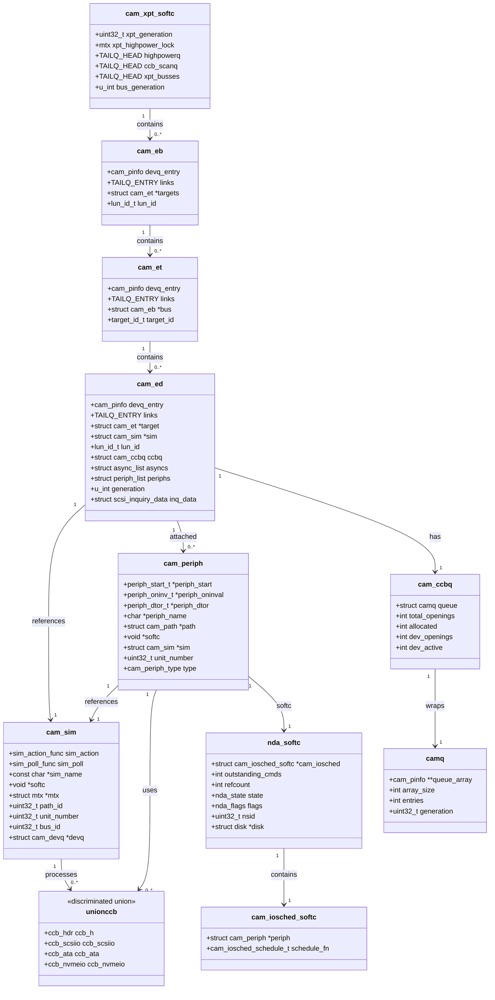

# CAM — Common Access Method Storage Stack
<!-- This file is auto-generated by generate-doc.py -- do not edit manually -->

---
**Navigation:**
  **Related:** [GEOM — Storage Framework](../geom/README.md) | [Device Driver Framework — newbus and devclass](../kern/README_driver.md) | [Interrupt Handling — Threads, Filters, and Dispatch](../kern/README_intr.md)
  **All chapters:** [Source Tree — Layout and Conventions](../../README_internals.md) | [Boot Process — UEFI Bootloader to Kernel Handoff](../../stand/efi/loader/README.md) | [Kernel Core — Structure and Entry Point](../README.md) | [Build System — buildworld and buildkernel](../../share/mk/README.md) | [Virtual Memory Subsystem — vm_page, UMA, and Pagers](../vm/README.md) | [Process Management — Scheduling and Lifecycle](../kern/README_process.md) | [Locking Primitives — Mutexes, sx, rmlocks, and Atomics](../kern/README_locking.md) | [Buffer Cache — Block I/O Subsystem](../vm/README_bcache.md) ...
---


> ⚠ **UNVERIFIED DRAFT** — reviewer did not explicitly approve this draft; fact-check revision failed — paths/structs may be hallucinated. Treat claims as suspect until manually reviewed.


## Quick Summary

The Common Access Method (CAM) is FreeBSD's storage abstraction layer that sits between the GEOM storage framework and the actual host bus adapter (HBA) hardware drivers. CAM provides a uniform interface for diverse storage transports — SCSI, ATA, NVMe, and MMC — allowing the operating system to treat all block devices through a common mechanism. When a userland process reads from `/dev/da0`, the request flows through the virtual file system (VFS), the buffer cache, GEOM providers, and finally into CAM where it is encapsulated in a Command Control Block (CCB) and dispatched through the transport layer to the appropriate HBA driver.

CAM is organized into three principal layers. The **transport layer (XPT)** owns the bus/target/LUN topology and routes CCBs between peripheral drivers and SIMs. It maintains the Existing Device Table (EDT) that tracks all discovered devices and their capabilities. The **SIM (SCSI Interface Module) layer** is what an HBA driver implements — it is the bridge between CAM and hardware, translating CCBs into DMA or other hardware transactions. The **peripheral driver layer** (drivers like `da(4)` for SCSI disks, `ada(4)` for ATA disks, `nda(4)` for NVMe namespaces) attaches to devices discovered by XPT and exposes them as GEOM providers, turning raw device commands into block I/O operations.

The CCB is CAM's central data structure — a discriminated union that can hold SCSI commands (`ccb_scsiio`), ATA commands (`ccb_ata`), NVMe commands (`ccb_nvmeio`), or other transport-specific operations. This design allows the XPT layer to route commands uniformly regardless of the underlying transport. The CCB lifecycle spans allocation from a UMA zone or M_CAMCCB pool, submission through XPT, execution by the SIM and hardware, and final completion via the `xpt_done()` callback. A priority-based queue system (`camq`) ensures commands are scheduled according to their importance, with support for tagged and untagged transaction limits.

CAM also includes an I/O scheduler (`cam_iosched`) that provides per-device queue management and, when enabled, dynamic rate limiting to optimize mixed read/write workloads on SSDs. The scheduler uses exponential moving averages to track latency across buckets and can throttle certain I/O types when latency deteriorates, helping prevent SSD write amplification from degrading read performance. This integration point between CAM and GEOM allows the system to make intelligent scheduling decisions while maintaining compatibility with GEOM-level queueing.

## Architecture

The CAM architecture is defined across several key source files in `sys/cam/`. The transport layer implementation lives in `sys/cam/cam_xpt.c` (148,668 bytes), which contains the core XPT operations including path management, device discovery, and CCB routing. The peripheral driver infrastructure is in `sys/cam/cam_periph.c` (61,452 bytes), while the SIM management code is in `sys/cam/cam_sim.c` (6,411 bytes). Queue management, which implements a heap-based priority queue, is in `sys/cam/cam_queue.c` (9,939 bytes). The I/O scheduler, introduced in FreeBSD 11 and enhanced with dynamic optimization by Netflix, resides in `sys/cam/cam_iosched.c` (62,228 bytes).

The XPT layer maintains three hierarchical data structures for device management. The bus table (`xpt_busses`, a `TAILQ` of `cam_eb` structures) tracks all buses. The target table (`cam_et`) tracks targets on each bus. The device table (`cam_ed`, also called the Existing Device Table or EDT) tracks individual devices at each bus/target/LUN combination. Each `cam_ed` structure contains the device's inquiry data, supported VPD pages, protocol/transport information, and a `cam_ccbq` for pending commands. The generation number mechanism (`devq_entry.generation`) prevents stale CCBs from being processed after device topology changes.

The SIM layer is implemented by HBA drivers and registered with the XPT using `xpt_bus_register()`. Each SIM is represented by a `cam_sim` structure that contains a `sim_action` callback function. When the XPT routes a CCB to a SIM, it invokes this callback. The SIM implementation is responsible for translating the CCB into hardware-specific commands, managing DMA buffers, and calling `xpt_done()` when the operation completes.

Peripheral drivers are registered using the `periphdriver_register()` function and attached to devices discovered by XPT. Each peripheral driver implements a `cam_periph` structure with callbacks like `periph_start()` to initiate I/O and `periph_oninval()` to handle device invalidation. Drivers like `da(4)` in `sys/cam/scsi/scsi_da.c` implement state machines for device probing and feature negotiation before exposing the device as a GEOM provider.

## Key Data Structures

The following structures are fundamental to CAM operation. They are quoted verbatim from the source headers.

```c
/* From sys/cam/cam_xpt_internal.h */
struct cam_ed {
	cam_pinfo	 devq_entry;
	TAILQ_ENTRY(cam_ed) links;
	struct	cam_et	 *target;
	struct	cam_sim  *sim;
	lun_id_t	 lun_id;
	struct	cam_ccbq ccbq;		/* Queue of pending ccbs */
	struct	async_list asyncs;	/* Async callback info for this B/T/L */
	struct	periph_list periphs;	/* All attached devices */
	u_int		 generation;	/* Generation number */
	void		 *quirk;	/* Oddities about this device */
	u_int		 maxtags;
	u_int		 mintags;
	cam_proto	 protocol;
	u_int		 protocol_version;
	cam_xport	 transport;
	u_int		 transport_version;
	struct		 scsi_inquiry_data inq_data;
	uint8_t		 *supported_vpds;
	uint8_t		 supported_vpds_len;
	uint32_t	 device_id_len;
	uint8_t		 *device_id;
	uint8_t		 device_id_len;
};
```

The `cam_ed` structure represents a single device in the EDT. The `devq_entry` field provides queue priority information, while `ccbq` holds pending CCBs for this device. The `periphs` list tracks all peripheral drivers attached to this device, and `generation` prevents race conditions during topology changes.

```c
/* From sys/cam/cam_sim.h */
struct cam_sim {
	sim_action_func		sim_action;
	sim_poll_func		sim_poll;
	const char		*sim_name;
	void			*softc;
	struct mtx		*mtx;
	TAILQ_ENTRY(cam_sim)	links;
	uint32_t		path_id;
	uint32_t		unit_number;
	uint32_t		bus_id;
	int			max_tagged_dev_openings;
	int			max_dev_openings;
	uint32_t		flags;
	struct cam_devq 	*devq;	/* Device Queue to use for this SIM */
	int			refcount;
};
```

The `cam_sim` structure represents a SCSI Interface Module. The `sim_action` callback is invoked by the XPT to process CCBs. The `devq` field points to the device queue that limits concurrent transactions. The `path_id`, `unit_number`, and `bus_id` fields identify the SIM's position in the CAM topology.

```c
/* From sys/cam/cam_periph.h */
struct cam_periph {
	periph_start_t		*periph_start;
	periph_oninv_t		*periph_oninval;
	periph_dtor_t		*periph_dtor;
	char			*periph_name;
	struct cam_path		*path;	/* Compiled path to device */
	void			*softc;
	struct cam_sim		*sim;
	uint32_t		 unit_number;
	cam_periph_type		 type;
	uint32_t		 flags;
#define CAM_PERIPH_RUNNING		0x01
#define CAM_PERIPH_LOCKED		0x02
#define CAM_PERIPH_DEAD			0x04
#define CAM_PERIPH_CLAIMED		0x08
#define CAM_PERIPH_QUIESCED		0x10
	struct periph_priv	 periph_priv;
	struct cam_periph	*next;
	struct cam_periph	*prev;
};
```

The `cam_periph` structure represents a peripheral driver instance. The `periph_start` callback initiates I/O operations. The `path` field contains the compiled CAM path to the device. The `softc` pointer is driver-specific state, and `periph_priv` provides private storage for CCBs.

```c
/* From sys/cam/cam_queue.h */
struct camq {
	cam_pinfo **queue_array;
	int	   array_size;
	int	   entries;
	uint32_t  generation;
	uint32_t  qfrozen_cnt;
};

struct cam_ccbq {
	struct	camq queue;
	struct ccb_hdr_tailq	queue_extra_head;
	int	queue_extra_entries;
	int	total_openings;
	int	allocated;
	int	dev_openings;
	int	dev_active;
};
```

The `camq` structure implements a heap-based priority queue. The `queue_array` holds pointers to `cam_pinfo` structures sorted by priority. The `cam_ccbq` structure wraps the queue with CCB-specific accounting, tracking total openings, allocated slots, and active transactions.

```c
/* From sys/cam/nvme/nvme_da.c */
struct nda_softc {
	struct   cam_iosched_softc *cam_iosched;
	int			outstanding_cmds;
	int			refcount;
	nda_state		state;
	nda_flags		flags;
	nda_quirks		quirks;
	int			unmappedio;
	quad_t			deletes;
	uint32_t		nsid;
	struct disk		*disk;
	struct task		sysctl_task;
	struct sysctl_ctx_list	sysctl_ctx;
	struct sysctl_oid	*sysctl_tree;
	uint64_t		trim_count;
	uint64_t		trim_ranges;
	uint64_t		trim_lbas;
};
```

The `nda_softc` structure is the per-device softc for the NVMe namespace driver. It tracks outstanding commands, references, and GEOM disk state. The `cam_iosched` pointer connects to the I/O scheduler for this device. The `nsid` field holds the NVMe namespace identifier.

## Deep Dive

### The CCB Lifecycle

The CCB (Command Control Block) is the central data structure in CAM. It is defined as a discriminated union in `sys/cam/cam_ccb.h` that can hold transport-specific command structures. The CCB lifecycle begins with allocation from a UMA zone or the `M_CAMCCB` malloc pool. The peripheral driver allocates a CCB using `xpt_alloc_ccb()` and initializes the appropriate transport-specific fields.

```c
/* From sys/cam/cam_ccb.h - CCB flags */
typedef enum {
	CAM_CDB_POINTER		= 0x00000001,/* The CDB field is a pointer    */
	CAM_NEGOTIATE		= 0x00000008,/* Perform transport negotiation */
	CAM_DATA_ISPHYS		= 0x00000010,/* Data type with physical addrs */
	CAM_DIR_IN		= 0x00000040,/* Data direction (DATA IN)      */
	CAM_DIR_OUT		= 0x00000080,/* Data direction (DATA OUT)     */
	CAM_DIR_NONE		= 0x000000C0,/* No data transfer              */
	CAM_DATA_VADDR		= 0x00000000,/* Data type (Virtual)           */
	CAM_DATA_PADDR		= 0x00000010,/* Data type (Physical)          */
	CAM_DATA_SG		= 0x00040000,/* Data type (sglist)            */
	CAM_DATA_BIO		= 0x00200000,/* Data type (bio)               */
	CAM_DEV_QFRZDIS		= 0x00000400,/* Disable DEV Q freezing        */
	CAM_DEV_QFREEZE		= 0x00000800,/* Freeze DEV Q on execution     */
	CAM_TAG_MASK		= 0x00000300,/* Tag type mask                 */
	CAM_PRIORITY_MASK	= 0x00FF0000,/* Priority mask                 */
} ccb_flags;
```

The peripheral driver fills in the CCB with transport-specific command data. For SCSI, this means populating a `ccb_scsiio` with a SCSI CDB. For ATA, a `ccb_ata` with ATA registers. For NVMe, a `ccb_nvmeio` with an NVMe command. The CCB header (`ccb_h`) contains common fields like `ccb_h.flags`, `ccb_h.cbfcnp` (completion callback), and `ccb_h.ppriv_*` (private pointers).

Once populated, the peripheral driver submits the CCB to the XPT using `xpt_action(start_ccb)`. The XPT routes the CCB through the topology by looking up the `cam_path` associated with the peripheral driver. The XPT then calls the SIM's `sim_action` callback with the CCB.

```c
/* From sys/cam/cam_xpt.c - xpt_softc structure */
struct xpt_softc {
	uint32_t		xpt_generation;
	struct mtx		xpt_highpower_lock;
	STAILQ_HEAD(highpowerlist, cam_ed)	highpowerq;
	int			num_highpower;
	TAILQ_HEAD(, ccb_hdr) ccb_scanq;
	int buses_to_config;
	int buses_config_done;
	TAILQ_HEAD(,cam_eb)	xpt_busses;
	u_int			bus_generation;
	int			boot_delay;
	struct callout 		boot_callout;
	struct task		boot_task;
};
```

The SIM implementation processes the CCB by translating it into hardware-specific operations. For example, an AHCI SIM might convert an ATA CCB into a FIS (Frame-based Information Structure) and submit it to the hardware queue. When the hardware completes the operation, the SIM calls `xpt_done(start_ccb)` to signal completion.

```c
/* From sys/cam/cam_sim.h - SIM allocation */
struct cam_sim *  cam_sim_alloc(sim_action_func sim_action,
				sim_poll_func sim_poll,
				const char *sim_name,
				void *softc,
				uint32_t unit,
				struct mtx *mtx,
				int max_dev_transactions,
				int max_tagged_dev_transactions,
				struct cam_devq *queue);
```

The `xpt_done()` callback places the CCB on the XPT's completion queue and invokes the `ccb_h.cbfcnp` callback registered by the peripheral driver. This callback is typically a function like `dastart()` or `adaschedule()` that resumes processing pending I/O.

### The Peripheral Driver Attachment Process

Peripheral drivers like `da(4)` attach to devices discovered by XPT through a registration and probing mechanism. The driver registers its periph driver structure using `PERIPHDRIVER_DECLARE()` in `sys/cam/cam_periph.h`:

```c
#define PERIPHDRIVER_DECLARE(name, driver) \
	static int name ## _modevent(module_t mod, int type, void *data) \
	{ \
		switch (type) { \
		case MOD_LOAD: \
			periphdriver_register(data); \
			break; \
		case MOD_UNLOAD: \
			return (periphdriver_unregister(data)); \
		default: \
			return EOPNOTSUPP; \
		} \
		return 0; \
	} \
	static moduledata_t name ## _mod = { \
		#name, \
		name ## _modevent, \
		(void *)&driver \
	}; \
	DECLARE_MODULE(name, name ## _mod, SI_SUB_DRIVERS, SI_ORDER_ANY); \
	MODULE_DEPEND(name, cam, 1, 1, 1)
```

When XPT discovers a new device, it calls the `periph_ctor()` function of each registered peripheral driver. The constructor checks if the driver should handle the device based on the device's inquiry data or transport type. If so, it allocates a `cam_periph` structure using `cam_periph_alloc()` and initializes the driver's softc.

The peripheral driver then enters a probing state machine to discover device capabilities. For `da(4)`, this involves sending SCSI commands like INQUIRY, READ CAPACITY, and MODE SENSE to determine block size, capacity, and features. The probing state machine is implemented in `dastart()` in `sys/cam/scsi/scsi_da.c`:

```c
/* From sys/cam/scsi/scsi_da.c - Probe states */
typedef enum {
	DA_STATE_PROBE_WP,
	DA_STATE_PROBE_RC,
	DA_STATE_PROBE_RC16,
	DA_STATE_PROBE_CACHE,
	DA_STATE_PROBE_LBP,
	DA_STATE_PROBE_BLK_LIMITS,
	DA_STATE_PROBE_BDC,
	DA_STATE_PROBE_ATA,
	DA_STATE_PROBE_ATA_LOGDIR,
	DA_STATE_PROBE_ATA_IDDIR,
	DA_STATE_PROBE_ATA_SUP,
	DA_STATE_PROBE_ATA_ZONE,
	DA_STATE_PROBE_ZONE,
	DA_STATE_NORMAL
} da_state;
```

After probing completes, the peripheral driver exposes the device as a GEOM provider. The `da(4)` driver creates a GEOM disk provider using `gnt_md_provider()` and registers it with the GEOM framework. The disk structure is stored in `da_softc.disk` and includes geometry information like sector size and size in sectors.

### The I/O Scheduler Integration

The `cam_iosched` subsystem provides per-device I/O scheduling and rate limiting. It is initialized by peripheral drivers using `cam_iosched_init()` from `sys/cam/cam_iosched.h`:

```c
int cam_iosched_init(struct cam_iosched_softc **, struct cam_periph *periph,
    const struct disk *dp, cam_iosched_schedule_t schedfnp);
void cam_iosched_fini(struct cam_iosched_softc *);
void cam_iosched_queue_work(struct cam_iosched_softc *isc, struct bio *bp);
void cam_iosched_schedule(struct cam_iosched_softc *isc, struct cam_periph *periph);
```

The I/O scheduler receives BIO requests from GEOM and queues them for processing. When the peripheral driver needs to issue a command, it calls `cam_iosched_next_bio()` to retrieve the next BIO from the scheduler's queue. The scheduler uses exponential moving averages to track latency and can throttle I/O when performance degrades.

The scheduler integrates with GEOM-level queueing by providing a scheduling function (`schedfnp`) that is called when the device becomes available. This function, typically `dastart()` for SCSI disks, is responsible for initiating I/O on the device. The scheduler determines when to call this function based on queue depth and latency targets.

```c
/* From sys/cam/cam_iosched.h */
static inline uintptr_t
cam_iosched_now(void)
{
	return (uintptr_t)((uint64_t)sbinuptime() >> CAM_IOSCHED_TIME_SHIFT);
}

static inline uintptr_t
cam_iosched_delta_t(uintptr_t then)
{
	return (cam_iosched_now() - then);
}

static inline sbintime_t
cam_iosched_sbintime_t(uintptr_t delta)
{
	return (sbintime_t)((uint64_t)delta << CAM_IOSCHED_TIME_SHIFT);
}
```

The time tracking functions use `sbinuptime()` to get high-resolution timestamps. On 64-bit platforms, timestamps are stored directly. On 32-bit platforms, a fixed-point representation is used with 24 bits of fraction and 8 bits of seconds.

## Flow / Diagram



The diagram shows the hierarchical relationships between CAM structures. The `xpt_softc` contains the bus list, which contains target lists, which contain device entries. Each device entry references a SIM and has attached peripheral drivers. The `cam_ccbq` wraps a `camq` priority queue for pending CCBs. Peripheral drivers use `union ccb` structures to communicate with SIMs.

## Advanced Notes

### Debugging with DTrace

CAM provides SDT (System Dynamics Tracing) probes for debugging. The `cam_xpt.c` file defines probes for CCB submission, completion, and routing. These probes can be used to trace I/O paths and identify performance bottlenecks.

```c
/* SDT probes in sys/cam/cam_xpt.c */
SDT_PROVIDER_DECLARE(cam_xpt);
SDT_PROBE0(cam_xpt, submit, , start);
SDT_PROBE0(cam_xpt, complete, , done);
SDT_PROBE1(cam_xpt, route, , path_id);
```

DTrace scripts can attach to these probes to trace I/O flows. For example, a script can track CCB submission and completion times to measure device latency:

```d
cam_xpt:::start {
    @start[args[0]->ccb_h.path->path_id] = timestamp;
}

cam_xpt:::done {
    @latency[args[0]->ccb_h.path->path_id] = timestamp - @start[args[0]->ccb_h.path->path_id];
    delete @start[args[0]->ccb_h.path->path_id];
}
```

### Performance Implications

The CAM queue system uses a heap-based priority queue (`camq`) that provides O(log n) insertion and removal. This ensures that high-priority commands (like reads or flushes) are processed before lower-priority commands (like writes or background operations). The priority levels are defined in `sys/cam/cam.h`:

```c
typedef enum {
    CAM_RL_HOST,
    CAM_RL_BUS,
    CAM_RL_XPT,
    CAM_RL_DEV,
    CAM_RL_NORMAL,
    CAM_RL_VALUES
} cam_rl;
```

The generation number mechanism prevents race conditions when device topology changes. When a device is removed or replaced, the XPT increments the generation number. CCBs with stale generation numbers are rejected, preventing use-after-free bugs.

The `cam_iosched` subsystem provides dynamic rate limiting based on latency measurements. When latency exceeds a threshold, the scheduler reduces the queue depth for certain I/O types. This prevents write-heavy workloads from degrading read performance on SSDs. The scheduler uses exponential moving averages to track latency across different I/O types and adjusts the queue depth accordingly.

### Race Conditions and Pitfalls

One common pitfall in CAM driver development is failing to handle device invalidation properly. When a device is removed, the XPT calls `periph_oninval()` on all attached peripheral drivers. Drivers must release all references to the device and cancel any pending I/O. Failure to do so can result in use-after-free bugs when the SIM or device structures are freed.

Another pitfall is improper handling of the CAM path reference counting. Peripheral drivers must call `xpt_path_release()` when they no longer need the path. The path holds references to the bus, target, and device structures, and premature release can cause use-after-free bugs.

The CCB completion callback (`ccb_h.cbfcnp`) is called from interrupt context in some cases. Drivers must ensure that this callback does not perform blocking operations or acquire locks that might cause deadlocks. The callback should typically just schedule a task or signal a condition variable to process the completion in process context.

### Connection to OS Theory

CAM implements the device driver model described in operating system textbooks like "Operating Systems: Three Easy Pieces" by Arpaci-Dusseau. The XPT layer corresponds to the device driver framework that provides a uniform interface to diverse hardware. The SIM layer implements the hardware-specific translation described in the device driver chapter.

The CCB mechanism implements the command queueing pattern described in storage system textbooks. Commands are encapsulated in a common structure, queued for processing, and completed asynchronously. This pattern is similar to the request queue in Linux's block layer and the I/O request queue in macOS/XNU.

The generation number mechanism implements the versioning pattern used in distributed systems to handle stale data. When the topology changes, the version number is incremented, and operations with stale versions are rejected. This pattern is used in database systems and distributed file systems to handle concurrent updates.

## Comparison

Linux implements storage I/O through the block layer and SCSI mid-layer. The Linux block layer uses `struct request` and `struct bio` for I/O requests, similar to FreeBSD's CCB and BIO structures. However, Linux's block layer is more tightly integrated with the device mapper and multipathing subsystems. FreeBSD's GEOM framework provides similar functionality but is more modular and allows userspace tools to manipulate storage configurations.

Linux's SCSI mid-layer corresponds to FreeBSD's CAM XPT layer. Both provide a uniform interface to diverse SCSI transports. However, Linux's SCSI mid-layer is more tightly coupled with the SCSI protocol implementation, while FreeBSD's CAM separates the transport layer from the protocol implementation. This allows FreeBSD to support non-SCSI transports like ATA and NVMe through the same framework.

macOS/XNU implements storage I/O through the I/O Kit framework. The I/O Kit provides a device driver framework similar to FreeBSD's newbus, but uses a different object model based on C++ classes. macOS's storage stack uses the I/O Storage Kit, which provides a hierarchy of storage providers similar to FreeBSD's GEOM framework. However, macOS's approach is more tightly integrated with the I/O Kit's power management and security frameworks.

NetBSD implements storage I/O through the CAM subsystem, which is similar to FreeBSD's CAM but with some differences in the API and data structures. NetBSD's CAM is less mature than FreeBSD's and lacks some features like the I/O scheduler. OpenBSD's storage stack is similar to FreeBSD's but has fewer transport drivers and less active development.

## See Also
- [GEOM — Storage Framework](../../../sys/geom/README.md)
- [Device Driver Framework — newbus and devclass](../../../sys/kern/README_driver.md)
- [Interrupt Handling — Threads, Filters, and Dispatch](../../../sys/kern/README_intr.md)

- [GEOM — Storage Framework](../../../sys/geom/README.md)
- [Device Driver Framework — newbus and devclass](../../../sys/kern/README_driver.md)
- [Interrupt Handling — Threads, Filters, and Dispatch](../../../sys/kern/README_intr.md)


- [GEOM — Storage Framework](../geom/README.md) — The GEOM storage framework that provides virtual storage providers
- [Device Driver Framework — newbus and devclass](../kern/README_driver.md) — The newbus device driver framework
- [Interrupt Handling — Threads, Filters, and Dispatch](../kern/README_intr.md) — Interrupt handling in FreeBSD
- [Buffer Cache — Block I/O Subsystem](../vm/README_bcache.md) — The buffer cache and block I/O subsystem
- [sys/cam/](../../sys/cam/) — CAM source code directory
- [sys/cam/scsi/](../../sys/cam/scsi/) — SCSI transport and peripheral drivers
- [sys/cam/ata/](../../sys/cam/ata/) — ATA transport and peripheral drivers
- [sys/cam/nvme/](../../sys/cam/nvme/) — NVMe transport and peripheral drivers

---

> _Generated by [DaemonDocs](https://github.com/ocochard/DaemonDocs) on 2026-04-29 23:44 UTC using model `Qwen3.6-35B-A3B-UD-Q4_K_XL` (llama.cpp build `b8973-3142f1dbb`). AI-generated content — verify against source before relying on it._
