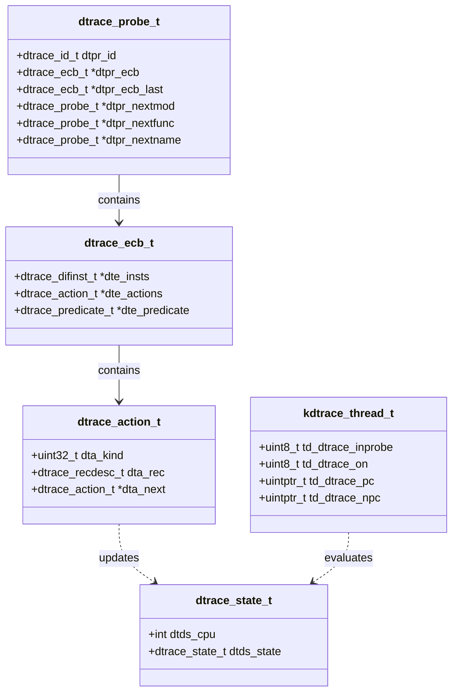

# DTrace — Dynamic Tracing Framework
<!-- This file is auto-generated by generate-doc.py -- do not edit manually -->

---
**Navigation:**
  **Up:** [Kernel Core — Structure and Entry Point](../../../README.md) ▸ [Source Tree — Layout and Conventions](../../../../README_internals.md)
  **Related:** [Kernel Core — Structure and Entry Point](../../../README.md) | [Process Management — Scheduling and Lifecycle](../../../kern/README_process.md) | [Locking Primitives — Mutexes, sx, rmlocks, and Atomics](../../../kern/README_locking.md)
  **All chapters:** [Source Tree — Layout and Conventions](../../../../README_internals.md) | [Boot Process — UEFI Bootloader to Kernel Handoff](../../../../stand/efi/loader/README.md) | [Kernel Core — Structure and Entry Point](../../../README.md) | [Build System — buildworld and buildkernel](../../../../share/mk/README.md) | [Virtual Memory Subsystem — vm_page, UMA, and Pagers](../../../vm/README.md) | [Process Management — Scheduling and Lifecycle](../../../kern/README_process.md) | [Locking Primitives — Mutexes, sx, rmlocks, and Atomics](../../../kern/README_locking.md) | [Buffer Cache — Block I/O Subsystem](../../../vm/README_bcache.md) ...
---


> ⚠ **UNVERIFIED DRAFT** — reviewer did not explicitly approve this draft. Treat claims as suspect until manually reviewed.


## Quick Summary
DTrace is a dynamic tracing framework that enables system administrators and developers to observe the behavior of a running FreeBSD system without stopping execution or modifying source code. Originally developed by Sun Microsystems and inherited by FreeBSD under the Common Development and Distribution License (CDDL), DTrace allows runtime instrumentation of both kernel and userland components. Unlike traditional debugging approaches that require recompiling software or inserting permanent `printf` calls, DTrace attaches probes to virtually any event point, collects data, and even modifies execution behavior with minimal performance impact.

The framework operates through a clear separation of concerns: providers register probes at specific event points, a DIF (DTrace Intermediate Format) interpreter executes user-supplied tracing logic in-kernel, and the userspace [`dtrace(1)`](../../../../cddl/contrib/opensolaris/cmd/dtrace/dtrace.1) command parses D scripts, compiles them into DIF bytecode, and retrieves results. Probes that are not actively enabled carry essentially zero overhead because the kernel skips over them entirely. This design allows pervasive instrumentation to be enabled at any event point without imposing a performance penalty in production, making DTrace viable in environments where even small overhead is unacceptable.

FreeBSD's implementation organizes tracing logic around Enabling Control Blocks (ECBs) and aggregations. When a probe fires, the framework evaluates a predicate, executes a sequence of bounded DIF instructions, and routes the output to either a buffer for userspace consumption or an in-kernel aggregation. Aggregations compute summary statistics like sums, counts, averages, and histograms directly in the kernel. In-kernel aggregation was chosen over per-event userspace delivery to reduce context-switch overhead and handle high-frequency probes without overwhelming userspace with individual events.

## Architecture
The DTrace architecture in FreeBSD is built around four interacting components distributed across `sys/cddl/`. Providers are kernel modules that create probes at specific events. Each provider registers with the framework by creating probe entries that are indexed into hash tables for rapid lookup by module, function, or name. Core providers include `fbt` (function boundary tracing), which instruments kernel function entry and return; `syscall`, which fires on every system call transition; `profile`, which generates periodic interrupts for CPU profiling; `proc`, which traces process lifecycle events; `sdt` (Static DTrace), which uses `SDT_PROBE()` macros embedded directly in kernel code; and `fasttrap`, which instruments userland processes.

Provider registration and framework initialization occur in `sys/cddl/dev/dtrace/dtrace_load.c`. The `dtrace_load()` function initializes core mutexes (`dtrace_lock`, `dtrace_provider_lock`, `dtrace_meta_lock`), creates hash tables for probe indexing (`dtrace_bymod`, `dtrace_byfunc`, `dtrace_byname`), and registers event handlers for KLD load/unload events to dynamically update probe availability. The framework maintains a linked list of providers (`dtrace_provider`), accessible via the `sysctl_dtrace_providers` sysctl in `sys/cddl/dev/dtrace/dtrace_sysctl.c`.

The DIF interpreter, implemented in `sys/cddl/contrib/opensolaris/uts/common/dtrace/dtrace.c`, executes user-supplied D code as bytecode. The [`dtrace(1)`](../../../../cddl/contrib/opensolaris/cmd/dtrace/dtrace.1) command parses D scripts, validates them against a DOF (DTrace Object Format) specification, and uses the `DTRACEHIOC_ADDDOF` ioctl to load the compiled bytecode into the kernel. The kernel's `dtrace_ioctl_helper()` function in `sys/cddl/dev/dtrace/dtrace_ioctl.c` handles the ioctl, copying the DOF payload into kernel space and linking it to the caller's execution context.

The `fasttrap` provider, defined in `sys/cddl/contrib/opensolaris/uts/common/dtrace/fasttrap.c`, allows tracing of any userland instruction. It replaces target instructions with trap instructions, saving the original instruction in a per-process hash table. When the trapped instruction executes, the kernel's trap handler (`fasttrap_sigtrap()`) emulates the instruction, fires the DTrace probes, and resumes execution. This mechanism enables precise instrumentation of userland entry/return points and arbitrary instruction offsets without requiring recompilation of user applications.

## Key Data Structures
The DTrace framework relies on several critical data structures to manage probes, states, and aggregations.

```c
# From sys/cddl/dev/dtrace/dtrace_cddl.h
typedef struct kdtrace_thread {
	uint8_t		td_dtrace_stop;
	uint8_t		td_dtrace_sig;
	uint8_t		td_dtrace_inprobe;
	u_int		td_predcache;
	uint64_t	td_dtrace_vtime;
	uint64_t	td_dtrace_start;

	union __tdu {
		struct __tds {
			uint8_t		_td_dtrace_on;
			uint8_t		_td_dtrace_step;
			uint8_t		_td_dtrace_ret;
			uint8_t		_td_dtrace_ast;
		} _tds;
		u_long	_td_dtrace_ft;
	} _tdu;

	uintptr_t	td_dtrace_pc;
	uintptr_t	td_dtrace_npc;
	/* ... additional fields ... */
} kdtrace_thread_t;
```
The `kdtrace_thread_t` structure is a FreeBSD-specific extension to `struct thread`, providing thread-local DTrace context. The nested `__tds` structure within the `__tdu` union holds per-thread DTrace state flags, allowing the framework to track which DTrace states are active for a given thread. This is essential for efficiently determining whether a probe should fire without scanning a global list of every active consumer.

```c
# From sys/cddl/dev/dtrace/dtrace_debug.c
struct dtrace_debug_data {
	/* Debug output buffer and state */
};
```
The `dtrace_debug_data` structure manages the internal debug output mechanism, used by functions like `dtrace_debug_printf()` and `dtrace_debug_vprintf()` to emit diagnostic messages during probe execution or framework initialization. This is particularly useful for troubleshooting D scripts that fail to compile or execute correctly.

The core probe management relies on hash tables created during `dtrace_load()`. These tables map module names, function names, and probe names to `dtrace_probe_t` structures, enabling O(1) lookup when a provider fires an event. The `dtrace_state_cache` is a kernel memory cache (`kmem_cache_create()`) that allocates per-CPU state structures for each active DTrace consumer. This per-CPU design minimizes lock contention when multiple CPUs evaluate DIF instructions simultaneously.

Aggregations are managed through internal state tracked within `dtrace_state_t` structures. The `dtrace_aggid2agg()` function in `dtrace_ioctl.c` resolves aggregation IDs to their kernel structures during ioctl calls like `DTRACEIOC_AGGDESC`, allowing userspace to query aggregation metadata.

## Deep Dive
The lifecycle of a DTrace probe begins with provider registration and ends with userspace consumption. When the DTrace module loads, `dtrace_load()` in `sys/cddl/dev/dtrace/dtrace_load.c` sets up the foundational infrastructure. It registers the `dtrace_trap_func` hook to intercept traps (used by `fasttrap` and `fbt`), and the `dtrace_vtime_switch_func` hook to track virtual time during thread switches. It also creates a taskq (`dtrace_taskq`) for deferred work, such as cleaning up inactive probes or flushing aggregated data.

```c
# From sys/cddl/dev/dtrace/dtrace_load.c
static void
dtrace_load(void *dummy)
{
	/* ... initialization ... */
	mutex_init(&dtrace_lock,"dtrace probe state", MUTEX_DEFAULT, NULL);
	mutex_init(&dtrace_provider_lock,"dtrace provider state", MUTEX_DEFAULT, NULL);
	mutex_init(&dtrace_meta_lock,"dtrace meta-provider state", MUTEX_DEFAULT, NULL);

	dtrace_state_cache = kmem_cache_create("dtrace_state_cache",
	    sizeof (dtrace_dstate_percpu_t) * (mp_maxid + 1),
	    DTRACE_STATE_ALIGN, NULL, NULL, NULL, NULL, NULL, 0);

	dtrace_bymod = dtrace_hash_create(offsetof(dtrace_probe_t, dtpr_mod),
	    offsetof(dtrace_probe_t, dtpr_nextmod),
	    offsetof(dtrace_probe_t, dtpr_prevmod));
	/* ... more hash tables ... */
}
```
The use of `kmem_cache_create()` for `dtrace_state_cache` ensures that per-CPU state structures are allocated efficiently, with alignment optimized for cache lines. The hash tables (`dtrace_bymod`, `dtrace_byfunc`, `dtrace_byname`) are initialized with offsets to the probe's name fields, allowing the framework to quickly find probes by any of these attributes when a provider fires.

When a user runs a D script, [`dtrace(1)`](../../../../cddl/contrib/opensolaris/cmd/dtrace/dtrace.1) compiles it into DOF bytecode. The kernel receives this via `DTRACEHIOC_ADDDOF` ioctl, handled by `dtrace_ioctl_helper()` in `sys/cddl/dev/dtrace/dtrace_ioctl.c`. The function calls `dtrace_dof_copyin()` to safely copy the DOF payload from userspace, then `dtrace_helper_slurp()` to parse and link the probes to the caller's execution context. This separation ensures that kernel memory is not directly mapped from untrusted userspace.

The DIF interpreter executes bytecode in a bounded manner. Each DIF instruction has a fixed execution cost, and the interpreter enforces a maximum instruction count to prevent infinite loops. When a probe fires, the interpreter evaluates predicates first; if a predicate is false, the DIF bytecode is skipped entirely. If true, the interpreter executes the DIF instructions, which may update variables, write to buffers, or invoke aggregations.

The `fbt` provider instruments kernel functions by replacing target instructions with trap instructions. When a function is enabled for tracing, `fbt_enable()` in `sys/cddl/dev/fbt/fbt.c` creates `fbt_probe_t` structures for each trace point and patches the target instruction with a trap. When the instrumented instruction executes, the CPU raises a trap, transferring control to `fbt_invop()`, which looks up the original instruction, fires the associated DTrace probes, and resumes execution. This mechanism allows fbt to instrument function entry and return points at arbitrary addresses without requiring recompilation of the kernel.

The connection between probes and actions is mediated by ECBs. Each `dtrace_probe_t` structure contains `dtpr_ecb` and `dtpr_ecb_last` pointers that link to a linked list of `dtrace_ecb_t` structures. When a probe fires, the framework iterates over its ECB list, evaluating each ECB's predicate and executing its DIF instructions. Each ECB in turn contains pointers to its associated `dtrace_action_t` structures, which define the output behavior (buffer writes, variable updates, aggregation updates). This hierarchical structure—probe containing ECBs containing actions—allows a single probe to trigger multiple independent actions, each with its own DIF instruction sequence and output destination.

For userland tracing, `fasttrap` replaces target instructions with trap instructions. When a trapped instruction executes, the CPU raises a trap, transferring control to the kernel. `fasttrap_sigtrap()` intercepts this trap, looks up the original instruction in the per-process hash table, emulates it, and fires any associated DTrace probes. This mechanism allows precise instrumentation of userland code without modifying the application's binary.

## Flow / Diagram
The following Mermaid class diagram illustrates the key data structures and their relationships in the DTrace framework.



## Advanced Notes
DTrace's safety in production environments stems from its bounded execution model and zero-overhead inactive probes. The DIF interpreter does not allow unbounded loops; all control flow is resolved at compile time, and the interpreter enforces a maximum instruction count. This prevents a misbehaving D script from hanging the kernel. Additionally, inactive probes are skipped entirely, meaning the kernel pays no performance penalty for having probes registered but not enabled.

When debugging DTrace scripts, the `dtrace_debug_printf()` and related functions in `dtrace_debug.c` can be used to emit diagnostic messages. These are particularly useful when a script fails to compile or when probes do not fire as expected. The `dtrace_debug_data` structure manages the output buffer, ensuring that debug messages do not interfere with normal probe execution.

Performance tuning for DTrace involves understanding the cost of aggregations versus per-event delivery. Aggregations are efficient for high-frequency probes because they batch data in-kernel, reducing context-switch overhead. However, large aggregations can consume significant kernel memory. The `dtrace_retain_max` sysctl controls the maximum number of retained DTrace states, preventing a single consumer from exhausting kernel memory.

Common pitfalls include forgetting that DTrace probes fire in interrupt context for some providers (like `profile`), which restricts the available functions and data structures. Another pitfall is assuming that `fbt` probes can be enabled on every kernel function without performance impact; while the probes themselves have zero overhead when disabled, enabling them on high-frequency functions like `cpu_idle` or `sched_switch` can introduce significant overhead due to the trap instruction replacement and context switching.

The `fasttrap` provider's use of trap instructions means that tracing userland code can interfere with debugging tools like `gdb` if both attempt to control the same process. Additionally, `fasttrap` must carefully handle instruction emulation for branches and jumps, which can be complex on certain architectures. The `fasttrap_sigtrap()` function in `fasttrap.c` contains architecture-specific code to handle these cases, ensuring that the emulated instruction executes correctly before resuming userland execution.

## See Also
- [Kernel Core — Structure and Entry Point](../../../README.md)
- [Process Management — Scheduling and Lifecycle](../../../kern/README_process.md)
- [Locking Primitives — Mutexes, sx, rmlocks, and Atomics](../../../kern/README_locking.md)


- [`sys/cddl/dev/dtrace/dtrace_load.c`](dtrace_load.c) — Framework initialization and provider registration
- [`sys/cddl/dev/dtrace/dtrace_ioctl.c`](dtrace_ioctl.c) — Userspace-kernel interface for DOF loading and aggregation management
- [`sys/cddl/contrib/opensolaris/uts/common/dtrace/fasttrap.c`](../../contrib/opensolaris/uts/common/dtrace/fasttrap.c) — Userland trap-based tracing implementation
- [`sys/cddl/contrib/opensolaris/uts/common/dtrace/dtrace.c`](../../contrib/opensolaris/uts/common/dtrace/dtrace.c) — Core DTrace framework and DIF interpreter
- [`sys/cddl/dev/dtrace/dtrace_cddl.h`](dtrace_cddl.h) — Thread-local DTrace state structures
- [`sys/cddl/dev/dtrace/dtrace_debug.c`](dtrace_debug.c) — Internal debug output mechanisms
- [`cddl/contrib/opensolaris/cmd/dtrace/dtrace.1`](../../../../cddl/contrib/opensolaris/cmd/dtrace/dtrace.1) — Userspace [`dtrace(1)`](../../../../cddl/contrib/opensolaris/cmd/dtrace/dtrace.1) command documentation

---

> _Generated by [DaemonDocs](https://github.com/ocochard/DaemonDocs) on 2026-05-04 01:07 UTC using model `Qwen3.6-35B-A3B-UD-Q8_K_XL` (llama.cpp build `b8985-27aef3dd9`). AI-generated content — verify against source before relying on it._
