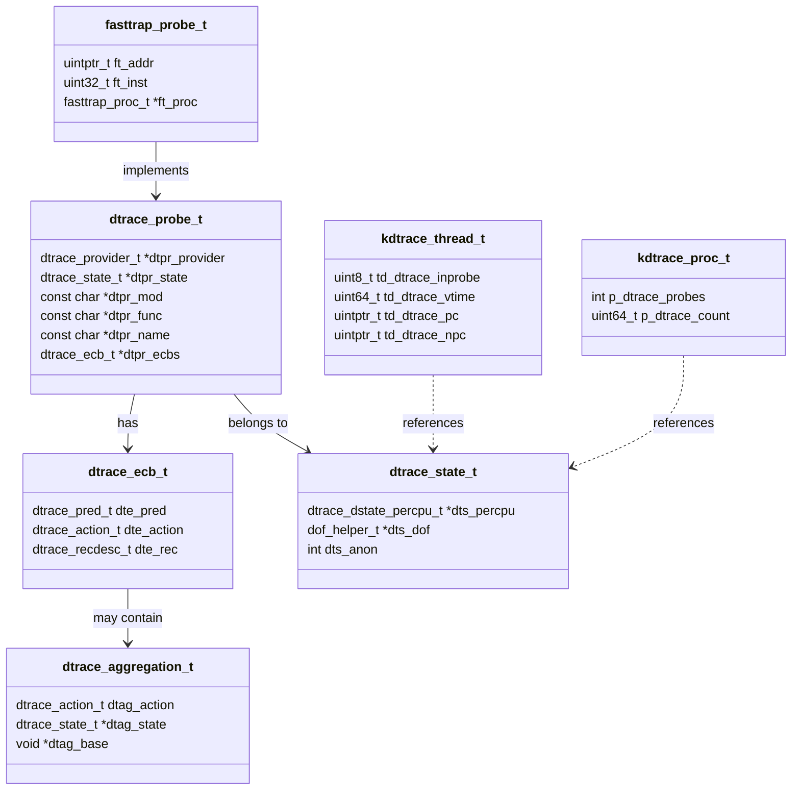

# DTrace — Dynamic Tracing Framework
<!-- This file is auto-generated by generate-doc.py -- do not edit manually -->

---
**Navigation:**
  **Up:** [Kernel Core — Structure and Entry Point](../../../README.md) ▸ [Source Tree — Layout and Conventions](../../../../README_internals.md)
  **Related:** [Kernel Core — Structure and Entry Point](../../../README.md) | [Process Management — Scheduling and Lifecycle](../../../kern/README_process.md) | [Locking Primitives — Mutexes, sx, rmlocks, and Atomics](../../../kern/README_locking.md)
  **All chapters:** [Source Tree — Layout and Conventions](../../../../README_internals.md) | [Boot Process — UEFI Bootloader to Kernel Handoff](../../../../stand/efi/loader/README.md) | [Kernel Core — Structure and Entry Point](../../../README.md) | [Build System — buildworld and buildkernel](../../../../share/mk/README.md) | [Virtual Memory Subsystem — vm_page, UMA, and Pagers](../../../vm/README.md) | [Process Management — Scheduling and Lifecycle](../../../kern/README_process.md) | [Locking Primitives — Mutexes, sx, rmlocks, and Atomics](../../../kern/README_locking.md) | [Buffer Cache — Block I/O Subsystem](../../../vm/README_bcache.md) ...
---


> ⚠ **UNVERIFIED DRAFT** — reviewer did not explicitly approve this draft. Treat claims as suspect until manually reviewed.


## Quick Summary
DTrace is a dynamic tracing framework that enables system administrators and developers to observe the behavior of a running FreeBSD system without stopping execution or modifying source code. Originally developed by Sun Microsystems and inherited by FreeBSD under the Common Development and Distribution License (CDDL), DTrace allows runtime instrumentation of both kernel and userland components. Unlike traditional debugging approaches that require recompiling software or inserting permanent `printf` calls, DTrace attaches probes to virtually any event point, collects data, and even modifies execution behavior with minimal performance impact.

The framework operates through a clear separation of concerns: providers register probes at specific event points, a DIF (DTrace Intermediate Format) interpreter executes user-supplied tracing logic in-kernel, and the userspace `dtrace(1)` command parses D scripts, compiles them into DIF bytecode, and retrieves results. Probes that are not actively enabled carry essentially zero overhead because the kernel skips over them entirely. This design allows pervasive instrumentation to be enabled at any event point without imposing a performance penalty in production, making DTrace viable in environments where even small overhead is unacceptable.

FreeBSD's implementation organizes tracing logic around Enabling Control Blocks (ECBs) and aggregations. When a probe fires, the framework evaluates a predicate, executes a sequence of bounded DIF instructions, and routes the output to either a buffer for userspace consumption or an in-kernel aggregation. Aggregations compute summary statistics like sums, counts, averages, and histograms directly in the kernel. In-kernel aggregation was chosen over per-event userspace delivery to reduce context-switch overhead and handle high-frequency probes without overwhelming userspace with individual events.

## Architecture
The DTrace architecture in FreeBSD is built around four interacting components distributed across `sys/cddl/`. Providers are kernel modules that create probes at specific events. Each provider registers with the framework by creating probe entries that are indexed into hash tables for rapid lookup by module, function, or name. Core providers include `fbt` (function boundary tracing), which instruments kernel function entry and return by temporarily replacing target instructions with trap instructions; `syscall`, which fires on every system call transition; `profile`, which generates periodic interrupts for CPU profiling; `proc`, which traces process lifecycle events; `sdt` (Static DTrace), which uses `SDT_PROBE()` macros embedded directly in kernel code; and `fasttrap`, which instruments userland processes.

Provider registration and framework initialization occur in `sys/cddl/dev/dtrace/dtrace_load.c`. The `dtrace_load()` function initializes core mutexes (`dtrace_lock`, `dtrace_provider_lock`, `dtrace_meta_lock`), creates hash tables for probe indexing (`dtrace_bymod`, `dtrace_byfunc`, `dtrace_byname`), and registers event handlers for KLD load/unload events to dynamically update probe availability. The framework maintains a linked list of providers (`dtrace_provider`), accessible via the `sysctl_dtrace_providers` sysctl in `sys/cddl/dev/dtrace/dtrace_sysctl.c`.

The DIF interpreter, implemented in `sys/cddl/contrib/opensolaris/uts/common/dtrace/dtrace.c`, executes user-supplied D code as bytecode. The `dtrace(1)` command parses D scripts, validates them against a DOF (DTrace Object Format) schema, and sends the compiled bytecode to the kernel via `/dev/dtrace/interpreter`. The interpreter runs a stack-based virtual machine that supports register allocation, memory access, arithmetic, and control flow, but deliberately excludes unbounded loops and recursive calls. This restriction prevents untrusted user scripts from causing kernel panics through infinite loops or stack overflow, maintaining real-time determinism in production environments. When a probe fires, the framework iterates through the probe's ECB list, evaluates predicates, and executes the associated DIF actions.

ECBs connect probes to actions. Each enabled probe has a list of ECBs (enabling control blocks), each of which contains a predicate and a sequence of DIF actions. The predicate determines whether the actions should execute, and the actions compute values that are stored in buffers or aggregations. Aggregations use hash tables to accumulate statistics keyed by arbitrary dimensions, enabling rich summarization without per-event userspace traffic.

The `fasttrap` provider in `sys/cddl/contrib/opensolaris/uts/common/dtrace/fasttrap.c` provides userland tracing. It replaces user-level instructions with trap instructions, saves the original instructions in a hash table keyed by process ID and program counter, and on trap entry executes the saved instruction in scratch space before resuming normal execution. This mechanism allows tracing of any userland function entry, return, or offset without recompilation.

## Key Data Structures
The FreeBSD DTrace implementation uses several key data structures defined across the source tree.

**`kdtrace_thread_t`** (defined in `sys/cddl/dev/dtrace/dtrace_cddl.h`):
```c
typedef struct kdtrace_thread {
    uint8_t     td_dtrace_stop;     /* Indicates a DTrace-desired stop */
    uint8_t     td_dtrace_sig;      /* Signal sent via DTrace's raise() */
    uint8_t     td_dtrace_inprobe;  /* Are we in a probe? */
    u_int       td_predcache;       /* DTrace predicate cache */
    uint64_t    td_dtrace_vtime;    /* DTrace virtual time */
    uint64_t    td_dtrace_start;    /* DTrace slice start time */
    uintptr_t   td_dtrace_pc;       /* DTrace saved pc from fasttrap */
    uintptr_t   td_dtrace_npc;      /* DTrace next pc from fasttrap */
    uintptr_t   td_dtrace_scrpc;    /* DTrace per-thread scratch location */
    uintptr_t   td_dtrace_astpc;    /* DTrace return sequence location */
    struct trapframe *td_dtrace_trapframe; /* Trap frame from invop */
} kdtrace_thread_t;
```
This structure extends the FreeBSD `struct thread` with DTrace-specific state. The `td_dtrace_vtime` field tracks virtual time for profiling, `td_dtrace_start` tracks the slice start time, and `td_dtrace_pc` and `td_dtrace_npc` store the program counter before and after trap execution for fasttrap probes. Embedded within this structure is a union containing `struct __tds` which holds per-thread DTrace state flags (`_td_dtrace_on` for fasttrap tracepoints, `_td_dtrace_step` for kernel return, `_td_dtrace_ret` for return probes, and `_td_dtrace_ast` for saved AST flags).

**`kdtrace_proc_t`** (defined in `sys/cddl/dev/dtrace/dtrace_cddl.h`):
```c
typedef struct kdtrace_proc {
    int         p_dtrace_probes;    /* Are there probes for this proc? */
    uint64_t    p_dtrace_count;     /* Number of DTrace tracepoints */
    void        *p_dtrace_helpers;  /* DTrace helpers, if any */
    int         p_dtrace_model;
    uint64_t    p_fasttrap_tp_gen;  /* Tracepoint hash table gen */
} kdtrace_proc_t;
```
This structure extends `struct proc` with DTrace metadata, tracking whether probes exist for the process and the generation counter for the fasttrap tracepoint hash table.

**`struct dtrace_debug_data`** (defined in `sys/cddl/dev/dtrace/dtrace_debug.c`):
```c
struct dtrace_debug_data {
    uintptr_t lock __aligned(CACHE_LINE_SIZE);
    char bufr[DTRACE_DEBUG_BUFR_SIZE];
    char *first;
    char *last;
    char *next;
} dtrace_debug_data[MAXCPU];
```
This per-CPU structure provides a circular buffer for DTrace debug output. The lock field is aligned to cache line size to avoid false sharing between CPUs.

## Deep Dive
The DTrace framework initializes in `sys/cddl/dev/dtrace/dtrace_load.c`. The `dtrace_load()` function performs the following steps:

1. **Initialize mutexes**: Three core mutexes are created — `dtrace_lock` for probe state, `dtrace_provider_lock` for provider state, and `dtrace_meta_lock` for meta-provider state. These are initialized without witness debugging to avoid malloc-related panics in low-memory situations.

2. **Create hash tables**: Three hash tables index probes for rapid lookup:
   - `dtrace_bymod`: indexed by module name
   - `dtrace_byfunc`: indexed by function name
   - `dtrace_byname`: indexed by probe name

3. **Register KLD hooks**: Event handlers for `kld_load` and `kld_unload_try` events ensure providers are available when modules load and removed when they unload.

4. **Set up CPU-specific state**: The `dtrace_ap_start()` function (registered via `SYSINIT(dtrace_ap_start, SI_SUB_SMP, SI_ORDER_ANY, dtrace_ap_start, NULL)`) sets up DTrace on all APs after SMP initialization, calling `dtrace_cpu_setup(CPU_CONFIG, i)` for each non-bootstrap CPU.

The DIF interpreter in `sys/cddl/contrib/opensolaris/uts/common/dtrace/dtrace.c` executes user-supplied D code as bytecode. Key aspects of the interpreter:

- **Bounded execution**: The interpreter deliberately excludes unbounded loops and recursive calls. All loops have a maximum iteration count specified at compile time. This restriction prevents untrusted user scripts from causing kernel panics through infinite loops or stack overflow, maintaining real-time determinism in production environments where system stability is paramount.
- **Register-based**: DIF uses a set of virtual registers for data manipulation.
- **Memory access**: The interpreter can read kernel and user memory but validates all access to prevent panics.
- **Stack-based**: The interpreter uses a stack for temporary values and function calls.

When a probe fires, the framework:
1. Evaluates the probe's predicate (cached in `td_predcache` for performance)
2. If the predicate is true, iterates through the ECB list
3. For each ECB, executes the DIF actions
4. Routes output to buffers or aggregations

Aggregations in DTrace are computed in-kernel using hash tables. Each aggregation has a set of dimensions (keys) and an action (sum, count, avg, histogram). When a probe fires, the DIF actions compute key values and the aggregation updates its statistics. This design minimizes userspace traffic by only transferring summary statistics rather than per-event data. In-kernel aggregation was designed this way to reduce context-switch overhead and handle high-frequency probes without overwhelming userspace, which would be impractical if every probe event required a separate delivery to userspace.

The fasttrap provider in `sys/cddl/contrib/opensolaris/uts/common/dtrace/fasttrap.c` implements userland tracing through instruction replacement. When a userland probe is enabled, the `dtrace(1)` command sends a `FASTTRAPIOC_MAKEPROBE` ioctl to the kernel, which causes the kernel to:

1. Save the original instruction at the target address in a hash table keyed by process ID and program counter
2. Replace the instruction with a trap instruction (INT3 on x86)
3. On trap entry, execute the saved instruction in scratch space reserved in the thread's `kdtrace_thread` structure
4. Adjust the program counter to continue from the next instruction
5. Restore the original instruction or install a new trap for subsequent hits

This mechanism allows tracing of any userland function entry, return, or offset without recompilation. Probe enabling and disabling is managed through the `dtrace_ioctl()` function in `sys/cddl/dev/dtrace/dtrace_ioctl.c`. The ioctl handler retrieves the DTrace state from the device private data using `devfs_get_cdevpriv()`, then dispatches based on the command code. For example, `DTRACEIOC_AGGDESC` retrieves aggregation descriptor information by looking up the aggregation ID via `dtrace_aggid2agg()`, then copying out the aggregation's action records and metadata. Helper ioctls are handled by `dtrace_ioctl_helper()`, which processes `DTRACEHIOC_ADDDOF` to load DOF modules (via `dtrace_helper_slurp()`) and `DTRACEHIOC_REMOVE` to unload them (via `dtrace_helper_destroygen()`). These ioctls are the primary mechanism by which the userspace `dtrace(1)` command communicates probe definitions, enabling/disabling, and aggregation queries to the kernel.

## Flow / Diagram


## Advanced Notes
DTrace's safety in production environments stems from several design decisions:

1. **Zero-overhead disabled probes**: Probes that are not enabled carry essentially zero overhead. The kernel skips over probe points entirely when no consumer has them enabled. This design was chosen to enable pervasive instrumentation at any event point without performance penalty, making DTrace viable in production where even small overhead is unacceptable.

2. **Bounded execution**: The DIF interpreter excludes unbounded loops and recursive calls. All loops have a maximum iteration count, preventing infinite loops from freezing the system. This restriction is necessary because DTrace allows user scripts to execute in kernel context; without bounds, a malicious or buggy script could cause a kernel panic or denial of service.

3. **Memory validation**: The interpreter validates all memory access to prevent panics from invalid pointers.

4. **In-kernel aggregations**: By computing statistics in-kernel, DTrace minimizes the amount of data transferred to userspace, reducing context-switch overhead.

5. **Destructive mode**: DTrace has a destructive mode that allows modifying program execution, but this is disabled by default and requires explicit configuration.

Common pitfalls when using DTrace:

- **Over-aggregation**: Creating too many unique aggregation keys can consume significant kernel memory. Use dimension limits to prevent this.
- **Predicate complexity**: Complex predicates can slow down probe firing. Keep predicates simple and evaluate them early.
- **Provider conflicts**: Multiple providers may instrument the same event. Be aware of potential conflicts when combining providers.
- **Memory pressure**: DTrace can consume significant memory for buffers and aggregations. Monitor memory usage in production.

The `dtrace_debug_data` structure in `sys/cddl/dev/dtrace/dtrace_debug.c` provides a per-CPU circular buffer for debug output. This is useful for tracing issues within probe context where normal printf is not available. The locking mechanism uses atomic compare-and-swap operations with spinlocks, aligned to cache lines to avoid false sharing between CPUs.

For debugging with DTrace, the `dtrace(1)` command supports several useful options:
- `dtrace -n 'provider:::action'` for specifying probes by name
- `dtrace -c 'command'` for tracing a specific command
- `dtrace -p pid` for attaching to a running process
- `dtrace -x` for setting DTrace options

## Comparison
FreeBSD's DTrace implementation differs from Linux's tracing infrastructure in several ways. Linux uses kprobes, ftrace, and eBPF for similar functionality. kprobes allows inserting probes at arbitrary kernel instructions, similar to FreeBSD's fbt provider. ftrace provides a framework for tracing functions, while eBPF provides JIT-compiled (rather than interpreted) programs with a verifier that validates programs before loading them. A key differentiator is that eBPF can attach to kernel hooks like TC (traffic control) and XDP (eXpress Data Path) that DTrace does not support, and eBPF programs are compiled to machine code by the kernel's JIT compiler rather than interpreted as bytecode.

macOS/XNU includes DTrace as well, inherited from Solaris through Apple's licensing. XNU's DTrace implementation includes several Apple-specific providers beyond FreeBSD's: the `mach` provider for Mach kernel events, the `io` provider for I/O subsystem tracing, and the `syscall` provider with extended argument decoding for macOS-specific system calls. XNU also includes Apple-specific extensions to the standard DTrace providers.

NetBSD does not include DTrace in its default kernel. Instead, NetBSD uses `ktrace` for system call tracing and `ptrace` for userland debugging. These mechanisms operate at a different level than DTrace: `ktrace` records system call arguments and return values through a dedicated tracing facility built into the syscall layer, while `ptrace` provides a process debugging interface for inspection and modification. Neither provides the in-kernel bytecode interpreter model that DTrace uses, nor the ability to instrument arbitrary event points with user-defined actions.

The key structural difference between FreeBSD's DTrace and Linux's eBPF is in the execution model. DTrace uses a DIF bytecode interpreter that executes user-supplied D code in-kernel, while eBPF uses a verifier to validate eBPF programs before loading them into the kernel. Both approaches provide safe in-kernel execution, but eBPF's verifier provides additional safety guarantees by analyzing programs before they are loaded.

## See Also
- [Kernel Core — Structure and Entry Point](../../../README.md)
- [Process Management — Scheduling and Lifecycle](../../../kern/README_process.md)
- [Locking Primitives — Mutexes, sx, rmlocks, and Atomics](../../../kern/README_locking.md)


- `sys/cddl/dev/dtrace/` — DTrace framework implementation
- `sys/cddl/contrib/opensolaris/uts/common/dtrace/` — DTrace core implementation
- `sys/kern/` — Kernel core implementation
- `sys/vm/` — Virtual memory subsystem
- `sys/kern/README_process.md` — Process management
- `sys/kern/README_locking.md` — Locking primitives

---

> _Generated by [DaemonDocs](https://github.com/ocochard/DaemonDocs) on 2026-05-01 04:39 UTC using model `Qwen3.6-35B-A3B-UD-Q4_K_XL` (llama.cpp build `b8985-27aef3dd9`). AI-generated content — verify against source before relying on it._
