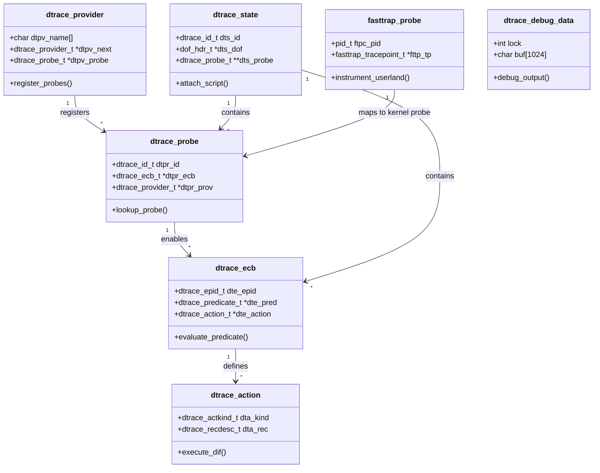

# DTrace — Dynamic Tracing Framework
<!-- This file is auto-generated by generate-doc.py -- do not edit manually -->

---
**Navigation:**
  **Related:** [Kernel Core — Structure and Entry Point](../../../README.md) | [Process Management — Scheduling and Lifecycle](../../../kern/README_process.md) | [Locking Primitives — Mutexes, sx, rmlocks, and Atomics](../../../kern/README_locking.md)
  **All chapters:** [Source Tree — Layout and Conventions](../../../../README_internals.md) | [Boot Process — UEFI Bootloader to Kernel Handoff](../../../../stand/efi/loader/README.md) | [Kernel Core — Structure and Entry Point](../../../README.md) | [Build System — buildworld and buildkernel](../../../../share/mk/README.md) | [Virtual Memory Subsystem — vm_page, UMA, and Pagers](../../../vm/README.md) | [Process Management — Scheduling and Lifecycle](../../../kern/README_process.md) | [Locking Primitives — Mutexes, sx, rmlocks, and Atomics](../../../kern/README_locking.md) | [Buffer Cache — Block I/O Subsystem](../../../vm/README_bcache.md) ...
---


## Quick Summary
DTrace is a dynamic tracing framework that enables system administrators and developers to observe the behavior of a running FreeBSD system without stopping execution or modifying source code. Originally developed by Sun Microsystems and inherited by FreeBSD under the Common Development and Distribution License (CDDL), DTrace allows runtime instrumentation of both kernel and userland components. Unlike traditional debugging approaches that require recompiling software or inserting permanent `printf` calls, DTrace attaches probes to virtually any event point, collects data, and even modifies execution behavior with minimal performance impact.

The framework operates through a clear separation of concerns: providers register probes with the core framework, a DIF (DTrace Intermediate Format) interpreter executes user-supplied tracing logic in-kernel, and the userspace `dtrace(1)` command parses D scripts, compiles them into DIF bytecode, and retrieves results. Probes that are not actively enabled carry essentially zero overhead because the kernel skips over them entirely. This design makes DTrace suitable for diagnosing performance bottlenecks and tracing complex interactions in production environments without risking system stability.

FreeBSD's implementation organizes tracing logic around Enabling Control Blocks (ECBs) and aggregations. When a probe fires, the framework evaluates a predicate, executes a sequence of bounded DIF instructions, and routes the output to either a buffer for userspace consumption or an in-kernel aggregation. Aggregations compute summary statistics like sums, counts, averages, and histograms directly in the kernel, drastically reducing the amount of data transferred to userspace and minimizing context-switch overhead.

## Architecture
The DTrace architecture in FreeBSD is built around four interacting components distributed across `sys/cddl/`. Providers are kernel modules that create probes at specific events. Each provider registers with the framework by creating probe entries that are indexed into hash tables for rapid lookup by module, function, or name. Core providers include `fbt` (function boundary tracing), which instruments kernel function entry and return by temporarily replacing target instructions with trap instructions; `syscall`, which fires on every system call transition; `profile`, which generates periodic interrupts for CPU profiling; `proc`, which traces process lifecycle events; `sdt` (Static DTrace), which uses `SDT_PROBE()` macros embedded directly in kernel code; and `fasttrap`, which instruments userland processes.

Provider registration and framework initialization occur in `sys/cddl/dev/dtrace/dtrace_load.c`. The `dtrace_load()` function initializes core mutexes (`dtrace_lock`, `dtrace_provider_lock`, `dtrace_meta_lock`), creates hash tables for probe indexing, and registers event handlers for KLD load/unload events to dynamically update probe availability. The framework maintains a linked list of providers (`dtrace_provider`), accessible via the `sysctl_dtrace_providers` sysctl in `sys/cddl/dev/dtrace/dtrace_sysctl.c`.

The DIF interpreter, implemented in `sys/cddl/contrib/opensolaris/uts/common/dtrace/dtrace.c`, executes user-supplied D code as bytecode. The `dtrace(1)` command parses D scripts, validates them against a DOF (DTrace Object Format) schema, and sends the compiled bytecode to the kernel via `/dev/dtrace/interpreter`. The interpreter runs a stack-based virtual machine that supports register allocation, memory access, arithmetic, and control flow, but deliberately excludes unbounded loops and recursive calls. When a probe fires, the framework iterates through the probe's ECB list, evaluates predicates, and executes the associated DIF actions.

ECBs connect probes to actions and predicates. An ECB contains a pointer to a predicate (`dtrace_predicate_t`) that acts as a filter, and a linked list of actions (`dtrace_action_t`) that define what data to capture or aggregate. Aggregations (`dtrace_aggregation_t`) maintain in-kernel data structures keyed by arbitrary tuples of probe arguments. Userspace retrieves aggregation results through the `DTRACEIOC_AGGDESC` and `DTRACEIOC_COPY` ioctls in `sys/cddl/dev/dtrace/dtrace_ioctl.c`, pulling pre-computed statistics rather than raw per-event traces.

## Key Data Structures
The DTrace framework relies on a set of core structures defined in `sys/cddl/contrib/opensolaris/uts/common/sys/dtrace_impl.h`. These structures form the backbone of probe registration, ECB management, and state tracking.

```c
struct dtrace_probe {
	dtrace_id_t dtpr_id;			/* probe identifier */
	dtrace_ecb_t *dtpr_ecb;			/* ECB list; see below */
	dtrace_ecb_t *dtpr_ecb_last;		/* last ECB in list */
	void *dtpr_mod;				/* module name */
	void *dtpr_func;			/* function name */
	void *dtpr_name;			/* probe name */
	dtrace_specid_t dtpr_spec;		/* specification */
	dtrace_probespec_t dtpr_pspec;		/* probe specification */
	dtrace_probe_t *dtpr_nextmod;		/* next probe with same module */
	dtrace_probe_t *dtpr_prevmod;		/* previous probe with same module */
	dtrace_probe_t *dtpr_nextfunc;		/* next probe with same function */
	dtrace_probe_t *dtpr_prevfunc;		/* previous probe with same function */
	dtrace_probe_t *dtpr_nextname;		/* next probe with same name */
	dtrace_probe_t *dtpr_prevname;		/* previous probe with same name */
	dtrace_provider_t *dtpr_prov;		/* provider */
};
```
`dtrace_probe_t` represents a single tracepoint. It is indexed by multiple hash tables for fast lookup and maintains a linked list of ECBs that define the tracing behavior when this probe fires.

```c
struct dtrace_ecb {
	dtrace_epid_t dte_epid;			/* enabled probe identifier */
	dtrace_ecb_t *dte_next;			/* next ECB for this probe */
	dtrace_predicate_t *dte_pred;		/* predicate */
	dtrace_action_t *dte_action;		/* action list */
	dtrace_ecb_t *dte_nextstate;		/* next ECB in state list */
	dtrace_ecb_t *dte_prevstate;		/* previous ECB in state list */
};
```
`dtrace_ecb_t` (Enabling Control Block) links a probe to its predicate and action list. Each ECB has a unique enabled probe identifier (`dte_epid`) and can be part of a global state list for iteration during script attachment or detachment.

```c
struct dtrace_action {
	dtrace_action_t *dta_next;		/* next action in list */
	dtrace_actkind_t dta_kind;		/* action kind */
	dtrace_recdesc_t dta_rec;		/* record description */
	dtrace_action_t *dta_tuple;		/* tuple for aggregations */
};
```
`dtrace_action_t` defines what happens when an ECB fires. `dta_kind` specifies the operation (e.g., `DTRACEACT_PRINTA`, `DTRACEACT_SUM`, `DTRACEACT_COUNT`). For aggregations, `dta_tuple` points to a tuple action that defines the key fields used to group data.

```c
struct dtrace_state {
	dtrace_id_t dts_id;			/* state identifier */
	dof_hdr_t *dts_dof;			/* DOF image */
	dtrace_probe_t **dts_probe;		/* array of probes */
	dtrace_ecb_t **dts_ecb;			/* array of ECBs */
	dtrace_action_t **dts_action;		/* array of actions */
	dtrace_predicate_t **dts_pred;		/* array of predicates */
	dtrace_aggregation_t **dts_agg;		/* array of aggregations */
	dtrace_state_t *dts_next;		/* next state */
};
```
`dtrace_state_t` represents a complete DTrace script attached to the kernel. It holds arrays of all probes, ECBs, actions, predicates, and aggregations compiled from the DOF image, allowing the framework to execute the script efficiently per-cpu.

## Deep Dive
When a DTrace script is loaded, the `dtrace(1)` command sends the DOF image to the kernel via the `DTRACEIOC_ADDDOF` ioctl. The kernel validates the DOF structure and populates `dtrace_state_t` arrays in `dtrace.c`. Each probe in the script is matched against registered probes using the hash tables initialized in `dtrace_load.c`. Once matched, the framework creates ECBs and links them to the corresponding `dtrace_probe_t`.

When a provider fires a probe, it calls `dtrace_probe(dtrace_id_t id, uintptr_t arg0, ...)`. The framework looks up the `dtrace_probe_t` using the ID, then iterates over the `dtpr_ecb` list. For each ECB, it checks if the associated predicate (`dte_pred`) evaluates to true. If the predicate passes, the framework executes the DIF bytecode associated with the ECB's action list. The DIF interpreter operates on a per-thread stack and register set, executing instructions like `DTRACE_DIF_OP_ADD`, `DTRACE_DIF_FUNC_copyin`, and `DTRACE_DIF_FUNC_aggregate`. Because DIF is strictly bounded (no loops, fixed stack depth, validated memory accesses), it cannot cause a kernel panic or consume unbounded resources.

Aggregations demonstrate DTrace's efficiency. Instead of printing every event to a buffer, actions like `DTRACEACT_SUM` or `DTRACEACT_COUNT` update in-kernel `dtrace_aggregation_t` structures. The framework maintains these aggregations keyed by tuples of probe arguments. Userspace retrieves the results by requesting aggregation descriptors and copying the pre-computed data, drastically reducing context-switch overhead and memory bandwidth usage.

Userland instrumentation is handled by the `fasttrap` provider in `sys/cddl/contrib/opensolaris/uts/common/dtrace/fasttrap.c`. When a user requests a probe in a user process, `fasttrap` maps scratch space into the target process using `fasttrap_scrblock_t` structures. It then replaces the target instruction with a trap instruction (`fasttrap_sigtrap`). When the process executes the trap, the kernel's exception handler (`dtrace_invop` in `sys/cddl/dev/dtrace/amd64/dtrace_subr.c`) intercepts it, saves the user context, runs the DIF interpreter, emulates the original instruction, and returns control to the process. This allows precise instrumentation of userland functions without requiring source recompilation.

## Flow / Diagram


## Advanced Notes
DTrace's safety in production environments stems from its strict execution model and memory management. The DIF interpreter prevents infinite loops and unbounded memory access, while the DOF validation layer ensures that scripts cannot exceed system limits. FreeBSD exposes several sysctls to control DTrace behavior: `kern.dtrace.bufsize_max_frac` limits the fraction of physical memory available for tracing buffers; `kern.dtrace.dof_maxsize` caps the maximum size of a DOF image; and `security.bsd.allow_destructive_dtrace` controls whether scripts can modify kernel state or terminate processes. These controls prevent a misbehaving trace script from starving system resources.

When debugging, DTrace excels at correlating events across subsystems. Because all probes share a common context and DIF interpreter, you can trace a system call entry, follow it through the VFS layer, and capture its return with precise timestamps and argument values, all within a single script. The `dtrace(1)` command's built-in aggregation functions allow you to compute statistics without writing complex kernel modules.

Performance implications must be considered even with zero-overhead disabled probes. Enabling probes introduces branch mispredictions and instruction cache pollution, particularly with `fbt` tracing. To mitigate this, use predicate filters to narrow probe sets, prefer `sdt` probes for frequently firing events, and use aggregations to reduce userspace data transfer. The `dtrace_debug_data` structure in `sys/cddl/dev/dtrace/dtrace_debug.c` provides per-CPU debug buffers that can be queried via `sysctl debug.dtrace.debug` to diagnose interpreter issues without affecting production workloads.

Race conditions are minimized through careful locking. The framework uses `dtrace_lock` for state modifications and `dtrace_provider_lock` for provider registration. Per-CPU state structures (`dtrace_dstate_percpu_t`) reduce lock contention during probe firing. However, modifying global state while probes are enabled requires caution; the framework uses reference counting and DOF generation IDs (`dtrace_genid_t`) to ensure atomic script attachment and detachment.

## Comparison
Linux implements dynamic tracing through a combination of kprobes, tracepoints, and eBPF. kprobes and ftrace share conceptual similarities with FreeBSD's `fbt` and `profile` providers, allowing instrumentation at arbitrary kernel addresses. However, Linux's eBPF represents a fundamentally different architectural approach. eBPF programs are verified by a kernel verifier before execution, JIT-compiled to native machine code, and run directly on the CPU, whereas DTrace uses a bounded, interpreted bytecode (DIF) that executes in a virtual machine. eBPF offers lower overhead for complex programs but requires a different programming model and licensing considerations. DTrace's unified interpreter and DOF format provide a more consistent cross-platform experience, while eBPF's integration with the Linux kernel scheduler and networking stack makes it highly optimized for specific subsystems.

macOS/XNU historically included a heavily modified version of DTrace, but Apple removed it from the open-source XNU tree and replaced it with dtrace and DTraceBPF (an eBPF-like framework). This shift reflects similar licensing and security concerns that led to DTrace's absence in NetBSD and OpenBSD. NetBSD and OpenBSD rely on DDB/kdb for kernel debugging and custom tracepoint frameworks, lacking a unified dynamic tracing system comparable to DTrace. FreeBSD remains one of the few mainstream operating systems to maintain a complete, production-ready DTrace implementation, preserving its value for deep system observability.

## See Also
- [Kernel Core — Structure and Entry Point](../../sys/README.md)
- [Process Management — Scheduling and Lifecycle](../../../sys/kern/README_process.md)
- [Locking Primitives — Mutexes, sx, rmlocks, and Atomics](../../../sys/kern/README_locking.md)

- [Kernel Core — Structure and Entry Point](../../sys/README.md)
- [Process Management — Scheduling and Lifecycle](../../../sys/kern/README_process.md)
- [Locking Primitives — Mutexes, sx, rmlocks, and Atomics](../../../sys/kern/README_locking.md)


- [Kernel Core — Structure and Entry Point](../../../README.md)
- [Process Management — Scheduling and Lifecycle](../../../kern/README_process.md)
- [Locking Primitives — Mutexes, sx, rmlocks, and Atomics](../../../kern/README_locking.md)
- [Virtual Memory Subsystem — vm_page, UMA, and Pagers](../../../vm/README.md)
- `sys/cddl/dev/dtrace/` — DTrace driver and architecture-specific code
- `sys/cddl/contrib/opensolaris/uts/common/dtrace/` — Core DTrace implementation
- `sys/cddl/contrib/opensolaris/uts/common/sys/dtrace_impl.h` — Internal DTrace structures
- `sys/cddl/contrib/opensolaris/uts/common/dtrace/fasttrap.c` — Userland instrumentation provider

---

> _Generated by [DaemonDocs](https://github.com/ocochard/DaemonDocs) on 2026-04-30 00:59 UTC using model `Qwen3.6-35B-A3B-UD-Q4_K_XL` (llama.cpp build `b8973-3142f1dbb`). AI-generated content — verify against source before relying on it._
