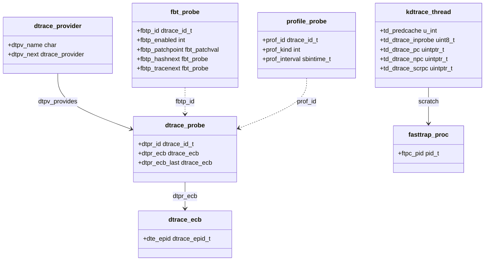

# DTrace — Dynamic Tracing Framework
<!-- This file is auto-generated by generate-doc.py -- do not edit manually -->

---
**Navigation:**
  **Up:** [Kernel Core — Structure and Entry Point](../../../README.md) ▸ [Source Tree — Layout and Conventions](../../../../README_internals.md)
  **Related:** [Kernel Core — Structure and Entry Point](../../../README.md) | [Process Management — Scheduling and Lifecycle](../../../kern/README_process.md) | [Locking Primitives — Mutexes, sx, rmlocks, and Atomics](../../../kern/README_locking.md)
  **All chapters:** [Source Tree — Layout and Conventions](../../../../README_internals.md) | [Boot Process — UEFI Bootloader to Kernel Handoff](../../../../stand/efi/loader/README.md) | [Kernel Core — Structure and Entry Point](../../../README.md) | [Build System — buildworld and buildkernel](../../../../share/mk/README.md) | [System Calls and Image Activation — Entry, sysent, and exec](../../../kern/README_syscall.md) | [Kernel Modules and the Linker — KLD, SYSINIT, and linker sets](../../../kern/README_kld.md) | [Virtual Memory Subsystem — vm_page, UMA, and Pagers](../../../vm/README.md) | [Process Management — Scheduling and Lifecycle](../../../kern/README_process.md) ...
---


## Quick Summary

DTrace is a dynamic tracing framework that lets an administrator or developer
observe a running FreeBSD system without stopping it or recompiling anything.
A DTrace *[probe](../../../kern/README_driver.md#glossary)* is a fixed point in the kernel or in a user process at which
something interesting happens — a function entry, a system call, a timer tick,
a process exit. A *provider* is the module that owns a family of such points
and registers them with the framework. The framework itself, in
`sys/cddl/contrib/opensolaris/uts/common/dtrace/dtrace.c`, keeps every
registered probe in hash tables and in an identifier-indexed array, and is the
single place that decides what to do when a probe fires. This chapter focuses
on the machinery the higher-level overview skips: how a provider actually
fires a probe, how the kernel turns user-supplied D code into a bounded, safe
in-kernel execution, and how the per-[thread](../../../kern/README_process.md#glossary) and per-CPU [state](../../../netpfil/pf/README.md#glossary) that makes all of
that possible is laid out.

The userspace [`dtrace(1)`](../../../../cddl/contrib/opensolaris/cmd/dtrace/dtrace.1) command is where a person's intent enters the system.
It parses a script written in the D language, compiles that script into
[DIF](#glossary) (DTrace Intermediate Format) bytecode, and hands the bytecode
to the kernel through the `/dev/dtrace` character device. From then on the
tracing logic runs in the kernel, not in userspace: when a probe fires, the
framework executes the compiled DIF instructions against the probe's context and
either appends a record to a buffer or folds the event into an in-kernel
[aggregation](#glossary). [`dtrace(1)`](../../../../cddl/contrib/opensolaris/cmd/dtrace/dtrace.1) reads the buffer back, or pulls out the
aggregated summary, and prints it.

This split is the whole point. A script that printed one line per event would
cost a context switch (the kernel saving one thread's state and restoring
another's) and a userspace write for every single event — fatal for
a probe that fires millions of times a second. By running the logic in-kernel
and aggregating there, DTrace turns millions of raw events into a small summary
that crosses the userspace boundary once. The same split is why DTrace is safe
to leave compiled in: a probe that is not enabled costs almost nothing, because
the framework skips over it without evaluating any user code.

FreeBSD's implementation is the OpenSolaris DTrace port, kept under the CDDL
(Common Development and Distribution License) in `sys/cddl/`, with a thin
BSD-licensed adapter in `sys/cddl/dev/dtrace/`. The adapter is what lets the
CDDL core talk to the GENERIC kernel (GENERIC is FreeBSD's default kernel
configuration): it extends `struct proc` and `struct
thread` with `kdtrace_proc_t` and `kdtrace_thread_t` (in
`sys/cddl/dev/dtrace/dtrace_cddl.h`), wires the framework into the trap
handler, and hosts the FreeBSD-specific providers `fbt`, `sdt`, `profile`, and
`systrace` under `sys/cddl/dev/`.

## Glossary

**DIF** — DTrace Intermediate Format; the RISC (Reduced Instruction Set
Computer)-like bytecode that [`dtrace(1)`](../../../../cddl/contrib/opensolaris/cmd/dtrace/dtrace.1) produces from D source and that the
in-kernel interpreter executes.

**DOF** — DTrace Object Format; the container [`dtrace(1)`](../../../../cddl/contrib/opensolaris/cmd/dtrace/dtrace.1) uses to describe a
script's probes, options, and DIF to the kernel in one structure.

**ECB** — Enabling Control Block; the object that binds one enabled probe to a
predicate and a list of actions, so a single probe can serve several consumers.

**Aggregation** — an in-kernel summary (count, sum, avg, lhist, quantize) that
folds many probe events into a small table instead of delivering each event to
userspace.

**Probe context** — the per-CPU state (registers, stack, DIF interpreter
registers) that is set up when a probe fires and torn down when it completes.

**FBT** — Function Boundary Tracing; the provider that instruments every kernel
function's entry and return at load time by patching a trap instruction into
the code.

**Fasttrap** — the provider that instruments user-space instructions by
replacing them with a trap and single-stepping the original from kernel scratch
space.

**Toxic range** — a span of kernel addresses that must never be patched or
traced (early boot, the double-fault handler); touching one would panic the
machine.

## Architecture

The framework is split across two license boundaries. The CDDL core lives in
`sys/cddl/contrib/opensolaris/uts/common/dtrace/` and owns the probe tables,
the DIF interpreter, the [ECB](#glossary) and aggregation machinery, and the userspace
`fasttrap` provider. The BSD adapter in `sys/cddl/dev/dtrace/` owns the
FreeBSD-specific glue: the `/dev/dtrace` device and its ioctl path
(`dtrace_ioctl.c`), module load/unload (`dtrace_load.c`, `dtrace_unload.c`),
the provider list sysctl (`dtrace_sysctl.c`), the per-CPU debug ring
(`dtrace_debug.c`), and the anonymous-enabling bootstrap (`dtrace_anon.c`).
The FreeBSD-specific providers — `fbt`, `sdt`, `profile`, and `systrace` —
live one level up in `sys/cddl/dev/`.

The single choke point is `dtrace_probe()`. Every provider, on every
architecture, reaches the framework through exactly one call: it passes a
probe identifier and up to five arguments, and the framework does the rest.
`dtrace.c` is organized into named blocks — [probe context](#glossary), probe hashing,
matching, provider-to-framework API, probe management, DIF object, predicate,
ECB, buffer, enabling, [DOF](#glossary), and consumer state — and the provider-to-framework
API block is where `dtrace_probe()` sits. The identifier is the provider's
mechanism for saying "this probe fired"; `dtrace_probe()` maps it into the
corresponding `dtrace_probe` structure and walks that probe's list of enabling
control blocks.

A probe is identified by a unique `<provider, module, function, name>` tuple
and given a numeric identifier. To make lookups fast from any one element of
that tuple, `dtrace_load()` builds three hash tables over the probe array —
`dtrace_bymod`, `dtrace_byfunc`, and `dtrace_byname` — each keyed on the
respective field and its next/prev links. A fourth, linear array indexed by
identifier is the fast path used when a probe actually fires, because the
provider only knows the id, not the tuple. Probes that are not tied to an
instruction address (the `profile` ticks) are *unanchored*: they carry no
module or function and are driven by per-CPU callouts instead of by code
execution.

The trap path is what turns an instruction into a probe. `dtrace_load()`
installs three hooks at module-load time: `dtrace_trap_func = dtrace_trap`
so the architecture trap handler forwards DTrace-relevant traps to the
framework, `dtrace_vtime_switch_func = dtrace_vtime_switch` so virtual time
advances on thread switches, and `dtrace_invop_init()` so the invalid-opcode
path (used by [FBT](#glossary)) is registered. It also registers `dtrace_kld_load` and
`dtrace_kld_unload_try` as event handlers so that loading a [KLD](../../../kern/README_kld.md#glossary) (kernel
loadable module) triggers FBT to instrument its functions and unloading one
tears them down, and it discovers the *toxic ranges* — addresses that must
never be patched — via `dtrace_toxic_ranges()`.

## Key Data Structures

The adapter's job is to hang DTrace state off the GENERIC kernel's `struct
proc` and `struct thread` without editing them. Both extensions are defined in
`sys/cddl/dev/dtrace/dtrace_cddl.h`. The per-process block tracks whether the
process has any probes and how many tracepoints it owns:

```c
/* From sys/cddl/dev/dtrace/dtrace_cddl.h */
typedef struct kdtrace_proc {
	int			p_dtrace_probes;	/* Are there probes for this proc? */
	uint64_t	p_dtrace_count;		/* Number of DTrace tracepoints */
	void		*p_dtrace_helpers;	/* DTrace helpers, if any */
	int			p_dtrace_model;
	uint64_t	p_fasttrap_tp_gen;	/* Tracepoint hash table gen */
} kdtrace_proc_t;
```

The per-thread block is where the fast single-step state lives. The
`_tdu`/`__tds` union is a deliberate bit-flag pack: the same bytes are read
either as individual booleans (`_td_dtrace_on`, `_td_dtrace_step`,
`_td_dtrace_ret`, `_td_dtrace_ast`) or as one `u_long` bitfield
(`_td_dtrace_ft`), so the hot path can test several conditions with a single
load:

```c
/* From sys/cddl/dev/dtrace/dtrace_cddl.h (abridged) */
typedef struct kdtrace_thread {
	uint8_t		td_dtrace_stop;	/* Indicates a DTrace-desired stop */
	uint8_t		td_dtrace_sig;	/* Signal sent via DTrace's raise() */
	uint8_t		td_dtrace_inprobe; /* Are we in a probe? */
	u_int		td_predcache;	/* DTrace predicate cache */
	uint64_t	td_dtrace_vtime; /* DTrace virtual time */
	uint64_t	td_dtrace_start; /* DTrace slice start time */
	/* ... _tdu/_tds flag union ... */
	uintptr_t	td_dtrace_pc;	/* DTrace saved pc from fasttrap. */
	uintptr_t	td_dtrace_npc;	/* DTrace next pc from fasttrap. */
	uintptr_t	td_dtrace_scrpc;	/* DTrace per-thread scratch location. */
	uintptr_t	td_dtrace_astpc;	/* DTrace return sequence location. */
	uintptr_t	td_dtrace_sdt_arg[1];	/* Space for extra SDT args */
	void		*td_dtrace_sscr; /* Saved scratch space location. */
	void		*td_systrace_args; /* syscall probe arguments. */
	struct trapframe *td_dtrace_trapframe; /* Trap frame from invop. */
} kdtrace_thread_t;
```

The core probe structure ties an identifier to its list of enabling control
blocks. `dtpr_ecb` and `dtpr_ecb_last` are a head-and-tail pair so that a new
ECB can be appended in O(1) without walking the list:

```c
/* From sys/cddl/contrib/opensolaris/uts/common/sys/dtrace_impl.h */
struct dtrace_probe {
	dtrace_id_t dtpr_id;			/* probe identifier */
	dtrace_ecb_t *dtpr_ecb;			/* ECB list; see below */
	dtrace_ecb_t *dtpr_ecb_last;		/* last ECB in list */
	/* ... module/function/name hash links and tuple fields ... */
};
```

FBT's per-tracepoint structure is the most instructive of the provider
structures because it explains *why* three separate links are needed. One
`fbt_probe_t` is created per tracepoint (a function with several `ret`
instructions has several), and different probes can share a tracepoint (GNU
ifuncs). `fbtp_hashnext` chains probes that hash to the same table bucket,
`fbtp_tracenext` chains the *other probes attached to this same
instruction*, and `fbtp_probenext` chains the *other tracepoints of this same
probe*:

```c
/* From sys/cddl/dev/fbt/fbt.h */
typedef struct fbt_probe {
	struct fbt_probe *fbtp_hashnext;	/* global hash table linkage */
	struct fbt_probe *fbtp_tracenext;	/* next probe for tracepoint */
	struct fbt_probe *fbtp_probenext;	/* next tracepoint for probe */
	int		fbtp_enabled;
	fbt_patchval_t  *fbtp_patchpoint;
	int8_t		fbtp_rval;
	fbt_patchval_t	fbtp_patchval;
	fbt_patchval_t	fbtp_savedval;
	uintptr_t	fbtp_roffset;
	dtrace_id_t	fbtp_id;
	const char	*fbtp_name;
	modctl_t	*fbtp_ctl;
	int		fbtp_loadcnt;
	int		fbtp_symindx;
} fbt_probe_t;
```

[Fasttrap](#glossary) keeps per-thread scratch as page-sized blocks mapped into the traced
process, carved into 64-byte chunks. The block stores its virtual address and
a list link; the thread stores the address of its own chunk in
`kdtrace_thread_t`:

```c
/* From sys/cddl/contrib/opensolaris/uts/common/sys/fasttrap_impl.h */
typedef struct fasttrap_scrblock {
	vm_offset_t ftsb_addr;			/* address of a scratch block */
	LIST_ENTRY(fasttrap_scrblock) ftsb_next;/* next block in list */
} fasttrap_scrblock_t;
#define	FASTTRAP_SCRBLOCK_SIZE	PAGE_SIZE

typedef struct fasttrap_scrspace {
	uintptr_t ftss_addr;			/* scratch space address */
	LIST_ENTRY(fasttrap_scrspace) ftss_next;/* next in list */
} fasttrap_scrspace_t;
#define	FASTTRAP_SCRSPACE_SIZE	64
```

The `profile` provider is the canonical unanchored probe: each tick is a
per-CPU `callout`, and the per-CPU sub-structure holds the next-fire time so
that SMP systems fire the tick on every CPU:

```c
/* From sys/cddl/dev/profile/profile.c (FreeBSD branch) */
typedef struct profile_probe {
	dtrace_id_t		prof_id;
	int			prof_kind;
	sbintime_t		prof_interval;
	struct callout	prof_cyclic;
	sbintime_t		prof_expected;
	struct profile_probe_percpu **prof_pcpus;
} profile_probe_t;

typedef struct profile_probe_percpu {
	hrtime_t		profc_expected;
	hrtime_t		profc_interval;
	profile_probe_t	*profc_probe;
	struct callout	profc_cyclic;
} profile_probe_percpu_t;
```

## Deep Dive

**How FBT instruments a kernel function.** FBT works by overwriting the first
byte of a function with a trap opcode — `0xcc` (`int3`) on amd64, `0xf0` on
i386 — defined as `FBT_PATCHVAL` in `sys/cddl/dev/fbt/x86/fbt_isa.c`. When a
kernel module loads, the `dtrace_kld_load` event handler triggers
`fbt_provide_module`, which walks the module's symbol table and, for each
function not excluded by `fbt_excluded()`, allocates an `fbt_probe_t`, records
the original byte in `fbtp_savedval`, and patches the site. `fbt_excluded()`
skips anything beginning with `dtrace_` (unless it is `dtrace_safe_`), the
[DDB](../../../kern/README_kdb.md#glossary) functions `db_*`/`kdb_*`, and the lock-owner methods `owner_mtx`/`owner_rm`
— all of which could be called from probe context and would re-enter FBT.

When the patched instruction is executed, the CPU raises an invalid-opcode
trap. The framework routes it to `fbt_invop()` in
`sys/cddl/dev/fbt/x86/fbt_isa.c`, which recovers the arguments from the
`trapframe` and calls the framework. On amd64 the entry arguments are the
caller-saved registers at the call site:

```c
/* From sys/cddl/dev/fbt/x86/fbt_isa.c (amd64 entry path) */
arg0 = frame->tf_rdi;
arg1 = frame->tf_rsi;
arg2 = frame->tf_rdx;
arg3 = frame->tf_rcx;
arg4 = frame->tf_r8;
/* ... */
dtrace_probe(fbt->fbtp_id, arg0, arg1,
    arg2, arg3, arg4);
```

The lookup from address to probe is a hash, not a linear scan: `fbt_invop()`
indexes `fbt_probetab` with `FBT_ADDR2NDX(addr)`, which is `((addr >> 4) &
fbt_probetab_mask)` over a 32,768-entry table (`FBT_PROBETAB_SIZE 0x8000`),
and follows the `fbtp_hashnext` chain until it finds the entry whose
`fbtp_patchpoint` matches. The `fbtp_tracenext` chain is then walked so that
every probe attached to that same instruction fires. For a return probe,
`fbt_invop()` instead passes the return value in `rval` and the
`fbtp_roffset` as the first argument.

**How the DIF interpreter stays bounded.** When `dtrace_probe()` finds that a
probe has at least one ECB, it sets up the per-CPU probe context — the register
file, the argument array, and the DIF interpreter's own registers — and
executes the compiled DIF for each ECB whose predicate matches. DIF is a
RISC-like bytecode: fixed-width instructions over a small register set, no
implicit unbounded control flow. The compiler emits a bounded instruction
stream per action, and the interpreter walks it to completion and tears the
context down. Memory reads go through guarded helpers that set
`CPU_DTRACE_NOFAULT` around the access (as `fbt_invop()` does around
`cpu->cpu_dtrace_caller = stack[0]`), so a bad address produced by a probe
argument is reported as a DTrace error rather than faulting the kernel. This is
what makes it safe to run arbitrary user-supplied logic in the kernel: the
interpreter cannot loop forever, allocate unboundedly, or dereference a wild
pointer.

**How an ECB connects a probe to an action.** A probe does not know who is
listening. The framework attaches one ECB per enabled consumer to the probe's
`dtpr_ecb` list, and each ECB carries a compiled predicate and an ordered list
of actions. When the probe fires, the framework evaluates each ECB's predicate;
a per-thread *predicate cache* (`kdtrace_thread_t`'s `td_predcache`) records
which ECBs have recently matched so that a probe whose consumers all filtered
out can be skipped after the first check. This is why a single probe can serve
several [`dtrace(1)`](../../../../cddl/contrib/opensolaris/cmd/dtrace/dtrace.1) instances at once, and why an enabled-but-unmatched probe
is cheap: the work is bounded by the number of matching ECBs, not by the number
of probes.

**How fasttrap instruments user space.** Kernel code can be patched in place
because it is trusted and resident; user code cannot. Fasttrap therefore
replaces a user instruction with a trap, saves the original bytes in a hash
table keyed by `(pid, pc)`, and — when the trap fires in `fasttrap_sigtrap()`
— copies the original instruction into the thread's scratch chunk
(`fasttrap_scraddr()` locates it in the `fasttrap_scrblock` mapped into the
process), sets the PC to that scratch copy, and single-steps it so the
overwritten instruction's effect appears to have happened. Branches and jumps
are emulated by hand because they are a small fraction of any instruction set.
`fasttrap_fork()`, `fasttrap_exec_exit()`, and `fasttrap_pid_cleanup()` keep
the per-process state consistent across process lifecycle events, and the
`fasttrap_pid_*` functions enable and disable probes for a specific pid.

**How the userspace boundary works.** [`dtrace(1)`](../../../../cddl/contrib/opensolaris/cmd/dtrace/dtrace.1) talks to the kernel through
`/dev/dtrace`. `dtrace_ioctl_helper()` in `sys/cddl/dev/dtrace/dtrace_ioctl.c`
handles `DTRACEHIOC_ADDDOF`, which copies a DOF in (`dtrace_dof_copyin()`, or
`dtrace_dof_copyin_proc()` when targeting a stopped child) and passes it to
`dtrace_helper_slurp()` to create the enablings; `DTRACEHIOC_REMOVE` tears a
generation down. The main `dtrace_ioctl()` handles the read-back path, e.g.
`DTRACEIOC_AGGDESC`, which resolves an aggregation id with
`dtrace_aggid2agg()` and copies the folded records out so the consumer can
print a summary. The per-CPU debug ring in `dtrace_debug.c` exists for the one
case where the framework must print from probe context: because it cannot call
`printf()` (that would trip FBT and re-enter), it appends to a 32 KiB per-CPU
ring guarded by a lock-free `atomic_cmpset` spinlock and flushes it with
`dtrace_debug_output()` once the probe completes.

## Flow / Diagram



## Advanced Notes

**Enabling a probe is a patch, not a check.** On the kernel side, enabling an
`fbt` probe physically rewrites a code byte to `0xcc`; disabling it restores
`fbtp_savedval`. That is why the *toxic ranges* computed in `dtrace_load()`
matter: patching an address inside [early boot](../../../README.md#glossary) or the double-fault handler
would panic the machine, so those ranges are excluded up front. The
`dtrace_doubletrap_func` [hook](../../../netgraph/README.md#glossary) in `sys/sys/dtrace_bsd.h` goes further and
removes active FBT probes before the double-fault handler runs, so a broken
probe cannot trigger a second trap and reset the box.

**Why it is safe to leave in production.** Three properties do the work.
First, an unenabled probe costs a single hash lookup and an empty ECB-list
check in `dtrace_probe()` — no user code runs. Second, the DIF interpreter is
bounded: fixed-width instructions, no unbounded loops, guarded memory reads,
and a per-CPU context that is torn down on completion. Third, the destructive
mode is gated behind `security.bsd.allow_destructive_dtrace` (default on) and
translated in `dtrace_load()` to the framework's negative-logic
`dtrace_destructive_disallow` flag, so scripts that modify state are an
explicit opt-in. The tunables in `dtrace_sysctl.c` — `kern.dtrace.bufsize_max`,
`kern.dtrace.dof_maxsize`, `kern.dtrace.memstr_max` — cap the memory a single
consumer can consume, so a runaway script cannot exhaust the kernel.

**Debugging DTrace with DTrace.** The per-CPU debug ring (`dtrace_debug.c`) is
the framework's own escape hatch: it can print from probe context without
re-entering FBT, and `dtrace_debug_output()` flushes it after the probe. The
`debug.dtrace.providers` sysctl (implemented by `sysctl_dtrace_providers()`)
lists every registered provider at runtime, which is the fastest way to confirm
that a module's probes actually loaded. `debug.dtrace.verbose_ioctl` logs every
ioctl, useful when a [`dtrace(1)`](../../../../cddl/contrib/opensolaris/cmd/dtrace/dtrace.1) session fails to [attach](../../../kern/README_driver.md#glossary).

**Pitfalls.** FBT excludes `dtrace_*` functions by default because they may be
called from probe context; a custom kernel function that does so must be named
`dtrace_safe_*` or it will be silently uninstrumented. The `profile` provider
hard-codes `PROF_ARTIFICIAL_FRAMES` per architecture (10 on amd64, 12 on
aarch64 and riscv) to walk its own stack correctly; if the interrupt path
changes, stack traces from `profile` probes can be off by a frame. Fasttrap
scratch is per-thread and is not released until the thread exits, so a process
that spawns many threads while traced accumulates scratch chunks.

**Connection to OS theory.** The provider/consumer/ECB split is the same
publish–subscribe decoupling that operating-systems texts describe for
debugging: a *provider* emits events, a *consumer* subscribes, and the kernel
mediates so that producers do not need to know their consumers. `dtrace(7D)`
documents the D language and the probe model; the FreeBSD Handbook's DTrace
chapter covers the operators' view and the scripts under `/usr/share/dtrace`.
The xoroshiro128+ PRNG in
`sys/cddl/contrib/opensolaris/uts/common/dtrace/dtrace_xoroshiro128_plus.c`
(`dtrace_xoroshiro128_plus_next`, `dtrace_xoroshiro128_plus_jump`, `rotl`)
supplies the randomness for sampling-based scripts, which trade completeness
for a fixed, low overhead — the same statistical-sampling idea used by
profilers in the literature.

## See Also
- [Kernel Core — Structure and Entry Point](../../../README.md)
- [Process Management — Scheduling and Lifecycle](../../../kern/README_process.md)
- [Locking Primitives — Mutexes, sx, rmlocks, and Atomics](../../../kern/README_locking.md)


- [`sys/cddl/contrib/opensolaris/uts/common/dtrace/dtrace.c`](../../contrib/opensolaris/uts/common/dtrace/dtrace.c) — the framework
  core: probe tables, DIF interpreter, ECB and aggregation machinery.
- [`sys/cddl/contrib/opensolaris/uts/common/dtrace/fasttrap.c`](../../contrib/opensolaris/uts/common/dtrace/fasttrap.c) — the userspace
  trap-based provider and its scratch-space management.
- [`sys/cddl/dev/fbt/`](../fbt) — Function Boundary Tracing, including the
  architecture-specific patch code in `sys/cddl/dev/fbt/x86/fbt_isa.c`.
- [`sys/cddl/dev/sdt/sdt.c`](../sdt/sdt.c) and [`sys/sys/sdt.h`](../../../sys/sdt.h) — statically defined tracing
  and the `SDT_PROBE*` macros that append probes to linker sets.
- [`sys/cddl/dev/profile/profile.c`](../profile/profile.c) and [`sys/cddl/dev/systrace/systrace.c`](../systrace/systrace.c) —
  the unanchored tick provider and the `syscall` provider.
- [`sys/cddl/dev/dtrace/dtrace_cddl.h`](dtrace_cddl.h) — the `kdtrace_proc_t` /
  `kdtrace_thread_t` extensions that bridge the CDDL core to the GENERIC
  kernel.
  [Kernel Modules and the Linker](../../../kern/README_kld.md) — for the
  `SYSINIT` (the kernel's ordered initialization macro that registers functions
  to run at boot) ordering and the KLD event handlers that DTrace hooks into.
- Man pages: [`dtrace(1)`](../../../../cddl/contrib/opensolaris/cmd/dtrace/dtrace.1), `dtrace(7D)`.

---

> _Generated by [DaemonDocs](https://github.com/ocochard/DaemonDocs) on 2026-09-01 02:32 UTC using model `Qwen3.8-27B-Q8_0` (llama.cpp build `b10553-cd26896c1`). AI-generated content — verify against source before relying on it._
