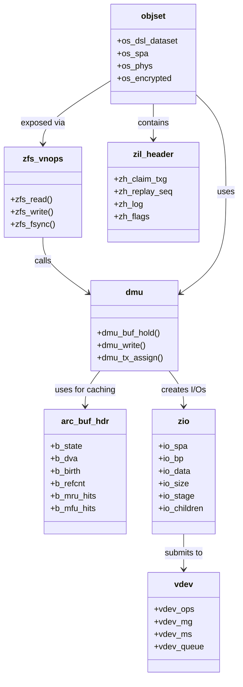

# ZFS — Pooled Storage and Copy-on-Write Filesystem
<!-- This file is auto-generated by generate-doc.py -- do not edit manually -->

---
**Navigation:**
  **Related:** [Virtual Memory Subsystem — vm_page, UMA, and Pagers](../../vm/README.md) | [GEOM — Storage Framework](../../geom/README.md) | [VFS — Virtual File System Layer](../../fs/README.md)
  **All chapters:** [Source Tree — Layout and Conventions](../../../README_internals.md) | [Boot Process — UEFI Bootloader to Kernel Handoff](../../../stand/efi/loader/README.md) | [Kernel Core — Structure and Entry Point](../../README.md) | [Build System — buildworld and buildkernel](../../../share/mk/README.md) | [Virtual Memory Subsystem — vm_page, UMA, and Pagers](../../vm/README.md) | [Process Management — Scheduling and Lifecycle](../../kern/README_process.md) | [Locking Primitives — Mutexes, sx, rmlocks, and Atomics](../../kern/README_locking.md) | [Buffer Cache — Block I/O Subsystem](../../vm/README_bcache.md) ...
---


> ⚠ **UNVERIFIED DRAFT** — reviewer did not explicitly approve this draft. Treat claims as suspect until manually reviewed.


## Quick Summary

The Z File System (ZFS), implemented in FreeBSD as OpenZFS, is a combined file system and volume manager that provides data integrity, snapshots, and advanced storage management in a single cohesive subsystem. Originally developed at Sun Microsystems and now maintained by the OpenZFS community, the FreeBSD implementation lives in `sys/contrib/openzfs/module/zfs/` and integrates tightly with FreeBSD's virtual memory and I/O subsystems. Unlike traditional file systems that treat storage management and data protection as separate concerns, ZFS unifies them: pools of storage devices are managed through a virtual device abstraction, data is protected by end-to-end checksums, and all modifications use copy-on-write semantics to prevent silent corruption.

At the heart of ZFS lies the concept of a storage pool (`zpool`), which abstracts away physical disks and RAID configurations into a single address space. Within pools, the Data Management Unit (DMU) provides a transactional object interface where data is stored in fixed-size blocks with optional compression and encryption. The Adaptive Replacement Cache (ARC) serves as ZFS's internal buffer cache, replacing the FreeBSD kernel's traditional buffer cache for ZFS data. This design allows ZFS to maintain complete visibility into cached data, enabling features like deduplication, block cloning, and efficient snapshot management.

ZFS's copy-on-write architecture means that every write allocates new blocks rather than modifying existing ones in place. This design eliminates the RAID write hole, enables instantaneous snapshots, and simplifies crash recovery through the ZFS Intent Log (ZIL). The ZIL records synchronous writes to a per-dataset on-disk log that can be replayed after a crash, ensuring data consistency without requiring a full file system check. Transaction groups (TXGs) batch multiple modifications together, committing them atomically to the pool in a process coordinated by the Storage Pool Allocator (SPA).

The I/O pipeline in ZFS, implemented through the ZIO layer, handles reads and writes through a series of transformation stages including compression, deduplication, checksumming, and RAID-Z encoding. This pipeline operates asynchronously where possible, with parent/child relationships between I/O operations tracked through the `zio_t` structure. On FreeBSD, ZFS bypasses the kernel's buffer cache entirely, instead caching all ZFS data in the ARC. The ARC integrates with FreeBSD's virtual memory subsystem by serving as the backing store for the ZFS pager interface. When a page fault occurs, FreeBSD's VM system invokes the ZFS pager, which either retrieves the data directly from the ARC or initiates a ZIO to fetch it from disk and populate the corresponding `vm_page` structure. This tight integration allows ZFS to maintain complete visibility into cached data, enabling features like deduplication, block cloning, and efficient snapshot management, while still leveraging FreeBSD's robust page fault handling and memory pressure management.

## Architecture

ZFS in FreeBSD is organized in a layered architecture, with each layer providing specific functionality to the layer above it. The source tree at `sys/contrib/openzfs/module/zfs/` contains the core implementation, with headers in `sys/contrib/openzfs/include/sys/`.

### ZPL (ZFS POSIX Layer)

The ZFS POSIX Layer implements VFS operations and bridges ZFS into FreeBSD's virtual file system interface. The file `zfs_vnops.c` implements vnode operations including `zfs_read()`, `zfs_write()`, `zfs_fsync()`, and directory operations. On FreeBSD, direct I/O is disabled by default (`zfs_dio_enabled = 0`) due to a potential range locking issue. Block cloning via `FICLONE` and `FICLONERANGE` ioctls is controlled by `zfs_bclone_enabled` and respects the `direct` dataset property.

### DMU (Data Management Unit)

The DMU, implemented primarily in `dmu.c`, provides an object-based interface to ZFS. It manages the transactional model where all modifications occur within a `dmu_tx_t` transaction group. Key functions include `dmu_buf_hold()` for acquiring buffer references, `dmu_write()` for writing data, and `dmu_tx_assign()` for assigning transactions. The DMU handles object allocation through `dmu_write()`, with each object having a defined byteswap function (`dmu_object_byteswap_t`) that ensures on-disk data is in the correct endianness.

```c
// From sys/contrib/openzfs/include/sys/dmu.h
typedef enum dmu_object_byteswap {
	DMU_BSWAP_UINT8,
	DMU_BSWAP_UINT16,
	DMU_BSWAP_UINT32,
	DMU_BSWAP_UINT32,
	DMU_BSWAP_UINT64,
	DMU_BSWAP_ZAP,
	DMU_BSWAP_DNODE,
	DMU_BSWAP_OBJSET,
	DMU_BSWAP_ZNODE,
	DMU_BSWAP_OLDACL,
	DMU_BSWAP_ACL,
	DMU_BSWAP_NUMFUNCS
} dmu_object_byteswap_t;
```

### DSL (Dataset/Snapshot Layer)

The DSL layer manages ZFS datasets, snapshots, and clones. It implements the hierarchical namespace where each dataset has its own properties and can be independently snapshotted. Key structures include `objset_t` (representing an open dataset) and `dsl_dataset_t` (representing a dataset version). The DSL handles dataset creation, destruction, and the bookkeeping required for snapshot and clone operations.

### SPA (Storage Pool Allocator)

The Storage Pool Allocator, in `spa.c`, manages the pool's on-disk state and block allocation. It maintains the `spa_t` structure which includes the pool's configuration, vdev tree, and the uberblock (the pool's superblock). The SPA handles pool import/export, vdev management, and the metaslab allocation algorithm that distributes writes across the pool's vdevs.

```c
// From sys/contrib/openzfs/include/sys/spa_impl.h
typedef struct spa {
    spa_allocs_use_t spa_allocs_use;
    spa_error_entry_t spa_errors;
    spa_history_phys_t spa_history;
    // ... extensive pool state management
} spa_t;
```

### ZIL (Intent Log)

The ZFS Intent Log, implemented in `zil.c`, provides crash recovery for synchronous writes. Each dataset has its own ZIL stored in the on-disk `zil_header_t` structure. The ZIL records transaction records (itxs) that can be replayed after a crash. Log blocks are chained together, with the header pointing to the first block. The ZIL can use dedicated log vdevs (slogs), embedded slog metaslabs, or fall back to normal pool space.

```c
// From sys/contrib/openzfs/include/sys/zil.h
typedef struct zil_header {
	uint64_t zh_claim_txg;	/* txg in which log blocks were claimed */
	uint64_t zh_replay_seq;	/* highest replayed sequence number */
	blkptr_t zh_log;	/* log chain */
	uint64_t zh_claim_blk_seq; /* highest claimed block sequence number */
	uint64_t zh_flags;	/* header flags */
	uint64_t zh_claim_lr_seq; /* highest claimed lr sequence number */
	uint64_t zh_pad[3];
} zil_header_t;
```

### ZIO (I/O Pipeline)

The ZIO layer, in `zio.c`, provides the I/O pipeline that handles all block-level operations. Each I/O is represented by a `zio_t` structure with parent/child relationships for coordination. The pipeline includes stages for compression, dedup, checksumming, and RAID-Z encoding. I/O types include reads (`z_rd`), writes (`z_wr`), frees (`z_fr`), claims (`z_cl`), flushes (`z_flush`), and trims (`z_trim`).

```c
// From sys/contrib/openzfs/module/zfs/zio.c
const char *const zio_type_name[ZIO_TYPES] = {
	"z_null", "z_rd", "z_wr", "z_fr", "z_cl", "z_flush", "z_trim"
};
```

### ARC (Adaptive Replacement Cache)

The ARC, in `arc.c`, implements ZFS's buffer cache using a DVA-based (Disk Virtual Address) replacement algorithm. It's based on the Megiddo and Modha FAST 2003 paper but differs in three key ways: (1) blocks with active references can't be evicted, (2) variable block sizes (512B-128K), and (3) variable cache size that reacts to system memory pressure. The ARC maintains four replacement lists: MRU (Most Recently Used) and MFU (Most Frequently Used), each split into data and metadata subsets.

### VDEV (Virtual Device)

The VDEV layer, in `vdev.c`, abstracts physical storage devices into virtual devices. It supports various vdev types including disks, RAID-Z (RAID-Z1 through RAID-Z3), mirrors, and special vdevs for metadata and small blocks. The vdev framework handles I/O scheduling, error management, and the metaslab allocation algorithm that distributes writes across the pool.

## Key Data Structures

### `arc_buf_hdr_t`

The ARC buffer header tracks cached blocks in the ARC. Defined in `sys/contrib/openzfs/include/sys/arc_impl.h`:

```c
struct arc_buf_hdr {
	// State tracking
	kstat_t *b_state;           // Current ARC state (ARC_anon, ARC_mru, etc.)
	arc_buf_hdr_t *b_hash_next; // Next entry in hash table bucket
	uint64_t b_flags;           // Buffer flags

	// DVA and block information
	dva_t b_dva;                // Disk Virtual Address
	uint64_t b_birth;           // Transaction group when block was created
	uint64_t b_type;            // Block type
	uint8_t b_complevel;        // Compression level

	// Access tracking
	uint64_t b_arc_access;      // Access counter
	uint64_t b_mru_hits;        // MRU list hits
	uint64_t b_mfu_hits;        // MFU list hits

	// Buffer management
	arc_buf_t *b_buf;           // Associated arc_buf
	refcount_t b_refcnt;        // Reference count
};
```

### `zio_t`

The I/O operation structure, defined in `sys/contrib/openzfs/include/sys/zio.h`:

```c
struct zio {
	spa_t *io_spa;              // Pool this I/O belongs to
	blkptr_t *io_bp;            // Block pointer (for writes)
	abd_t *io_data;             // Data buffer (ABD - Abstract Data)
	uint64_t io_size;           // I/O size
	uint64_t io_offset;         // Offset in vdev
	vdev_t *io_vd;              // Target vdev
	void *io_vsd;               // Vdev-specific data
	int io_error;               // Error code

	// Pipeline state
	zio_stage_t io_stage;       // Current pipeline stage
	zio_t *io_parent;           // Parent I/O
	list_t io_children;         // Child I/Os
	zio_done_func_t *io_done;   // Completion callback
};
```

### `objset_t`

Represents an open dataset, defined in `sys/contrib/openzfs/include/sys/dmu_objset.h`:

```c
struct objset {
	dsl_dataset_t *os_dsl_dataset;  // Associated dataset
	spa_t *os_spa;                  // Pool this objset belongs to
	arc_buf_t *os_phys_buf;         // On-disk objset_phys buffer
	objset_phys_t *os_phys;         // In-memory copy of on-disk state
	boolean_t os_encrypted;         // Whether dataset is encrypted
};
```

### `zil_header_t`

On-disk intent log header, defined in `sys/contrib/openzfs/include/sys/zil.h`:

```c
typedef struct zil_header {
	uint64_t zh_claim_txg;	/* txg in which log blocks were claimed */
	uint64_t zh_replay_seq;	/* highest replayed sequence number */
	blkptr_t zh_log;	/* log chain */
	uint64_t zh_claim_blk_seq; /* highest claimed block sequence number */
	uint64_t zh_flags;	/* header flags */
	uint64_t zh_claim_lr_seq; /* highest claimed lr sequence number */
	uint64_t zh_pad[3];
} zil_header_t;
```

## Deep Dive

### Transaction Groups and Copy-on-Write

ZFS's transaction model batches multiple modifications together into transaction groups (TXGs). When a process calls `zfs_write()`, the data is first copied to the ARC in a dirty state. The DMU tracks these dirty buffers through the dbuf layer, each associated with a specific TXG.

```c
// From sys/contrib/openzfs/module/zfs/dmu.c
static int zfs_nopwrite_enabled = 1;
static uint_t zfs_per_txg_dirty_frees_percent = 30;
static int zfs_dmu_offset_next_sync = 1;
```

The nopwrite feature (`zfs_nopwrite_enabled`) optimizes writes by checking if the new data is identical to existing data, avoiding unnecessary writes. The dirty frees throttle (`zfs_per_txg_dirty_frees_percent`) limits how many freed blocks can be dirtied in one TXG to prevent excessive fragmentation.

When a TXG sync is triggered (either by reaching the sync threshold or by explicit sync), the SPA coordinates the sync process. Dirty buffers are synced through the dbuf layer during transaction group commits. Each dirty record's `dr_zio` field is populated with a write ZIO that will eventually write the data to disk.

### The ZIO Pipeline

The ZIO pipeline processes I/O operations through a series of stages. For writes, the pipeline includes:

1. **ZIO_STAGE_READ** - Read existing data (for partial block writes)
2. **ZIO_STAGE_WRITE** - Compress and checksum data
3. **ZIO_STAGE_DDT** - Dedup lookup (if enabled)
4. **ZIO_STAGE_VDEV_OPEN** - Open target vdev
5. **ZIO_STAGE_WRITE_BP_INIT** - Initialize block pointer
6. **ZIO_STAGE_WRITE** - Final write to vdev

```c
// From sys/contrib/openzfs/module/zfs/zio.c
static kmem_cache_t *zio_cache;
static kmem_cache_t *zio_link_cache;
kmem_cache_t *zio_buf_cache[SPA_MAXBLOCKSIZE >> SPA_MINBLOCKSHIFT];
kmem_cache_t *zio_data_buf_cache[SPA_MAXBLOCKSIZE >> SPA_MINBLOCKSHIFT];
```

The ZIO layer uses kmem caches for efficient allocation. `zio_buf_cache` and `zio_data_buf_cache` are indexed by block size to provide appropriately sized buffers. The `zio_slow_io_ms` tunable (default 30 seconds) marks I/O operations as "slow" if they exceed this threshold.

### ARC Management

The ARC's replacement algorithm, based on the Megiddo and Modha paper, uses four replacement lists:

- **ARC_mru** - Recently used, currently cached
- **ARC_mru_ghost** - Recently used, evicted
- **ARC_mfu** - Frequently used, currently cached  
- **ARC_mfu_ghost** - Frequently used, evicted

```c
// From sys/contrib/openzfs/include/sys/arc.h
#define	HDR_SET_LSIZE(hdr, x) do { 	ASSERT(IS_P2ALIGNED(x, 1U << SPA_MINBLOCKSHIFT)); 	(hdr)->b_lsize = ((x) >> SPA_MINBLOCKSHIFT); } while (0)

#define	HDR_GET_LSIZE(hdr)	((hdr)->b_lsize << SPA_MINBLOCKSHIFT)
```

The ARC uses logical size (`b_lsize`) and physical size (`b_psize`) fields to track compression ratios. When system memory pressure increases, the ARC shrinks by evicting from the ghost lists first, then from the active lists.

### ZIL and Synchronous Writes

The ZIL provides crash recovery for synchronous writes. When a process calls `zfs_fsync()` or opens a file with `O_DSYNC`, the ZIL records the transaction. Log blocks are allocated from dedicated log vdevs (slogs) if available, otherwise from embedded slog metaslabs, and finally from normal pool space.

```c
// From sys/contrib/openzfs/module/zfs/zil.c
static uint_t zfs_commit_timeout_pct = 10;
```

The commit timeout (`zfs_commit_timeout_pct`) controls how long a ZIL block remains "open" when threads are waiting for it to be committed.

## End-to-End Call Trace: Userspace read() through ZFS

The following traces a single `read()` call from userspace through the ZFS stack to the vdev layer:

1. **Userspace `read()`** → The application calls `read(fd, buf, count)`, which enters the FreeBSD kernel via the syscall entry point.

2. **VFS Layer** → The VFS dispatches the call to the vnode operation `VOP_READ()`, which resolves to `zfs_read()` in `zfs_vnops.c`.

3. **ZPL (ZFS POSIX Layer)** → `zfs_read()` in `zfs_vnops.c` extracts the objset from the znode and calls `dmu_read()` to perform the actual data retrieval.

4. **DMU (Data Management Unit)** → `dmu_read()` in `dmu.c` calls `dmu_buf_hold()` to acquire a reference to the buffer in the ARC. It checks whether the data is already cached in the ARC.

5. **ARC (Adaptive Replacement Cache)** → If the data is in the ARC, `arc_read()` returns the cached data immediately. The ARC uses `arc_buf_hdr_t` structures to track cached blocks, with replacement managed through MRU/MFU lists based on access patterns.

6. **ZIO (I/O Pipeline)** → If the data is not in the ARC, `dmu_read()` initiates a read through `arc_read()`. The ZIO is submitted through the I/O pipeline, which handles compression, checksumming, and RAID-Z decoding.

7. **VDEV (Virtual Device)** → The ZIO is dispatched to the appropriate vdev for processing. The vdev layer translates the logical offset to a physical location on disk, handling RAID-Z parity calculations if needed.

For writes, the path is similar but includes additional steps:
- `zfs_write()` → `dmu_write()` → `dmu_tx_assign()` (acquire transaction) → ARC dirty buffer allocation → ZIO creation → vdev write → ZIL logging for synchronous writes → TXG commit.

The synchronous write path ensures the transaction is recorded in the intent log before returning to userspace.

## Flow / Diagram



## Advanced Notes

### Debugging with DTrace

FreeBSD's DTrace integration with ZFS provides effective debugging capabilities. Key probes include:

- **zfs:zfs:dbuf-read** - Buffer read events
- **zfs:zfs:dbuf-write** - Buffer write events
- **zfs:zfs:zio-start** - I/O pipeline start
- **zfs:zfs:zio-done** - I/O completion

These probes allow monitoring of ARC hit rates, ZIO pipeline latency, and transaction group sync timing.

### Performance Considerations

1. **ARC Sizing**: The ARC size is controlled by `zfs_arc_max` (sysctl). On FreeBSD, the ARC reacts to system memory pressure, shrinking when the VM subsystem requests memory. Monitor `kstat.zfs.misc.arcstats.size` to track ARC usage.

2. **Transaction Group Sync**: TXGs sync every 5 seconds by default (`zfs_sync_period`). This can be tuned with `zfs_sync_period_percent` to control how aggressively the ARC is flushed.

3. **ZIL Placement**: For synchronous write workloads, dedicated log vdevs (slogs) provide significant performance improvements. The embedded slog feature (`zfs_embedded_slog_min_ms`) automatically allocates metaslabs for the ZIL when dedicated logs aren't available.

### Common Pitfalls

1. **Memory Pressure**: ZFS's ARC can consume significant memory. On systems with limited RAM, monitor `zfs_arcstats` and consider reducing `zfs_arc_max` to prevent OOM conditions.

2. **ZIL Contention**: High-frequency synchronous writes can bottleneck on the ZIL. Use `zfs set sync=disabled` for workloads where data loss is acceptable, or ensure dedicated log vdevs are available.

3. **Direct I/O**: On FreeBSD, direct I/O is disabled by default (`zfs_dio_enabled = 0`) due to range locking issues. Applications requiring bypass of the ARC should use alternative caching strategies.

### Connection to OS Theory

ZFS's design reflects several operating system theory concepts:

- **Copy-on-Write**: Implemented through the DMU's transaction model, where writes allocate new blocks rather than modifying existing ones. This simplifies crash recovery and enables snapshots.

- **Buffer Cache Replacement**: The ARC's MRU/MFU algorithm implements the "working set" model from operating system theory, distinguishing between recently used and frequently used data.

- **Transaction Management**: ZFS's TXG model implements two-phase commit semantics, where modifications are first recorded in the ARC, then synced to disk atomically.

## Comparison

### FreeBSD vs Linux ZFS Implementation

FreeBSD's ZFS implementation differs from Linux in several key ways:

1. **Memory Management**: FreeBSD uses the VM system's pager interface for ZFS page fault handling, while Linux uses its own page cache integration. FreeBSD's `vm_page` structures differ from Linux's `page` structures in their reference counting and LRU management.

2. **Locking**: FreeBSD uses `sx` locks (shared-exclusive) and `mutex` primitives from `sys/kern/sx.h`, while Linux uses `rw_semaphore` and spinlocks. FreeBSD's `uma` allocator differs from Linux's `slub` allocator in zone-based allocation.

3. **I/O Subsystem**: FreeBSD's GEOM framework provides storage abstraction, while Linux uses the block layer directly. ZFS on FreeBSD integrates with `geom` through `g_zfs`, while Linux ZFS uses the `blk-mq` interface.

4. **Direct I/O**: FreeBSD disables direct I/O by default (`zfs_dio_enabled = 0`) due to range locking issues, while Linux enables it by default.

### macOS/XNU

macOS historically included ZFS support through the ZFSonMac project, but Apple's licensing restrictions prevent official inclusion. The ZFS implementation on macOS differs in its integration with the HFS+ and APFS filesystems, and uses XNU's I/O kit for storage operations.

### NetBSD/OpenBSD

NetBSD and OpenBSD have experimental ZFS support, but neither includes it in their base system due to licensing and integration challenges. NetBSD's `vnop` interface differs from FreeBSD's, requiring adaptation of the ZPL layer. OpenBSD's focus on security and simplicity has resulted in less interest in ZFS integration.

## See Also
- [VFS — Virtual File System Layer](../../../sys/fs/README.md)
- [GEOM — Storage Framework](../../../sys/geom/README.md)
- [Virtual Memory Subsystem — vm_page, UMA, and Pagers](../../../sys/vm/README.md)

- [VFS — Virtual File System Layer](../../../sys/fs/README.md)
- [GEOM — Storage Framework](../../../sys/geom/README.md)
- [Virtual Memory Subsystem — vm_page, UMA, and Pagers](../../../sys/vm/README.md)


- [Source Tree — Layout and Conventions](../README_internals.md)
- [Virtual Memory Subsystem — vm_page, UMA, and Pagers](../vm/README.md)
- [Buffer Cache — Block I/O Subsystem](../vm/README_bcache.md)
- [GEOM — Storage Framework](../geom/README.md)
- [Process Management — Scheduling and Lifecycle](../kern/README_process.md)
- [Locking Primitives — Mutexes, sx, rmlocks, and Atomics](../kern/README_locking.md)

Key source directories to explore:
- `sys/contrib/openzfs/module/zfs/` - Core ZFS implementation
- `sys/contrib/openzfs/include/sys/` - ZFS headers and structures
- `sys/vm/` - FreeBSD virtual memory subsystem
- `sys/kern/` - Kernel infrastructure
- `sys/geom/` - GEOM storage framework

---

> _Generated by [DaemonDocs](https://github.com/ocochard/DaemonDocs) on 2026-04-30 12:52 UTC using model `Qwen3.6-35B-A3B-UD-Q4_K_XL` (llama.cpp build `b8985-27aef3dd9`). AI-generated content — verify against source before relying on it._
