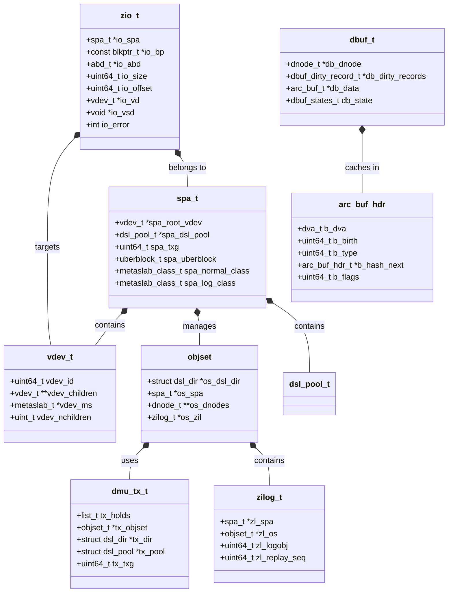

# ZFS — Pooled Storage and Copy-on-Write Filesystem
<!-- This file is auto-generated by generate-doc.py -- do not edit manually -->

---
**Navigation:**
  **Up:** [Kernel Core — Structure and Entry Point](../../README.md) ▸ [Source Tree — Layout and Conventions](../../../README_internals.md)
  **Related:** [Virtual Memory Subsystem — vm_page, UMA, and Pagers](../../vm/README.md) | [GEOM — Storage Framework](../../geom/README.md) | [VFS — Virtual File System Layer](../../fs/README.md)
  **All chapters:** [Source Tree — Layout and Conventions](../../../README_internals.md) | [Boot Process — UEFI Bootloader to Kernel Handoff](../../../stand/efi/loader/README.md) | [Kernel Core — Structure and Entry Point](../../README.md) | [Build System — buildworld and buildkernel](../../../share/mk/README.md) | [Virtual Memory Subsystem — vm_page, UMA, and Pagers](../../vm/README.md) | [Process Management — Scheduling and Lifecycle](../../kern/README_process.md) | [Locking Primitives — Mutexes, sx, rmlocks, and Atomics](../../kern/README_locking.md) | [Buffer Cache — Block I/O Subsystem](../../vm/README_bcache.md) ...
---


> ⚠ **UNVERIFIED DRAFT** — reviewer did not explicitly approve this draft. Treat claims as suspect until manually reviewed.


## Quick Summary

ZFS (Zettabyte File System), shipped in FreeBSD as OpenZFS, is a combined file system and volume manager that fundamentally rethinks how storage is organized. Rather than treating disk devices as fixed-size containers requiring manual partitioning, ZFS introduces the concept of a *storage pool* — an abstract aggregate of one or more physical devices (called vdevs) that provides a contiguous namespace. On top of this pool, ZFS implements a copy-on-write (COW) file system where every write allocates new blocks and updates metadata atomically through transaction groups, eliminating the need for traditional file system journaling while providing snapshot and clone capabilities at the core.

The architecture is deeply layered. At the top sits the ZFS POSIX Layer (ZPL), which bridges VFS operations into the DMU (Data Management Unit) — a transactional object layer that views all data as typed objects with variable-sized blocks. Below the DMU lies the DSL (Dataset/Snapshot Layer), which manages dataset creation, snapshots, and send/receive operations. The ZIL (Intent Log) provides synchronous write durability by recording transaction records to a dedicated log before they are committed to the pool. The ZIO (I/O Pipeline) decomposes high-level operations into parallel I/O requests, while the ARC (Adaptive Replacement Cache) serves as ZFS's own buffer cache, bypassing the FreeBSD buffer cache entirely by caching data in its own LRU-based structure.

ZFS's design choices reflect a deliberate departure from traditional Unix file systems. By caching exclusively in the ARC rather than the FreeBSD buffer cache, ZFS gains full control over block replacement policies and can implement features like deduplication, compression, and encryption without fighting the kernel's page cache. Transaction groups batch writes into atomic units that sync periodically, and the copy-on-write semantics mean that every update — including metadata — is written to new blocks, with the old blocks freed only after the transaction commits. This approach simplifies crash recovery (the pool is always in a consistent state) but requires careful management of space reclamation.

## Architecture

The ZFS architecture in FreeBSD follows a strict layering model, each with well-defined responsibilities and interfaces.

### VDEV Layer — Storage Virtualization

The vdev layer (`sys/contrib/openzfs/module/zfs/vdev.c`, `sys/contrib/openzfs/module/os/freebsd/zfs/vdev_geom.c`) abstracts physical storage devices into virtual devices. FreeBSD integrates with ZFS through GEOM, the kernel's storage framework. The `vdev_geom.c` file implements the GEOM provider for ZFS vdevs, translating ZFS I/O requests into GEOM bio operations. Vdevs can be organized into top-level vdevs (TLVs), which can be mirrors, RAID-Z configurations, or single disks. Each vdev contains metaslabs — logical partitions that manage space allocation independently, enabling parallel allocation across devices.

```c
// From sys/contrib/openzfs/include/sys/vdev.h
typedef struct vdev {
    uint64_t vdev_id;
    uint64_t vdev_guid;
    struct vdev *vdev_parent;
    struct vdev **vdev_children;
    uint_t vdev_nchildren;
    struct metaslab *vdev_ms;
    // ... many more fields
} vdev_t;
```

The vdev hierarchy forms a tree rooted at the pool's top-level vdevs. Each leaf vdev (a physical disk or partition) exposes a byte-addressable storage space, while intermediate vdevs (mirrors, RAID-Z) distribute I/O across their children according to their redundancy strategy.

### SPA — Storage Pool Allocator

The SPA layer (`sys/contrib/openzfs/module/zfs/spa.c`) manages the pool's global state, including space allocation, configuration persistence, and the uberblock — a single on-disk structure that records the pool's checkpoint state. The `struct spa` structure (defined in `sys/contrib/openzfs/include/sys/spa_impl.h`) is the central data structure for a pool, containing references to all vdevs, metaslabs, and the DMU state.

The SPA handles pool creation, import, export, and destruction. It reads the pool configuration from disk (stored as a packed nvlist in the vdev labels) and reconstructs the in-memory representation. The uberblock, written at the beginning of each vdev, allows the pool to survive partial failures — if one vdev is damaged, the uberblock can be recovered from another.

### DMU — Data Management Unit

The DMU (`sys/contrib/openzfs/module/zfs/dmu.c`) is ZFS's object layer. All data — user files, directories, metadata — is stored as typed objects within the DMU. Each object has a type (defined by `dmu_object_type_t` in `sys/contrib/openzfs/include/sys/dmu.h`), a block size, and a number of blocks. The DMU provides transactional semantics: writes are associated with a transaction (`dmu_tx_t`), and all changes in a transaction are either committed together or rolled back.

```c
// From sys/contrib/openzfs/include/sys/dmu_tx.h
typedef struct dmu_tx {
    list_t tx_holds;
    objset_t *tx_objset;
    struct dsl_dir *tx_dir;
    struct dsl_pool *tx_pool;
    uint64_t tx_txg;
    // ... transaction state
} dmu_tx_t;
```

The DMU operates on objects identified by object numbers within an objset. An objset (`sys/contrib/openzfs/include/sys/dmu_objset.h`) represents a dataset (filesystem or volume) and contains a collection of objects. The DMU's block pointer structure (`blkptr_t`) encodes the location of each block on disk using DVA (Data Virtual Address) tuples, supporting mirroring and RAID-Z through multiple DVAs per block.

### DSL — Dataset/Snapshot Layer

The DSL (`sys/contrib/openzfs/module/zfs/dsl/`) manages datasets, snapshots, and clones. It sits above the DMU and provides the namespace hierarchy. Each dataset has a unique object number and is represented by a `struct dsl_dir` structure. Snapshots are implemented by freezing an objset's state at a transaction group boundary — the snapshot's root block pointer is recorded, and all subsequent writes go to new blocks while the snapshot's blocks remain unchanged.

The DSL also handles ZFS send/receive operations, which stream dataset changes between pools. The `dmu_send.c` and `dmu_recv.c` files implement the protocol for sending incremental or full dataset streams, with support for compression, deduplication, and encryption.

### ZIL — Intent Log

The ZIL (`sys/contrib/openzfs/module/zfs/zil.c`) provides synchronous write durability. When an application issues a synchronous write (via `fsync()`, `O_SYNC`, or `O_DSYNC`), the ZIL records a transaction record (itx) that contains enough information to replay the operation after a crash. These records are written to the on-disk ZIL before the data blocks are committed to the pool.

```c
// From sys/contrib/openzfs/include/sys/zil.h
typedef struct zilog {
    spa_t *zl_spa;
    objset_t *zl_os;
    uint64_t zl_logobj;
    uint64_t zl_replay_seq;
    // ... ZIL state
} zilog_t;
```

The ZIL can be backed by dedicated log vdevs (slogs), embedded slog metaslabs within normal vdevs, or the pool's normal space. Dedicated log vdevs provide the best performance for synchronous workloads by isolating log writes from data I/O.

### ZIO — I/O Pipeline

The ZIO layer (`sys/contrib/openzfs/module/zfs/zio.c`) is the I/O abstraction that decomposes high-level operations into parallel I/O requests. A `struct zio` structure represents an I/O operation and contains a tree of child zios that are executed in parallel where possible. The ZIO pipeline includes stages for checksumming, compression, encryption, and RAID-Z computation.

```c
// From sys/contrib/openzfs/include/sys/zio.h
typedef struct zio {
    spa_t *io_spa;
    const blkptr_t *io_bp;
    abd_t *io_abd;
    uint64_t io_size;
    uint64_t io_offset;
    vdev_t *io_vd;
    void *io_vsd;
    int io_error;
    // ... I/O state and callbacks
} zio_t;
```

The ZIO pipeline is event-driven: each stage registers a completion callback that is invoked when the stage finishes. This allows the pipeline to process multiple I/Os concurrently while maintaining the correct ordering of operations.

### ARC — Adaptive Replacement Cache

The ARC (`sys/contrib/openzfs/module/zfs/arc.c`) is ZFS's own buffer cache, implemented entirely in kernel space. Unlike the FreeBSD buffer cache, which caches file data in vm_pages, the ARC caches ZFS blocks in its own structures (`arc_buf_hdr_t` in `sys/contrib/openzfs/include/sys/arc_impl.h`). This design gives ZFS full control over replacement policies and enables features like block-level deduplication and compression without fighting the kernel's page cache.

The ARC implements the MRU/MFU (Most Recently Used / Most Frequently Used) replacement algorithm from the Megiddo and Modha FAST 2003 paper. It maintains four lists: MRU ghost, MRU, MFU ghost, and MFU. When a block is accessed, it is added to the MRU list. If it is accessed again while in the MRU list, it moves to the MFU list. Eviction preferentially removes blocks from the ghost lists, which track recently evicted blocks to prevent thrashing.

```c
// From sys/contrib/openzfs/include/sys/arc.h
struct arc_prune {
    arc_prune_func_t *p_pfunc;
    void *p_private;
    uint64_t p_adjust;
    list_node_t p_node;
    zfs_refcount_t p_refcnt;
};
```

The ARC size is dynamically adjusted based on system memory pressure. When the system experiences memory pressure, the ARC shrinks by evicting blocks from its lists. When memory is available, the ARC grows to cache more data. This self-tuning behavior eliminates the need for manual cache size configuration.

### ZPL — ZFS POSIX Layer

The ZPL (`sys/contrib/openzfs/module/os/freebsd/zfs/zfs_vnops_os.c`) bridges VFS operations into the DMU. It implements the FreeBSD VFS operations vector, translating `open()`, `read()`, `write()`, `ioctl()`, and other VFS calls into DMU operations. The ZPL also implements ZFS-specific features like ACLs (`zfs_acl.c`), extended attributes, and the `.zfs` control directory for snapshot access.

## Key Data Structures

### `blkptr_t` — Block Pointer

The `blkptr_t` type (defined in `sys/contrib/openzfs/include/sys/spa.h`) describes a single data block on disk. It encodes the block's location using DVA (Data Virtual Address) tuples, birth timestamp, checksum, and compression information. Each block can have up to 3 DVAs (for mirroring or RAID-Z). The `blk_prop` field encodes multiple bitfields: checksum algorithm, compression type, number of copies, and whether the block is embedded (data stored directly in the block pointer for small blocks).

### `struct arc_buf_hdr` — ARC Header

Defined in `sys/contrib/openzfs/include/sys/arc_impl.h`, the `arc_buf_hdr_t` is the ARC's primary data structure. It tracks a cached block's metadata, including its DVA, state, and reference counts.

```c
// From sys/contrib/openzfs/include/sys/arc_impl.h
struct arc_buf_hdr {
    dva_t b_dva;                /* DVA of the cached block */
    uint64_t b_birth;           /* Transaction group when block was created */
    uint64_t b_type;            /* DMU object type */
    uint8_t b_complevel;        /* Compression level */
    arc_buf_hdr_t *b_hash_next; /* Hash chain link */
    uint64_t b_flags;           /* ARC flags */
    // ... state management fields
};
```

The ARC uses a hash table keyed by DVA to quickly locate cached blocks. Each header is also placed on one of the four ARC lists (MRU/MFU ghost/data) based on its access pattern.

### `dbuf_dirty_record` — Dirty Record Tracking

Defined in `sys/contrib/openzfs/include/sys/dbuf.h`, the `dbuf_dirty_record` structure tracks which data blocks have been modified but not yet synced. It sits within the DMU's buffer cache and provides block-level caching with dirty record tracking for copy-on-write updates.

```c
// From sys/contrib/openzfs/include/sys/dbuf.h
typedef struct dbuf_dirty_record {
    list_node_t dr_dirty_node;      /* Link on parent's dirty list */
    uint64_t dr_txg;                /* Transaction group for sync */
    zio_t *dr_zio;                  /* Outstanding write I/O */
    struct dmu_buf_impl *dr_dbuf;   /* Back pointer to dbuf */
    dnode_t *dr_dnode;              /* Associated dnode */
    blkptr_t dr_bp_copy;            /* Copy of the block pointer */
    // ... dirty record state
} dbuf_dirty_record_t;
```

Dirty records track which blocks have been modified but not yet synced. When a transaction group syncs, the DMU walks the dirty records and issues ZIO writes for each modified block.

### `struct zio` — I/O Operation

Defined in `sys/contrib/openzfs/include/sys/zio.h`, the `struct zio` structure represents a single I/O operation in the ZIO pipeline. ZIOs form a tree structure, with parent zios spawning child zios for parallel execution.

```c
// From sys/contrib/openzfs/include/sys/zio.h
typedef struct zio {
    spa_t *io_spa;                /* Associated pool */
    const blkptr_t *io_bp;        /* Block pointer (for writes) */
    abd_t *io_abd;                /* Data buffer */
    uint64_t io_size;             /* I/O size */
    uint64_t io_offset;           /* Offset within the block */
    vdev_t *io_vd;                /* Target vdev */
    void *io_vsd;                 /* Vdev-specific data */
    int io_error;                 /* I/O error code */
    // ... I/O state, callbacks, and child zios
} zio_t;
```

The ZIO pipeline processes I/Os through multiple stages: checksum computation, compression, encryption, RAID-Z parity calculation, and finally submission to the vdev layer. Each stage can be executed in parallel for different child zios.

## Deep Dive

### Transaction Groups and Copy-on-Write

ZFS's transaction group (txg) mechanism is the foundation of its copy-on-write semantics. All writes are associated with a transaction group, which is a monotonically increasing counter that batches changes together. When a transaction group syncs, all modifications are written atomically to disk.

```c
// From sys/contrib/openzfs/module/zfs/dmu.c
// dmu_write() associates data with a transaction group
dmu_write(dmu_obj_t *os, uint64_t object, uint64_t offset, uint64_t size,
          const void *buf, dmu_tx_t *tx)
{
    // 1. Allocate space in the transaction group
    // 2. Copy data into the ARC (creating dirty records)
    // 3. The dirty records will be written when the txg syncs
}
```

The txg sync process (`spa_sync()` in `sys/contrib/openzfs/module/zfs/spa.c`) performs multiple passes:

1. **Pass 1**: Sync dirty metaslabs and log blocks
2. **Pass 2**: Sync dirty objsets and datasets
3. **Pass 3**: Sync free space accounting
4. **Pass 4+**: Sync deferred frees (blocks that were freed in previous txgs but whose space hasn't been reclaimed yet)

The deferred free mechanism is crucial for copy-on-write file systems. When a block is overwritten, the old block is not immediately freed — it is added to a free list and reclaimed in a later transaction group. This ensures that snapshots referencing the old block remain valid.

### The ARC vs FreeBSD Buffer Cache

ZFS deliberately bypasses the FreeBSD buffer cache by implementing its own cache (the ARC). This design choice has several implications:

1. **No double-caching**: Data is not cached in both the ARC and FreeBSD's vm_page cache. The ARC manages its own memory allocations and does not use vm_pages for data storage.

2. **Full control over replacement**: The ARC implements the MRU/MFU algorithm independently, without being affected by the kernel's page daemon. This allows ZFS to optimize for block-level access patterns rather than page-level patterns.

3. **Direct I/O integration**: ZFS's direct I/O path (`dmu_direct.c`) bypasses the ARC entirely, reading/writing directly to/from user buffers. This is important for applications that manage their own caching.

```c
// From sys/contrib/openzfs/module/zfs/arc.c
// ARC eviction is triggered by memory pressure or explicit cache management
arc_evict_state(arc_state_t *state, uint64_t space_needed, uint64_t *evicted)
{
    // Evict evictable blocks from the state's list
    // Blocks are only evictable when b_refcnt == 0
    // The ghost lists track recently evicted blocks to prevent thrashing
}
```

### ZIL and Synchronous Writes

The ZIL provides durability for synchronous writes by recording transaction records before the data blocks are committed. The flow for a synchronous write is:

1. Application calls `write()` with `O_SYNC` or `fsync()`
2. ZIL records a transaction record (itx) containing the write operation
3. The itx is written to the on-disk ZIL (either on a dedicated log vdev or embedded slog)
4. Once the ZIL write completes, the application's write is considered complete
5. The data blocks are written to the pool in the next txg sync

```c
// From sys/contrib/openzfs/module/zfs/zil.c
// zil_commit() is called for synchronous writes
zil_commit(zilog_t *zilog, uint64_t txg)
{
    // 1. Record the transaction in the in-memory ZIL
    // 2. If the ZIL block is full or timeout reached, write it to disk
    // 3. Wait for the ZIL write to complete (for sync writes)
}
```

The ZIL can be backed by dedicated log vdevs (slogs), which provide the best performance by isolating log writes from data I/O. If no dedicated log is available, ZFS uses embedded slog metaslabs within normal vdevs. As a last resort, log blocks are allocated from the pool's normal space.

### ZIO Pipeline Parallelism

The ZIO pipeline decomposes high-level operations into parallel I/O requests. For example, a RAID-Z write is decomposed into multiple child zios — one for each data block and one for each parity block. These child zios are executed in parallel, maximizing I/O throughput.

```c
// From sys/contrib/openzfs/module/zfs/zio.c
// zio_wait() blocks until all child zios complete
zio_wait(zio_t *zio)
{
    // Wait for all child zios to complete
    // Propagate errors up the zio tree
    // Invoke the completion callback
}
```

The ZIO pipeline also handles error recovery. If a child zio fails, the parent zio can attempt recovery (e.g., reading from a mirror copy) before reporting the error to the DMU layer.

## Flow / Diagram



## Advanced Notes

### Debugging with DTrace

FreeBSD's DTrace integration with ZFS provides probes for debugging and performance analysis. ZFS exports DTrace SDT probes that can be used to trace ZFS behavior in real-time without modifying kernel code. These probes are available through the DTrace framework and can be enabled using the `dtrace` command-line tool.

### Performance Considerations

1. **TXG sync timing**: The default txg timeout is 5 seconds, but can be tuned via `zfs_sync_delay_sec`. Shorter timeouts reduce data loss risk on power failure but increase write amplification.

2. **ARC size management**: The ARC automatically adjusts its size based on system memory pressure. The `zfs_arc_max` sysctl sets the maximum ARC size (default is 50% of RAM). On systems with large RAM, consider increasing `zfs_arc_max` to cache more data.

3. **Log vdev utilization**: Dedicated log vdevs (slogs) provide significant performance improvements for synchronous workloads. The embedded slog feature (available since OpenZFS 0.8) provides a reasonable fallback when dedicated logs are not available.

4. **Deferred frees**: The deferred free mechanism can cause apparent space exhaustion if many blocks are freed in a short period. The `zfs_free_min_time_diff` sysctl controls the minimum time between free reclaims.

### Common Pitfalls

1. **ARC memory pressure**: If the ARC grows too large, it can cause system-wide memory pressure. Monitor `zfs_arc_c` (current ARC size) and `zfs_arc_mru`/`zfs_arc_mfu` (MRU/MFU list sizes) via `sysctl vfs.zfs.arc.*`.

2. **TXG congestion**: Under heavy write load, the txg can become congested, causing writes to stall. The `zfs_txg_timeout` and `zfs_congested` tunables control this behavior.

3. **ZIL write amplification**: Frequent small synchronous writes can cause excessive ZIL writes. Consider using larger write sizes or batching operations to reduce ZIL overhead.

4. **Pool import failures**: If the uberblock is corrupted, the pool may fail to import. Use `zpool import -F` to attempt recovery from the last known good checkpoint.

### Connection to OS Theory

ZFS's design reflects several fundamental operating system concepts:

- **Transaction groups** implement the ACID properties (Atomicity, Consistency, Isolation, Durability) at the file system level, similar to database transactions.
- **Copy-on-write** eliminates the need for traditional journaling by ensuring that the file system is always in a consistent state — if a crash occurs during a write, the old data remains intact and the new data is simply not yet referenced.
- **The ARC's MRU/MFU algorithm** is an application of the working set theory from operating system textbooks, where frequently accessed pages are retained in the cache while rarely accessed pages are evicted.
- **ZIO parallelism** demonstrates the principle of task decomposition, where a high-level operation is broken into independent sub-operations that can be executed in parallel to maximize throughput.

## See Also
- [VFS — Virtual File System Layer](../../fs/README.md)
- [GEOM — Storage Framework](../../geom/README.md)
- [Virtual Memory Subsystem — vm_page, UMA, and Pagers](../../vm/README.md)


- [`sys/contrib/openzfs/module/zfs/`](module/zfs) — Core ZFS module files
- [`sys/contrib/openzfs/module/os/freebsd/zfs/`](module/os/freebsd/zfs) — FreeBSD-specific ZFS integration
- [`sys/contrib/openzfs/include/sys/`](include/sys) — ZFS header files
- `vm/README.md` — FreeBSD Virtual Memory Subsystem (for comparison with ARC)
- `geom/README.md` — GEOM storage framework (FreeBSD's storage abstraction layer)
- `kern/README_process.md` — Process Management (for understanding DTrace integration)

---

> _Generated by [DaemonDocs](https://github.com/ocochard/DaemonDocs) on 2026-05-04 05:57 UTC using model `Qwen3.6-35B-A3B-UD-Q8_K_XL` (llama.cpp build `b8985-27aef3dd9`). AI-generated content — verify against source before relying on it._
