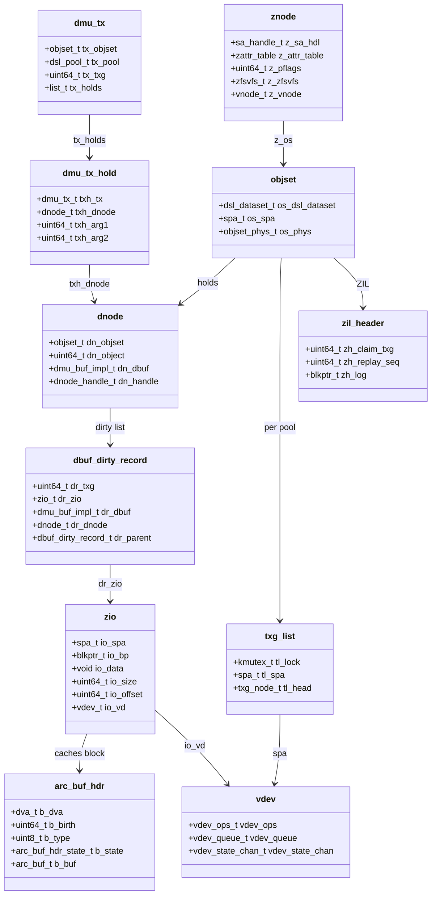

# ZFS — Pooled Storage and Copy-on-Write Filesystem
<!-- This file is auto-generated by generate-doc.py -- do not edit manually -->

---
**Navigation:**
  **Up:** [Kernel Core — Structure and Entry Point](../../README.md) ▸ [Source Tree — Layout and Conventions](../../../README_internals.md)
  **Related:** [Virtual Memory Subsystem — vm_page, UMA, and Pagers](../../vm/README.md) | [GEOM — Storage Framework](../../geom/README.md) | [VFS — Virtual File System Layer](../../fs/README.md)
  **All chapters:** [Source Tree — Layout and Conventions](../../../README_internals.md) | [Boot Process — UEFI Bootloader to Kernel Handoff](../../../stand/efi/loader/README.md) | [Kernel Core — Structure and Entry Point](../../README.md) | [Build System — buildworld and buildkernel](../../../share/mk/README.md) | [System Calls and Image Activation — Entry, sysent, and exec](../../kern/README_syscall.md) | [Kernel Modules and the Linker — KLD, SYSINIT, and linker sets](../../kern/README_kld.md) | [Virtual Memory Subsystem — vm_page, UMA, and Pagers](../../vm/README.md) | [Process Management — Scheduling and Lifecycle](../../kern/README_process.md) ...
---


## Quick Summary

ZFS is a filesystem and volume manager combined into a single layer. Unlike a
traditional stack where a block device (or RAID controller) sits under a
filesystem, ZFS owns the raw disks itself: it groups them into *pools*,
manages redundancy, allocates space, and then presents POSIX files on top. In
FreeBSD this arrives as the OpenZFS tree under
`sys/contrib/openzfs/`, built as kernel modules. The design goal, stated in the
project's own history, is to solve the problems of older storage software —
data corruption from silent bit rot, the inability to safely grow volumes, and
the fragility of separate volume-management and filesystem layers.

The code is organized as a set of named layers, each of which is a directory of
`.c` files in `sys/contrib/openzfs/module/zfs/`. From the top: the **ZPL**
(POSIX layer, `zfs_vnops.c`) translates vnode operations into **DMU** calls.
The **DMU** (Data Management Unit, `dmu.c`, `dmu_objset.c`) is a transactional
object store that hands out fixed-size blocks. Below it the **[ARC](#glossary)**
(Adaptive Replacement Cache, `arc.c`) caches those blocks in memory, and the
**ZIO** (ZFS Input/Output) pipeline (`zio.c`) moves data between the ARC and
the **[vdev](#glossary)** layer (`vdev.c`), which implements RAID (Redundant Array of
Independent Disks) variants such as RAID-Z, as well as mirroring and striping.
The **SPA** (`spa.c`) ties it together: it allocates space, owns the
uberblock, and drives the periodic *transaction group* (`txg`) sync that makes
all pending writes durable at once.

Two ideas make ZFS different from a classical filesystem, and both are visible
in the source. First, **copy-on-write**: nothing is ever modified in place. A
write allocates a new block, writes the data there, and only then — atomically,
at the end of a transaction group — points the metadata at the new block. The
old block becomes garbage. This is what makes snapshots, cloning, and
self-healing possible, and it is why the allocator (SPA) and the transaction
mechanism (DMU + [txg](#glossary)) are inseparable. Second, **the ARC instead of the buffer
cache**: ZFS does not use FreeBSD's [`buf(9)`](../../../share/man/man9/buf.9) [buffer cache](../../vm/README_bcache.md#glossary) for its data. It
keeps its own cache, the ARC, because a copy-on-write filesystem needs to
cache by *block pointer* (which includes a checksum and a birth transaction),
not by the (device, block-number) pair that the buffer cache is keyed on.

This chapter walks those layers from a [`read(2)`](../../../lib/libsys/read.2) down to the disk, explains how
a transaction group batches and commits writes, why the ARC bypasses the buffer
cache, and when the [ZIL](#glossary) (ZFS Intent Log, `zil.c`) actually touches the disk.

## Glossary

**vdev** — a "virtual device": the unit of storage virtualization. A vdev can
be a single disk, a mirror of several disks, a RAID-Z group, or a nested
combination; the SPA is a tree of vdevs.

**DVA** — Data Virtual Address. A `dva_t` is a (vdev, offset, size) triple that
locates one physical copy of a block; a block can have up to three DVAs for
replication.

**DSL** — Data Structure Layer; the on-disk and in-memory layer that manages
the pool's metadata objects, free-space maps, and the scan that reclaims freed
blocks.

**blkptr** — a `blkptr_t` is the on-disk pointer to a block: its DVAs, size,
checksum, compression, and the transaction group in which it was born.

**objset** — the in-memory and on-disk container of one dataset's objects; it
is the DMU's unit of address space and the anchor for a dataset's ZIL.

**dnode** — the per-object metadata (a 512-byte to 16-KB structure) holding an
object's block pointers, its size, and a "bonus" area for filesystem
attributes.

**txg** — transaction group. A numbered, time- or space-bounded batch of
changes; all writes in a txg become durable together when it syncs.

**ARC** — Adaptive Replacement Cache. ZFS's in-memory block cache, keyed by
DVA, that replaces the buffer cache for ZFS data.

**ZIL** — ZFS Intent Log. A per-dataset, write-ahead log of transaction
records, written to disk only for synchronous operations so they survive a
crash.

**slog** — a dedicated, fast "log device" (a vdev) from which ZIL blocks are
preferentially allocated; without one, ZIL blocks come from a reserved
metaslab in the data vdevs.

**itx** — an "intent transaction": the in-memory record of one change, the
thing the ZIL serializes and the DMU transaction applies.

## Architecture

The on-disk and in-memory structure is a strict stack. The top of the stack is
the **ZPL**, the POSIX layer. On FreeBSD it is wired into the VFS through the
vnode operations in `sys/contrib/openzfs/module/zfs/zfs_vnops.c`; the
FreeBSD-specific glue (how a `znode` maps onto a `vnode`, and how pages are
shuttled to and from the VM) lives in
`sys/contrib/openzfs/include/os/freebsd/zfs/sys/zfs_znode_impl.h` and
`.../zfs_vnops_os.h`. The ZPL turns a [`read(2)`](../../../lib/libsys/read.2)/[`write(2)`](../../../lib/libsys/write.2) into DMU calls on a
specific *object* and *offset*.

The **DMU** is the object layer. `sys/contrib/openzfs/module/zfs/dmu.c`
implements `dmu_read`/`dmu_write`; `dmu_objset.c` implements the [objset](#glossary);
`dmu_tx.c` implements the transaction object (`dmu_tx_t`) that every mutation
flows through. The DMU never touches a disk; it reads and writes *blocks*
through the ARC, and it records every change as a `dmu_tx_hold_t` that is
applied when the transaction commits. The DMU sits on top of the **ARC**,
`arc.c`, which is the cache: `arc_read()`/`arc_write()` are the two entry
points the DMU uses. The ARC in turn issues **ZIO**s (`zio.c`) to move blocks
to and from the **vdev** layer (`vdev.c`). The **SPA** (`spa.c`) is the
allocator and the sync engine: it owns the uberblock, allocates space from the
vdev space maps, and runs `spa_sync()` which is what actually flushes a
transaction group to stable storage.

The reason for this particular split is to separate *what* changes (the DMU,
which knows about objects, attributes, and POSIX semantics) from *where* data
lives (the SPA/vdev, which knows about disks, parity, and space). The ZIO
pipeline is the seam between them: a `zio_t` carries a `blkptr_t`, a data
pointer, and a callback, and it is the object that gets compressed,
checksummed, encrypted, and finally written — or read back, checksummed, and
handed to the ARC.

The FreeBSD-specific bridge is worth calling out because it is where "ZFS
bypasses the buffer cache" becomes concrete. FreeBSD's VFS normally moves data
through `vm_page`s and the [`buf(9)`](../../../share/man/man9/buf.9) cache. OpenZFS on FreeBSD instead provides
`dmu_read_pages()` and `dmu_write_pages()` (declared in
`.../os/freebsd/zfs/sys/zfs_vnops_os.h`), which pull and push `vm_page`s
directly into the ARC. The pages are mapped into the user's address space via
the normal `vm_object` for a mounted file, but the *persistent* copy is owned
by the ARC, not the buffer cache. The `zfs_znode_impl.h` header documents the
range-locking contract (`RL_WRITER` for writes and truncation, `RL_READER` for
reads) that makes this safe against concurrent [`write(2)`](../../../lib/libsys/write.2)s.

## Key Data Structures

The transaction object is the heart of the DMU. It is defined in
`sys/contrib/openzfs/include/sys/dmu_tx.h`:

```c
struct dmu_tx {
	list_t tx_holds; /* list of dmu_tx_hold_t */
	objset_t *tx_objset;
	struct dsl_dir *tx_dir;
	struct dsl_pool *tx_pool;
	uint64_t tx_txg;
	uint64_t tx_lastsnap_txg;
	uint64_t tx_lasttried_txg;
	txg_handle_t tx_txgh;
	void *tx_tempreserve_cookie;
	struct dmu_tx_hold *tx_needassign_txh;

	/* list of dmu_tx_callback_t on this dmu_tx */
	list_t tx_callbacks;

	/* placeholder for syncing context, doesn't need specific holds */
	boolean_t tx_anyobj;

	/* transaction is marked as being a "net free" of space */
	boolean_t tx_netfree;

	/* time this transaction was created */
	hrtime_t tx_start;

	/* need to wait for sufficient dirty space */
	boolean_t tx_wait_dirty;

	/* has this transaction already been delayed? */
	boolean_t tx_dirty_delayed;

	/* whether dmu_tx_wait() should return on suspend */
	boolean_t tx_break_on_suspend;

	int tx_err;
};
```

Each mutation a [thread](../../kern/README_process.md#glossary) makes is recorded as a *hold* on the transaction, also
in `dmu_tx.h`. The hold remembers which [dnode](#glossary) it touched and how much space it
will need, so that `dmu_tx_assign()` can decide which transaction group the
change belongs to and reserve space before the change is made:

```c
typedef struct dmu_tx_hold {
	dmu_tx_t *txh_tx;
	list_node_t txh_node;
	struct dnode *txh_dnode;
	zfs_refcount_t txh_space_towrite;
	zfs_refcount_t txh_memory_tohold;
	enum dmu_tx_hold_type txh_type;
	uint64_t txh_arg1;
	uint64_t txh_arg2;
} dmu_tx_hold_t;
```

The transaction groups themselves are tracked per-pool by a small ring of
lists, in `sys/contrib/openzfs/include/sys/txg.h`. There are always three
concurrent states (open, quiescing, syncing), so the ring is sized to the next
power of two:

```c
#define	TXG_CONCURRENT_STATES	3	/* open, quiescing, syncing	*/
#define	TXG_SIZE		4		/* next power of 2	*/
#define	TXG_MASK		(TXG_SIZE - 1)	/* mask for size	*/

typedef struct txg_node {
	struct txg_node	*tn_next[TXG_SIZE];
	uint8_t		tn_member[TXG_SIZE];
} txg_node_t;

typedef struct txg_list {
	kmutex_t	tl_lock;
	size_t		tl_offset;
	spa_t		*tl_spa;
	txg_node_t	*tl_head[TXG_SIZE];
} txg_list_t;
```

Dirty blocks are linked into these lists through a *dirty record*, defined in
`sys/contrib/openzfs/include/sys/dbuf.h`. A dirty record is the unit the sync
walks: it knows which transaction group it belongs to and which `zio_t` is
writing it:

```c
typedef struct dbuf_dirty_record {
	/* link on our parents dirty list */
	list_node_t dr_dirty_node;

	/* transaction group this data will sync in */
	uint64_t dr_txg;

	/* zio of outstanding write IO */
	zio_t *dr_zio;

	/* pointer back to our dbuf */
	struct dmu_buf_impl *dr_dbuf;

	/* list link for dbuf dirty records */
	list_node_t dr_dbuf_node;

	dnode_t *dr_dnode;

	/* pointer to parent dirty record */
	struct dbuf_dirty_record *dr_parent;

	/* How much space was changed to dsl_pool_dirty_space() for this? */
	unsigned int dr_accounted;

	/* A copy of the bp that points to us */
	blkptr_t dr_bp_copy;
	...
} dbuf_dirty_record_t;
```

The ZIL's on-disk header is the smallest of the important structures and is
defined in `sys/contrib/openzfs/include/sys/zil.h`. It points at the head of a
chain of log blocks:

```c
typedef struct zil_header {
	uint64_t zh_claim_txg;	/* txg in which log blocks were claimed */
	uint64_t zh_replay_seq;	/* highest replayed sequence number */
	blkptr_t zh_log;	/* log chain */
	uint64_t zh_claim_blk_seq; /* highest claimed block sequence number */
	uint64_t zh_flags;	/* header flags */
	uint64_t zh_claim_lr_seq; /* highest claimed lr sequence number */
	uint64_t zh_pad[3];
} zil_header_t;
```

Finally, the ZIO carries its per-block properties in a packed `zio_prop_t`
(`sys/contrib/openzfs/include/sys/zio.h`). Its fields — `zp_complevel`,
`zp_level`, `zp_copies`, `zp_gang_copies`, and a set of bit flags
(`zp_type`, `zp_storage_type`, `zp_dedup`, `zp_dedup_verify`, `zp_nopwrite`,
`zp_brtwrite`) — are what tell the pipeline how to treat a block: its level in
the B-tree, its checksum and compression, and whether it is a candidate for
dedup or the birth-time reftree.

## Deep Dive

**A synchronous write, end to end.** Start in the ZPL. `zfs_fsync()` in
`sys/contrib/openzfs/module/zfs/zfs_vnops.c` is the simplest synchronous
entry point:

```c
int
zfs_fsync(znode_t *zp, int syncflag, cred_t *cr)
{
	int error = 0;
	zfsvfs_t *zfsvfs = ZTOZSB(zp);

	if (zfsvfs->z_os->os_sync != ZFS_SYNC_DISABLED) {
		if ((error = zfs_enter_verify_zp(zfsvfs, zp, FTAG)) != 0)
			return (error);
		error = zil_commit(zfsvfs->z
```

A data write follows the same shape minus the ZIL commit. The ZPL calls into
the DMU, which first creates a transaction with `dmu_tx_create()` (in
`dmu_tx.c`) and then records the change with a hold. `dmu_tx_hold_dnode_impl()`
in `dmu_tx.c` is representative of how a hold pins a dnode to the transaction:

```c
static dmu_tx_hold_t *
dmu_tx_hold_dnode_impl(dmu_tx_t *tx, dnode_t *dn, enum dmu_tx_hold_type type,
    uint64_t arg1, uint64_t arg2)
{
	dmu_tx_hold_t *txh;

	if (dn != NULL) {
		(void) zfs_refcount_add(&dn->dn_holds, tx);
		if (tx->tx_txg != 0) {
			mutex_enter(&dn->dn_mtx);
			ASSERT0(dn->dn_assigned_txg);
			dn->dn_assigned_txg = tx->tx_txg;
			(void) zfs_refcount_add(&dn->dn_tx_holds, tx);
			mutex_exit(&dn->dn_mtx);
		}
	}

	txh = kmem_zalloc(sizeof (dmu_tx_hold_t), KM_SLEEP);
	txh->txh_tx = tx;
	txh->txh_dnode = dn;
	...
```

The change is not visible to other threads and not on disk yet. The data block
itself is marked dirty through `dbuf_dirty()` (in `dbuf.c`), which attaches a
`dbuf_dirty_record_t` to the dnode's dirty list for the transaction group the
write was assigned to. The new block's contents live in an *anonymous* ARC
buffer — the `arc.c` header comment explains that anonymous buffers "hold dirty
block copies before they are written to stable storage" and "will acquire a
[DVA](#glossary) as they are written and migrate onto the arc_mru list."

**How a transaction group batches and commits.** `dmu_tx_assign()` (in
`dmu_tx.c`) is the gate. It walks the holds, computes the total space the
transaction needs, and picks a target transaction group. If the current open
group is full or the change is large, the assignment is deferred to a later
group (the `tx_wait_dirty` and `tx_dirty_delayed` flags in `dmu_tx_t` track
this throttling). Once assigned, `dmu_tx_commit()` applies the holds: for a
write, it updates the dnode's block pointer to point at the new block. Because
ZFS is copy-on-write, the *old* block is not freed immediately; it is added to
the pool's free list and reclaimed asynchronously by the [DSL](#glossary) (Data Structure
Layer) scan.

The commit is still only in memory. The actual flush happens when the
transaction group *syncs*. The `txg.h` interface exposes `txg_sync_start()` and
`txg_sync_stop()`, and `txg_wait_synced()` for a caller (like `fsync`) that
must block until the group is durable. The sync itself is driven by the SPA:
`spa_sync()` in `spa.c` walks the dirty records for the quiescing group, issues
`zio_write()` for each, and only when all of them complete does it write a new
uberblock that advances the pool's "most recent transaction group" number. That
uberblock write is the atomic commit point: before it, the old [state](../../netpfil/pf/README.md#glossary) is what a
reader sees; after it, the whole group is durable. This is the mechanism that
turns a pile of independent writes into one atomic, crash-consistent step.

**A read, and why it goes through the ARC.** A [`read(2)`](../../../lib/libsys/read.2) lands in the ZPL,
which calls `dmu_read()`, which calls `dbuf_read()` (in `dbuf.c`), which calls
`arc_read()` (in `arc.c`). `arc_read()` looks the block up in the ARC by its
DVA. On a hit it hands the buffer to the callback and returns; on a miss it
issues a `zio_read()` down the ZIO pipeline to the vdev. The block, once read,
is inserted into the ARC and, on a second reference, promoted from the
`mru` (most-recently-used) state to the `mfu` (most-frequently-used) state —
the two-list mechanism described in the `arc.c` header comment, derived from
Megiddo and Modha's FAST 2003 paper. The ARC keeps separate lists for
metadata and for data so that a flood of cold data cannot evict the hot
indirect blocks and dnodes the pool needs to function.

**Why not the buffer cache.** FreeBSD's [`buf(9)`](../../../share/man/man9/buf.9) buffer cache is keyed by
(device, block number) and is managed by the VM. A ZFS block is not identified
by a stable (device, block number): with copy-on-write, the same logical
offset can live at a different physical location after every write, and a
block's identity includes its checksum and birth transaction group. The ARC is
keyed by the DVA and carries the `blkptr_t`, so it can validate a block against
its checksum on read and know exactly which transaction group created it.
Reusing the buffer cache would mean either losing that identity or maintaining
a second, redundant cache. The FreeBSD integration therefore moves `vm_page`s
straight into the ARC via `dmu_read_pages()`/`dmu_write_pages()`, and the
`vm_object` for a mounted file is backed by ARC-backed pages rather than by the
buffer cache. (Direct I/O, controlled by `zfs_dio_enabled` in `zfs_vnops.c`,
is disabled by default on FreeBSD pending a range-locking fix, so the normal
path is the ARC.)

**When the ZIL actually writes.** The `zil.c` header comment states the two
conditions under which an in-memory intent transaction is committed to disk:
either it is "committed to the pool by the DMU transaction group (txg), at
which point they can be discarded," or it is "committed to the on-disk ZIL for
the dataset being modified (e.g. due to an fsync, O_DSYNC, or other
synchronous requirement)." In other words, the ZIL is *not* a write-ahead log
in the database sense for every write. Asynchronous writes rely on the
transaction group's uberblock commit for durability and never touch the ZIL.
Only operations that must survive a crash *before* the next txg sync —
[`fsync(2)`](../../../lib/libsys/fsync.2), `O_DSYNC`/`O_SYNC` writes, and a few metadata operations — are
serialized into the per-dataset ZIL. `zil_commit()` (called from `zfs_fsync()`
above) is what does that: it gathers the pending intent transactions, writes
them into a chain of log blocks (the `zil_chain_t` linked from
`zil_header_t.zh_log`), and waits for the write to complete. Those log blocks
are allocated preferentially from a dedicated log vdev (the "slog"); the
`vdev.c` header comment describes the three sources tried in order — dedicated
log vdevs, "embedded slog metaslabs," and finally normal metaslabs. On a clean
mount, each dataset's on-disk ZIL is replayed to recover the small window of
synchronous operations that had not yet been folded into a transaction group.

## Flow / Diagram



## Advanced Notes

**Debugging with DTrace.** OpenZFS ships an SDT [probe](../../kern/README_driver.md#glossary) set; the FreeBSD header
`sys/contrib/openzfs/include/os/freebsd/zfs/sys/trace_zfs.h` declares the
probes (e.g. around `dmu_tx_assign`, `arc_read`, and the ZIL commit path). The
kstat surfaces are the cheapest first stop: `dmu_tx_stats` (defined in
`dmu_tx.c`, with counters like `dmu_tx_assigned`, `dmu_tx_delay`, and
`dmu_tx_dirty_throttle`) tells you whether writers are being held back by the
dirty-space throttle, and the ZIL's `zil_stats` (in `zil.c`, with
`zil_commit_count`, `zil_commit_stall_count`, and `zil_commit_waiter_count`)
tells you whether synchronous commits are stalling. A high `dmu_tx_dirty_delay`
with a low ARC hit rate is the classic signature of a pool that cannot sync
fast enough for its write load.

**Performance and the sync pass.** The ZIO pipeline is where most of the
tunable surface lives. `zio.c` documents a set of `zfs_sync_pass_*` tunables
that control, per sync pass, when deferred frees and compression kick in; the
comment warns that changing them "may introduce subtle performance pathologies
and should only be done in the context of performance analysis." The ARC's
size (`zfs_arc_max`, bounded below by `MIN_ARC_MAX` in `arc.h`) and the
metadata/data split are the two knobs that matter most for latency. Because
metadata is kept in its own ARC lists, a metadata-heavy workload (many small
files) is far more sensitive to ARC size than a sequential-data workload.

**Pitfalls.** Three things trip people up. First, the ZIL is not a general
write-ahead log: assuming that `O_DSYNC` is the only thing that uses it, and
then being surprised that an `fsync` on a dataset without a [slog](#glossary) is slow, is a
common mistake — the `vdev.c` comment makes clear that without a dedicated log
vdev the ZIL shares space with the data vdevs. Second, copy-on-write means a
"free" is not immediate: freed blocks are queued (the `bptree.c` header
describes the pool's queue of root block pointers from destroyed datasets,
freed asynchronously by the DSL scan), so `zfs` used-space does not drop the
moment you `rm` a file. Third, the FreeBSD page-cache bridge is the one place
the generic OpenZFS code diverges: the range-locking rules in
`zfs_znode_impl.h` (whole-file `RL_WRITER` for truncation, ranged `RL_WRITER`
for writes, `RL_READER` for reads) are what keep `dmu_write_pages()` from
corrupting a file under concurrent [`write(2)`](../../../lib/libsys/write.2), and they are why Direct I/O is
off by default on this platform.

**Connection to OS theory.** The ARC is a direct, if heavily adapted,
instantiation of the second-chance / two-list replacement idea found in
standard textbooks: the `mru`/`mfu` split approximates the frequency-vs.-
recency trade-off that a plain LRU gets wrong on scan-like workloads, and the
"ghost" lists (`mru_ghost`, `mfu_ghost`) are the bookkeeping that lets a
one-time reference be distinguished from a repeated one. The transaction
group is the filesystem analogue of a database commit: the holds in
`dmu_tx_t` are the read-set/write-set, `dmu_tx_assign()` is the decision of
which commit point a change joins, and the uberblock write in `spa_sync()` is
the durable commit record. The ZIL, used only for synchronous operations, is
the write-ahead log that fills the gap between a user's `fsync` and the next
group's commit — exactly the role a WAL plays when a transaction must be
durable before the checkpoint.

## See Also
- [VFS — Virtual File System Layer](../../fs/README.md)
- [GEOM — Storage Framework](../../geom/README.md)
- [Virtual Memory Subsystem — vm_page, UMA, and Pagers](../../vm/README.md)


- [`sys/contrib/openzfs/module/zfs/`](module/zfs) — the DMU, ARC, ZIO, SPA, vdev, and ZIL
  implementation files read in this chapter.
- [`sys/contrib/openzfs/include/sys/`](include/sys) — the core headers: `dmu_tx.h`, `txg.h`,
  `dbuf.h`, `arc.h`, `zio.h`, `vdev_impl.h`, `zil.h`, `dnode.h`,
  `dmu_objset.h`.
- [`sys/contrib/openzfs/include/os/freebsd/zfs/sys/`](include/os/freebsd/zfs/sys) — the FreeBSD-specific
  bridge: `zfs_znode_impl.h`, `zfs_vnops_os.h`, `trace_zfs.h`.
- The VFS and vnode layer that the ZPL plugs into, and the `vm_page`/VM
  machinery that `dmu_read_pages()`/`dmu_write_pages()` move data through.
- Man pages: [`zfs(8)`](man/man8/zfs.8), [`zpool(8)`](man/man8/zpool.8), [`buf(9)`](../../../share/man/man9/buf.9), [`vnode(9)`](../../../share/man/man9/vnode.9).

---

> _Generated by [DaemonDocs](https://github.com/ocochard/DaemonDocs) on 2026-09-04 00:02 UTC using model `Qwen3.8-27B-Q8_0` (llama.cpp build `b10788-e107984bc`). AI-generated content — verify against source before relying on it._
