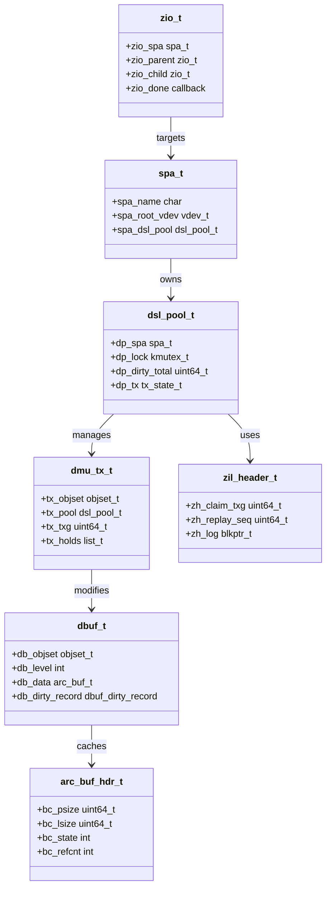

# ZFS — Pooled Storage and Copy-on-Write Filesystem
<!-- This file is auto-generated by generate-doc.py -- do not edit manually -->

---
**Navigation:**
  **Up:** [Kernel Core — Structure and Entry Point](../../README.md) ▸ [Source Tree — Layout and Conventions](../../../README_internals.md)
  **Related:** [Virtual Memory Subsystem — vm_page, UMA, and Pagers](../../vm/README.md) | [GEOM — Storage Framework](../../geom/README.md) | [VFS — Virtual File System Layer](../../fs/README.md)
  **All chapters:** [Source Tree — Layout and Conventions](../../../README_internals.md) | [Boot Process — UEFI Bootloader to Kernel Handoff](../../../stand/efi/loader/README.md) | [Kernel Core — Structure and Entry Point](../../README.md) | [Build System — buildworld and buildkernel](../../../share/mk/README.md) | [Virtual Memory Subsystem — vm_page, UMA, and Pagers](../../vm/README.md) | [Process Management — Scheduling and Lifecycle](../../kern/README_process.md) | [Locking Primitives — Mutexes, sx, rmlocks, and Atomics](../../kern/README_locking.md) | [Buffer Cache — Block I/O Subsystem](../../vm/README_bcache.md) ...
---


> ⚠ **UNVERIFIED DRAFT** — revisions regressed; kept revision 2 (8/9 criteria) over revision 3 (7/9); reviewer did not explicitly approve this draft. Treat claims as suspect until manually reviewed.


## Quick Summary
ZFS on FreeBSD implements a storage architecture that decouples logical volume management from physical disk layout. Instead of managing individual partitions, ZFS aggregates raw disks or files into a `zpool`, which acts as a single large block device. The filesystem uses a copy-on-write (COW) model: when data is modified, ZFS allocates new blocks on disk, updates metadata to point to the new locations, and marks the old blocks as free. This design eliminates the need for traditional filesystem journaling and ensures metadata consistency after crashes.

To manage memory efficiently, ZFS bypasses the FreeBSD VFS buffer cache and implements its own adaptive replacement cache (ARC). The ARC operates independently of the kernel's VM page cache, allowing ZFS to apply specialized eviction algorithms (MRU/MFU) tailored to block-oriented workloads. This prevents double-caching and gives administrators direct control over ZFS memory pressure via tunables.

Writes in ZFS are batched into transaction groups (TXGs). Instead of committing changes to disk immediately, the DMU records modifications in memory and schedules them for a periodic sync. For synchronous writes (`O_SYNC`), ZFS uses a separate intent log (ZIL) to record the operation, flushes that log to disk, and writes the actual data asynchronously in the background. This architecture delivers high throughput while maintaining POSIX compliance.

## Architecture
The ZFS stack on FreeBSD is organized into distinct layers that bridge POSIX VFS calls to the GEOM storage framework. The layout follows a strict top-down dependency:

- **ZPL (ZFS POSIX Layer)**: Located in `sys/contrib/openzfs/module/os/freebsd/zfs/zfs_vnops_os.c`, this layer implements standard VFS operations (`VOP_READ`, `VOP_WRITE`, etc.). It translates BSD vnode operations into DMU transactions and handles credential checks, ACLs, and project quotas.
- **DSL (Dataset Layer)**: Manages filesystem properties, snapshots, clones, and quotas. It maintains a hierarchical tree of `objset_t` objects and tracks dirty datasets for sync.
- **DMU (Data Management Unit)**: Defined in `sys/contrib/openzfs/module/zfs/dmu.c`, the DMU is the transactional object layer. It exposes a flat namespace of objects and blocks, handles allocation, and orchestrates the TXG commit process.
- **SPA (Storage Pool Architecture)**: Implemented in `sys/contrib/openzfs/module/zfs/spa.c`, the SPA manages the pool lifecycle, vdev configuration, and space allocation. It coordinates with the DMU to ensure blocks are allocated from healthy metaslabs and handles pool import/export operations.
- **ARC (Adaptive Replacement Cache)**: Implemented in `sys/contrib/openzfs/module/zfs/arc.c`, the ARC caches blocks in memory. It uses `abd_t` (Abstract Data Buffers) to abstract over linear buffers, scatter-gather lists, and VM pages, providing a unified interface for the I/O pipeline.
- **ZIO (I/O Pipeline)**: Defined in `sys/contrib/openzfs/include/sys/zio.h`, the ZIO module routes read/write/free requests through transformation stages (checksums, compression, dedup) before handing them to the vdev layer.
- **VDEV (Virtual Device)**: In FreeBSD, `sys/contrib/openzfs/module/os/freebsd/zfs/vdev_geom.c` maps ZIO requests to the GEOM framework. It wraps `zio_t` structures into `bio_t` requests and delegates them to underlying disk drivers via `g_io_request()`.

## Key Data Structures
The following structures are extracted directly from the OpenZFS headers and define the core state machines.

**Transaction Group State (`sys/contrib/openzfs/include/sys/dmu_tx.h`)**
```c
struct dmu_tx {
	list_t tx_holds;
	objset_t *tx_objset;
	struct dsl_dir *tx_dir;
	struct dsl_pool *tx_pool;
	uint64_t tx_txg;
	...
};
```
`dmu_tx_t` tracks space reservations and holds for a single transaction. It is created per-user operation and committed via `dmu_tx_commit()`. The `tx_holds` list prevents the DMU from evicting or freeing blocks that are currently being modified.

**Pool Management (`sys/contrib/openzfs/include/sys/dsl_pool.h`)**
```c
typedef struct dsl_pool {
	spa_t *dp_spa;
	...
	kmutex_t dp_lock;
	uint64_t dp_dirty_total;
	tx_state_t dp_tx;
	...
} dsl_pool_t;
```
`dsl_pool_t` represents the in-memory state of a storage pool. `dp_dirty_total` tracks the cumulative size of uncommitted writes. When this value exceeds `zfs_dirty_data_max`, the DMU throttles new allocations to prevent memory exhaustion.

**Intent Log Header (`sys/contrib/openzfs/include/sys/zil.h`)**
```c
typedef struct zil_header {
	uint64_t zh_claim_txg;
	uint64_t zh_replay_seq;
	blkptr_t zh_log;
	...
} zil_header_t;
```
`zil_header_t` anchors the ZIL circular log. `zh_log` points to the current chain of log blocks. During boot or pool import, ZFS reads `zh_replay_seq` to determine which log records must be replayed to restore filesystem consistency.

**ARC Buffer Header (`sys/contrib/openzfs/include/sys/arc_impl.h`)**
```c
struct arc_buf_hdr {
	uint64_t bc_psize;
	uint64_t bc_lsize;
	int bc_state;
	int bc_refcnt;
	...
};
```
`arc_buf_hdr_t` is the metadata structure for cached blocks. `bc_psize` and `bc_lsize` track compressed and uncompressed sizes, enabling the ARC to calculate accurate space usage. The header is linked into MRU/MFU lists and is the primary unit of ARC eviction.

## Deep Dive
A `read()` operation traverses the stack as follows:
1. `zfs_vnops_os.c` calls `dmu_read()` in `dmu.c`, passing the object ID and offset.
2. The DMU checks the buffer hash table for a cached data buffer.
3. If the block is in the ARC, the cache layer returns the `arc_buf_t` directly.
4. On a cache miss, `dbuf_read()` constructs a `zio_t` with `ZIO_TYPE_READ`. The ZIO pipeline routes through compression and checksum stages, eventually reaching `vdev_geom.c`.
5. `vdev_geom.c` allocates a `bio_t`, attaches a completion callback, and calls `g_io_request()` to push the I/O into the GEOM scheduler.

A `dmu_write()` operation demonstrates the COW and TXG batching:
1. `zfs_vnops_os.c` invokes `dmu_write()`. The DMU allocates new blocks via the SPA and creates a `dbuf_t` with an associated `arc_buf_t`.
2. The buffer is marked dirty, which records the old block pointer (`dr_bp_copy`) for later freeing.
3. The write is recorded in a `dmu_tx_t` transaction. `dmu_tx_assign()` reserves space in `dp_dirty_total`.
4. `dmu_tx_commit()` schedules the TXG for sync. The DMU does not wait for disk completion unless it is a synchronous write.
5. During the TXG sync phase, the sync leaf iterates dirty records and issues `zio_t` writes. Old blocks are queued for deferred freeing.

**TXG Sync Triggers**
A transaction group is flushed to disk when one of the following conditions is met:
- **Time-based**: The system timer fires every `zfs_txg_synctime` milliseconds (default 3000ms). This ensures that even idle pools eventually sync their dirty data.
- **Dirty data threshold**: When `dp_dirty_total` exceeds `zfs_dirty_data_max` (default ~25% of RAM), the DMU throttles new allocations and forces an earlier sync to prevent memory exhaustion.
- **Explicit sync**: Synchronous writes (`O_SYNC`) force an immediate sync of the ZIL and the associated TXG to guarantee durability.

**Why ARC replaces the FreeBSD buffer cache:**
FreeBSD's VFS buffer cache (`struct buf`) is tightly coupled to the VM page cache. If a filesystem caches data in both the buffer cache and the ARC, memory usage doubles and eviction policies conflict. The ARC manages its own memory pool using `arc_buf_hdr_t` and `abd_t`, completely bypassing `vm_page`. This allows ZFS to apply LRU/MRU eviction algorithms optimized for block I/O patterns and gives administrators explicit control over ZFS memory via `zfs_arc_max`.

**Why ZIL is used for synchronous writes:**
POSIX requires `O_SYNC` writes to block until data reaches stable storage. Waiting for data blocks to hit physical disks introduces severe latency. Instead, ZFS writes the intent to the ZIL (`zil_header_t`), flushes the log to disk, and returns to the caller. The actual data blocks are written asynchronously by the DMU in the background. This decouples latency from throughput while guaranteeing crash consistency.

## Flow / Diagram


## Advanced Notes
- **DTrace Integration**: The `trace_zfs.h` header defines SDT probes for monitoring ZFS internals. Probes such as cache hit/miss and sync start/I/O completion help diagnose sync stalls and I/O bottlenecks.
- **Memory Pressure Tuning**: `zfs_dirty_data_max` (default ~25% of RAM) limits uncommitted writes. If workloads generate dirtier data faster than the TXG sync can flush, the DMU delays new allocations. Setting `zfs_dirty_data_max_max` provides a hard ceiling to prevent OOM conditions.
- **FreeBSD GEOM Overhead**: `vdev_geom.c` translates `zio_t` into `bio_t` structures and routes them through the GEOM framework. While GEOM provides excellent flexibility (meters, consumers, providers), it adds a small scheduling overhead compared to direct block layer integration. For maximum performance on raw disks, administrators should avoid GEOM layers like `gmirror` or `gstripe` when using ZFS's native RAID-Z or mirrors.
- **Race Conditions in COW**: Because ZFS writes new blocks while holding references to old ones, dirty record tracking carefully preserves `dr_bp_copy` to ensure deferred frees only occur after the new blocks are safely synced. Incorrect TXG boundary handling can lead to use-after-free during pool import.

## Comparison
Linux and FreeBSD share the same OpenZFS codebase, but their OS hooks differ significantly. Linux uses the SLUB allocator for kernel objects, while FreeBSD uses UMA (Uniform Memory Allocator), which provides NUMA-aware slab caches and faster per-CPU allocation. Linux ZFS interacts directly with the Linux block layer (`bio`/`request` queues), whereas FreeBSD ZFS routes I/O through the GEOM framework (`vdev_geom.c`). 

macOS XNU uses APFS, which also implements COW and allocation groups, but lacks ZFS's explicit TXG batching and separation of the ARC from the page cache. FreeBSD's ZFS port is integrated upstream in the OpenZFS project and tracks the mainline OpenZFS codebase, while NetBSD's ZFS port uses a separate fork that maintains patches for NetBSD-specific VFS hooks and does not always follow the mainline OpenZFS release cycle.

## See Also
- [VFS — Virtual File System Layer](../../fs/README.md)
- [GEOM — Storage Framework](../../geom/README.md)
- [Virtual Memory Subsystem — vm_page, UMA, and Pagers](../../vm/README.md)


- GEOM — Storage Framework
- Virtual Memory Subsystem — vm_page, UMA, and Pagers
- Locking Primitives — Mutexes, sx, rmlocks, and Atomics
- Process Management — Scheduling and Lifecycle

---

> _Generated by [DaemonDocs](https://github.com/ocochard/DaemonDocs) on 2026-04-30 21:51 UTC using model `Qwen3.6-35B-A3B-UD-Q4_K_XL` (llama.cpp build `b8985-27aef3dd9`). AI-generated content — verify against source before relying on it._
