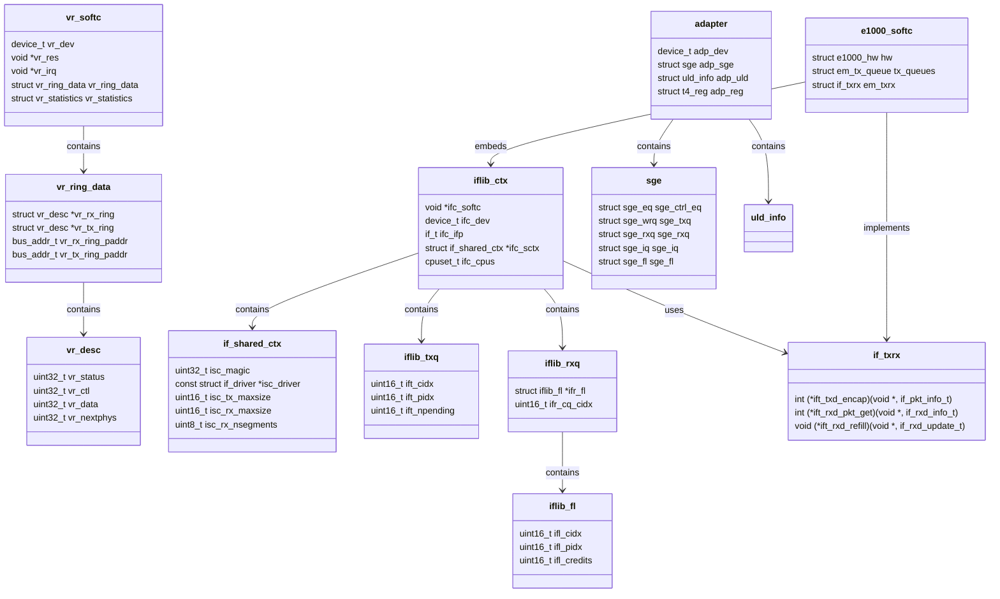

# NIC Drivers — from if_vr to iflib to if_cxgbe
<!-- This file is auto-generated by generate-doc.py -- do not edit manually -->

---
**Navigation:**
  **Up:** [Kernel Core — Structure and Entry Point](../README.md) ▸ [Source Tree — Layout and Conventions](../../README_internals.md)
  **Related:** [Network Stack — Architecture and Packet Flow](../net/README.md) | [Device Driver Framework — newbus and devclass](../kern/README_driver.md) | [Interrupt Handling — Threads, Filters, and Dispatch](../kern/README_intr.md)
  **All chapters:** [Source Tree — Layout and Conventions](../../README_internals.md) | [Boot Process — UEFI Bootloader to Kernel Handoff](../../stand/efi/loader/README.md) | [Kernel Core — Structure and Entry Point](../README.md) | [Build System — buildworld and buildkernel](../../share/mk/README.md) | [Virtual Memory Subsystem — vm_page, UMA, and Pagers](../vm/README.md) | [Process Management — Scheduling and Lifecycle](../kern/README_process.md) | [Locking Primitives — Mutexes, sx, rmlocks, and Atomics](../kern/README_locking.md) | [Buffer Cache — Block I/O Subsystem](../vm/README_bcache.md) ...
---


> ⚠ **UNVERIFIED DRAFT** — revisions regressed; kept revision 1 (5/8 criteria) over revision 2 (3/8); reviewer did not explicitly approve this draft. Treat claims as suspect until manually reviewed.


## Quick Summary

FreeBSD's network interface card (NIC) drivers have evolved considerably over the years, reflecting both changes in hardware complexity and FreeBSD's own efforts to reduce driver development overhead. At one end of the spectrum sits **if_vr**, the VIA Rhine driver written in 1997 — a complete, hand-written driver that manually manages descriptor rings, bus DMA mappings, interrupt handlers, watchdog timers, and MII PHY attachment. At the other end sits **if_cxgbe**, the Chelsio T4/T5/T6 driver, which is also non-iflib but for the opposite reason: the hardware's support for TOE (TCP Offload Engine), RDMA, crypto offload, and NVMe-over-Fabrics creates a partitioned multi-role design that iflib's simple queue/ring model cannot express.

In between these two extremes lies **if_em**, Intel's 1 Gbps Ethernet driver, which has been rewritten as an iflib consumer. By adopting iflib, the driver surrenders ownership of queue management, polling, NUMA buffer pools, multi-queue dispatch, and netmap integration to the framework. In exchange, the driver author writes only a small set of device-specific callbacks: `txd_encap` to prepare transmit descriptors, `rxd_pkt_get` to extract received packets, and a handful of bookkeeping functions. This trade-off — less code, less maintenance, but less control — is the central theme of this chapter.

The heart of the iflib framework lives in **sys/net/iflib.c**, approximately 6000 lines of code that implements a unified abstraction over tx/rx queues, descriptor rings, interrupt handling (`IFLIB_INTR_RX` semantics), and DMA tag management. Understanding iflib's design requires understanding the problems it was created to solve: driver code duplication across dozens of NIC vendors, NUMA-aware buffer allocation, multi-queue scalability, and the increasing complexity of modern hardware offloads.

This chapter walks through all four points on the NIC-driver complexity spectrum, comparing how each handles the fundamental tasks of packet I/O. By examining if_vr's manual descriptor management, if_em's iflib-driven simplicity, iflib's own architecture, and if_cxgbe's necessary independence, we illuminate the trade-offs that shape FreeBSD's networking stack.

## Architecture

### The Pre-iflib Era: if_vr (sys/dev/vr/if_vr.c)

The VIA Rhine driver represents the classic FreeBSD NIC driver pattern that dominated from the mid-1990s through the early 2000s. Written by Bill Paul, it is approximately 2600 lines and implements every aspect of NIC operation manually:

**Device attachment and resource management.** The driver uses the newbus framework: `vr_attach()` allocates PCI memory and I/O regions via `bus_alloc_resource()`, sets up interrupt handlers with `bus_setup_intr()`, and creates the miibus child for PHY management. Each resource is tracked in `struct vr_softc`:

```c
struct vr_softc {
    device_t vr_dev;
    void *vr_res;           /* memory region handle */
    int vr_res_id;
    int vr_res_type;
    void *vr_irq;           /* interrupt handle */
    void *vr_intrhand;      /* intrhand for bus_teardown_intr */
    struct resource *vr_miibus;
    /* ... more fields */
};
```

**Descriptor ring management.** The driver maintains separate TX and RX descriptor rings in `struct vr_ring_data`:

```c
struct vr_ring_data {
    struct vr_desc *vr_rx_ring;
    struct vr_desc *vr_tx_ring;
    bus_addr_t vr_rx_ring_paddr;
    bus_addr_t vr_tx_ring_paddr;
};
```

Each descriptor (`struct vr_desc`) contains status, control, data address, and next-descriptor pointer fields. The driver manually allocates DMA-able memory with `bus_dma_tag_create()` and `bus_dmamap_load()`, tracks head/tail indices, and handles ring wrap-around.

**Transmit path.** `vr_start()` is called when the ifnet transmit queue is non-empty. It chains mbufs into descriptors, sets up bus DMA mappings for each segment, writes the physical address to the descriptor, and advances the TX ring tail index. The driver must handle the "needalign" quirk of some Rhine chips by copying mbuf data to ensure longword alignment.

**Receive path.** The driver allocates a pool of mbufs and chains them through the RX descriptor ring. When an interrupt fires, `vr_intr()` processes completed RX descriptors, extracts the mbuf, strips the descriptor, and passes the packet up via `ether_input()`.

**Watchdog and error handling.** `vr_watchdog()` fires when the transmit queue is stuck, resetting the hardware. The driver also implements MII media status changes through `vr_miibus_statchg()`.

### The iflib Era: if_em (sys/dev/e1000/if_em.c)

Intel's 1 Gbps Ethernet driver (`if_em`) and its successor `igb` (for 82575/82576/I350 chips) have been rewritten as iflib consumers. The driver no longer manages descriptor rings, DMA tags, or interrupt handlers directly. Instead, it provides a small set of callbacks through `struct if_txrx`:

```c
struct if_txrx em_txrx = {
    .ift_txd_encap = em_isc_txd_encap,
    .ift_txd_flush = em_isc_txd_flush,
    .ift_txd_credits_update = em_isc_txd_credits_update,
    .ift_rxd_available = em_isc_rxd_available,
    .ift_rxd_pkt_get = em_isc_rxd_pkt_get,
    .ift_rxd_refill = em_isc_rxd_refill,
    .ift_rxd_flush = em_isc_txd_flush,
    .ift_legacy_intr = em_intr
};
```

**What iflib owns.** The iflib framework manages:
- Queue allocation and initialization
- DMA tag creation and descriptor ring allocation
- Interrupt allocation and handler registration
- Polling mode (via `device_poll`)
- NUMA-aware buffer pool management
- Multi-queue dispatch (RSS hash to queue mapping)
- Netmap integration
- VLAN offload registration

**What the driver owns.** The driver provides:
- `txd_encap`: Takes an `if_pkt_info_t` and fills in the hardware descriptor ring with mbuf physical addresses, offload flags, and checksum settings
- `rxd_pkt_get`: Extracts a received packet from the descriptor ring, populating `if_rxd_info_t` with packet metadata
- `rxd_refill`: Replenishes the receive buffer pool
- `rxd_available`: Reports how many descriptors are free for reception

The driver's `struct e1000_softc` retains hardware-specific state: MAC type, PHY operations, firmware version, and per-queue structures like `struct em_tx_queue` and `struct tx_ring`. But the common plumbing — queue lifecycle, interrupt handling, polling — is entirely iflib's responsibility.

### iflib Itself (sys/net/iflib.c)

iflib is approximately 6000 lines of code in `sys/net/iflib.c` that implements a unified framework for NIC drivers. It was created by Matthew Macy starting in 2014 to eliminate the massive code duplication across FreeBSD's dozens of NIC drivers.

**Core data structures.** iflib imposes a layered abstraction:

```
adapter (per-device)
  └── if_shared_ctx (per-device, shared across all ifnets)
        └── iflib_ctx (per-ifnet, one per interface)
              ├── iflib_txq (per-queue, per-CPU)
              │     └── descriptor ring + DMA tags
              └── iflib_rxq (per-queue, per-CPU)
                    ├── iflib_fl (free list for RX buffers)
                    └── completion queue
```

The `struct iflib_ctx` represents a single ifnet:

```c
struct iflib_ctx {
    void *ifc_softc;      /* driver-specific softc */
    device_t ifc_dev;     /* pci device */
    if_t ifc_ifp;         /* ifnet pointer */
    struct if_shared_ctx *ifc_sctx;
    struct sx ifc_ctx_sx; /* context lock */
    cpuset_t ifc_cpus;    /* CPUs assigned to this context */
};
```

The `struct if_shared_ctx` holds per-device shared state:

```c
struct if_shared_ctx {
    uint32_t isc_magic;
    const struct if_driver *isc_driver;
    uint16_t isc_q_align;
    uint16_t isc_tx_maxsize;
    uint16_t isc_tx_maxsegsize;
    uint16_t isc_tso_maxsize;
    uint16_t isc_tso_maxsegsize;
    uint16_t isc_rx_maxsize;
    uint16_t isc_rx_maxsegsize;
    uint8_t isc_rx_nsegments;
};
```

**Queue management.** iflib creates one or more queue sets (qsets), each containing a TX queue and one or more RX queues. Each `struct iflib_txq` tracks:

```c
struct iflib_txq {
    uint16_t ift_in_use;
    uint16_t ift_cidx;         /* consumer index */
    uint16_t ift_cidx_processed;
    uint16_t ift_pidx;         /* producer index */
    uint16_t ift_gen;
    uint16_t ift_npending;
    uint16_t ift_db_pending;
};
```

The consumer index (`cidx`) tracks how many descriptors have been processed by the hardware; the producer index (`pidx`) tracks how many the driver has filled. The gap between them is the number of pending (in-flight) descriptors.

**Transmit path.** When the stack calls `if_start()`, iflib invokes the driver's `txd_encap()` callback for each mbuf chain. The callback fills in the hardware descriptor ring with physical addresses, checksum flags, TSO parameters, and VLAN tags. iflib then:
1. Updates the producer index
2. Notifies the hardware (doorbell write)
3. Registers a TX completion interrupt if needed

**Receive path.** When packets arrive, the hardware writes descriptors to the RX ring. iflib's interrupt handler or poll function:
1. Calls the driver's `rxd_pkt_get()` to extract packet metadata into `if_rxd_info_t`
2. Replenishes the buffer pool via `rxd_refill()`
3. Passes packets up via `ether_input()`

**Interrupt semantics.** iflib supports multiple interrupt modes:
- `IFLIB_INTR_RX`: Interrupt per RX queue (default)
- `IFLIB_INTR_TX`: Interrupt per TX queue
- Combined modes

The framework handles interrupt coalescing, MSI/MSI-X vector allocation, and interrupt affinity (binding queues to specific CPUs).

**NUMA and buffer pools.** iflib allocates RX buffer pools using UMA zones, with one pool per CPU to minimize contention. The `struct iflib_fl` (free list) tracks available buffers:

```c
struct iflib_fl {
    uint16_t ifl_cidx;
    uint16_t ifl_pidx;
    uint16_t ifl_credits;
    uint16_t ifl_gen;
    uint16_t ifl_rxd_size;
    uint64_t ifl_m_enqueued;
    uint64_t ifl_m_dequeued;
};
```

### The Non-iflib Necessity: if_cxgbe (sys/dev/cxgbe/)

The Chelsio T4/T5/T6 driver (`if_cxgbe`) is a non-iflib driver by necessity, not by choice. While if_vr is pre-iflib (iflib didn't exist when it was written), if_cxgbe is post-iflib but deliberately does not use it because the hardware's capabilities exceed iflib's abstractions.

**Hardware complexity.** Chelsio adapters expose far more than simple NIC functionality:
- **TOE (TCP Offload Engine):** The hardware handles TCP segmentation, checksum offload, and even full TCP state machines
- **RDMA (iWarp/RoCE):** Direct memory access for remote procedure calls
- **Crypto offload:** AES, SHA, and other cryptographic operations
- **NVMe-over-Fabrics:** Storage protocol offload
- **Multiple virtual functions:** SR-IOV support with independent NIC/TOE/RDMA partitions per VF

**Why iflib doesn't fit.** iflib's queue/ring model assumes a simple NIC: one or more TX queues, one or more RX queues, and optional VLAN offload. Chelsio's hardware has:
- **Ingress queues (sge_iq):** Multiple types — firmware event queues, RX packet queues, offload request queues, each with different descriptor formats
- **Egress queues (sge_wrq):** TX queues, offload response queues, management queues
- **Flow tables:** L2T (Layer 2 Table), SMT (SMAC Table), CLIP (Compressed Local IPv6), TPT (Transport Protection Table)
- **Connection tables:** TCB (TCB — TCP Control Block) for TOE, CCB for crypto

The driver's `struct adapter` encapsulates this complexity:

```c
struct adapter {
    device_t adp_dev;
    struct port_info adp_port[MAXPORT];
    struct sge adp_sge;         /* SGE (Scheduler and Gate Engine) state */
    /* ... hundreds more fields */
};
```

The `struct sge` (Scheduler and Gate Engine) manages all queue types:

```c
struct sge {
    struct sge_qset qs[SGE_QSETS];
    struct mtx reg_lock;
};
```

**Upper Layer Drivers (ULDs).** if_cxgbe implements a ULD architecture where each offload service (NIC, TOE, iWarp, NVMeF, crypto) is a separate module that registers with the driver. The driver dispatches incoming CPL (Chelsio Protocol) messages to the appropriate ULD handler.

This architecture is fundamentally incompatible with iflib's single-purpose NIC abstraction. iflib cannot express the concept of a "TCP connection table entry" or a "crypto session" — it only knows about packet queues.

## Key Data Structures

### struct vr_softc (sys/dev/vr/if_vrreg.h)

The VIA Rhine driver's main softc structure. Tracks all device state including resources, rings, and statistics.

```c
struct vr_softc {
    device_t vr_dev;
    void *vr_res;
    int vr_res_id;
    int vr_res_type;
    void *vr_irq;
    void *vr_intrhand;
    struct resource *vr_miibus;
    struct vr_ring_data vr_ring_data[VR_NFRINGS];
    struct vr_statistics vr_statistics;
    /* ... MII state, watchdog timer, ifnet wiring */
};
```

### struct vr_desc (sys/dev/vr/if_vrreg.h)

The hardware descriptor format for both TX and RX rings. Each descriptor is 16 bytes.

```c
struct vr_desc {
    uint32_t vr_status;
    uint32_t vr_ctl;
    uint32_t vr_data;      /* physical address of buffer */
    uint32_t vr_nextphys;  /* physical address of next descriptor */
};
```

### struct iflib_ctx (sys/net/iflib.c)

Represents a single ifnet managed by iflib. Contains the driver's softc pointer and the ifnet itself.

```c
struct iflib_ctx {
    void *ifc_softc;
    device_t ifc_dev;
    if_t ifc_ifp;
    struct if_shared_ctx *ifc_sctx;
    struct sx ifc_ctx_sx;
    cpuset_t ifc_cpus;
};
```

### struct if_shared_ctx (sys/net/iflib.h)

Per-device shared state, common across all ifnets on the same device. Holds DMA parameters, queue alignment, and offload capabilities.

```c
struct if_shared_ctx {
    uint32_t isc_magic;
    const struct if_driver *isc_driver;
    uint16_t isc_q_align;
    uint16_t isc_tx_maxsize;
    uint16_t isc_tx_maxsegsize;
    uint16_t isc_tso_maxsize;
    uint16_t isc_tso_maxsegsize;
    uint16_t isc_rx_maxsize;
    uint16_t isc_rx_maxsegsize;
    uint8_t isc_rx_nsegments;
};
```

### struct iflib_txq (sys/net/iflib.c)

Per-queue TX state. Tracks producer/consumer indices, pending packet count, and generation counters for lock-free access.

```c
struct iflib_txq {
    uint16_t ift_in_use;
    uint16_t ift_cidx;
    uint16_t ift_cidx_processed;
    uint16_t ift_pidx;
    uint16_t ift_gen;
    uint16_t ift_npending;
    uint16_t ift_db_pending;
};
```

### struct iflib_rxq (sys/net/iflib.c)

Per-queue RX state. References the associated free list and completion queue.

```c
struct iflib_rxq {
    struct iflib_ctx *ifr_ctx;
    struct iflib_fl *ifr_fl;
    struct pfil_head *pfil;
    uint16_t ifr_cq_cidx;
    uint16_t ifr_id;
    uint8_t ifr_nfl;
};
```

### struct iflib_fl (sys/net/iflib.c)

Receive buffer free list. Tracks available mbufs and their physical addresses for DMA.

```c
struct iflib_fl {
    uint16_t ifl_cidx;
    uint16_t ifl_pidx;
    uint16_t ifl_credits;
    uint16_t ifl_gen;
    uint16_t ifl_rxd_size;
    uint64_t ifl_m_enqueued;
    uint64_t ifl_m_dequeued;
};
```

### struct adapter (sys/dev/cxgbe/adapter.h)

Chelsio's main adapter structure. Encompasses all hardware blocks: SGE queues, upper layer drivers, register access, and memory windows.

```c
struct adapter {
    device_t adp_dev;
    struct port_info adp_port[MAXPORT];
    struct sge adp_sge;
    /* ... hundreds more fields for TOE, RDMA, crypto, NVMe */
};
```

### struct sge (sys/dev/cxgb/cxgb_adapter.h)

The Scheduler and Gate Engine — Chelsio's internal packet engine that manages all ingress and egress queues.

```c
struct sge {
    struct sge_qset qs[SGE_QSETS];
    struct mtx reg_lock;
};
```

### struct if_txrx (sys/net/iflib.h)

The callback interface that iflib-based drivers implement. Each function pointer is called by iflib at the appropriate point in the TX or RX path.

```c
struct if_txrx {
    int (*ift_txd_encap)(void *, if_pkt_info_t);
    void (*ift_txd_flush)(void *, uint16_t, qidx_t);
    int (*ift_txd_credits_update)(void *, uint16_t, bool);
    int (*ift_rxd_available)(void *, uint16_t, qidx_t, qidx_t);
    int (*ift_rxd_pkt_get)(void *, if_rxd_info_t);
    void (*ift_rxd_refill)(void *, if_rxd_update_t);
    void (*ift_rxd_flush)(void *, uint16_t, uint8_t, qidx_t);
    int (*ift_legacy_intr)(void *);
};
```

## Deep Dive

### if_vr: The Manual Driver

Let's trace through how if_vr handles a transmit operation, step by step.

**Step 1: if_start is called.** When the network stack has packets to send, it calls `if_vr->if_start` (which is `vr_start`). The function checks if the interface is up and if there are packets in the ifnet queue.

**Step 2: Mbuf chaining.** vr_start chains mbufs into a single buffer if necessary (to handle the needalign quirk), then calls `vr_encap` to fill descriptors.

**Step 3: Descriptor filling.** `vr_encap` iterates over the mbuf chain, creating bus DMA mappings for each segment:

```c
error = bus_dmamap_load(vr->vr_dmat, vr->vr_dmamap, m->m_data,
    m->m_len, vr_dmamap_cb, &dmamap_arg, 0);
```

The DMA map callback (`vr_dmamap_cb`) records the physical addresses. vr_encap then writes the physical address into the descriptor's `vr_data` field and sets the control bits.

**Step 4: Ring update.** After filling descriptors, vr_start updates the TX ring tail index and writes it to the hardware register `VR_TXADDR`. This tells the NIC where the new descriptors are.

**Step 5: Interrupt arm.** If the ring is full or the last packet has the interrupt flag set, vr_start enables the TX interrupt by writing to `VR_IMR`.

**Step 6: Receive path.** When a packet arrives, the NIC writes a descriptor to the RX ring and fires an interrupt. `vr_intr()` is called, which checks the interrupt status register `VR_ISR`. For RX completions, vr_intr:
1. Reads descriptors from the RX ring
2. Extracts the mbuf from the descriptor
3. Calls `ether_input()` to pass the packet up the stack
4. Allocates a new mbuf and writes it back to the descriptor

**Step 7: Watchdog.** If the TX queue is stuck (no completion after a timeout), `vr_watchdog()` fires. It resets the hardware by writing to the command register `VR_CR0` and reinitializes the descriptor rings.

This is the complete picture: every aspect of NIC operation is hand-coded in vr. There is no framework, no abstractions, no shared code. Each new NIC driver duplicates this entire pattern.

### if_em: The iflib Consumer

Now let's see how if_em handles the same operations through iflib.

**Step 1: if_start is called.** The ifnet's `if_start` pointer is set by iflib to `iflib_start`. The driver never sees `if_start` directly.

**Step 2: iflib_start calls txd_encap.** iflib iterates over the mbuf chain and calls the driver's `em_isc_txd_encap` callback. This function:
1. Checks TSO (TCP Segmentation Offload) requirements
2. Sets up checksum offload flags
3. Writes physical addresses into the e1000 descriptor ring (`e1000_adv_data_desc`)
4. Writes context descriptors (`e1000_adv_context_desc`) for TSO/VLAN

**Step 3: iflib handles the rest.** After `txd_encap` returns, iflib:
1. Updates the producer index
2. Writes the doorbell register to notify the hardware
3. Registers for TX completion interrupts if needed

**Step 4: Receive path.** When packets arrive, iflib's interrupt handler or poll function:
1. Calls `em_isc_rxd_pkt_get` to extract packet metadata
2. The driver reads the e1000 RX descriptor (`e1000_rx_desc`) and populates `if_rxd_info_t` with packet length, VLAN tag, checksum flags, and RSS hash
3. iflib calls `em_isc_rxd_refill` to replenish the buffer pool
4. iflib passes the packet up via `ether_input()`

The driver's job is reduced to filling in hardware-specific descriptors and extracting packet metadata. All queue management, DMA handling, interrupt setup, and polling are iflib's responsibility.

### iflib: The Framework

Let's examine how iflib manages a TX queue from allocation to completion.

**Queue allocation.** During driver attach, iflib's `iflib_init_ctx` function:
1. Creates a DMA tag for descriptor rings: `bus_dma_tag_create()`
2. Allocates coherent memory for the ring: `bus_dmamem_alloc()` with `BUS_DMA_COHERENT`
3. Initializes the `iflib_txq` structure with zeroed indices
4. Registers the queue with the interrupt subsystem

**TX path.** When `iflib_start` is called:
1. Iterates over mbuf chains in the ifnet queue
2. Calls `txd_encap` for each packet
3. If the ring is full, returns and waits for the next interrupt/poll
4. If interrupts are enabled, arms the TX interrupt

**TX completion.** When the hardware finishes a packet:
1. The NIC writes a status descriptor to the ring
2. iflib's interrupt handler (or poll function) reads the completion queue
3. Updates `ift_cidx` to mark descriptors as processed
4. Calls `m_freem()` on completed mbufs
5. If the ifnet queue was stopped (ring full), calls `if_start()` again

**RX path.** When a packet arrives:
1. The NIC writes a descriptor to the RX ring
2. iflib's interrupt handler reads the descriptor
3. Calls `rxd_pkt_get` to extract metadata
4. Calls `rxd_refill` to replenish buffers
5. Passes the packet up via `ether_input()`

**Interrupt handling.** iflib supports multiple interrupt modes:
- Per-queue interrupts: Each RX queue has its own MSI-X vector
- Combined interrupts: One vector for multiple queues
- Legacy interrupts: Shared INTx

The framework handles interrupt coalescing, vector allocation, and CPU affinity.

### if_cxgbe: The Complex Driver

The Chelsio driver's architecture is fundamentally different from both if_vr and if_em. Let's trace through a TX operation.

**Step 1: if_start is called.** if_cxgbe's `if_start` is `cxgbe_if_start`. It calls `t4_txq_start` to process the ifnet queue.

**Step 2: WR (Work Request) construction.** Unlike iflib's simple descriptor ring, if_cxgbe constructs "work requests" — variable-length sequences of descriptors that can encode complex operations:
- Simple TX: one descriptor with buffer address
- TSO: context descriptor + data descriptors
- Offload: connection table lookup + data descriptors
- Netmap: direct ring access

**Step 3: WR submission.** The driver writes the WR to a write queue (`sge_wrq`), which is a circular buffer of 64-byte entries. Each entry can contain multiple descriptor chunks.

**Step 4: Hardware processing.** The SGE (Scheduler and Gate Engine) reads WRs from the TX queue, fetches data from memory via DMA, and transmits packets. The SGE also handles flow control, scheduling, and traffic shaping.

**Step 5: Completion.** When a packet is transmitted, the SGE writes a completion descriptor to a completion queue. The driver's interrupt handler reads completions and frees mbufs.

**Step 6: Offload processing.** For TOE connections, the flow is different:
1. User space sends a CPL (Chelsio Protocol) message to create a connection
2. The driver allocates a TCB (TCB entry) and sends the request to the firmware
3. The firmware programs the hardware and returns a completion
4. Subsequent packets are handled entirely by the hardware — the driver is not involved

This is why iflib cannot serve if_cxgbe: iflib knows nothing about TCBs, CPL messages, or firmware interaction. The hardware's capabilities are simply outside iflib's abstraction.

## Flow / Diagram



## Advanced Notes

### Debugging with DTrace

FreeBSD's DTrace provides powerful tools for NIC driver debugging:

**Packet counting.** The `dtrace` probes in `sys/net/if.c` fire on every packet:
```
dtrace -n 'netbsd:net:if:input { printf("ifp=%s count=%d", copyinstr(arg0), arg1); }'
```

**Interrupt timing.** The `iflib` driver exports SDT probes for interrupt handling:
```
dtrace -n 'sdt:iflib:intr:* { @latency[probefunc] = quantize(arg0); }'
```

**DMA mapping errors.** Bus DMA failures can be traced with:
```
dtrace -n 'syscall::bus_dmamap_load:entry { printf("dev=%s", copyinstr(arg1)); }'
```

### Performance Implications

**iflib's overhead.** iflib adds a layer of indirection between the driver and hardware. For high-throughput workloads, this overhead can be measurable:
- Function pointer calls for `txd_encap` and `rxd_pkt_get`
- Additional index management (cidx, pidx, gen)
- Lock contention on shared structures

However, iflib's NUMA-aware buffer allocation and multi-queue dispatch typically more than compensate for this overhead on modern hardware.

**if_vr's limitations.** The VIA Rhine driver's single-queue design and lack of hardware offloads make it unsuitable for modern workloads. The needalign quirk forces memory copies for every TX packet, further degrading performance.

**if_cxgbe's complexity cost.** The Chelsio driver's ULD architecture and firmware interaction add latency to connection setup. However, once connections are established, the hardware handles packets entirely in silicon, achieving line rate at 100 Gbps.

### Race Conditions and Pitfalls

**TX ring full.** Both if_vr and iflib must handle the case where the TX ring is full and the ifnet queue must be stopped. The race is between:
1. `if_start` filling the ring and calling `if_qstop`
2. The interrupt handler processing completions and calling `if_qstart`

iflib handles this with the `ifc_ifp->if_flags & IFF_OACTIVE` check and the `ift_npending` counter.

**RX buffer exhaustion.** If the driver cannot allocate mbufs fast enough, the RX ring fills up and packets are dropped. iflib mitigates this with pre-allocated buffer pools and NUMA-local allocation.

**Interrupt coalescing.** Both if_vr and iflib must balance interrupt frequency against CPU usage. Too many interrupts waste cycles; too few increase latency. iflib exposes tunables for interrupt coalescing parameters.

### Connection to OS Theory

NIC drivers illustrate several operating system concepts:

**Buffer management.** The RX free list (`iflib_fl`) is a classic resource pool pattern. Mbufs are allocated in advance and recycled, avoiding allocation latency during packet processing. This is analogous to the kernel's mbuf pool but specialized for DMA-able memory.

**Producer-consumer rings.** The TX and RX descriptor rings are producer-consumer queues with circular buffers. The producer (driver or hardware) writes descriptors; the consumer reads them. The gap between producer and consumer indices determines how many descriptors are in flight.

**Interrupt-driven I/O.** NIC drivers are the canonical example of interrupt-driven I/O. The hardware fires an interrupt when packets arrive; the driver processes them and arms the next interrupt. This pattern appears throughout systems programming.

**Hardware offload.** if_cxgbe illustrates the concept of offloading — moving work from the CPU to specialized hardware. TOE moves TCP processing to the NIC; RDMA moves memory copies to the NIC; crypto offload moves encryption to the NIC. Each offload reduces CPU usage but increases driver complexity.

## See Also
- [Device Driver Framework — newbus and devclass](../kern/README_driver.md)
- [Network Stack — Architecture and Packet Flow](../net/README.md)
- [Interrupt Handling — Threads, Filters, and Dispatch](../kern/README_intr.md)


- [`sys/dev/vr/`](vr) — VIA Rhine driver source
- [`sys/dev/e1000/`](e1000) — Intel E1000 driver source
- [`sys/net/iflib.c`](../net/iflib.c) — iflib framework implementation
- [`sys/net/iflib.h`](../net/iflib.h) — iflib public interface
- [`sys/dev/cxgbe/`](cxgbe) — Chelsio driver source
- [`sys/dev/cxgbe/common/`](cxgbe/common) — Chelsio common code

---

> _Generated by [DaemonDocs](https://github.com/ocochard/DaemonDocs) on 2026-05-03 13:02 UTC using model `Qwen3.6-35B-A3B-UD-Q8_K_XL` (llama.cpp build `b8985-27aef3dd9`). AI-generated content — verify against source before relying on it._
