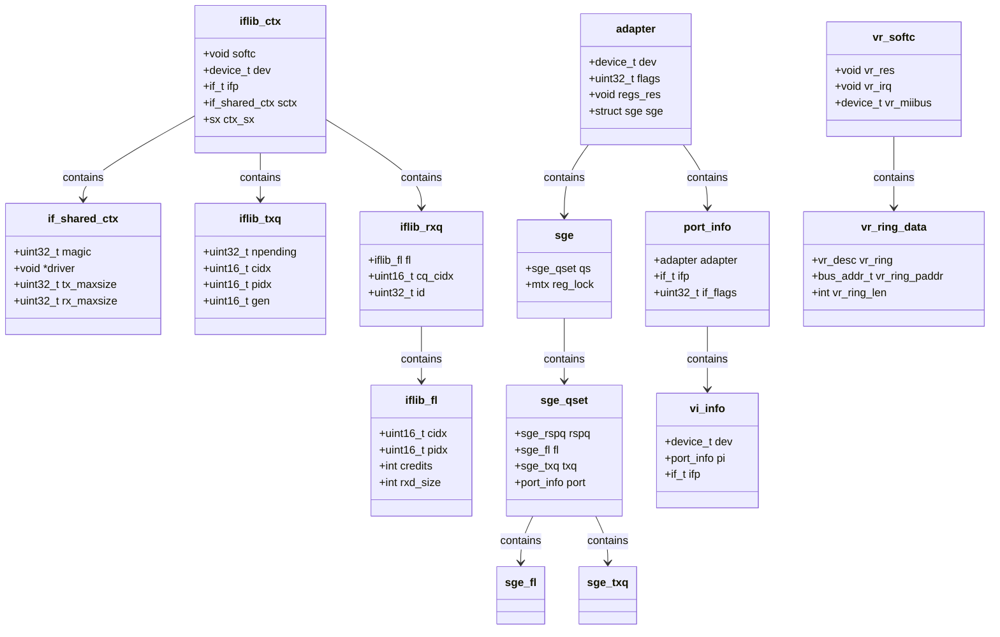

# NIC Drivers — from if_vr to iflib to if_cxgbe
<!-- This file is auto-generated by generate-doc.py -- do not edit manually -->

---
**Navigation:**
  **Up:** [Kernel Core — Structure and Entry Point](../README.md) ▸ [Source Tree — Layout and Conventions](../../README_internals.md)
  **Related:** [Network Stack — Architecture and Packet Flow](../net/README.md) | [Device Driver Framework — newbus and devclass](../kern/README_driver.md) | [Interrupt Handling — Threads, Filters, and Dispatch](../kern/README_intr.md)
  **All chapters:** [Source Tree — Layout and Conventions](../../README_internals.md) | [Boot Process — UEFI Bootloader to Kernel Handoff](../../stand/efi/loader/README.md) | [Kernel Core — Structure and Entry Point](../README.md) | [Build System — buildworld and buildkernel](../../share/mk/README.md) | [Virtual Memory Subsystem — vm_page, UMA, and Pagers](../vm/README.md) | [Process Management — Scheduling and Lifecycle](../kern/README_process.md) | [Locking Primitives — Mutexes, sx, rmlocks, and Atomics](../kern/README_locking.md) | [Buffer Cache — Block I/O Subsystem](../vm/README_bcache.md) ...
---


> ⚠ **UNVERIFIED DRAFT** — revision 3 truncated — kept prior draft; reviewer did not explicitly approve this draft. Treat claims as suspect until manually reviewed.


## Quick Summary

Network interface card (NIC) drivers are the bridge between FreeBSD's network stack and the physical hardware that moves packets across the wire. They must perform a surprisingly large amount of housekeeping: managing DMA descriptor rings, handling interrupts, polling for completed work, configuring hardware filters, negotiating link parameters with the PHY, and integrating with the kernel's ifnet abstraction. The complexity varies dramatically depending on the NIC's capabilities — from a simple 100 Mbps Ethernet controller that does nothing but transmit and receive frames, to a 100 Gbps card that also handles TCP offload, RDMA, and NVMe-over-Fabrics.

FreeBSD's approach to NIC driver development has evolved significantly. Early drivers like if_vr (VIA Rhine) required developers to implement every aspect of NIC management by hand — descriptor ring management, DMA setup, interrupt handlers, watchdog timers, and MII PHY attachment. This was the "everything you need" model, and it worked well for simple hardware. As NIC capabilities grew and multi-queue designs became common, the same patterns repeated across drivers, motivating the creation of iflib — a framework that absorbs the common code and lets drivers focus on hardware-specific details.

However, iflib is not a universal solution. Drivers like if_cxgbe (Chelsio) deliberately avoid iflib because the Chelsio hardware's partitioned multi-role design — where a single chip simultaneously serves as a NIC, TCP offload engine, RDMA target, and crypto accelerator — cannot be expressed in iflib's queue-and-ring abstraction. This creates an interesting spectrum: if_vr represents the pre-iflib era where everything was manual, if_em represents the iflib-fitted modern driver, and if_cxgbe represents hardware so complex that even iflib's abstractions are insufficient.

## Architecture

### The if_vr Model: Everything by Hand

The VIA Rhine driver (`sys/dev/vr/if_vr.c`) is a complete, self-contained NIC driver that predates iflib. It demonstrates every component a traditional FreeBSD NIC driver must implement:

**Device lifecycle:** The driver registers with the PCI subsystem using `DRIVER_MODULE(vr, pci, vr_driver, vr_devclass, NULL, NULL)`. The `vr_attach` function (in `if_vr.c`) is called when a matching PCI device is found. It allocates the `vr_softc` structure via `malloc(sizeof(struct vr_softc), M_DEVBUF, M_NOWAIT | M_ZERO)`, maps PCI memory regions using `bus_alloc_resource`, sets up interrupt handlers with `bus_setup_intr`, and attaches the MII bus via `ifmedia_init`.

**Descriptor rings:** The driver manually manages both transmit and receive descriptor rings. The `vr_desc` structure (`sys/dev/vr/if_vrreg.h`) defines the hardware descriptor format. The driver allocates contiguous DMA memory for each ring using `bus_dmamem_alloc` and `bus_dmamap_load`, then programs the hardware with the physical addresses via the VR_TXADDR and VR_RXADDR registers.

**DMA management:** The driver uses `bus_dma_tag_create` to create DMA tags, `bus_dmamap_create` for individual mappings, and manually manages DMA mappings for each mbuf chain. The `vr_dmamap_arg` structure tracks the relationship between mbufs and DMA mappings.

**Interrupt handling:** The `vr_intr` function (a `void *` handler registered via `bus_setup_intr`) reads the interrupt status register (VR_ISR), processes completed TX descriptors, processes received RX descriptors, and rearms the interrupt. It returns `FILTER_HANDLED` or `FILTER_STRAY`.

**Watchdog timer:** The `vr_tick` function is scheduled via `callout_reset` and serves as a watchdog. If the TX ring stalls, it resets the hardware and logs an error.

**MII PHY:** The driver implements `vr_miibus_readreg`, `vr_miibus_writereg`, and `vr_miibus_statchg` to communicate with the external PHY. These functions are registered with the miibus device as methods.

**ifnet integration:** The driver sets up the `ifnet` structure with function pointers: `if_init` (vr_init), `if_start` (vr_start), `if_stop` (vr_stop), `if_ioctl` (vr_ioctl), and `if_watchdog` (vr_tick). The `vr_init` function allocates RX descriptors, programs hardware filters, and calls `if_start` to begin transmission.

### The if_em Model: iflib as Consumer

The Intel Gigabit Ethernet driver (`sys/dev/e1000/if_em.c`) demonstrates what a driver looks like when it uses iflib as a framework. The driver still provides device-specific code, but iflib now owns the common infrastructure:

**iflib context:** The driver creates an `iflib_ctx` structure via `iflib_device_register`. This structure is the iflib representation of a NIC instance, containing references to the `ifnet`, the driver's private `softc`, and per-queue state.

**Key callbacks:** The driver implements a small set of callbacks that iflib invokes:
- `em_txd_init` / `em_rxd_init`: Initialize TX and RX descriptor rings
- `em_txd_encap`: Encapsulate an mbuf chain into TX descriptors (called from iflib's TX path)
- `em_rxd_pkt_get`: Extract a received packet from RX descriptors and return an mbuf (called from iflib's RX path)
- `em_tx_clean`: Reclaim completed TX descriptors
- `em_rxq_refill`: Refill the RX buffer pool

**Queue management:** iflib creates and manages TX and RX queues. The `struct iflib_txq` represents a TX queue with fields like `ift_cidx` (consumer index), `ift_pidx` (producer index), `ift_npending` (number of pending descriptors), and `ift_db_pending` (deferred buffer release). The `struct iflib_rxq` represents an RX queue with `ifr_cq_cidx` (completion queue consumer index), `ifr_fl` (free list), and `ifr_rx_irq` (interrupt state).

**Free list management:** The `struct iflib_fl` manages the RX buffer pool. It tracks `ifl_cidx` (consumer index), `ifl_pidx` (producer index), `ifl_credits` (available buffers), and `ifl_rxd_size` (size of each RX buffer). iflib's `_rxq_refill_cb` function is called when the free list is low, and the driver's refill callback allocates and maps new mbufs.

**Interrupt handling:** iflib manages interrupt allocation and registration. The driver provides `em_irq_alloc` and `em_irq_free` callbacks, and iflib handles the actual `bus_setup_intr` call. The `struct if_int_delay_info` tracks interrupt moderation settings.

**NUMA awareness:** iflib allocates buffer pools per-CPU to reduce contention on NUMA systems. Each queue set is bound to a specific CPU, and mbufs are allocated from that CPU's UMA zone.

### The iflib Framework: sys/net/iflib.c

The iflib framework itself (`sys/net/iflib.c`, approximately 6000 lines) is the common code that was extracted from individual drivers. It was created by Matthew Macy starting around 2014 to reduce code duplication across NIC drivers.

**Structural overview:**
```
iflib_ctx          -- per-device context (softc, ifnet, shared ctx)
if_shared_ctx      -- shared parameters across all queues (max sizes, capabilities)
iflib_txq          -- per-TX-queue state (cidx, pidx, pending count)
iflib_rxq          -- per-RX-queue state (completion queue index, free list)
iflib_fl           -- RX buffer free list (credits, indices)
```

**Key design decisions:**

1. **Descriptor ring abstraction:** iflib manages the descriptor ring lifecycle — allocation, mapping, and reset — while the driver provides the hardware-specific descriptor format and encap/deencap logic.

2. **TX path:** When `if_start` is called on the ifnet, iflib's `iflib_start` function takes over. It iterates over pending mbufs, calls the driver's `txd_encap` callback to fill descriptors, updates the producer index, and writes to the hardware doorbell.

3. **RX path:** When an RX interrupt fires (or when polling), iflib's `_task_fn_rx` function is scheduled. It calls the driver's `rxd_pkt_get` callback to extract packets from descriptors, performs VLAN tag extraction, and passes packets to `ether_input`.

4. **Completion processing:** The `_iflib_completed_tx_reclaim` function reclaims completed TX descriptors. It calls the driver's TX clean callback and releases mbufs back to the system.

5. **Interrupt semantics:** iflib supports both interrupt-driven and polling modes. The `IFLIB_INTR_RX` flag indicates that the hardware should generate interrupts on RX completion. Interrupt moderation is handled through `if_int_delay_info`.

**Why iflib exists:** Before iflib, every NIC driver implemented the same patterns: descriptor ring management, DMA tag creation, interrupt handler registration, watchdog timers, and ifnet wiring. iflib absorbed all of this common code, reducing driver size by 60-70% and ensuring consistent behavior across drivers.

### The if_cxgbe Model: Too Complex for iflib

The Chelsio T4/T5/T6 driver (`sys/dev/cxgbe/`) deliberately does not use iflib. The reason is not that Chelsio hardware is "more complex" in an absolute sense, but that its design fundamentally conflicts with iflib's abstractions:

**Multi-role partitioning:** A single Chelsio chip can simultaneously serve as:
- A standard NIC (plain Ethernet TX/RX)
- A TCP offload engine (TOE) — handling TCP segmentation, checksum offload, and even full TCP connections
- An iWARP/RDMA target
- A crypto accelerator
- An NVMe-over-Fabrics target

Each role has its own queue sets, descriptor rings, and interrupt handling. The `struct adapter` contains `struct sge` (System Gateway Engine) which manages queue sets, and each `struct sge_qset` contains receive queues, free lists, and TX queues.

**The sge (System Gateway Engine):** The SGE is Chelsio's internal switch that connects the MAC ports to the various offload engines. It uses a complex queue architecture:
- `struct sge_rspq` — response queue (common to all roles)
- `struct sge_fl` — free list for RX buffers
- `struct sge_txq` — TX queue
- `struct sge_ofld_rxq` / `struct sge_ofld_txq` — offload-specific queues

**Why iflib doesn't fit:** iflib assumes a simple model: one (or more) TX/RX queue pairs per interface, with interrupts and polling as the only delivery mechanisms. Chelsio's hardware has:
- Partitioned queue sets that serve different roles simultaneously
- Hardware filters (CLIP table for IPv6 addresses, L2T for ARP, SMT for SMAC)
- Connection tracking for TOE/RDMA
- Multiple independent "virtual interfaces" per physical port

The `struct adapter` in `sys/dev/cxgbe/adapter.h` contains `struct port_info` for each physical port, and each port can have multiple virtual interfaces (`struct vi_info`). Each VI has its own ifnet, but they all share the same underlying SGE resources.

**Alternative architecture:** The cxgbe driver implements its own framework with:
- Custom queue allocation (`alloc_eq`, `alloc_iq`, `alloc_wrq`)
- Custom interrupt handling (FWQ — firmware queue, EQ — event queue)
- Custom netmap support (`cxgbe_netmap_*` functions)
- Custom rate limiting (`cxgbe_rate_tag_*` functions)

## Key Data Structures

### if_vr: Manual Descriptor Management

```c
struct vr_softc {
    void *vr_res;           /* PCI resource handle */
    u_int vr_res_id;        /* PCI resource ID */
    void *vr_irq;           /* interrupt resource */
    void *vr_intrhand;      /* interrupt handler cookie */
    device_t vr_miibus;     /* MII bus device */
    /* ... other fields ... */
};

struct vr_desc {
    u_int32_t addr_lo;      /* lower 32 bits of buffer address */
    u_int32_t addr_hi;      /* upper 32 bits of buffer address */
    u_int16_t status;       /* descriptor status */
    u_int16_t control;      /* descriptor control */
};

struct vr_ring_data {
    struct vr_desc *vr_ring;       /* virtual address of descriptor ring */
    bus_addr_t vr_ring_paddr;      /* physical address */
    int vr_ring_len;               /* number of descriptors */
    int vr_cur;                    /* current descriptor index */
};
```

The `vr_softc` contains everything the driver needs: PCI resources, interrupt handler, MII bus reference, and pointers to the TX and RX ring data structures. The `vr_ring_data` structure tracks the descriptor ring's virtual and physical addresses, length, and current position.

### iflib: Abstraction Layer

```c
struct iflib_ctx {
    void *ifc_softc;          /* driver's private softc */
    device_t ifc_dev;         /* PCI device */
    if_t ifc_ifp;             /* ifnet pointer */
    struct if_shared_ctx *ifc_sctx;  /* shared context */
    struct sx ifc_ctx_sx;     /* context lock */
    /* ... per-CPU and per-queue state ... */
};

struct if_shared_ctx {
    uint32_t isc_magic;       /* magic number for validation */
    void *isc_driver;         /* driver's callback table (opaque) */
    uint32_t isc_tx_maxsize;  /* maximum TX packet size */
    uint32_t isc_rx_maxsize;  /* maximum RX packet size */
    uint32_t isc_rx_nsegments; /* max RX segments */
    /* ... capability flags ... */
};

struct iflib_txq {
    uint32_t ift_npending;    /* number of pending TX descriptors */
    uint16_t ift_cidx;        /* consumer index (completed) */
    uint16_t ift_pidx;        /* producer index (next to transmit) */
    uint16_t ift_gen;         /* generation counter */
    /* ... TX descriptor ring state ... */
};

struct iflib_rxq {
    struct iflib_fl *ifr_fl;  /* free list for RX buffers */
    uint16_t ifr_cq_cidx;     /* completion queue consumer index */
    uint32_t ifr_id;          /* queue ID */
    uint8_t ifr_nfl;          /* number of free lists */
};

struct iflib_fl {
    uint16_t ifl_cidx;        /* consumer index */
    uint16_t ifl_pidx;        /* producer index */
    int ifl_credits;          /* available buffer credits */
    int ifl_rxd_size;         /* size of each RX buffer */
};
```

The `iflib_ctx` is the central structure for an iflib-managed NIC. It contains a reference to the driver's private `softc` (accessible via `ifc_softc`), the `ifnet`, and the shared context (`ifc_sctx`). The shared context holds parameters that are common across all queues, such as maximum packet sizes and capability flags.

The `iflib_txq` and `iflib_rxq` structures represent individual TX and RX queues. The producer index (`ift_pidx` / `ifl_pidx`) tracks where the driver has written descriptors, while the consumer index (`ift_cidx` / `ifl_cidx`) tracks where the hardware has completed processing. The free list (`iflib_fl`) manages RX buffer allocation and tracking.

### if_cxgbe: Multi-Role Hardware

```c
struct adapter {
    device_t dev;             /* PCI device */
    uint32_t flags;           /* adapter flags */
    void *regs_res;           /* register resource */
    void *bh;                 /* bus handle */
    struct bus_dma_tag *bt;   /* DMA tag */
    struct sge sge;           /* System Gateway Engine */
    struct port_info port[CH_MAX_PORTS];  /* per-port info */
    /* ... offload-specific structures ... */
};

struct sge_qset {
    struct sge_rspq rspq;     /* response queue */
    struct sge_fl fl[SGE_RXQ_PER_SET];  /* free lists */
    struct sge_txq txq[SGE_TXQ_PER_SET];/* TX queues */
    struct port_info *port;   /* associated port */
    struct adapter *adap;     /* parent adapter */
    uint32_t qs_flags;        /* queue set flags */
};

struct sge {
    struct sge_qset qs[SGE_QSETS];  /* queue sets */
    struct mtx reg_lock;      /* register access lock */
};

struct port_info {
    struct adapter *adapter;  /* parent adapter */
    if_t ifp;                 /* ifnet for this port */
    uint32_t if_flags;        /* interface flags */
    uint32_t flags;           /* port-specific flags */
    struct mii_softc *phy;    /* PHY softc */
    struct ifmedia media;     /* media state */
};

struct vi_info {
    device_t dev;             /* virtual interface device */
    struct port_info *pi;     /* parent port */
    struct adapter *adapter;  /* parent adapter */
    if_t ifp;                 /* ifnet for this VI */
    /* ... VI-specific state ... */
};
```

The `adapter` structure is the top-level representation of a Chelsio NIC. It contains the `sge` (System Gateway Engine), which manages all queue sets. Each `sge_qset` contains a response queue, free lists, and TX queues. The `port_info` structure represents a physical port, and `vi_info` represents a virtual interface that can be created on top of a physical port.

The key difference from iflib is that the SGE's queue sets are not organized as simple TX/RX pairs. Instead, they are partitioned by role: some queue sets serve plain Ethernet, some serve TOE connections, some serve RDMA, and so on. The same physical queue can be used for multiple purposes depending on how the hardware is configured.

## Deep Dive

### if_vr: Step-by-Step TX Path

Let's trace what happens when a packet is transmitted through the if_vr driver.

**1. if_start is called:**

When the network stack wants to transmit a packet, it calls `if_start` on the ifnet. For if_vr, this is `vr_start`:

```c
static void vr_start(if_t ifp)
{
    struct vr_softc *sc = ifp->if_softc;
    struct mbuf *m;
    int slot;

    if (sc->vr_tx_ring.vr_cur == sc->vr_tx_ring.vr_ring_len)
        return;  /* ring full */

    IF_DEQUEUE(&ifp->if_snd, m);
    if (!m)
        return;

    /* ... copy mbuf to aligned buffer if needed (VR_Q_NEEDALIGN) ... */
    /* ... write descriptors to ring ... */
    /* ... update ring pointer ... */
    /* ... start transmission ... */
}
```

The driver checks if the TX ring has space, dequeues an mbuf from the ifnet's output queue, and writes descriptors.

**2. Descriptor ring management:**

The VR descriptor ring is a circular buffer. The driver maintains `vr_cur` (current slot) and `vr_ring_len` (ring size). When writing a descriptor:

```c
sc->vr_tx_ring.vr_ring[sc->vr_tx_ring.vr_cur].addr_lo = dma_addr;
sc->vr_tx_ring.vr_ring[sc->vr_tx_ring.vr_cur].addr_hi = dma_addr >> 32;
sc->vr_tx_ring.vr_ring[sc->vr_tx_ring.vr_cur].control = VR_DESC_OWNER;
sc->vr_tx_ring.vr_cur = (sc->vr_tx_ring.vr_cur + 1) % sc->vr_tx_ring.vr_ring_len;
```

After writing all descriptors, the driver writes the TX descriptor ring base address to the VR_TXADDR register to start transmission.

**3. Interrupt handling:**

When the hardware completes transmission, it raises an interrupt. The `vr_intr` handler is called:

```c
static int vr_intr(void *arg)
{
    struct vr_softc *sc = arg;
    u_int16_t isr;

    isr = BUS_READ_2(sc, VR_ISR);
    if (!isr)
        return FILTER_STRAY;

    /* Process completed TX descriptors */
    while (sc->vr_tx_ring.vr_cur != sc->vr_tx_ring.vr_next) {
        /* ... check descriptor status ... */
        /* ... free mbuf ... */
        sc->vr_tx_ring.vr_next = (sc->vr_tx_ring.vr_next + 1) % sc->vr_tx_ring.vr_ring_len;
    }

    /* Process received packets */
    vr_rxeof(sc);

    /* Re-arm interrupt */
    BUS_WRITE_2(sc, VR_IMR, VR_IMR_RX | VR_IMR_TX);

    return FILTER_HANDLED;
}
```

The handler reads the interrupt status register, processes completed TX descriptors, calls `vr_rxeof` to process received packets, and re-arms the interrupt.

### if_em: Step-by-Step iflib TX Path

With iflib, the TX path is significantly simplified:

**1. iflib_start takes over:**

When `if_start` is called on the ifnet, iflib's `iflib_start` function is invoked instead of the driver's `em_start`. iflib iterates over pending mbufs and calls the driver's `txd_encap` callback:

```c
static int em_txd_encap(if_ctx_t ctx, iflib_txq_t txq, struct mbuf *m_head)
{
    struct e1000_hw *hw = &adapter->hw;
    struct e1000_tx_desc *txd;
    bus_dma_segment_t segs[E1000_MAX_TX_SEGS];
    int nsegs, error;

    /* Get DMA segments for the mbuf chain */
    error = bus_dmamap_load_scattered(ctx->ifc_dmat, m_head, segs, &nsegs, NULL, BUS_DMA_WRITE);
    if (error)
        return error;

    /* Get next descriptor */
    txd = &txq->txd_ring[txq->pidx];

    /* Fill descriptor */
    txd->buffer_addr = htole64(segs[0].ds_addr);
    txd->cmd_and_length = htole32(E1000_TXD_CMD_EOP | E1000_TXD_CMD_RS | m_head->m_pkthdr.len);
    txd->css = 0;
    txd->special = 0;

    txq->pidx = (txq->pidx + 1) % txq->num_desc;

    return 0;
}
```

The driver's callback receives the mbuf, loads DMA segments, and fills the descriptor. iflib handles the ring management, doorbell writes, and interrupt posting.

**2. Completion processing:**

When TX completion occurs, iflib's `_iflib_completed_tx_reclaim` function is called. It iterates over completed descriptors and calls the driver's `tx_clean` callback:

```c
static void em_tx_clean(if_ctx_t ctx, iflib_txq_t txq)
{
    struct e1000_tx_desc *txd;
    struct mbuf *m;

    while (txq->cidx != txq->pidx) {
        txd = &txq->txd_ring[txq->cidx];

        /* Check if descriptor is done */
        if (le32toh(txd->status) & E1000_TXD_STAT_DD) {
            /* Free mbuf */
            m = txq->tx_desc_mbufs[txq->cidx];
            m_freem(m);

            txq->cidx = (txq->cidx + 1) % txq->num_desc;
        } else {
            break;
        }
    }
}
```

iflib handles the index management and only calls the driver's callback when there are completed descriptors to reclaim.

### iflib: The RX Path

The RX path in iflib is where the framework shows its most significant value. Let's trace the flow:

**1. RX descriptor ring setup:**

During initialization, iflib allocates the RX free list and pre-allocates mbufs. The `iflib_fl` structure tracks which slots have valid buffers:

```c
static int em_rxd_init(if_ctx_t ctx, iflib_rxq_t rxq)
{
    struct iflib_fl *fl = rxq->ifr_fl;
    int i;

    for (i = 0; i < fl->size; i++) {
        struct mbuf *m = m_getcl(M_NOWAIT, MT_DATA, M_PKTHDR);
        if (!m)
            return ENOBUFS;

        /* Map mbuf for DMA */
        bus_dmamap_load_mbuf_scattered(ctx->ifc_dmat, fl->fl_dmamap[i], m, NULL, &nsegs, BUS_DMA_READ);

        /* Write buffer address to descriptor */
        rxq->rxd_ring[i].buffer_addr = htole64(fl->fl_phys[i]);
    }

    fl->pidx = fl->cidx = 0;
    fl->credits = fl->size;

    return 0;
}
```

**2. Interrupt-driven RX:**

When an RX interrupt fires, iflib's `_task_fn_rx` is scheduled (via `gtaskqueue`):

```c
static void _task_fn_rx(void *context, int pending)
{
    struct iflib_rxq *rxq = context;
    struct iflib_ctx *ctx = rxq->ifr_ctx;
    struct iflib_fl *fl = rxq->ifr_fl;
    struct mbuf *m;

    /* Process completed descriptors */
    while (rxq->ifr_cq_cidx != rxq->ifr_pidx) {
        /* Get packet from driver */
        m = rxq->ifr_ops->rxd_pkt_get(ctx, rxq, &rxq->ifr_cq_cidx);
        if (!m)
            break;

        /* Pass to network stack */
        ether_input(&ctx->ifc_ifp, NULL, m);

        /* Refill free list if needed */
        if (fl->credits < fl->size / 2)
            _rxq_refill_cb(ctx, rxq);
    }
}
```

**3. Buffer refill:**

When the free list gets low, `_rxq_refill_cb` is called. This is where iflib's NUMA awareness shines — it allocates mbufs from the appropriate CPU's UMA zone:

```c
static void _rxq_refill_cb(if_ctx_t ctx, iflib_txq_t rxq)
{
    struct iflib_fl *fl = rxq->ifr_fl;
    int i, nbufs;

    /* Calculate how many buffers to allocate */
    nbufs = fl->size - fl->credits;

    for (i = 0; i < nbufs; i++) {
        struct mbuf *m = m_getcl(M_NOWAIT, MT_DATA, M_PKTHDR);
        if (!m)
            break;

        /* Map and write descriptor */
        bus_dmamap_load_mbuf_scattered(ctx->ifc_dmat, fl->fl_dmamap[fl->pidx], m, NULL, &nsegs, BUS_DMA_READ);
        rxq->rxd_ring[fl->pidx].buffer_addr = htole64(fl->fl_phys[fl->pidx]);

        fl->pidx = (fl->pidx + 1) % fl->size;
        fl->credits++;
    }
}
```

### if_cxgbe: Why iflib Doesn't Fit

The Chelsio driver's architecture fundamentally differs from iflib's model. Let's examine why:

**1. Partitioned queue sets:**

In iflib, each queue set is a simple TX/RX pair. In cxgbe, queue sets are partitioned by role:

```c
#define SGE_RXQ_PER_SET 2
#define SGE_TXQ_PER_SET 2

struct sge_qset {
    struct sge_rspq rspq;     /* response queue - shared by all roles */
    struct sge_fl fl[SGE_RXQ_PER_SET];  /* free lists */
    struct sge_txq txq[SGE_TXQ_PER_SET];/* TX queues */
    struct port_info *port;   /* associated port */
    struct adapter *adap;     /* parent adapter */
    uint32_t qs_flags;        /* queue set flags */
};
```

A single `sge_qset` can serve plain Ethernet, TOE, or RDMA depending on how the hardware is configured. The same physical queue can be used for multiple purposes.

**2. Multiple virtual interfaces:**

A single Chelsio port can have multiple virtual interfaces (VIs), each with its own MAC address, VLAN, and offload configuration:

```c
struct vi_info {
    device_t dev;
    struct port_info *pi;     /* parent port */
    struct adapter *adapter;
    if_t ifp;                 /* ifnet for this VI */
    uint32_t flags;
    /* ... VI-specific state ... */
};
```

Each VI has its own ifnet, but they all share the same underlying SGE resources. iflib assumes a one-to-one relationship between ifnet and queue sets, which doesn't hold here.

**3. Hardware filters:**

Chelsio hardware has advanced filtering capabilities that iflib doesn't expose:

- **CLIP table:** Maps IPv6 addresses to link-layer addresses (similar to ARP for IPv6)
- **L2T (Layer 2 Table):** Maps IPv4 addresses to link-layer addresses
- **SMT (SMAC Table):** Maps MAC addresses to switch ports
- **TCAM filters:** Hardware-accelerated packet classification

These filters are managed by the driver directly, not through iflib's abstractions:

```c
/* From t4_clip.c */
struct clip_db_entry {
    struct clip_entry *db_next;
    struct clip_entry *table_next;
    struct mbuf *mbuf;
    uint32_t addr[4];  /* IPv6 address */
    uint8_t lladdr[6];  /* link-layer address */
};

struct clip_entry {
    struct clip_db_entry *db_entry;
    uint32_t addr[4];
    uint8_t lladdr[6];
    uint32_t ref_count;
};
```

**4. Offload engines:**

Chelsio hardware can handle TCP connections in hardware (TOE), perform RDMA operations, and even accelerate NVMe-over-Fabrics. Each of these has its own queue sets, descriptor rings, and interrupt handling:

```c
struct sge_ofld_rxq {
    /* Offload RX queue */
    uint32_t credits;
    uint32_t size;
    uint32_t cidx;
    /* ... */
};

struct sge_ofld_txq {
    /* Offload TX queue */
    uint32_t flags;
    uint32_t in_use;
    uint32_t size;
    /* ... */
};
```

iflib has no concept of offload queues — it only knows about plain Ethernet TX/RX.

## Flow / Diagram



## Advanced Notes

### Debugging with DTrace

FreeBSD provides several DTrace probes for NIC driver debugging. The iflib framework exposes probes for:

- **iflib:txq:enqueue** — fires when a packet is enqueued for transmission
- **iflib:txq:dequeue** — fires when a packet is dequeued for transmission
- **iflib:rxq:dequeue** — fires when a packet is received
- **iflib:txq:reclaim** — fires when TX descriptors are reclaimed

Example DTrace script to count packets per driver:

```d
#!/usr/sbin/dtrace -s
#pragma D option quiet

iflib:::txq-enqueue
{
    @packets[execname] = count();
}

iflib:::rxq-dequeue
{
    @packets[execname] = count();
}

profile:::tick-10sec
{
    printf("
%10s %10s %10s
", "Driver", "TX", "RX");
    printf("%-10s %10d %10d
", execname, 
        sum(@packets[execname]), 
        sum(@packets[execname]));
    exit(0);
}
```

### Performance Implications

**iflib's NUMA awareness** can significantly impact performance on multi-socket systems. By binding queue sets to specific CPUs and allocating mbufs from the local UMA zone, iflib reduces cross-socket memory traffic. However, this also means that packet processing is not evenly distributed across all CPUs — it's concentrated on the CPUs that own the queue sets.

**Interrupt moderation** (configured via `if_int_delay_info`) can reduce CPU usage under light load, but increases latency. The optimal settings depend on the workload: bulk transfers benefit from high moderation, while interactive traffic needs low moderation.

**if_vr's manual descriptor management** means that every driver has its own quirks. The VIA Rhine's requirement for longword-aligned buffers (documented in the driver comments) is one example. iflib's abstraction layer means drivers don't need to worry about these details — iflib handles the DMA mapping and buffer allocation.

### Common Pitfalls

1. **Descriptor ring full:** A common bug in non-iflib drivers is failing to check if the TX ring is full before attempting to transmit. This can cause packets to be dropped or, worse, overwrite in-flight descriptors. iflib handles this by tracking `ift_npending` and refusing to enqueue more packets when the ring is full.

2. **Interrupt storm:** If an interrupt handler doesn't properly acknowledge all interrupts, the system can experience an interrupt storm. iflib's `_iflib_irq_alloc` callback ensures proper interrupt masking and unmasking.

3. **MBUF leaks:** Forgetting to free mbufs after transmission is a classic bug. iflib's `_iflib_completed_tx_reclaim` ensures that completed TX descriptors always have their mbufs freed.

4. **Race conditions in RX processing:** The RX path must handle the case where the hardware has written new descriptors while the driver is still processing old ones. iflib uses generation counters (`ift_gen`) and careful index management to prevent this.

### Connection to OS Theory

NIC drivers illustrate several fundamental OS concepts:

**Buffer management:** The RX free list (`iflib_fl`) is a bounded buffer that must be kept full to avoid packet loss. This is a classic producer-consumer problem: the hardware produces completed descriptors, the driver consumes them and refills the buffer.

**Interrupt vs. polling:** iflib supports both interrupt-driven and polling modes. Interrupts are efficient under light load (low CPU usage when idle), while polling is more efficient under heavy load (no interrupt overhead, better cache locality). This trade-off is well-documented in OS textbooks.

**DMA and cache coherence:** DMA transfers bypass the CPU cache, so the driver must ensure cache coherence. iflib handles this through `bus_dmamap_load` and `bus_dmamap_sync` calls, which flush and invalidate caches as needed.

**Virtual memory and mbufs:** The mbuf system is FreeBSD's packet buffer abstraction. Mbufs are allocated from UMA zones and chained together to form mbuf chains. iflib's RX path converts hardware descriptors to mbufs, while the TX path converts mbufs to hardware descriptors.

## Comparison

### Linux Network Driver Model

Linux uses a different approach to NIC driver development. Instead of iflib, Linux has the `net_device` structure and the `ndo_start_xmit` callback. Linux drivers implement a set of operations (defined in `struct net_device_ops`) that the kernel calls for TX, RX, and configuration.

Key differences:
- **Descriptor management:** Linux drivers manage descriptors directly, similar to FreeBSD's pre-iflib drivers. The `sk_buff` structure is Linux's packet buffer, analogous to FreeBSD's mbuf.
- **Multi-queue:** Linux introduced multi-queue support through `netdev_queue` structures, which are similar to iflib's queue sets but implemented differently.
- **NAPI:** Linux's NAPI (New API) mechanism combines polling and interrupts, similar to iflib's support for both modes. However, NAPI is more tightly integrated into the kernel's network stack.
- **eBPF:** Linux's eBPF framework allows packet filtering and manipulation without modifying driver code. FreeBSD has DTrace for similar purposes, but DTrace is less commonly used for packet processing.

### macOS/XNU

macOS uses the I/O Kit framework for driver development. Network drivers are implemented as `IOEthernetController` subclasses, which is a fundamentally different approach from FreeBSD's driver model. The I/O Kit uses reference counting and message passing, which adds overhead compared to FreeBSD's direct function calls.

### NetBSD/OpenBSD

NetBSD and OpenBSD have similar driver models to FreeBSD, but with some differences:
- **NetBSD:** Uses the `ifnet` structure and `ifmedia` for MII support, similar to FreeBSD. NetBSD's driver model uses the `mii_attach` framework for PHY management and relies on the `if_media_methods` structure for media selection, but does not have an iflib-equivalent framework — drivers must implement descriptor ring management, DMA setup, and interrupt handling manually, much like FreeBSD's pre-iflib drivers.
- **OpenBSD:** Focuses on security and simplicity. OpenBSD's NIC drivers tend to be smaller and more conservative than FreeBSD's. OpenBSD also has pf (packet filter) integrated into the kernel, which affects how drivers handle packet processing.

### FreeBSD's Evolution

FreeBSD's NIC driver evolution shows a clear pattern:
1. **Pre-iflib (if_vr):** Manual implementation of all driver components
2. **iflib era (if_em):** Framework absorbs common code, drivers provide callbacks
3. **Beyond iflib (if_cxgbe):** Some hardware is too complex for the framework

This pattern is common in OS development: as hardware capabilities grow, frameworks must either become more flexible or be bypassed entirely. FreeBSD's approach of providing iflib as an optional framework (rather than a mandatory one) allows drivers to choose the right level of abstraction for their hardware.

## See Also
- [Device Driver Framework — newbus and devclass](../kern/README_driver.md)
- [Network Stack — Architecture and Packet Flow](../net/README.md)
- [Interrupt Handling — Threads, Filters, and Dispatch](../kern/README_intr.md)


- [Source Tree — Layout and Conventions](../README_internals.md)
- [Virtual Memory Subsystem — vm_page, UMA, and Pagers](vm/README.md)
- [Process Management — Scheduling and Lifecycle](kern/README_process.md)
- [Locking Primitives — Mutexes, sx, rmlocks, and Atomics](kern/README_locking.md)
- [Buffer Cache — Block I/O Subsystem](vm/README_bcache.md)
- [GEOM — Storage Framework](geom/README.md)

### Related Source Directories

- `sys/dev/vr/` — VIA Rhine driver (pre-iflib example)
- `sys/dev/e1000/` — Intel Gigabit Ethernet driver (iflib consumer)
- `sys/dev/cxgbe/` — Chelsio T4/T5/T6 driver (complex non-iflib example)
- `sys/net/iflib.c` — iflib framework implementation
- `sys/net/iflib.h` — iflib public interface
- `sys/net/` — Network stack core

### Related Man Pages

- `driver.9` — Driver development guide
- `miibus.9` — MII bus support
- `busdma.9` — DMA mapping support
- `uma.9` — Universal Memory Allocator
- `mbuf.9` — Mbuf packet buffer

---

> _Generated by [DaemonDocs](https://github.com/ocochard/DaemonDocs) on 2026-04-30 21:03 UTC using model `Qwen3.6-35B-A3B-UD-Q4_K_XL` (llama.cpp build `b8985-27aef3dd9`). AI-generated content — verify against source before relying on it._
