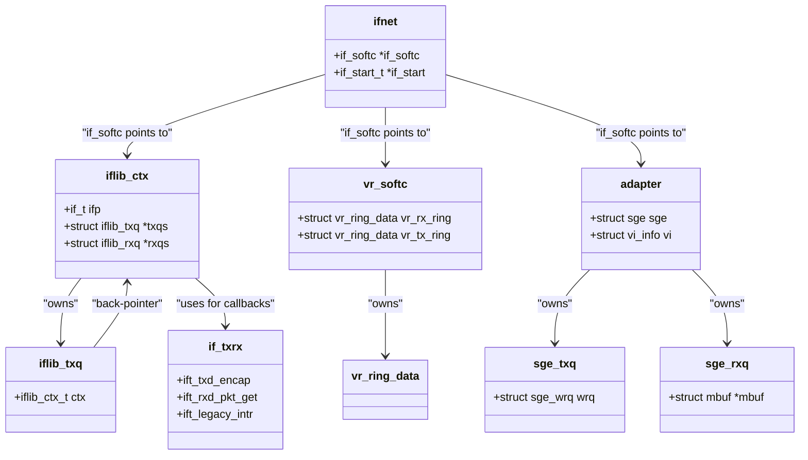

# NIC Drivers — from if_vr to iflib to if_cxgbe
<!-- This file is auto-generated by generate-doc.py -- do not edit manually -->

---
**Navigation:**
  **Related:** [Network Stack — Architecture and Packet Flow](../net/README.md) | [Device Driver Framework — newbus and devclass](../kern/README_driver.md) | [Interrupt Handling — Threads, Filters, and Dispatch](../kern/README_intr.md)
  **All chapters:** [Source Tree — Layout and Conventions](../../README_internals.md) | [Boot Process — UEFI Bootloader to Kernel Handoff](../../stand/efi/loader/README.md) | [Kernel Core — Structure and Entry Point](../README.md) | [Build System — buildworld and buildkernel](../../share/mk/README.md) | [Virtual Memory Subsystem — vm_page, UMA, and Pagers](../vm/README.md) | [Process Management — Scheduling and Lifecycle](../kern/README_process.md) | [Locking Primitives — Mutexes, sx, rmlocks, and Atomics](../kern/README_locking.md) | [Buffer Cache — Block I/O Subsystem](../vm/README_bcache.md) ...
---


> ⚠ **UNVERIFIED DRAFT** — revisions regressed; kept revision 2 (6/7 criteria) over revision 3 (4/7); reviewer did not explicitly approve this draft. Treat claims as suspect until manually reviewed.


## Quick Summary
Network Interface Card (NIC) drivers in FreeBSD represent a spectrum of complexity, ranging from simple, hand-crafted register management to complex offload engines that handle multiple hardware roles simultaneously. The evolution of these drivers illustrates FreeBSD's broader philosophy regarding kernel abstraction: standardize simple cases to reduce maintenance burden, but allow specialized hardware to bypass abstractions when necessary.

The earliest drivers, such as `if_vr` (VIA Rhine), represent the "naked" `ifnet` model. In this paradigm, the driver author is responsible for every aspect of network I/O: allocating DMA memory, managing descriptor rings, writing interrupt handlers, and handling media state changes. While educational, this approach leads to code duplication across dozens of drivers.

To address this, FreeBSD introduced `iflib` (Network Interface Card Library), a framework that absorbs common responsibilities like queue management, interrupt coalescing, and buffer allocation. Drivers like `if_em` (Intel PRO/1000) became "iflib consumers," providing only hardware-specific callbacks for packet encapsulation and descriptor management. However, high-performance NICs, such as the Chelsio T4/T5/T6 handled by `if_cxgbe`, expose complex features like TCP Offload Engine (TOE), RDMA, and NVMe-oF. These chips manage their own internal queues and memory partitions, making the generic `iflib` model unsuitable. Consequently, `if_cxgbe` is a "naked" driver by necessity, managing its own complex state machines and ring structures that do not map cleanly to `iflib`'s abstractions.

## Architecture
The architecture of FreeBSD NIC drivers is defined by the relationship between the `ifnet` structure (the kernel's generic network interface) and the hardware-specific rings.

**1. The Pre-`iflib` Era (`if_vr`)**
In `sys/dev/vr/if_vr.c`, the driver registers itself with the kernel using `ether_ifattach()`. It manually creates transmit and receive descriptor rings using `bus_dma` (via `bus_dmamap_create`). The driver's interrupt handler (`vr_intr`) is directly registered using `bus_setup_intr`. When the hardware signals an interrupt, `vr_intr` calls `vr_start` for transmit completion and `vr_rxeof` for packet reception. The driver is responsible for calling `m_freem` on received packets and passing them to `ether_input` via `m_defrag` and `m_cat`.

**2. The `iflib` Framework (`if_em`)**
`if_em` (Intel PRO/1000) lives in `sys/dev/e1000/if_em.c`. It still performs standard newbus `probe` and `attach`, but instead of implementing `start` and `intr` routines itself, it initializes an `iflib_ctx` structure. The driver provides a `struct if_txrx` (defined in `em_txrx.c`) which contains function pointers for hardware-specific operations: `ift_txd_encap` (wrapping an mbuf in a descriptor) and `ift_rxd_pkt_get` (extracting an mbuf from a descriptor). The `iflib` core in `sys/net/iflib.c` handles the rest: it manages the `ifnet` up/down state, sets up the interrupt handler, and dispatches polling tasks.

**3. The Complex Offload Engine (`if_cxgbe`)**
`if_cxgbe` (Chelsio) is located in `sys/dev/cxgbe/t4_main.c`. Unlike `if_em`, it does not use `iflib`. The Chelsio chip is not just a NIC; it is a multi-role processor. It manages TCP connections (TOE), RDMA traffic, and regular Ethernet traffic in parallel. The driver defines its own ring structures, such as `sge_txq` (Tx Queue), `sge_rxq` (Rx Queue), and `sge_iq` (Input Queue for offload events). The driver's `t4_attach` function sets up a complex scheduler (`sge_sched_params`) to allocate resources for these different traffic classes.

## Key Data Structures
The following structures are central to the NIC driver architecture.

**`iflib` Structures (`sys/net/iflib.h`)**
```c
struct iflib_ctx {
    if_softc_ctx_t   isc;
    if_t              ifp;
    struct iflib_txq *txqs;
    struct iflib_rxq *rxqs;
    // ...
};

struct iflib_txq {
    iflib_ctx_t       ctx;
    // ... pointer to hardware ring ...
    // ... mbuf queue for pending packets ...
};
```
`iflib_ctx` is the central context for an iflib-based driver. It encapsulates the array of queues (`txqs`, `rxqs`) and the generic `ifnet` pointer.

**`if_vr` Structures (`sys/dev/vr/if_vrreg.h`)**
```c
struct vr_ring_data {
    struct vr_desc  *vr_ring;
    struct vr_desc  *vr_cur_rx;
    struct vr_desc  *vr_cur_tx;
    // ...
};

struct vr_softc {
    struct vr_ring_data vr_rx_ring;
    struct vr_ring_data vr_tx_ring;
    device_t          dev;
    // ...
};
```
`vr_softc` holds the raw hardware state. `vr_ring_data` contains the virtual and physical addresses of the descriptor rings, which the driver manages manually.

**`if_cxgbe` Structures (`sys/dev/cxgbe/adapter.h`)**
```c
struct sge_txq {
    struct sge_wrq      wrq;
    // ...
};

struct sge_iq {
    // ... Input Queue for firmware and offload events ...
};
```
`sge_txq` is the Chelsio-specific transmit queue, built on top of a generic `sge_wrq` (Write Request Queue). `sge_iq` handles the massive amount of asynchronous events generated by the chip's offload engines.

## Deep Dive

### 1. The `if_vr` Path: Manual Descriptor Management
In `sys/dev/vr/if_vr.c`, the function `vr_start` is the transmit entry point. It is called when the kernel's `ifnet` `ifq` is non-empty.
```c
static void
vr_start(struct ifnet *ifp)
{
    struct vr_softc *sc = ifp->if_softc;
    struct mbuf *m_head;
    int s;

    // ... acquire lock ...
    while ((m_head = ifq_dequeue(&ifp->if_snd, 0)) != NULL) {
        // ... map mbuf to DMA ...
        // ... write to vr_txdesc ...
    }
    // ... update hardware head pointer ...
}
```
The driver manually dequeues mbufs, maps them to DMA (`bus_dmamap_load_mbuf_sg`), and writes them into the `vr_txdesc` ring. It then updates the hardware's "head" pointer to signal that new data is ready.

### 2. The `if_em` Path: The `if_txrx` Callbacks
In `sys/dev/e1000/em_txrx.c`, the driver defines `em_isc_txd_encap`. This function is registered in `struct if_txrx em_txrx`. When `iflib` needs to transmit a packet, it calls `em_isc_txd_encap`.
```c
static int
em_isc_txd_encap(void *arg, if_pkt_info_t pi)
{
    struct e1000_softc *sc = arg;
    // ... pi contains the mbuf chain ...
    // ... driver writes e1000_adv_data_desc ...
    // ... returns number of descriptors used ...
}
```
The driver never calls `ether_input` or `bus_dmamap_sync` directly. `iflib` handles the mbuf chaining, DMA setup, and interrupt registration. The driver only focuses on translating the `if_pkt_info` into hardware-specific descriptors (`e1000_adv_data_desc`).

### 3. The `if_cxgbe` Path: The `sge` Engine
In `sys/dev/cxgbe/t4_sge.c`, the `sge` (System General Engine) handles all DMA. It defines `t4_sge_rxq_handler`, which is a callback for the `sge_rxq`.
```c
static void
t4_sge_rxq_handler(struct sge_rxq *q, struct mbuf *m, int len)
{
    // ... process the received packet ...
    // ... pass to ether_input ...
}
```
Because the Chelsio chip supports TOE, the `sge` also manages `sge_iq` (Input Queues) for TCP connection events. These events are not standard network packets; they are protocol state changes (e.g., "TCP connection closed"). The `if_cxgbe` driver must interpret these events and update the TCP stack accordingly, a complexity that `iflib` (designed for standard NICs) cannot express.

## Flow / Diagram



## Advanced Notes

**DTrace Integration**
`iflib` provides rich DTrace probes for performance analysis. In `sys/net/iflib.c`, `SDT_PROBE` macros are used to trace packet flow. For example, `iflib_txq_flush` emits probes that allow administrators to see exactly how many descriptors are being submitted to the hardware per call. This is invaluable for tuning interrupt coalescing and queue depths.

**Performance Pitfalls**
In non-iflib drivers like `if_vr`, a common pitfall is failing to call `bus_dmamap_sync` before reading descriptor status. This can lead to stale data being read from the descriptor ring, causing the driver to miss interrupts or process corrupted packets. In `if_em`, the `iflib` framework handles `bus_dmamap_sync` automatically, reducing the risk of such errors.

**Why `if_cxgbe` is not `iflib`**
`iflib` assumes a simple model: one or more transmit queues and one or more receive queues. It does not account for the Chelsio chip's "virtual interfaces" (`vi_info`), where a single physical port is partitioned into multiple logical interfaces, each with its own dedicated TCP connection table and RDMA queue pair. Implementing this in `iflib` would require significant extensions to the framework, which would then complicate the simple drivers that `iflib` was designed to help. Therefore, `if_cxgbe` remains a standalone driver.

## Comparison

**Linux vs. FreeBSD**
Linux uses the `net_device` structure, which is conceptually similar to FreeBSD's `ifnet`. However, Linux has moved towards a "netdev_queue" model where each queue is a separate entity, and the driver manages them more explicitly than FreeBSD's `iflib` does. FreeBSD's `iflib` provides a higher level of abstraction, hiding the queue management logic entirely from the driver author, whereas Linux drivers often manage their own queue structures.

**macOS/XNU**
XNU uses a different approach with the Network Driver Interface (NDI). It defines `ifnet` similarly to FreeBSD but uses a "unit" based approach for interface numbering and has a different interrupt handling model. XNU's NIC drivers are often more tightly integrated with the hardware-specific "IOService" framework, whereas FreeBSD keeps the hardware abstraction (newbus) separate from the network stack.

**NetBSD/OpenBSD**
NetBSD and OpenBSD also use `ifnet`, but they have historically been slower to adopt a centralized framework like `iflib`. OpenBSD's `iflib` implementation is experimental and not the default for most drivers. FreeBSD's `iflib` is a unique contribution to the BSD ecosystem, aiming to reduce code duplication in a way that other BSDs have not fully embraced.

## See Also
- [Device Driver Framework — newbus and devclass](../../../sys/kern/README_driver.md)
- [Network Stack — Architecture and Packet Flow](../../../sys/net/README.md)
- [Interrupt Handling — Threads, Filters, and Dispatch](../../../sys/kern/README_intr.md)

- [Device Driver Framework — newbus and devclass](../../../sys/kern/README_driver.md)
- [Network Stack — Architecture and Packet Flow](../../../sys/net/README.md)
- [Interrupt Handling — Threads, Filters, and Dispatch](../../../sys/kern/README_intr.md)


- [Kernel Core — Structure and Entry Point](../kern/README.md)
- [Virtual Memory Subsystem — vm_page, UMA, and Pagers](../vm/README.md)
- [Buffer Cache — Block I/O Subsystem](../vm/README_bcache.md)
- [sys/dev/vr](../../sys/dev/vr)
- [sys/dev/e1000](../../sys/dev/e1000)
- [sys/dev/cxgbe](../../sys/dev/cxgbe)
- [sys/net/iflib.c](../../sys/net/iflib.c)

---

> _Generated by [DaemonDocs](https://github.com/ocochard/DaemonDocs) on 2026-04-30 12:05 UTC using model `Qwen3.6-35B-A3B-UD-Q4_K_XL` (llama.cpp build `b8985-27aef3dd9`). AI-generated content — verify against source before relying on it._
