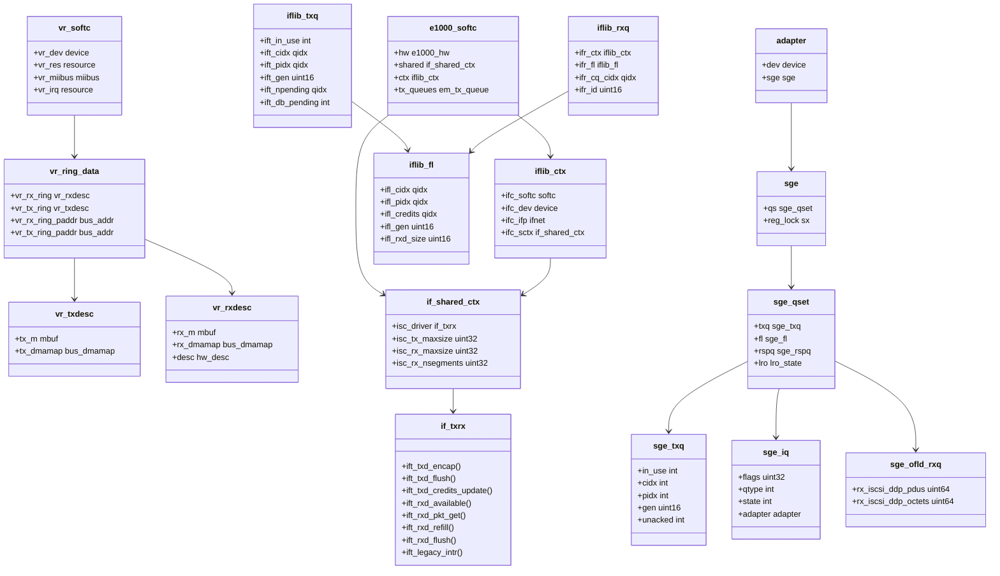

# NIC Drivers — from if_vr to iflib to if_cxgbe
<!-- This file is auto-generated by generate-doc.py -- do not edit manually -->

---
**Navigation:**
  **Up:** [Kernel Core — Structure and Entry Point](../README.md) ▸ [Source Tree — Layout and Conventions](../../README_internals.md)
  **Related:** [Network Stack — Architecture and Packet Flow](../net/README.md) | [Device Driver Framework — newbus and devclass](../kern/README_driver.md) | [Interrupt Handling — Threads, Filters, and Dispatch](../kern/README_intr.md)
  **All chapters:** [Source Tree — Layout and Conventions](../../README_internals.md) | [Boot Process — UEFI Bootloader to Kernel Handoff](../../stand/efi/loader/README.md) | [Kernel Core — Structure and Entry Point](../README.md) | [Build System — buildworld and buildkernel](../../share/mk/README.md) | [System Calls and Image Activation — Entry, sysent, and exec](../kern/README_syscall.md) | [Kernel Modules and the Linker — KLD, SYSINIT, and linker sets](../kern/README_kld.md) | [Virtual Memory Subsystem — vm_page, UMA, and Pagers](../vm/README.md) | [Process Management — Scheduling and Lifecycle](../kern/README_process.md) ...
---


## Quick Summary

A network interface driver is the code that stands between the kernel's `ifnet(4)` layer and the silicon. It owns three things that no generic code can own on its behalf: the DMA descriptor rings the chip reads and writes, the interrupt or poll path that moves mbufs in and out of those rings, and the device-specific register programming that brings the chip up. Everything else — the `ifnet` structure, address families, the `ether_input()` path, the [`bus_dma(9)`](../../share/man/man9/bus_dma.9) allocator — is shared. The interesting question in any operating system is how much of the *ring and interrupt* machinery is written once in a framework versus re-written in every driver.

This chapter isolates that single variable by lining up four drivers at four points on the complexity spectrum. `if_vr` (VIA Rhine, a 100 Mbps Ethernet chip from VIA Technologies) is a complete, pre-iflib driver: it does every one of those jobs by hand, so it is the cleanest place to see what a NIC driver must actually do. `if_em` (Intel 1 Gbps) is from the same hardware generation but was rewritten as an *iflib consumer*; comparing it to `if_vr` shows exactly which mechanics iflib took away. `iflib` itself (`sys/net/iflib.c`) is the framework that absorbed those mechanics, and `if_cxgbe` (Chelsio T4/T5/T6) is a driver that is *not* an iflib consumer — not because iflib did not exist when it was written, but because the chip's design does not fit iflib's model.

The contrast is the point. `if_vr` is non-iflib because iflib had not been written yet. `if_cxgbe` is non-iflib because iflib is not enough: the Chelsio chip exposes a TCP offload engine, RDMA (Remote Direct Memory Access), crypto offload, and NVMe-over-fabrics on top of plain NIC mode, and it partitions its queues by role in a way that iflib's one-transmit-queue / one-receive-queue-per-queue-set abstraction cannot express. Reading the four together makes the iflib trade-off concrete: iflib pays a fixed cost in abstraction in order to delete a large amount of duplicated, error-prone ring and interrupt code from the ordinary NIC drivers.

## Glossary

**descriptor ring** — a fixed circular array of small, fixed-size records in memory that the NIC's DMA engine walks; the driver and the chip each advance an index (producer/consumer) around it.

**DMA tag** — the [`bus_dma(9)`](../../share/man/man9/bus_dma.9) handle that describes a region of memory to the bus DMA allocator; it produces bus addresses the chip can fetch and holds the mapping so the driver can free it later.

**doorbell** — a single memory-mapped write the driver issues to tell the chip "there is new work in the ring"; good drivers batch many descriptors and ring it once.

**TOE** — TCP Offload Engine; hardware that terminates TCP (sequence numbers, retransmits, checksums) so the host never sees the per-packet cost.

**completion (CPL)** — a record a chip posts to a completion queue to report an asynchronous event (a received packet, a finished send, an error); the driver dispatches on the completion type.

**queue set** — a group of queues bound to one CPU or one interrupt vector; iflib uses a queue set to map one transmit and one receive queue per CPU.

## Architecture

The four subjects live in four directories. `if_vr` is a single translation unit, `sys/dev/vr/if_vr.c`, with its register map in `sys/dev/vr/if_vrreg.h`. `if_em` is split across `sys/dev/e1000/if_em.c`, `sys/dev/e1000/em_txrx.c`, and the shared `e1000_*` library files under `sys/dev/e1000/`. `iflib` is `sys/net/iflib.c` with its public interface in `sys/net/iflib.h`. `if_cxgbe` is the largest: `sys/dev/cxgbe/t4_main.c` for [attach](../kern/README_driver.md#glossary)/detach, `sys/dev/cxgbe/adapter.h` for the data model, `sys/dev/cxgbe/t4_sge.c` for the queue engine, plus `t4_sched.c`, `t4_filter.c`, `t4_clip.c`, `t4_l2t.c`, and `t4_smt.c`, and subdirectories `tom/` ([TOE](#glossary)), `crypto/`, `nvmf/`, and `iw_cxgbe/` (the wireless/Wi-Fi side that reuses the same silicon).

**if_vr — everything by hand.** The driver registers a [newbus](../kern/README_driver.md#glossary) (FreeBSD's bus/driver/device framework) driver, claims the PCI memory and interrupt resources in `vr_attach()`, and attaches a `miibus` child so the PHY is driven through `vr_miibus_readreg()`, `vr_miibus_writereg()`, and `vr_miibus_statchg()`. It allocates its two descriptor rings with [`bus_dma(9)`](../../share/man/man9/bus_dma.9) and keeps them in `struct vr_ring_data` (the `vr_rx_ring`/`vr_tx_ring` arrays plus their bus addresses `vr_rx_ring_paddr`/`vr_tx_ring_paddr`), with the per-descriptor DMA [state](../netpfil/pf/README.md#glossary) in `struct vr_chain_data`. Transmit is driven by `vr_start()`/`vr_tx_start()`, receive is drained in the interrupt path by `vr_rxeof()`, `vr_reset()` re-initializes the chip on a link change, and `vr_watchdog()` re-arms the transmit path if the ring appears stuck. The `ifnet` up/down, multicast CAM programming (`vr_cam_mask()`, `vr_cam_data()`, `vr_hash_maddr_cam()`), and the tally counters in `struct vr_statistics` are all written in this one file. There is no framework between the driver and the hardware; every line of ring arithmetic is the driver's own.

**if_em — the same chip generation, rewritten as an iflib consumer.** `if_em` still owns the `e1000_hw` model (in `e1000_hw.h`) and the per-queue state, but the ring and interrupt plumbing is now iflib's. The driver's `struct e1000_softc` (in `if_em.h`) carries an `if_ctx_t ctx` and an `if_shared_ctx_t shared` in addition to the `e1000_hw hw` and the `tx_queues` array. The device-specific work is collapsed into a small vtable, `struct if_txrx`, with two instances in `em_txrx.c`: `em_txrx` and a legacy variant `lem_txrx`. `em_setup_interface()` and `em_setup_msix()` wire the queues and interrupt vectors, and `em_initialize_transmit_rings()`/`em_initialize_receive_unit()` size the rings; the per-packet behavior is in the `em_isc_*` callbacks. What `if_vr` did inline — refill a ring, ring a [doorbell](#glossary), [reclaim](../sys/README_mbuf.md#glossary) completed descriptors, dispatch an interrupt — is now a set of function pointers that iflib calls.

**iflib — the framework that absorbed the common code.** `sys/net/iflib.c` owns the queue lifecycle and the interrupt/poll dispatch. Its central object is `struct iflib_ctx` (one per interface), which holds the driver `softc`, the `device_t`, the `if_t`, the CPU set, and a pointer to the shared context. The shared context, `struct if_shared_ctx`, carries the hardware limits (`isc_tx_maxsize`, `isc_rx_maxsize`, `isc_rx_nsegments`, and the [TSO](../netinet/README_transport.md#glossary) equivalents) plus a pointer back to the driver's `if_txrx` vtable. Transmit and receive queues are `struct iflib_txq` and `struct iflib_rxq`, each backed by a free list `struct iflib_fl` that tracks `ifl_credits`, `ifl_cidx`, `ifl_pidx`, and the [mbuf](../sys/README_mbuf.md#glossary)/[cluster](../sys/README_mbuf.md#glossary) enqueue and dequeue counts. The `IFLIB_INTR_RX` path is the receive interrupt handler; it schedules the receive work onto a taskqueue (`_task_fn_rx`) rather than doing it all in interrupt context, and the transmit reclaim path is `_task_fn_tx`/`_iflib_completed_tx_reclaim`. [DMA tag](#glossary) management is centralized in `_iflib_dmamap_cb()`. This is the code that `if_vr` had to write itself and that `if_em` no longer writes.

**if_cxgbe — non-iflib by necessity.** `t4_main.c` registers the `t4nex` bus driver (`driver_t t4_driver`, with `t4_methods`) and a `cxgbe` port driver. The data model in `adapter.h` is built around `struct adapter` and, inside it, `struct sge` — the "scatter-gather engine" — whose `qs[]` array holds `struct sge_qset`. A [queue set](#glossary) is not just one transmit and one receive queue: it is a `sge_txq` array, a `sge_fl` (free list) array, an LRO state, and a shared `sge_rspq` completion queue. On top of the plain NIC queues the driver allocates entirely separate queue *types*: `alloc_iq_fl()` for ingress queues (each tagged with a `qtype` in `struct sge_iq`), `alloc_ofld_rxq()`/`alloc_ofld_txq()` for the TOE/offload paths, `alloc_wrq()` for RDMA work-request queues, `alloc_nm_rxq()`/`alloc_nm_txq()` for netmap, and `alloc_ctrlq()`/`alloc_eq()`/`alloc_fwq()` for the firmware and event queues. The chip reports everything through completions dispatched by `t4_register_cpl_handler()`, `t4_register_an_handler()` (asynchronous notifications), and `t4_register_fw_msg_handler()`. Queue-to-CPU and queue-to-traffic-class mapping is done in `t4_sched.c` (`bind_txq_to_traffic_class()`), and the hardware TCAM (ternary content-addressable memory) filters are managed in `t4_filter.c`. This partitioned, multi-engine design is what iflib's queue model cannot express.
## Key Data Structures

**if_vr ring state** (`sys/dev/vr/if_vrreg.h`). The driver keeps one chain-data block per interface that owns both the descriptor arrays and their DMA tags. The load-bearing fields, by name:

```
struct vr_chain_data            /* sys/dev/vr/if_vrreg.h */
  vr_parent_tag                 /* bus_dma tag for the whole block */
  vr_tx_tag                     /* bus_dma tag for the tx descriptors */
  vr_txdesc[VR_TX_RING_CNT]     /* transmit descriptors */
  vr_rx_tag                     /* bus_dma tag for the rx descriptors */
  vr_rxdesc[VR_RX_RING_CNT]     /* receive descriptors */
  vr_tx_ring_tag / vr_tx_ring_map   /* bus addr of the tx ring */
  vr_rx_ring_tag / vr_rx_ring_map   /* bus addr of the rx ring */
  vr_rx_sparemap                /* spare rx buffer map */
```

Each transmit descriptor pairs an mbuf with its DMA map, and each receive descriptor pairs a buffer map with the hardware descriptor:

```
struct vr_txdesc   {  tx_m, tx_dmamap }        /* mbuf + its bus_dma map */
struct vr_rxdesc   {  rx_m, rx_dmamap, desc }  /* buffer, map, hw desc  */
struct vr_ring_data { vr_rx_ring, vr_tx_ring,
                      vr_rx_ring_paddr, vr_tx_ring_paddr }
```

The register map in the same header is what the driver programs by hand: `VR_RXADDR`/`VR_TXADDR` hold the ring base addresses, `VR_CURRXDESC0`..`VR_NEXTRXDESC3` and `VR_CURTXDESC0`..`VR_NEXTTXDESC3` are the chip's current/next descriptor pointers, and `VR_ISR`/`VR_IMR` are the interrupt status and mask registers.

**iflib public types** (`sys/net/iflib.h`). These are quoted verbatim from the header. The transmit path hands the driver an `if_pkt_info` describing the packet to encap; the receive path hands it an `if_rxd_info` to fill in:

```c
typedef struct if_pkt_info {
	bus_dma_segment_t	*ipi_segs;	/* physical addresses */
	uint32_t		ipi_len;	/* packet length */
	uint16_t		ipi_qsidx;	/* queue set index */
	qidx_t			ipi_nsegs;	/* number of segments */

	qidx_t			ipi_ndescs;	/* number of descriptors used by encap */
	uint16_t		ipi_flags;	/* iflib per-packet flags */
	qidx_t			ipi_pidx;	/* start pidx for encap */
	qidx_t			ipi_new_pidx;	/* next available pidx post-encap */
	/* offload handling */
	uint8_t			ipi_ehdrlen;	/* ether header length */
	uint8_t			ipi_ip_hlen;	/* ip header length */
} *if_pkt_info_t;

typedef struct if_rxd_info {
	/* set by iflib */
	uint16_t iri_qsidx;		/* qset index */
	uint16_t iri_vtag;		/* vlan tag - if flag set */
	uint16_t iri_len;		/* packet length */
	qidx_t iri_cidx;		/* consumer index of cq */
	if_t iri_ifp;			/* driver may have >1 iface per softc */

	/* updated by driver */
	if_rxd_frag_t iri_frags;
	uint32_t iri_flowid;		/* RSS hash for packet */
	uint32_t iri_csum_flags;	/* m_pkthdr csum flags */
	uint32_t iri_csum_data;		/* m_pkthdr csum data */
	uint8_t iri_flags;		/* mbuf flags for packet */
	uint8_t	 iri_nfrags;		/* number of fragments in packet */
	uint8_t	 iri_rsstype;		/* RSS hash type */
	uint8_t	 iri_pad;		/* any padding in the received data */
} *if_rxd_info_t;
```

The `if_pkt_info` is the contract on the transmit side: iflib has already turned the mbuf chain into a flat array of `bus_dma_segment_t` physical addresses (`ipi_segs`) and a segment count, and it has computed the offload fields. The driver's `txd_encap` callback only has to write those segments into the hardware descriptors and report how many it used (`ipi_ndescs`). On the receive side, `if_rxd_info` is the opposite direction: iflib fills the queue-set, consumer-index, and length fields, and the driver's `rxd_pkt_get` callback fills the fragment list, the RSS hash, and the checksum flags so iflib can build the `mbuf`.

The driver-facing vtable is `struct if_txrx` in `sys/net/iflib.h`. The exact member names are taken from the `em_txrx` instance in `sys/dev/e1000/em_txrx.c`:

```
struct if_txrx                  /* sys/net/iflib.h, instance in em_txrx.c */
  ift_txd_encap()               /* write if_pkt_info into tx descriptors */
  ift_txd_flush()               /* ring the doorbell for a tx queue */
  ift_txd_credits_update()      /* tell iflib how many tx credits remain */
  ift_rxd_available()           /* ask the driver how many rx bufs are free */
  ift_rxd_pkt_get()             /* driver fills if_rxd_info for one packet */
  ift_rxd_refill()              /* driver posts new bufs to the rx ring */
  ift_rxd_flush()               /* ring the rx doorbell */
  ift_legacy_intr()             /* optional: driver-owned interrupt handler */
```

**iflib queue state** (`sys/net/iflib.c`). The per-queue bookkeeping that iflib keeps on behalf of the driver:

```
struct iflib_txq                /* sys/net/iflib.c */
  ift_in_use                    /* queue is active */
  ift_cidx                      /* consumer index (driver reclaim) */
  ift_cidx_processed            /* how far iflib has processed */
  ift_pidx                      /* producer index (driver encap) */
  ift_gen                       /* generation counter for the ring */
  ift_br_offset : 1             /* buf_ring offset bit */
  ift_defer_mfree : 1           /* defer mbuf free bit */
  ift_npending                  /* packets pending on the queue */
  ift_db_pending                /* doorbell is pending */

struct iflib_fl                 /* the free list backing each queue */
  ifl_cidx / ifl_pidx           /* free-list consumer / producer index */
  ifl_credits                   /* buffers currently available */
  ifl_gen                       /* generation counter */
  ifl_rxd_size                  /* receive buffer size */
  ifl_m_enqueued / ifl_m_dequeued   /* mbuf accounting */
  ifl_cl_enqueued / ifl_cl_dequeued /* cluster accounting */
```

The `qidx_t` index type is a `uint16_t` (see the comment in `iflib.h` limiting descriptors to 65535), and `QIDX_INVALID` is `0xFFFF`. The free list is why iflib can own the buffer pool: it tracks exactly how many mbufs and clusters are in flight (`ifl_m_enqueued` vs `ifl_m_dequeued`) so it knows when to call the driver's `rxd_refill` and when it can safely hand a buffer back.
## Deep Dive

### The transmit path in if_vr

In the pre-iflib world the transmit path is one long function the driver owns. `vr_start()` is the `if_transmit` entry point; it is called by `ether_output()` with an `mbuf` chain. It loops over the chain, and for each `mbuf` it takes a free transmit descriptor from the ring, calls `bus_dmamap_load()` against the descriptor's `tx_dmamap` to get a bus address, writes that address and the length into the hardware `vr_txdesc`, and advances the ring's producer index. When it has queued at least one descriptor it rings the doorbell — on the Rhine this is a write to `VR_CR0` (command register 0) — and returns `0` to tell the stack the packet was accepted. If the ring has no free descriptors it returns `EAGAIN` and the packet is retried.

Two things in that flow are exactly what iflib later centralizes. First, the DMA mapping: `vr_start()` calls `bus_dmamap_load()` per segment and must remember the `bus_dmamap` in the descriptor so the interrupt path can `bus_dmamap_unload()` it. Second, the back-pressure: the driver must count free descriptors and decide when to return `EAGAIN`. In `if_vr` both are hand-rolled and both live in the same file as the register writes.

### The transmit path in if_em, through iflib

`if_em` no longer has a `if_transmit` that walks the ring. Instead the `ifnet` transmit path lands in iflib. iflib turns the `mbuf` chain into an `if_pkt_info` (the `ipi_segs` array of physical addresses, `ipi_nsegs`, and the offload fields) and then calls the driver's `ift_txd_encap` callback. In `em_txrx.c` that callback is `em_isc_txd_encap()`, which writes the segments into the `e1000_tx_desc` descriptors for the queue and returns the number of descriptors it used. iflib then calls `ift_txd_flush()` (`em_isc_txd_flush()`) to ring the doorbell, and `ift_txd_credits_update()` (`em_isc_txd_credits_update()`) to learn how many transmit credits are left so it can apply back-pressure.

The contrast is precise. The mbuf-to-segments conversion that `vr_start()` did inline is now iflib's; the doorbell is a callback; the credit accounting is a callback. The driver still knows the hardware descriptor layout (`e1000_tx_desc` in `e1000_hw.h`) and the offload bits — that is genuinely device-specific — but it no longer owns the ring indices, the DMA tag lifecycle, or the back-pressure policy.

### The receive path, interrupt to ether_input

In `if_vr` the interrupt handler reads `VR_ISR`, and for the received-packet bit it calls `vr_rxeof()`. `vr_rxeof()` walks the receive ring from the chip's current descriptor pointer, and for each completed descriptor it reads the status word to find the packet length and error bits, unmaps the descriptor's `rx_dmamap`, builds an `mbuf` around the received data, and hands it to `ether_input()`. It then advances the ring's consumer pointer and, if there are no more packets, exits. The driver must also refill the ring with fresh buffers so the chip has somewhere to DMA the next packet.

In the iflib world the receive interrupt is the `IFLIB_INTR_RX` path. Rather than drain the whole ring in interrupt context, iflib schedules the work onto a taskqueue; `_task_fn_rx()` is the task that actually pulls packets. For each packet it calls the driver's `ift_rxd_pkt_get()` — `em_isc_rxd_pkt_get()` in `em_txrx.c` — passing an `if_rxd_info`. The driver fills in `iri_frags` (the fragment list), `iri_flowid` (the RSS hash), `iri_csum_flags`, and `iri_nfrags`. iflib then assembles the `mbuf` from the fragments and calls `ether_input()`. When the free list runs low, iflib calls `ift_rxd_refill()` (`em_isc_rxd_refill()`) to have the driver post new buffers, and `ift_rxd_flush()` to ring the receive doorbell. The `_rxq_refill_cb()` helper is the callback [trampoline](../../stand/efi/loader/README.md#glossary) that iflib uses to drive that refill.

So the receive path has been split into a small number of well-defined operations — *get one packet*, *refill*, *flush* — each owned by the driver, with the loop, the `mbuf` assembly, the buffer pool, and the taskqueue dispatch owned by iflib. That split is the unit of the abstraction.

### Why if_cxgbe cannot use this model

`if_cxgbe`'s `struct sge_qset` (in `adapter.h`) shows why. A queue set is not one transmit queue and one receive queue. It contains a `sge_txq` array (`txq[]`, sized `SGE_TXQ_PER_SET`), a `sge_fl` array (`fl[]`, sized `SGE_RXQ_PER_SET`), an LRO state, and a shared `sge_rspq` completion queue. The transmit and receive sides are decoupled: the chip does not post received packets into a per-queue ring the way the Intel or VIA chips do; it posts *completions* into the `sge_rspq`, and the driver dispatches on the completion type. `t4_sge.c` registers the dispatchers with `t4_register_cpl_handler()`, `t4_register_an_handler()`, and `t4_register_fw_msg_handler()`.

On top of the NIC queue sets, the driver allocates separate queue objects for each role the chip plays. `struct sge_iq` is an ingress queue with a `qtype` field that selects what kind of traffic it carries; `alloc_iq_fl()` creates the filter/ingress queues. `struct sge_ofld_rxq` and `struct sge_ofld_txq` are the TOE/offload queues — `sge_ofld_rxq` even carries iSCSI DDP counters (`rx_iscsi_ddp_setup_ok`, `rx_iscsi_ddp_pdus`, `rx_iscsi_ddp_octets`). `struct sge_wrq` is the RDMA work-request queue, `struct sge_nm_rxq`/`struct sge_nm_txq` are the netmap queues, and `struct sge_eq` is the event queue. Each of these has its own `cidx`/`pidx`/`gen` and its own doorbell, and the mapping of queues to CPUs and to traffic classes is done in `t4_sched.c` (`bind_txq_to_traffic_class()`).

iflib's model assumes a fixed shape: a set of queue sets, each with one transmit and one receive queue, driven by a small `if_txrx` vtable. The Chelsio chip has a different shape — many queue *types*, a completion-driven receive path, and a hardware scheduler that the driver must program. Forcing the Chelsio design into `if_txrx` would mean either hiding the TOE/RDMA/NVMe roles behind the NIC vtable (losing the hardware's partitioning) or writing a private iflib that is not iflib. The driver therefore manages its own rings, its own completions, and its own DMA tags, the way `if_vr` does — the difference being that `if_vr` does it because there was no alternative, and `if_cxgbe` does it because the alternative is too small.
## Flow / Diagram

The diagram groups the four subjects into three "worlds" and shows how the iflib core sits between the if_em driver and the hardware. `if_vr` owns its rings directly; `if_em` delegates to `if_txrx` vtable callbacks owned by iflib; `if_cxgbe` owns a partitioned, multi-role queue tree of its own.



Reading the diagram left to right is the chapter's argument in picture form. The left cluster (`vr_softc` → `vr_ring_data` → `vr_txdesc`/`vr_rxdesc`) is a self-contained ring: the [softc](../kern/README_driver.md#glossary) points at its own ring data, which points at its own descriptors, and each descriptor carries its own `bus_dmamap`. There is nothing in the middle. The middle cluster is the iflib seam: `e1000_softc` points at an `iflib_ctx` and an `if_shared_ctx`, and the shared context points back at the driver's `if_txrx` vtable. The `iflib_txq`/`iflib_rxq`/`iflib_fl` trio is the queue machinery iflib owns. The right cluster (`adapter` → `sge` → `sge_qset` → `sge_txq`/`sge_iq`/`sge_ofld_rxq`) is a fan-out: one queue set branches into a transmit queue, a free list, a completion queue, and separate role-specific queues, which is the shape iflib does not model.
## Advanced Notes

**Performance.** The single most important cost in a NIC driver is the doorbell. `struct iflib_txq` carries an `ift_db_pending` bit precisely so iflib can batch many `txd_encap` calls and ring the doorbell once (`ift_txd_flush`) instead of once per packet. The same idea appears in `if_vr`, where the driver must remember it has queued a descriptor and only write `VR_CR0` when it has something to send. On the receive side, iflib deliberately moves the ring drain out of interrupt context and onto a taskqueue (`_task_fn_rx`), so the interrupt handler returns quickly and the expensive `mbuf` assembly and `ether_input()` happen at [thread](../kern/README_process.md#glossary) priority. The `ift_defer_mfree` bit on `struct iflib_txq` lets iflib defer freeing a completed transmit mbuf, which matters when the reclaim path is running on a different CPU than the one that allocated it. Finally, the `iflib_fl` free list with its per-domain buffer accounting is how iflib keeps receive buffers in the [NUMA domain](../vm/README.md#glossary) of the CPU that will process them, avoiding cross-socket fetches at line rate.

**Debugging.** The first stop for any of these drivers is the per-interface counters: `netstat -I em0` (or `ifconfig em0 statistics`) shows the `if_data` and, for `if_em`, the `e1000_hw_stats` tallies (crcerrs, algnerrc, rxerrc, and the collision counters). For ring state, `if_em` ships `em_dump_rs()` in `em_txrx.c`, which walks `sc->tx_queues` and prints the `tx_rs_cidx`/`tx_rs_pidx` and per-descriptor status — a [DDB](../kern/README_kdb.md#glossary)-friendly way to see whether the ring is stuck. For tracing the hot paths without recompiling, the DTrace `pid` provider works on the function names directly, e.g. `pid$pid::em_isc_rxd_pkt_get:return` or `pid$pid::vr_start:return`, and the stock `net:ifnet` [probe](../kern/README_driver.md#glossary) family around `if_transmit`/`if_input` brackets the whole path regardless of which driver is in use. `if_cxgbe` additionally has a [`ktr(4)`](../../share/man/man4/ktr.4) channel — `adapter.h` defines `KTR_CXGBE` (mapped to `KTR_SPARE3`) — and a `M_CXGBE` malloc tag, both of which are useful for following its completion and queue allocation paths.

**Pitfalls.** Three classes of bug recur in this code. First, the 16-bit index: `qidx_t` is a `uint16_t` and `QIDX_INVALID` is `0xFFFF`, so every ring in iflib is capped at 65535 descriptors and every index comparison must use the generation counter (`ift_gen`/`ifl_gen`) rather than a plain `<` — a driver that compares indices without the generation check will misbehave exactly once per wrap. Second, DMA map leaks: in `if_vr` the transmit path calls `bus_dmamap_load()` per segment and the interrupt path must `bus_dmamap_unload()` the same map; if a descriptor is reclaimed without its map being unmapped, the tag's segment count grows until the next `bus_dmamap_load()` fails. iflib centralizes this in `_iflib_dmamap_cb()` so the driver cannot forget it. Third, lock ordering: the transmit path runs with the `ifnet` lock held in some configurations and without it in others, and the receive taskqueue path runs unlocked; a callback that reaches into driver state protected by a different lock can deadlock or trip `witness`. The `em_isc_txd_credits_update()` return value is the driver's contract to iflib about how many more packets it will accept, so a driver that lies there either starves the link or overflows the ring.

**Connecting to OS theory.** This is the device-independent I/O layer that Tanenbaum and Bos describe in their OS textbook: the goal is to make every device "look more or less the same" so that a new device does not force a rewrite of the kernel's I/O core. `iflib` is exactly that layer for Ethernet — it is the "uniform interfacing for device drivers" made concrete, with the `if_txrx` vtable playing the role of the per-device operations table. The *Operating System Concepts* discussion of STREAMS makes the same point from the other direction: a modular, incremental framework lets many devices share one set of buffer and dispatch routines. `if_vr` shows what the world looked like before that framework, `if_em` shows the framework doing its job, and `if_cxgbe` shows its boundary — the point at which a device is so unlike the common case that the framework's fixed shape becomes a constraint rather than a help.

## See Also
- [Device Driver Framework — newbus and devclass](../kern/README_driver.md)
- [Network Stack — Architecture and Packet Flow](../net/README.md)
- [Interrupt Handling — Threads, Filters, and Dispatch](../kern/README_intr.md)


- [`sys/dev/vr/if_vr.c`](vr/if_vr.c) and [`sys/dev/vr/if_vrreg.h`](vr/if_vrreg.h) — the complete pre-iflib driver used as the baseline.
- [`sys/dev/e1000/if_em.c`](e1000/if_em.c), [`sys/dev/e1000/em_txrx.c`](e1000/em_txrx.c), and [`sys/dev/e1000/e1000_hw.h`](e1000/e1000_hw.h) — the iflib consumer and its `em_isc_*` callbacks.
- [`sys/net/iflib.c`](../net/iflib.c) and [`sys/net/iflib.h`](../net/iflib.h) — the framework itself; see the [`iflibdi(9)`](../../share/man/man9/iflibdi.9) man page for the `if_ctx_t` and queue contract.
- [`sys/dev/cxgbe/t4_main.c`](cxgbe/t4_main.c), [`sys/dev/cxgbe/adapter.h`](cxgbe/adapter.h), and [`sys/dev/cxgbe/t4_sge.c`](cxgbe/t4_sge.c) — the non-iflib, multi-role driver; `t4_sched.c` for the hardware scheduler and `t4_filter.c` for the TCAM filters.
- [`bus_dma(9)`](../../share/man/man9/bus_dma.9) — the DMA tag and mapping API that all four subjects use.
- `ifnet(4)` — the interface structure and the `if_transmit`/`if_input` entry points.
- `ether_input(9)` — the receive-side entry into the protocol stack.
- [`miibus(4)`](../../share/man/man4/miibus.4) — the MII PHY abstraction used by `if_vr`.
- [`mbuf(9)`](../../share/man/man9/mbuf.9) — the packet buffer that every path ultimately produces or consumes.
- [`taskqueue(9)`](../../share/man/man9/taskqueue.9) — the mechanism iflib uses to move the ring drain out of interrupt context.
- [`ktr(4)`](../../share/man/man4/ktr.4) and `witness` — the tracing and lock-ordering tools referenced in the Advanced Notes.

---

> _Generated by [DaemonDocs](https://github.com/ocochard/DaemonDocs) on 2026-09-02 08:25 UTC using model `Qwen3.8-27B-Q8_0` (llama.cpp build `b10553-cd26896c1`). AI-generated content — verify against source before relying on it._
