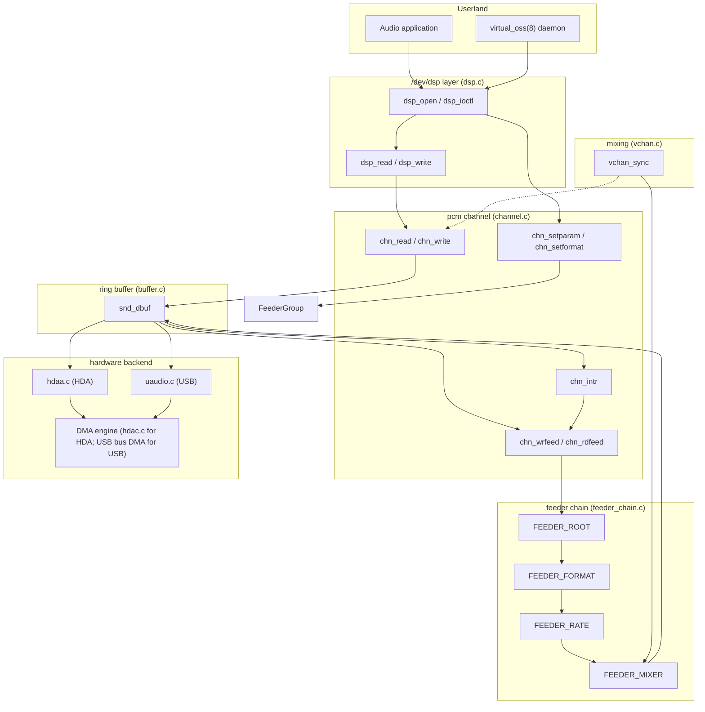

# Sound — pcm Channels, Feeder Chains, and Mixers
<!-- This file is auto-generated by generate-doc.py -- do not edit manually -->

---
**Navigation:**
  **Up:** [NIC Drivers — from if_vr to iflib to if_cxgbe](../README_nic_drivers.md) ▸ [Kernel Core — Structure and Entry Point](../../README.md) ▸ [Source Tree — Layout and Conventions](../../../README_internals.md)
  **Related:** [Device Driver Framework — newbus and devclass](../../kern/README_driver.md) | [Character Devices and the TTY Layer — cdev, devfs, and terminals](../../kern/README_cdev.md) | [USB and Thunderbolt — Host Controllers, Enumeration, and Device Classes](../usb/README.md)
  **All chapters:** [Source Tree — Layout and Conventions](../../../README_internals.md) | [Boot Process — UEFI Bootloader to Kernel Handoff](../../../stand/efi/loader/README.md) | [Kernel Core — Structure and Entry Point](../../README.md) | [Build System — buildworld and buildkernel](../../../share/mk/README.md) | [System Calls and Image Activation — Entry, sysent, and exec](../../kern/README_syscall.md) | [Kernel Modules and the Linker — KLD, SYSINIT, and linker sets](../../kern/README_kld.md) | [Virtual Memory Subsystem — vm_page, UMA, and Pagers](../../vm/README.md) | [Process Management — Scheduling and Lifecycle](../../kern/README_process.md) ...
---


## Quick Summary

The FreeBSD sound subsystem is built around a single idea: a hardware audio device is just a DMA engine that moves bytes at one fixed sample rate and in one fixed format, but the applications on a machine want many different rates, formats, and channel counts at the same time. The `pcm` framework in `sys/dev/sound/pcm/` sits between the two. It exposes a set of `/dev/dsp` character devices (see the Character Devices chapter for how `cdevsw` and `make_dev` turn these into nodes), and behind each device it keeps a *channel* — a `struct pcm_channel` in `sys/dev/sound/pcm/channel.c` — that owns a ring buffer, a set of capabilities, and a lock. A channel is the unit the rest of the kernel reasons about: is this playing, what format is it in, where is the DMA pointer now.

The trick that lets one hardware stream serve many incompatible clients is the *[feeder chain](#glossary)*. A channel does not talk to the hardware in the client's format. Instead, a linked list of small conversion stages — `struct pcm_feeder` nodes built in `sys/dev/sound/pcm/feeder_chain.c` — is threaded between the client's buffer and the hardware buffer. Each stage does one job: convert sample width or endianness (`FEEDER_FORMAT`), resample the rate (`FEEDER_RATE`), mix several sources into one (`FEEDER_MIXER`), or apply a channel matrix (`FEEDER_MATRIX`). The chain is rebuilt whenever a client's format no longer matches the hardware's, and the CPU cost of every conversion lands in the interrupt path, not in the syscall that wrote the data.

When the hardware has only one playback stream but several applications want to play at once, the framework uses a *virtual channel* (`vchan`, `sys/dev/sound/pcm/vchan.c`). A vchan is a normal-looking channel that is not backed by hardware; it records into a soft buffer, and a periodic `vchan_sync` mixes all the vchans into the real hardware channel. This is what lets a browser play a sound while a music player runs. The trade-off is that the shared hardware stream can no longer do bit-perfect passthrough (compressed formats like AC3 need exclusive access), and mixing adds latency and CPU load.

On top of the data path sits the *mixer control layer* (`sys/dev/sound/pcm/mixer.c`), a generic tree of named volume and mute controls that hardware backends populate. A hardware backend — the Intel HDA (High Definition Audio) function driver in `sys/dev/sound/pci/hda/hdaa.c` or the USB audio driver in `sys/dev/sound/usb/uaudio.c` — plugs in by implementing the channel method table and by registering its mixer controls. The HDA driver in particular has to *infer* the physical wiring of a codec from a graph of abstract widgets, which is why laptop audio is full of quirks and patch tables. In userland, the [`virtual_oss(8)`](../../../usr.sbin/virtual_oss/virtual_oss/virtual_oss.8) daemon sits in front of `/dev/dsp` to provide legacy OSS compatibility that the kernel path does not itself offer.

## Glossary

**pcm channel** — a `struct pcm_channel`, the kernel object that owns one direction of audio (play or record) on a device, including its ring buffer, negotiated format and rate, and lock.

**feeder** — a `struct pcm_feeder`, one node in a channel's conversion chain; each performs a single transform (format, rate, mix, matrix, volume, or EQ) on the sample stream.

**feeder chain** — the linked list of feeders between a client's buffer and the hardware buffer, rebuilt in `feeder_chain()` whenever the client and hardware formats diverge.

**vchan (virtual channel)** — a channel flagged `CHN_F_VIRTUAL` that has no hardware of its own; it is mixed into a parent hardware channel by `vchan_sync()`.

**xrun** — an underrun (playback ran out of data) or overrun (recording data was not read in time), counted per channel in `struct pcm_channel` and surfaced to userspace.

**ring buffer / snd_dbuf** — the `struct snd_dbuf` circular DMA buffer with producer and consumer pointers (`rp`, `hp`, `rl`) that decouples the syscall writer from the interrupt-driven DMA reader.

**HDA widget** — a node in the High Definition Audio codec graph (a pin, amplifier, ADC (analog-to-digital converter), or DAC (digital-to-analog converter)) identified by a `nid`; the HDA spec describes these abstractly, leaving physical mapping to the OS.

**association (AS)** — an HDA grouping of widgets that are wired together and should be treated as one logical function (for example, one output jack plus its amplifier), tracked in `struct hdaa_audio_as`.

**softpcmvol** — software volume applied by a `FEEDER_VOLUME` feeder when the hardware has no working volume control for a path, flagged by `SD_F_SOFTPCMVOL`.

**bit-perfect / passthrough** — a mode where compressed audio (AC3, DTS) is sent to the hardware untouched; it requires exclusive access to the stream and is incompatible with vchan mixing.

## Architecture

The subsystem is layered, and the layering is the point. At the bottom, a hardware backend implements a *channel method table* — the `kobj` interface declared in `sys/dev/sound/pcm/channel_if.m`. That interface lists the operations a channel must provide: `init`, `free`, `reset`, `setformat`, `setspeed`, `setblocksize`, `setfragments`, `trigger`, `getptr`, `getcaps`, `notify`, and a handful of optional ones like `getpeaks` and `getmatrix`. The generic code in `channel.c` calls these through the `kobj_t methods` pointer stored in `struct pcm_channel`, so the same read, write, and interrupt logic drives HDA, USB, and AC97 hardware without knowing which one it is. This is the same object-table pattern used across the kernel (compare `cdevsw` in the Character Devices chapter); here it is the boundary that lets a new sound card be added by writing one set of methods.

Above the channel is the *[feeder](#glossary) layer*. `struct pcm_channel` carries a `struct pcm_feeder *feeder` pointer to the head of its chain. Each feeder [node](../../netgraph/README.md#glossary) has a `source` pointer (the node closer to the client) and a `parent` pointer (the node closer to the hardware), so the chain is doubly linked. The feeders are registered into a global table by the `FEEDER_DECLARE` macro (in `sys/dev/sound/pcm/feeder.h`), which emits a `SYSINIT` (a kernel ordered-startup entry point) that calls `feeder_register()` at `SI_SUB_DRIVERS` — the same ordered-startup framework described in the Kernel Core chapter. When a client's format differs from the hardware's, `feeder_chain()` walks from the client [state](../../netpfil/pf/README.md#glossary) to the hardware state and inserts exactly the feeders needed to bridge the gap.

The *device layer* is `sys/dev/sound/pcm/dsp.c`. It creates the `/dev/dspN` nodes and implements the `open`, `read`, `write`, and `ioctl` entry points (`dsp_open`, `dsp_read`, `dsp_write`, `dsp_ioctl`). The per-open state is `struct dsp_cdevpriv`, which holds the unit's `snddev_info` (`sc`) and the two channels a process has open (`rdch`, `wrch`). A process that opens `/dev/dsp` for playback gets a write channel; one that opens it for recording gets a read channel. The actual data movement is delegated to `chn_write()` and `chn_read()` in `channel.c`, and the ioctl surface (setting format, rate, buffer size, volume) is delegated to the `chn_*` functions as well.

The *mixer control layer* (`sys/dev/sound/pcm/mixer.c`) is separate from the data path. A `struct snd_mixer` is a tree of up to 32 named controls (the `level[]`, `parent[]`, `child[]` arrays), and hardware backends fill it in with their real volume and mute registers. The `mix_set` and `mix_get` functions route a control change to the backend's `set` and `get` method. This is what `mixer(4)` exposes to userspace, and it is distinct from the `FEEDER_MIXER` and `FEEDER_VOLUME` feeders, which transform the actual sample stream.

## Key Data Structures

The central object is the channel. From `sys/dev/sound/pcm/channel.h`:

```c
struct pcm_channel {
	kobj_t methods;

	pid_t pid;
	struct pcm_feeder *feeder;
	uint32_t align;

	int latency;
	uint32_t speed;
	uint32_t format;
	uint32_t flags;
	uint32_t feederflags;
	uint64_t blocks;

	int direction;
	unsigned int interrupts, xruns, feedcount;
	unsigned int timeout;
	struct snd_dbuf *bufhard, *bufsoft;
	struct snddev_info *parentsnddev;
	struct pcm_channel *parentchannel;
	void *devinfo;
	device_t dev;
	int unit;
	int type;
	char name[CHN_NAMELEN];
	char comm[MAXCOMLEN + 1];
	struct mtx lock;
	int trigger;
	struct cv intr_cv;
	unsigned int inprog;
	unsigned int sleeping;
	/* ... */
};
```

`methods` is the channel's vtable; `format`, `speed`, and `trigger` are the negotiated state; `bufhard` is the buffer the hardware DMA touches and `bufsoft` is the one the client sees (they are the same object when no conversion is needed, different when a feeder chain sits between them). `parentchannel` is what makes vchans work: a virtual channel points at the real hardware channel it mixes into. `lock`, `intr_cv`, `inprog`, and `sleeping` are the synchronization machinery, discussed in the Deep Dive.

The ring buffer that both feeders and DMA operate on is `struct snd_dbuf` in `sys/dev/sound/pcm/buffer.h`:

```c
struct snd_dbuf {
	uint8_t *buf, *tmpbuf;
	uint8_t *shadbuf; /**< shadow buffer used w/ S_D_SILENCE/SKIP */
	volatile int sl; /**< shadbuf ready length in # of bytes */
	unsigned int bufsize, maxsize, allocsize;
	volatile int dl; /* transfer size */
	volatile int rp; /* pointers to the ready area */
	volatile int rl; /* length of ready area */
	volatile int hp;
	volatile uint64_t total, prev_total;
	int dmachan;       /* dma channel */
	uint32_t fmt, spd, bps, align;
	unsigned int blksz, blkcnt;
	int xrun;
	uint32_t flags;
	bus_dmamap_t dmamap;
	bus_dma_tag_t dmatag;
	bus_addr_t buf_addr;
	int dmaflags;
	unsigned int refcount;
	struct selinfo sel;
	struct pcm_channel *channel;
	char name[SNDBUF_NAMELEN];
};
```

`rp` (read pointer) and `hp` (head/write pointer) with `rl` (ready length) form the classic producer/consumer ring. The `volatile` qualifiers matter: the interrupt handler and the syscall [thread](../../kern/README_process.md#glossary) both touch these without holding a single global lock, so the buffer is the one part of the channel that is deliberately lock-free, guarded instead by the pointer invariants and the `xrun` counter.

A feeder node and its class, from `sys/dev/sound/pcm/feeder.h`:

```c
struct pcm_feederdesc {
	uint32_t in, out;
};

struct feeder_class {
	KOBJ_CLASS_FIELDS;
	enum feeder_type type;
	SLIST_ENTRY(feeder_class) link;
};

struct pcm_feeder {
	KOBJ_FIELDS;
	struct pcm_feederdesc desc;
	void *data;
	struct feeder_class *class;
	struct pcm_feeder *source, *parent;
};
```

`desc.in` and `desc.out` record the format on each side of this node; `data` is a pointer to the feeder's private state (a `struct feed_format_info`, `feed_mixer_info`, and so on); `class` is the registered `feeder_class` that carries the `kobj` method table; and `source` and `parent` link the node into the chain. The `enum feeder_type` lists the node kinds: `FEEDER_ROOT`, `FEEDER_FORMAT`, `FEEDER_MIXER`, `FEEDER_RATE`, `FEEDER_EQ`, `FEEDER_VOLUME`, `FEEDER_MATRIX`.

The chain-builder's working state, from `sys/dev/sound/pcm/feeder_chain.c`:

```c
struct feeder_chain_state {
	uint32_t afmt;				/* audio format */
	uint32_t rate;				/* sampling rate */
	struct pcmchan_matrix *matrix;		/* matrix map */
};

struct feeder_chain_desc {
	struct feeder_chain_state origin;	/* original state */
	struct feeder_chain_state current;	/* current state */
	struct feeder_chain_state target;	/* target state */
	struct pcm_feederdesc desc;		/* feeder descriptor */
	uint32_t afmt_ne;			/* preferred native endian */
	int mode;				/* chain mode */
	int use_eq;				/* need EQ? */
	int use_matrix;				/* need channel matrixing? */
	int use_volume;				/* need softpcmvol? */
	int dummy;				/* dummy passthrough */
	int expensive;				/* possibly expensive */
};
```

`origin` is the client's format, `target` is the hardware's, and `current` walks from one to the other as feeders are inserted. `mode` selects how aggressive the conversion is (the `FEEDER_CHAIN_LEAN` through `FEEDER_CHAIN_FULLMULTI` constants), which trades CPU against format fidelity.

The mixer control tree, from `sys/dev/sound/pcm/mixer.h`:

```c
struct snd_mixer {
	KOBJ_FIELDS;
	void *devinfo;
	int hwvol_mixer;
	int hwvol_step;
	int type;
	device_t dev;
	uint32_t devs;
	uint32_t mutedevs;
	uint32_t recdevs;
	uint32_t recsrc;
	uint16_t level[32];
	uint16_t level_muted[32];
	uint8_t parent[32];
	uint32_t child[32];
	uint8_t realdev[32];
	char name[MIXER_NAMELEN];
	struct mtx lock;
	int modify_counter;
};
```

The parallel `parent[]` and `child[]` arrays encode a tree: each control has one parent and a bitmask of children, which is how a master volume can drive several sub-mixers. `devs`, `mutedevs`, and `recdevs` are bitmasks of which of the 32 slots are live, muted, or recording sources.

For the HDA backend, the structure that captures the inferred wiring is `struct hdaa_audio_as` in `sys/dev/sound/pci/hda/hdaa.h`, whose fields (as extracted) are `enable`, `index`, `dir`, `pincnt`, `fakeredir`, `digital`, `pinset`, `hpredir`, `pins[16]`, and `dacs[2][16]`. An association groups the pins (jacks) and the DACs (the actual digital-to-analog converters) that belong to one logical output; `hdaa.c` fills this in by tracing the widget graph. The DMA side is `struct hdac_stream` in `sys/dev/sound/pci/hda/hdac_private.h`, with fields `dev`, `bdl`, `dir`, `stream`, `blksz`, `running`, `bw`, `stripe`, and `format` — the per-stream DMA descriptor list and the format the controller was programmed with.

## Deep Dive

### The channel lock: who runs where

`struct pcm_channel` has a single `struct mtx lock`, taken and released by the `CHN_LOCK(c)` and `CHN_UNLOCK(c)` macros (`CHN_LOCK(c)` is defined as `mtx_lock(&(c)->lock)` in `channel.h`). The lock protects the *negotiated state* of the channel — `format`, `speed`, `trigger`, the `bufhard` and `bufsoft` pointers, and the feeder chain — because that state is read and written by two very different contexts.

One context is the **interrupt handler**. When the hardware DMA finishes a block, `chn_intr()` (in `channel.c`) runs. For a playback channel it calls `chn_wrintr()`, which checks whether there is enough data in the soft buffer to refill the hardware buffer; if so it pulls data through the feeder chain via `chn_wrfeed()` and advances the DMA pointer with `chn_dmaupdate()`. For a recording channel it calls `chn_rdintr()`, which makes recorded data available to readers. This path runs in interrupt context, at the device's interrupt priority, and it is the one that must stay short.

The other context is the **syscall path**. `dsp_write()` (in `dsp.c`) hands the user's bytes to `chn_write()`, which copies them into the soft buffer and, if the channel is stopped, may start it. `dsp_ioctl()` routes `SNDCTL_DSP_SPEED`, `SNDCTL_DSP_SETFMT`, and friends to `chn_setspeed()`, `chn_setformat()`, and `chn_setparam()`, which change the negotiated state and — when the state no longer matches the hardware — rebuild the feeder chain. This path runs in process context, can sleep (it waits on the buffer when it is full), and holds the channel lock while doing so.

The reason the lock is per-channel rather than a global lock is that the two contexts must serialize on the *same* state but not on each other's unrelated work. The `inprog` and `sleeping` counters in `struct pcm_channel` handle the awkward case where a thread must temporarily drop the lock (for example, to sleep in `chn_sleep()` while a buffer is full) without letting another thread tear down the channel underneath it; special operations re-check `inprog` after re-acquiring the lock and wait on the associated condition variable if it is non-zero. The buffer's own pointers (`rp`, `hp`, `rl` in `snd_dbuf`) are deliberately *not* behind this lock — they are `volatile` and updated by pointer arithmetic so the interrupt and the writer can make progress without a lock handoff on every byte.

### Building the feeder chain

When `chn_setparam()` (or the initial `chn_init()`) determines that the client's format differs from what the hardware wants, it calls `feeder_chain()`. The function fills a `struct feeder_chain_desc`: `origin` is the client's `afmt`, `rate`, and `matrix`; `target` is the hardware's; and `mode` is chosen from the `FEEDER_CHAIN_*` constants. It then walks from `origin` toward `target`, and at each step inserts the single feeder that closes the biggest remaining difference:

```c
int
feeder_add(struct pcm_channel *c, struct feeder_class *fc, struct pcm_feederdesc *desc)
{
	struct pcm_feeder *nf;

	nf = feeder_create(fc, desc);
	if (nf == NULL)
		return ENOSPC;

	nf->source = c->feeder;

	if (c->feeder != NULL)
		c->feeder->parent = nf;
	c->feeder = nf;

	return 0;
}
```

`feeder_create()` allocates a node from the registered class's `kobj` table and calls its `init` method; `feeder_add()` then splices it in by rewiring the `source` and `parent` pointers so the new node becomes the head of the chain. The individual `feeder_build_*` functions (`feeder_build_format`, `feeder_build_rate`, `feeder_build_matrix`, `feeder_build_volume`, `feeder_build_eq`, `feeder_build_mixer`) each decide whether their stage is needed for the current `origin` to `target` gap and, if so, call `feeder_add()` with the right `pcm_feederdesc`.

The format stage is the most common. A `FEEDER_FORMAT` feeder is created only when the input and output formats differ, as `feed_format_init()` enforces:

```c
static int
feed_format_init(struct pcm_feeder *f)
{
	struct feed_format_info *info;

	if (f->desc.in == f->desc.out ||
	    AFMT_CHANNEL(f->desc.in) != AFMT_CHANNEL(f->desc.out))
		return (EINVAL);
	...
}
```

Its private state is `struct feed_format_info` (in `feeder_format.c`), which holds the input and output bytes-per-sample (`ibps` and `obps`), the per-frame alignment (`ialign` and `oalign`), the channel count, and a small `reservoir[]` array. The `reservoir` exists because a format conversion is not frame-aligned on both sides at once: when the input and output frame sizes differ, partial frames accumulate in the reservoir until a full output frame can be emitted. During `feed_format_feed()`, the code reads a sample with `pcm_sample_read()`, converts it to the internal signed representation, and writes it back with `pcm_sample_write()` — the conversion is a per-sample read, modify, write, which is why the "any-to-any" format feeder is the cheap, common case.

The rate stage is the expensive one. The `FEEDER_RATE` feeder (codenamed the "Z Resampler" in `feeder_rate.c`) is a bandlimited sinc interpolator, and it is the only stage that changes the number of samples, not just their representation. It is created only when the client rate and hardware rate differ, and its quality is tunable via the `hw.snd.feeder_rate_quality` sysctl (with `feeder_rate_min`, `feeder_rate_max`, and `feeder_rate_round` bounding the acceptable rates). Because it does real filtering, it is the stage the `expensive` flag in `feeder_chain_desc` is tracking, and it is the one that dominates CPU when a client plays at, say, 44.1 kHz into a 48 kHz hardware stream.

**Where the conversion cost lands.** All of these feeders run in the interrupt path, not the syscall. `dsp_write()` only copies bytes into the soft buffer; the actual format, rate, and mix conversion happens later, when `chn_wrintr()` or `chn_rdintr()` pulls data through the chain to refill (or drain) the hardware buffer. That is the key design decision: the syscall stays cheap and non-blocking, and the CPU cost of conversion is amortized across the periodic DMA interrupts. The consequence is that a heavy chain (format plus rate plus mix) shows up as interrupt CPU, not as a slow `write()`.

### vchan: many clients on one stream

When the hardware has a single playback stream but several processes want to play, the framework creates *virtual channels*. `vchan_create()` (in `vchan.c`) makes a new channel and sets `CHN_F_VIRTUAL` (`0x10000000`, "not backed by hardware") in its flags. Its `init` method, `vchan_init()`, points the vchan at its parent hardware channel and works out which formats it can accept:

```c
static void *
vchan_init(kobj_t obj, void *devinfo, struct snd_dbuf *b,
    struct pcm_channel *c, int dir)
{
	struct vchan_info *info;
	struct pcm_channel *p;
	uint32_t i, j, *fmtlist;
	...
	info = malloc(sizeof(*info), M_DEVBUF, M_WAITOK | M_ZERO);
	info->channel = c;
	info->trigger = PCMTRIG_STOP;
	p = c->parentchannel;

	CHN_LOCK(p);

	fmtlist = chn_getcaps(p)->fmtlist;
	for (i = 0, j = 0; fmtlist[i] != 0 && j < DIGFMTS_MAX; i++) {
		if (fmtlist[i] & AFMT_PASSTHROUGH)
			info->fmtlist[j++] = fmtlist[i];
	}
	if (p->format & AFMT_VCHAN)
		info->fmtlist[j] = p->format;
	else
		info->fmtlist[j] = VCHAN_DEFAULT_FORMAT;
	...
	c->flags |= CHN_F_VIRTUAL;

	return (info);
}
```

The `vchan_info` struct (in `vchan.c`) is small: a pointer to the channel, a `struct pcmchan_caps caps`, a `fmtlist[FMTLIST_MAX]`, and a `trigger`. The `fmtlist` is built from the parent's passthrough-capable formats plus a default (48 kHz, 16-bit stereo, `VCHAN_DEFAULT_FORMAT`), which is why a vchan will happily accept a 44.1 kHz client and resample it.

The mixing itself happens in `vchan_sync()`. A vchan is *sync-required* when its format or rate no longer matches the parent's, as the macro in `vchan.h` states:

```c
#define VCHAN_SYNC_REQUIRED(c)						\
	(((c)->flags & CHN_F_VIRTUAL) && (((c)->flags & CHN_F_DIRTY) ||	\
	(c)->bufhard->fmt != (c)->parentchannel->format ||		\
	(c)->bufhard->spd != (c)->parentchannel->speed))
```

When that is true, the vchan's data is converted to the parent's format and *added* into the parent's buffer via a `FEEDER_MIXER` feeder (the `feed_mixer_feed()` function does the sample-wise sum with saturation). So the hardware stream is the sum of all the vchans' contributions, resampled and mixed in software.

**What is lost versus exclusive access.** Because the hardware stream is now a mix, it can no longer carry a bit-perfect passthrough stream: a compressed format like AC3 or DTS must be sent to the hardware untouched, and that is impossible once other vchans are being summed in. So passthrough-capable formats are only offered when the channel is exclusive (no other vchan is playing), which is why a passthrough format can suddenly disappear from the available list the moment a second app starts playing. Mixing also adds a fixed amount of latency (the vchan must accumulate a block before it can be mixed) and a per-vchan CPU cost in the sync path. Exclusive access gives you lower latency and the ability to use hardware features (passthrough, exact sample rate) that a shared stream cannot.

### What hdaa.c has to infer

The HDA spec describes a codec as a *graph of widgets*: pins (the physical jacks), amplifiers, ADCs (analog-to-digital converters), and DACs (digital-to-analog converters), each identified by a `nid`. The spec does not say which widget is "the headphone jack" or "the internal microphone" — that wiring is board-specific. `hdaa.c` has to reconstruct it. `hdaa_widget_parse()` walks the graph and fills `struct hdaa_widget` (fields `nid`, `type`, `enable`, `nconns`, `selconn`, `conns[]`, `name`, and more), `hdaa_audio_as_parse()` groups widgets into `struct hdaa_audio_as` associations, and `hdaa_audio_build_tree()`, `hdaa_audio_assign_names()`, and `hdaa_audio_assign_mixers()` then decide which association is the main output, which is the recording source, and which mixer controls to expose.

The inference relies on three inputs: the pin's *default configuration* (a 32-bit value the BIOS programs into each pin that nominally describes its location, e.g. "front, headphone"), the association numbers (widgets that share an association index are meant to be wired together), and a large table of *patches* (`hdaa_patches.c`, `pin_patch_realtek.h`) keyed by codec vendor and device ID that override the inference for known-bad hardware. `hdaa_audio_trace_adc()` and `hdaa_audio_trace_dac()` follow the signal path from a DAC to its output pins and from an input pin to its ADC, which is how the driver learns that "this DAC feeds the front headphone jack."

This is why laptop audio is fragile. The same Realtek codec can be wired completely differently on two laptops, and the BIOS default-config values are sometimes wrong or absent. When the inference picks the wrong association as the output, you get sound in the wrong jack or no sound at all; when it mis-identifies a pin as a microphone, recording captures the wrong source. The patch tables are a growing list of per-model corrections, and the `hw.snd.quirks` and `hw.snd.reconfig` sysctls exist precisely so a user can override a bad inference at runtime. The AC97 driver (`ac97.c`) has the same problem in miniature, with its `ac97mixtable_entry` and `ac97_*_patch()` functions.

### How a backend plugs in

A hardware backend plugs in at two points. First, it implements the channel method table from `channel_if.m`: HDA does this with `hdaa_channel_init`, `hdaa_channel_setformat`, `hdaa_channel_setspeed`, `hdaa_channel_setblocksize`, `hdaa_channel_setfragments`, `hdaa_channel_start`, `hdaa_channel_stop`, `hdaa_channel_trigger`, `hdaa_channel_getcaps`, and `hdaa_channel_getptr`. `hdaa_create_pcms()` then registers these channels with the framework via `pcm_addchan()` (in `sound.c`), which is what creates the `/dev/dsp` nodes. USB audio does the same with `ua_chan_init`, `ua_chan_setformat`, `ua_chan_setspeed`, `ua_chan_setblocksize`, and `ua_chan_setfragments` in `uaudio_pcm.c`, with the per-channel state in `struct uaudio_chan` (fields `usb_alt[]`, `pcm_buf`, `priv_sc`, `pcm_ch`) and the negotiated USB alternate setting in `struct uaudio_chan_alt` (fields `p_asf1d`, `p_sed`, `p_ed1`, `p_fmt`, `sample_size`, `iface_index`, `iface_alt_index`, `channels`). Second, the backend populates the mixer tree: HDA does this in `hdaa_audio_ctl_ossmixer_init()` and the `hdaa_audio_ctl_*` functions, which map the codec's amplifier registers onto `struct snd_mixer` controls. The DMA engine itself (HDA's CORB and RIRB command rings and the `hdac_stream` descriptors in `hdac.c`) is a detail the channel layer never sees — it only queries the `getptr` method to learn how much has been consumed.

## Flow / Diagram



The left-to-right flow is the write path: an application (or the [`virtual_oss(8)`](../../../usr.sbin/virtual_oss/virtual_oss/virtual_oss.8) daemon) writes to `/dev/dsp`, the `dsp.c` layer hands the bytes to the channel, the channel copies them into the `snd_dbuf` ring buffer, and the interrupt path (`chn_intr` → `chn_wrfeed`) pulls data through the feeder chain — format, then rate, then mix — before it reaches the hardware. The `vchan_sync` path (dashed) is the mixing path that folds virtual channels into the same `FEEDER_MIXER` stage. The hardware backends (HDA and USB) both terminate at the DMA engine, which the channel layer only interacts with through the `getptr` method.

## Advanced Notes

**Debugging without a [probe](../../kern/README_driver.md#glossary).** The sound subsystem ships no SDT/DTrace probes of its own (a grep of `channel.c`, `dsp.c`, `vchan.c`, `hdaa.c`, and `uaudio.c` finds none), so the practical observability surface is the set of `hw.snd.*` sysctls and the `sndstat(8)` tool (built from `sys/dev/sound/sndstat.c`). `sndstat(8)` reads the per-channel counters that live in `struct pcm_channel` — `interrupts`, `xruns`, `feedcount`, and `blocks` — and reports them as a table, which is the fastest way to confirm whether a channel is actually running, whether it is xrunning, and how much data has moved. The `hw.snd.latency` and `hw.snd.latency_profile` sysctls (set through `sysctl_hw_snd_latency` in `channel.c`) let you trade buffer size against responsiveness to find a stable operating point; raising `hw.snd.timeout` (through `sysctl_hw_snd_timeout`) extends the interrupt watchdog before a channel is declared stalled. For HDA specifically, `hw.snd.quirks` (through `hdaa_sysctl_quirks`) and `hw.snd.reconfig` (through `hdaa_sysctl_reconfig`) are the runtime knobs for overriding a bad widget inference without rebuilding the kernel, and `hw.snd.config` (through `hdaa_sysctl_config`) dumps the parsed association table so you can see exactly what the driver decided the wiring is.

**Where the CPU actually goes.** Because every feeder runs in the interrupt path, the cost model is per-interrupt, not per-syscall. A channel whose client format exactly matches the hardware format has an empty feeder chain and its interrupt does almost nothing but advance a pointer. The moment a client plays at a different rate, the `FEEDER_RATE` stage (the "Z Resampler") appears and the interrupt CPU jumps by an amount proportional to the sample rate and the resampler quality (`hw.snd.feeder_rate_quality`); lowering that quality reduces CPU at the cost of audible artifacts. A channel that is mixing several vchans pays for one `FEEDER_MIXER` sum per vchan per interrupt. The practical rule is: keep the hardware at the rate most clients use, and let the minority of clients resample, rather than forcing everything through a converter.

**The [xrun](#glossary) and the race that causes it.** An xrun is the audible symptom of the buffer running dry (playback) or overflowing (recording). The `snd_dbuf` pointers are intentionally lock-free, so the correctness of the whole scheme rests on the invariant that the interrupt only ever advances `hp`/`rp` within the region the writer has published, and vice versa. The `inprog`/`sleeping` counters in `struct pcm_channel` exist to close the window where a thread drops the channel lock to sleep in `chn_sleep()`; if a second thread tears down or resets the channel in that window, the first thread must notice via `inprog` and re-wait rather than dereference a freed buffer. When you see intermittent xruns under load, the usual causes are a feeder chain that is too expensive for the interrupt period (resampling at a high rate while many vchans are mixed), a buffer that is too small for the latency the client needs, or a misbehaving client that writes in bursts instead of steadily.

**Theory connection.** The channel/feeder split is a textbook instance of the *device driver layering* idea: a thin, hardware-specific layer (the `channel_if.m` method table) sits under a thick, hardware-independent layer (the `pcm` framework), so the expensive-to-get-right logic — buffer management, format conversion, mixing, locking — is written once and shared. The feeder chain is specifically a *pipeline* of *stages* (the classic producer/consumer pipeline), and the `origin`/`current`/`target` walk in `feeder_chain()` is a shortest-path construction: it inserts the minimum set of stages that transforms one state into another, which is why a matching client and hardware produce a zero-stage chain. The vchan is a *time-division multiplexer*: it gives the illusion of many hardware streams by round-robining one stream across clients, which is exactly the trade-off the operating-systems literature makes between statistical multiplexing (share, lose exclusivity) and dedicated allocation (exclusive, lose sharing). The HDA driver's widget inference is a *topological* problem — reconstructing a concrete physical graph from an abstract one — and its fragility is the same reason that every real codec driver in every OS carries a table of per-hardware overrides.

## See Also
- [Character Devices and the TTY Layer — cdev, devfs, and terminals](../../kern/README_cdev.md)
- [Device Driver Framework — newbus and devclass](../../kern/README_driver.md)
- [USB and Thunderbolt — Host Controllers, Enumeration, and Device Classes](../usb/README.md)


- **Character Devices chapter** — the `cdevsw`/`make_dev` machinery behind the `/dev/dsp*` and `/dev/mixer*` nodes that this chapter treats as given.
- **Device Driver Framework chapter** — the newbus (FreeBSD device bus) attachment that brings `hdac`/`hdaa` and `uaudio` up as devices before the sound framework registers channels on them.
- **Kernel Core chapter** — the `SYSINIT`/`SI_SUB` ordered-startup framework that `FEEDER_DECLARE` and the `pcm` device registration both rely on.
- [`sys/dev/sound/pcm/`](pcm) — the `pcm` framework: `sound.c` (device registration), `channel.c` (channel lifecycle and data path), `feeder.c` and `feeder_chain.c` (chain construction), the `feeder_*.c` stages, `buffer.c` (the `snd_dbuf` ring), `mixer.c` (the control tree), `vchan.c` (mixing), and `dsp.c` (the `/dev/dsp` entry points).
- [`sys/dev/sound/pci/hda/`](pci/hda) — the Intel HDA backend: `hdac.c` (controller and DMA), `hdaa.c` (codec widget inference), `hdaa_patches.c` and `pin_patch_realtek.h` (per-model overrides).
- [`sys/dev/sound/usb/`](usb) — the USB audio backend: `uaudio.c` (descriptor parsing and channel setup) and `uaudio_pcm.c` (the channel method table).
- [`sys/dev/sound/sndstat.c`](sndstat.c) — the `sndstat(8)` tool that reads the per-channel counters.
- Man pages: [`pcm(4)`](../../../share/man/man4/pcm.4), `mixer(4)`, `dsp(4)`, `sndstat(8)`, [`virtual_oss(8)`](../../../usr.sbin/virtual_oss/virtual_oss/virtual_oss.8).

---

> _Generated by [DaemonDocs](https://github.com/ocochard/DaemonDocs) on 2026-08-31 14:14 UTC using model `Qwen3.8-27B-Q8_0` (llama.cpp build `b10553-cd26896c1`). AI-generated content — verify against source before relying on it._
