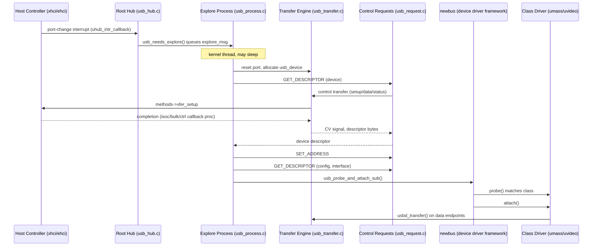

# USB and Thunderbolt — Host Controllers, Enumeration, and Device Classes
<!-- This file is auto-generated by generate-doc.py -- do not edit manually -->

---
**Navigation:**
  **Up:** [NIC Drivers — from if_vr to iflib to if_cxgbe](../README_nic_drivers.md) ▸ [Kernel Core — Structure and Entry Point](../../README.md) ▸ [Source Tree — Layout and Conventions](../../../README_internals.md)
  **Related:** [Device Driver Framework — newbus and devclass](../../kern/README_driver.md) | [DMA and busdma — Tags, Maps, and Bounce Buffers](../../kern/README_busdma.md) | [Sound — pcm Channels, Feeder Chains, and Mixers](../sound/README.md)
  **All chapters:** [Source Tree — Layout and Conventions](../../../README_internals.md) | [Boot Process — UEFI Bootloader to Kernel Handoff](../../../stand/efi/loader/README.md) | [Kernel Core — Structure and Entry Point](../../README.md) | [Build System — buildworld and buildkernel](../../../share/mk/README.md) | [System Calls and Image Activation — Entry, sysent, and exec](../../kern/README_syscall.md) | [Kernel Modules and the Linker — KLD, SYSINIT, and linker sets](../../kern/README_kld.md) | [Virtual Memory Subsystem — vm_page, UMA, and Pagers](../../vm/README.md) | [Process Management — Scheduling and Lifecycle](../../kern/README_process.md) ...
---


## Quick Summary

FreeBSD's USB stack turns a physical port into a tree of attachable devices. When a plug lands on a port, the host controller (an EHCI (Enhanced Host Controller Interface), OHCI, UHCI, or xHCI device) raises an interrupt. The hub driver catches that interrupt and asks a per-bus kernel [thread](../../kern/README_process.md#glossary) (created via [`kthread(9)`](../../../share/man/man9/kthread.9)) to reset the port, read the device's descriptors, and assign it a stable address. Only after that [enumeration](#glossary) walk does [newbus](../../kern/README_driver.md#glossary) [probe](../../kern/README_driver.md#glossary) and [attach](../../kern/README_driver.md#glossary) a class driver — a mass-storage driver, a video driver, a network driver. This chapter follows that walk end to end: the host-controller interface, the device/configuration/interface/endpoint model, the transfer engine and its four transfer types, hub and port handling, and the way a device class binds.

The transfer engine is the heart of the stack. A class driver never touches a controller's registers; it describes what it wants to move in a `struct usb_xfer`, and the engine hands that to the host controller through a small function-pointer table, `struct usb_bus_methods`. The engine supports four transfer types — control, bulk, interrupt, and isochronous — each with different scheduling guarantees. Control transfers carry the enumeration dialogue; bulk carries maximum-throughput data; interrupt carries low-latency periodic data; isochronous carries fixed-slot, lossy periodic data. The choice of type decides which per-bus kernel thread runs the completion callback.

FreeBSD does not run transfer-completion callbacks inside the interrupt handler. Instead each USB bus owns a small family of kernel threads — an explore process for enumeration, a control-transfer process, and separate callback processes for [Giant](../../kern/README_locking.md#glossary)-locked, bulk, and isochronous completions. The interrupt handler only enqueues a message; the thread does the work that may sleep. That is what lets a driver submit a control transfer with `usbd_transfer()` and then sleep on a condition variable until it completes, without stalling the whole bus.

Thunderbolt and USB4 — the unified cable and fabric standard that merges Thunderbolt and USB into one protocol — are covered as the fabric that USB4 converges with, not as a separate device class. A Thunderbolt controller exposes a Native Host Interface (NHI) over PCIe; the host walks a tree of routers by reading their config space through NHI command frames, and presents the devices behind those routers as ordinary PCIe bridges. Because that fabric tunnels full PCIe config space and DMA, it creates a security exposure — a rogue device can reach host memory and other devices' config space — that plain USB, with its limited descriptor model, does not.

## Glossary

**Enumeration** — the sequence of control transfers (reset, get device descriptor, set address, get configuration) that turns an unknown, unaddressed device on a port into a device with a stable address and a parsed descriptor tree.
**EHCI TD / QH / QTD** — the host controller's scheduling units in EHCI: a Transfer Descriptor (TD) is a DMA-mapped block describing one or more packets for one endpoint; a Queue Head (QH) is the per-endpoint scheduling node that owns a linked list of Queue TDs (QTDs) carrying its data. xHCI emulates this TD/QH model so that controller drivers stay similar.
**xHCI TRB / slot & endpoint context** — xHCI's ring-based scheduling model: a Transfer Request Block (TRB) is the 16-byte ring entry the controller dequeues from a transfer, command, or event ring (the xHCI analogue of a TD); slot and endpoint contexts are per-device and per-endpoint state blocks the controller reads from memory instead of programming per transfer, which is how xHCI scales to many devices.
**TT (Transaction Translator)** — a hub feature that splits high-speed isochronous and interrupt transactions on downstream full- or low-speed ports so they fit the slower port's frame timing.
**Route (`tb_route_t`)** — a 64-bit path identifier in a Thunderbolt/USB4 topology: a chain of adapter indices, one byte per hop, that names exactly one route through the router tree.
**NHI (Native Host Interface)** — the PCIe-exposed mailbox and ring interface a host uses to send command frames to a Thunderbolt/USB4 controller; the host's only door into the fabric.
**PDF (Pipe/Descriptor Function)** — the NHI's per-ring function index that routes a command or response to the right software callback; the host registers a dispatch routine per PDF.
**VSC/VSEC (Vendor-Specific Capability/Extended Capability)** — a PCIe capability block a Thunderbolt router exposes so the host can discover and program its TB-specific features.

## Architecture

The stack is layered so that each layer only knows the one below it. At the bottom, a host-controller driver — `sys/dev/usb/controller/xhci.c`, `ehci.c`, `ohci.c`, `uhci.c`, or one of the OTG drivers (`dwc_otg.c`, `musb_otg.c`) — owns the hardware registers and implements the `struct usb_bus_methods` function table. The glue that binds a controller to the rest of the stack lives in `sys/dev/usb/controller/usb_controller.c`: it defines the `usbus` newbus driver with `usb_probe`/`usb_attach` and registers it under each controller with `DRIVER_MODULE(usbus, ohci, usb_driver, 0, 0)` and friends, so that a new `usbus` device appears as a child of each detected controller.

Above the controller sits the bus and the transfer engine. `sys/dev/usb/usb_bus.h` defines `struct usb_bus`, one per controller, holding the per-bus kernel threads, the `bus_mtx`/`bus_spin_lock`, the interrupt queue `intr_q`, the DMA tags, and a pointer to the controller's `methods`. `sys/dev/usb/usb_transfer.c` implements the engine: it owns `struct usb_xfer`, does the busdma mapping (delegated to `sys/dev/usb/usb_busdma.c`), and calls `methods->xfer_setup` / `methods->xfer_unsetup` to push work to and [reclaim](../../sys/README_mbuf.md#glossary) it from the controller. `sys/dev/usb/usb_request.c` builds the standard control requests on top of that, and `sys/dev/usb/usb_device.c` owns the descriptor tree and the enumeration walk. `sys/dev/usb/usb_hub.c` implements the hub class, including the root hub that every controller presents.

The public face of this engine is `sys/dev/usb/usbdi.h`, the header that class drivers include to obtain the USB driver-facing API: the `usbd_*` functions, `struct usb_xfer`, and the transfer-type constants. It sits on top of the `usb_bus_methods` table the engine uses internally to talk to a specific controller, so a class driver programs a transfer through `usbdi.h` without ever naming a controller.

The per-bus process model is the load-bearing design decision. `sys/dev/usb/usb_process.c` implements a generic message-dispatching kernel thread, `usb_process()`, and `sys/dev/usb/usb_process.h` defines `struct usb_process`. Each `struct usb_bus` instantiates up to five of them: `explore_proc`, `control_xfer_proc`, and three callback processes (`giant_callback_proc`, `non_giant_bulk_callback_proc`, `non_giant_isoc_callback_proc`). The split exists because the three kinds of completion work have different locking and sleep behaviour, and running them in one thread would let a slow bulk callback starve a time-critical isochronous one.

The Thunderbolt/USB4 fabric is a parallel stack under `sys/dev/thunderbolt/`. `nhi.c`/`nhi_var.h` implement the NHI command mailbox over PCIe; `router.c`/`router_var.h` walk the router tree and perform config-space reads and writes; `tb_pcib.c`/`tb_pcib.h` present each discovered router and endpoint as a `pcib` (PCIe bridge) so that downstream devices attach through the normal PCIe bus code; and `hcm.c` implements the Host Configuration Manager for USB4. `tb_dev.c` exposes a userspace control device. The USB4 convergence point is that the same NHI/ring machinery carries both the Thunderbolt config-space protocol and the USB4 tunnelled-USB protocol, so the host treats a USB4 link and a Thunderbolt link with one set of command frames.

## Key Data Structures

**The device model** (`sys/dev/usb/usb_device.h`) mirrors the USB descriptor hierarchy: a `usb_device` owns a list of configurations, each configuration a list of interfaces, each interface a list of endpoints. The leaf and its parent are:

```c
struct usb_host_endpoint {
	struct usb_endpoint_descriptor desc;
	TAILQ_HEAD(, urb) bsd_urb_list;
	struct usb_xfer *bsd_xfer[2];
	uint8_t *extra;			/* Extra descriptors */
	usb_frlength_t fbsd_buf_size;
	uint16_t extralen;
	uint8_t	bsd_iface_index;
} __aligned(USB_HOST_ALIGN);

struct usb_host_interface {
	struct usb_interface_descriptor desc;
	/* the following array has size "desc.bNumEndpoint" */
	struct usb_host_endpoint *endpoint;
	const char *string;		/* iInterface string, if present */
	uint8_t *extra;			/* Extra descriptors */
	uint16_t extralen;
	uint8_t	bsd_iface_index;
} __aligned(USB_HOST_ALIGN);
```

The `usb_host_interface.endpoint` pointer array is sized by the interface descriptor's `bNumEndpoint`, so usb_host_interface is a faithful in-kernel copy of the wire interface descriptor with its endpoint children.

**The transfer** is described by `struct usb_xfer` (in `sys/dev/usb/usb_core.h`), whose internal [state](../../netpfil/pf/README.md#glossary) flags live in `struct usb_xfer_flags_int`:

```c
struct usb_xfer_flags_int {
	enum usb_hc_mode usb_mode;	/* shadow copy of "udev->usb_mode" */
	uint16_t control_rem;		/* remainder in bytes */

	uint8_t	open:1;			/* set if USB pipe has been opened */
	uint8_t	transferring:1;		/* set if an USB transfer is in
					 * progress */
	uint8_t	did_dma_delay:1;	/* set if we waited for HW DMA */
	uint8_t	did_close:1;		/* set if we closed the USB transfer */
	uint8_t	draining:1;		/* set if we are draining an USB
					 * transfer */
	uint8_t	started:1;		/* keeps track of started or stopped */
	uint8_t	bandwidth_reclaimed:1;
	uint8_t	control_xfr:1;		/* set if control transfer */
	uint8_t	control_hdr:1;		/* set if control header should be
					 * sent */
	uint8_t	control_act:1;		/* set if control transfer is active */
	uint8_t	control_stall:1;	/* set if control transfer should be stalled */
	...
};
```

The `control_*` bitfields encode the three-stage state machine of a control transfer (setup, data, status), which the engine advances across multiple controller TDs. A transfer is configured from a `struct usb_config`, as the built-in control-endpoint template shows:

```c
static const struct usb_config usb_control_ep_cfg[USB_CTRL_XFER_MAX] = {
	/* This transfer is used for generic control endpoint transfers */

	[0] = {
		.type = UE_CONTROL,
		.endpoint = 0x00,	/* Control endpoint */
		.direction = UE_DIR_ANY,
		.bufsize = USB_EP0_BUFSIZE,	/* bytes */
		.flags = {.proxy_buffer = 1,},
		.callback = &usb_request_callback,
		.usb_mode = USB_MODE_DUAL,	/* both modes */
	},
	...
};
```

**The bus and its processes** (`sys/dev/usb/usb_bus.h`) carry the per-bus threads and the controller [hook](../../netgraph/README.md#glossary):

```c
struct usb_bus {
	...
#if USB_HAVE_PER_BUS_PROCESS
	/*
	 * There are three callback processes. One for Giant locked
	 * callbacks. One for non-Giant locked non-periodic callbacks
	 * and one for non-Giant locked periodic callbacks. This
	 * should avoid congestion and reduce response time in most
	 * cases.
	 */
	struct usb_process giant_callback_proc;
	struct usb_process non_giant_isoc_callback_proc;
	struct usb_process non_giant_bulk_callback_proc;

	/* Explore process */
	struct usb_process explore_proc;

	/* Control request process */
	struct usb_process control_xfer_proc;
#endif

	struct usb_bus_msg explore_msg[2];
	...
	struct mtx bus_mtx;
	struct mtx bus_spin_lock;
	struct usb_xfer_queue intr_q;
	struct usb_callout power_wdog;	/* power management */

	device_t parent;
	device_t bdev;			/* filled by HC driver */
	...
	const struct usb_bus_methods *methods;	/* filled by HC driver */
	struct usb_device **devices;

	struct bpf_if *bpf;	/* USB Packet Filter */
	...
};
```

The `struct usb_process` itself (`sys/dev/usb/usb_process.h`) is a message queue plus a condition variable plus the thread that drains it:

```c
struct usb_process {
	TAILQ_HEAD(, usb_proc_msg) up_qhead;
	struct cv up_cv;
	struct cv up_drain;

	struct thread *up_ptr;
	struct thread *up_curtd;
	struct mtx *up_mtx;

	usb_size_t up_msg_num;

	uint8_t	up_prio;
	uint8_t	up_gone;
	uint8_t	up_msleep;
	uint8_t	up_csleep;
	uint8_t	up_dsleep;
};
```

**The host-controller interface** is the function table in `sys/dev/usb/usb_controller.h`. This is the KPI (kernel programming interface) that isolates the engine from every controller:

```c
struct usb_bus_methods {
	/* USB Device and Host mode - Mandatory */

	usb_handle_req_t *roothub_exec;

	void    (*endpoint_init) (struct usb_device *,
		    struct usb_endpoint_descriptor *, struct usb_endpoint *);
	void    (*xfer_setup) (struct usb_setup_params *);
	void    (*xfer_unsetup) (struct usb_xfer *);
	void    (*get_dma_delay) (struct usb_device *, uint32_t *);
	void    (*device_suspend) (struct usb_device *);
	void    (*device_resume) (struct usb_device *);
	void    (*set_hw_power) (struct usb_bus *);
	void    (*set_hw_power_sleep) (struct usb_bus *, uint32_t);
	...
```

`xfer_setup` is called with a `struct usb_setup_params` (in `sys/dev/usb/usb_transfer.h`) that bundles the current xfer, its DMA page cache, the endpoint, and the methods pointer, so a controller driver can do everything it needs for one endpoint in one call.

**The hub** (`sys/dev/usb/usb_hub.h`) is a device plus an array of ports; the variable-length `ports[0]` array is sized at allocation to `nports`:

```c
struct usb_port {
	uint8_t	restartcnt;
#define	USB_RESTART_MAX 5
	uint8_t	device_index;		/* zero means not valid */
	enum usb_hc_mode usb_mode;	/* host or device mode */
#if USB_HAVE_TT_SUPPORT
	struct usb_device_request req_reset_tt __aligned(4);
#endif
};

struct usb_hub {
	struct usb_device *hubudev;	/* the HUB device */
	usb_error_t (*explore) (struct usb_device *hub);
	void   *hubsoftc;
#if USB_HAVE_TT_SUPPORT
	struct usb_udev_msg tt_msg[2];
#endif
	usb_size_t uframe_usage[USB_HS_MICRO_FRAMES_MAX];
	uint16_t portpower;		/* mA per USB port */
	uint8_t	isoc_last_time;
	uint8_t	nports;
#if (USB_HAVE_FIXED_PORT == 0)
	struct usb_port ports[0];
#else
	struct usb_port ports[USB_MAX_PORTS];
#endif
};
```

**The Thunderbolt NHI command frame** (`sys/dev/thunderbolt/nhi_var.h`) is the unit of work the host sends down the fabric:

```c
struct nhi_cmd_frame {
	TAILQ_ENTRY(nhi_cmd_frame)	cm_link;
	uint32_t		*data;
	bus_addr_t		data_busaddr;
	u_int			req_len;
	uint16_t		flags;
#define CMD_MAPPED		(1 << 0)
#define CMD_POLLED		(1 << 1)
#define CMD_REQ_COMPLETE	(1 << 2)
#define CMD_RESP_COMPLETE	(1 << 3)
#define CMD_RESP_OVERRUN	(1 << 4)
	uint16_t		retries;
	uint16_t		pdf;
	uint16_t		idx;

	void			*context;
	u_int			timeout;

	uint32_t		*resp_buffer;
	u_int			resp_len;
};
```

The ring that carries these frames is `struct nhi_ring_pair`, a matched TX/RX [descriptor ring](../README_nic_drivers.md#glossary) plus per-PDF dispatch tables:

```c
struct nhi_pdf_dispatch {
	nhi_ring_cb_t		*cb;
	void			*context;
};

struct nhi_intr_tracker {
	struct nhi_softc	*sc;
	struct nhi_ring_pair	*ring;
	struct nhi_pdf_dispatch	txpdf[16];
	struct nhi_pdf_dispatch	rxpdf[16];
	u_int			vector;
};
```

**The Thunderbolt config-space protocol** (`sys/dev/thunderbolt/tbcfg_reg.h`) is a set of packed request/response frames, each addressed by a `tb_route_t`:

```c
struct tb_cfg_read {
	tb_route_t			route;
	uint32_t			addr_attrs;
#define TB_CFG_ADDR_SHIFT		0
#define TB_CFG_ADDR_MASK		GENMASK(12,0)
#define TB_CFG_SIZE_SHIFT		13
#define TB_CFG_SIZE_MASK		GENMASK(18,13)
#define TB_CFG_ADAPTER_SHIFT		19
#define TB_CFG_ADAPTER_MASK		GENMASK(24,19)
#define TB_CFG_CS_PATH			(0x00 << 25)
#define TB_CFG_CS_ADAPTER		(0x01 << 25)
#define TB_CFG_CS_ROUTER		(0x02 << 25)
#define TB_CFG_CS_COUNTERS		(0x03 << 25)
	uint32_t			crc;
};

struct tb_cfg_read_resp {
	tb_route_t			route;
	uint32_t			addr_attrs;
	uint32_t			data[0];	/* Up to 60 dwords */
} __packed;
```

The `TB_CFG_CS_*` bits select which config space is being addressed — the path, the adapter, or the router — which is how one frame type reaches three different address spaces.

## Deep Dive

### From interrupt to enumeration

The controller's interrupt handler does the minimum: it records the event and wakes the bus. For a port change, the root-hub path funnels into `uhub_intr_callback()` in `sys/dev/usb/usb_hub.c`, which calls `usb_needs_explore()`. That function does not run enumeration inline; it queues an `explore_msg` onto the bus's `explore_proc` and signals its condition variable. The reason for the indirection is that enumeration issues a string of control transfers, each of which may sleep waiting for the device, and interrupt context may not sleep.

The explore thread runs the actual walk. In `sys/dev/usb/usb_device.c`, the explore entry point allocates a `struct usb_device` with `usb_alloc_device()`, then issues the standard control requests from `sys/dev/usb/usb_request.c`: reset the port, read the device descriptor, assign an address, re-read the device descriptor at the new address, and read the configuration and interface descriptors. Each of those reads is a control transfer submitted through the engine and waited on with a condition variable, so the explore thread is the one that sleeps. Once the descriptor tree is parsed with `usb_config_parse()`, the code calls `usb_probe_and_attach_sub()`, which fills a `struct usb_attach_arg` and hands the new device to newbus. From that point on the Device Driver Framework owns the probe/attach decision; the USB stack has done its job.

The steps that can sleep are exactly the control transfers and the newbus attach. The steps that cannot sleep are the interrupt handler and the controller's `xfer_setup`/`xfer_unsetup` calls, which run with the bus spin lock held. This is why the engine keeps a `bus_mtx` (sleepable, held across the slow work) separate from a `bus_spin_lock` (held only across the hardware register accesses).

### Why a per-bus process

The dispatcher in `sys/dev/usb/usb_process.c` is a tight loop that dequeues a message and runs its callback, and it documents the invariant that makes the whole model safe:

```c
	while (1) {
		if (up->up_gone)
			break;

		/*
		 * NOTE to reimplementors: dequeueing a command from the
		 * "used" queue and executing it must be atomic, with regard
		 * to the "up_mtx" mutex. That means any attempt to queue a
		 * command by another thread must be blocked until either:
		 *
		 * 1) the command sleeps
		 *
		 * 2) the command returns
		 * ...
```

Because dequeue-and-dispatch is atomic under `up_mtx`, a driver that submits a transfer and then sleeps on the transfer's own condition variable is guaranteed to be woken by exactly this thread, and no other thread can interleave on the same endpoint. That is the contract `usbd_transfer()` relies on: the caller sleeps, the per-bus process completes the transfer in `usb_transfer.c` and signals the CV, and the caller wakes with the result. Running the callback in the interrupt handler would break this, because the interrupt would have to take the same locks and could not sleep to let the DMA drain.

The three-way callback split mirrors the locking reality. A driver that holds Giant when it submits a transfer gets its completion on `giant_callback_proc`; a periodic (isochronous) completion that must not be delayed by unrelated work goes to `non_giant_isoc_callback_proc`; and bulk completions go to `non_giant_bulk_callback_proc`. `struct usb_bus` even defines convenience macros (`USB_BUS_GIANT_PROC`, `USB_BUS_NON_GIANT_ISOC_PROC`, `USB_BUS_NON_GIANT_BULK_PROC`, `USB_BUS_EXPLORE_PROC`) so the engine routes each completion to the right thread.

### The four transfer types

The engine treats the four types differently in three places: the TD layout it builds, the retry policy, and the callback thread. Control transfers are three-stage and always complete or error, so they are the safe channel for enumeration. Bulk transfers get maximum throughput with no timing guarantee and are retried on error, which is why a mass-storage device can absorb a bad packet. Interrupt transfers are periodic with a bounded interval and a guaranteed slot each frame, so a mouse or keyboard gets a predictable wake-up. Isochronous transfers are periodic and fixed-slot but lossy: a missed frame is dropped, not retried, because retrying would push the data past its deadline.

This is why `uvideo` (`sys/dev/usb/video/uvideo.c`) and `umass` (`sys/dev/usb/storage/umass.c`) are built differently. `uvideo` declares both an isoc and a bulk callback at the top of the file:

```c
static usb_callback_t	uvideo_isoc_callback;
static usb_callback_t	uvideo_bulk_callback;
```

The isoc path must start and stop a chain of frame-list TDs in lockstep with the host's frame counter, cannot retry a dropped frame, and must run its completion on the isoc callback process so a bulk transfer on another endpoint cannot delay it. `umass`, by contrast, is a state machine over bulk pipes. Its header comment states the design directly: the driver handles the Bulk-Only (BBB) and Command/Bulk/Interrupt (CBI) wire protocols, and "The reason for doing this is ... it avoids using tsleep from interrupt context (for example after a failed transfer)." umass drives the state machine from its bulk callbacks and hands the resulting SCSI commands to CAM (Common Access Method, FreeBSD's SCSI middleware layer), which owns everything past the hand-off.

### What xHCI changes

`sys/dev/usb/controller/xhci.c` opens with a note that the driver "emulates the concept about TDs which is found in EHCI specification" so that the controller drivers look similar. Under the hood, xHCI is ring-based: it has a command ring, an event ring, and per-endpoint transfer rings of 16-byte TRBs, plus per-device slot contexts and per-endpoint endpoint contexts that the controller reads from memory. The sizing constants in `sys/dev/usb/controller/xhci.h` show the scale the design targets:

```c
#define	XHCI_MAX_DEVICES	MIN(USB_MAX_DEVICES, 128)
#define	XHCI_MAX_ENDPOINTS	32	/* hardcoded - do not change */
#define	XHCI_MAX_SCRATCHPADS	256	/* theoretical max is 1023 */
#define	XHCI_MAX_EVENTS		232
#define	XHCI_MAX_COMMANDS	(16 * 1)
```

The device-context address table is a flat array indexed by device, which is how the controller finds a device's contexts without a search:

```c
struct xhci_dev_ctx_addr {
	volatile uint64_t	qwBaaDevCtxAddr[USB_MAX_DEVICES + 1];
	struct {
		volatile uint64_t dummy;
	} __aligned(64) padding;
	volatile uint64_t	qwSpBufPtr[XHCI_MAX_SCRATCHPADS];
};
```

Very little of this leaks into the driver-facing KPI. A class driver still sees `struct usb_xfer` and `usbd_transfer()`, and the engine still calls `methods->xfer_setup`. The xHCI driver is the only place that knows about TRBs and contexts; it translates a `usb_xfer` into a chain of TRBs and a slot/endpoint context. The one place the difference does surface is the `struct usb_setup_params` bundle and the `get_dma_delay()` callback, because xHCI's DMA completion timing differs from EHCI's. The rest of the stack is controller-agnostic, which is exactly the property the `usb_bus_methods` table is designed to preserve.

### The Thunderbolt router and NHI

The NHI is a PCIe-exposed mailbox. `nhi.c` allocates a ring pair (`nhi_alloc_ring()`, `nhi_configure_ring()`, `nhi_activate_ring()`), and `nhi_inmail_cmd()` / `nhi_outmail_cmd()` send and receive `struct nhi_cmd_frame`s over it. Each frame names a PDF, and the host registers a dispatch routine per PDF with `nhi_register_pdf()`; the `nhi_intr_tracker`'s `txpdf[16]` / `rxpdf[16]` arrays are the lookup that routes an interrupt to the right callback.

`router.c` walks the fabric. `router_lookup_device()` takes a `tb_route_t` and follows it hop by hop, peeling off the low byte of the route as the next adapter index:

```c
	while (cursor != NULL) {
		this_rt = TB_ROUTE(cursor);
		...
		if (this_rt == search_rt)
			break;

		/* Prepare to go to the next hop node in the route */
		hop = remainder_rt & 0xff;
		remainder_rt >>= 8;
		...
```

Config-space reads and writes are built as the `tb_cfg_read` / `tb_cfg_write` frames, sent as NHI command frames, and answered by `tb_cfg_read_resp` / `tb_cfg_write_resp`. `tb_pcib.c` then presents each router and endpoint as a `pcib`, so a device behind a router attaches through the ordinary PCIe bus code rather than any Thunderbolt-specific path. `hcm.c` adds the Host Configuration Manager for USB4, and `tb_dev.c` exposes the fabric to userspace.

The security consequence is the reason the chapter draws the USB/Thunderbolt line. Plain USB exposes a device's limited descriptor model; the worst a USB device can do is misbehave within its endpoints. A Thunderbolt/USB4 device, however, is a full PCIe endpoint with DMA. The `tb_cfg_read` frames let the host read any router's config space, and the fabric lets a device's DMA reach host memory. A rogue device can therefore read host memory and probe other devices' config space — an exposure the USB descriptor model does not create. The `TB_CFG_CS_PATH` / `TB_CFG_CS_ADAPTER` / `TB_CFG_CS_ROUTER` selector bits in `struct tb_cfg_read` are the mechanism by which that wide config-space access is expressed in a single frame type.

## Flow / Diagram



## Advanced Notes

**Debugging.** The stack has per-subsystem debug sysctls under `hw.usb.*`: `hw.usb.xhci.debug`, `hw.usb.uvideo.debug`, `hw.usb.ctrl.debug`, `hw.usb.proc.debug`, and `hw.usb.no_cs_fail` (which makes clear-stall failures non-fatal, useful for diagnosing a wedged endpoint). `sys/dev/usb/usb_debug.c` provides `usb_dump_device()`, `usb_dump_endpoint()`, `usb_dump_xfer()`, and `usb_dump_queue()` for dumping a device's state from a debugger or [DDB](../../kern/README_kdb.md#glossary). The `struct bpf_if *bpf` field on `struct usb_bus` is the hook for `usbmon`-style packet capture: attach a BPF socket to the bus to see every TD the engine submits.

**Performance.** The per-bus process split is a latency decision, not a throughput one. If you see isochronous underruns on a `uvideo` device, first confirm the isoc completions are actually landing on `non_giant_isoc_callback_proc` and not being delayed behind a Giant-locked callback; the `USB_BUS_*_PROC` macros make the routing visible in the code. The `uframe_usage[]` arrays on both `struct usb_bus` and `struct usb_hub` track per-microframe isochronous bandwidth, and `usb_hs_bandwidth_alloc()` / `usb_hs_bandwidth_free()` in `sys/dev/usb/usb_hub.c` enforce the per-frame isochronous budget, which is the limit that rejects an over-subscribed isoc endpoint.

**Pitfalls.** The atomicity invariant in `usb_process()` is the single most important contract in the stack: a callback must not re-enter the same endpoint from another thread, or the dequeue/dispatch atomicity is broken and a driver can deadlock on its own condition variable. The `recurse_1`/`recurse_2`/`recurse_3` bits in `struct usb_xfer_queue` exist to detect exactly this kind of recursive re-entry. A second pitfall is DMA delay: `get_dma_delay()` and the `did_dma_delay` flag exist because a controller can still be writing a TD's data when the completion interrupt fires; the engine must wait for the DMA to drain before the driver reads the buffer, or it sees stale or torn data. On xHCI this is the `XHCI_MAX_STREAMS` / `xhcistreams` sysctl territory — enabling streams changes the TRB layout and the context, so a driver that assumes a single TD per frame can misbehave if streams are turned on.

**Theory connection.** The four transfer types map directly onto the scheduling categories any OS textbook lists: control is a synchronous request/response (a blocking call), bulk is a best-effort high-bandwidth flow (a fair-share queue), interrupt is a bounded-latency periodic task (a real-time deadline), and isochronous is a fixed-slot periodic task that tolerates loss (a real-time task with a discard policy). FreeBSD's choice to run the completion callbacks in per-bus kernel threads rather than in interrupt context is the same decoupling that separates a device driver's interrupt handler from its taskqueue or worker thread elsewhere in the kernel: the interrupt does the work that must not sleep, the worker does the work that may. The Thunderbolt/USB4 fabric is the same idea at a higher layer — a command ring and a response ring with per-PDF dispatch, which is structurally a mailbox driver, and its security model is the standard PCIe DMA-attacker model rather than the USB descriptor model.

## See Also
- [Device Driver Framework — newbus and devclass](../../kern/README_driver.md)
- [DMA and busdma — Tags, Maps, and Bounce Buffers](../../kern/README_busdma.md)
- [Sound — pcm Channels, Feeder Chains, and Mixers](../sound/README.md)


- Device Driver Framework — newbus and devclass: [`sys/kern/`](../../kern) (the probe/attach that USB hands off to).
- DMA and busdma — Tags, Maps, and Bounce Buffers: [`sys/kern/`](../../kern) (the `busdma` mechanics that [`sys/dev/usb/usb_busdma.c`](usb_busdma.c) builds on).
- Sound — pcm Channels, Feeder Chains, and Mixers: [`sys/dev/sound/`](../sound) (audio-class USB devices beyond the transfer layer).
- CAM chapter: [`sys/cam/`](../../cam) (everything after `umass` hands a SCSI command to CAM).
- Source directories: [`sys/dev/usb/`](.) (core, hub, transfer, request), [`sys/dev/usb/controller/`](controller) (xhci, ehci, ohci, uhci, dwc_otg, musb_otg), [`sys/dev/usb/storage/`](storage), [`sys/dev/usb/video/`](video), [`sys/dev/usb/net/`](net), [`sys/dev/thunderbolt/`](../thunderbolt) (nhi, router, tb_pcib, hcm, tb_dev).
- Man pages: [`usb(4)`](../../../share/man/man4/usb.4), `usbus(4)`, [`xhci(4)`](../../../share/man/man4/xhci.4), [`ehci(4)`](../../../share/man/man4/ehci.4), [`ohci(4)`](../../../share/man/man4/ohci.4), [`uhci(4)`](../../../share/man/man4/uhci.4), `uhub(4)`, [`umass(4)`](../../../share/man/man4/umass.4), [`uvideo(4)`](../../../share/man/man4/uvideo.4), [`ugen(4)`](../../../share/man/man4/ugen.4), `uhidev(4)`, `usbdevs(4)`, `nhi(4)`, `tbolt(4)`, [`bus_dma(9)`](../../../share/man/man9/bus_dma.9), [`device(9)`](../../../share/man/man9/device.9), [`condvar(9)`](../../../share/man/man9/condvar.9), [`kthread(9)`](../../../share/man/man9/kthread.9), `mtx(9)`, [`taskqueue(9)`](../../../share/man/man9/taskqueue.9).

---

> _Generated by [DaemonDocs](https://github.com/ocochard/DaemonDocs) on 2026-09-02 06:42 UTC using model `Qwen3.8-27B-Q8_0` (llama.cpp build `b10553-cd26896c1`). AI-generated content — verify against source before relying on it._
