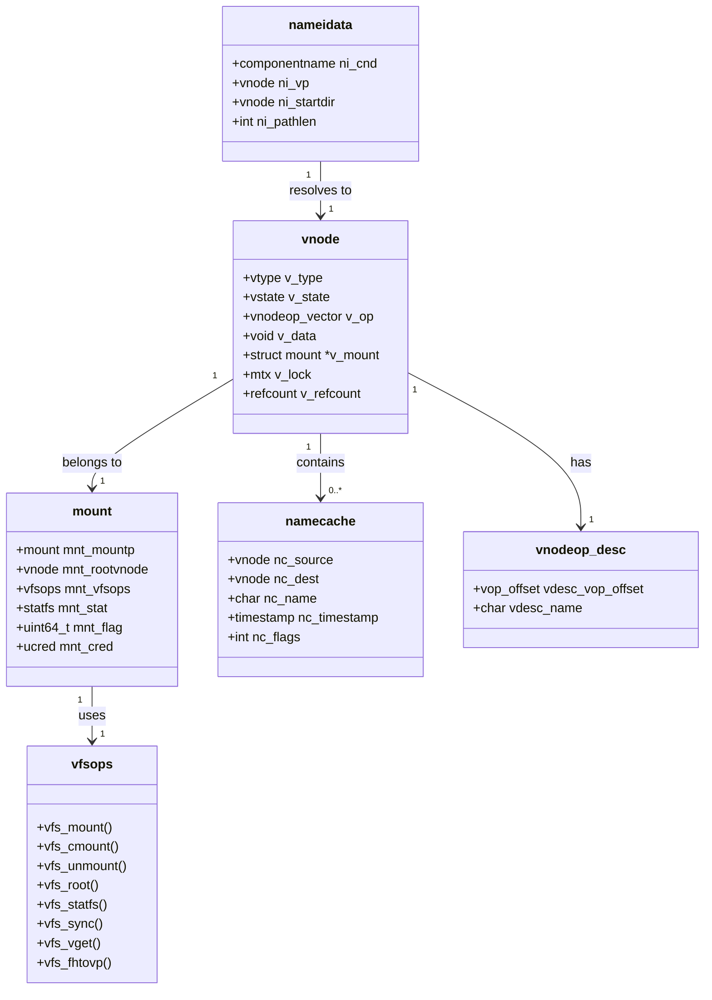

# VFS — Virtual File System Layer
<!-- This file is auto-generated by generate-doc.py -- do not edit manually -->

---
**Navigation:**
  **Up:** [Kernel Core — Structure and Entry Point](../README.md) ▸ [Source Tree — Layout and Conventions](../../README_internals.md)
  **Related:** [Virtual Memory Subsystem — vm_page, UMA, and Pagers](../vm/README.md) | [Buffer Cache — Block I/O Subsystem](../vm/README_bcache.md) | [UFS — FreeBSD's Native Filesystem](../ufs/README.md) | [ZFS — Pooled Storage and Copy-on-Write Filesystem](../contrib/openzfs/README_freebsd.md) | [Network Stack — Architecture and Packet Flow](../net/README.md)
  **All chapters:** [Source Tree — Layout and Conventions](../../README_internals.md) | [Boot Process — UEFI Bootloader to Kernel Handoff](../../stand/efi/loader/README.md) | [Kernel Core — Structure and Entry Point](../README.md) | [Build System — buildworld and buildkernel](../../share/mk/README.md) | [Virtual Memory Subsystem — vm_page, UMA, and Pagers](../vm/README.md) | [Process Management — Scheduling and Lifecycle](../kern/README_process.md) | [Locking Primitives — Mutexes, sx, rmlocks, and Atomics](../kern/README_locking.md) | [Buffer Cache — Block I/O Subsystem](../vm/README_bcache.md) ...
---

> ⚠ **UNVERIFIED DRAFT** — reviewer did not explicitly approve this draft. Treat claims as suspect until manually reviewed.

## Quick Summary

The Virtual File System (VFS) in FreeBSD provides a unified programming interface for various storage backends. It acts as a translation layer between user-space applications and the specific implementations of individual filesystems such as UFS, ZFS, tmpfs, and network filesystems. By abstracting the common operations — reading, writing, and directory traversal — into a standard set of function pointers, the VFS allows new filesystems to be added without rewriting the kernel's core logic. This design ensures that applications see a consistent POSIX-compliant view of the file hierarchy, regardless of the underlying storage technology.

At the heart of the VFS lies the **vnode**, a kernel structure that represents an open file or directory. Every file, directory, socket, or device node is represented by a unique vnode during its lifetime. The vnode serves as the primary handle through which the kernel interacts with the file's data, managing caching, locking, and access control. When a process opens a file, the VFS resolves the pathname to locate the correct vnode and returns a file descriptor referencing it.

A key concept in the VFS is the relationship between vnodes and filesystem-specific inodes. A vnode is a kernel-internal abstraction representing an open file or directory, while inodes are filesystem-specific metadata structures. The vnode's `v_data` field points to the filesystem's inode (for example, a UFS inode for UFS, or a ZFS-specific inode structure for ZFS). The vnode acts as a unified handle regardless of the underlying inode format, allowing the VFS to present a consistent interface to the rest of the kernel while each filesystem manages its own metadata structures internally.

The VFS also manages **mount points**, which define where a specific filesystem's namespace is attached to the global directory tree. Each mount point is tracked by a `struct mount`, which holds statistics, flags, and a reference to the root vnode of that filesystem. This hierarchical structure supports the Unix tradition of a single root directory, allowing administrators to stack multiple filesystems (e.g., `/usr`, `/home`, `/mnt`) into a single coherent tree. Finally, the VFS includes a namecache subsystem to optimize pathname resolution, significantly reducing the overhead of repeated filesystem operations by caching the mapping between directory entries and their corresponding vnodes.

## Architecture

The VFS layer is implemented primarily in `sys/kern/`, with headers in `sys/sys/`. The architecture is organized around four main subsystems: pathname resolution, mount management, vnode operations, and syscall dispatch.

**Pathname Resolution**
Pathname resolution is handled by `sys/kern/vfs_lookup.c`. The core function `namei()` takes a path string and resolves it to a vnode. It uses a `struct nameidata` to track the current state of the resolution, including the current directory and any pending symlinks. The VFS uses a UMA zone (`namei_zone`) to allocate `nameidata` structures, ensuring efficient memory management. The resolution process involves iterating through each component of the path, calling the `VOP_LOOKUP` operation on the parent directory vnode to find the child.

The `namei_zone` UMA zone is initialized during boot and provides lock-free allocation of `nameidata` structures, which are essential for the lookup process. SDT probes are defined in `vfs_lookup.c` to trace lookup operations:
```c
SDT_PROBE_DEFINE4(vfs, namei, lookup, entry, "struct vnode *", "char *",
    "unsigned long", "bool");
SDT_PROBE_DEFINE4(vfs, namei, lookup, return, "int", "struct vnode *", "bool",
    "struct nameidata");
```

**VFS Syscall Dispatch**
System calls that interact with the VFS are implemented in `sys/kern/vfs_syscalls.c`. This file contains the kernel entry points for VFS-related syscalls such as `open()`, `openat()`, `read()`, `write()`, `unlink()`, and `rename()`. When a user-space process invokes a VFS syscall, the kernel's syscall dispatch mechanism routes the call to the appropriate function in `vfs_syscalls.c`.

For example, the `openat()` syscall is handled by `kern_openat()`, which validates the file descriptor and path arguments before invoking `namei()` to resolve the pathname:
```c
/* From sys/kern/vfs_syscalls.c */
static int
kern_openat(struct thread *td, int fd, const char *path, enum uio_seg pathseg,
    int flags, int mode)
{
    struct nameidata nd;
    struct vnode *vp;
    int error;

    NDINIT(&nd, LOOKUP, OP_OPEN | FOLLOW | _audit, UIO_USERSPACE, path, td);
    nd.ni_cnd.cn_cred = td->td_ucred;
    nd.ni_dirfd = fd;
    nd.ni_cnd.cn_flags |= AUDITVNODE1;

    error = namei(&nd);
    if (error == 0) {
        vp = nd.ni_vp;
        error = VOP_OPEN(vp, fmode(flags), td);
        if (error == 0) {
            int fd = fdalloc(td->td_proc, 0, 0, td);
            if (fd >= 0)
                td->td_retval[0] = fd;
        }
    }
    return (error);
}
```

The `kern_openat()` function initializes a `struct nameidata` with the lookup type `LOOKUP` and the operation `OP_OPEN`, then calls `namei()` for pathname resolution. After resolution succeeds and a vnode is obtained, `VOP_OPEN()` is invoked on the vnode to complete the open operation. Then `fdalloc()` allocates a file descriptor and associates it with the resolved vnode. This flow — syscall entry → nameidata initialization → pathname resolution → vnode acquisition → file descriptor allocation — is the standard pattern for VFS syscalls.

Other syscalls in `vfs_syscalls.c` follow similar patterns. For instance, `kern_readv()` and `kern_writev()` retrieve the vnode from the file descriptor and invoke `VOP_READ` or `VOP_WRITE` operations. The `kern_renameat()` function uses `namei()` to resolve both source and target paths before calling the appropriate VOP operations.

**Mount Management**
Mount management is implemented in `sys/kern/vfs_mount.c`. When a filesystem is mounted, the kernel creates a `struct mount` and links it into the global mount list. The `vfs_domount()` function performs the bulk of the mount operation, calling into the filesystem-specific `vfs_mount` callback. The mount structure tracks statistics, flags, and a reference to the root vnode of that filesystem. Deferred unmount is supported through `deferred_unmount_enqueue()` for handling unmounts that cannot complete immediately due to active references.

**Vnode Operations**
Each vnode carries a pointer to a `vnodeop_desc` table that describes the operations supported by that vnode's filesystem. The `vnodeop_desc` structure contains the operation name, offset into the operation vector, and other metadata. Filesystems register their operation vectors during initialization, and the VFS dispatches operations through these vectors. The `vop_generic_args` structure is used to pass arguments to vnode operations uniformly.

**Namecache**
The namecache is implemented in `sys/kern/vfs_cache.c`. It caches the results of pathname lookups to avoid repeated filesystem operations. Namecache entries are stored in a hash table. Each vnode contains pointers to source entries (names which can be found when traversing through said vnode) and destination entries (names resolved from that vnode). The namecache supports both positive and negative entries — the latter cache the fact that a name does not exist, preventing repeated lookups for missing files.

## Key Data Structures

**struct vnode** (`sys/sys/vnode.h`)
The vnode is the core abstraction representing any file, directory, or special file. Key fields include:
```c
/* From sys/sys/vnode.h */
enum vtype {
    VNON, VREG, VDIR, VBLK, VCHR, VLNK, VSOCK, VFIFO, VBAD, VMARKER
};
enum vstate {
    VSTATE_UNINITIALIZED, VSTATE_CONSTRUCTED, VSTATE_DESTROYING, VSTATE_DEAD
};
```
The `v_data` field points to filesystem-specific data (e.g., a UFS inode). The `v_op` field points to the vnode operation vector. Locking is managed through the vnode lock (`v_lock`), and references are tracked via reference counts.

**struct mount** (`sys/sys/mount.h`)
A mount point represents an instance of a mounted filesystem. Key fields include:
```c
/* From sys/sys/mount.h */
struct mount {
    struct mount *mnt_mountp;      /* Mount point for this filesystem */
    struct vnode *mnt_vnodecovered; /* Vnode we are mounted on */
    struct vfsops *mnt_vfsops;     /* VFS operation vector */
    struct vfsconf *mnt_vfc;        /* VFS configuration */
    struct ucred *mnt_cred;        /* Credentials of mounter */
    uint64_t mnt_flag;             /* Mount flags */
    uint64_t mnt_kern_flag;        /* Kernel mount flags */
    struct statfs mnt_stat;        /* Filesystem statistics */
    /* ... additional fields ... */
};
```

**struct statfs** (`sys/sys/mount.h`)
Filesystem statistics including block counts, file counts, and I/O statistics:
```c
/* From sys/sys/mount.h */
struct statfs {
    uint32_t f_version;           /* Structure version number */
    uint32_t f_type;              /* Type of filesystem */
    uint64_t f_flags;             /* Copy of mount exported flags */
    uint64_t f_bsize;             /* Filesystem fragment size */
    uint64_t f_iosize;            /* Optimal transfer block size */
    uint64_t f_blocks;            /* Total data blocks in filesystem */
    uint64_t f_bfree;             /* Free blocks in filesystem */
    int64_t  f_bavail;            /* Free blocks available to non-superuser */
    uint64_t f_files;             /* Total file nodes in filesystem */
    int64_t  f_ffree;             /* Free nodes available to non-superuser */
    uint64_t f_syncwrites;        /* Count of sync writes since mount */
    uint64_t f_asyncwrites;       /* Count of async writes since mount */
    /* ... additional fields ... */
};
```

**struct vfsops** (`sys/sys/mount.h`)
Each filesystem provides a `struct vfsops` containing pointers to its implementation of VFS operations:
```c
/* From sys/sys/mount.h */
struct vfsops {
    int (*vfs_mount)(struct mount *mp, char *path, caddr_t data,
                     size_t datalen, struct thread *td);
    int (*vfs_cmount)(struct vfsconf *vfc, struct thread *td);
    int (*vfs_unmount)(struct mount *mp, int mntflags, struct thread *td);
    int (*vfs_root)(struct mount *mp, int flags, struct vnode **vpp);
    int (*vfs_statfs)(struct mount *mp, struct statfs *sbp, struct thread *td);
    int (*vfs_sync)(struct mount *mp, int waitfor, struct thread *td);
    int (*vfs_vget)(struct mount *mp, struct fid *fhp, struct vnode **vpp);
    int (*vfs_fhtovp)(struct mount *mp, struct fid *fhp,
                      struct vnode **vppp, int *exflagsp,
                      struct ucred **credanonp);
    /* ... more operations ... */
};
```

**Namecache entries** (`sys/kern/vfs_cache.c`)
The namecache entry stores cached results of pathname lookups. Namecache entries are organized as a hash table with per-vnode lists. Entries are aged based on timestamps, and negative entries (cache misses) have shorter lifetimes to allow for faster recovery when files are created after a miss.

## Deep Dive

**Pathname Resolution: From `namei()` to `VOP_LOOKUP`**

When a process calls `open("/path/to/file", ...)`, the VFS resolves the path through `sys/kern/vfs_lookup.c`. The `namei()` function initializes a `struct nameidata` and begins traversal from the root directory:

```c
/* From sys/kern/vfs_lookup.c */
SDT_PROBE_DEFINE4(vfs, namei, lookup, entry, "struct vnode *", "char *",
    "unsigned long", "bool");
```

The resolution process:
1. `namei()` allocates a `nameidata` from the `namei_zone` UMA zone
2. It initializes the structure with the starting directory (root, cwd, or fd-relative)
3. For each path component, it calls `cache_fplookup()` to check the namecache
4. If not cached, it calls `VOP_LOOKUP()` on the parent directory vnode
5. The filesystem's `VOP_LOOKUP` implementation searches its directory entries
6. On success, the result is cached via `cache_enter()` for future lookups
7. Symlinks are followed by recursively resolving the target path

The `nameidata` structure tracks the resolution state:
```c
/* From sys/sys/namei.h */
struct nameidata {
    /* Path length and flags */
    struct componentname ni_cnd;  /* Component name info */
    struct vnode *ni_vp;          /* Current vnode */
    struct vnode *ni_startdir;    /* Starting directory */
    /* ... additional fields ... */
};
```

The `componentname` structure (`struct componentname`) carries per-component information including the name pointer, length, and flags indicating special handling (e.g., `ISLASTCN` for the final component, `ISDOTDOT` for `..` entries).

**Mount Point Management**

Mount operations are handled by `vfs_domount()` in `sys/kern/vfs_mount.c`. The function:
1. Validates the mount type and credentials
2. Allocates a `struct mount` and initializes it
3. Calls the filesystem's `vfs_mount` callback
4. Links the mount into the global mount list
5. Sets the root vnode for the new filesystem

The mount structure maintains statistics in `mnt_stat` (a `struct statfs`), tracks flags (`mnt_flag`), and holds a reference to the root vnode. When a filesystem is mounted on top of an existing vnode, that vnode becomes the mount point and is replaced by the new filesystem's root for subsequent lookups. The `mnt_vnodecovered` field stores the vnode from the parent filesystem that is obscured by the new mount — it is distinct from the mounted filesystem's own root vnode.

Deferred unmount handles cases where a filesystem cannot be unmounted immediately due to active references. The `deferred_unmount_enqueue()` function schedules the unmount for later retry, with configurable retry limits via the `sysctl vfs.deferred_unmount.retry_limit`.

**Vnode Lifecycle**

Vnodes go through several states:
- `VSTATE_UNINITIALIZED`: Memory allocated but not yet configured
- `VSTATE_CONSTRUCTED`: Fully initialized and active
- `VSTATE_DESTROYING`: Being reclaimed, operations should fail
- `VSTATE_DEAD`: Fully reclaimed

The `getnewvnode()` function allocates a new vnode from a UMA zone, initializes it with the filesystem's operation vector, and sets the `v_data` pointer. The `vput()` function releases a reference, and when the reference count reaches zero, the vnode may be recycled or destroyed.

The vnode's `v_op` field points to the filesystem's operation vector, which contains function pointers for operations like `VOP_READ`, `VOP_WRITE`, `VOP_LOOKUP`, etc. The `vnodeop_desc` table describes these operations with names and offsets.

**Namecache: Optimizing Pathname Resolution**

The namecache in `sys/kern/vfs_cache.c` caches both successful and failed lookups. Positive entries cache the mapping from (parent directory, name) to (child vnode), while negative entries cache the fact that a name does not exist in a directory.

The cache is organized as a hash table with entries grouped by source vnode. Each source vnode maintains lists of entries where it is the parent directory. The `cache_fplookup()` function searches the cache for matching entries before falling through to the filesystem's `VOP_LOOKUP`.

Negative entries are evicted more aggressively than positive entries to allow faster recovery when files are created after a cache miss. The `cache_neg_evict()` and `cache_neg_promote()` functions manage this behavior.

The namecache also handles rename and unlink operations via `cache_vop_rename()` and `cache_vop_rmdir()`, invalidating or updating cached entries as the directory structure changes.

## Flow / Diagram



## Advanced Notes

**DTrace Integration**
FreeBSD's VFS includes SDT (Static DTrace Tracing) probes for monitoring pathname resolution. The `vfs,namei,lookup,entry` and `vfs,namei,lookup,return` probes fire on every lookup operation, providing the starting vnode, path string, and result. These probes are defined in `sys/kern/vfs_lookup.c`:
```c
SDT_PROBE_DEFINE4(vfs, namei, lookup, entry, "struct vnode *", "char *",
    "unsigned long", "bool");
SDT_PROBE_DEFINE4(vfs, namei, lookup, return, "int", "struct vnode *", "bool",
    "struct nameidata");
```

**Performance Considerations**
The namecache significantly reduces VFS overhead for repeated lookups. However, it introduces complexity in maintaining consistency during rename, unlink, and mkdir operations. The cache must be invalidated when directory contents change, which adds overhead to these operations. The `cache_purgevfs()` function purges all cache entries for a specific filesystem, used during unmount or when filesystem state changes.

The `namei_zone` UMA zone provides efficient allocation of `nameidata` structures. UMA zones are per-CPU and lock-free for allocation, reducing contention in high-throughput scenarios.

**Race Conditions and Locking**
Vnodes may appear on multiple lists simultaneously. The locking protocol requires:
1. Lock the list and find the vnode
2. Lock the interlock to prevent the vnode from disappearing
3. Unlock the list to avoid lock order reversals
4. Call `vget()` with `LK_INTERLOCK` and check for `ENOENT`, or check `DOOMED` if the vnode lock is not required
5. Perform the operation, then `vput()`

This protocol ensures that vnodes are not accessed after they have been reclaimed. The interlock mechanism prevents races between list removal and vnode access.

**Cross-Mount Operations**
When pathname resolution crosses mount points, the VFS uses `crossmp_vop_*` functions to handle operations that span filesystem boundaries. The `crossmp_vop_islocked()` and `crossmp_vop_lock1()` functions manage locking across mount points, while `crossmp_vop_unlock()` handles the corresponding unlock.

**Deferred Unmount**
FreeBSD supports deferred unmount through `deferred_unmount_enqueue()`. When a filesystem cannot be unmounted due to active references, the unmount is scheduled for later retry. The `sysctl vfs.deferred_unmount.retry_limit` controls the maximum number of retries. This feature is essential for handling complex mount hierarchies where unmount order matters.

**Connection to OS Theory**
The VFS design follows the classic UNIX abstraction of a single directory tree with multiple mounted filesystems. This matches the theoretical model of a file system as a mapping from paths to file contents, with mount points serving as redirection points. The vnode abstraction corresponds to the concept of a file descriptor in user space, providing a kernel-internal handle for file operations.

The namecache optimization is analogous to DNS caching in network protocols — caching results of expensive lookups to reduce latency for repeated queries. The trade-off is consistency: cached entries must be invalidated when underlying data changes, adding complexity to directory operations.

## See Also
- [Virtual Memory Subsystem — vm_page, UMA, and Pagers](../vm/README.md)
- [Buffer Cache — Block I/O Subsystem](../vm/README_bcache.md)
- [UFS — FreeBSD's Native Filesystem](../ufs/README.md)
- [ZFS — Pooled Storage and Copy-on-Write Filesystem](../contrib/openzfs/README_freebsd.md)
- [Network Stack — Architecture and Packet Flow](../net/README.md)


- **sys/kern/vfs_lookup.c** — Pathname resolution implementation
- **sys/kern/vfs_mount.c** — Mount point management
- **sys/kern/vfs_cache.c** — Namecache implementation
- **sys/kern/vfs_syscalls.c** — VFS system call implementations
- **sys/kern/vfs_subr.c** — VFS support routines
- **sys/sys/vnode.h** — Vnode structure and operation definitions
- **sys/sys/mount.h** — Mount and filesystem statistics structures
- **sys/sys/namei.h** — Pathname resolution structures

---

> _Generated by [DaemonDocs](https://github.com/ocochard/DaemonDocs) on 2026-05-04 10:19 UTC using model `Qwen3.6-35B-A3B-UD-Q8_K_XL` (llama.cpp build `b8985-27aef3dd9`). AI-generated content — verify against source before relying on it._
