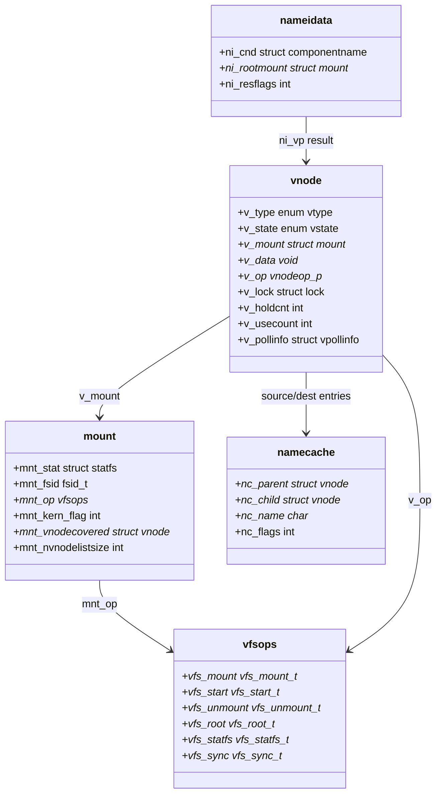

# Virtual File System (VFS) Layer
<!-- This file is auto-generated by generate-doc.py -- do not edit manually -->

---
**Navigation:**
  **Related:** [Virtual Memory Subsystem — vm_page, UMA, and Pagers](../vm/README.md) | [Buffer Cache — Block I/O Subsystem](../vm/README_bcache.md) | [UFS — FreeBSD's Native Filesystem](../ufs/README.md) | [ZFS — Pooled Storage and Copy-on-Write Filesystem](../contrib/openzfs/README_freebsd.md) | [Network Stack — Architecture and Packet Flow](../net/README.md)
  **All chapters:** [Source Tree — Layout and Conventions](../../README_internals.md) | [Boot Process — UEFI Bootloader to Kernel Handoff](../../stand/efi/loader/README.md) | [Kernel Core — Structure and Entry Point](../README.md) | [Build System — buildworld and buildkernel](../../share/mk/README.md) | [Virtual Memory Subsystem — vm_page, UMA, and Pagers](../vm/README.md) | [Process Management — Scheduling and Lifecycle](../kern/README_process.md) | [Locking Primitives — Mutexes, sx, rmlocks, and Atomics](../kern/README_locking.md) | [Buffer Cache — Block I/O Subsystem](../vm/README_bcache.md) ...
---


## Quick Summary

The Virtual File System (VFS) in FreeBSD provides a unified programming interface for various storage backends. It acts as a translation layer between user-space applications and the specific implementations of individual filesystems such as UFS, ZFS, tmpfs, and network filesystems. By abstracting the common operations such as reading, writing, and directory traversal into a standard set of function pointers, the VFS allows new filesystems to be added without rewriting the kernel's core logic. This design ensures that applications see a consistent POSIX-compliant view of the file hierarchy, regardless of the underlying storage technology.

At the heart of the VFS lies the **vnode**, a kernel structure that represents an open file or directory. Every file, directory, socket, or device node is represented by a unique vnode during its lifetime. The vnode serves as the primary handle through which the kernel interacts with the file's data, managing caching, locking, and access control. When a process opens a file, the VFS resolves the pathname to locate the correct vnode and returns a file descriptor referencing it.

A key concept in the VFS is the relationship between vnodes and filesystem-specific inodes. A vnode is a kernel-internal abstraction representing an open file or directory, while inodes are filesystem-specific metadata structures. The vnode's `v_data` field points to the filesystem's inode (for example, a UFS inode for UFS, or a ZFS-specific inode structure for ZFS). The vnode acts as a unified handle regardless of the underlying inode format, allowing the VFS to present a consistent interface to the rest of the kernel while each filesystem manages its own metadata structures internally.

The VFS also manages **mount points**, which define where a specific filesystem's namespace is attached to the global directory tree. Each mount point is tracked by a `struct mount`, which holds statistics, flags, and a reference to the root vnode of that filesystem. This hierarchical structure supports the Unix tradition of a single root directory, allowing administrators to stack multiple filesystems (e.g., `/usr`, `/home`, `/mnt`) into a single coherent tree.

Finally, the VFS includes a namecache subsystem to optimize pathname resolution. Since resolving a path like `/usr/local/bin` requires traversing multiple directories, the kernel caches the results of these lookups. By storing the mapping between directory entries and their corresponding vnodes, the namecache significantly reduces the overhead of repeated filesystem operations, improving performance for applications that access files frequently.

## Architecture

The VFS layer is implemented primarily in `sys/kern/`, with headers in `sys/sys/`. The architecture is organized around three main subsystems: pathname resolution, mount management, and vnode operations.

**Pathname Resolution**
Pathname resolution is handled by `sys/kern/vfs_lookup.c`. The core function `namei()` takes a path string and resolves it to a vnode. It uses a `struct nameidata` to track the current state of the resolution, including the current directory and any pending symlinks. The VFS uses a UMA zone (`namei_zone`) to allocate `nameidata` structures, ensuring efficient memory management. The resolution process involves iterating through each component of the path, calling the `VOP_LOOKUP` operation on the parent directory vnode to find the child.

```c
/* From sys/kern/vfs_lookup.c */
SDT_PROVIDER_DEFINE(vfs);
SDT_PROBE_DEFINE4(vfs, namei, lookup, entry, "struct vnode *", "char *",
    "unsigned long", "bool");
SDT_PROBE_DEFINE4(vfs, namei, lookup, return, "int", "struct vnode *", "bool",
    "struct nameidata");

/* Allocation zone for namei. */
uma_zone_t namei_zone;
```

The `namei()` function manages the state of pathname resolution across restarts, particularly when dealing with symlinks that may cause the resolution to restart from a different directory. The nameidata structure's state flags are manipulated internally by the resolution code to handle symlink following and other restart conditions.

**Mount Management**
Mount operations are implemented in `sys/kern/vfs_mount.c`. When a user calls `mount(2)`, the kernel processes the request by validating the filesystem type, parsing mount options, and calling the specific filesystem's `vfs_mount` function pointer. Mount options are passed through a list of mount options, with a maximum size of `VFS_MOUNTARG_SIZE_MAX` (64KB).

```c
/* From sys/kern/vfs_mount.c */
static int	vfs_domount(struct thread *td, const char *fstype, char *fspath,
		    uint64_t fsflags, bool only_export, bool jail_export,
		    struct mntarg *ma);
```

The mount subsystem exposes several tunables via `SYSCTL`:
- `vfs.usermount` — whether unprivileged users may mount filesystems
- `vfs.default_autoro` — whether to retry failed r/w mounts as r/o
- `vfs.recursive_forced_unmount` — whether to recursively unmount stacked upper mounts
- `vfs.deferred_unmount.retry_limit` — maximum retries for deferred unmount failure

**Vnode Operations**
Each vnode carries a pointer to a `vnodeop_p` vector (`v_op`) containing function pointers for operations like `VOP_READ`, `VOP_WRITE`, `VOP_LOOKUP`, and `VOP_GETATTR`. These operations are dispatched through the VFS layer, which then calls the appropriate filesystem-specific implementation. The `v_data` field of each vnode points to the filesystem's private data structure (e.g., a UFS inode for UFS).

**Namecache**
The namecache is implemented in `sys/kern/vfs_cache.c`. It caches individual path components rather than full paths. For a fully cached path `foo/bar/baz`, there are three cache entries, one for each name. Entries are described by namecache objects stored in a hash table, with each vnode maintaining pointers to source entries (names that can be found when traversing through that vnode) and destination entries (names that this vnode resolves to).

```c
/* From sys/kern/vfs_cache.c - overview comment */
/*
 * High level overview of name caching in the VFS layer.
 *
 * Originally caching was implemented as part of UFS, later extracted to allow
 * use by other filesystems. A decision was made to make it optional and
 * completely detached from the rest of the kernel, which comes with limitations
 * outlined near the end of this comment block.
 *
 * This fundamental choice needs to be revisited. In the meantime, the current
 * state is described below. Significance of all notable routines is explained
 * in comments placed above their implementation. Scattered throughout the
 * file are TODO comments indicating shortcomings which can be fixed without
 * reworking everything (most of the fixes will likely be reusable).
 */
```

## Key Data Structures

**struct vnode** (`sys/sys/vnode.h`)
The vnode is the central abstraction of the VFS. It represents an open file, directory, socket, or device. Key fields include:

```c
/* From sys/sys/vnode.h */
enum vtype {
    VNON,
    VREG,
    VDIR,
    VBLK,
    VCHR,
    VLNK,
    VSOCK,
    VFIFO,
    VBAD,
    VMARKER,
    VLASTTYPE = VMARKER,
};

enum vstate {
    VSTATE_UNINITIALIZED,
    VSTATE_CONSTRUCTED,
    VSTATE_DESTROYING,
    VSTATE_DEAD,
    VLASTSTATE = VSTATE_DEAD,
};
```

The vnode's `v_data` field points to the filesystem-specific inode (e.g., a UFS inode for UFS, a ZFS-specific inode structure for ZFS). The `v_op` field is a pointer to the vnode operation vector. The vnode uses a reference counting scheme with `v_holdcnt` and `v_usecount` to manage its lifetime.

Locking of vnodes follows a strict protocol documented in `sys/sys/vnode.h`:
```c
/* From sys/sys/vnode.h - lock reference */
/*
 * Reading or writing any of these items requires holding the appropriate lock.
 *
 * Lock reference:
 *	c - namecache mutex
 *	i - interlock
 *	l - mp mnt_listmtx or freelist mutex
 *	I - updated with atomics, 0->1 and 1->0 transitions with interlock held
 *	m - mount point interlock
 *	p - pollinfo lock
 *	u - Only a reference to the vnode is needed to read.
 *	v - vnode lock
 *
 * Vnodes may be found on many lists.  The general way to deal with operating
 * on a vnode that is on a list is:
 *	1) Lock the list and find the vnode.
 *	2) Lock interlock so that the vnode does not go away.
 *	3) Unlock the list to avoid lock order reversals.
 *	4) vget with LK_INTERLOCK and check for ENOENT, or
 *	5) Check for DOOMED if the vnode lock is not required.
 *	6) Perform your operation, then vput().
 */
```

**struct mount** (`sys/sys/mount.h`)
Each filesystem instance is represented by a `struct mount`. Key fields include:
- `mnt_stat` — filesystem statistics (a `struct statfs`)
- `mnt_vnodecovered` — vnode on which this filesystem is mounted
- `mnt_vnodelist` — list of vnodes on this mount
- `mnt_fsid` — filesystem ID (`fsid_t`)
- `mnt_op` — pointer to the filesystem's vnode operation vector
- `mnt_kern_flag` — kernel-only mount flags

The `struct statfs` structure (from `sys/sys/mount.h`) holds runtime statistics:
```c
/* From sys/sys/mount.h */
#define	STATFS_VERSION	0x20140518	/* current version number */
struct statfs {
	uint32_t f_version;		/* structure version number */
	uint32_t f_type;		/* type of filesystem */
	uint64_t f_flags;		/* copy of mount exported flags */
	uint64_t f_bsize;		/* filesystem fragment size */
	uint64_t f_iosize;		/* optimal transfer block size */
	uint64_t f_blocks;		/* total data blocks in filesystem */
	uint64_t f_bfree;		/* free blocks in filesystem */
	int64_t	 f_bavail;		/* free blocks avail to non-superuser */
	uint64_t f_files;		/* total file nodes in filesystem */
	int64_t	 f_ffree;		/* free nodes avail to non-superuser */
	uint64_t f_syncwrites;		/* count of sync writes since mount */
	uint64_t f_asyncwrites;		/* count of async writes since mount */
	uint64_t f_syncreads;		/* count of sync reads since mount */
	uint64_t f_asyncreads;		/* count of async reads since mount */
	uint32_t f_nvnodelistsize;	/* # of vnodes */
	uint32_t f_spare0;		/* unused spare */
	uint64_t f_spare[9];		/* unused spare */
	/* ... additional fields truncated ... */
};
```

## Deep Dive

**Pathname Resolution Walkthrough**

When a process calls `open("/etc/passwd")`, the kernel enters the VFS layer through `sys/kern/vfs_syscalls.c`. The syscall handler invokes `namei()`, which begins parsing the path.

1. **Initial Setup**: `namei()` allocates a `struct nameidata` from `namei_zone` and initializes it with the starting directory (typically the process's root or cwd).

2. **Component Iteration**: For each path component (e.g., `/` then `etc` then `passwd`), `namei()` calls `VOP_LOOKUP()` on the current directory vnode. The `VOP_LOOKUP` operation is dispatched through the vnode's `v_op` vector.

3. **Symlink Handling**: If a component resolves to a symbolic link, `namei()` follows the link by reading the link target and restarting resolution from the link's directory. The nameidata state is managed internally by the resolution code to handle symlink restarts, using flags within the nameidata structure to track the restart condition.

4. **Caching**: Before performing a lookup, `namei()` checks the namecache. If the parent directory and filename are cached, it returns the cached vnode directly, bypassing the filesystem-specific lookup.

```c
/* From sys/kern/vfs_syscalls.c */
static int
kern_openat(struct thread *td, int fd, const char *path, int flags, int mode,
    enum uio_seg pathseg)
{
	struct nameidata nd;
	int error;

	NDINIT(&nd, LOOKUP, OP_OPEN | LOCKLEAF, pathseg, FREAD, td);
	error = namei(&nd);
	if (error == 0)
		vput(nd.nd_vp);
	return (error);
}
```

These SDT probes allow runtime tracing of all pathname lookups using DTrace or syscall probes.

**Mount System Walkthrough**

The `mount()` system call in `sys/kern/vfs_mount.c` handles the mount request:

1. **Validation**: Checks that the caller has appropriate privileges (controlled by `vfs.usermount` sysctl).

2. **Option Parsing**: Mount options are collected into a list of mount options, limited to `VFS_MOUNTARG_SIZE_MAX` (64KB).

3. **Filesystem Dispatch**: The kernel looks up the filesystem type (e.g., "ufs", "zfs", "tmpfs") and calls its `vfs_mount` function pointer, passing the parsed options.

4. **Mount Registration**: The new mount is registered with `insmntque()`, adding it to the global mount list and establishing the mount point in the directory tree.

5. **Root Vnode**: The filesystem's `vfs_mount` function returns a root vnode for the new filesystem, which becomes the entry point for all paths under that mount point.

**Vnode Lifecycle**

Vnodes are created by `getnewvnode()` and destroyed by `vdrop()`/`vrele()`. The lifecycle follows these states (from `sys/sys/vnode.h`):

1. `VSTATE_UNINITIALIZED` — newly allocated, not yet configured
2. `VSTATE_CONSTRUCTED` — fully initialized, ready for use
3. `VSTATE_DESTROYING` — being reclaimed, operations should fail
4. `VSTATE_DEAD` — fully destroyed, can be freed

The `v_holdcnt` and `v_usecount` fields control vnode lifetime:
- `v_holdcnt` — incremented by `vhold()`, prevents vnode destruction
- `v_usecount` — incremented by `vref()`, prevents vnode removal from lists

## Flow / Diagram



## Advanced Notes

**DTrace Integration**
The VFS layer provides extensive DTrace probes for debugging and performance analysis. Key probes include:
- `vfs,namei,lookup,entry` — triggered at the start of each pathname lookup
- `vfs,namei,lookup,return` — triggered when a lookup completes

These probes allow you to trace all filesystem operations in real time:
```
dtrace -n 'vfs:::lookup-entry { @count[arg0]; }'
```

**Performance Considerations**
The namecache is a critical performance optimization. By caching individual path components rather than full paths, FreeBSD minimizes memory usage while maximizing hit rates for common operations. However, the namecache is optional and detached from the rest of the kernel, which introduces limitations:
- Cache coherence is more complex across different filesystem types
- Memory management of cache entries must be handled separately
- TODO comments in `sys/kern/vfs_cache.c` indicate known shortcomings

**Common Pitfalls**
1. **Vnode Interlocking**: Vnodes exist on multiple lists (mount lists, hash lists, LRU lists). Operating on a vnode requires the interlock to prevent it from being removed while being accessed. The protocol is documented in `sys/sys/vnode.h`:
   - Lock the list and find the vnode
   - Lock interlock so the vnode does not go away
   - Unlock the list to avoid lock order reversals
   - Perform the operation, then vput()

2. **Deferred Unmount**: FreeBSD supports deferred unmount for filesystems that cannot be unmounted immediately (e.g., when files are still open). The `vfs.deferred_unmount.retry_limit` sysctl controls how many times the kernel retries unmounting a busy filesystem.

3. **Cross-Mount Traversal**: When resolving paths that cross mount points (e.g., `/usr/local` where `/usr` and `/local` are on different filesystems), the VFS uses a placeholder vnode (`vp_crossmp` in `sys/kern/vfs_lookup.c`) to track the transition between filesystems.

**Race Conditions**
The VFS must handle concurrent access from multiple threads. Key synchronization mechanisms include:
- Vnode locks (`v_lock`) for per-vnode synchronization
- Mount list locks (`mnt_listmtx`) for global mount operations
- Namecache mutexes for cache coherence
- Interlocks for vnode list operations

The lock ordering is carefully defined to prevent deadlocks. Vnode locks must be acquired before mount list locks, and interlocks must be held when transitioning between locked and unlocked states.

## Comparison

**FreeBSD vs Linux**
FreeBSD's VFS shares the fundamental design of Unix VFS but diverges in several key areas. FreeBSD uses the UMA allocator for kernel memory management, while Linux uses SLUB/SLAB. FreeBSD's vnode operations are dispatched through function pointers in `v_op`, similar to Linux's `inode_operations`, but FreeBSD's approach is more uniform — even operations like `read` and `write` go through the VFS dispatch mechanism.

Linux's `struct vm_area_struct` manages virtual memory mappings per-process, while FreeBSD uses `struct vm_map` for address spaces. FreeBSD's sx locks (shared-exclusive) provide more flexibility than Linux's `rw_semaphore` for read-heavy workloads.

**FreeBSD vs macOS/XNU**
macOS/XNU's VFS (originally derived from FreeBSD 4.x) has diverged significantly. XNU uses a different vnode structure and introduces the "catalog node" abstraction for HFS+. FreeBSD's namecache is optional and detached, while XNU's VFS is more deeply coupled with its I/O kit.

**FreeBSD vs NetBSD/OpenBSD**
NetBSD's VFS is similar to FreeBSD's but uses a different locking model (NetBSD's `rwlock` vs FreeBSD's `sx` locks). OpenBSD's VFS is more minimal, with fewer filesystem implementations and a stronger focus on code correctness through `INVARIANTS` checks.

## See Als
- [Virtual Memory Subsystem](../../../sys/vm/README.md)
- [The Buffer Cache and I/O Subsystem](../../../sys/vm/README_bcache.md)
- [UFS Filesystem Implementation](../../../sys/ufs/README.md)
- [Network Stack Architecture](../../../sys/net/README.md)
o

- [Process Management and Scheduling](../kern/README_process.md) — for the thread context in which VFS operations execute
- [The Buffer Cache and I/O Subsystem](../vm/README_bcache.md) — for the I/O layer beneath VFS
- [UFS Filesystem Implementation](../ufs/README.md) — for a concrete VFS backend implementation
- [Network Stack Architecture](../net/README.md) — for network filesystems (NFS)
- `sys/kern/vfs_lookup.c` — pathname resolution
- `sys/kern/vfs_mount.c` — mount management
- `sys/kern/vfs_cache.c` — namecache implementation
- `sys/sys/vnode.h` — vnode structure definition
- `sys/sys/mount.h` — mount structure definition

---

> _Generated by [DaemonDocs](https://github.com/ocochard/DaemonDocs) on 2026-04-29 06:47 UTC using model `Qwen3.6-35B-A3B-UD-Q4_K_XL` (llama.cpp build `b8961-f42e29fdf`). AI-generated content — verify against source before relying on it._
