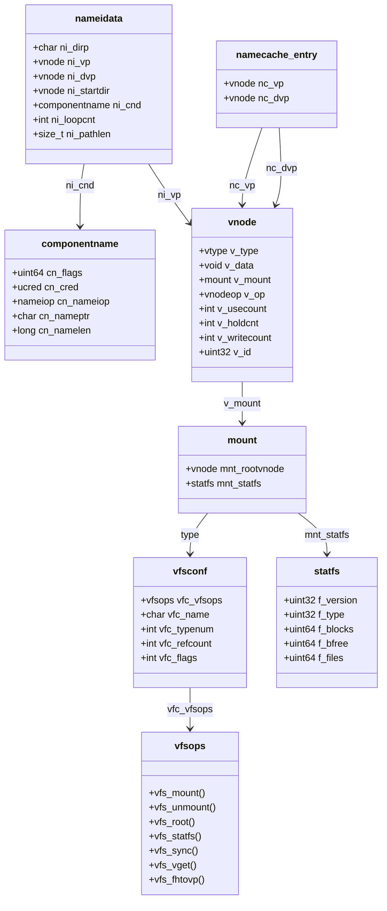

# VFS — Virtual File System Layer
<!-- This file is auto-generated by generate-doc.py -- do not edit manually -->

---
**Navigation:**
  **Up:** [Kernel Core — Structure and Entry Point](../README.md) ▸ [Source Tree — Layout and Conventions](../../README_internals.md)
  **Related:** [Virtual Memory Subsystem — vm_page, UMA, and Pagers](../vm/README.md) | [Buffer Cache — Block I/O Subsystem](../vm/README_bcache.md) | [UFS — FreeBSD's Native Filesystem](../ufs/README.md) | [ZFS — Pooled Storage and Copy-on-Write Filesystem](../contrib/openzfs/README_freebsd.md) | [Network Stack — Architecture and Packet Flow](../net/README.md)
  **All chapters:** [Source Tree — Layout and Conventions](../../README_internals.md) | [Boot Process — UEFI Bootloader to Kernel Handoff](../../stand/efi/loader/README.md) | [Kernel Core — Structure and Entry Point](../README.md) | [Build System — buildworld and buildkernel](../../share/mk/README.md) | [System Calls and Image Activation — Entry, sysent, and exec](../kern/README_syscall.md) | [Kernel Modules and the Linker — KLD, SYSINIT, and linker sets](../kern/README_kld.md) | [Virtual Memory Subsystem — vm_page, UMA, and Pagers](../vm/README.md) | [Process Management — Scheduling and Lifecycle](../kern/README_process.md) ...
---


## Quick Summary

The Virtual File System (VFS) is the kernel layer that lets a single set of
system calls — [`open(2)`](../../lib/libsys/open.2), [`read(2)`](../../lib/libsys/read.2), [`stat(2)`](../../lib/libsys/stat.2), [`mount(2)`](../../lib/libsys/mount.2) — work over many
different storage backends. UFS, ZFS, tmpfs, and network filesystems such as
NFS all expose their data through the same interface, so a program that reads
`/etc/passwd` does not need to know whether that file lives on a UFS disk, a
ZFS pool, or a remote NFS share. The VFS achieves this by routing every
operation through a table of function pointers: the generic kernel code calls
`VOP_READ`, and the specific filesystem's implementation of that operation is
invoked behind it. Adding a new filesystem therefore means writing one set of
operation handlers, not rewriting the kernel's file machinery.

The central object is the **vnode**, a kernel structure that stands in for any
file, directory, device, or socket during its lifetime. A vnode is not the
data itself and not the filesystem's inode; it is a uniform handle. Its
`v_data` member points at the filesystem-specific inode (a UFS inode for UFS,
a ZFS [node](../netgraph/README.md#glossary) for ZFS), while its `v_op` member points at the operation table that
knows how to act on that inode. The rest of the kernel — the [buffer cache](../vm/README_bcache.md#glossary), the
virtual memory pager, the syscall layer — only ever sees vnodes, never the
raw inodes underneath.

Every vnode belongs to a **mount point**, described by a `struct mount`. A
mount point is where one filesystem's namespace is grafted into the global
directory tree, which is why the Unix filesystem appears as one continuous tree
even though it is assembled from many independent filesystems (a root UFS, a
`/usr` partition, a ZFS `/home`, an NFS `/mnt/remote`). The mount point carries
the filesystem's type, its statistics, and a reference to the root vnode of that
filesystem.

Finally, the VFS keeps a **namecache** to make pathname resolution fast.
Resolving `/a/b/c` normally means asking each directory in turn for the next
component, which can require disk I/O. The namecache remembers the mapping from
a directory entry name to its vnode, so that repeated lookups of the same path
skip the expensive per-component search. It even records *negative* entries —
names that are known not to exist — so a repeated failed lookup returns
`ENOENT` without touching the disk.

## Architecture

The VFS is implemented in a small set of files under `sys/kern/`, with the
public structure definitions in `sys/sys/`:

- `sys/kern/vfs_subr.c` — the generic VFS routines: filesystem registration via
  the `vfsconf` table, vnode lifecycle (`getnewvnode`, `vget`, `vput`), and the
  `VFS_*` dispatch macros.
- `sys/kern/vfs_mount.c` — mount and unmount handling: attaching and detaching
  a `struct mount`, walking the mount list, and the deferred-unmount path.
- `sys/kern/vfs_lookup.c` — pathname resolution: `namei()` and its helpers,
  plus the `namei_zone` [UMA](../vm/README_bcache.md#glossary) [zone](../vm/README.md#glossary) and the `vfs.namei.lookup` SDT probes.
- `sys/kern/vfs_syscalls.c` — the syscall entry points that translate
  user-supplied arguments (paths, file descriptors, fhandles) into VFS calls.
- `sys/kern/vfs_cache.c` — the namecache: the hash table of namecache
  entries, the negative-entry machinery, and the `cache_*` API.
- `sys/sys/vnode.h` — `struct vnode`, the `vtype` and `vstate` enums, and
  `struct vpollinfo`.
- `sys/sys/mount.h` — `struct mount`, `struct vfsops`, `struct vfsconf`,
  `struct statfs`, `struct fid`, and `struct vfsopt`.
- `sys/sys/namei.h` — `struct nameidata`, `struct componentname`, and
  `enum nameiop`.

The vnode operation interface itself is not hand-written. The `VOP_*` wrappers
and the `struct vnodeop_desc` table are generated from `sys/kern/vnode_if.src`
by the `sys/tools/vnode_if.awk` script, which is why the operation set is
uniform across every filesystem: they all implement the same generated
interface.

The dispatch works in two layers. A *filesystem-level* operation (mount,
statfs, sync, vget) is a member of `struct vfsops`, reached through the
filesystem's `vfsconf` entry and invoked by the `VFS_MOUNT`, `VFS_STATFS`,
`VFS_SYNC`, `VFS_VGET`, and `VFS_UNMOUNT` macros. A *vnode-level* operation
(lookup, read, write, getattr) is a member of the per-vnode operation table
reached through `v_op` and invoked by the `VOP_*` macros. The `vfsconf` table
is populated at boot from a [linker set](../kern/README_kld.md#glossary), so each compiled-in filesystem
registers itself and its `vfsops` table without any central code listing them.

## Key Data Structures

**`struct vnode`** (defined in `sys/sys/vnode.h`). The vnode is "the focus of
all file activity in UNIX," as the header and the [`vnode(9)`](../../share/man/man9/vnode.9) man page both put
it. The fields that matter most to the generic layer, as documented in
[`vnode(9)`](../../share/man/man9/vnode.9), are:

- `v_usecount`, `v_holdcnt`, `v_writecount` — three distinct reference counts.
  `v_usecount` is the number of kernel clients currently using the vnode,
  maintained by [`vref(9)`](../../share/man/man9/vref.9)/[`vrele(9)`](../../share/man/man9/vrele.9)/`vput(9)`. `v_holdcnt` is the number of
  clients vetoing the vnode's recycling, maintained by [`vhold(9)`](../../share/man/man9/vhold.9)/`vdrop(9)`.
  `v_writecount` is the number of clients writing into the file, maintained by
  [`open(2)`](../../lib/libsys/open.2) and [`close(2)`](../../lib/libsys/close.2). The first two exist because "using a vnode" and
  "keeping a vnode alive across an async operation" are different needs; the
  third exists so the filesystem can decide whether a `close` must force a
  sync. When both `v_usecount` and `v_holdcnt` reach zero the vnode is
  recycled via [`getnewvnode(9)`](../../share/man/man9/getnewvnode.9).
- `v_id` — an identifier used to keep the namecache consistent with the vnode.
- `v_mount` — pointer to the `struct mount` that owns the vnode.
- `v_type` — one of the `vtype` values: `VNON`, `VREG`, `VDIR`, `VBLK`,
  `VCHR`, `VLNK`, `VSOCK`, `VFIFO`, `VBAD`, `VMARKER`.
- `v_data` — the filesystem's private inode; each filesystem hangs its own
  metadata structure here.
- `v_op` — the vnode operation table that the `VOP_*` macros dispatch through.

A vnode also carries a `struct vpollinfo` for poll/select and inotify [state](../netpfil/pf/README.md#glossary),
defined in `sys/sys/vnode.h`:

```c
struct vpollinfo {
	struct	mtx vpi_lock;		/* lock to protect below */
	TAILQ_HEAD(, inotify_watch) vpi_inotify; /* list of inotify watchers */
	struct	selinfo vpi_selinfo;	/* identity of poller(s) */
	short	vpi_events;		/* what they are looking for */
	short	vpi_revents;		/* what has happened */
};
```

**`struct vfsops`** (defined in `sys/sys/mount.h`). This is the
filesystem-level operation table. Its members are function pointers, one per
filesystem-level operation:

```c
/* Members of struct vfsops (sys/sys/mount.h) */
	vfs_mount        /* mount the filesystem */
	vfs_cmount       /* create+mount (used by e.g. tmpfs, procfs) */
	vfs_unmount      /* unmount */
	vfs_root         /* return the root vnode */
	vfs_cachedroot   /* return a cached root vnode */
	vfs_quotactl     /* quota control */
	vfs_statfs       /* fill in a struct statfs */
	vfs_sync         /* sync dirty data */
	vfs_vget         /* look up a vnode by file id */
	vfs_fhtovp       /* convert a file handle to a vnode */
```

**`struct vfsconf`** (defined in `sys/sys/mount.h`). Each registered
filesystem has one `vfsconf` entry, which is the registry record that ties a
filesystem name and type number to its `vfsops` table. Its fields (mirrored in
the 32-bit-compat `xvfsconf32`) are:

```c
/* Fields of struct vfsconf (sys/sys/mount.h) */
	struct vfsops	*vfc_vfsops;	/* filesystem operation table */
	char		vfc_name[MFSNAMELEN]; /* type name, e.g. "ufs" */
	int		vfc_typenum;	/* unique type number */
	int		vfc_refcount;	/* number of mounts */
	int		vfc_flags;	/* VFC_* capability flags */
```

**`struct mount`** (defined in `sys/sys/mount.h`). The mount point. It carries
the filesystem's type, a copy of the `statfs` statistics, a word of mount
flags, and a pointer to the root vnode of the filesystem (`mnt_rootvnode`).
It also holds the file-system identifier and the list linkage that lets the
kernel walk all active mounts. The `struct statfs` it embeds is:

```c
#define	MFSNAMELEN	16		/* length of type name including null */
#define	MNAMELEN	1024		/* size of on/from name bufs */
#define	STATFS_VERSION	0x20140518	/* current version number */
struct statfs {
	uint32_t f_version;		/* structure version number */
	uint32_t f_type;		/* type of filesystem */
	uint64_t f_flags;		/* copy of mount exported flags */
	uint64_t f_bsize;		/* filesystem fragment size */
	uint64_t f_iosize;		/* optimal transfer block size */
	uint64_t f_blocks;		/* total data blocks in filesystem */
	uint64_t f_bfree;		/* free blocks in filesystem */
	int64_t	 f_bavail;		/* free blocks avail to non-superuser */
	uint64_t f_files;		/* total file nodes in filesystem */
	int64_t	 f_ffree;		/* free nodes avail to non-superuser */
	/* ... read/write counters and spare fields follow ... */
};
```

The `struct fid` in the same header identifies a file within a filesystem and
is used by the file-handle API:

```c
#define	MAXFIDSZ	16

struct fid {
	u_short		fid_len;		/* length of data in bytes */
	u_short		fid_data0;		/* force longword alignment */
	char		fid_data[MAXFIDSZ];	/* data (variable length) */
};
```

**`struct nameidata`** and **`struct componentname`** (defined in
`sys/sys/namei.h`). These carry the state of an in-progress pathname
resolution. `nameidata` is the per-call working set; `componentname` is the
subset handed down through the `VOP_LOOKUP` interface.

```c
enum nameiop { LOOKUP, CREATE, DELETE, RENAME };

struct componentname {
	/*
	 * Arguments to lookup.
	 */
	u_int64_t cn_flags;	/* flags to namei */
	struct	ucred *cn_cred;	/* credentials */
	enum nameiop cn_nameiop;	/* namei operation */
	int	cn_lkflags;	/* Lock flags LK_EXCLUSIVE or LK_SHARED */
	/*
	 * Shared between lookup and commit routines.
	 */
	char	*cn_pnbuf;	/* pathname buffer */
	char	*cn_nameptr;	/* pointer to looked up name */
	long	cn_namelen;	/* length of looked up component */
};

struct nameidata {
	/*
	 * Arguments to namei/lookup.
	 */
	const	char *ni_dirp;		/* pathname pointer */
	enum	uio_seg ni_segflg;	/* location of pathname */
	const cap_rights_t *ni_rightsneeded; /* rights needed to look up vnode */
	/*
	 * Arguments to lookup.
	 */
	struct  vnode *ni_startdir;	/* starting directory */
	struct	vnode *ni_rootdir;	/* logical root directory */
	struct	vnode *ni_topdir;	/* logical top directory */
	int	ni_dirfd;		/* starting directory for *at functions */
	int	ni_lcf;			/* local call flags */
	/* ... */
	struct	vnode *ni_vp;		/* vnode of result */
	struct	vnode *ni_dvp;		/* vnode of intermediate directory */
	/* ... */
	u_short	ni_loopcnt;		/* count of symlinks encountered */
	size_t	ni_pathlen;		/* remaining chars in path */
	char	*ni_next;		/* next location in pathname */
	/*
	 * Lookup parameters: this structure describes the subset of
	 * information from the nameidata structure that is passed
	 * through the VOP interface.
	 */
	struct componentname ni_cnd;
	/* ... */
};
```

**Namecache entry** (defined in `sys/kern/vfs_cache.c`). One entry per
cached directory component. The entry stores the child vnode (`nc_vp`, a macro
over the `n_un` union: `#define nc_vp n_un.nu_vp`), the parent directory vnode
(`nc_dvp`), and the name. The comment at the top of `vfs_cache.c` explains the
granularity: *"for a fully cached path 'foo/bar/baz' there are 3 entries, one
for each name,"* and notes that the entries are stored in a hash table
(see `cache_get_hash` for more information).
Negative entries are tracked by a `struct negstate` (fields `neg_flag`,
`neg_hit`) that records whether a name is known to be absent.

## Deep Dive

### Mounting a filesystem

When [`mount(2)`](../../lib/libsys/mount.2) is issued, the syscall layer in `sys/kern/vfs_syscalls.c`
validates the arguments and locates the `vfsconf` entry for the requested type
(the `M_FADVISE` tag in that file shows the per-syscall `MALLOC_DEFINE` style
used throughout the VFS syscalls):

```c
MALLOC_DEFINE(M_FADVISE, "fadvise", "posix_fadvise(2) information");
```

The `VFS_MOUNT` macro in `sys/kern/vfs_mount.c` then dispatches to the
filesystem's `vfsops.vfs_mount` member, which is the filesystem's mount
handler. The filesystem's handler (for example the UFS or ZFS `vfsops`)
performs its own superblock read and initialization, and returns the root
vnode. The VFS then allocates and populates a `struct mount`, inserts it into
the global mount list, and links the root vnode into the tree. `VFS_ROOT` and
`VFS_CACHEDROOT` are the corresponding macros for obtaining the root vnode,
and `VFS_UNMOUNT` drives the teardown path (including the deferred-unmount
queue used when a mount is busy).

### Pathname resolution

Resolving a path to a vnode is the job of `namei()` in
`sys/kern/vfs_lookup.c`. The function is instrumented with SDT probes, which is
what makes it observable from DTrace without recompiling:

```c
SDT_PROBE_DEFINE4(vfs, namei, lookup, entry, "struct vnode *", "char *",
    "unsigned long", "bool");
```

and a matching `vfs.namei.lookup.return` [probe](../kern/README_driver.md#glossary). The per-call `struct
nameidata` is drawn from a dedicated UMA zone, `namei_zone`, because lookup is
one of the hottest paths in the kernel and a per-CPU [slab](../vm/README.md#glossary) avoids contended
allocations:

```c
uma_zone_t namei_zone;
```

The resolution loop, driven by `namei()` and its helpers
(`namei_setup`, `namei_handle_root`, `namei_follow_link`,
`namei_cleanup_cnp`, and `vfs_lookup_nameidata`), walks the path one component
at a time:

1. `namei_setup` initializes the `nameidata`, setting `ni_startdir` to the
   caller's starting directory (or the logical root for an absolute path) and
   positioning `ni_next` at the first component.
2. For each component, the VFS asks the namecache (`cache_lookup`) whether the
   `(parent vnode, name)` pair is already cached. On a hit it reuses the cached
   `nc_vp` and skips the filesystem entirely.
3. On a miss it calls `VOP_LOOKUP` on the parent directory vnode, passing the
   `componentname` (`ni_cnd`). The filesystem's lookup handler reads the
   directory, finds the entry, and returns the child vnode (or `ENOENT`).
4. The result is entered into the namecache with `cache_enter_lock` so the next
   lookup is a hit. If the name does not exist, a *negative* entry is recorded
   (`cache_neg_insert`) so the failure is remembered.
5. If the resolved vnode is a symbolic link, `namei_follow_link` reads the link
   target and restarts resolution, bounded by `ni_loopcnt` to catch link loops.
6. `namei_cleanup_cnp` releases the intermediate directory vnodes as it
   climbs back up.

The `enum nameiop` value (`LOOKUP`, `CREATE`, `DELETE`, `RENAME`) in the
`componentname` tells the filesystem what the caller intends to do with the
entry, which is why the same `VOP_LOOKUP` path serves `open`, `unlink`, and
`rename`.

### The namecache

The namecache (`sys/kern/vfs_cache.c`) is a hash table of namecache
entries, one per cached component, hashed by `cache_get_hash`. The key
insight is the granularity: a full path is not cached as a whole, but as a
chain of single-component entries, each linking a parent directory vnode to a
child vnode. This means a long path shares its prefix with any other path that
starts the same way, and a single rename or unlink only invalidates the
entries it touches (`cache_purge`, `cache_purge_vgone`, `cache_purgevfs`).

Negative entries solve a specific performance problem: without them, every
failed `stat` of a non-existent file would re-read the directory from disk.
The `negstate`/`neglist` machinery (see `cache_neg_init`, `cache_neg_insert`,
`cache_neg_promote`, `cache_neg_demote_locked`) keeps a bounded set of
"this name is absent" records, and `cache_purge_negative` discards them when
space is needed. Because the namecache can outlive the vnodes it points at, the
cache holds its own reference (`cache_hold_vnode`/`cache_drop_vnode`) and
validates entries against the vnode's `v_id` before trusting them
(`cache_validate`).

## Flow / Diagram



## Advanced Notes

**Observing resolution with DTrace.** The `vfs.namei.lookup` SDT probes
(`entry` and `return`) let you trace every component lookup without
recompiling. A script on `vfs:namei:lookup:return` that prints the return
code and the resolved vnode shows exactly which lookups hit the cache (fast,
no `VOP_LOOKUP` issued) and which fell through to the filesystem. Because the
probes fire per component, a single `open("/a/b/c")` produces several probe
instances, which is the clearest way to see the namecache's per-component
granularity in action.

**Locking and the interlock.** A vnode may sit on several lists at once (the
mount's list, the namecache, the freelist). The header in `sys/sys/vnode.h`
documents the canonical pattern for operating on a list-resident vnode: lock
the list, take the vnode interlock so it cannot vanish, drop the list lock to
avoid order reversals, then `vget` with `LK_INTERLOCK` (or check `DOOMED` if
the lock is not needed) before acting. Getting this order wrong is the classic
source of vnode use-after-free; the [witness](../kern/README_kdb.md#glossary) lock-order detector will flag a
reversal.

**Reference-count discipline.** The three counts are easy to confuse.
`v_usecount` is bumped by anything that returns a vnode ([`vget(9)`](../../share/man/man9/vget.9),
[`VOP_LOOKUP(9)`](../../share/man/man9/VOP_LOOKUP.9)) and dropped with [`vrele(9)`](../../share/man/man9/vrele.9)/`vput(9)`. `v_holdcnt` is the
longer-lived veto used across asynchronous operations (a [thread](../kern/README_process.md#glossary) that has
started an I/O and must not let the vnode be recycled). `v_writecount` only
matters at `close` time, where the filesystem uses it to decide whether the
last writer's close must force a synchronous write. A leak in any of the three
shows up as vnodes that never return to the freelist.

**Namecache invalidation races.** Because the cache can hold a reference to a
vnode that the filesystem is trying to free, every mutation (rename, unlink,
rmdir) must purge the affected entries (`cache_purge`, `cache_purge_vgone`)
while holding the right bucket locks (`NCP2BUCKET`, `NCP2BUCKETLOCK`). The
`v_id` field exists precisely so a stale entry can be detected: if the vnode's
`v_id` no longer matches what the entry recorded, the entry is invalid and must
be re-resolved. Skipping the `v_id` check is a subtle correctness bug that only
surfaces under heavy concurrent rename/unload workloads.

**Connecting to textbook theory.** The VFS is a concrete instance of the
classic "virtual" layer from the BSD literature: a uniform interface
(vnode operations) over heterogeneous backends, a registry of backend
implementations (`vfsconf`), and a cache of the expensive operation
(namecache). The two-level dispatch — `vfsops` for filesystem-level calls and
`v_op` for per-file calls — mirrors the textbook split between the
"filesystem object" and the "open file description." The namecache is the same
idea as the inode cache in other systems, but keyed per-component rather than
per-path, which is why a partial path shares cache entries with other paths.

## See Also
- [Virtual Memory Subsystem — vm_page, UMA, and Pagers](../vm/README.md)
- [Buffer Cache — Block I/O Subsystem](../vm/README_bcache.md)
- [UFS — FreeBSD's Native Filesystem](../ufs/README.md)
- [ZFS — Pooled Storage and Copy-on-Write Filesystem](../contrib/openzfs/README_freebsd.md)
- [Network Stack — Architecture and Packet Flow](../net/README.md)


- [`sys/kern/vfs_subr.c`](../kern/vfs_subr.c), [`sys/kern/vfs_mount.c`](../kern/vfs_mount.c), [`sys/kern/vfs_lookup.c`](../kern/vfs_lookup.c),
  `sys/kern/vfs_syscalls.c`, `sys/kern/vfs_cache.c` — the VFS implementation.
- [`sys/sys/vnode.h`](../sys/vnode.h), [`sys/sys/mount.h`](../sys/mount.h), [`sys/sys/namei.h`](../sys/namei.h) — the public
  structure definitions.
- [`sys/kern/vnode_if.src`](../kern/vnode_if.src) and [`sys/tools/vnode_if.awk`](../tools/vnode_if.awk) — the source and
  generator for the `VOP_*` interface.
- Man pages: [`vnode(9)`](../../share/man/man9/vnode.9), [`vref(9)`](../../share/man/man9/vref.9), [`vrele(9)`](../../share/man/man9/vrele.9), `vput(9)`, [`vget(9)`](../../share/man/man9/vget.9),
  [`vhold(9)`](../../share/man/man9/vhold.9), `vdrop(9)`, [`getnewvnode(9)`](../../share/man/man9/getnewvnode.9), [`VOP_LOOKUP(9)`](../../share/man/man9/VOP_LOOKUP.9), `VOP_READ(9)`,
  `VOP_WRITE(9)`, [`vfs_busy(9)`](../../share/man/man9/vfs_busy.9), [`insmntque(9)`](../../share/man/man9/insmntque.9), [`hash(9)`](../../share/man/man9/hash.9), [`hashinit(9)`](../../share/man/man9/hashinit.9),
  [`mount(2)`](../../lib/libsys/mount.2), [`statfs(2)`](../../lib/libsys/statfs.2), [`open(2)`](../../lib/libsys/open.2), [`close(2)`](../../lib/libsys/close.2).
- Related chapters: UFS, ZFS, tmpfs, and NFS (the backends this layer
  abstracts), and the Buffer Cache and Virtual Memory chapters (the I/O and
  paging layers that vnodes feed into).

---

> _Generated by [DaemonDocs](https://github.com/ocochard/DaemonDocs) on 2026-08-26 14:01 UTC using model `Qwen3.8-27B-Q8_0` (llama.cpp build `b10553-cd26896c1`). AI-generated content — verify against source before relying on it._
