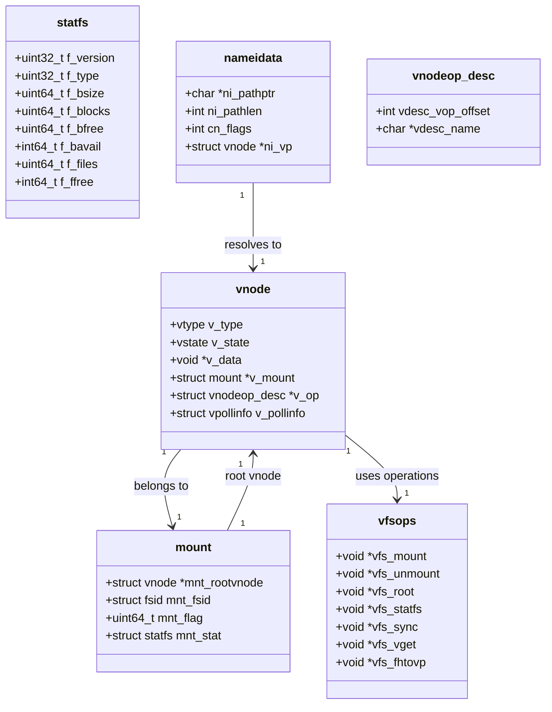

# VFS — Virtual File System Layer
<!-- This file is auto-generated by generate-doc.py -- do not edit manually -->

---
**Navigation:**
  **Up:** [Kernel Core — Structure and Entry Point](../README.md) ▸ [Source Tree — Layout and Conventions](../../README_internals.md)
  **Related:** [Virtual Memory Subsystem — vm_page, UMA, and Pagers](../vm/README.md) | [Buffer Cache — Block I/O Subsystem](../vm/README_bcache.md) | [UFS — FreeBSD's Native Filesystem](../ufs/README.md) | [ZFS — Pooled Storage and Copy-on-Write Filesystem](../contrib/openzfs/README_freebsd.md) | [Network Stack — Architecture and Packet Flow](../net/README.md)
  **All chapters:** [Source Tree — Layout and Conventions](../../README_internals.md) | [Boot Process — UEFI Bootloader to Kernel Handoff](../../stand/efi/loader/README.md) | [Kernel Core — Structure and Entry Point](../README.md) | [Build System — buildworld and buildkernel](../../share/mk/README.md) | [Virtual Memory Subsystem — vm_page, UMA, and Pagers](../vm/README.md) | [Process Management — Scheduling and Lifecycle](../kern/README_process.md) | [Locking Primitives — Mutexes, sx, rmlocks, and Atomics](../kern/README_locking.md) | [Buffer Cache — Block I/O Subsystem](../vm/README_bcache.md) ...
---


> ⚠ **UNVERIFIED DRAFT** — reviewer did not explicitly approve this draft. Treat claims as suspect until manually reviewed.


## Quick Summary

The Virtual File System (VFS) in FreeBSD provides a unified programming interface for various storage backends. It acts as a translation layer between user-space applications and the specific implementations of individual filesystems such as UFS, ZFS, tmpfs, and network filesystems. By abstracting the common operations such as reading, writing, and directory traversal into a standard set of function pointers, the VFS allows new filesystems to be added without rewriting the kernel's core logic. This design ensures that applications see a consistent POSIX-compliant view of the file hierarchy, regardless of the underlying storage technology.

At the heart of the VFS lies the **vnode**, a kernel structure that represents an open file or directory. Every file, directory, socket, or device node is represented by a unique vnode during its lifetime. The vnode serves as the primary handle through which the kernel interacts with the file's data, managing caching, locking, and access control. When a process opens a file, the VFS resolves the pathname to locate the correct vnode and returns a file descriptor referencing it.

A key concept in the VFS is the relationship between vnodes and filesystem-specific inodes. A vnode is a kernel-internal abstraction representing an open file or directory, while inodes are filesystem-specific metadata structures. The vnode's `v_data` field points to the filesystem's inode (for example, a UFS inode for UFS, or a ZFS-specific inode structure for ZFS). The vnode acts as a unified handle regardless of the underlying inode format, allowing the VFS to present a consistent interface to the rest of the kernel while each filesystem manages its own metadata structures internally.

The VFS also manages **mount points**, which define where a specific filesystem's namespace is attached to the global directory tree. Each mount point is tracked by a `struct mount`, which holds statistics, flags, and a reference to the root vnode of that filesystem. This hierarchical structure supports the Unix tradition of a single root directory, allowing administrators to stack multiple filesystems (e.g., `/usr`, `/home`, `/mnt`) into a single coherent tree.

Finally, the VFS includes a namecache subsystem to optimize pathname resolution. Since resolving a path like `/usr/local/bin` requires traversing multiple directories, the kernel caches the results of these lookups. By storing the mapping between directory entries and their corresponding vnodes, the namecache significantly reduces the overhead of repeated filesystem operations, improving performance for applications that access files frequently.

## Architecture

The VFS layer is implemented primarily in `sys/kern/`, with headers in `sys/sys/`. The architecture is organized around three main subsystems: pathname resolution, mount management, and vnode operations.

**Pathname Resolution**
Pathname resolution is handled by `sys/kern/vfs_lookup.c`. The core function `namei()` takes a path string and resolves it to a vnode. It uses a `struct nameidata` to track the current state of the resolution, including the current directory and any pending symlinks. The VFS uses a UMA zone (`namei_zone`) to allocate `nameidata` structures, ensuring efficient memory management. The resolution process involves iterating through each component of the path, calling the `VOP_LOOKUP` operation on the parent directory vnode to find the child.

```c
/* From sys/kern/vfs_lookup.c */
SDT_PROVIDER_DEFINE(vfs);
SDT_PROBE_DEFINE4(vfs, namei, lookup, entry, "struct vnode *", "char *",
    "unsigned long", "bool");
SDT_PROBE_DEFINE4(vfs, namei, lookup, return, "int", "struct vnode *", "bool",
    "struct nameidata");

/* Allocation zone for namei. */
uma_zone_t namei_zone;
```

SDT (System Dynamic Tracing) probes are embedded at key points in the resolution path, allowing tools like DTrace to trace pathname lookups in real time without modifying kernel code.

**Mount Management**
Mount management lives in `sys/kern/vfs_mount.c`. The `mount()` system call creates a new mount point by invoking the filesystem's `vfs_mount` operation, which in turn allocates a `struct mount`, attaches it to the directory tree, and sets the root vnode. The `unmount()` system call handles the reverse: detaching the filesystem, flushing dirty buffers, and cleaning up references. Each mount point is identified by a unique filesystem ID, a two-element integer array that distinguishes it from all other mounted filesystems on the machine.

**Vnode Operations**
Vnode operations are defined by function pointers in `struct vfsops` (for filesystem-level operations) and `struct vnodeop_desc` (for per-vnode-type operations). The `vfsops` structure, defined in `sys/sys/mount.h`, contains pointers to operations such as `vfs_mount`, `vfs_unmount`, `vfs_root`, `vfs_statfs`, `vfs_sync`, `vfs_vget`, and `vfs_fhtovp`. Each concrete filesystem (UFS, ZFS, tmpfs, etc.) provides its own `vfsops` implementation, which the VFS layer dispatches through the vnode's `v_op` pointer.

**Namecache**
The namecache is implemented in `sys/kern/vfs_cache.c`. It maintains a hash table of pathname-to-vnode mappings, keyed by directory vnode plus component name. When a lookup succeeds, the result is stored in a cache entry. Subsequent lookups for the same path component can skip the filesystem's `VOP_LOOKUP` entirely, returning the cached vnode directly. Negative results (path components that do not exist) are also cached, with configurable timeout and promotion policies to balance memory usage against hit rate.

## Key Data Structures

**struct vnode** (from `sys/sys/vnode.h`)
The vnode is the central abstraction. It represents an open file, directory, socket, or device. Key fields include:
- `v_type` — The vnode type (VREG, VDIR, VLNK, VBLK, VCHR, VFIFO, VSOCK, VNON, VBAD).
- `v_state` — The vnode's lifecycle state (VSTATE_UNINITIALIZED, VSTATE_CONSTRUCTED, VSTATE_DESTROYING, VSTATE_DEAD).
- `v_data` — A pointer to filesystem-specific data (e.g., a UFS inode, a ZFS dnode). Each underlying filesystem allocates its own private area and hangs it from `v_data`.
- `v_op` — A pointer to the vnode operation vector (`vnodeop_desc_table`), which dispatches operations like VOP_READ, VOP_WRITE, VOP_LOOKUP to the correct filesystem function.
- `v_mount` — A pointer to the `struct mount` this vnode belongs to.
- `v_pollinfo` — A `struct vpollinfo` containing lock, selinfo, and event tracking for poll/select operations.

```c
/* From sys/sys/vnode.h */
__enum_uint8_decl(vtype) {
	VNON,
	VREG,
	VDIR,
	VBLK,
	VCHR,
	VLNK,
	VSOCK,
	VFIFO,
	VBAD,
	VMARKER,
	VLASTTYPE = VMARKER,
};

__enum_uint8_decl(vstate) {
	VSTATE_UNINITIALIZED,
	VSTATE_CONSTRUCTED,
	VSTATE_DESTROYING,
	VSTATE_DEAD,
	VLASTSTATE = VSTATE_DEAD,
};
```

**struct mount** (from `sys/sys/mount.h`)
Each mount point is described by a `struct mount`. Key fields include:
- `mnt_rootvnode` — Pointer to the root vnode of this filesystem.
- `mnt_fsid` — A filesystem identifier uniquely identifying this filesystem.
- `mnt_flag` — Mount flags (MNT_RDONLY, MNT_NOSUID, etc.).
- `mnt_stat` — A `struct statfs` containing filesystem statistics.

```c
/* From sys/sys/mount.h */
static __inline int
fsidcmp(const struct fsid *a, const struct fsid *b)
{
	return (a->val[0] != b->val[0] || a->val[1] != b->val[1]);
}
```

**struct statfs** (from `sys/sys/mount.h`)
The `statfs` structure holds filesystem statistics, exposed to user-space via `statfs(2)` and `fstatfs(2)`. Key fields include:
- `f_version` — Structure version number (STATFS_VERSION).
- `f_type` — Filesystem type identifier.
- `f_bsize` — Filesystem block size.
- `f_blocks`, `f_bfree`, `f_bavail` — Total, free, and available blocks.
- `f_files`, `f_ffree` — Total and free file nodes.
- `f_syncwrites`, `f_asyncwrites`, `f_syncreads`, `f_asyncreads` — I/O counters since mount.

```c
/* From sys/sys/mount.h */
struct statfs {
	uint32_t f_version;		/* structure version number */
	uint32_t f_type;		/* type of filesystem */
	uint64_t f_flags;		/* copy of mount exported flags */
	uint64_t f_bsize;		/* filesystem fragment size */
	uint64_t f_iosize;		/* optimal transfer block size */
	uint64_t f_blocks;		/* total data blocks in filesystem */
	uint64_t f_bfree;		/* free blocks in filesystem */
	int64_t	 f_bavail;		/* free blocks avail to non-superuser */
	uint64_t f_files;		/* total file nodes in filesystem */
	int64_t	 f_ffree;		/* free nodes avail to non-superuser */
	uint64_t f_syncwrites;		/* count of sync writes since mount */
	uint64_t f_asyncwrites;		/* count of async writes since mount */
	uint64_t f_syncreads;		/* count of sync reads since mount */
	uint64_t f_asyncreads;		/* count of async reads since mount */
	uint32_t f_nvnodelistsize;	/* # of vnodes */
	uint32_t f_spare0;		/* unused spare */
	uint64_t f_spare[9];		/* unused spare */
	uint32_t f_spare2;		/* unused spare */
};
```

**struct vfsops** (from `sys/sys/mount.h`)
The `vfsops` structure defines the set of operations a filesystem must implement. Key pointers include:
- `vfs_mount` — Called to mount a filesystem.
- `vfs_cmount` — Called for chroot-style mounts.
- `vfs_unmount` — Called to unmount a filesystem.
- `vfs_root` — Returns the root vnode.
- `vfs_statfs` — Fills in a `statfs` structure.
- `vfs_sync` — Syncs dirty data.
- `vfs_vget` — Retrieves a vnode given a file handle.
- `vfs_fhtovp` — Converts a file handle to a vnode.

```c
/* From sys/sys/mount.h */
struct vfsops {
	void	*vfs_mount;
	void	*vfs_cmount;
	void	*vfs_unmount;
	void	*vfs_root;
	void	*vfs_cachedroot;
	void	*vfs_quotactl;
	void	*vfs_statfs;
	void	*vfs_sync;
	void	*vfs_vget;
	void	*vfs_fhtovp;
	/* ... more operation pointers ... */
};
```

**struct nameidata** (from `sys/sys/namei.h`)
The `nameidata` structure tracks the state of a pathname resolution. It holds the current path pointer, remaining path length, flags controlling resolution behavior, and pointers to the current directory and target vnode. The VFS allocates these from a UMA zone (`namei_zone`) to avoid slab fragmentation.

## Deep Dive

### Pathname Resolution: namei()

When a process calls `open("/usr/local/bin/foo")`, the VFS traces through the following steps:

1. **Allocate nameidata**: `namei()` allocates a `struct nameidata` from the `namei_zone`.

2. **Parse the path**: The function iterates through each component of the path string. For `/usr/local/bin/foo`, it processes `""` (root), `usr`, `local`, `bin`, and `foo` in sequence.

3. **Cache lookup**: Before invoking the filesystem's `VOP_LOOKUP`, the VFS checks the namecache via `cache_fplookup()`. If a cached entry exists and is still valid, the lookup returns immediately.

4. **VOP_LOOKUP**: If the cache misses, the VFS calls `VOP_LOOKUP` on the current directory's vnode. This dispatches to the filesystem-specific lookup function (e.g., `ufs_lookup()` for UFS, or `zfs_lookup()` for ZFS).

5. **Handle symlinks**: If the result is a symbolic link, the VFS follows it by reading the link contents and inserting them into the path string. This repeats until a non-symlink is found or the symlink chain is exhausted.

6. **Cache the result**: Whether successful or not, the result is stored in the namecache for future lookups.

```c
/* From sys/kern/vfs_lookup.c — SDT probes for tracing */
SDT_PROBE_DEFINE4(vfs, namei, lookup, entry, "struct vnode *", "char *",
    "unsigned long", "bool");
SDT_PROBE_DEFINE4(vfs, namei, lookup, return, "int", "struct vnode *", "bool",
    "struct nameidata");
```

### Mount Operations: vfs_mount()

The `mount()` system call (implemented in `sys/kern/vfs_mount.c`) performs the following steps:

1. **Parse mount options**: The VFS parses the `mount_args` structure, extracting filesystem-specific options and global flags (MNT_RDONLY, MNT_NOSUID, MNT_NOEXEC, etc.).

2. **Allocate mount structure**: A new `struct mount` is allocated and initialized.

3. **Call vfs_mount**: The filesystem's `vfs_mount` operation is invoked. For UFS, this is `ffs_mountfs()`; for ZFS, `zfs_mount()`. The filesystem function validates the device, reads superblock metadata, and allocates the root vnode.

4. **Link into directory tree**: The root vnode becomes the mount point's anchor. Any existing vnode at that path is replaced (or the mount fails if the path is busy).

5. **Update statistics**: The `mnt_stat` field is populated via `vfs_statfs`.

```c
/* From sys/kern/vfs_mount.c — mount point iteration */
MNT_VNODE_FOREACH_ALL(vp, mp, vpq) {
	/* Process each vnode on this mount */
}
```

### Vnode Lifecycle: getnewvnode() to vput()

Vnodes follow a well-defined lifecycle:

1. **Allocation**: `getnewvnode()` allocates a new vnode from the vnode cache (a hash table of free vnodes). If no free vnode exists, the kernel may block or fail with ENOMEM.

2. **Initialization**: The filesystem-specific initialization function sets up the vnode's `v_data` pointer to point to the filesystem's inode, and sets up the `v_op` vector.

3. **Reference counting**: Each `vget()` increments the vnode's reference count, and each `vput()` decrements it. When the count reaches zero, the vnode may be reclaimed.

4. **Reclamation**: `vrecycle()` moves the vnode to the free list. If the vnode is dirty (has unwritten data), the VFS may flush it first via `VOP_SYNC`.

5. **Destruction**: When all references are released and the vnode is fully cleaned up, it is freed back to the vnode cache.

```c
/* From sys/sys/vnode.h — vnode lock reference */
/*
 * Reading or writing any of these items requires holding the appropriate lock.
 *
 * Lock reference:
 *	c - namecache mutex
 *	i - interlock
 *	l - mp mnt_listmtx or freelist mutex
 *	I - updated with atomics, 0->1 and 1->0 transitions with interlock held
 *	m - mount point interlock
 *	p - pollinfo lock
 *	u - Only a reference to the vnode is needed to read.
 *	v - vnode lock
 *
 * Vnodes may be found on many lists.  The general way to deal with operating
 * on a vnode that is on a list is:
 *	1) Lock the list and find the vnode.
 *	2) Lock interlock so that the vnode does not go away.
 *	3) Unlock the list to avoid lock order reversals.
 *	4) vget with LK_INTERLOCK and check for ENOENT, or
 *	5) Check for DOOMED if the vnode lock is not required.
 *	6) Perform your operation, then vput().
 */
```

## Flow / Diagram



## Advanced Notes

**DTrace Tracing**
FreeBSD's VFS layer is instrumented with SDT probes at key points. To trace pathname lookups:
```
dtrace -n 'vfs:::lookup-entry { printf("lookup: %s", arg1); }'
dtrace -n 'vfs:::lookup-return { printf("result: %d, vnode: %p", arg0, arg1); }'
```
Probes are defined in `sys/kern/vfs_lookup.c` with `SDT_PROBE_DEFINE4()`. The `entry` probe fires before the lookup begins; the `return` probe fires after, carrying the result code and resolved vnode pointer.

**Namecache Tuning**
The namecache is a major performance factor for directory-heavy workloads. Key tuning parameters include:
- `vfs.namecache.hash_size` — Number of hash buckets. Must be a power of two.
- `vfs.namecache.max_age` — Maximum age for positive cache entries (seconds).
- `vfs.namecache.neg_timeout` — Timeout for negative cache entries.

Negative cache entries prevent repeated lookups for non-existent paths. The cache promotes frequently accessed entries and demotes stale ones using configurable policies.

**Locking Discipline**
Vnode locking follows a strict hierarchy to prevent deadlocks:
1. The mount point lock (`mnt_listmtx`) protects the mount point list.
2. The vnode lock (`v_lock`) protects the vnode itself.
3. The interlock (`v_interlock`) protects transitions between states.

The general pattern for operating on a vnode found on a list is documented in `sys/sys/vnode.h`:
1. Lock the list and find the vnode.
2. Lock the interlock so the vnode does not go away.
3. Unlock the list to avoid lock order reversals.
4. Call `vget()` with `LK_INTERLOCK` and check for `ENOENT`, or check for `DOOMED` if the vnode lock is not required.
5. Perform the operation, then call `vput()`.

**Cross-Mount Operations**
When a path crosses a mount point (e.g., `/` containing a mount at `/usr`), the VFS handles the transition via `cache_fplookup_cross_mount()`. Internal locking functions coordinate across mount boundaries, ensuring that the VFS correctly transitions from one filesystem's vnode operations to another's.

**File Descriptor Integration**
The VFS integrates with the file descriptor table (`sys/kern/kern_descrip.c`). When a process opens a file, `kern_openat()` in `sys/kern/vfs_syscalls.c` resolves the pathname, obtains a vnode, and installs it into the process's file descriptor table. The file descriptor references the vnode through `struct file`, which contains a pointer to the vnode and the associated `struct fileops` vector.

## Comparison

**Linux vs FreeBSD VFS**
Linux's VFS uses `struct inode` as its core abstraction, analogous to FreeBSD's `struct vnode`, but with key differences. Linux's inode is tightly coupled with the page cache via `struct address_space`, while FreeBSD separates the page cache (managed by the VM subsystem's pagers) from the vnode. Linux uses `struct file` for open file descriptions (similar to FreeBSD's `struct file`), but Linux's `struct file` also carries file position and flags, whereas FreeBSD splits these into separate structures.

Linux's pathname resolution uses `struct path` (a pair of `vfsmount` + `dentry`), which is conceptually similar to FreeBSD's `struct nameidata` but organized differently. Linux's dcache (dentry cache) serves the same purpose as FreeBSD's namecache, but Linux's dcache is integrated with the page cache more tightly, while FreeBSD's namecache is a separate hash table.

**macOS/XNU VFS**
macOS's VFS is derived from FreeBSD's but has diverged significantly. XNU uses a hybrid architecture that integrates Mach IPC primitives with the VFS layer. Specifically, XNU's vnode structure includes Mach-specific fields such as `v_machport` for IPC integration, which FreeBSD does not have. XNU's mount point management uses `struct mount` but with different field organization — XNU embeds Mach-specific mount options and uses `mnt_vnodecovered` and `mnt_vnodelist` with different locking semantics. XNU's namecache implementation uses `struct nchandle` with a different hash table layout and negative cache timeout policy. Additionally, XNU's VFS includes additional security hooks (Mandatory Access Control) integrated at the vnode level, whereas FreeBSD delegates MAC to the TrustedBSD framework.

**NetBSD/OpenBSD VFS**
NetBSD's VFS shares much of the same design heritage with FreeBSD but diverges in several key areas. NetBSD uses `struct vnode` with a different internal layout — notably, NetBSD's vnode embeds the lock directly within the structure, while FreeBSD uses a separate lock pointer. NetBSD's VFS includes additional abstractions for its modular filesystem framework (e.g., the FFS2 superblock format), while FreeBSD has focused on integrating ZFS and tmpfs more deeply into the core VFS. OpenBSD has further simplified the VFS, removing some of the more complex features like the negative cache.

## See Also
- [Virtual Memory Subsystem — vm_page, UMA, and Pagers](../vm/README.md)
- [Buffer Cache — Block I/O Subsystem](../vm/README_bcache.md)
- [UFS — FreeBSD's Native Filesystem](../ufs/README.md)
- [ZFS — Pooled Storage and Copy-on-Write Filesystem](../contrib/openzfs/README_freebsd.md)
- [Network Stack — Architecture and Packet Flow](../net/README.md)


- **Source directories**: `sys/kern/` (VFS core), `sys/sys/` (headers), `sys/fs/` (filesystem implementations)
- **Related chapters**: [UFS — FreeBSD's Native Filesystem](../ufs/README.md), [ZFS — Pooled Storage and Copy-on-Write Filesystem](../contrib/openzfs/README_freebsd.md), [Virtual Memory Subsystem — vm_page, UMA, and Pagers](../vm/README.md), [Buffer Cache — Block I/O Subsystem](../vm/README_bcache.md)
- **Key source files**: `sys/kern/vfs_lookup.c`, `sys/kern/vfs_cache.c`, `sys/kern/vfs_mount.c`, `sys/kern/vfs_syscalls.c`, `sys/sys/vnode.h`, `sys/sys/mount.h`
- **Filesystems to explore**: `sys/fs/ufs/` (UFS), `sys/fs/tmpfs/` (tmpfs), `sys/fs/devfs/` (devfs), `sys/fs/procfs/` (procfs), `sys/fs/nullfs/` (nullfs), `sys/fs/fuse/` (FUSE)

---

> _Generated by [DaemonDocs](https://github.com/ocochard/DaemonDocs) on 2026-05-01 02:14 UTC using model `Qwen3.6-35B-A3B-UD-Q4_K_XL` (llama.cpp build `b8985-27aef3dd9`). AI-generated content — verify against source before relying on it._
