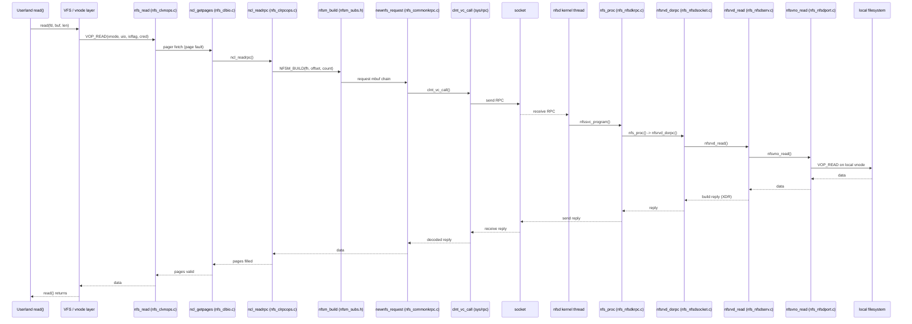

# NFS — Network File System, Client and Server
<!-- This file is auto-generated by generate-doc.py -- do not edit manually -->

---
**Navigation:**
  **Up:** [VFS — Virtual File System Layer](../README.md) ▸ [Kernel Core — Structure and Entry Point](../../README.md) ▸ [Source Tree — Layout and Conventions](../../../README_internals.md)
  **Related:** [VFS — Virtual File System Layer](../README.md) | [UFS — FreeBSD's Native Filesystem](../../ufs/README.md) | [The Socket Layer — sockets, sockbuf, and UNIX-domain](../../kern/README_socket.md)
  **All chapters:** [Source Tree — Layout and Conventions](../../../README_internals.md) | [Boot Process — UEFI Bootloader to Kernel Handoff](../../../stand/efi/loader/README.md) | [Kernel Core — Structure and Entry Point](../../README.md) | [Build System — buildworld and buildkernel](../../../share/mk/README.md) | [System Calls and Image Activation — Entry, sysent, and exec](../../kern/README_syscall.md) | [Kernel Modules and the Linker — KLD, SYSINIT, and linker sets](../../kern/README_kld.md) | [Virtual Memory Subsystem — vm_page, UMA, and Pagers](../../vm/README.md) | [Process Management — Scheduling and Lifecycle](../../kern/README_process.md) ...
---


## Quick Summary

NFS is the kernel's answer to one question: how does the VFS/vnode (the kernel's per-open-file descriptor that abstracts a file or directory regardless of its underlying storage) machinery reach a file that is not on a local disk? A local filesystem answers a `VOP_READ` (a Virtual Object Procedure — the standardized interface the VFS layer calls into any filesystem driver to perform an operation like read, write, or lookup) by turning a block number into a disk transfer. An NFS mount has no disk to talk to, so the driver instead turns the same vnode operation into a remote procedure call (RPC) that travels over a socket to a server. The server runs that operation against its own local filesystem and ships the result back. The client never sees a disk block; it sees an opaque *[file handle](#glossary)* that names a file on the server plus a byte offset. That substitution — a network request standing in for a local inode — is the whole trick, and it is what lets a FreeBSD machine mount an export from another machine and treat it as an ordinary directory tree.

FreeBSD splits this into two halves that share a common substrate. The client, in `sys/fs/nfsclient/`, turns vnode operations into [SunRPC](#glossary) calls: `nfs_clvfsops.c` mounts an export, `nfs_clvnops.c` holds the vnode operations (`nfs_read`, `nfs_write`, `nfs_lookup`, `nfs_getattr`), `nfs_clbio.c` implements the VM pager callbacks, and `nfs_clrpcops.c` builds and sends the wire requests (`ncl_readrpc`, `ncl_writerpc`, `ncl_readdirrpc`). The server, in `sys/fs/nfsserver/`, does the reverse: `nfs_nfsdkrpc.c` is the SunRPC entry point, `nfs_nfsdserv.c` holds the per-operation service routines, and `nfs_nfsdsocket.c` performs the socket/RPC dispatch. The shared code — the XDR encode/decode helpers in `sys/fs/nfs/nfs_commonsubs.c`, the [mbuf](../../sys/README_mbuf.md#glossary)-chain walking macros in `nfsm_subs.h`, the attribute conversion in `nfsport.h`, and the SunRPC transport in `sys/rpc/` — is spoken identically by both sides.

The core data path is deliberately *stateless*. In NFSv2 and NFSv3 every request is self-contained: it carries the full file handle, the offset, and the count, so the server keeps no "open file" between calls. That makes the server crash-resistant — if it dies and restarts, nothing is lost because there is no open-file [state](../../netpfil/pf/README.md#glossary) to lose. The price is that the client must keep its own caches coherent, which is the subject of the attribute-caching and close-to-open consistency discussion below.

NFSv4 changes the model. It bundles many operations into a single *compound* RPC and introduces server-side state — open file handles, locks, and *delegations* (the server temporarily handing a client the right to act on a file as if it owned it). FreeBSD's shared code accommodates both: the v2/v3 path dispatches one operation per RPC through `nfs_proc()`, while the v4 path runs a loop over a list of operations inside `nfsrvd_compound()`. Understanding that split is the key to reading both halves of this chapter.

## Glossary

**File handle** — an opaque byte string that names a file on the server; it is the NFS stand-in for a local inode number, and every request carries it in full.

**XDR (External Data Representation)** — a byte-order-independent serialization scheme; the `NFSM_BUILD`/`NFSM_DISSECT` macros in `nfsm_subs.h` walk the mbuf chain to encode arguments and decode replies.

**SunRPC** — the remote procedure call transport (programs, versions, procedure numbers) that rides on a socket; FreeBSD's implementation lives in `sys/rpc/` and is referenced as `rpc(9)`.

**Compound operation** — an NFSv4 request that carries a list of sub-operations executed as one atomic unit, so several logical steps cost a single round trip; the v2/v3 equivalent is a single self-describing request in which the server keeps no per-open-file state, which is what makes a server crash lose nothing.

**Delegation** — an NFSv4 grant in which the server lets a client cache a file's data and attributes locally and act on them without asking, until another client needs the file and the server recalls it.

**WCC (weak consistency cache)** — the before/after attribute pairs NFSv3 attaches to a mutating operation so the client can tell whether the file changed under it.

**Replay / idempotence cache** — the server-side table (`nfsrvcache`) that remembers recent request results so a retransmitted duplicate over UDP returns the same answer instead of doing the work twice.

**Silly rename** — the client-side workaround for NFS's inability to remove an open file: the file is renamed to a hidden name and deleted later, in `nfs_inactive()`.

## Architecture

The three source trees form a clean layering, each one a translation layer between the one above and the one below.

`sys/fs/nfs/` is the version-independent substrate shared by client and server. `nfs_commonsubs.c` implements the XDR helpers and the mbuf/uio copy routines; `nfs_commonkrpc.c` implements the client's connection and request plumbing (`newnfs_connect()`, `newnfs_request()`, `nfs_getauth()`); `nfsport.h` and `nfsproto.h` define the wire types (`nfsvattr`, `nfsv3_time`, `nfsv4_time`, `nfs_fattr`); and `nfsm_subs.h` defines the `NFSM_BUILD`/`NFSM_DISSECT` macros that walk the mbuf chains. `nfsrvcache.h` holds the server's replay-cache types (`nfsrvcache`, `nfsrchash_bucket`).

`sys/fs/nfsclient/` is the client. `nfs_clvfsops.c` handles the mount and VFS-level operations (`nfs_mount()`, `nfs_mountroot()`, `nfs_statfs()`); `nfs_clvnops.c` holds the vnode operations (`nfs_read`, `nfs_write`, `nfs_lookup`, `nfs_getattr`); `nfs_clbio.c` implements the VM pager callbacks (`ncl_getpages`, `ncl_putpages`) that the virtual-memory layer calls to fetch or write pages; `nfs_clrpcops.c` turns those operations into RPCs (`ncl_readrpc`, `ncl_writerpc`, `ncl_readdirrpc`); `nfs_clnode.c` manages the `nfsnode` hash and the silly-rename cleanup; and `nfs_clstate.c` implements the NFSv4 client state (opens, locks, delegations).

`sys/fs/nfsserver/` is the server. `nfs_nfsdkrpc.c` is the SunRPC entry point (`nfssvc_program()`, `nfs_proc()`); `nfs_nfsdserv.c` holds the per-operation service routines (`nfsrvd_read`, `nfsrvd_write`, `nfsrvd_getattr`, `nfsrvd_lookup`); `nfs_nfsdsocket.c` holds the socket/RPC dispatch including the v4 compound handler (`nfsrvd_dorpc`, `nfsrvd_compound`); `nfs_nfsdport.c` performs the actual local VFS operations (`nfsvno_read`, `nfsvno_write`, `nfsd_fhtovp`); `nfs_nfsdstate.c` holds the NFSv4 server state; and `nfs_nfsdcache.c` manages the replay/idempotence cache.

The flow is symmetric. A client vnode operation descends through `nfs_clvnops.c` → `nfs_clbio.c` → `nfs_clrpcops.c` → `nfs_commonkrpc.c` → `sys/rpc/` → a socket. On the server, the same bytes ascend through `sys/rpc/` → `nfs_nfsdkrpc.c` → `nfs_nfsdsocket.c` → `nfs_nfsdserv.c` → `nfs_nfsdport.c` → a local vnode operation. The vnode/VOP contract that both ends honor is covered in the VFS chapter; the socket that carries the RPCs is covered in the socket chapter. Here the concern is only the middle: how a VOP becomes an RPC, and how an RPC becomes a VOP.

## Key Data Structures

The per-mount state, `struct nfsmount`, is allocated once per NFS mount and holds the connection parameters and the attribute-cache lifetimes. Quoted from `sys/fs/nfsclient/nfsmount.h`:

```c
struct	nfsmount {
	struct	nfsmount_common nm_com;	/* Common fields for nlm */
	uint32_t nm_privflag;		/* Private flags */
	uint32_t nm_newflag;		/* New mount flags */
	int	nm_numgrps;		/* Max. size of groupslist */
	u_char	nm_fh[NFSX_FHMAX];	/* File handle of root dir */
	int	nm_fhsize;		/* Size of root file handle */
	struct	nfssockreq nm_sockreq;	/* Socket Info */
	int	nm_timeouts;		/* Request timeouts */
	int	nm_rsize;		/* Max size of read rpc */
	int	nm_wsize;		/* Max size of write rpc */
	int	nm_readdirsize;		/* Size of a readdir rpc */
	int	nm_readahead;		/* Num. of blocks to readahead */
	int	nm_wcommitsize;		/* Max size of commit for write */
	int	nm_acdirmin;		/* Directory attr cache min lifetime */
	int	nm_acdirmax;		/* Directory attr cache max lifetime */
	int	nm_acregmin;		/* Reg file attr cache min lifetime */
	int	nm_acregmax;		/* Reg file attr cache max lifetime */
	u_char	nm_verf[NFSX_VERF];	/* write verifier */
	TAILQ_HEAD(, buf) nm_bufq;	/* async io buffer queue */
	short	nm_bufqlen;		/* number of buffers in queue */
	short	nm_bufqwant;		/* process wants to add to the queue */
	int	nm_bufqiods;		/* number of iods processing queue */
	u_int64_t nm_maxfilesize;	/* maximum file size */
	int	nm_tprintf_initial_delay; /* initial delay */
	int	nm_tprintf_delay;	/* interval for messages */
	int	nm_nametimeo;		/* timeout for +ve entries (sec) */
	int	nm_negnametimeo;	/* timeout for -ve entries (sec) */
	/* Newnfs additions */
	TAILQ_HEAD(, nfsclds) nm_sess;	/* Session(s) for NFSv4.1. */
	struct	nfsclclient *nm_clp;
	...
};
```

The `nm_acdir*`/`nm_acreg*` fields are the attribute-cache lifetimes: how long a cached copy of a directory's or a regular file's attributes may be trusted before a `GETATTR` RPC is forced. The `nm_bufq` tail queue is the client's async-write buffer queue, drained by the `nfsiod` daemons. The `nm_sess`/`nm_clp` fields are the NFSv4 session and client state, absent in a pure v3 mount.

The per-file state, `struct nfsnode`, is the NFS equivalent of a local inode — the comment in the header says the similarity is "purely coincidental." It exists because the client must remember something about each file it has touched (its size, its cached attributes, whether a [silly rename](#glossary) is pending) without re-querying the server on every access. Quoted from `sys/fs/nfsclient/nfsnode.h`:

```c
struct nfsnode {
	struct mtx 		n_mtx;		/* Protects all of these members */
	struct lock		n_excl;		/* Exclusive helper for shared
						   vnode lock */
	u_quad_t		n_size;		/* Current size of file */
	u_quad_t		n_brev;		/* Modify rev when cached */
	u_quad_t		n_lrev;		/* Modify rev for lease */
	struct nfsvattr		n_vattr;	/* Vnode attribute cache */
	time_t			n_attrstamp;	/* Attr. cache timestamp */
	struct nfs_accesscache	n_accesscache[NFS_ACCESSCACHESIZE];
	...
};
```

`n_vattr` is the cached copy of the file's attributes and `n_attrstamp` is the timestamp that bounds how stale that copy may be — together they are the attribute cache. `n_brev` is the "byte revision": a counter that bumps whenever cached data is considered dirty, so the client knows when it must flush before trusting a remote read.

Three smaller structures in the same header solve specific NFS oddities. The silly rename, needed because NFS cannot remove a file that is still open (the server has no open state to check):

```c
struct sillyrename {
	struct	task s_task;
	struct	ucred *s_cred;
	struct	vnode *s_dvp;
	long	s_namlen;
	char	s_name[32];
};
```

The directory cookie map, needed because an NFS `READDIR` cookie is an opaque server value, not a logical byte offset, so the client must remember the mapping to resume a directory scan:

```c
#define	NFSNUMCOOKIES		31

struct nfsdmap {
	LIST_ENTRY(nfsdmap)	ndm_list;
	u_int			ndm_eocookie;
	union {
		nfsuint64	ndmu3_cookies[NFSNUMCOOKIES];
		uint64_t	ndmu4_cookies[NFSNUMCOOKIES];
	} ndm_un1;
};
```

And the per-file access cache, which memoizes the result of an `ACCESS` RPC (does this credential have read/write/execute on this file?) so a `stat`-style check does not become a round trip:

```c
struct nfs_accesscache {
	u_int32_t		mode;	/* ACCESS mode cache */
	uid_t			uid;	/* credentials having mode */
	time_t			stamp;	/* mode cache timestamp */
};
```

The wire-side attribute type, `struct nfsvattr` (in `sys/fs/nfs/nfsport.h`), wraps a local `vattr` plus NFS-specific fields: `na_vattr`, `na_suppattr` (supplemental attributes such as NFSv4 ACLs), `na_mntonfileno`, and `na_filesid[2]` (the file system identifier). It is the type that `nfsvattr` conversion routines move between the local `vattr` world and the XDR world in both directions.

## Deep Dive

### The client read path: VOP to RPC

A `read()` on an NFS-mounted file enters the kernel as a `VOP_READ` on the NFS vnode. The vnode operation is `nfs_read()` in `sys/fs/nfsclient/nfs_clvnops.c`. Because the data is not local, the buffered path does not read a disk block; it asks the virtual-memory pager for the pages it needs. The pager callback is `ncl_getpages()` in `sys/fs/nfsclient/nfs_clbio.c` (with `ncl_putpages()` for the write direction and `nfs_bioread_check_cons()` for the consistency check). The pager in turn calls `ncl_readrpc()` in `sys/fs/nfsclient/nfs_clrpcops.c`, which is where the operation actually becomes a wire request.

`ncl_readrpc()` has the same three-phase shape as every NFS RPC operation: dissect/validate the local arguments, build the XDR-encoded request, send it, then decode the reply and copy the data out. The request is built with the `NFSM_BUILD` macro family. The macro is defined in `sys/fs/nfs/nfsm_subs.h` and reduces to a call to `nfsm_build()`, which appends `siz` bytes to the request's mbuf chain, allocating a new mbuf (or, for the large-data case, an external page) when the current one is full:

```c
static __inline void *
nfsm_build(struct nfsrv_descript *nd, int siz)
{
	void *retp;
	struct mbuf *mb2;

	if ((nd->nd_flag & ND_EXTPG) == 0 &&
	    siz > M_TRAILINGSPACE(nd->nd_mb)) {
		NFSMCLGET(mb2, M_NOWAIT);
		if (siz > MLEN)
			panic("build > MLEN");
		mb2->m_len = 0;
		nd->nd_bpos = mtod(mb2, char *);
		nd->nd_mb->m_next = mb2;
		nd->nd_mb = mb2;
	}
	retp = (void *)(nd->nd_bpos);
	nd->nd_mb->m_len += siz;
	nd->nd_bpos += siz;
	return (retp);
}

#define	NFSM_BUILD(a, c, s)	((a) = (c)nfsm_build(nd, (s)))
```

The `nd` argument is a `struct nfsrv_descript` — the cursor that tracks where in the mbuf chain the build (or dissect) is. Its fields `nd_mb`/`nd_bpos` are the build position, `nd_md`/`nd_dpos` are the dissect position, and `nd_flag` carries bits like `ND_EXTPG` that switch the builder into the external-page mode used when a single field (such as a large read's data) does not fit in an mbuf. The reply is walked back with the mirror macro `nfsm_dissect()`:

```c
static __inline void *
nfsm_dissect(struct nfsrv_descript *nd, int siz)
{
	int tt1;
	void *retp;

	tt1 = mtod(nd->nd_md, caddr_t) + nd->nd_md->m_len - nd->nd_dpos;
	if (tt1 >= siz) {
		retp = (void *)nd->nd_dpos;
		nd->nd_dpos += siz;
	} else {
		retp = nfsm_dissct(nd, siz, M_WAITOK);
	}
	return (retp);
}
```

Once the mbuf chain holds the full RPC (XID, program/version/procedure, credentials, then the file handle, offset, and count), `ncl_readrpc()` hands it to `newnfs_request()` in `sys/fs/nfs/nfs_commonkrpc.c`. That function is the client's single send point: it applies the mount's timeout policy, calls the SunRPC client (`clnt_vc_call()` for the TCP connection, `clnt_dg_call()` for UDP, both in `sys/rpc/`), and handles retransmission. The SunRPC layer, in turn, writes the bytes to the socket. The reply travels the same path in reverse: `newnfs_request()` returns, `ncl_readrpc()` decodes the data with `NFSM_DISSECT`, copies it into the pages, and the pager marks them valid so the original `read()` can complete.

### The server dispatch: RPC to VOP

On the server, the SunRPC machinery invokes the service vector `nfssvc_program()` in `sys/fs/nfsserver/nfs_nfsdkrpc.c`. That vector's per-procedure entry is `nfs_proc()`, which for the v2/v3 path dispatches one operation per RPC. `nfs_proc()` hands the request to `nfsrvd_dorpc()` in `sys/fs/nfsserver/nfs_nfsdsocket.c`, which sets up the `nfsrv_descript` for dissecting, checks the request against the replay/idempotence cache (so a UDP retransmit returns the cached answer rather than re-doing the work), and calls the matching service routine.

The service routines live in `sys/fs/nfsserver/nfs_nfsdserv.c` — `nfsrvd_read()`, `nfsrvd_write()`, `nfsrvd_getattr()`, `nfsrvd_lookup()`, and so on. Each follows the same three phases stated in the file header: (1) break down and validate the RPC request in the mbuf list, (2) do the vnode operations, usually by calling an `nfsvno_XXX()` helper in `sys/fs/nfsserver/nfs_nfsdport.c`, and (3) build the reply. The `nfsvno_XXX()` helpers are the server's translation layer back onto the local VFS: `nfsd_fhtovp()` converts the received file handle into a local vnode, and the `nfsvno_` routines then issue the corresponding `VOP_READ`/`VOP_WRITE`/`VOP_GETATTR` on that local vnode. The result is XDR-encoded back into the reply mbuf chain and sent to the client.

So the round trip is a clean inversion of the client path: the client's `nfs_clrpcops.c` → `nfs_commonkrpc.c` → `sys/rpc` becomes the server's `sys/rpc` → `nfs_nfsdkrpc.c` → `nfs_nfsdsocket.c` → `nfs_nfsdserv.c` → `nfs_nfsdport.c` → local VOP.

### NFSv3 vs NFSv4: stateless per-op vs stateful compound

The v2/v3 path is one operation per RPC. `nfs_proc()` uses two function-pointer tables defined in `sys/fs/nfsserver/nfs_nfsdsocket.c` — `nfsrv3_procs0[]` for operations that take a single vnode (such as `nfsrvd_read`, `nfsrvd_write`, `nfsrvd_getattr`, `nfsrvd_setattr`) and `nfsrv3_procs1[]` for operations that take a directory vnode plus a name (such as `nfsrvd_lookup`) — indexed by the procedure number to select the correct service routine. Because each request carries the full file handle and offset, the server needs no per-open state, and a server crash loses nothing.

NFSv4 bundles operations. `nfsrvd_compound()` in `sys/fs/nfsserver/nfs_nfsdsocket.c` runs a loop over the request's array of sub-operations, executing each and threading the "current file handle" and state id from one sub-op into the next, all inside a single RPC. This is what makes multi-step sequences (for example, look up a directory, then look up a file in it, then open it) cost one round trip and behave atomically.

The state that v4 introduces is held in two places. On the client, `sys/fs/nfsclient/nfs_clstate.c` manages the open state, lock owners, and delegations — `nfscl_open()`, `nfscl_getopen()`, `nfscl_deleg()`, `nfscl_finddeleg()`, `nfscl_getstateid()`. On the server, `sys/fs/nfsserver/nfs_nfsdstate.c` mirrors it — `nfsrv_getclient()`, `nfsrv_setclient()`, `nfsrv_destroyclient()`, `nfsrv_adminrevoke()`. A [delegation](#glossary) is the server telling a client "you may cache this file's data and attributes and act on them locally; I will recall it if someone else needs it." The client-side delegation machinery (`nfscl_deleg()`, `nfscl_recalldeleg()`, `nfscl_totalrecall()`) is what lets an NFSv4 client skip `GETATTR` and even `READ` RPCs for a file it holds a delegation on — a direct contrast with the v3 model, where every attribute check is a round trip unless the local attribute cache is still within its `nm_acreg*` lifetime.

The shared substrate is what lets both models coexist: the same `nfsm_build`/`nfsm_dissect` macros encode and decode both the single v3 operation and the v4 compound's nested operation array, and the same `nfsvattr` conversion moves attributes across the wire in either case.

### Attribute caching and close-to-open consistency

The v3 client's coherence model rests on two mechanisms working together: attribute caching and close-to-open consistency.

Attribute caching is the first line of defense. When the client receives a `GETATTR` reply (or the attributes embedded in a `READ` or `SETATTR` reply), it stores them in `n_vattr` and stamps `n_attrstamp` with the current time. Subsequent `stat()` calls or permission checks that fall within the `nm_acregmin`/`nm_acregmax` lifetime (or `nm_acdirmin`/`nm_acdirmax` for directories) are answered from the cache without an RPC. The minimum lifetime guarantees a lower bound on cache freshness even if the server reports a shorter value; the maximum caps how long the client will trust stale attributes. If the cache has expired, the next attribute access forces a fresh `GETATTR` round trip.

Close-to-open consistency is the second mechanism, and it is what makes the attribute cache safe in the presence of concurrent writers. When a process closes an NFS file (the last `close()` drops the vnode reference and the client's write path drains the async-write queue `nm_bufq`), the client flushes all dirty data to the server and then invalidates its own attribute cache for that file: `n_attrstamp` is zeroed so the next attribute access will not trust the stale copy. When the file is next opened — or when any process issues a `GETATTR` on a file whose attribute cache has expired — the client sends a `GETATTR` RPC to revalidate the attributes against the server. If the server's attributes differ from what the client last saw (for example, the file size changed because another client wrote to it), the client updates `n_vattr` and, if the size shrank, truncates its local page cache so the reader does not see phantom data beyond the new end-of-file. This is the "close-to-open" guarantee: a file that was closed and then reopened is guaranteed to reflect all writes that were committed before the close, even if the attribute cache would otherwise have been within its lifetime. The `n_brev` byte-revision counter works in concert with this: it is bumped whenever dirty data is written, so the client knows it must flush before it can trust a remote read or attribute update.

The interaction is straightforward: within the `nm_acreg*` window after a `GETATTR`, the client skips round trips for attribute checks; at close, it flushes and invalidates; at the next open or expired-cache access, it revalidates with a fresh `GETATTR`. No distributed lock is needed on every access — the cost is a single round trip at the open/close boundaries, not on every `read()` or `stat()`.

## Flow / Diagram



## Advanced Notes

**Debugging with DTrace.** The client ships a DTrace provider, `dtnfscl`, implemented in `sys/fs/nfsclient/nfs_clkdtrace.c`. As the file header notes, it "tracks the intent to perform RPCs in the NFS client, as well as access to and maintenance of the access and attribute caches." The [probe](../../kern/README_driver.md#glossary) table `dtnfsclient_rpcs[]` is indexed by procedure number and names each probe after the operation it covers — `getattr`, `setattr`, `lookup`, `access`, `readlink`, and so on. A useful first probe is to count and time the operations the client actually intends to issue:

```
dtrace -n 'dtnfscl:::getattr { @ = count(); }'
```

Because the provider fires on the *intent* to perform an RPC rather than on the wire event, a high `getattr` count is the signature of an attribute cache that is expiring too fast (a short `nm_acregmin`/`nm_acregmax`), and a high `lookup` count points at a path being re-resolved instead of cached. The DTrace provider is a BSD-style `dtrace_pattr_t`/`dtrace_probe` module (`dtnfsclient_load`, `dtnfsclient_provide`, `dtnfsclient_enable`), not an SDT probe array, so it is enabled by name like any other provider.

**Performance.** The dominant cost is round-trip latency, and the design attacks it in three places. First, the attribute and access caches (`n_vattr`/`n_attrstamp` and `n_accesscache` in `nfsnode`) turn repeated `stat`/`access` into local checks. Second, the client's async-write queue (`nm_bufq` in `nfsmount`, drained by the `nfsiod` daemons set up in `nfs_clnfsiod.c`) batches writes so a burst of `write()`s does not become a burst of synchronous RPCs. Third, NFSv4's compound and delegation machinery collapses multi-step sequences and skips RPCs entirely for delegated files. The `nfs.h` constants bound the data path: `NFS_RSIZE`/`NFS_WSIZE` default to 8192, `NFS_MAXASYNCDAEMON` to 64, and `NFS_MAXRCVTIMEO` to 60 seconds.

**Idempotence and the replay cache.** The classic NFS design constraint, stated in the textbook literature, is that file operations must be idempotent so a server can survive a crash or a lost reply: the same operation performed twice has the same effect as performed once. Over UDP a retransmitted request can arrive twice, so the server keeps a replay/idempotence cache (`nfsrvcache`/`nfsrchash_bucket` in `nfsrvcache.h`, managed in `nfs_nfsdcache.c`) that maps a request to its prior result and returns that result for a duplicate. This is why a `WRITE` carries a write verifier (`nm_verf` on the client) — the verifier lets the server recognize that a retransmitted write is the same write.

**Common pitfalls.** A "server not responding" stall is usually the timeout/backoff policy in `nfs_commonkrpc.c` doing its job; the console message interval is tunable via the `vfs.nfs.downdelayinterval` sysctl (and the initial delay via `vfs.nfs.downdelayinitial`), both declared in `nfs_clvfsops.c`. A file that will not unlink is the silly-rename path: the client renames it to a hidden name and defers the removal to `nfs_inactive()`/`ncl_releasesillyrename()` in `nfs_clnode.c`, so the delete completes only when the last reference drops. Directory scans that appear to restart are the cookie mapping (`nfsdmap`) at work — an NFS cookie is opaque, so the client must keep the logical-offset-to-cookie table to resume where it left off.

**Connection to OS theory.** NFS is the textbook example of a *stateless* distributed filesystem: as the literature puts it, each request is self-contained (file handle, offset, count), so a server that crashes and recovers loses no open-file state because it keeps none. The trade-off the books draw is exactly the one in the code: statelessness pushes all coherence work onto the client caches (the attribute cache and close-to-open consistency here), while the stateful alternative — NFSv4's opens, locks, and delegations — moves that work onto the server in exchange for fewer round trips. Reading `nfs_proc()` (one op per RPC) next to `nfsrvd_compound()` (a loop over ops) is the shortest path from that theory to the implementation.

## See Also
- [VFS — Virtual File System Layer](../README.md)
- [UFS — FreeBSD's Native Filesystem](../../ufs/README.md)
- [The Socket Layer — sockets, sockbuf, and UNIX-domain](../../kern/README_socket.md)


- VFS — Virtual File System Layer ([`sys/fs/README.md`](../README.md)): the vnode/VOP contract that both NFS ends honor.
- UFS — FreeBSD's Native Filesystem ([`sys/ufs/README.md`](../../ufs/README.md)): the local on-disk layout the server's `nfsvno_` routines ultimately call into.
- The Socket Layer ([`sys/kern/README_socket.md`](../../kern/README_socket.md)): the socket the SunRPC transport rides on.
- Virtual Memory Subsystem ([`sys/vm/README.md`](../../vm/README.md)): the pager interface (`ncl_getpages`/`ncl_putpages`) the client uses to fetch NFS pages.
- Source directories: [`sys/fs/nfs/`](.) (shared substrate), [`sys/fs/nfsclient/`](../nfsclient) (client), [`sys/fs/nfsserver/`](../nfsserver) (server), [`sys/rpc/`](../../rpc) (SunRPC transport).
- Man pages: `nfs(5)`, [`nfsd(8)`](../../../usr.sbin/nfsd/nfsd.8), [`mountd(8)`](../../../usr.sbin/mountd/mountd.8), `mount(9)`, [`vnode(9)`](../../../share/man/man9/vnode.9), `vop(9)`, [`mbuf(9)`](../../../share/man/man9/mbuf.9), [`uio(9)`](../../../share/man/man9/uio.9), `rpc(9)`, [`dtrace(1)`](../../../cddl/contrib/opensolaris/cmd/dtrace/dtrace.1).

---

> _Generated by [DaemonDocs](https://github.com/ocochard/DaemonDocs) on 2026-08-31 22:12 UTC using model `Qwen3.8-27B-Q8_0` (llama.cpp build `b10553-cd26896c1`). AI-generated content — verify against source before relying on it._
