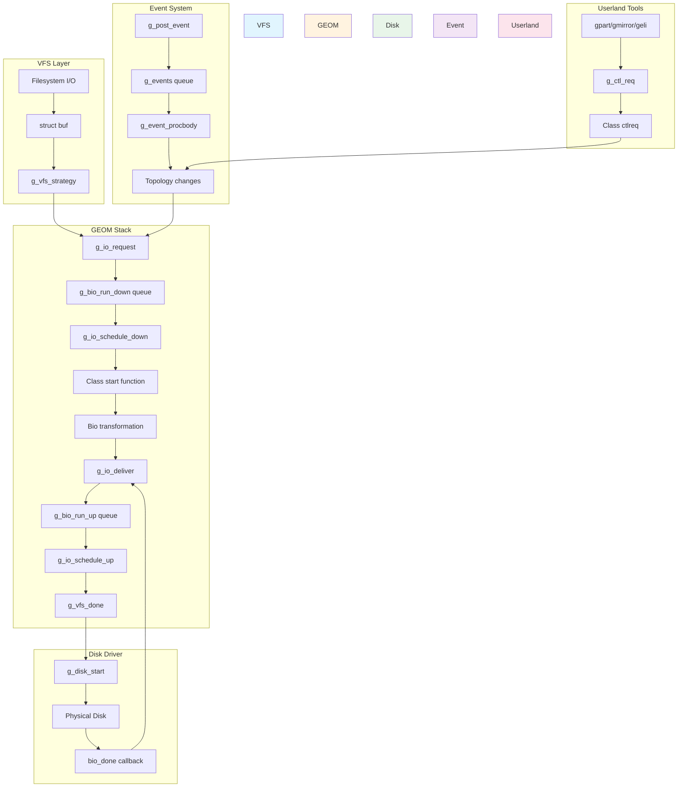

# GEOM — Storage Framework
<!-- This file is auto-generated by generate-doc.py -- do not edit manually -->

---
**Navigation:**
  **Up:** [Kernel Core — Structure and Entry Point](../README.md) ▸ [Source Tree — Layout and Conventions](../../README_internals.md)
  **Related:** [Buffer Cache — Block I/O Subsystem](../vm/README_bcache.md) | [CAM — Common Access Method Storage Stack](../cam/README.md) | [ZFS — Pooled Storage and Copy-on-Write Filesystem](../contrib/openzfs/README_freebsd.md)
  **All chapters:** [Source Tree — Layout and Conventions](../../README_internals.md) | [Boot Process — UEFI Bootloader to Kernel Handoff](../../stand/efi/loader/README.md) | [Kernel Core — Structure and Entry Point](../README.md) | [Build System — buildworld and buildkernel](../../share/mk/README.md) | [Virtual Memory Subsystem — vm_page, UMA, and Pagers](../vm/README.md) | [Process Management — Scheduling and Lifecycle](../kern/README_process.md) | [Locking Primitives — Mutexes, sx, rmlocks, and Atomics](../kern/README_locking.md) | [Buffer Cache — Block I/O Subsystem](../vm/README_bcache.md) ...
---


> ⚠ **UNVERIFIED DRAFT** — reviewer did not explicitly approve this draft. Treat claims as suspect until manually reviewed.


## Quick Summary

GEOM (GEOM) is FreeBSD's stackable storage framework that provides a uniform abstraction for block devices, sitting between the Virtual File System (VFS) layer and physical device drivers. It allows arbitrary transformations to be layered on top of block devices without modifying the underlying drivers. Think of GEOM as a set of building blocks: physical disks become "providers," and other GEOM objects that consume those providers become "consumers" that produce new providers for higher layers. This provider/consumer model enables features like RAID, disk encryption, partitioning, and disk labeling to be implemented as modular classes that compose together into a storage stack.

The framework is built around the concept of "classes" — each class (such as `MIRROR` for RAID-1, `ELI` for encryption, or `PART` for partitioning) defines a set of operations and a transformation rule. A class creates "geoms" (topology objects) that link consumers to providers. When a bio (block I/O request) arrives from above, it is transformed according to the class's rules and forwarded down to the underlying provider. When the I/O completes, the result travels back up the stack. This design allows complex storage configurations to be built by stacking classes on top of each other, much like layers in a sandwich.

GEOM uses a single-threaded topology model where all topology changes (creating, destroying, or reconfiguring geoms) are serialized through a topology lock (an `sx` lock). This simplifies concurrency by ensuring that the storage topology is always in a consistent state when code walks the provider/consumer graph. The `g_event` thread handles asynchronous topology events, allowing GEOM to react to device additions, removals, and configuration changes without blocking the I/O path.

The bridge between the VFS buffer cache and GEOM is implemented in `geom_vfs.c`. When a filesystem issues a read or write, the VFS layer creates a `struct buf` which is then converted into a `struct bio` by the GEOM VFS class. The bio travels down the GEOM stack, gets transformed by each class it passes through, reaches the physical disk driver, and then returns back up the stack. This uniform bio-based interface means that all GEOM classes, regardless of their complexity, work with the same I/O primitive.

## Architecture

GEOM's architecture is defined by four core concepts: providers, consumers, geoms, and classes. These are defined in `sys/geom/geom.h` and implemented primarily in `sys/geom/geom_subr.c`.

**Providers** (`struct g_provider`) represent block devices that can be read from and written to. They expose attributes such as sector size, size in sectors, and media name. A provider can be a physical disk (like `ada0`), a partition (like `ada0p1`), or a transformed device (like a RAID volume).

**Consumers** (`struct g_consumer`) represent a GEOM object's connection to a provider. Each consumer sits on a geom and "consumes" a provider. A geom can have multiple consumers (e.g., a mirror geom consuming two disk providers), and a provider can have multiple consumers (e.g., a physical disk consumed by both a partition geom and a label geom).

**Geoms** (`struct g_geom`) are the topology objects that implement transformations. Each geom belongs to a class and contains a list of consumers. Geoms create their own providers (output devices) that higher layers consume.

**Classes** (`struct g_class`) define the transformation logic. Each class has function pointers for operations like `taste` (detecting if a provider belongs to this class), `ctlreq` (handling control requests from userland), and class-specific config/destroy functions. Classes

## Key Data Structures

The core data structures of GEOM are defined in `sys/geom/geom.h`. Here are the essential structs:

**`struct g_class`** — The class descriptor that defines a transformation type.

```c
struct g_class {
	const char		*name;
	u_int			version;
	u_int			spare0;
	g_taste_t		*taste;
	g_ctl_req_t		*ctlreq;
	g_init_t		*init;
	g_fini_t		*fini;
	g_start_t		*start;
	g_access_t		*access;
	g_orphan_t		*orphan;
	g_ioctl_t		*ioctl;
	g_spoiled_t		*spoiled;
	g_attrchanged_t		*attrchanged;
	g_dumpconf_t		*dumpconf;
	g_resize_t		*resize;
	TAILQ_ENTRY(g_class)	methods;
	/* ... */
};
```

The `g_class` structure is the central registry for each GEOM class type. The `name` field identifies the class (e.g., "MIRROR", "ELI", "PART"). Function pointers define the class's behavior: `taste` detects whether a provider belongs to this class, `ctlreq` handles control requests from userland, and `start` is called when I/O requests arrive. Classes are registered globally via `DECLARE_GEOM_CLASS()` and stored in `g_classes`, a LIST_HEAD defined in `geom_subr.c`.

**`struct g_geom`** — The topology object that implements a transformation.

```c
struct g_geom {
	const char        *name;
	struct g_class    *class;
	TAILQ_ENTRY(g_geom) geom;
	LIST_HEAD(, g_consumer) consumer;
	LIST_HEAD(, g_provider) provider;
	int                rank;
	void              *softc;
	g_start_t         *start;
	g_spoiled_t       *spoiled;
	g_attrchanged_t   *attrchanged;
	/* ... */
};
```

Each geom belongs to exactly one class and can have multiple consumers (input providers) and multiple providers (output devices). The `softc` pointer is class-specific data. The `rank` field determines the order in which classes are tasted when new providers appear.

**`struct g_consumer`** — Represents a geom's connection to a provider.

```c
struct g_consumer {
	struct g_geom		*geom;
	LIST_ENTRY(g_consumer)	consumer;
	struct g_provider	*provider;
	LIST_ENTRY(g_consumer)	provider;
	u_int			ace;
	u_int			flags;
	/* ... */
};
```

A consumer links a geom to a provider. The `ace` field tracks exclusive access counts. The `flags` field includes `G_CF_ACTIVE` (0x1), `G_CF_OPEN` (0x4), and `G_CF_DEAD` (0x10, 0x20). When a geom needs to access its underlying provider, it calls `g_access()` to increment these counts.

**`struct g_provider`** — Represents a block device that can be read from or written to.

```c
struct g_provider {
	const char        *name;
	LIST_ENTRY(g_provider) provider;
	struct g_geom     *geom;
	LIST_HEAD(, g_consumer) consumers;
	u_int              ace;
	int                error;
	g_orphan_t        *orphan;
	off_t              mediasize;
	int                sectorsize;
	int                stripesize;
	/* ... */
};
```

A provider is what higher layers see as a block device. It has a name (like "mirror/gm0"), belongs to a geom, and maintains a list of consumers that use it. The `mediasize` and `sectorsize` fields describe the device geometry. The `error` field holds the last error status.

**`struct g_bioq`** — The I/O queue used for batching bio requests.

```c
struct g_bioq {
	TAILQ_ENTRY(bio) bio_queue;
	struct mtx         bio_queue_lock;
	int                bio_queue_length;
};
```

GEOM uses two global bio queues: `g_bio_run_down` and `g_bio_run_up` (defined in `geom_io.c`). These queues batch I/O requests before they are dispatched down or returned up the stack, improving throughput by allowing the kernel to reorder and coalesce requests.

## Deep Dive

### The Topology Lock and Single-Threaded Model

GEOM's topology (the provider/consumer graph) is protected by a single `sx` lock, accessed via `g_topology_assert()` and `g_topology_unlock()`. This lock ensures that topology changes are serialized. All topology-altering functions — `g_new_geom()`, `g_new_providerf()`, `g_attach()`, `g_detach()`, `g_wither_geom()`, `g_wither_provider()` — must be called while holding the topology lock.

This single-threaded model simplifies concurrency dramatically. Without it, walking the provider/consumer graph to find a consumer's provider or a provider's consumers would require complex locking. By serializing topology changes, GEOM guarantees that the graph is always in a consistent state when code traverses it.

The topology lock is an `sx` lock (sleepable exclusive lock), which means it can be held across operations that might sleep. This is important because some topology operations need to allocate memory or call other functions that may block. The trade-off is that topology changes can become a bottleneck under heavy load, but this is mitigated by keeping topology operations fast and deferring I/O-intensive work.

### Bio Request Flow: From VFS to Disk and Back

The bio request lifecycle is the core of GEOM's I/O path. Here is the complete flow:

1. **VFS creates a bio**: When a filesystem issues a read or write, the VFS layer creates a `struct bio` wrapped in a `struct buf`. The `g_vfs_strategy()` function in `geom_vfs.c` is called as the buffer's strategy function.

2. **g_io_request()**: The bio is passed to `g_io_request()` in `geom_io.c`. This function:
   - Allocates a bio if needed (via `g_alloc_bio()` from the `biozone` UMA zone)
   - Sets the bio's `bio_from` pointer to the consumer's geom
   - Batches the bio into `g_bio_run_down` queue
   - Calls `g_io_schedule_down()` to dispatch the bio

3. **g_io_schedule_down()**: This function processes the down queue:
   - Locks the bio queue with `g_bioq_lock()`
   - Iterates through queued bios
   - Calls the consumer's geom's `start` function (or the class's `start` if not overridden)
   - Unlocks the queue

4. **Class start function**: Each class's `start` function transforms the bio. For example:
   - `g_disk_start()` in `geom_disk.c` sends the bio directly to the disk driver
   - `g_slice_start()` in `geom_slice.c` translates the offset to the slice's range
   - `g_mirror_start()` in `sys/geom/mirror/g_mirror.c` clones the bio for each provider

5. **Provider dispatch**: The bio reaches a provider's consumer, which forwards it to the underlying device driver via the provider's `g_dev_strategy()` or similar.

6. **Completion**: When the disk driver completes the I/O, it calls the bio's `bio_done` function (typically `g_std_done()` or a class-specific function).

7. **g_io_deliver()**: The completion function calls `g_io_deliver()`, which:
   - Sets the bio's `bio_error` field
   - Batches the bio into `g_bio_run_up` queue
   - Calls `g_io_schedule_up()` to return the bio up the stack

8. **g_io_schedule_up()**: This function processes the up queue:
   - Locks the bio queue
   - Iterates through completed bios
   - Calls each provider's geom's `start` function (reversing the transformation)
   - Eventually returns to the VFS layer via `g_vfs_done()`

9. **g_vfs_done()**: In `geom_vfs.c`, this function:
   - Updates filesystem statistics (sync/async read/write counts)
   - Calls `bufdone()` to complete the `struct buf`
   - Wakes up any sleepers waiting on the I/O

### The g_event Thread and Asynchronous Events

GEOM uses an event-driven model for topology changes. The `g_event` thread (created in `geom_event.c`) processes asynchronous events like device additions, removals, and configuration changes. This design allows GEOM to react to hardware changes without blocking the I/O path.

Key event functions:

- **`g_post_event()`**: Schedules an event for later processing. The event is added to the `g_events` tail queue and will be processed by the event thread.

- **`g_event_procbody()`**: The event thread's main loop. It processes events from the queue, calling the event's function with the appropriate arguments.

- **`g_wither_geom()` / `g_wither_provider()`**: These functions schedule "wither" events that destroy geoms and providers. The actual destruction happens in the event thread, allowing the I/O path to continue without waiting for cleanup.

- **`g_retaste_event()`**: Schedules a retaste operation when new hardware is detected. This causes all classes to re-examine existing providers to see if any new transformations apply.

The event system uses reference counting (`g_event->ref[]`) to ensure that objects referenced in events are not destroyed before the event is processed. The `G_N_EVENTREFS` constant (20) limits the number of references per event.

### Control Requests and Userland Integration

GEOM provides a control interface for userland tools like `gpart`, `gmirror`, and `geli`. Control requests are sent via `g_ctl_req()` in `geom_ctl.c`, which:

1. Allocates a `struct gctl_req` to hold the request
2. Parses parameters using `gctl_get_param()`, `gctl_get_asciiparam()`, etc.
3. Calls the class's `ctlreq` function to handle the request
4. Returns results via `gctl_set_param()`

The control interface uses a message-passing model where userland tools send commands like "CREATE", "CONFIG", "DESTROY" to GEOM classes. Classes implement these verbs in their `ctlreq` function. For example, the `MIRROR` class handles "CREATE" to create a new mirror geom from disk providers.

### Bridge Between VFS and GEOM: geom_vfs.c

The `g_vfs_class` in `geom_vfs.c` is the bridge between the VFS layer and GEOM. When a filesystem mounts a GEOM device, the VFS layer associates the `g_vfs_bufops` buffer operations with the device. The key functions are:

- **`g_vfs_open()`**: Creates a consumer for the device and attaches it to the geom.
- **`g_vfs_close()`**: Detaches the consumer and cleans up.
- **`g_vfs_strategy()`**: Converts VFS buffer requests to GEOM bios and dispatches them.
- **`g_vfs_done()`**: Completes VFS buffers when GEOM bios finish.
- **`g_vfs_orphan()`**: Handles device removal by marking the consumer as orphaned.

The `g_vfs_softc` structure tracks per-mount-point state, including access counts and event references.

### Disk Class: geom_disk.c

The `g_disk_class` in `geom_disk.c` is the lowest-level GEOM class that interfaces directly with physical disk drivers. It:

- Creates providers for physical disks detected by the kernel
- Manages disk aliases (alternate device names)
- Handles disk media changes via `disk_media_changed()`
- Supports disk labeling and partitioning
- Integrates with the dump device system via `g_dev_setdumpdev()`

The `g_disk_softc` structure holds per-disk state, including a `struct disk` pointer, `devstat` statistics, and sysctl tree.

### Slice Class: geom_slice.c

The `g_slice_class` implements BSD disklabel slicing. It:

- Parses disklabels from providers
- Creates slice providers for each partition
- Handles hot-swap detection via `g_slice_finish_hot()`
- Validates access conflicts between overlapping slices

The `g_slicer` structure (allocated by `g_slice_alloc()`) holds slice information for each geom, including an array of `struct g_slice` entries.

### Device Node Management: geom_dev.c

The `geom_dev.c` module provides the interface between GEOM and the device node subsystem (cdevsw). It is responsible for creating and managing character device nodes that userland tools use to interact with GEOM devices.

Key responsibilities include:

- **Device node creation**: When a GEOM provider is created, `geom_dev.c` creates a corresponding character device node (`/dev/geom/...`) that userland can open and use. This is done via `make_dev()` which registers the device with the cdev subsystem.

- **Dump device registration**: The function `g_dev_setdumpdev()` allows GEOM devices to be used as dump devices for kernel crash dumps. When a GEOM device is set as the dump device, the dump subsystem routes crash dumps through the GEOM stack.

- **Strategy function**: `g_dev_strategy()` is the character device strategy function that handles I/O requests to GEOM device nodes. It converts incoming requests into bios and dispatches them through the GEOM stack.

- **Device open/close**: The `g_dev_open()` and `g_dev_close()` functions manage access to GEOM device nodes, ensuring proper reference counting and access control.

The geom_dev module essentially acts as the gateway that allows userland tools like `gpart`, `gmirror`, and `geli` to send control requests to GEOM classes via the character device interface.

## Flow / Diagram



The diagram shows the complete data flow through GEOM:

1. **VFS Layer** (blue): Filesystem I/O creates `struct buf` objects that are converted to bios.
2. **GEOM Stack** (orange): Bios travel down the stack via `g_io_request`, get transformed by each class, and return up via `g_io_deliver`.
3. **Disk Driver** (green): Physical disk drivers receive bios and complete them via callbacks.
4. **Event System** (purple): Asynchronous topology events are processed by the `g_event` thread.
5. **Userland Tools** (pink): Tools like `gpart`, `gmirror`, and `geli` send control requests to GEOM classes.

## Advanced Notes

### Debugging with DTrace

GEOM provides debugging facilities through the `g_dbg_printf()` function in `geom_subr.c`, which uses `sbuf` to format debug output. Debug output can be enabled via the `kern.geom.debugflags` sysctl, which controls verbosity levels for different GEOM classes. The `SDT_PROVIDER_DEFINE(geom)` macro in `geom_subr.c` reserves the DTrace provider namespace for GEOM, though specific SDT probes are not currently defined in the main GEOM code.

Example debugging output:

```sh
sysctl kern.geom.debugflags=0x10
```

The `g_dbg_printf()` function takes a class name, log level, bio pointer, and format string, and outputs formatted debug information when debug flags are enabled. This is the primary mechanism for tracing GEOM operations at runtime.

### Performance Implications

GEOM's single-threaded topology model can become a bottleneck under heavy I/O load. The `sx` lock serializes all topology changes, which means that if one thread is modifying the topology, all other threads must wait. This is mitigated by:

- Keeping topology operations fast and avoiding sleep in critical paths
- Using the `g_bioq` queues to batch I/O and reduce lock contention
- Deferring topology changes to the event thread to avoid blocking I/O

The `g_bio_run_down` and `g_bio_run_up` queues improve throughput by allowing the kernel to reorder and coalesce I/O requests. The `pace` variable in `geom_io.c` controls back-off when memory allocation fails, preventing runaway I/O when the system is under memory pressure.

### Common Pitfalls

1. **Topology lock violations**: Calling topology-altering functions without holding the topology lock will cause panics. Always use `g_topology_assert()` to verify lock state during development.

2. **Event reference leaks**: Forgetting to call `g_cancel_event()` or `g_waitidle()` can cause event references to leak, preventing geom destruction. Always clean up event references in your class's `orphan` function.

3. **Bio queue overflow**: If bios are not delivered promptly, the bio queues can fill up, causing I/O stalls. Ensure that your class's `start` function delivers bios promptly, even if it needs to clone or transform them.

4. **Access count mismatches**: Failing to balance `g_access()` calls can leave consumers in an inconsistent state. Always pair `g_access()` calls: increment on open, decrement on close.

5. **Provider name collisions**: GEOM provider names must be unique. Using `g_new_providerf()` with format strings helps avoid collisions. Always check for existing providers before creating new ones.

### Connection to OS Theory

GEOM implements a layered block device architecture, a concept found in many operating systems but with FreeBSD's unique twist. The provider/consumer model is similar to Linux's block layer, but GEOM's single-threaded topology model is more restrictive, trading flexibility for simplicity.

The bio-based I/O interface is similar to the Unix `struct buf` but with GEOM's transformation layer added. This design allows GEOM to be transparent to filesystems, which see GEOM devices as regular block devices.

GEOM's event-driven topology model is inspired by the Unix device management paradigm, where device additions and removals are handled asynchronously. This design allows GEOM to react to hardware changes without blocking the I/O path, a key requirement for reliable storage systems.

## See Also
- [Buffer Cache — Block I/O Subsystem](../vm/README_bcache.md)
- [CAM — Common Access Method Storage Stack](../cam/README.md)
- [ZFS — Pooled Storage and Copy-on-Write Filesystem](../contrib/openzfs/README_freebsd.md)


- **Related source directories**: [`sys/geom/mirror/`](mirror), [`sys/geom/eli/`](eli), [`sys/geom/part/`](part), [`sys/geom/label/`](label), [`sys/geom/stripe/`](stripe), [`sys/geom/raid/`](raid)
- **Related chapters**: [Buffer Cache — Block I/O Subsystem](../vm/README_bcache.md), [CAM — Common Access Method Storage Stack](../cam/README.md), [ZFS — Pooled Storage and Copy-on-Write Filesystem](../contrib/openzfs/README_freebsd.md)
- **Man pages**: `g_bio.9`, `g_geom.9`, `g_wither_geom.9`, `lock.9`
- **FreeBSD Handbook**: [Writing a GEOM Class](https://docs.freebsd.org/en/books/handbook/geom-class/)

---

> _Generated by [DaemonDocs](https://github.com/ocochard/DaemonDocs) on 2026-05-03 20:35 UTC using model `Qwen3.6-35B-A3B-UD-Q8_K_XL` (llama.cpp build `b8985-27aef3dd9`). AI-generated content — verify against source before relying on it._
