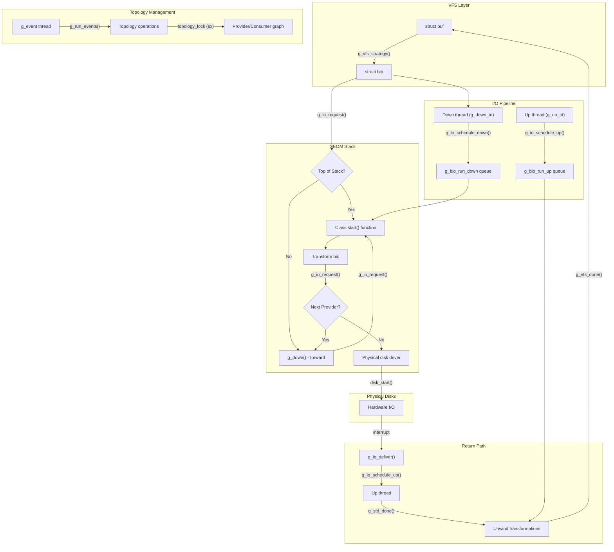

# GEOM — Storage Framework
<!-- This file is auto-generated by generate-doc.py -- do not edit manually -->

---
**Navigation:**
  **Up:** [Kernel Core — Structure and Entry Point](../README.md) ▸ [Source Tree — Layout and Conventions](../../README_internals.md)
  **Related:** [Buffer Cache — Block I/O Subsystem](../vm/README_bcache.md) | [CAM — Common Access Method Storage Stack](../cam/README.md) | [ZFS — Pooled Storage and Copy-on-Write Filesystem](../contrib/openzfs/README_freebsd.md)
  **All chapters:** [Source Tree — Layout and Conventions](../../README_internals.md) | [Boot Process — UEFI Bootloader to Kernel Handoff](../../stand/efi/loader/README.md) | [Kernel Core — Structure and Entry Point](../README.md) | [Build System — buildworld and buildkernel](../../share/mk/README.md) | [Virtual Memory Subsystem — vm_page, UMA, and Pagers](../vm/README.md) | [Process Management — Scheduling and Lifecycle](../kern/README_process.md) | [Locking Primitives — Mutexes, sx, rmlocks, and Atomics](../kern/README_locking.md) | [Buffer Cache — Block I/O Subsystem](../vm/README_bcache.md) ...
---


> ⚠ **UNVERIFIED DRAFT** — reviewer did not explicitly approve this draft. Treat claims as suspect until manually reviewed.


## Quick Summary

GEOM (GEOM) is FreeBSD's stackable storage framework that sits between the Virtual File System (VFS) layer and physical device drivers. It provides a uniform abstraction for storage devices, allowing arbitrary transformations to be layered on top of block devices without modifying the underlying drivers. Think of GEOM as a set of building blocks: physical disks become "providers," and other GEOM objects that consume those providers become "consumers" that produce new providers for higher layers. This provider/consumer model enables features like RAID, disk encryption, partitioning, and disk labeling to be implemented as modular classes that compose together into a storage stack.

The framework is built around the concept of "classes" — each class (such as `MIRROR` for RAID-1, `ELI` for encryption, or `PART` for partitioning) defines a set of operations and a transformation rule. A class creates "geoms" (topology objects) that link consumers to providers. When a bio (block I/O request) arrives from above, it is transformed according to the class's rules and forwarded down to the underlying provider. When the I/O completes, the result travels back up the stack. This design allows complex storage configurations to be built by stacking classes on top of each other, much like layers in a sandwich.

GEOM uses a single-threaded topology model where all topology changes (creating, destroying, or reconfiguring geoms) are serialized through a topology lock (an `sx` lock). This simplifies concurrency by ensuring that the storage topology is always in a consistent state when code walks the provider/consumer graph. The `g_event` thread handles asynchronous topology events, allowing GEOM to react to device additions, removals, and configuration changes without blocking the I/O path.

The bridge between the VFS buffer cache and GEOM is implemented in `geom_vfs.c`. When a filesystem issues a read or write, the VFS layer creates a `struct buf` which is then converted into a `struct bio` by the GEOM VFS class. The bio travels down the GEOM stack, gets transformed by each class it passes through, reaches the physical disk driver, and then returns back up the stack. This uniform bio-based interface means that all GEOM classes, regardless of their complexity, work with the same I/O primitive.

## Architecture

GEOM's architecture is defined by four core concepts: providers, consumers, geoms, and classes. These are defined in `sys/geom/geom.h` and implemented primarily in `sys/geom/geom_subr.c`.

**Providers** (`struct g_provider`) represent block devices that can be read from and written to. They expose attributes such as sector size, size in sectors, and media name. A provider can be a physical disk (like `ada0`), a partition (like `ada0p1`), or a transformed device (like a RAID volume).

**Consumers** (`struct g_consumer`) represent a GEOM object's connection to a provider. Each consumer sits on a geom and "consumes" a provider. A geom can have multiple consumers (e.g., a mirror geom consuming two disk providers), and a provider can have multiple consumers (e.g., a physical disk consumed by both a partition geom and a label geom).

**Geoms** (`struct g_geom`) are the topology objects that implement transformations. Each geom belongs to a class and contains a list of consumers. Geoms create their own providers (output devices) that higher layers consume.

**Classes** (`struct g_class`) define the transformation logic. Each class has function pointers for operations like `taste` (detecting if a provider belongs to this class), `ctlreq` (handling control requests from userland), and class-specific config/destroy functions. Classes are registered at boot time via `SYSINIT` and can be loaded/unloaded as modules.

### I/O Path

The I/O path in GEOM is implemented in `sys/geom/geom_io.c`. When a bio is submitted to a GEOM provider via `g_io_request()`, it enters a two-threaded pipeline: a "down" thread that pushes I/O toward the physical disks, and an "up" thread that returns completed I/O back to the VFS layer. Each class in the stack can inspect, modify, or split bios as they pass through.

The topology lock (`topology_lock`, an `sx` lock defined in `sys/geom/geom_kern.c`) protects all topology operations. Any code that creates, destroys, or reconfigures geoms must hold this lock exclusively. This single-threaded topology model avoids complex locking within the provider/consumer graph.

### Event System

GEOM maintains a separate event thread (`g_event_td`) defined in `sys/geom/geom_event.c`. Events are queued via `g_post_event()` and processed by `g_run_events()`. This allows topology changes (like device removal) to be handled asynchronously, avoiding the need to sleep while holding the topology lock. The `g_waitidle()` function blocks until all pending events have been processed, used during shutdown.

### VFS Bridge

The VFS bridge in `sys/geom/geom_vfs.c` implements the `VFS` class. When a filesystem's buffer cache issues I/O, the GEOM VFS class converts `struct buf` operations into `struct bio` requests. The `g_io_deliver()` function receives completed bios and returns them to the buffer cache.

### Device Interface

The `DEV` class in `sys/geom/geom_dev.c` creates character device nodes (`/dev/geom/...`) that allow userland tools like `glabel` and `gmirror` to interact with GEOM topology. The device interface dispatches I/O to the underlying GEOM stack and detects device creation events from the CAM subsystem.

### Disk Class

The `DISK` class in `sys/geom/geom_disk.c` bridges GEOM to physical disk drivers. Each disk geom has a `struct disk` softc that maintains device statistics via `devstat`, LED state, and sysctl tree entries. Disk bios are submitted to the underlying disk driver's strategy routine, and completion callbacks are handled by the DISK class.

### Slice Class

The `SLICE` class in `sys/geom/geom_slice.c` handles MBR partition tables (slices). It parses the Master Boot Record to identify slice boundaries and creates corresponding `g_provider` objects for each slice. This allows FreeBSD systems using MBR disks to access individual partitions through the GEOM stack, providing a GEOM-managed view of MBR partitions similar to how `PART` handles BSD and GPT labels.

## Key Data Structures

### `struct g_class`

From `sys/geom/geom.h`:

```c
struct g_class {
	const char		*name;
	u_int			version;
	u_int			spare0;
	g_taste_t		*taste;
	g_ctl_req_t		*ctlreq;
	g_init_t		*init;
	g_fini_t		*fini;
	g_ctl_destroy_geom_t	*destroy_geom;
};
```

The class structure defines the transformation logic for a GEOM class. The `name` field identifies the class (e.g., "MIRROR", "ELI", "PART"). Function pointers define class operations: `taste` detects whether a provider belongs to this class, `ctlreq` handles control requests from userland, and `init`/`fini` manage module lifecycle.

### `struct g_geom`

From `sys/geom/geom.h`:

```c
struct g_geom {
	TAILQ_ENTRY(g_geom) geom;
	const char		*name;
	struct g_class		*class;
	void			*softc;
	LIST_HEAD(, g_consumer) consumer;
	LIST_HEAD(, g_provider) provider;
	struct sx		*lock;
	int			rank;
	g_start_t		*start;
	g_spoiled_t		*spoiled;
	g_attrchanged_t		*attrchanged;
};
```

The geom structure represents a single instance of a transformation. Each geom belongs to exactly one class and can have multiple consumers (input providers) and multiple providers (output devices). The `softc` pointer holds class-specific state. The `start` field is a function pointer of type `g_start_t` (defined as `typedef void g_start_t(struct bio *)`), called when I/O arrives at this geom. The `spoiled` callback is called when a consumer's data is invalidated, and `attrchanged` handles attribute updates.

### `struct g_consumer`

From `sys/geom/geom.h`:

```c
struct g_consumer {
	LIST_ENTRY(g_consumer) consumers;
	LIST_ENTRY(g_consumer) provider_consumers;
	struct g_geom		*geom;
	struct g_provider	*provider;
	int			acr;
	int			acw;
	int			ace;
	void			*softc;
};
```

A consumer represents a geom's attachment to a provider. The `acr`, `acw`, and `ace` fields track access counts for read, write, and exclusive operations respectively — these prevent conflicting accesses to underlying devices. The `provider_consumers` list enables walking from a provider back to all geoms that consume it.

### `struct g_provider`

From `sys/geom/geom.h`:

```c
struct g_provider {
	TAILQ_ENTRY(g_provider) pgeom;
	TAILQ_ENTRY(g_provider) pconsumer;
	const char		*name;
	struct g_geom		*geom;
	LIST_HEAD(, g_consumer) consumer;
	off_t			size;
	u_int			secsize;
	char			*mediasize;
	char			*sectorsize;
	void			*private;
	int			index;
	u_int			flags;
};
```

A provider represents a block device with attributes. The `size` field gives the total size in bytes, `secsize` is the sector size, and `geom` points to the geom that created this provider. The `consumer` list tracks all geoms that consume this provider. The `private` field holds class-specific data (for the DISK class, it points to `struct g_disk_softc`).

### `struct g_bioq`

From `sys/geom/geom.h`:

```c
struct g_bioq {
	TAILQ_HEAD(, bio) bio_queue;
	struct mtx		bio_queue_lock;
	u_int			bio_queue_length;
};
```

The bio queue is used by the I/O pipeline threads to batch bios for processing. Defined in `sys/geom/geom_io.c`, two global bio queues exist: `g_bio_run_down` and `g_bio_run_up`. Access to these queues is protected by the `bio_queue_lock` mutex using static helper functions `g_bioq_lock()` and `g_bioq_unlock()` defined in `geom_io.c`.

### `struct g_event`

From `sys/geom/geom_event.c`:

```c
struct g_event {
	TAILQ_ENTRY(g_event) events;
	g_event_t		*func;
	void			*arg;
	int			flag;
	void			*ref[G_N_EVENTREFS];
};
```

The event structure represents a deferred topology operation. The `func` pointer is the handler, `arg` is its argument, and `flag` includes state bits like `EV_DONE`, `EV_WAKEUP`, `EV_CANCELED`. The `ref` array holds references to geom/consumer/provider objects to prevent premature destruction while the event is pending.

## Deep Dive

### I/O Pipeline: From `g_io_request` to Disk Driver

When a bio arrives at a GEOM provider, the I/O pipeline processes it in two phases: down (toward disks) and up (back to VFS). Let's trace this path through the code.

**Entry point: `g_io_request()`** (in `sys/geom/geom_io.c`)

The bio is tagged with its source consumer (`bio_from`) and destination provider (`bio_to`). For a bio coming from above, `bio_from` is NULL. The function schedules the bio for downward processing.

**Downward scheduling: `g_io_schedule_down()`** (in `sys/geom/geom_io.c`)

Bios are queued in `g_bio_run_down` and the down thread is woken. The down thread (`g_down_td`) processes queued bios, dispatching them to the appropriate geom's class `start` function pointer. For bios at the top of the stack (where `bio_from` is NULL), the bio is dispatched to the geom's `start` function. For bios in the middle of the stack, they are forwarded downward via the consumer chain.

**Class-specific start functions:**

Each transformation class implements its own `start` function (type `g_start_t`). For the MIRROR class in `sys/geom/mirror/g_mirror.c`, the start function demonstrates how a transformation class modifies bios: it checks the mirror state, transforms the bio to target providers, and forwards sub-bios down via `g_io_request()` to the underlying disk providers.

**Forwarding through the consumer chain:**

Bios in the middle of the stack are forwarded by walking the consumer chain: the function gets the provider that the current consumer sits on, then finds the next consumer (the geom that created that provider), and forwards the bio downward. This continues until the bio reaches the bottom-most provider (a physical disk).

**Completion: `g_io_deliver()`** (in `sys/geom/geom_io.c`)

When a bio completes at the disk driver, the callback chain returns it to GEOM via `g_io_deliver()`. For bios at the bottom of the stack (where `bio_from` is NULL), the completion is returned to the VFS layer. For bios in the middle of the stack, they are queued for the up thread via `g_io_schedule_up()`.

**Upward scheduling: `g_io_schedule_up()`**

The up thread (`g_up_td`) processes these bios, calling the appropriate class's completion handler (via `g_std_done()` or class-specific `done` functions) to unwind transformations.

### Topology Operations

Creating and destroying geoms involves several steps, all protected by `topology_lock`:

**`g_wither_geom()`** (in `sys/geom/geom_subr.c`):

This function destroys a geom and all its associated consumers and providers. It is called when a geom needs to be torn down, such as when a underlying provider disappears. The function walks the consumer list, detaching each consumer and freeing associated resources.

**`g_wither_provider()`** (in `sys/geom/geom_subr.c`):

This function destroys a provider and notifies all consuming geoms. When a provider is destroyed, all geoms that consume it are notified via the `g_provgone_t` callback, allowing them to reconfigure or destroy themselves.

**`g_access()`** (in `sys/geom/geom_subr.c`):

This function manages access counts on providers. It increments `acr`, `acw`, or `ace` fields in consumers to prevent conflicting accesses. Access counts must be properly managed — failing to decrement them when closing a provider can prevent geom destruction.

### The VFS Bridge: `struct buf` to `struct bio`

In `sys/geom/geom_vfs.c`, the VFS class bridges `struct buf` I/O to GEOM's bio world:

The VFS class converts `struct buf` operations into `struct bio` requests. When a filesystem's buffer cache issues I/O, the VFS class allocates a new bio, copies the relevant fields (command, offset, data pointer, length), and forwards it to the GEOM stack via `g_io_request()`.

When a bio completes, the completion handler retrieves the original `struct buf` from the bio's `bio_caller2` field, copies back error and residue information, and returns the buffer to the VFS layer. The bio is then freed via `g_destroy_bio()`.

The `bio_caller2` field stores the original `struct buf` pointer, allowing the completion handler to return results to the correct buffer.

### Event System: Handling Topology Changes

The event system in `sys/geom/geom_event.c` handles asynchronous topology operations:

**`g_post_event()`** queues an event:

Events are allocated, populated with the handler function and arguments, and added to the event queue. The event holds references to geom/consumer/provider objects to prevent premature destruction. The event thread is woken to process the new event.

**`g_run_events()`** processes events in the event thread:

Events are processed while holding `topology_lock`, ensuring topology consistency during deferred operations like device removal. After processing, references are released and the event structure is freed. The thread sleeps when no events are pending.

## Flow / Diagram



## Advanced Notes

### Performance Considerations

GEOM's single-threaded topology model (`topology_lock`) is a deliberate design choice that simplifies concurrency at the cost of serialization. All topology changes must wait for the `sx` lock, which can become a bottleneck during heavy configuration changes. However, I/O processing is not affected by this lock — the down and up threads operate independently of topology operations.

The two-threaded I/O pipeline (down and up threads) is intentionally simple. As noted in `sys/geom/geom_kern.c`:

> "We have only one thread in each direction, it is believed that until a very non-trivial workload in the UP/DOWN path this will be enough, but more than one can actually be run without problems."

The bio queue system (`g_bioq`) batches bios for efficient processing. The `pace` variable in `geom_io.c` provides backoff when memory pressure causes bio allocation failures, preventing cascading failures under load.

### Common Pitfalls

**Sleeping while holding topology_lock:** The topology lock must never be held while sleeping. All topology operations that might sleep use `g_post_event()` to defer work to the event thread. Sleeping in the I/O pipeline threads will deadlock the entire I/O path.

**Access count violations:** The `acr`, `acw`, and `ace` fields in `struct g_consumer` must be managed correctly. A common mistake is failing to call `g_access()` with negative counts when closing a provider, which can prevent geom destruction.

**Event reference leaks:** Events hold references to geom/consumer/provider objects via the `ref[]` array. If an event handler fails to properly release these references (by not calling `g_wither_geom()` or `g_wither_provider()`), the affected objects cannot be destroyed, leading to resource leaks.

**Bio lifetime management:** Bios must be properly freed via `g_destroy_bio()` when no longer needed. Forgetting to free bios causes memory leaks, especially in error paths where bios might be abandoned.

### Connection to OS Theory

GEOM exemplifies the "stackable subsystem" pattern described in operating system textbooks like "Operating Systems: Design and Implementation" by Tanenbaum and Woodhull. The provider/consumer model is a form of layered architecture where each layer transforms the interface of the layer below it.

The single-threaded topology model is analogous to the "single-threaded scheduler" pattern used in many embedded systems, where simplicity of concurrency reasoning is valued over raw throughput. This is similar to how the Linux kernel's original device model used a single "hotplug" thread for device events.

GEOM's bio-based I/O interface is conceptually similar to Linux's block layer `struct request`, but with a key difference: FreeBSD's GEOM processes bios in a two-threaded pipeline (down/up), while Linux's block layer uses a more complex queueing discipline with multiple levels of request merging and dispatching.

## Comparison

### FreeBSD GEOM vs. Linux Device-Mapper

Linux's device-mapper subsystem provides similar functionality to GEOM, but with architectural differences. Device-mapper uses a "target" model where each transformation is implemented as a target type (e.g., `linear`, `striped`, `raid1`). Targets are attached to a "table" that describes the mapping, whereas GEOM uses class-based geoms with function pointers for operations.

FreeBSD's GEOM interfaces directly with the VFS layer through the `VFS` class, while Linux device-mapper sits below the filesystem layer and is accessed via block device nodes. GEOM's two-threaded I/O pipeline (down/up) is unique to FreeBSD; Linux uses a more complex request queueing system with multiple levels of merging.

### FreeBSD GEOM vs. macOS/XNU

macOS/XNU uses a different approach with the "IOStorageFamily" framework, which is object-oriented (C++ based) and tightly integrated with IOKit. Unlike GEOM's class-based model, XNU's storage framework uses inheritance hierarchies for transformations. GEOM's approach is more modular and allows runtime composition of transformations.

### FreeBSD GEOM vs. NetBSD/Mir

NetBSD uses "mir" (mirror) as a separate driver for RAID-1, along with "raidframe" for more complex RAID configurations. Unlike GEOM, NetBSD's approach is not stackable — transformations are implemented as separate drivers rather than composable classes. GEOM's stackable design allows arbitrary combinations (e.g., encryption on top of RAID on top of partitioning), while NetBSD requires separate drivers for each combination.

OpenBSD takes a similar approach to NetBSD, with separate drivers for different storage transformations. FreeBSD's GEOM provides a more unified framework that reduces code duplication by sharing common infrastructure across all transformation classes.

### FreeBSD GEOM vs. ZFS

ZFS predates GEOM in FreeBSD and provides its own storage management. While GEOM can layer on top of ZFS devices (e.g., encrypting a ZFS pool), ZFS does not use GEOM internally. ZFS implements its own storage stack with vdevs, which are similar to GEOM providers but with a different abstraction. Modern FreeBSD systems often use ZFS for pooled storage and GEOM for transformations that ZFS doesn't natively support.

## See Also
- [Buffer Cache — Block I/O Subsystem](../vm/README_bcache.md)
- [CAM — Common Access Method Storage Stack](../cam/README.md)
- [ZFS — Pooled Storage and Copy-on-Write Filesystem](../contrib/openzfs/README_freebsd.md)


- **Related source directories:**
  - `sys/geom/mirror/` — RAID-1 implementation
  - `sys/geom/eli/` — Disk encryption (LUKS-compatible)
  - `sys/geom/part/` — Partition table handling (MBR, BSD, GPT)
  - `sys/geom/label/` — Volume labels
  - `sys/geom/stripe/` — RAID-0 striping
  - `sys/geom/concat/` — Concatenation
  - `sys/geom/journal/` — Write-ahead logging
  - `sys/geom/raid/` — RAID-5 implementation

- **Related chapters:**

- **Key files to explore:**
  - `sys/geom/geom.h` — Core data structure definitions
  - `sys/geom/geom_subr.c` — Topology management functions
  - `sys/geom/geom_io.c` — I/O pipeline implementation
  - `sys/geom/geom_event.c` — Event system
  - `sys/geom/geom_vfs.c` — VFS bridge
  - `sys/geom/geom_disk.c` — Disk class implementation
  - `sys/geom/mirror/g_mirror.c` — MIRROR class implementation

---

> _Generated by [DaemonDocs](https://github.com/ocochard/DaemonDocs) on 2026-04-30 20:40 UTC using model `Qwen3.6-35B-A3B-UD-Q4_K_XL` (llama.cpp build `b8985-27aef3dd9`). AI-generated content — verify against source before relying on it._
