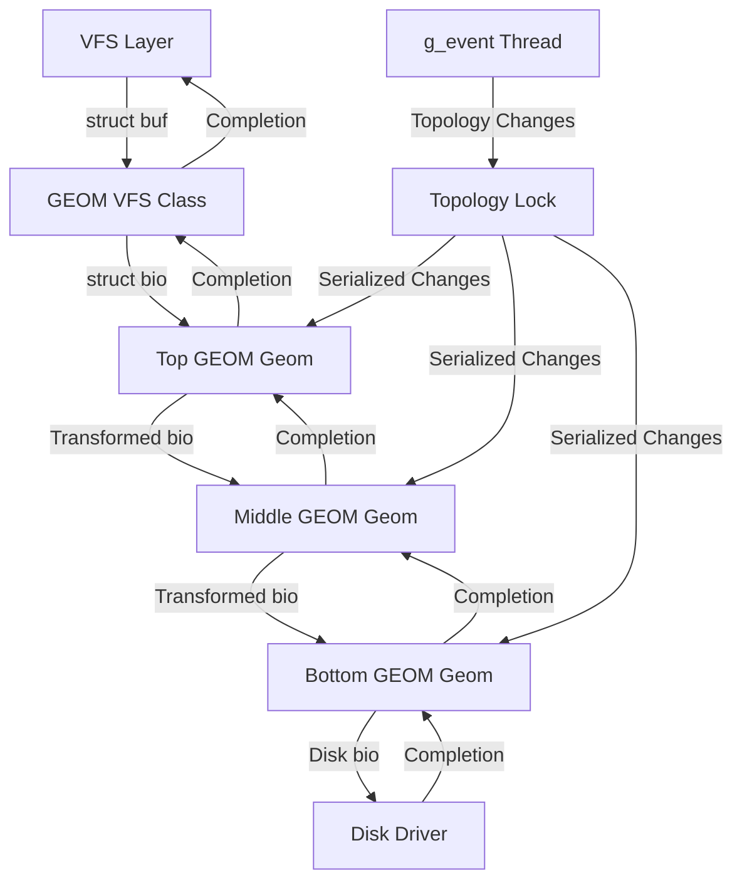

# GEOM — Storage Framework
<!-- This file is auto-generated by generate-doc.py -- do not edit manually -->

---
**Navigation:**
  **Related:** [Buffer Cache — Block I/O Subsystem](../vm/README_bcache.md) | [CAM — Common Access Method Storage Stack](../cam/README.md) | [ZFS — Pooled Storage and Copy-on-Write Filesystem](../contrib/openzfs/README_freebsd.md)
  **All chapters:** [Source Tree — Layout and Conventions](../../README_internals.md) | [Boot Process — UEFI Bootloader to Kernel Handoff](../../stand/efi/loader/README.md) | [Kernel Core — Structure and Entry Point](../README.md) | [Build System — buildworld and buildkernel](../../share/mk/README.md) | [Virtual Memory Subsystem — vm_page, UMA, and Pagers](../vm/README.md) | [Process Management — Scheduling and Lifecycle](../kern/README_process.md) | [Locking Primitives — Mutexes, sx, rmlocks, and Atomics](../kern/README_locking.md) | [Buffer Cache — Block I/O Subsystem](../vm/README_bcache.md) ...
---


> ⚠ **UNVERIFIED DRAFT** — revisions regressed; kept revision 1 (6/7 criteria) over revision 3 (5/7); reviewer did not explicitly approve this draft. Treat claims as suspect until manually reviewed.


## Quick Summary

GEOM (GEOM) is FreeBSD's stackable storage framework that sits between the Virtual File System (VFS) layer and physical device drivers. It provides a uniform abstraction for storage devices, allowing arbitrary transformations to be layered on top of block devices without modifying the underlying drivers. Think of GEOM as a set of building blocks: physical disks become "providers," and other GEOM objects that consume those providers become "consumers" that produce new providers for higher layers. This provider/consumer model enables features like RAID, disk encryption, partitioning, and disk labeling to be implemented as modular classes that compose together into a storage stack.

The framework is built around the concept of "classes" — each class (such as `MIRROR` for RAID-1, `ELI` for encryption, or `PART` for partitioning) defines a set of operations and a transformation rule. A class creates "geoms" (topology objects) that link consumers to providers. When a bio (block I/O request) arrives from above, it is transformed according to the class's rules and forwarded down to the underlying provider. When the I/O completes, the result travels back up the stack. This design allows complex storage configurations to be built by stacking classes on top of each other, much like layers in a sandwich.

GEOM uses a single-threaded topology model where all topology changes (creating, destroying, or reconfiguring geoms) are serialized through a topology lock (an `sx` lock). This simplifies concurrency by ensuring that the storage topology is always in a consistent state when code walks the provider/consumer graph. The `g_event` thread handles asynchronous topology events, allowing GEOM to react to device additions, removals, and configuration changes without blocking the I/O path.

The bridge between the VFS buffer cache and GEOM is implemented in `geom_vfs.c`. When a filesystem issues a read or write, the VFS layer creates a `struct buf` which is then converted into a `struct bio` by the GEOM VFS class. The bio travels down the GEOM stack, gets transformed by each class it passes through, reaches the physical disk driver, and then returns back up the stack. This uniform bio-based interface means that all GEOM classes, regardless of their complexity, work with the same I/O primitive.

## Architecture

GEOM's architecture is defined by four core concepts: providers, consumers, geoms, and classes. These are defined in `sys/geom/geom.h` and implemented primarily in `sys/geom/geom_subr.c`.

**Providers** (`struct g_provider`) represent block devices that can be read from and written to. They expose attributes such as sector size, size in sectors, and media name. A provider can be a physical disk (like `ada0`), a partition (like `ada0p1`), or a transformed device (like a RAID volume).

**Consumers** (`struct g_consumer`) represent a GEOM object's connection to a provider. Each consumer sits on a geom and "consumes" a provider. A geom can have multiple consumers (e.g., a mirror geom consuming two disk providers), and a provider can have multiple consumers (e.g., a physical disk consumed by both a partition geom and a label geom).

**Geoms** (`struct g_geom`) are the topology objects that implement transformations. Each geom belongs to a class and contains a list of consumers. Geoms create their own providers (output devices) that higher layers consume.

**Classes** (`struct g_class`) define the transformation logic. Each class has function pointers for operations like `taste` (detecting if a provider belongs to this class), `ctlreq` (handling control requests from userland), and class-specific config/destroy functions. Classes are registered at boot and can be loaded/unloaded as kernel modules.

The topology lock serializes all topology changes. This lock is an `sx` (sleep-exclusive) lock defined in `sys/geom/geom_subr.c`. The lock protects the global topology and the lists of geoms, providers, and consumers. When code needs to modify the topology, it acquires this lock, ensuring that the graph remains consistent.

The `g_event` thread (`sys/geom/geom_event.c`) is a dedicated kernel thread that processes asynchronous events. Events are queued via `g_post_event()` and processed by `g_event_procbody()`. This thread handles tasks like device detection, topology changes, and attribute changes, allowing GEOM to react to hardware changes without blocking the I/O path.

## Key Data Structures

### `struct g_geom`
Defined in `sys/geom/geom.h`, this is the central topology object.
```c
struct g_geom {
    LIST_ENTRY(g_geom) next;        /* Next geom in the geom list */
    TAILQ_ENTRY(g_geom) consumers;  /* Next consumer on this geom */
    TAILQ_ENTRY(g_geom) providers;  /* Next provider on this geom */
    struct g_class *class;          /* Pointer to the class */
    void *softc;                    /* Class-specific softc */
    char name[GEOM_NAME_SIZE];      /* Unique name */
    int id;                         /* Unique ID */
    int flags;                      /* GEOM flags */
    int opened;                     /* Number of open consumers */
    u_int generation;               /* Generation counter */
};
```

### `struct g_provider`
Represents a block device that can be accessed.
```c
struct g_provider {
    LIST_ENTRY(g_provider) next;    /* Next provider on this geom */
    struct g_geom *geom;            /* Geom this provider belongs to */
    struct g_consumer *consumer;    /* Consumer that created this provider */
    char *name;                     /* Provider name */
    int index;                      /* Index in the geom's provider list */
    off_t size;                     /* Size in bytes */
    u_int sectorsize;               /* Sector size */
    u_int flags;                    /* Provider flags */
    int acr, acw, ace;              /* Access counts (read, write, exclusive) */
};
```

### `struct g_consumer`
Represents a connection between a geom and a provider.
```c
struct g_consumer {
    LIST_ENTRY(g_consumer) next;    /* Next consumer on this geom */
    struct g_geom *geom;            /* Geom this consumer belongs to */
    struct g_provider *provider;    /* Provider this consumer consumes */
    int acx;                        /* Pending access counts */
    int acr, acw, ace;              /* Access counts (read, write, exclusive) */
};
```

### `struct g_class`
Defines the transformation logic for a GEOM class.
```c
struct g_class {
    LIST_ENTRY(g_class) next;       /* Next class in the class list */
    char name[GEOM_NAME_SIZE];      /* Class name */
    u_int version;                  /* Class version */
    u_int flags;                    /* Class flags */
    int (*taste)(struct g_provider *pp, int flags);
    int (*start)(struct bio *bp);
    int (*ctlreq)(void *arg, int cmd, void *data, size_t *dszp);
    void (*destroy)(struct g_geom *gp);
    void *softc;                    /* Class-specific softc */
};
```

### `struct g_bioq`
A lockable queue for block I/O requests.
```c
struct g_bioq {
    struct mtx lock;                /* Lock for the queue */
    struct bio *head;               /* Head of the queue */
    struct bio *tail;               /* Tail of the queue */
};
```

## Deep Dive

### I/O Path: From VFS to Disk
When a filesystem issues a read or write, the VFS layer creates a `struct buf` which is then converted into a `struct bio` by the GEOM VFS class (`geom_vfs.c`). The bio is passed to `g_io_request()`, which dispatches it to the top geom in the stack.

In `sys/geom/geom_io.c`, `g_io_request()` initializes the bio and calls the geom's `start` function. The `start` function is class-specific and transforms the bio according to the class's rules. For example, a mirror geom might duplicate the bio and send it to multiple providers, while a slice geom might adjust the offset and length.

When the I/O completes, the disk driver calls `g_io_deliver()`, which passes the bio back up the stack. Each geom's `done` function processes the result and forwards it to the next geom in the stack until it reaches the VFS layer.

### Topology Management
Topology changes are serialized through the topology lock. When a new geom is created, it is allocated and added to the global geom list. When a new provider is created, it is allocated and added to the geom's provider list.

Consumers are created to link a geom to a provider. The `g_attach()` function is used to attach a consumer to a provider, establishing the relationship between the two.

### Event Handling
The `g_event` thread handles asynchronous events. Events are queued via `g_post_event()` and processed by `g_event_procbody()`. The event queue is defined in `struct g_event` in `sys/geom/geom_event.c`:
```c
struct g_event {
    TAILQ_ENTRY(g_event) events;    /* Event queue entry */
    g_event_t *func;                /* Event handler function */
    void *arg;                      /* Argument to the handler */
    int flag;                       /* Event flag */
    void *ref[G_N_EVENTREFS];       /* References to prevent destruction */
};
```

### Class Implementation
Each GEOM class implements a set of operations that define its behavior. For example, the `GEOM_PART_CLASS` implements partitioning by reading the disk label and creating providers for each partition. The `GEOM_MIRROR_CLASS` implements RAID-1 by duplicating I/O requests across multiple providers.

Classes are registered at boot. The `g_load_class()` function (defined as `static void g_load_class(void *arg, int flag)` in `sys/geom/geom_subr.c`) is used to taste preexisting providers for a new class. The `taste` function is used to detect if a provider belongs to this class. The `ctlreq` function handles control requests from userland, such as creating or destroying geoms.

## Flow / Diagram



## Advanced Notes

### Debugging with DTrace
GEOM uses KTR (kernel trace) points for debugging I/O and topology changes. These can be enabled via the `ktr.geom` sysctl to trace I/O latency and identify bottlenecks.

### Performance Implications
The topology lock can become a bottleneck under heavy topology changes. Since all topology changes are serialized, concurrent operations can block each other. To mitigate this, GEOM uses the `g_event` thread to handle topology changes asynchronously, allowing I/O to continue while topology is being updated.

### Race Conditions
GEOM uses reference counting to prevent use-after-free bugs. When a geom is destroyed, its `destroy` function is called, and references are decremented. The `g_waitidle()` function waits for all pending I/O to complete before destroying a geom, ensuring that no references are held by in-flight bios.

### Common Pitfalls
One common pitfall is forgetting to handle the `g_spoiled_t` callback, which is invoked when a provider becomes invalid. If a class does not handle this event correctly, it can lead to data corruption or kernel panics. Another pitfall is not properly handling access counts, which can lead to use-after-free bugs if a provider is destroyed while still in use.

## Comparison

### Linux Device Mapper vs GEOM
Linux uses the Device Mapper (DM) for stackable storage, which is similar to GEOM in concept but differs in implementation. DM uses a target-based model where each target implements a specific transformation, while GEOM uses a class-based model where each class defines a complete transformation. DM integrates closely with the Linux block layer, while GEOM sits between the VFS layer and the block layer.

### macOS/XNU
macOS uses the I/O Kit for storage management, which is a object-oriented framework similar to GEOM's class-based model. However, I/O Kit is more general-purpose and includes networking and other subsystems, while GEOM is specialized for storage.

### NetBSD/OpenBSD
NetBSD and OpenBSD use a similar stackable storage model, but their implementations are less mature than GEOM. NetBSD's `disklabel` and `raidframe` are similar to GEOM's `PART` and `MIRROR` classes, but they lack the flexibility and composability of GEOM.

## See Also
- [Buffer Cache — Block I/O Subsystem](../../../sys/vm/README_bcache.md)
- [CAM — Common Access Method Storage Stack](../../../sys/cam/README.md)
- [ZFS — Pooled Storage and Copy-on-Write Filesystem](../../../../sys/contrib/openzfs/README_freebsd.md)


- [Buffer Cache — Block I/O Subsystem](../vm/README_bcache.md)
- [CAM — Common Access Method Storage Stack](../cam/README.md)
- [ZFS — Pooled Storage and Copy-on-Write Filesystem](../contrib/openzfs/README_freebsd.md)
- [Source Tree — Layout and Conventions](../../README_internals.md)
- [Boot Process — UEFI Bootloader to Kernel Handoff](../../stand/efi/loader/README.md)
- [Kernel Core — Structure and Entry Point](../README.md)
- [Build System — buildworld and buildkernel](../../share/mk/README.md)
- [Virtual Memory Subsystem — vm_page, UMA, and Pagers](../vm/README.md)
- [Process Management — Scheduling and Lifecycle](../kern/README_process.md)
- [Locking Primitives — Mutexes, sx, rmlocks, and Atomics](../kern/README_locking.md)

---

> _Generated by [DaemonDocs](https://github.com/ocochard/DaemonDocs) on 2026-04-30 12:40 UTC using model `Qwen3.6-35B-A3B-UD-Q4_K_XL` (llama.cpp build `b8985-27aef3dd9`). AI-generated content — verify against source before relying on it._
