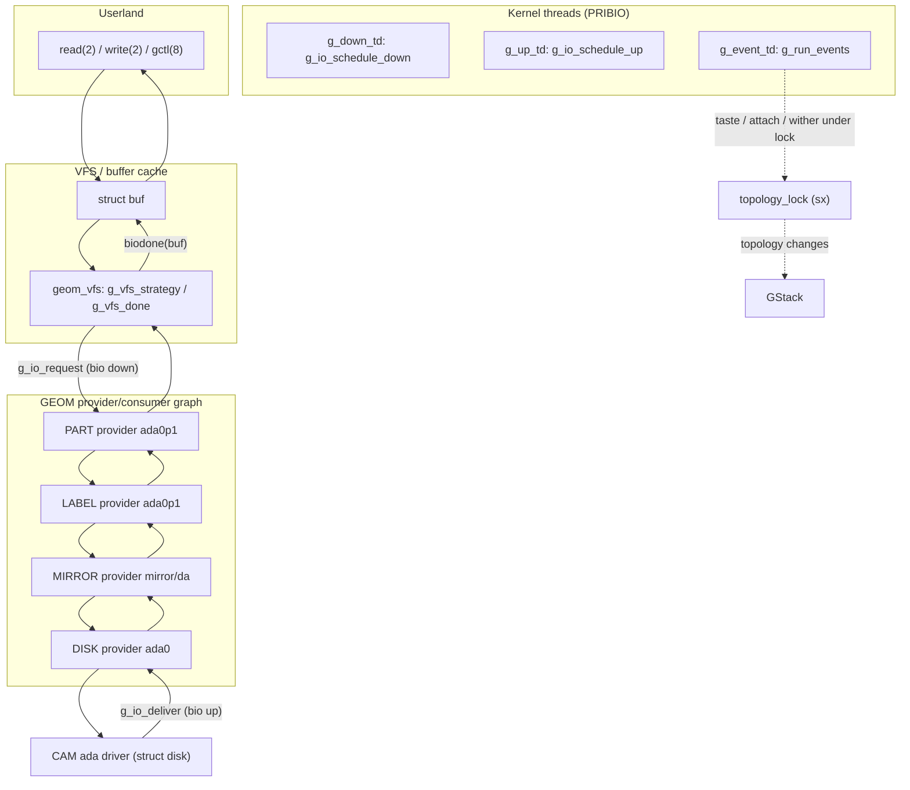

# GEOM — Storage Framework
<!-- This file is auto-generated by generate-doc.py -- do not edit manually -->

---
**Navigation:**
  **Up:** [Kernel Core — Structure and Entry Point](../README.md) ▸ [Source Tree — Layout and Conventions](../../README_internals.md)
  **Related:** [Buffer Cache — Block I/O Subsystem](../vm/README_bcache.md) | [CAM — Common Access Method Storage Stack](../cam/README.md) | [ZFS — Pooled Storage and Copy-on-Write Filesystem](../contrib/openzfs/README_freebsd.md)
  **All chapters:** [Source Tree — Layout and Conventions](../../README_internals.md) | [Boot Process — UEFI Bootloader to Kernel Handoff](../../stand/efi/loader/README.md) | [Kernel Core — Structure and Entry Point](../README.md) | [Build System — buildworld and buildkernel](../../share/mk/README.md) | [System Calls and Image Activation — Entry, sysent, and exec](../kern/README_syscall.md) | [Kernel Modules and the Linker — KLD, SYSINIT, and linker sets](../kern/README_kld.md) | [Virtual Memory Subsystem — vm_page, UMA, and Pagers](../vm/README.md) | [Process Management — Scheduling and Lifecycle](../kern/README_process.md) ...
---


## Quick Summary

[GEOM](../vm/README_bcache.md#glossary) (Geometry) is FreeBSD's stackable block-device framework. It sits between the VFS [buffer cache](../vm/README_bcache.md#glossary) (which thinks in terms of `struct buf` pages) and the physical device drivers (CAM for SCSI/SATA, ATA, and so on), and it provides a single uniform primitive — the `struct bio` — that every layer above and below it speaks. The central idea is a graph: a physical disk is exposed as a *provider*, a GEOM object that can be read from and written to; other GEOM objects *consume* providers through *consumers* and in turn produce new providers for the layer above. By chaining providers and consumers, you can stack arbitrary transformations — partitioning, disk labels, RAID, encryption, compression — on top of a raw disk without touching the driver.

A GEOM object is called a *geom*, and every geom belongs to a *class*. The class is the unit of modularity: it is a loadable kernel module that defines the transformation (for example `MIRROR` for RAID-1, `ELI` for encryption, `PART` for partitioning, `LABEL` for BSD disk labels). A class implements a small set of callbacks — most importantly `taste` (does this provider look like something I should manage?), `start` (transform and forward a [bio](../vm/README_bcache.md#glossary)), `orphan`/`spoiled` (a provider went away), and the `gctl` control-request handlers that let userland configure it. Because the class is a module, you can load, unload, and reconfigure storage behavior at runtime with `kldload` and `gctl(8)`.

Concurrency is the framework's defining constraint. GEOM uses a single global [topology lock](../netgraph/README.md#glossary), an `sx` lock called `topology_lock`, that serializes every change to the provider/consumer graph. All topology mutations — creating a geom, attaching a consumer, detaching, withering a provider — happen under that lock, so the graph is always in a consistent [state](../netpfil/pf/README.md#glossary) when any code walks it. Asynchronous topology work is funneled through a dedicated `g_event` [thread](../kern/README_process.md#glossary) that drains a queue of posted events; this keeps the I/O path free of topology bookkeeping. The I/O path itself is driven by two kernel threads, `g_up_td` and `g_down_td`, that push bios down and up the stack in FIFO order.

The bridge to the rest of the kernel is the `VFS` class in `geom_vfs.c`. When a filesystem or a [`read(2)`](../../lib/libsys/read.2)/[`write(2)`](../../lib/libsys/write.2) produces a `struct buf`, the VFS class converts it into a `struct bio` and hands it to the GEOM stack; when the bio comes back, `g_vfs_done` re-arms the buffer and completes the I/O. This is why every GEOM class, no matter how complex, can be written against the same `bio` interface: the conversion between the page-based buffer world and the block-based bio world happens exactly once, at the top of the stack.

## Architecture

GEOM's architecture is defined by four core objects — `struct g_class`, `struct g_geom`, `struct g_consumer`, and `struct g_provider` — declared in `sys/geom/geom.h` and manipulated by the subsystem routines in `sys/geom/geom_subr.c`.

**Class.** A `struct g_class` is a named set of transformation callbacks. It is the unit that gets loaded as a module. The class carries function pointers for `taste`, `ctlreq`, `create_geom`, `destroy_geom`, `config`, `access`, `orphan`, `provgone`, `dumpconf`, and `resize`; the typedefs `g_taste_t`, `g_ctl_req_t`, `g_ctl_create_geom_t`, `g_ctl_destroy_geom_t`, `g_ctl_config_geom_t`, `g_init_t`, `g_fini_t`, `g_ioctl_t`, `g_access_t`, `g_orphan_t`, `g_start_t`, `g_spoiled_t`, `g_attrchanged_t`, `g_provgone_t`, `g_dumpconf_t`, and `g_resize_t` are all declared in `sys/geom/geom.h`. A class is registered with the `DECLARE_GEOM_CLASS(cp, modname)` macro, which ties the class struct to the module name so the loader can reference it. The `taste` callback is the discovery mechanism: when a new provider appears, GEOM calls every loaded class's `taste` with the provider and a set of flags (`G_TF_NORMAL`, `G_TF_INSIST`, `G_TF_TRANSPARENT`); a class returns a new geom if it claims the provider, or NULL to pass it on.

**Geom.** A `struct g_geom` is a single instance of a class's transformation. It links its consumers (the providers it reads from) to its one provider (the device it exposes upward). A geom owns a `softc` pointer for class-private state and a `rank` that orders geoms during retaste. The per-geom callbacks `start`, `spoiled`, `attrchanged`, `orphan`, `access`, `provgone`, `dumpconf`, and `resize` override the class defaults for that particular instance.

**Consumer.** A `struct g_consumer` is the edge from a geom to the provider it consumes. It records the per-mode access counts (`acr` read, `acw` write, `ace` exclusive) and a `flags` word. A geom may have many consumers (a MIRROR geom consumes one consumer per member disk); a provider may have many consumers (a raw disk consumed by both a PART geom and a LABEL geom).

**Provider.** A `struct g_provider` is the device [node](../netgraph/README.md#glossary) a geom exposes upward. It carries the geometry — `mediasize`, `sectorsize`, `stripesize`, `stripes`, `stripeoffset`, `sectors` — plus `media`, `mode`, `state`, `physpath`, and an `error` code. The `ace` count is the number of outstanding exclusive accesses; when it and the read/write counts drop to zero, the provider may be withered.

The I/O engine is in `sys/geom/geom_io.c`. Two static queues, `g_bio_run_down` and `g_bio_run_up` (both `struct g_bioq`), hold bios in flight. `g_io_request(bp, cp)` enqueues a bio to go down, aimed at consumer `cp`; `g_io_deliver(bp, error)` enqueues a bio to come back up with a completion `error`. The `g_down_td` thread loops on `g_io_schedule_down`, popping bios from `g_bio_run_down` and calling the target provider geom's `start`; the `g_up_td` thread loops on `g_io_schedule_up`, popping bios from `g_bio_run_up` and calling the bio's `bio_done` callback. Both threads run at `PRIBIO` priority, set in `g_up_procbody` and `g_down_procbody` in `sys/geom/geom_kern.c`.

The topology engine is in `sys/geom/geom_event.c`. A single `g_event_td` thread runs `g_run_events()`, which drains a TAILQ of `struct g_event` items under `g_eventlock`. Any code that needs to change the graph posts an event with `g_post_event` (or `g_post_event_ep`/`g_post_event_x`) rather than mutating it inline; `g_waitfor_event` blocks until a named event completes. A separate TAILQ, `g_doorstep`, holds providers that still need to be tasted. `g_waitidle` blocks a thread until the event queue and the doorstep are empty, and is wired in as an AST (`ast_geom`, registered by `geom_event_init` via `ast_register(TDA_GEOM, ...)`) so that a thread that just tickled GEOM waits for the topology to settle before returning to userland.

## Key Data Structures

The I/O primitive is `struct bio`, defined in `sys/sys/bio.h`:

```c
/* sys/sys/bio.h */
struct bio {
	uint16_t bio_cmd;		/* I/O operation. */
	uint16_t bio_flags;		/* General flags. */
	uint16_t bio_cflags;		/* Private use by the consumer. */
	uint16_t bio_pflags;		/* Private use by the provider. */
	struct cdev *bio_dev;		/* Device to do I/O on. */
	struct disk *bio_disk;		/* Valid below geom_disk.c only */
	off_t	bio_offset;		/* Offset into file. */
	long	bio_bcount;		/* Number of (valid) bytes. */
	caddr_t bio_data;		/* Data. */
	long	bio_resid;		/* Remaining I/O (in bytes). */
	void	(*bio_done)(struct bio *);
	void	*bio_caller1;
	void	*bio_caller2;
	struct g_consumer *bio_from;
	struct g_provider *bio_to;
};
```

`bio_cmd` takes values `BIO_READ`, `BIO_WRITE`, `BIO_DELETE`, `BIO_GETATTR`, `BIO_FLUSH`, `BIO_CMD0`..`BIO_CMD2`, `BIO_ZONE`, and `BIO_SPEEDUP` (all in `sys/sys/bio.h`). `bio_flags` carries `BIO_ERROR`, `BIO_DONE`, `BIO_ONQUEUE`, `BIO_ORDERED`, `BIO_UNMAPPED`, `BIO_TRANSIENT_MAPPING`, `BIO_VLIST`, `BIO_SWAP`, `BIO_EXTERR`, `BIO_SPEEDUP_WRITE`, and `BIO_SPEEDUP_TRIM`. The two `bio_callerN` pointers are the reason the core stays generic: each layer stashes its own private context there without the framework knowing what it is — for instance the VFS class stores the `struct buf` in `bio_caller2` (see `g_vfs_done` in `geom_vfs.c`). `bio_from` is the consumer the bio was sent through and `bio_to` is the provider it is aimed at, so the up/down threads always know where to route it.

The topology objects are declared in `sys/geom/geom.h`:

```c
/* sys/geom/geom.h */
struct g_class {
	const char	*name;
	u_int		version;
	u_int		spare0;
	g_taste_t	*taste;
	g_ctl_req_t	*ctlreq;
	g_init_t		*init;
	g_fini_t		*fini;
	g_ctl_destroy_geom_t *destroy_geom;
	/* ... create_geom, config, access, orphan, provgone,
	 *     dumpconf, resize method pointers follow ... */
};

struct g_geom {
	const char	*name;
	struct g_class	*class;
	TAILQ_ENTRY(g_geom) geom;
	LIST_HEAD(, g_consumer) consumer;
	struct g_provider *provider;
	/* ... rank, start, spoiled, attrchanged, orphan, access,
	 *     provgone, dumpconf, resize, softc ... */
};

struct g_consumer {
	struct g_geom	*geom;
	TAILQ_ENTRY(g_consumer) consumer;
	struct g_provider *provider;
	/* ... acr, acw, ace access counts, flags ... */
};

struct g_provider {
	const char	*name;
	TAILQ_ENTRY(g_provider) provider;
	struct g_geom	*geom;
	LIST_HEAD(, g_consumer) consumers;
	/* ... ace, error, mediasize, sectorsize, stripesize,
	 *     stripes, stripeoffset, sectors, media, mode,
	 *     state, physpath ... */
};
```

The asymmetry is deliberate: a geom has *one* provider (the device it presents) but a *list* of consumers (the devices it is built from), while a provider has a *list* of consumers (everything that reads it). That is what makes the graph a tree of transformations rooted at physical disks.

The event queue [item](../netgraph/README.md#glossary) is in `sys/geom/geom_event.c`:

```c
/* sys/geom/geom_event.c */
struct g_event {
	TAILQ_ENTRY(g_event) events;
	g_event_t	*func;
	void		*arg;
	int		flag;
	void		*ref[G_N_EVENTREFS];
};

#define EV_DONE		0x80000
#define EV_WAKEUP	0x40000
#define EV_CANCELED	0x20000
#define EV_INPROGRESS	0x10000
```

The `ref[]` array is the answer to the comment at the top of `geom_event.c` ("How do we in general know that objects referenced in events have not been destroyed before we get around to handle the event?"): an event holds references to the objects it touches so they cannot be freed while the event is still queued.

The slice abstraction in `sys/geom/geom_slice.h` is the workhorse that partitioning, stripe, mirror, and concat share. It exists because those classes all do the same thing — map a linear range of the output device onto one or more underlying providers — and it factors that out so a class only implements the mapping:

```c
/* sys/geom/geom_slice.h */
struct g_slice {
	off_t	offset;
	off_t	length;
	u_int	sectorsize;
	struct	g_provider *provider;
};

struct g_slice_hot {
	off_t	offset;
	off_t	length;
	int	ract;
	int	dact;
	int	wact;
};

struct g_slicer {
	u_int			nslice;
	u_int			nprovider;
	struct g_slice		*slices;
	u_int			nhotspot;
	struct g_slice_hot	*hotspot;
	void			*softc;
	g_slice_start_t		*start;
	g_event_t		*hot;
};
```

`g_slice_new` builds a geom with `nprovider` consumers and `nslice` slices; `g_slice_config` fills in each slice's offset/length/sectorsize and the provider it maps to; and the class-supplied `start` (a `g_slice_start_t`) is called for each bio to pick the right slice. `g_slice_conf_hot` and the `g_slice_hot` records implement per-range access control (allow/deny/start/call via `G_SLICE_HOT_*`).

The disk method table in `sys/geom/geom_disk.h` is what the DISK class (and the device layer in `geom_dev.c`) uses to talk to a physical driver:

```c
/* sys/geom/geom_disk.h */
struct disk {
	struct g_geom		*d_geom;
	struct devstat		*d_devstat;
	int			d_goneflag;
	int			d_destroyed;
	disk_init_level		d_init_level;
	u_int			d_flags;
	const char		*d_name;
	u_int			d_unit;
	struct bio_queue_head	*d_queue;
	struct mtx		*d_lock;
	disk_open_t		*d_open;
	disk_close_t		*d_close;
	disk_strategy_t		*d_strategy;
	disk_ioctl_t		*d_ioctl;
	dumper_t		*d_dump;
	disk_getattr_t		*d_getattr;
	disk_gone_t		*d_gone;
	u_int			d_sectorsize;
	off_t			d_mediasize;
	u_int			d_fwsectors;
	u_int			d_fwheads;
	u_int			d_maxsize;
	off_t			d_delmaxsize;
	off_t			d_stripeoffset;
	off_t			d_stripesize;
	char			d_ident[DISK_IDENT_SIZE];
	char			d_descr[DISK_IDENT_SIZE];
	/* ... HBA vendor/device ids, d_rotation_rate, d_attachment ... */
	void			*d_drv1;
	LIST_HEAD(,disk_alias)	d_aliases;
	struct g_event		*d_cevent;
	struct g_event		*d_devent;
};
```

`disk_alloc`, `disk_create`, and `disk_destroy` (also in `geom_disk.c`) manage the allocation; `d_strategy` is the function a physical driver (e.g. the CAM `ada` driver) calls back into to actually move bytes.

## Deep Dive

### Bringing up a stack

When a physical driver attaches, it calls `disk_create`, which the DISK class turns into a `struct g_provider`. That new provider is placed on the `g_doorstep` queue, and a retaste is posted. `g_run_events` (in `geom_event.c`) takes the topology lock, pops the provider, and calls `g_retaste`, which walks every loaded class's `taste` callback in `rank` order. Each class that recognizes the provider builds a geom: it calls `g_new_geomf(cp, name)` to allocate the geom, `g_new_consumer(gp)` plus `g_attach(cp, pp)` to wire a consumer to the provider, `g_access(cp, dr, dw, de)` to take an access, and `g_new_providerf(gp, name)` to create the output provider. The canonical sequence, straight from the [`g_consumer(9)`](../../share/man/man9/g_consumer.9)/[`g_attach(9)`](../../share/man/man9/g_attach.9) man pages, is:

```c
g_topology_lock();
cp = g_new_consumer(mygeom);
if (g_attach(cp, pp) != 0) { g_destroy_consumer(cp); return; }
if (g_access(cp, 1, 0, 0) != 0) { g_detach(cp); g_destroy_consumer(cp); return; }
g_topology_unlock();
/* ... do I/O without holding the topology lock ... */
g_topology_lock();
g_access(cp, -1, 0, 0);
g_detach(cp);
g_destroy_consumer(cp);
g_topology_unlock();
```

Notice the discipline: the topology lock is held only while the graph is being rewired, and released before any I/O happens. That is the whole point of the split — topology changes are rare and serialized, I/O is frequent and parallel.

### A bio going down

When the VFS layer has a `struct buf` to write, `g_vfs_strategy` (the `bop_strategy` in the `g_vfs_bufops` table in `geom_vfs.c`) builds a `struct bio` from the buffer, records the buffer in `bio_caller2`, sets `bio_done = g_vfs_done`, and calls `g_io_request(bp, cp)` aimed at the provider the VFS opened. `g_io_request` enqueues the bio on `g_bio_run_down` and wakes `g_down_td`.

`g_io_schedule_down` pops the bio and calls the target geom's `start`. A typical `start` (the pattern shown in [`g_bio(9)`](../../share/man/man9/g_bio.9)) clones the bio, sets a private `bio_done`, rewrites the offset/length for the underlying device, and forwards it one level down:

```c
sc = bp->bio_to->geom->softc;
if (sc == NULL) { g_io_deliver(bp, ENXIO); return; }
cbp = g_clone_bio(bp);
if (cbp == NULL) { g_io_deliver(bp, ENOMEM); return; }
cbp->bio_done = g_std_done;	/* Standard 'done' function. */
g_io_request(cbp, sc->ex_consumer);
```

Each layer repeats this. A MIRROR `start` fans the bio out to every member consumer; a PART/LABEL `start` uses the slice table to translate the offset and forward to the single underlying provider; a stripe `start` splits the bio across stripes. The bio that finally reaches the DISK provider's `start` is handed to `d_strategy`, the physical driver's block routine.

### A bio coming back up

When the driver finishes, it calls `g_io_deliver(bp, error)`, which sets the `BIO_ERROR` flag (if any) and enqueues the bio on `g_bio_run_up`, waking `g_up_td`. `g_io_schedule_up` pops it and calls `bp->bio_done(bp)`. Because each layer set its own `bio_done` when it cloned the bio, the completion walks back up the exact reverse path: each `done` translates the result back into its own coordinate space and calls `g_io_deliver` on its parent, until the top-level `g_vfs_done` runs. `g_vfs_done` (in `geom_vfs.c`) updates the mount's read/write statistics, then calls `biodone(bp)` to wake whoever is waiting on the buffer. If the error is `ENXIO` the device was pulled, and `g_vfs_done` routes through `g_vfs_orphan` to wither the geom so the vnode is detached cleanly.

`g_std_done` is the generic completion used by classes that do nothing special on the way up: it just forwards the bio to its parent consumer's provider with the recorded error.

### The VFS bridge

`geom_vfs.c` registers a class named `"VFS"` with `DECLARE_GEOM_CLASS(g_vfs_class, g_vfs)` and a `buf_ops` table so the buffer cache calls back into GEOM:

```c
/* sys/geom/geom_vfs.c */
static struct buf_ops __g_vfs_bufops = {
	.bop_name =	"GEOM_VFS",
	.bop_write =	bufwrite,
	.bop_strategy =	g_vfs_strategy,
	.bop_sync =	bufsync,
	.bop_bdflush =	bufbdflush
};

static struct g_class g_vfs_class = {
	.name =		"VFS",
	.version =	G_VERSION,
	.orphan =	g_vfs_orphan,
};
DECLARE_GEOM_CLASS(g_vfs_class, g_vfs);
```

`g_vfs_open` allocates a `struct g_vfs_softc` (holding a `struct mtx`, a `struct bufobj *sc_bo`, a `struct g_event *sc_event`, and state flags `sc_active`, `sc_orphaned`, `sc_enxio_active`, `sc_enxio_reported`), creates a consumer on the VFS geom, attaches it to the target provider, and takes an access. From that point on, every buffer operation on that vnode is a bio that travels the full GEOM stack. This is the single seam between the page-oriented [`buf(9)`](../../share/man/man9/buf.9) world and the block-oriented [`g_bio(9)`](../../share/man/man9/g_bio.9) world, which is why no GEOM class below it ever sees a `struct buf`.

### Why one topology lock and one event thread

The provider/consumer graph is a shared, mutable data structure that many threads walk: the I/O threads walk it to route bios, the event thread walks it to rewire it, and userland `gctl(8)` walks it to configure it. Rather than protect every edge with a fine-grained lock (which would make walking the graph riddled with lock acquisitions and make it nearly impossible to reason about consistency), GEOM takes one global `sx` lock, `topology_lock` (declared in `sys/geom/geom_kern.c`), for the duration of any graph mutation. `g_topology_lock()` takes it exclusively and marks the current thread as holding it; `g_topology_assert()` and `g_topology_assert_not()` (macros in `geom.h`) let every function check, at debug time, whether it is being called with the lock held or not. The trade-off is that topology changes serialize — but they are rare (device hot-plug, `gctl` reconfiguration), so the cost is paid only when the graph actually changes, never on the I/O hot path.

The `g_event` thread exists for the same reason applied to time: a topology change often has to happen *later*, not now. A provider appearing in an interrupt context, a `gctl` request from userland, or a media-change notification cannot safely rewire the graph inline, because they may be running without the topology lock or in a context where sleeping is forbidden. So they post a `struct g_event` and let `g_event_td` do the real work under the lock. `g_waitfor_event` is the synchronous variant: the poster blocks until its event has run, which is how `gctl` gets a return value. The `ast_geom` AST is the safety net that guarantees a thread which triggered topology work does not race ahead of it — it calls `g_waitidle` before the thread returns to userland.

## Flow / Diagram



The solid arrows are the bio data path: down through `g_io_request` and each geom's `start`, into the driver, and back up through `g_io_deliver` and each geom's `bio_done`. The dotted arrows are the control path: the `g_event` thread performs topology changes under `topology_lock`, and those changes reshape the graph that the solid path walks.

## Advanced Notes

**Debugging with [DDB](../kern/README_kdb.md#glossary).** The `db_show_geom*` family — `db_show_geom_class`, `db_show_geom_geom`, `db_show_geom_consumer`, `db_show_geom_provider` (in `geom_subr.c`) — dumps a class, geom, consumer, or provider from the kernel debugger, which is the fastest way to see why a stack is not forming. `db_print_bio_cmd` and `db_print_bio_flags` decode a bio's command and flag words. From userland, `gctl(8)` is the live equivalent: `gctl list` walks the whole graph, and the sysctls `kern.geom.confdot`, `kern.geom.conftxt`, and `kern.geom.confxml` (implemented by `g_confdot`, `g_conftxt`, `g_confxml` in `geom_dump.c`) emit the topology in several formats. To watch I/O live, build the kernel with the `KTR` option and then set the `debug.ktr.mask` sysctl to include the `KTR_GEOM` trace-class bit (defined in `sys/sys/ktr_class.h`); `geom_io.c` guards its CTR trace points with the local `KTR_GEOM_ENABLED` macro, which is true only when both the compile-time mask (`KTR_COMPILE`) and the runtime mask (`ktr_mask`) include `KTR_GEOM`.

**Performance.** The two I/O threads are a deliberate serialization point: `g_io_schedule_down` and `g_io_schedule_up` each service their queue in FIFO order, so a slow `start` at one level can hold up the others in that direction. The comment in `geom_kern.c` notes the threads "could be part of I/O prioritization by deciding which bios/bioqs to service in what order," and that more than one thread per direction can be run. `geom_io.c` also has a `pace` variable that backs off [direct dispatch](../net/README.md#glossary) when bio allocation is failing (`nomem_count`/`pause_count` track the pressure), trading a little latency to relieve memory pressure. The `biozone` [UMA](../vm/README_bcache.md#glossary) [zone](../vm/README.md#glossary) is where bios come from, so a bio allocation failure is a real, observable condition, not just a theoretical one.

**Locking discipline and pitfalls.** The single most common GEOM bug is sleeping while holding `topology_lock` or calling a topology-mutating function from the I/O path. `g_topology_assert()` / `g_topology_assert_not()` exist precisely to catch this: a `start`/`done` handler should assert *not* holding the lock, while a `taste`/`create_geom`/`destroy_geom` handler should assert it *is* holding it. The `g_event` `ref[]` array is the other subtle trap — an event that references a geom or provider must hold a reference in `ref[]` or the object can be freed before the event runs, which is exactly the question the header comment in `geom_event.c` raises. `g_wither_geom` / `g_wither_provider` / `g_do_wither` are the sanctioned teardown path: withering posts the destruction as an event so it happens under the lock and after all in-flight bios have drained, rather than freeing a geom that a bio is still walking.

**Connecting to OS theory.** GEOM is a concrete instance of the device-driver layering and the "device-independent / device-dependent" split that textbook OS courses describe: the `struct bio` is the device-independent I/O request (analogous to the generic `bio`/`request` in the literature), and `d_strategy` is the device-dependent [hook](../netgraph/README.md#glossary). The topology lock is a textbook example of choosing a coarse lock over fine-grained locking when the protected structure is a graph that is read constantly but written rarely — the same reasoning that justifies a single global lock for a configuration database. The `g_event` thread is the standard "defer work to a dedicated thread" pattern used to keep interrupt and I/O contexts free of long critical sections, and the AST (`ast_geom`) is FreeBSD's mechanism for deferring that wait to a safe point (return to userland) rather than blocking in the middle of a system call.

## See Also
- [Buffer Cache — Block I/O Subsystem](../vm/README_bcache.md)
- [CAM — Common Access Method Storage Stack](../cam/README.md)
- [ZFS — Pooled Storage and Copy-on-Write Filesystem](../contrib/openzfs/README_freebsd.md)


- [`sys/geom/geom.h`](geom.h), [`sys/geom/geom_subr.c`](geom_subr.c), [`sys/geom/geom_io.c`](geom_io.c), [`sys/geom/geom_event.c`](geom_event.c) — the core framework: topology objects, the I/O engine, and the event thread.
- [`sys/geom/geom_dev.c`](geom_dev.c), [`sys/geom/geom_disk.c`](geom_disk.c), [`sys/geom/geom_disk.h`](geom_disk.h) — the device layer and the `struct disk` method table that physical drivers fill in.
- [`sys/geom/geom_vfs.c`](geom_vfs.c), [`sys/geom/geom_vfs.h`](geom_vfs.h) — the `struct buf` to `struct bio` bridge.
- [`sys/geom/geom_slice.c`](geom_slice.c), [`sys/geom/geom_slice.h`](geom_slice.h) — the slice abstraction shared by part, label, stripe, mirror, and concat.
- [`sys/geom/geom_ctl.c`](geom_ctl.c), [`sys/geom/geom_ctl.h`](geom_ctl.h) — the `gctl(8)` control plane (`gctl_req`, `gctl_copyin`, `gctl_copyout`, `gctl_get_param`, `gctl_set_param`).
- [`sys/geom/geom_dump.c`](geom_dump.c) — topology dumpers (`g_confdot`, `g_conftxt`, `g_confxml`) behind the `kern.geom.*` sysctls.
- Class implementations: [`sys/geom/part`](part), [`sys/geom/label`](label), [`sys/geom/mirror`](mirror), [`sys/geom/eli`](eli), [`sys/geom/stripe`](stripe), [`sys/geom/raid`](raid), [`sys/geom/cache`](cache), [`sys/geom/journal`](journal), [`sys/geom/concat`](concat), [`sys/geom/uzip`](uzip), [`sys/geom/zero`](zero).
- Man pages: [`g_bio(9)`](../../share/man/man9/g_bio.9), [`g_geom(9)`](../../share/man/man9/g_geom.9), `g_class(9)`, [`g_provider(9)`](../../share/man/man9/g_provider.9), [`g_consumer(9)`](../../share/man/man9/g_consumer.9), `g_new_geom(9)`, [`g_attach(9)`](../../share/man/man9/g_attach.9), [`g_access(9)`](../../share/man/man9/g_access.9), `g_io_request(9)`, `g_io_deliver(9)`, [`g_event(9)`](../../share/man/man9/g_event.9), [`sx(9)`](../../share/man/man9/sx.9), [`lock(9)`](../../share/man/man9/lock.9), [`buf(9)`](../../share/man/man9/buf.9), `gctl(8)`, [`disk(4)`](../../share/man/man4/disk.4).

---

> _Generated by [DaemonDocs](https://github.com/ocochard/DaemonDocs) on 2026-08-26 17:27 UTC using model `Qwen3.8-27B-UD-Q8_K_XL` (llama.cpp build `b10553-cd26896c1`). AI-generated content — verify against source before relying on it._
