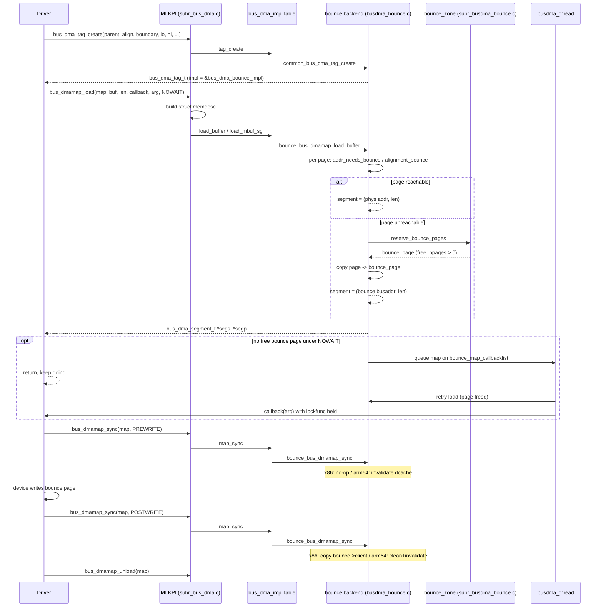

# DMA and busdma — Tags, Maps, and Bounce Buffers
<!-- This file is auto-generated by generate-doc.py -- do not edit manually -->

---
**Navigation:**
  **Up:** [Kernel Core — Structure and Entry Point](../README.md) ▸ [Source Tree — Layout and Conventions](../../README_internals.md)
  **Related:** [Device Driver Framework — newbus and devclass](README_driver.md) | [NIC Drivers — from if_vr to iflib to if_cxgbe](../dev/README_nic_drivers.md) | [mbuf — Network Buffer Allocation and Chaining](../sys/README_mbuf.md)
  **All chapters:** [Source Tree — Layout and Conventions](../../README_internals.md) | [Boot Process — UEFI Bootloader to Kernel Handoff](../../stand/efi/loader/README.md) | [Kernel Core — Structure and Entry Point](../README.md) | [Build System — buildworld and buildkernel](../../share/mk/README.md) | [System Calls and Image Activation — Entry, sysent, and exec](README_syscall.md) | [Kernel Modules and the Linker — KLD, SYSINIT, and linker sets](README_kld.md) | [Virtual Memory Subsystem — vm_page, UMA, and Pagers](../vm/README.md) | [Process Management — Scheduling and Lifecycle](README_process.md) ...
---


## Quick Summary

Direct memory access lets a device read and write kernel memory without the CPU
shuttling bytes through a register or a copy. The trouble is that the address a
device puts on the bus is not the same thing the kernel calls a "physical"
address. A 32-bit DMA engine cannot reach memory above 4 GiB; a device with a
4 KiB boundary rule cannot be pointed at a buffer that straddles a 4 KiB
boundary; and on a CPU with a write-back cache (one that defers storing a
modified line to RAM), a device write can be invisible to the core that last
touched the line. The `busdma` framework exists to hide all of that from the
driver: a driver describes what its hardware *can* address with a **[DMA tag](../dev/README_nic_drivers.md#glossary)**,
asks for a **DMA map** to hold a particular buffer, and then hands the buffer
to the device. If the buffer happens to be unreachable, the framework
transparently copies it through a **bounce buffer** in reachable memory, and a
single `bus_dmamap_sync` call at the right moments keeps the copy and the
caches correct.

The design splits cleanly into a machine-independent KPI (kernel programming
interface) and per-architecture backends. The KPI, in `sys/kern/subr_bus_dma.c`,
is the set of functions every driver calls — `bus_dma_tag_create`,
`bus_dmamap_load`, `bus_dmamap_sync` — plus the common helpers that turn an
[mbuf](../sys/README_mbuf.md#glossary) chain (the kernel's packet-data descriptor list) or a `uio` into a
scatter/gather list. The backends, one per architecture in
`sys/<arch>/<arch>/busdma_bounce.c`, make the actual decisions: does this page
need a bounce, where does the bounce page come from, and what cache maintenance
does this `sync` perform. In current FreeBSD the two are wired together through
a function-pointer table (`struct bus_dma_impl`), so the KPI never has to know
which backend a given tag uses.

The payoff is portability and safety. A network driver written once can run on
an x86 machine where a 32-bit NIC must bounce everything above 4 GiB, and on an
arm64 machine where the same NIC is direct but the CPU is not cache-coherent,
without the driver author writing a single `if (__arm64__)`. The driver just
follows the discipline: create the tag from the bus's tag, load the buffer,
`sync` before and after each transfer, and unload when done. Everything else —
the address-width math, the bounce page pool, the deferred-load [thread](README_process.md#glossary), the
cache flushes — is busdma's job.

## Architecture

The framework has three layers, and the most important recent change is how the
bottom two are connected.

**The KPI layer** (`sys/kern/subr_bus_dma.c`) is machine-independent. It defines
the public functions drivers call and the common load helpers. It does *not*
know how to map a buffer; it only knows how to describe the request. The central
abstraction it uses is `struct memdesc` (`sys/sys/memdesc.h`), a tagged union
that says *what* the caller wants to load: a contiguous virtual address
(`MEMDESC_VADDR`), a physical address (`MEMDESC_PADDR`), a scatter/gather list
of either (`MEMDESC_VLIST`/`MEMDESC_PLIST`), a `uio` (`MEMDESC_UIO`), an mbuf
chain (`MEMDESC_MBUF`), or an array of `vm_page` (`MEMDESC_VMPAGES`). A load
request is really just a `memdesc` plus a `bus_dmamap_t`.

**The dispatch layer** is the function-pointer table. `bus_dma_tag_t` and
`bus_dmamap_t` are opaque pointers (`typedef struct bus_dma_tag *bus_dma_tag_t`
in `sys/sys/_bus_dma.h`). Every backend embeds a shared prefix,
`struct bus_dma_tag_common`, whose first field is a pointer to a
`struct bus_dma_impl` table of function pointers (`map_create`, `load_buffer`,
`map_sync`, ...). The public KPI functions are thin inline wrappers that deref
that pointer and call through the table. On x86 and arm64 the wrappers live in
`sys/x86/include/bus_dma.h` and `sys/arm64/include/bus_dma.h` respectively; the
table type is in `sys/x86/include/busdma_impl.h` /
`sys/arm64/include/bus_dma_impl.h`. This is why the KPI in `subr_bus_dma.c` can
stay stable while the bounce backend, the IOMMU backend, and any future backend
plug in different behavior — the tag chooses its backend once, at
`bus_dma_tag_create` time, and every map made from that tag dispatches to it.

**The backend layer** is per-architecture. The bounce backend
(`bus_dma_bounce_impl`, defined in `sys/<arch>/<arch>/busdma_bounce.c`) is the
default and the one this chapter focuses on. It owns the bounce page pool, the
per-page bounce decision, and the architecture-specific `sync`. The IOMMU
backend (`bus_dma_iommu_*`, `sys/dev/iommu/`) is an alternative that programs a
translation engine so a device can address the full physical space without
bouncing; `bus_dma_tag_set_domain` is the [hook](../netgraph/README.md#glossary) that moves a tag into that world.
We keep the IOMMU to a single paragraph here: it exists precisely to remove the
need to bounce, which is the clearest proof of *why* bouncing happens in the
first place — a device's addressable window is smaller than the machine's RAM.

The shared bounce machinery (the page pool, the deferred-load thread, the
accounting) lives in `sys/kern/subr_busdma_bounce.c`. Its header comment states
the contract: it "currently assumes it can access internal members of opaque
types like `bus_dma_tag_t` and `bus_dmamap`" and so is `#include`d into each
backend rather than compiled standalone. That is the price of the impl-table
design — the backend and the shared code are one translation unit per arch — but
it lets the shared code reach into `struct bus_dmamap` without a second layer of
accessors.

## Key Data Structures

The shared tag prefix and the dispatch table are identical on x86 and arm64
(`sys/x86/include/busdma_impl.h`, mirrored in
`sys/arm64/include/bus_dma_impl.h`):

```c
struct bus_dma_tag_common {
	struct bus_dma_impl *impl;
	bus_size_t	  alignment;
	bus_addr_t	  boundary;
	bus_addr_t	  lowaddr;
	bus_addr_t	  highaddr;
	bus_size_t	  maxsize;
	u_int		  nsegments;
	bus_size_t	  maxsegsz;
	int		  flags;
	bus_dma_lock_t	 *lockfunc;
	void		 *lockfuncarg;
	int		  domain;
};

struct bus_dma_impl {
	int (*tag_create)(bus_dma_tag_t parent,
	    bus_size_t alignment, bus_addr_t boundary, bus_addr_t lowaddr,
	    bus_addr_t highaddr, bus_size_t maxsize, int nsegments,
	    bus_size_t maxsegsz, int flags, bus_dma_lock_t *lockfunc,
	    void *lockfuncarg, bus_dma_tag_t *dmat);
	int (*tag_destroy)(bus_dma_tag_t dmat);
	int (*tag_set_domain)(bus_dma_tag_t);
	bool (*id_mapped)(bus_dma_tag_t, vm_paddr_t, bus_size_t);
	int (*map_create)(bus_dma_tag_t dmat, int flags, bus_dmamap_t *mapp);
	int (*map_destroy)(bus_dma_tag_t dmat, bus_dmamap_t map);
	int (*mem_alloc)(bus_dma_tag_t dmat, void** vaddr, int flags,
	    bus_dmamap_t *mapp);
	void (*mem_free)(bus_dma_tag_t dmat, void *vaddr, bus_dmamap_t map);
	int (*load_ma)(bus_dma_tag_t dmat, bus_dmamap_t map,
	    struct vm_page **ma, bus_size_t tlen, int ma_offs, int flags,
	    bus_dma_segment_t *segs, int *segp);
	int (*load_phys)(bus_dma_tag_t dmat, bus_dmamap_t map,
	    vm_paddr_t buf, bus_size_t buflen, int flags,
	    bus_dma_segment_t *segs, int *segp);
	int (*load_buffer)(bus_dma_tag_t dmat, bus_dmamap_t map,
	    void *buf, bus_size_t buflen, struct pmap *pmap, int flags,
	    bus_dma_segment_t *segs, int *segp);
	void (*map_waitok)(bus_dma_tag_t dmat, bus_dmamap_t map,
	    struct memdesc *mem, bus_dmamap_callback_t *callback,
	    void *callback_arg);
	bus_dma_segment_t *(*map_complete)(bus_dma_tag_t dmat, bus_dmamap_t map,
	    bus_dma_segment_t *segs, int nsegs, int error);
	void (*map_unload)(bus_dma_tag_t dmat, bus_dmamap_t map);
	void (*map_sync)(bus_dma_tag_t dmat, bus_dmamap_t map,
	    bus_dmasync_op_t op);
#ifdef KMSAN
	void (*load_kmsan)(bus_dmamap_t map, struct memdesc *mem);
#endif
};
```

The tag's constraint fields are the whole story of "what can this device
address". `alignment` is the required alignment of every segment's bus address;
`boundary` is the size of the region a single segment must not straddle (0 means
no boundary rule); `lowaddr`/`highaddr` is the address window, i.e. the
address-width limit — a 32-bit device has `highaddr` of `0xffffffff`;
`maxsize` is the largest single transfer; `nsegments` is the maximum number of
scatter/gather segments the device's [descriptor ring](../dev/README_nic_drivers.md#glossary) can hold; `maxsegsz` is the
largest single segment. `common_bus_dma_tag_create` (in the per-arch machdep —
`sys/x86/x86/busdma_machdep.c` on x86, `sys/arm64/arm64/busdma_machdep.c` on
arm64) enforces the invariants up front — `boundary` must be at least `maxsegsz`,
and `maxsegsz` must be non-zero — and normalizes `lowaddr`/`highaddr` to page
boundaries:

```c
	/* Basic sanity checking */
	if (boundary != 0 && boundary < maxsegsz)
		maxsegsz = boundary;
	if (maxsegsz == 0)
		return (EINVAL);
	...
	common->lowaddr = trunc_page((vm_paddr_t)lowaddr) + (PAGE_SIZE - 1);
	common->highaddr = trunc_page((vm_paddr_t)highaddr) + (PAGE_SIZE - 1);
```

The backend then extends the shared prefix. On x86
(`sys/x86/x86/busdma_bounce.c`):

```c
struct bus_dma_tag {
	struct bus_dma_tag_common common;
	int			map_count;
	int			bounce_flags;
	bus_dma_segment_t	*segments;
	struct bounce_zone	*bounce_zone;
};
```

`map_count` tracks how many live maps the tag has (so `bus_dma_tag_destroy`
can refuse with `EBUSY` while any remain); `bounce_flags` is the backend's
private bit field (`BUS_DMA_COULD_BOUNCE`, `BUS_DMA_FORCE_MAP`, ...);
`segments` is the per-tag preallocated scatter/gather array that a load fills
in; and `bounce_zone` links the tag to its pool of bounce pages. arm64's tag
(`sys/arm64/arm64/busdma_bounce.c`) adds `alloc_size` and `alloc_alignment` for
its `bus_dmamem_alloc` path.

The map is the per-buffer instance. x86's `struct bus_dmamap`:

```c
struct bus_dmamap {
	STAILQ_HEAD(, bounce_page) bpages;
	int		       pagesneeded;
	int		       pagesreserved;
	bus_dma_tag_t	       dmat;
	struct memdesc	       mem;
	bus_dmamap_callback_t *callback;
	void		      *callback_arg;
	__sbintime_t	       queued_time;
	STAILQ_ENTRY(bus_dmamap) links;
#ifdef KMSAN
	struct memdesc	       kmsan_mem;
#endif
};
```

`bpages` is the list of bounce pages this map is currently using; `pagesneeded`
and `pagesreserved` are the high-water mark and the committed reservation of
bounce pages (so a deferred load can be retried later without re-counting);
`mem` is the `memdesc` of whatever was last loaded; `callback`/`callback_arg`
and `queued_time`/`links` are the deferred-load machinery. arm64's map adds the
cache-coherency [state](../netpfil/pf/README.md#glossary) that the sync path needs:

```c
	u_int			flags;
#define	DMAMAP_COHERENT		(1 << 0)
#define	DMAMAP_FROM_DMAMEM	(1 << 1)
#define	DMAMAP_MBUF		(1 << 2)
	int			sync_count;
	...
	struct sync_list	slist[];
```

The flexible array `slist[]` is the reason the arm64 map is sized per-load: it
records, one entry per non-coherent segment, the virtual address, physical
address, starting page, and length that `bus_dmamap_sync` must run cache
maintenance over. x86, being coherent, needs no such list and keeps the map a
fixed size.

The bounce page and its pool are the heart of the bounce mechanism, shared in
`sys/kern/subr_busdma_bounce.c`. A `bounce_page` pairs one page of reachable
memory with the slice of client data that was copied into it:

```c
struct bounce_page {
	char		*vaddr;		/* kva of bounce buffer */
	bus_addr_t	busaddr;	/* Physical address */
	char		*datavaddr;	/* kva of client data */
#if defined(__amd64__) || defined(__i386__)
	vm_page_t	datapage[2];	/* physical page(s) of client data */
#else
	vm_page_t	datapage;	/* physical page of client data */
#endif
	vm_offset_t	dataoffs;	/* page offset of client data */
	bus_size_t	datacount;	/* client data count */
	STAILQ_ENTRY(bounce_page) links;
};

struct bounce_zone {
	STAILQ_ENTRY(bounce_zone) links;
	STAILQ_HEAD(, bounce_page) bounce_page_list;
	STAILQ_HEAD(, bus_dmamap) bounce_map_waitinglist;
	int		total_bpages;
	int		free_bpages;
	int		reserved_bpages;
	int		active_bpages;
	int		total_bounced;
	int		total_deferred;
	int		map_count;
#ifdef dmat_domain
	int		domain;
#endif
	sbintime_t	total_deferred_time;
	bus_size_t	alignment;
	bus_addr_t	lowaddr;
	char		zoneid[8];
	char		lowaddrid[20];
};
```

The [zone](../vm/README.md#glossary) exists to make bounce allocation O(1) and bounded. Instead of calling
`vm_page_alloc` on every transfer — slow, and unbounded under load — each tag
draws from a per-zone freelist (`bounce_page_list`) capped by the global
`MAX_BPAGES` (8192 on amd64, 512 on small i386 machines, 4096 on arm64). The
`total_bounced`/`total_deferred` counters and the per-zone sysctl tree are what
make a bouncing system debuggable from userspace.

Finally, the scatter/gather element a load produces is a `bus_dma_segment_t`:
a pair of fields, `ds_addr` (the device bus address of the segment) and
`ds_len` (its length), exercised throughout `sys/kern/subr_memdesc.c`. It is
the unit a device's descriptor ring consumes — a sequence of `(ds_addr, ds_len)`
pairs.

## Deep Dive

### Creating a tag

`bus_dma_tag_create` is the public entry; it delegates to the backend's
`tag_create`, which for the bounce backend funnels into
`common_bus_dma_tag_create`. That function (shown above) is where the tag is
actually built. Both arches build it the same way in their per-arch machdep —
`sys/x86/x86/busdma_machdep.c` on x86 and `sys/arm64/arm64/busdma_machdep.c` on
arm64 — where `common_bus_dma_tag_create` sets `common->impl` to
`&bus_dma_bounce_impl`, runs the sanity checks, `malloc`s the tag, and merges
the parent's constraints before the bounce backend extends the prefix. Two
details matter. First, it inherits constraints from the *parent* tag — the one
you pass in, normally `bus_get_dma_tag(dev)` — taking the intersection of the
address windows and the stricter boundary, so a driver's tag can only be
*narrower* than the bus it sits on:

```c
	/* Take into account any restrictions imposed by our parent tag */
	if (parent != NULL) {
		common->impl = parent->impl;
		common->lowaddr = MIN(parent->lowaddr, common->lowaddr);
		common->highaddr = MAX(parent->highaddr, common->highaddr);
		if (common->boundary == 0)
			common->boundary = parent->boundary;
		else if (parent->boundary != 0) {
			common->boundary = MIN(parent->boundary,
			    common->boundary);
		}
		common->domain = parent->domain;
	}
```

Second, it picks the backend. In the bounce path `common->impl` is set to
`&bus_dma_bounce_impl` before the parent merge, and a parent (an IOMMU tag, for
example) can override it. The `lockfunc`/`lockfuncarg` pair is the driver's
promise to lock its own state whenever busdma needs to touch it asynchronously;
if the driver passes `NULL`, busdma installs `_busdma_dflt_lock`, which
`panic`s — a deliberate tripwire, because a tag whose maps can be deferred *must*
provide a lock:

```c
void
_busdma_dflt_lock(void *arg, bus_dma_lock_op_t op)
{
	panic("driver error: _bus_dma_dflt_lock called");
}
```

### Loading a buffer

A load is a three-stage pipeline that the KPI and the backend split. The KPI
normalizes the request into a `memdesc` and, for the list-based helpers, walks
the list. `_bus_dmamap_load_vlist` (in `sys/kern/subr_bus_dma.c`) is the
representative: it iterates the caller's virtual-address scatter/gather list and
folds each range into the backend's `load_buffer` one at a time:

```c
static int
_bus_dmamap_load_vlist(bus_dma_tag_t dmat, bus_dmamap_t map,
    bus_dma_segment_t *list, int sglist_cnt, struct pmap *pmap, int *nsegs,
    int flags, size_t offset, size_t length)
{
	int error;

	error = 0;
	for (; sglist_cnt > 0 && length != 0; sglist_cnt--, list++) {
		char *addr;
		size_t ds_len;

		KASSERT((offset < list->ds_len),
		    ("Invalid mid-segment offset"));
		addr = (char *)(uintptr_t)list->ds_addr + offset;
		ds_len = list->ds_len - offset;
		offset = 0;
		if (ds_len > length)
			ds_len = length;
		length -= ds_len;
		KASSERT((ds_len != 0), ("Segment length is zero"));
		error = _bus_dmamap_load_buffer(dmat, map, addr, ds_len, pmap,
		    flags, NULL, nsegs);
		if (error)
			break;
	}
	return (error);
}
```

The backend's `load_buffer` (the bounce backend's `bounce_bus_dmamap_load_buffer`)
then does the real work, page by page. For each page of the buffer it asks,
"can this device address this page directly?" That is the bounce decision, made
by `addr_needs_bounce` (is the page's physical address above `highaddr`?),
`alignment_bounce` (does the segment's bus address meet `alignment`?), and
`cacheline_bounce` (does the segment respect `boundary`?). If the answer is no,
the backend takes a `bounce_page` from the zone, copies the page's data into it,
and records a `bounce_page` entry pointing at the client data. If the answer is
yes, it records the page's own physical address. Either way the result is a
`bus_dma_segment_t` — `ds_addr` is the *bus* address the device should use (the
bounce page's address, or the page's physical address), and `ds_len` is how much
of it. The segments are accumulated into `map->dmat`'s preallocated `segments`
array and the count is returned to the caller via `*segp`.

The load can also *defer*. `bus_dmamap_load` takes a `flags` argument that is
either `BUS_DMA_WAITOK` (0x00, "safe to sleep") or `BUS_DMA_NOWAIT` (0x01, "not
safe to sleep"), the two values defined at the top of `sys/sys/bus_dma.h`. A
load that must bounce but is called `NOWAIT` (the common case, because it is
usually called from an interrupt) first reserves bounce pages with
`_bus_dmamap_reserve_pages` (in `sys/kern/subr_busdma_bounce.c`):

```c
static int
_bus_dmamap_reserve_pages(bus_dma_tag_t dmat, bus_dmamap_t map, int flags)
{
	struct bounce_zone *bz;

	/* Reserve Necessary Bounce Pages */
	mtx_lock(&bounce_lock);
	if (flags & BUS_DMA_NOWAIT) {
		if (reserve_bounce_pages(dmat, map, 0) != 0) {
			map->pagesneeded = 0;
			mtx_unlock(&bounce_lock);
			return (ENOMEM);
		}
	} else {
		...
```

If no free bounce page is available under `NOWAIT`, the load does not fail the
transfer. It queues the map on the global `bounce_map_callbacklist` (linked via
the map's `links` field, stamped with `queued_time`) and returns control to the
driver. A dedicated kernel thread, `busdma_thread`, is woken whenever a bounce
page frees up; it walks the waiting list, retries the load, and when one finally
succeeds it calls the driver's `callback` with the driver's `lockfunc` held so
the driver can safely program its hardware. This is the "callback model for
deferred loads": the driver never blocks, and it never has to know that the
transfer was delayed.

### Synchronizing: making the copy and the cache correct

`bus_dmamap_sync` is the function that turns a loaded map into a *correct*
transfer. The public wrapper dispatches through the impl table:

```c
static inline void
bus_dmamap_sync(bus_dma_tag_t dmat, bus_dmamap_t map, bus_dmasync_op_t op)
{
	struct bus_dma_tag_common *tc;

	if (map != NULL) {
		tc = (struct bus_dma_tag_common *)dmat;
		tc->impl->map_sync(dmat, map, op);
	}
}
```

The `op` is one of four operations, named from the *device's* point of view:
`BUS_DMA_PREREAD` and `BUS_DMA_POSTREAD` bracket a transfer in which the device
*reads* the buffer (host to device), and `BUS_DMA_PREWRITE` and `BUS_DMA_POSTWRITE`
bracket one in which the device *writes* the buffer (device to host). They are enumerated in `bus_dmasync_op_t`
(`sys/sys/bus_dma.h`); the driver picks the pair that matches the transfer
direction.

The bounce backend's `bounce_bus_dmamap_sync` does two different jobs depending
on architecture, and this is the crux of the chapter.

**On x86 (cache-coherent), sync is what performs the bounce copy.** x86 is
write-back coherent, so a device write is always visible to the CPU and no cache
maintenance is needed. But a *bounced* transfer still needs the data moved
between the client buffer (high memory) and the bounce page (low memory), and
that copy is driven by the sync calls:

- A host-to-device transfer (device READ): the CPU has filled the client buffer.
  `BUS_DMA_PREREAD` copies client → bounce so the device, which can only reach
  the bounce page, reads the right bytes. `BUS_DMA_POSTREAD` is a no-op.
- A device-to-host transfer (device WRITE): the device writes the bounce page.
  `BUS_DMA_PREWRITE` is a no-op; `BUS_DMA_POSTWRITE` copies bounce → client so
  the CPU sees the result.

This answers the "why must even a cache-coherent x86 driver call
`bus_dmamap_sync`" question: because the sync is the hook that performs the
bounce copy. The driver cannot cheaply tell whether a given load was bounced, so
it calls `sync` unconditionally; when the map is direct (no bounce), the call
degenerates to a cheap no-op.

**On arm64 (not cache-coherent), sync also maintains the dcache.** The same four
calls additionally run cache operations over the map's `slist[]` entries (the
`struct sync_list` array, one per non-coherent segment). `PREWRITE` invalidates
the dcache so a stale line does not later overwrite the device's write;
`POSTWRITE` cleans and invalidates so the CPU reads fresh data from RAM; the
READ-side ops clean/invalidate symmetrically. The map's `DMAMAP_COHERENT` flag
lets the backend skip the cache work when a map is known to be coherent (for
example, memory allocated by `bus_dmamem_alloc` that the backend marked
coherent). So the *same* driver source, calling the *same* four `sync` operations
in the *same* order, gets a bounce copy on x86 and a bounce copy plus a cache
flush on arm64 — the difference is entirely inside `bounce_bus_dmamap_sync`.

### The mbuf and uio helpers

Network and character drivers rarely call `bus_dmamap_load` on a raw buffer;
they call the typed helpers, all in `sys/kern/subr_bus_dma.c`.
`bus_dmamap_load_mbuf_sg` is the one a NIC uses. It walks the mbuf chain (the
mbuf structure itself is covered in the mbuf chapter — here it is just a source
of data pages), maps each mbuf's data into the map, and returns a
`bus_dma_segment_t` list — one segment per mbuf data page that the device can
reach directly, or per bounce page where it cannot. That list is exactly the
shape a scatter/gather NIC's descriptor ring wants: a sequence of
`(ds_addr, ds_len)` pairs the hardware walks to assemble or disassemble the
packet without the CPU touching it. `bus_dmamap_load_mbuf` is the non-scatter
variant that returns a single bus address (for devices with no S/G engine), and
`bus_dmamap_load_uio` does the equivalent for a `uio`, which is what character
and block drivers use to DMA directly to a user buffer. All three build a
`memdesc` (`memdesc_mbuf` / `memdesc_uio`) and fall through to the same backend
`load_*` path, so the bounce and sync behavior is identical.

## Flow / Diagram



## Advanced Notes

**Observing bouncing from userspace.** The bounce backend exports a sysctl
tree under `hw.busdma` (the `SYSCTL_NODE(_hw, OID_AUTO, busdma, ...)` in each
`busdma_bounce.c`, plus the per-zone `sysctl_tree`/`sysctl_tree_top` in
`struct bounce_zone`). `hw.busdma.total_bpages` reports the global pool size
(the `SYSCTL_INT(_hw_busdma, OID_AUTO, total_bpages, ...)` in
`sys/kern/subr_busdma_bounce.c`), and each zone exposes `total_bounced` and
`total_deferred`. A healthy 64-bit system with 64-bit devices shows near-zero
`total_bounced`; a 32-bit NIC on a machine with more than 4 GiB of RAM will show
it climbing with traffic. That counter, not a code trace, is usually the first
thing you look at when a DMA driver is "slow" — the cost is the copy, and the
copy is what the counter measures.

**The deferred-load race is the one to respect.** The whole point of the
callback model is that the driver's `callback` can run in `busdma_thread`, not
in the thread that called `bus_dmamap_load`. That is why the tag's `lockfunc`
exists and why `_busdma_dflt_lock` panics: if a driver passes `NULL` but its
maps can be deferred, the callback will dereference driver state with no lock
held. The discipline is: any tag whose maps may be loaded `NOWAIT` (i.e. almost
any tag used from an interrupt) must pass a real `lockfunc`/`lockfuncarg`, and
the driver must take that lock around every access to the state the callback
touches — including the `callback_arg` buffer the driver passed in.

**Coherency is a property of the map, not the architecture.** The arm64
`DMAMAP_COHERENT` flag shows that "this architecture is non-coherent" is not the
same as "this map needs a flush." Memory returned by `bus_dmamem_alloc` can be
allocated in a region the backend marks coherent, in which case `sync` skips the
cache work even on arm64. The inverse holds on x86: the architecture is
coherent, but a *bounced* map still needs the copy, so `sync` is not a no-op
there. Treat `bus_dmamap_sync` as "make this map consistent for this
direction," never as "flush the cache."

**Why `boundary` and `maxsegsz` are coupled.** `common_bus_dma_tag_create`
clamps `maxsegsz` down to `boundary` when `boundary` is smaller. The reason is
that a segment longer than the boundary would, by definition, be allowed to
straddle the boundary the device forbids; the only consistent resolution is to
shrink the maximum segment so the invariant "no segment crosses a boundary" is
always satisfiable. If your device has a 4 KiB boundary and you ask for
`maxsegsz` of 64 KiB, the tag quietly caps the segment at 4 KiB and the load
will produce more, smaller segments — which is correct, but worth knowing when a
driver's descriptor count suddenly doubles.

**Textbook connection.** The tag/map/bounce split is the operating-system
generalization of the IOMMU's job done in software. A textbook IOMMU
(Tanenbaum and Bos, *Modern Operating Systems*; also the device-driver
treatment in the FreeBSD Device Drivers chapter) gives the device a translation
engine so it can use a compact, contiguous "bus address space" that the
hardware maps onto scattered physical pages — eliminating both the address-width
limit and the need to copy. busdma's bounce backend is what you get when there is
no such engine: the kernel itself performs the translation, and when the
translation is impossible (address out of range) it performs a copy instead. The
IOMMU backend in `sys/dev/iommu/` is the point where the two meet: it programs
the real engine and turns `addr_needs_bounce` off, which is why an IOMMU-equipped
machine stops bouncing. The `sync` operation, meanwhile, is the software shadow
of the hardware cache-coherency protocol: on a coherent interconnect the
protocol is in the silicon and `sync` is free; on a non-coherent one the kernel
must issue the invalidate/clean instructions itself, which is exactly what
`bounce_bus_dmamap_sync` does over the `slist[]`.

**Pitfalls.** (1) Loading the same map twice without an intervening
`bus_dmamap_unload` is a bug — the map holds the previous load's `memdesc` and
bounce pages. (2) Forgetting `POSTWRITE` after a device-to-host transfer means
the CPU reads stale data on non-coherent hardware and, on a bounce, never copies
the bounce page back. (3) Sizing `nsegments` too small makes a load of a large
mbuf chain fail with `ENOSPC` even though the total `maxsize` is fine — the
constraint that binds is often the segment count, not the byte count. (4) Using
`BUS_DMA_NOWAIT` from a context that *can* sleep throws away the ability to
defer and turns a transient bounce-page shortage into a hard `ENOMEM`; prefer
`WAITOK` outside interrupts.

## See Also
- [Device Driver Framework — newbus and devclass](README_driver.md)
- [NIC Drivers — from if_vr to iflib to if_cxgbe](../dev/README_nic_drivers.md)
- [mbuf — Network Buffer Allocation and Chaining](../sys/README_mbuf.md)


- [`bus_dma(9)`](../../share/man/man9/bus_dma.9) — the full KPI reference, including every `bus_dmamap_load_*`
  variant and the sync operation semantics.
- [`mbuf(9)`](../../share/man/man9/mbuf.9) — the mbuf structure that `bus_dmamap_load_mbuf_sg` consumes; see
  the mbuf chapter for the chain layout.
- Source: [`sys/kern/subr_bus_dma.c`](subr_bus_dma.c) (MI KPI and load helpers),
  `sys/kern/subr_busdma_bounce.c` (shared bounce pool and deferred thread),
  `sys/x86/x86/busdma_bounce.c` and `sys/arm64/arm64/busdma_bounce.c` (per-arch
  bounce backends), `sys/x86/x86/busdma_machdep.c` and
  `sys/arm64/arm64/busdma_machdep.c` (tag creation),
  `sys/x86/include/busdma_impl.h` / `sys/arm64/include/bus_dma_impl.h` (the
  impl table), `sys/sys/bus_dma.h` and `sys/sys/_bus_dma.h` (types and flags),
  `sys/dev/iommu/` (the IOMMU backend that removes the need to bounce).

---

> _Generated by [DaemonDocs](https://github.com/ocochard/DaemonDocs) on 2026-08-28 22:49 UTC using model `Qwen3.8-27B-Q8_0` (llama.cpp build `b10553-cd26896c1`). AI-generated content — verify against source before relying on it._
