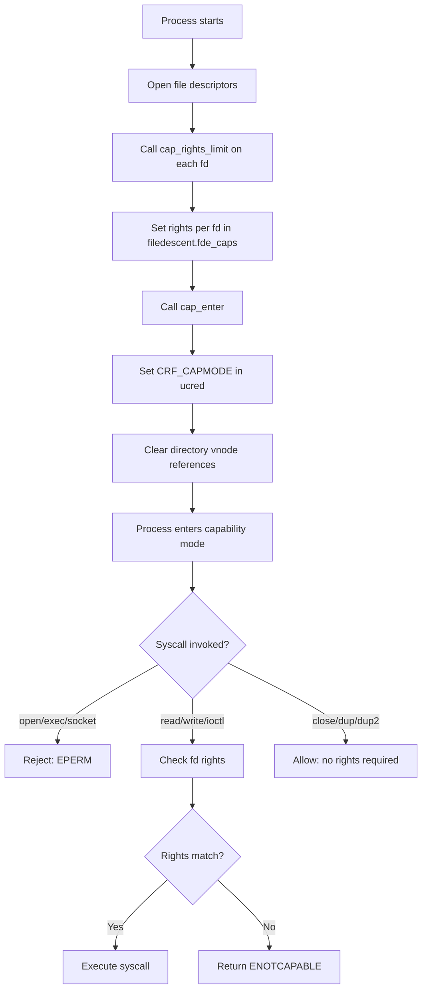

# Capsicum — Capability Mode and Sandboxing
<!-- This file is auto-generated by generate-doc.py -- do not edit manually -->

---
**Navigation:**
  **Up:** [Kernel Core — Structure and Entry Point](../README.md) ▸ [Source Tree — Layout and Conventions](../../README_internals.md)
  **Related:** [Process Management — Scheduling and Lifecycle](README_process.md) | [VFS — Virtual File System Layer](../fs/README.md) | [Jails — OS-level Isolation](README_jail.md)
  **All chapters:** [Source Tree — Layout and Conventions](../../README_internals.md) | [Boot Process — UEFI Bootloader to Kernel Handoff](../../stand/efi/loader/README.md) | [Kernel Core — Structure and Entry Point](../README.md) | [Build System — buildworld and buildkernel](../../share/mk/README.md) | [Virtual Memory Subsystem — vm_page, UMA, and Pagers](../vm/README.md) | [Process Management — Scheduling and Lifecycle](README_process.md) | [Locking Primitives — Mutexes, sx, rmlocks, and Atomics](README_locking.md) | [Buffer Cache — Block I/O Subsystem](../vm/README_bcache.md) ...
---


> ⚠ **UNVERIFIED DRAFT** — reviewer did not explicitly approve this draft. Treat claims as suspect until manually reviewed.


## Quick Summary

Capsicum is FreeBSD's capability-based security framework, implemented as two complementary mechanisms: capability mode and capability rights. Capability mode allows a process to enter a restricted execution state via the `cap_enter(2)` system call, at which point it loses the ability to open new files, create new file descriptors that reference global namespace objects, and perform most other operations that could grant access to new resources. Capability rights provide fine-grained per-file-descriptor restrictions, where each open file descriptor carries a bitmask of allowed operations — read, write, mmap, ioctl, and so on. Together, these mechanisms enable a "capability-style" sandbox in which a process can operate using only the resources explicitly delegated to it.

The framework was designed by Robert Watson and Jonathan Anderson at the University of Cambridge Computer Laboratory and the FreeBSD Foundation, with support from Google. It draws inspiration from the historic Capability-based security model, but adapts it to the Unix file descriptor paradigm: instead of replacing the entire process credential model, Capsicum wraps existing file descriptors with additional rights constraints. This approach means that existing programs can be incrementally adapted to run in capability mode — a process opens its needed files, calls `cap_rights_limit()` to restrict each descriptor, calls `cap_enter()` to enter the sandbox, and then proceeds with its work under the enforced restrictions.

Capsicum operates at the syscall entry layer in the kernel. Every system call that operates on a file descriptor checks the descriptor's rights mask against the operation being performed. If the process is in capability mode, additional restrictions apply: the process cannot open new files, cannot use most directory-related operations, and is limited to a carefully audited subset of system calls. The framework is orthogonal to jails — jails partition the system across multiple processes using the traditional Unix credential model, while Capsicum sandboxes individual processes using capability-based delegation. It is also distinct from MAC (Mandatory Access Control), which operates on the credential and label model; Capsicum operates on per-file-descriptor rights that are set by the process itself.

The practical impact of Capsicum is visible in several FreeBSD userland components. The DHCP client (`dhclient`), the packet capture tool (`tcpdump`), and the terminal emulator (`xterm`) have all been adapted to run in capability mode. These programs typically restructure their initialization into two distinct phases. In the first phase, before capability mode is enabled, the program performs standard Unix initialization: it sets up signal handlers, parses command-line arguments, opens necessary configuration files, creates network sockets, and binds to required interfaces or devices. It then calls `cap_rights_limit()` on each opened file descriptor to explicitly grant only the necessary rights (e.g., `CAP_READ` and `CAP_WRITE` for log files, `CAP_READ` and `CAP_MMAP_R` for memory-mapped shared libraries, `CAP_ACCEPT` and `CAP_CONNECT` for network sockets). Only after all resources are opened and rights are tightly scoped does the program call `cap_enter()`. In the second phase, the program's main event loop runs entirely under capability mode, interacting exclusively with the pre-delegated file descriptors. This architectural split ensures that even if an attacker exploits a vulnerability in the program's network parsing or I/O handling logic during the main loop, the damage is strictly confined to the specific resources that were explicitly delegated to the process.

## Architecture

Capsicum's enforcement occurs at the syscall entry layer. The kernel tracks two separate pieces of state for capability-based sandboxing:

1. **Capability mode flag** — stored in the process's `ucred` structure (`cr_flags` field, specifically the `CRF_CAPMODE` flag). When set, the process is in capability mode and additional restrictions apply. The flag is set by `sys_cap_enter()` in `sys/kern/sys_capability.c`.

2. **Per-file-descriptor rights** — stored in the `filecaps` structure within each `filedescent` entry of the file descriptor table. The rights are a 128-bit bitmask (stored as two 64-bit values) defined in `sys/sys/caprights.h`.

The syscall entry layer checks both pieces of state. When a process in capability mode invokes a system call, the kernel first checks whether the syscall itself is permitted in capability mode (using the `CAPENABLED` flags defined in `syscalls.master`). Then, for syscalls that operate on file descriptors, the kernel checks the rights mask on each referenced descriptor using `cap_check()` (defined in `sys/kern/sys_capability.c`).

The rights checks are per-file-descriptor rather than per-syscall because the capability model's security guarantee is about *what operations can be performed on which resources*, not about what operations a process can invoke. A process might have a file descriptor for a log file that only needs write access, and a socket that only needs read access. By encoding the allowed operations in the file descriptor itself, the kernel can enforce a fine-grained policy without requiring the process to track which rights apply to which descriptor.

The enforcement chain works as follows:

1. `sys_cap_enter()` sets `CRF_CAPMODE` on the process credential and clears the credential's directory vnode references, preventing future directory operations.
2. When a process calls `cap_rights_limit(fd, &rights)`, the kernel looks up the `filedescent` for that fd and stores the rights in `fde_caps.fc_rights`.
3. At syscall entry, `cap_check()` is called with the descriptor's rights and the required rights for the operation.
4. If the check fails, the syscall returns `ENOTCAPABLE`.

The `syscalls.master` file uses `CAPENABLED` flags to mark which syscalls are permitted in capability mode. This is a coarse-grained filter that prevents processes in capability mode from invoking syscalls that could grant access to new resources (such as `open()`, `socket()`). The fine-grained filtering of operations on existing descriptors is handled by the per-fd rights checks.

## Key Data Structures

The core data structures for Capsicum are defined in `sys/sys/caprights.h`, `sys/sys/capsicum.h`, and `sys/sys/filedesc.h`.

### `struct cap_rights`

Defined in `sys/sys/caprights.h`:

```c
struct cap_rights {
	uint64_t	cr_rights[CAP_RIGHTS_VERSION + 2];
};
```

The rights array holds 128 bits of capability rights (two 64-bit values for version 0). Each right is encoded as a 64-bit value where the upper bits contain the right index and the lower bits contain the bit position. This encoding packs the right index and bit into a single 64-bit value, allowing efficient bitwise operations for rights checking. The top bits of the first element of the array encode the version and array length, as documented in `sys/sys/caprights.h`.

### `struct filecaps`

Defined in `sys/sys/filedesc.h`:

```c
struct filecaps {
	cap_rights_t	 fc_rights;	/* per-descriptor capability rights */
	u_long		*fc_ioctls;	/* per-descriptor allowed ioctls */
	int16_t		 fc_nioctls;	/* fc_ioctls array size */
	uint32_t	 fc_fcntls;	/* per-descriptor allowed fcntls */
};
```

The `filecaps` structure stores the capability rights, ioctl restrictions, and fcntl restrictions for a single file descriptor. The `fc_ioctls` field is a dynamically allocated array of ioctl codes that are permitted on the descriptor; if it is NULL, no ioctls are permitted. The `fc_fcntls` field is a bitmask of allowed fcntl commands.

### `struct filedescent`

Defined in `sys/sys/filedesc.h`:

```c
struct filedescent {
	struct file	*fde_file;	/* file structure for open file */
	struct filecaps	 fde_caps;	/* per-descriptor rights */
	uint8_t		 fde_flags;	/* per-process open file flags */
	seqc_t		 fde_seqc;	/* keep file and caps in sync */
};
```

The `filedescent` structure represents a single entry in the file descriptor table. It contains a pointer to the underlying `file` structure (the kernel's abstraction for an open file), the `filecaps` structure with the descriptor's rights, flags indicating properties like `O_CLOEXEC`, and a sequence counter (`fde_seqc`) used for concurrency control. The sequence counter ensures that readers of the file descriptor table can observe a consistent snapshot of the file pointer and its rights.

The header also defines convenience macros:

```c
#define	fde_rights	fde_caps.fc_rights
#define	fde_fcntls	fde_caps.fc_fcntls
#define	fde_ioctls	fde_caps.fc_ioctls
#define	fde_nioctls	fde_caps.fc_nioctls
```

### `struct filedesc`

Defined in `sys/sys/filedesc.h`, the file descriptor table is managed through `struct filedesc`, which contains a pointer to a `fdescenttbl` (the array of file descriptors) and associated metadata. The `fdescenttbl` structure is defined as:

```c
struct fdescenttbl {
	int	fdt_nfiles;		/* number of open files allocated */
	struct	filedescent fdt_ofiles[0];	/* open files */
};
```

The file descriptor table is allocated from an SMR (Safe Multi-Reader) zone and may be shared by multiple processes (e.g., after process duplication).

### `struct pwd`

The `pwd` (process working directory) structure is also part of the file descriptor management and is relevant for capability mode, since capability mode drops the process's ability to access directory namespaces:

```c
struct pwd {
	u_int		pwd_refcount;
	struct	vnode	*pwd_cdir;	/* current directory */
	struct	vnode	*pwd_rdir;	/* root directory */
	struct	vnode	*pwd_jdir;	/* jail root directory */
	struct	vnode	*pwd_adir;	/* abi root directory */
};
```

When a process enters capability mode, the credential's directory vnode references are cleared, preventing future directory operations.

## Deep Dive

### Entering Capability Mode: `sys_cap_enter()`

The `sys_cap_enter()` function in `sys/kern/sys_capability.c` is the entry point for capability mode. It performs the following steps:

1. **Check for re-entry**: If the process is already in capability mode, the call is a no-op. This is important because programs may call `cap_enter()` at a point where they are unsure whether they have already entered capability mode.

2. **Clone the credential**: The function clones the process's `ucred` structure. The new credential has `CRF_CAPMODE` set and the directory vnode references (`pwd_cdir`, `pwd_rdir`, etc.) are cleared. This prevents the process from performing any directory-related operations after entering capability mode, since directory operations require access to the global namespace.

3. **Drop credential references**: The old credential's reference count is decremented, and the new credential replaces the process's active credential.

The key insight here is that capability mode works by *removing* the process's ability to access the global namespace, rather than by adding explicit grants. The process can still use the file descriptors it already has open, but it cannot open new files or perform operations that would grant access to new resources.

### Rights Checking: `cap_check()`

The `cap_check()` function in `sys/kern/sys_capability.c` performs the rights check for a given file descriptor:

```c
int
cap_check(struct file *fp, cap_rights_t *rights, cap_rights_t *req)
{
	...
}
```

The function takes the `file` structure for the descriptor, the descriptor's rights, and the required rights for the operation. It checks whether the descriptor's rights contain all of the required rights using a bitwise AND operation. If the check fails, it returns `ENOTCAPABLE`.

The function performs a bitwise AND operation to check whether the descriptor's rights contain the required rights. For operations that require more complex checking (such as ioctl or fcntl), the kernel calls `cap_ioctl_check()` or `cap_fcntl_check()` respectively.

### Per-FD Rights Checking in `kern_descrip.c`

The file descriptor management code in `sys/kern/kern_descrip.c` integrates Capsicum checks into the file descriptor operations. When a process opens a file, the `fdalloc()` function allocates a new `filedescent` entry. This happens during the pre-capability-mode initialization phase, when the process still has full permissions. The rights limiting happens after opening but before entering capability mode, via `cap_rights_limit()`.

The `fget()` function retrieves a file pointer from a file descriptor number. In capability mode, `fget_cap()` is used instead, which performs the rights check at the same time as the lookup. This ensures that rights checking is performed atomically with the file descriptor lookup, preventing race conditions.

### Rights Limiting: `cap_rights_limit()`

The `cap_rights_limit()` system call allows a process to set the rights mask for a specific file descriptor. The function in `sys/kern/sys_capability.c` performs the following steps:

1. Look up the `filedescent` for the given fd.
2. Validate the rights argument (checking the version field and ensuring the rights are well-formed).
3. Store the rights in `fde_caps.fc_rights`.
4. For ioctls and fcntls, additional validation is performed to ensure that the ioctl codes and fcntl commands are within valid ranges.

### The `cap_rights` Array Encoding

The rights array in `struct cap_rights` uses a compact encoding to store up to 128 rights (2 × 64-bit values) in a small structure. The top two bits of the first element encode the version and array length. The next five bits encode the index of the right within the array. This encoding allows the kernel to validate the rights structure quickly and ensures that rights checks are efficient.

Each right is encoded as a 64-bit value where the upper bits contain the index and the lower bits contain the bit position. This allows rights to be compared using simple bitwise operations.

## Flow / Diagram



## Advanced Notes

### Debugging with DTrace

Capsicum does not define custom DTrace SDT probes (such as `syscall:::entry` or `syscall:::return`). Debugging capability mode transitions and rights checks relies on the standard syscall DTrace framework (e.g., `syscall::cap_enter:entry`, `syscall::cap_rights_limit:entry`) and the `kern.trap_enotcap` sysctl.

For tracking rights check failures, the `trap_enotcap` sysctl (`kern.trap_enotcap`) can be enabled to deliver `SIGTRAP` instead of returning `ENOTCAPABLE`. This makes it easier to debug rights check failures in a debugger, as the process will stop at the point of failure rather than silently continuing with an error return.

```dtrace
syscall::cap_enter:entry
{
    printf("PID %d (%s) entering capability mode\n", pid, execname);
}

syscall::cap_rights_limit:entry
{
    printf("PID %d (%s) limiting fd %d\n", pid, execname, arg0);
}

syscall::read:entry /execname == "myprogram"/
{
    printf("PID %d (%s) read on fd %d\n", pid, execname, arg0);
}
```

### Performance Implications

The straightforward bitwise nature of `cap_check()` means that rights checking adds minimal overhead to syscall execution in the common case. The kernel performs a simple bitwise AND operation to check whether the descriptor's rights contain the required rights. For operations that require more complex checking (ioctl, fcntl), the overhead is slightly higher due to the additional lookup and validation steps.

The `seqc_t` (sequence counter) in `filedescent` adds a small amount of overhead to file descriptor operations, as the kernel must update the sequence counter when the file pointer or rights are modified. However, this overhead is necessary to ensure that readers of the file descriptor table can observe a consistent snapshot.

### Common Pitfalls

1. **Forgetting to limit rights**: A common mistake is to enter capability mode without first limiting the rights on each file descriptor. This results in all operations on those descriptors failing with `ENOTCAPABLE`. The correct pattern is to open all needed files, limit their rights, and then enter capability mode.

2. **Rights inheritance on duplication**: When a file descriptor is duplicated, the new descriptor inherits the rights of the original descriptor. This is important to remember when writing programs that need to share file descriptors across threads or processes.

3. **Rights on sockets**: Socket file descriptors have their own set of rights (`CAP_ACCEPT`, `CAP_BIND`, `CAP_CONNECT`, `CAP_LISTEN`, etc.). When limiting rights on a socket, it is important to include all the rights that the program needs for network operations.

4. **Capabilities and process execution**: A process in capability mode cannot execute new programs. This means that capability-mode programs must be self-contained and cannot spawn new processes. If a program needs to execute a new program, it must do so before entering capability mode.

5. **Capabilities and mmap**: The `mmap()` syscall has its own set of rights (`CAP_MMAP`, `CAP_MMAP_R`, `CAP_MMAP_W`, `CAP_MMAP_X`, etc.). When limiting rights on a file descriptor that will be memory-mapped, it is important to include the appropriate mmap rights.

### Connection to OS Theory

Capsicum implements a capability-based security model, which is a fundamental concept in operating system security theory. In a capability system, access to resources is granted through unforgeable tokens (capabilities) that specify what operations can be performed on the resource. FreeBSD's implementation adapts this model to the Unix file descriptor paradigm, where existing file descriptors are wrapped with additional rights constraints.

The key insight of capability-based security is that it eliminates the need for global namespace lookups. In traditional Unix systems, processes access resources through path names that are resolved through the global filesystem namespace. This creates a security problem: if a process has access to a directory, it can potentially access any file in that directory and its subdirectories. Capsicum eliminates this problem by removing the process's ability to access the global namespace and requiring it to use only the file descriptors that were explicitly delegated to it.

The per-file-descriptor rights model is also related to the principle of least privilege: each file descriptor is granted only the minimum set of rights needed for the operation. This limits the damage that can be done if an attacker exploits a vulnerability in the process.

## Comparison

### Linux: Namespaces and seccomp

Linux does not have a direct equivalent to Capsicum's capability mode. Instead, Linux uses a combination of namespaces (for resource partitioning) and seccomp-bpf (for syscall filtering) to achieve similar security goals. Namespaces isolate resources such as the filesystem, network, and process tree, but they do not provide per-file-descriptor rights constraints. seccomp-bpf allows a process to filter syscalls using a BPF program, but this is a coarse-grained mechanism that operates at the syscall level rather than the per-fd level.

The key structural difference is that Capsicum operates at the file descriptor level, where each descriptor carries its own rights mask. Linux's approach of using namespaces and seccomp-bpf operates at a higher level, isolating entire resource domains rather than individual file descriptors. This means that Capsicum can provide finer-grained control over what operations can be performed on each resource, while Linux's approach is more coarse-grained but easier to configure.

### macOS/XNU: Seatbelt

macOS/XNU includes a capability-based sandbox called Seatbelt, which is implemented as part of the XNU kernel. Seatbelt uses a policy language to define sandbox policies and enforces them through the Mach exception mechanism. Unlike Capsicum, which operates at the file descriptor level, Seatbelt operates at the Mach port and syscall level. This means that Seatbelt can enforce policies on inter-process communication through Mach ports, while Capsicum focuses on file descriptor rights.

### NetBSD/OpenBSD: Capsicum-like mechanisms

NetBSD and OpenBSD do not have a direct equivalent to Capsicum. OpenBSD includes two mechanisms for restricting process capabilities: the `pledge()` system call, which restricts the syscalls a process can invoke, and the `unveil()` system call, which restricts filesystem access. These mechanisms are similar in spirit to Capsicum but operate at a different level: they restrict the syscalls or filesystem paths that a process can access rather than the rights on individual file descriptors. NetBSD does not have direct equivalents to these mechanisms.

### FreeBSD vs. Other Systems: Architectural Differences

FreeBSD's implementation of Capsicum is unique in that it operates at the file descriptor level, where each descriptor carries its own rights mask. This is different from Linux's approach of using namespaces and seccomp-bpf, macOS's Seatbelt policy language, and OpenBSD's `pledge()`/`unveil()` mechanisms.

The key advantage of FreeBSD's approach is that it provides fine-grained control over what operations can be performed on each resource, without requiring the process to track which rights apply to which descriptor. The key disadvantage is that it requires programs to be explicitly adapted to run in capability mode, which can be a significant engineering effort for large programs.

## See Also
- [Jails — OS-level Isolation](README_jail.md)
- [Process Management — Scheduling and Lifecycle](README_process.md)
- [VFS — Virtual File System Layer](../fs/README.md)


- `sys/kern/sys_capability.c` — Core implementation of capability mode and rights checking
- `sys/sys/capsicum.h` — Capability rights definitions and inline check functions
- `sys/sys/caprights.h` — `struct cap_rights` definition and rights array encoding
- `sys/sys/filedesc.h` — `struct filedesc`, `struct filedescent`, and `struct filecaps` definitions
- `sys/kern/kern_descrip.c` — File descriptor management with Capsicum integration
- `sys/kern/kern_prot.c` — Process credential management (`ucred` structure)
- `security/audit/` — Audit integration for Capsicum events
- FreeBSD Handbook, Chapter 16: Security — Overview of Capsicum and other security mechanisms
- FreeBSD man pages: `cap_enter(2)`, `cap_rights_limit(2)`, `cap_fcntl_check(2)`, `cap_ioctl_check(2)`

---

> _Generated by [DaemonDocs](https://github.com/ocochard/DaemonDocs) on 2026-04-30 22:51 UTC using model `Qwen3.6-35B-A3B-UD-Q4_K_XL` (llama.cpp build `b8985-27aef3dd9`). AI-generated content — verify against source before relying on it._
