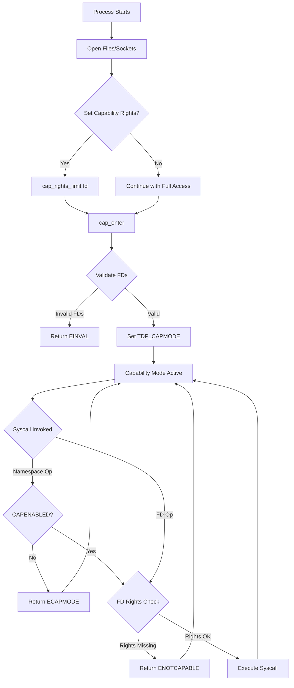
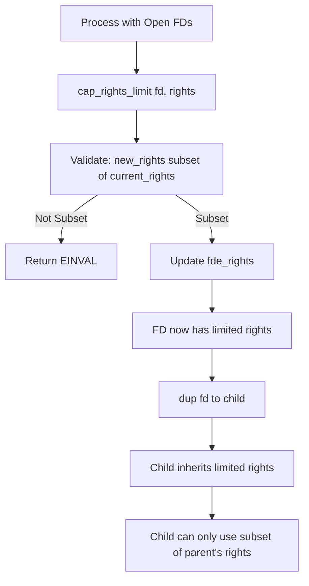

# Capsicum — Capability Mode and Sandboxing
<!-- This file is auto-generated by generate-doc.py -- do not edit manually -->

---
**Navigation:**
  **Related:** [Process Management — Scheduling and Lifecycle](README_process.md) | [VFS — Virtual File System Layer](../fs/README.md) | [Jails — OS-level Isolation](README_jail.md)
  **All chapters:** [Source Tree — Layout and Conventions](../../README_internals.md) | [Boot Process — UEFI Bootloader to Kernel Handoff](../../stand/efi/loader/README.md) | [Kernel Core — Structure and Entry Point](../README.md) | [Build System — buildworld and buildkernel](../../share/mk/README.md) | [Virtual Memory Subsystem — vm_page, UMA, and Pagers](../vm/README.md) | [Process Management — Scheduling and Lifecycle](README_process.md) | [Locking Primitives — Mutexes, sx, rmlocks, and Atomics](README_locking.md) | [Buffer Cache — Block I/O Subsystem](../vm/README_bcache.md) ...
---


> ⚠ **UNVERIFIED DRAFT** — revisions regressed; kept revision 2 (6/7 criteria) over revision 3 (5/7); reviewer did not explicitly approve this draft. Treat claims as suspect until manually reviewed.


## Quick Summary

Capsicum is FreeBSD's capability-based security framework, implemented as an optional kernel feature enabled by the `CAPABILITY_MODE` option. It provides two complementary mechanisms: capability mode, which restricts a process's ability to access global kernel namespaces, and capability rights, which limit what operations can be performed on individual file descriptors. Together, these allow processes to run in a sandboxed environment where they can only use resources that have been explicitly delegated to them.

Capability mode is entered via the `cap_enter(2)` system call, after which the process loses the ability to open new files, create new file descriptors through namespace operations, and perform other actions that would grant access to resources not already held. The process is left with only a restricted set of "capability-mode-clean" system calls that operate exclusively on existing file descriptors. This design follows the principle of least privilege: once a process has opened the files and sockets it needs, it can transition into capability mode and be guaranteed that no further network or filesystem access is possible without explicit delegation.

Capability rights provide fine-grained control over individual file descriptors. Each open file descriptor can be assigned a rights mask specifying which operations are permitted — for example, read-only access, write-only access, or the ability to perform `ioctl()` with specific commands. Rights can only be reduced, never expanded, following the principle of monotonicity. This means a process can delegate a subset of its own rights to another process (via `dup()` or `sendmsg()` with file descriptor passing) without risk of the delegate gaining more access than the delegator had.

Capsicum is orthogonal to FreeBSD's jail subsystem. Jairs partition the system at the process-group level, providing coarse-grained isolation suitable for running untrusted services in separate environments. Capsicum operates at the individual process level, providing fine-grained control suitable for sandboxing within a single process or across a process hierarchy. The two mechanisms are designed to be used together: a jail provides the outer boundary, while capability mode provides inner protection within each process.

## Architecture

Capsicum is implemented primarily in `sys/kern/sys_capability.c`, with data structures and declarations in `sys/sys/capsicum.h` and `sys/sys/caprights.h`. The file descriptor subsystem in `sys/kern/kern_descrip.c` and `sys/sys/filedesc.h` integrates capability rights into the core file descriptor management.

The architecture has two enforcement points. First, capability mode is enforced at the syscall entry layer: system calls are marked with `CAPENABLED` flags in `syscalls.master`, and the kernel checks whether a process is in capability mode before allowing namespace-affecting operations. When a process in capability mode attempts an unauthorized syscall, it receives `ECAPMODE` (errno 94). Second, capability rights are enforced per-file-descriptor: before each operation on a file descriptor, the kernel checks that the descriptor's rights mask includes the required right, returning `ENOTCAPABLE` (errno 93) if not.

The enforcement is per-file-descriptor rather than per-syscall because capability rights are stored on the `filedescent` structure, which represents the per-process view of an open file. When a file is duplicated via `dup()` or `dup2()`, the new descriptor can have a different rights mask than the original, allowing fine-grained delegation. This design means that even within a single syscall, different file descriptors can have different access levels.

The `filedesc` structure in `sys/sys/filedesc.h` contains a pointer to an `fdescenttbl`, which is an array of `filedescent` structures. Each `filedescent` contains a `filecaps` structure with the rights mask, allowed ioctls, and allowed fcntl commands. The `seqc_t` field provides synchronization between the file pointer and the rights, ensuring that concurrent operations see consistent state.

```c
struct filecaps {
	cap_rights_t	 fc_rights;	/* per-descriptor capability rights */
	u_long		*fc_ioctls;	/* per-descriptor allowed ioctls */
	int16_t		 fc_nioctls;	/* fc_ioctls array size */
	uint32_t	 fc_fcntls;	/* per-descriptor allowed fcntls */
};

struct filedescent {
	struct file	*fde_file;	/* file structure for open file */
	struct filecaps	 fde_caps;	/* per-descriptor rights */
	uint8_t		 fde_flags;	/* per-process open file flags */
	seqc_t		 fde_seqc;	/* keep file and caps in sync */
};
```

The capability mode flag is stored in the process flags (`p_flag`), specifically the `TDP_CAPMODE` flag on the `proc` structure. When `sys_cap_enter()` is called, the kernel validates that the process has no open file descriptors that would allow escape (such as network sockets without appropriate rights), sets `TDP_CAPMODE`, and transitions the process into capability mode.

Syscall auditing for capability mode is performed by checking the `CAPENABLED` flag in the syscall table. System calls that are safe to use in capability mode (such as `read()`, `write()`, `close()`, and `fcntl()` with appropriate rights) are marked as enabled. Calls that would grant access to the global namespace (such as `open()`, `socket()`, `pipe()`, and `unlink()`) are not enabled, causing them to fail with `ECAPMODE` when invoked by a capability-mode process.

A sysctl variable `kern.trap_enotcap` controls whether capability violations deliver `SIGTRAP` to the process. This is useful for debugging: when set, a process that violates capability mode or rights will receive a signal rather than simply receiving an error code, making it easier to trace the source of the violation.

```c
bool __read_frequently trap_enotcap;
SYSCTL_BOOL(_kern, OID_AUTO, trap_enotcap, CTLFLAG_RWTUN, &trap_enotcap, 0,
    "Deliver SIGTRAP on ECAPMODE and ENOTCAPABLE");
```

## Key Data Structures

### `struct cap_rights`

Defined in `sys/sys/caprights.h`, this structure holds a rights array that can encode up to 64 rights (across two 64-bit words). The encoding uses a variable-length format where the top bits of the first element indicate the number of elements in the array.

```c
struct cap_rights {
	uint64_t	cr_rights[CAP_RIGHTS_VERSION + 2];
};
```

Rights are encoded using the `CAPRIGHT(idx, bit)` macro, defined in `sys/sys/capsicum.h`, which maps a right index and bit position to a 64-bit value:

```c
#define	CAPRIGHT(idx, bit)	((1ULL << (57 + (idx))) | (bit))
```

This encoding allows rights to be stored compactly while supporting up to 64 different right types across the two array elements. Helper macros such as `cap_rights_init()` and `cap_rights_limit()` provide convenient ways to manipulate rights arrays in user code.

### `struct filecaps`

Defined in `sys/sys/filedesc.h`, this structure is embedded in each `filedescent` and holds the capability rights for a file descriptor:

```c
struct filecaps {
	cap_rights_t	 fc_rights;	/* per-descriptor capability rights */
	u_long		*fc_ioctls;	/* per-descriptor allowed ioctls */
	int16_t		 fc_nioctls;	/* fc_ioctls array size */
	uint32_t	 fc_fcntls;	/* per-descriptor allowed fcntls */
};
```

The `fc_rights` field holds the capability rights bitmask. The `fc_ioctls` field is a dynamically allocated array of allowed `ioctl()` commands, and `fc_fcntls` holds allowed `fcntl()` commands as a bitmask. Memory for `filecaps` structures is allocated from the `M_FILECAPS` malloc type, defined in `sys/kern/kern_descrip.c`:

```c
MALLOC_DEFINE(M_FILECAPS, "filecaps", "descriptor capabilities");
```

### `struct filedescent`

This structure represents a per-process entry in the file descriptor table:

```c
struct filedescent {
	struct file	*fde_file;	/* file structure for open file */
	struct filecaps	 fde_caps;	/* per-descriptor rights */
	uint8_t		 fde_flags;	/* per-process open file flags */
	seqc_t		 fde_seqc;	/* keep file and caps in sync */
};
```

Convenience macros provide direct access to capability fields:

```c
#define	fde_rights	fde_caps.fc_rights
#define	fde_fcntls	fde_caps.fc_fcntls
#define	fde_ioctls	fde_caps.fc_ioctls
#define	fde_nioctls	fde_caps.fc_nioctls
```

The `fde_seqc` field is a sequence counter used to ensure that concurrent operations on the file descriptor see consistent state between the file pointer and the rights.

### Capability Mode Process Flag

When a process enters capability mode, the `TDP_CAPMODE` flag is set in the process's `p_flag` field. This flag is checked by the capability enforcement code to determine whether namespace operations are permitted. The flag is set by `sys_cap_enter()` and cannot be cleared except when the process exits or execs a new binary (capability mode is not preserved across `execve()`).

## Deep Dive

### Entering Capability Mode: `sys_cap_enter()`

The `sys_cap_enter()` system call, defined in `sys/kern/sys_capability.c`, is the entry point for capability mode. It performs several validation steps before allowing the process to transition:

1. **Check for existing capability mode**: The function verifies that the process is not already in capability mode, returning `EINVAL` if it is.

2. **Validate file descriptors**: The kernel checks all open file descriptors to ensure they have appropriate rights. File descriptors that would allow escape from the sandbox (such as network sockets without `CAP_ACCEPT` or `CAP_CONNECT` rights) cause the call to fail.

3. **Set the capability mode flag**: After validation, the kernel sets `TDP_CAPMODE` on the process, preventing further namespace operations.

The key validation logic ensures that a process cannot enter capability mode with file descriptors that would allow it to regain namespace access. For example, a network socket without `CAP_ACCEPT` rights would prevent entry, because accepting a connection could provide access to a new file descriptor with broader capabilities.

### Capability Rights Checking

The core capability checking is performed by `_cap_check()` in `sys/kern/sys_capability.c`. This function is called before operations on file descriptors to verify that the required rights are present. The function checks whether the file descriptor has any rights set at all. If no rights are set (the rights mask is empty), the descriptor is treated as having no restrictions, and the operation is allowed. This preserves backward compatibility: file descriptors that have not been explicitly restricted continue to work as before.

If rights are set, the function checks whether the required rights are present in the descriptor's rights mask. The inline version, `cap_check_inline()`, is defined in `sys/sys/capsicum.h` for performance-critical paths.

### Capability Rights Operations

Capsicum provides several system calls for managing capability rights:

- **`cap_rights_limit(fd, rights)`**: Reduces the rights on a file descriptor to the specified subset. Rights can only be reduced, never expanded. This is the primary mechanism for delegating limited access to other processes.

- **`__cap_rights_get(fd, rights)`**: Retrieves the current rights on a file descriptor.

The rights limiting operation is performed by `sys_cap_rights_limit()` in `sys/kern/sys_capability.c`. It validates that the new rights are a subset of the current rights, then updates the `filecaps` structure with the reduced rights mask.

### Per-Operation Rights

Capsicum defines rights for specific operations, such as `cap_read_rights`, `cap_write_rights`, `cap_accept_rights`, etc. These are declared as external constants in `sys/sys/caprights.h` and defined in `sys/kern/subr_capability.c`:

```c
extern const cap_rights_t cap_accept_rights;
extern const cap_rights_t cap_bind_rights;
extern const cap_rights_t cap_connect_rights;
extern const cap_rights_t cap_event_rights;
extern const cap_rights_t cap_fchdir_rights;
extern const cap_rights_t cap_fchflags_rights;
extern const cap_rights_t cap_fchmod_rights;
extern const cap_rights_t cap_fchown_rights;
extern const cap_rights_t cap_fchroot_rights;
extern const cap_rights_t cap_fcntl_rights;
extern const cap_rights_t cap_fexecve_rights;
extern const cap_rights_t cap_flock_rights;
extern const cap_rights_t cap_fpathconf_rights;
extern const cap_rights_t cap_fstat_rights;
extern const cap_rights_t cap_fstatfs_rights;
extern const cap_rights_t cap_fsync_rights;
extern const cap_rights_t cap_ftruncate_rights;
extern const cap_rights_t cap_futimes_rights;
```

These predefined rights masks are used by the syscall auditing code to determine whether a given syscall is permitted on a file descriptor with the given rights.

### Capability Mode and Syscall Auditing

System calls permitted in capability mode are marked with `CAPENABLED` in `syscalls.master`. The build system generates a syscall table that includes this information. When a process in capability mode invokes a syscall, the kernel checks whether the syscall is enabled. If not, the syscall fails with `ECAPMODE`.

Some syscalls have conditional behavior in capability mode. For example, `shm_open()` is limited to creating anonymous (unnamed) shared memory objects in capability mode, preventing access to the filesystem namespace for finding existing shared memory objects. Similarly, `openat()` is limited to operations on already-open directories, preventing the creation of new file descriptors through namespace traversal.

## Real-World Consumer Restructuring

To run in capability mode, an application must be "capability-mode-clean" — meaning it must be able to perform all its necessary work using only the file descriptors it already holds and the capability-mode-clean system calls. This requires restructuring how the application initializes and manages its resources.

The typical pattern for a capability-mode-clean application follows these steps:

1. **Initialize before entering capability mode**: The application performs all namespace-affecting operations (opening files, creating sockets, etc.) while still in normal mode.

2. **Limit rights on each file descriptor**: After opening a file descriptor, the application calls `cap_rights_limit()` to reduce its rights to only what is needed for that descriptor's purpose.

3. **Enter capability mode**: Once all file descriptors have been opened and their rights limited, the application calls `cap_enter()` to transition into capability mode.

4. **Perform work using only capability-mode-clean calls**: After entering capability mode, the application can only use system calls that operate on existing file descriptors with appropriate rights.

### Example: tcpdump

The `tcpdump` utility is a well-known capability-mode-clean application. Here is how it restructures itself:

```
Normal mode:
  1. Open the network interface (e.g., pfmon0)
  2. Set pcap options (snapshot length, promiscuous mode)
  3. Call cap_rights_limit(fd, &cap_read_rights)  -- only need to read
  4. Call cap_enter()  -- enter capability mode

Capability mode:
  5. Loop: read() packets from the interface fd
  6. Process and print packets
  7. Close the fd when done
```

The key insight is that `tcpdump` opens the interface once, limits its rights to read-only, and then enters capability mode. After that, it can only read from the interface — it cannot open new files, create new sockets, or access the filesystem at all. This means that even if `tcpdump` is compromised after entering capability mode, the attacker cannot use it to read other files, open network connections, or modify the system.

### Example: dhclient

The `dhclient` utility, which obtains IP addresses from DHCP servers, follows a similar pattern:

```
Normal mode:
  1. Open raw socket for DHCP
  2. Open lease file for writing
  3. Call cap_rights_limit(socket_fd, &cap_recv_rights | cap_send_rights)
  4. Call cap_rights_limit(lease_fd, &cap_write_rights)
  5. Call cap_enter()  -- enter capability mode

Capability mode:
  6. Send DHCPDISCOVER on socket
  7. Receive DHCPOFFER on socket
  8. Write lease information to lease file
  9. Send DHCPREQUEST on socket
  10. Receive DHCPACK on socket
  11. Write updated lease to file
```

`dhclient` must be capability-mode-clean because it runs with elevated privileges and needs to be sandboxed against privilege escalation. By limiting the socket to only send/receive DHCP packets and the lease file to only write, the application ensures that even if compromised, it cannot read arbitrary files or open arbitrary network connections.

### Common Restructuring Patterns

Applications that are not originally designed for capability mode often need the following changes:

- **Defer opening resources**: Instead of opening a file at the start of `main()`, open it only when needed, then immediately limit its rights.

- **Separate initialization from main loop**: Split the application into an initialization phase (normal mode) and a processing phase (capability mode).

- **Avoid global state with file descriptors**: File descriptors should be managed locally and limited as soon as they are opened, rather than stored in global variables that might be used later.

- **Handle errors from `cap_rights_limit()`**: Always check the return value of `cap_rights_limit()` — if it fails, the application cannot enter capability mode and may need to handle this gracefully.

## Flow / Diagram





## Advanced Notes

### Debugging with DTrace

Capsicum provides several opportunities for DTrace instrumentation. The `trap_enotcap` sysctl (`kern.trap_enotcap`) can be set to deliver `SIGTRAP` on capability violations, making it easier to trace the source of violations using a debugger or DTrace. When enabled, any syscall that violates capability mode or rights will cause the process to receive `SIGTRAP`, allowing developers to set breakpoints on the signal handler to inspect the call stack.

DTrace syscall probes provide visibility into capability mode transitions and rights modifications. For example:

```d
syscall::cap_enter:entry
{
    printf("PID %d entering capability mode
", pid);
}

syscall::cap_rights_limit:entry
{
    printf("PID %d limiting fd %d
", pid, arg0);
}
```

The `kern.trap_enotcap` sysctl is particularly useful for development: setting it to 1 causes capability violations to deliver `SIGTRAP` rather than simply returning an error code. This makes it possible to use debuggers like `gdb` to trace the source of violations, which is valuable when porting applications to capability mode.

### Performance Implications

Capability rights checking is performed inline for performance-critical paths. The `cap_check_inline()` function in `sys/sys/capsicum.h` is designed to be inlined by the compiler, minimizing overhead on the fast path. The check is a simple bitmask comparison, which is typically a single CPU instruction on modern processors.

The `seqc_t` synchronization mechanism adds minimal overhead: it is a sequence counter that ensures concurrent operations see consistent state between the file pointer and the rights. The sequence counter is incremented before and after modifications, allowing readers to detect concurrent changes without requiring locks.

Memory allocation for `filecaps` structures uses the UMA (Uniform Memory Allocator) subsystem, which provides fast allocation and deallocation for small objects. The `M_FILECAPS` malloc type is used specifically for capability structures, allowing separate tuning and monitoring.

### Common Pitfalls

1. **Forgetting to set rights before `cap_enter()`**: A process must set appropriate rights on all file descriptors before entering capability mode. If a file descriptor lacks the required rights, operations on it will fail with `ENOTCAPABLE`. This is a common source of bugs when porting applications to capability mode.

2. **Attempting to `cap_enter()` with insufficient rights**: The `sys_cap_enter()` function validates that all open file descriptors have appropriate rights. If any descriptor would allow escape from the sandbox (such as a network socket without `CAP_ACCEPT`), the call fails with `EINVAL`. Applications must carefully manage which file descriptors are open when entering capability mode.

3. **Rights can only be reduced**: Once rights are reduced via `cap_rights_limit()`, they cannot be restored. This is a fundamental property of capability-based security: rights are monotonic. Applications must carefully plan their rights management strategy.

4. **Capability mode is not preserved across `execve()`**: When a process in capability mode execs a new binary, the capability mode flag is cleared. This is because the new binary may not be capability-mode-clean and could attempt namespace operations. Applications that need to maintain capability mode across exec must explicitly call `cap_enter()` again in the new binary.

5. **IOCTL rights management**: The `fc_ioctls` field is a dynamically allocated array, which adds complexity to rights management. When limiting rights on a file descriptor with IOCTL capabilities, both the rights mask and the IOCTL array must be updated consistently.

### Connection to OS Theory

Capsicum implements the capability model as described in the original papers by J. S. Lipman and L. P. Liskov, and later refined by Robert Morris and others. The key insight of capability-based security is that access to resources is granted through capability objects (in this case, file descriptors with rights masks) rather than through name-based lookup in a global namespace.

The monotonicity property of capability rights (rights can only be reduced, never expanded) is essential for security: it ensures that a process cannot gain more access than it originally had, even if it is compromised. This property is enforced by the kernel: the `sys_cap_rights_limit()` function validates that the new rights are a subset of the current rights before allowing the reduction.

The per-file-descriptor approach is a practical adaptation of the capability model for UNIX-like systems. Traditional capability systems use capability tokens that are passed between processes; FreeBSD's approach wraps existing file descriptors with rights masks, allowing gradual adoption without requiring a complete redesign of the file descriptor interface.

The design also reflects the principle of least privilege: a process should have only the access it needs, no more. By requiring processes to explicitly set rights on file descriptors and then entering capability mode, Capsicum ensures that processes cannot accidentally or maliciously access resources beyond their intended scope.

## Comparison

### Linux: No Direct Equivalent

Linux does not have a direct equivalent to Capsicum. The closest mechanisms are seccomp-bpf (which restricts the set of syscalls a process can invoke) and namespaces (which partition the global namespace). However, neither provides the per-file-descriptor rights model that Capsicum offers. seccomp-bpf operates at the syscall level and cannot restrict operations on individual file descriptors; namespaces operate at the system level and cannot provide fine-grained per-descriptor control.

Linux's capability system (POSIX capabilities) is different from Capsicum: it provides a set of privileged operations that can be granted to processes, but it operates at the process level rather than the file descriptor level. This means that a process with `CAP_NET_BIND_SERVICE` can bind to privileged ports, but cannot restrict which network sockets it can operate on.

### macOS/XNU: No Direct Equivalent

macOS/XNU does not have a direct equivalent to Capsicum. The closest mechanisms are sandboxing (using seatbelt profiles) and entitlements. Sandbox profiles provide a declarative way to restrict file and network access, but they operate at the process level rather than the file descriptor level. Entitlements provide a similar model, granting specific privileges to applications, but they are not per-file-descriptor.

### NetBSD: Capsicum-Inspired Design

NetBSD has explored capability-based security through the `capsicum` framework, which shares some design principles with FreeBSD's implementation. However, the two implementations differ in their approach to enforcement and the set of supported operations. NetBSD's implementation is less mature and has fewer applications using it in production.

### OpenBSD: Different Philosophy

OpenBSD follows a different security philosophy, emphasizing code correctness and minimal attack surface rather than capability-based sandboxing. OpenBSD's security model relies on strict code review, proactive vulnerability disclosure, and features like W^X (write XOR execute) memory protection. While OpenBSD does not have a direct equivalent to Capsicum, its approach to security has influenced FreeBSD's overall security design.

### Comparison with the MAC Framework

FreeBSD's MAC (Mandatory Access Control) framework and Capsicum serve different purposes and operate at different levels. Understanding their differences is important for choosing the right mechanism for a given security goal.

MAC uses label-based policy hooks on every access. When a process attempts to access a resource, the MAC framework checks whether the process's label and the resource's label satisfy the policy. This check happens at the kernel level for every operation — file reads, writes, network connections, and more. MAC policies are typically defined declaratively (e.g., in `mac_policy` configurations) and apply uniformly across the system.

Capsicum, by contrast, uses fine-grained per-file-descriptor rights. Instead of checking labels on every access, Capsicum checks whether a file descriptor has the specific rights required for the operation. This check is also performed in the kernel, but it operates at the file descriptor level rather than the label level. Capsicum rights are set programmatically by the application itself, giving the application direct control over what it can do.

The key differences are:

| Aspect | MAC Framework | Capsicum |
|--------|--------------|----------|
| Policy granularity | Label-based, system-wide | Per-file-descriptor, per-application |
| Policy definition | Declarative (config files) | Programmatic (application code) |
| Enforcement point | Every kernel access | Syscall entry + per-FD operations |
| Flexibility | Coarse-grained, uniform | Fine-grained, per-resource |
| Use case | System-wide security policy | Application-level sandboxing |

MAC and Capsicum are complementary rather than competing. MAC provides system-wide security policies that apply to all processes, while Capsicum provides application-level sandboxing that applies to individual processes. They can be used together: MAC can enforce system-wide policies (e.g., "no process can write to /etc"), while Capsicum can enforce application-specific restrictions (e.g., "this web server worker can only read its document root").

### FreeBSD Jails vs. Capsicum

FreeBSD's jail subsystem and Capsicum serve different purposes and operate at different levels of granularity. Jails provide system-level isolation, partitioning the system into separate environments with their own network stacks, process tables, and filesystem views. Jairs are suitable for running untrusted services in separate environments, such as web servers or database servers.

Capsicum, by contrast, operates at the process level, providing fine-grained control over individual file descriptors. It is suitable for sandboxing within a single process or across a process hierarchy. The two mechanisms are designed to be used together: a jail provides the outer boundary, while capability mode provides inner protection within each process.

For example, a web server running in a jail can use capability mode to restrict each worker process to only the file descriptors it needs: the listening socket for accepting connections, the log file for writing logs, and the document root for serving files. Each worker process would have only the rights it needs, minimizing the impact of a compromise.

## See Also
- [Jails — OS-level Isolation](../../../sys/kern/README_jail.md)
- [Process Management — Scheduling and Lifecycle](../../../sys/kern/README_process.md)
- [VFS — Virtual File System Layer](../../../sys/fs/README.md)

- [Jails — OS-level Isolation](../../../sys/kern/README_jail.md)
- [Process Management — Scheduling and Lifecycle](../../../sys/kern/README_process.md)
- [VFS — Virtual File System Layer](../../../sys/fs/README.md)


- `sys/kern/sys_capability.c` — Main implementation of Capsicum
- `sys/sys/capsicum.h` — Capability mode declarations and inline functions
- `sys/sys/caprights.h` — Capability rights definitions
- `sys/kern/kern_descrip.c` — File descriptor management with capability integration
- `sys/sys/filedesc.h` — File descriptor structures with capability fields
- `man 2 cap_enter` — cap_enter(2) manual page
- `man 2 cap_rights_limit` — cap_rights_limit(2) manual page
- `man 2 __cap_rights_get` — __cap_rights_get(2) manual page
- `sys/syscalls.master` — System call definitions with CAPENABLED flags
- `sys/kern/kern_jail.c` — Jail subsystem implementation
- `sys/security/mac/` — MAC framework implementation (for comparison)
- `sys/vm/uma.h` — UMA subsystem for capability memory allocation

---

> _Generated by [DaemonDocs](https://github.com/ocochard/DaemonDocs) on 2026-04-30 14:35 UTC using model `Qwen3.6-35B-A3B-UD-Q4_K_XL` (llama.cpp build `b8985-27aef3dd9`). AI-generated content — verify against source before relying on it._
