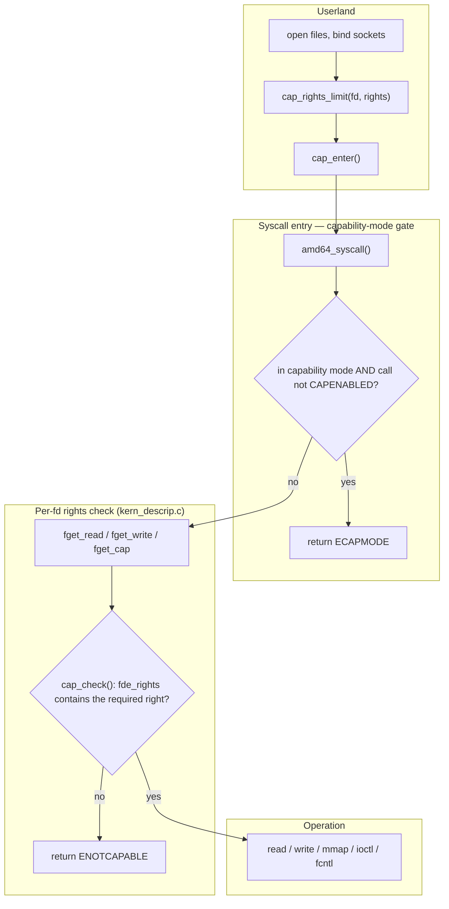

# Capsicum — Capability Mode and Sandboxing
<!-- This file is auto-generated by generate-doc.py -- do not edit manually -->

---
**Navigation:**
  **Up:** [Kernel Core — Structure and Entry Point](../README.md) ▸ [Source Tree — Layout and Conventions](../../README_internals.md)
  **Related:** [Process Management — Scheduling and Lifecycle](README_process.md) | [VFS — Virtual File System Layer](../fs/README.md) | [Jails — OS-level Isolation](README_jail.md)
  **All chapters:** [Source Tree — Layout and Conventions](../../README_internals.md) | [Boot Process — UEFI Bootloader to Kernel Handoff](../../stand/efi/loader/README.md) | [Kernel Core — Structure and Entry Point](../README.md) | [Build System — buildworld and buildkernel](../../share/mk/README.md) | [System Calls and Image Activation — Entry, sysent, and exec](README_syscall.md) | [Kernel Modules and the Linker — KLD, SYSINIT, and linker sets](README_kld.md) | [Virtual Memory Subsystem — vm_page, UMA, and Pagers](../vm/README.md) | [Process Management — Scheduling and Lifecycle](README_process.md) ...
---


## Quick Summary

Capsicum is FreeBSD's capability-based security framework. It gives a process a way to hand back, to the kernel, the ability to reach anything it has not explicitly been given. Two mechanisms work together. The first is *[capability mode](README_cred.md#glossary)*: a process calls [`cap_enter(2)`](../../lib/libsys/cap_enter.2) and from that point on it can no longer open new paths, create new descriptors that name global objects, or make most system calls that could grant it fresh access to resources. The second is *capability rights*: every open file descriptor carries a small bitmask describing exactly which operations — read, write, seek, mmap, ioctl, fcntl — are allowed on that particular descriptor. A process that wants to be sandboxed opens the files it needs, trims each descriptor down to the rights it truly requires, and then calls [`cap_enter(2)`](../../lib/libsys/cap_enter.2). After that, the kernel enforces both restrictions on every system call.

The design is deliberately built on top of the ordinary Unix file-descriptor model rather than replacing it. A file descriptor is already a token that names an open object; Capsicum attaches an authorization to that token. This lets existing programs move toward capability mode gradually: they keep their normal startup, and once their resources are in place they lock the door behind them. Because the rights live on the descriptor and not on the process, one program can hold a read-only log file, a read-write socket, and a read-only configuration file at the same time, each with its own independent limit.

The enforcement happens in two places in the kernel. At the system-call entry point, a process in capability mode is only allowed to make the calls that were explicitly marked as safe when the call table was generated; anything else fails with `ECAPMODE`. Inside a call that operates on a descriptor, the descriptor's rights mask is tested against the operation being attempted; if the right is missing the call fails with `ENOTCAPABLE`. Capsicum is orthogonal to jails: a jail partitions the whole system across many processes using the traditional credential model, while Capsicum sandboxes a single process using per-descriptor [delegation](../fs/nfs/README.md#glossary). A process may sit inside a jail and also run in capability mode, and the two checks apply independently.

In practice a handful of FreeBSD userland programs already run this way — the packet-capture tool `tcpdump`, the DHCP client `dhclient`, and the terminal emulator `xterm`. They all follow the same shape: do all the global-namespace work first, narrow each descriptor's rights, then enter capability mode and stay there. The rest of this chapter traces how that is implemented, starting from the data structures that store the rights and ending at the checks that run on every system call.

## Architecture

Capsicum is implemented in three source locations that correspond to the three jobs it does. The rights definitions and the inline check helpers live in headers: `sys/sys/caprights.h` defines the `cap_rights_t` type and the `cap_*_rights` constant sets, and `sys/sys/capsicum.h` defines the individual right macros (`CAP_READ`, `CAP_WRITE`, `CAP_MMAP`, ...) together with the `cap_check_inline()` helper. The mode and the rights-management system calls live in `sys/kern/sys_capability.c`, and the per-descriptor enforcement lives in `sys/kern/kern_descrip.c`, where the `fget*()` family of functions lives.

The capability-mode side is a per-process [state](../netpfil/pf/README.md#glossary). `sys_cap_enter()` in `sys/kern/sys_capability.c` is the entry point for [`cap_enter(2)`](../../lib/libsys/cap_enter.2); it validates the request, drops the process's privilege, and sets a flag on the process that marks it as being in capability mode. That flag is inherited by children across [`fork(2)`](../../lib/libsys/fork.2) and survives [`execve(2)`](../../lib/libsys/execve.2). Once set, the system-call entry layer consults it: a call that was not marked as allowed in capability mode is rejected before its handler runs. The set of allowed calls is not a hand-maintained list in C — it is encoded in the system-call table. In `sys/kern/syscalls.master`, each call may carry the `CAPENABLED` option, and the comment in that file states plainly that a `CAPENABLED` syscall "is allowed in capability mode". The table generator turns that option into a per-call flag that the entry layer tests, so the allowlist is audited in one place, in the same table that already defines every call's prototype and number.

The capability-rights side is per-descriptor. When a descriptor is opened, the kernel installs a `struct filedescent` that pairs a `struct file` with a `struct filecaps` holding the rights (see Key Data Structures). The rights start out wide and are then reduced by [`cap_rights_limit(2)`](../../lib/libsys/cap_rights_limit.2) (implemented by `kern_cap_rights_limit()` in `sys/kern/sys_capability.c`); rights can only be removed, never added, so the mask is monotonic. When a system call needs a descriptor, it does not call a bare `fget()` — it calls the rights-aware variant for the operation it is about to perform: `fget_read()` for a read, `fget_write()` for a write, `fget_cap()` for a call that needs no specific right, and so on. Those variants look up the descriptor, then test the descriptor's rights against the required right and return `ENOTCAPABLE` if it is missing. Specialized checkers handle the trickier operations: `cap_ioctl_check()` and `cap_ioctl_limit_check()` for [`ioctl(2)`](../../lib/libsys/ioctl.2), `cap_fcntl_check()` and `cap_fcntl_check_fde()` for [`fcntl(2)`](../../lib/libsys/fcntl.2), and `cap_rights_to_vmprot()` to translate the mmap rights into the page protections that [`mmap(2)`](../../lib/libsys/mmap.2) will actually install.

This two-layer split is the whole architecture in one sentence: capability mode gates *which calls a process may make at all*, and capability rights gate *what a call may do to a particular descriptor*. The first is a property of the process; the second is a property of the descriptor. They compose because a call must pass both — it must be an allowed call, and it must hold the right on the descriptor it names.

## Key Data Structures

The rights mask itself is a fixed-size array of 64-bit words, defined in `sys/sys/caprights.h`:

```c
#define	CAP_RIGHTS_VERSION_00	0
#define	CAP_RIGHTS_VERSION	CAP_RIGHTS_VERSION_00

struct cap_rights {
	uint64_t	cr_rights[CAP_RIGHTS_VERSION + 2];
};

typedef	struct cap_rights	cap_rights_t;
```

With `CAP_RIGHTS_VERSION` at 0 the array is two `uint64_t` words, 128 bits in all. The individual rights are not scattered flags; each is a 64-bit value built by the `CAPRIGHT(idx, bit)` macro in `sys/sys/capsicum.h`:

```c
#define	CAPRIGHT(idx, bit)	((1ULL << (57 + (idx))) | (bit))
```

The high bits of the value carry an index marker identifying which element of the array the right belongs to, and the low bits are the right itself. This self-describing encoding is what lets a whole set of rights be tested with a single bitwise operation: a "does this set contain that right?" check is just an AND of the two masks. The header comment notes that the top 7 bits of every element are reserved, and that index 0 uses "2 bit array size + 5 bit array element" while higher indices use "2 bits of 0 + 5 bit array element" — which is why at most five elements are addressable.

Concrete rights, also from `sys/sys/capsicum.h`, are composed from these primitives:

```c
/* Allows for openat(O_RDONLY), read(2), readv(2). */
#define	CAP_READ		CAPRIGHT(0, 0x0000000000000001ULL)
/* Allows for openat(O_WRONLY | O_APPEND), write(2), writev(2). */
#define	CAP_WRITE		CAPRIGHT(0, 0x0000000000000002ULL)
/* Allows for lseek(fd, 0, SEEK_CUR). */
#define	CAP_SEEK_TELL		CAPRIGHT(0, 0x0000000000000004ULL)
/* Allows for lseek(2). */
#define	CAP_SEEK		(CAP_SEEK_TELL | 0x0000000000000008ULL)
/* Allows for aio_read(2), pread(2), preadv(2). */
#define	CAP_PREAD		(CAP_SEEK | CAP_READ)
/* Allows for aio_write(2), openat(O_WRONLY), pwrite(2), pwritev(2). */
#define	CAP_PWRITE		(CAP_SEEK | CAP_WRITE)
/* Allows for mmap(PROT_NONE). */
#define	CAP_MMAP		CAPRIGHT(0, 0x0000000000000010ULL)
/* Allows for mmap(PROT_READ). */
#define	CAP_MMAP_R		(CAP_MMAP | CAP_SEEK | CAP_READ)
/* Allows for mmap(PROT_WRITE). */
#define	CAP_MMAP_W		(CAP_MMAP | CAP_SEEK | CAP_WRITE)
```

Notice that compound rights are just unions of simpler ones: `CAP_PREAD` is `CAP_SEEK | CAP_READ`, and `CAP_MMAP_R` is `CAP_MMAP | CAP_SEEK | CAP_READ`. A program that wants to [`mmap(2)`](../../lib/libsys/mmap.2) a file read-only needs all three, and the kernel's `mmap` path will demand exactly that combination.

The rights are stored per descriptor, not per process. In `sys/sys/filedesc.h` each descriptor in the table is a `struct filedescent`, and the capability state is a `struct filecaps` embedded in it:

```c
struct filecaps {
	cap_rights_t	 fc_rights;	/* per-descriptor capability rights */
	u_long		*fc_ioctls;	/* per-descriptor allowed ioctls */
	int16_t		 fc_nioctls;	/* fc_ioctls array size */
	uint32_t	 fc_fcntls;	/* per-descriptor allowed fcntls */
};

struct filedescent {
	struct file	*fde_file;	/* file structure for open file */
	struct filecaps	 fde_caps;	/* per-descriptor rights */
	uint8_t		 fde_flags;	/* per-process open file flags */
	seqc_t		 fde_seqc;	/* keep file and caps in sync */
};
#define	fde_rights	fde_caps.fc_rights
#define	fde_fcntls	fde_caps.fc_fcntls
#define	fde_ioctls	fde_caps.fc_ioctls
#define	fde_nioctls	fde_caps.fc_nioctls
```

Three things are worth pausing on. First, the rights sit in `fde_caps.fc_rights`, reachable through the `fde_rights` alias — the check is "does *this* `filedescent`'s mask contain the right", which is why the model is per-fd. Second, `fc_ioctls` and `fc_fcntls` are separate from `fc_rights` because `ioctl` and `fcntl` are open-ended operation sets that cannot be captured by a fixed bitmask of named rights; instead a descriptor carries an explicit list of allowed `ioctl` request codes (`fc_ioctls`, sized by `fc_nioctls`) and a `fcntl` command mask (`fc_fcntls`). Third, `fde_seqc` is a sequence counter that keeps the `struct file` and its capability state consistent when the descriptor is duplicated or closed concurrently — the `fget*()` paths take it so a reader never sees a half-updated pair.

The rights-management allocation is its own malloc tag, defined in `sys/kern/kern_descrip.c`:

```c
MALLOC_DEFINE(M_FILECAPS, "filecaps", "descriptor capabilities");
```

## Deep Dive

The lifecycle of a sandboxed process moves through four kernel entry points, and it is useful to walk each one.

**Entering capability mode.** The user calls [`cap_enter(2)`](../../lib/libsys/cap_enter.2), which lands in `sys_cap_enter()` in `sys/kern/sys_capability.c`:

```c
int
sys_cap_enter(struct thread *td, struct cap_enter_args *uap)
{
	struct ucred *newcred, *oldcred;
	...
}
```

The function allocates a new credential, drops the privileges the process no longer needs, and sets the per-process capability-mode flag. After it returns, the process is in capability mode for its lifetime and for every child it forks; there is no `cap_exit` — the transition is one-way, which is exactly the point of a sandbox. Because the flag lives on the process and is inherited across [`fork(2)`](../../lib/libsys/fork.2) and [`execve(2)`](../../lib/libsys/execve.2), a supervised daemon can drop into capability mode once and every later re-exec stays inside it.

**Trimming rights.** Before entering, the process narrows each descriptor with [`cap_rights_limit(2)`](../../lib/libsys/cap_rights_limit.2), handled by `kern_cap_rights_limit()` in the same file. The operation is a bitwise AND of the new mask with the existing `fde_rights`: a bit that is already off cannot be turned back on. This monotonicity is what makes the model safe to reason about — a process can only ever give up rights, and a child can never hold more than its parent did at the moment of [`fork(2)`](../../lib/libsys/fork.2). The userland helper that builds a mask from named rights is [`cap_rights_init(3)`](../../lib/libc/capability/cap_rights_init.3), which ORs the `CAP_*` macros together; the kernel never trusts a mask that names a right the descriptor was never given.

**The per-descriptor check.** Now the interesting part: where the right is actually tested. A system call that reads a file does not call a plain `fget()`; it calls `fget_read(fd)`, defined in `sys/kern/kern_descrip.c`. That function resolves the descriptor to its `struct filedescent`, and before handing the `struct file` back it runs the rights test. The test itself is in `sys/kern/sys_capability.c`, where `cap_check()` (and the faster `cap_check_inline()` / `cap_check_inline_transient()` in `sys/sys/capsicum.h`) AND the required right against `fde_rights` and, on failure, call `cap_check_failed_notcapable()` to return `ENOTCAPABLE`. The whole family is visible in the descriptor code: `fget_read()`, `fget_write()`, `fget_cap()`, `fget_mmap()`, `fgetvp_rights()`, and the unlocked variants `fget_unlocked()`, `fget_unlocked_flags()`, `fget_unlocked_seq()`. Each one is a thin wrapper that knows which right its caller needs and lets `cap_check()` do the comparison.

The special operations get their own checkers, also in `sys/kern/sys_capability.c`. [`ioctl(2)`](../../lib/libsys/ioctl.2) is checked by `cap_ioctl_check()` against the descriptor's `fc_ioctls` list (the limit is enforced by `cap_ioctl_limit_check()`), because an `ioctl` request is an arbitrary code that a fixed bitmask cannot enumerate. [`fcntl(2)`](../../lib/libsys/fcntl.2) is checked by `cap_fcntl_check()` and `cap_fcntl_check_fde()` against `fc_fcntls`. [`mmap(2)`](../../lib/libsys/mmap.2) is checked against the `CAP_MMAP*` rights, and `cap_rights_to_vmprot()` converts the granted rights into the `VM_PROT_*` flags the virtual-memory layer will install — so a descriptor that was limited to `CAP_MMAP_R` can be mapped read-only but not writable, regardless of what the caller asks for.

**The capability-mode gate.** The other half of enforcement is at the very top of the call path. When a system call enters the kernel, the entry layer checks whether the current process is in capability mode. If it is, and the call was not marked `CAPENABLED` in `sys/kern/syscalls.master`, the call is rejected with `ECAPMODE` before its handler runs. This is why, after [`cap_enter(2)`](../../lib/libsys/cap_enter.2), calls like [`open(2)`](../../lib/libsys/open.2) on an absolute path, [`chroot(2)`](../../lib/libsys/chroot.2), and most of the address-space and namespace calls fail with `ECAPMODE`: they are not in the audited allowlist. The allowlist is maintained in the same table that defines every call, so a new call is only reachable in capability mode if someone explicitly marked it and audited it for safety.

A useful way to see the division of labor: [`read(2)`](../../lib/libsys/read.2) on a read-only log descriptor passes the mode gate (it is a `CAPENABLED` call) and then passes the rights check (the descriptor has `CAP_READ`). [`read(2)`](../../lib/libsys/read.2) on a descriptor that was limited to `CAP_WRITE` passes the mode gate but fails the rights check with `ENOTCAPABLE`. A call like [`chroot(2)`](../../lib/libsys/chroot.2) fails the mode gate with `ECAPMODE` before any descriptor is even looked at. The two layers catch two different classes of mistake.

## Flow / Diagram



The left column is what the program does before it locks the door. The middle is the capability-mode gate, which only bites once [`cap_enter(2)`](../../lib/libsys/cap_enter.2) has been called. The bottom is the per-descriptor rights check, which runs on every descriptor-bearing call whether or not the process is in capability mode — a process that has limited a descriptor's rights but has not entered capability mode is still bound by them.

## Advanced Notes

**Debugging.** The kernel exposes a tunable that turns capability failures into traps: `sys/kern/sys_capability.c` defines

```c
bool __read_frequently trap_enotcap;
SYSCTL_BOOL(_kern, OID_AUTO, trap_enotcap, CTLFLAG_RWTUN, &trap_enotcap, 0,
    "Deliver SIGTRAP on ECAPMODE and ENOTCAPABLE");
```

Setting `kern.trap_enotcap` to 1 makes a capability failure raise `SIGTRAP` instead of just returning an error, which is invaluable when a program dies with `ENOTCAPABLE` and you need a stack trace showing exactly which call and which descriptor tripped it. For tracing the rights themselves, the kernel keeps the current mask in the descriptor's `fde_rights` field (see Key Data Structures), which a supervisor can inspect directly, and the `bitset_strprint()` / `bitset_strscan()` helpers in the capability code turn a mask into and from a human-readable string of right names. Under DTrace, the capability entry points are ordinary kernel functions, so a [probe](README_driver.md#glossary) on `sys_cap_enter` or on the `fget*()` family lets you watch a process enter the sandbox and watch each descriptor get tested.

**Performance.** The rights check is a single bitwise AND on a 128-bit value that is already resident in the descriptor the call is about to touch, so it adds essentially no cost to the common path; it is not a lock acquisition or a hash lookup. The capability-mode gate is a single flag test at the entry layer. The one place the cost is real is `ioctl`, where `cap_ioctl_check()` walks the `fc_ioctls` list rather than testing a bit — which is why `fc_ioctls` is a small, bounded array (`fc_nioctls` elements) and why the header caps it at `IOCTLS_MAX_COUNT` (256) in `sys/kern/sys_capability.c`.

**Pitfalls.** The first trap is assuming rights are per-process. They are not: two descriptors that point at the same `struct file` (for example, after a [`dup(2)`](../../lib/libsys/dup.2)) each carry their own `fde_rights`, and limiting one does not limit the other. The second is forgetting that `close`, `dup`, and `dup2` do not require a capability at all — the header comment in `sys/sys/capsicum.h` calls this out explicitly, because a sandboxed process still needs to manage its descriptor table. The third is the `mmap` and AIO paths, which the same comment flags as needing special attention because whether they read or write depends on context; that is exactly why `CAP_MMAP_R`, `CAP_MMAP_W`, and `CAP_MMAP_X` exist as distinct rights rather than a single `CAP_MMAP`. Finally, because capability mode is one-way, a program that enters too early — before it has opened everything it will ever need — is stuck; the discipline is to do all global-namespace work first.

**Connection to OS theory.** Textbooks describe the access matrix and note that it can be sliced two ways: by columns into access lists attached to objects, or by rows into *capability lists* attached to a domain, where each entry names an object plus the operations permitted on it (Tanenbaum and Bos, *Modern Operating Systems*, §9.2.3; Silberschatz, Galvin and Gagne, *Operating System Concepts*, §14.5.3). Capsicum is the row-slicing idea applied to the Unix file descriptor: the descriptor is the capability token, `fde_rights` is the set of permitted operations, and the kernel's `cap_check()` is the lookup that verifies the token before the operation proceeds. The textbook concern that a capability must not be forgeable maps directly onto the monotonic rights mask — a process cannot synthesize a right it was never given, and `cap_rights_limit()` can only shrink the set. Where the textbook model and the implementation diverge is the second axis: the capability-mode gate is not part of the classic capability model at all; it is a separate, process-level restriction that says "this domain may only make these calls", layered on top of the per-token rights.

**Composition with jails and MAC.** Jails and Capsicum solve different problems and compose cleanly. A jail partitions the system — it gives a group of processes their own view of the network, the filesystem namespace, and the resource limits, using the traditional credential model. Capsicum sandboxes a single process by restricting what it can do with the specific descriptors it holds. A process can be inside a jail and in capability mode at the same time: the jail decides which global objects the process can even see, and Capsicum decides what it can do with the ones it has. MAC (Mandatory Access Control) is a third, orthogonal layer that reasons about labels and credentials across the system, enforced by policy modules; Capsicum, by contrast, is a self-imposed, per-descriptor restriction that the process sets on itself. The three can all be active on one process and each checks a different property.

## See Also
- [Jails — OS-level Isolation](README_jail.md)
- [Process Management — Scheduling and Lifecycle](README_process.md)
- [VFS — Virtual File System Layer](../fs/README.md)


- Source: [`sys/kern/sys_capability.c`](sys_capability.c) (mode and rights-management calls), [`sys/kern/kern_descrip.c`](kern_descrip.c) (the `fget*()` rights-aware family and `M_FILECAPS`), [`sys/sys/caprights.h`](../sys/caprights.h) (`cap_rights_t` and the `cap_*_rights` sets), [`sys/sys/capsicum.h`](../sys/capsicum.h) (the `CAP_*` macros and `cap_check_inline()`), [`sys/sys/filedesc.h`](../sys/filedesc.h) (`struct filecaps` and `struct filedescent`).
- Man pages: [`cap_enter(2)`](../../lib/libsys/cap_enter.2), [`cap_rights_limit(2)`](../../lib/libsys/cap_rights_limit.2), [`cap_rights_init(3)`](../../lib/libc/capability/cap_rights_init.3), [`jail(8)`](../../usr.sbin/jail/jail.8).

---

> _Generated by [DaemonDocs](https://github.com/ocochard/DaemonDocs) on 2026-08-29 07:14 UTC using model `Qwen3.8-27B-Q8_0` (llama.cpp build `b10553-cd26896c1`). AI-generated content — verify against source before relying on it._
