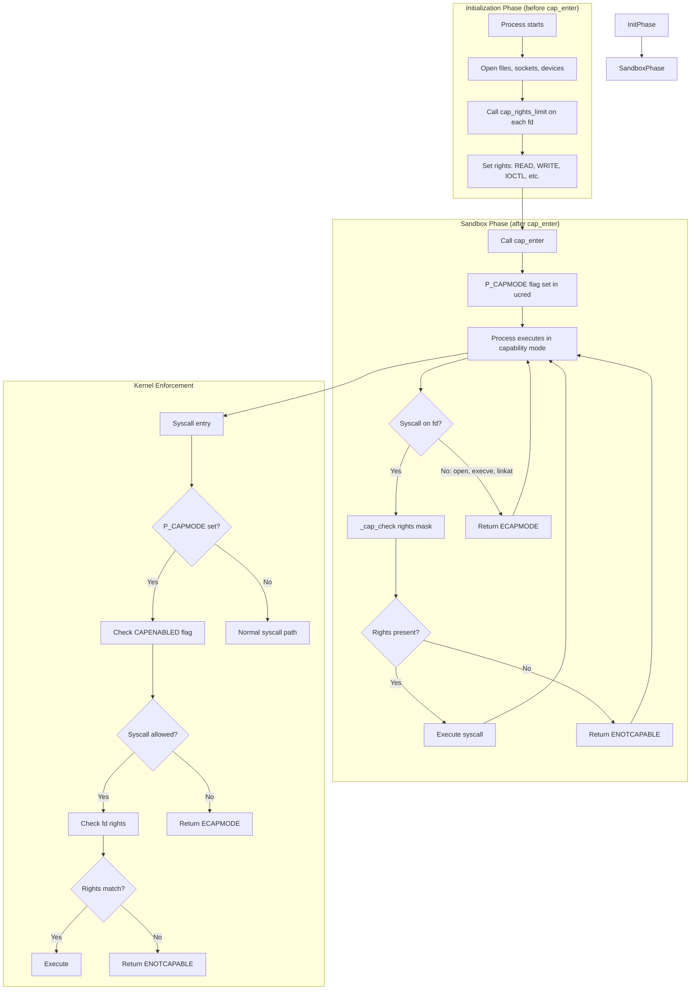

# Capsicum — Capability Mode and Sandboxing
<!-- This file is auto-generated by generate-doc.py -- do not edit manually -->

---
**Navigation:**
  **Up:** [Kernel Core — Structure and Entry Point](../README.md) ▸ [Source Tree — Layout and Conventions](../../README_internals.md)
  **Related:** [Process Management — Scheduling and Lifecycle](README_process.md) | [VFS — Virtual File System Layer](../fs/README.md) | [Jails — OS-level Isolation](README_jail.md)
  **All chapters:** [Source Tree — Layout and Conventions](../../README_internals.md) | [Boot Process — UEFI Bootloader to Kernel Handoff](../../stand/efi/loader/README.md) | [Kernel Core — Structure and Entry Point](../README.md) | [Build System — buildworld and buildkernel](../../share/mk/README.md) | [Virtual Memory Subsystem — vm_page, UMA, and Pagers](../vm/README.md) | [Process Management — Scheduling and Lifecycle](README_process.md) | [Locking Primitives — Mutexes, sx, rmlocks, and Atomics](README_locking.md) | [Buffer Cache — Block I/O Subsystem](../vm/README_bcache.md) ...
---


## Quick Summary

Capsicum is FreeBSD's capability-based security framework, implemented as two complementary mechanisms working together: capability mode and capability rights. Capability mode allows a process to enter a restricted execution state via the [`cap_enter(2)`](../../lib/libsys/cap_enter.2) system call, at which point it loses the ability to open new files, create new file descriptors that reference global namespace objects, and perform most other operations that could grant access to new resources. Capability rights provide fine-grained per-file-descriptor restrictions, where each open file descriptor carries a bitmask of allowed operations — read, write, mmap, ioctl, and so on. Together, these mechanisms enable a "capability-style" sandbox in which a process can operate using only the resources explicitly delegated to it.

The framework was designed by Robert Watson and Jonathan Anderson at the University of Cambridge Computer Laboratory and the FreeBSD Foundation, with support from Google. It draws inspiration from the historic Capability-based security model, but adapts it to the Unix file descriptor paradigm: instead of replacing the entire process credential model, Capsicum wraps existing file descriptors with additional rights constraints. This approach means that existing programs can be incrementally adapted to run in capability mode — a process opens its needed files, calls `cap_rights_limit()` to restrict each descriptor, calls `cap_enter()` to enter the sandbox, and then proceeds with its work under the enforced restrictions.

Capsicum operates at the syscall entry layer in the kernel. Every system call that operates on a file descriptor checks the descriptor's rights mask against the operation being performed. If the process is in capability mode, additional restrictions apply: the process cannot open new files, cannot use most directory-related operations, and is limited to a carefully audited subset of system calls. The framework is orthogonal to jails — jails partition the system across multiple processes using the traditional Unix credential model, while Capsicum sandboxes individual processes using capability-based delegation. It is also distinct from MAC (Mandatory Access Control), which operates on the credential and label model; Capsicum operates on per-file-descriptor rights that are set by the process itself.

The practical impact of Capsicum is visible in several FreeBSD userland components. The DHCP client (`dhclient`), the packet capture tool (`tcpdump`), and the terminal emulator (`xterm`) have all been adapted to run in capability mode. These programs typically restructure their initialization into two distinct phases. In the first phase, before capability mode is enabled, the program performs standard Unix initialization: it sets up signal handlers, opens configuration files, binds to network interfaces, and prepares the resources it will need. In the second phase, it restricts each file descriptor to only the operations it actually requires, enters capability mode, and continues execution with the guarantee that even if an attacker exploits a bug in the running code, the damage is bounded by the capability rights.

## Architecture

Capsicum consists of two interlocking mechanisms implemented primarily in `sys/kern/sys_capability.c` and enforced through hooks in the syscall entry path and file descriptor operations. The first mechanism, capability mode, is a process-wide flag stored in the process credential structure. When a process calls `cap_enter()`, the kernel sets the `P_CAPMODE` flag on the process, recorded in the `ucred` structure. From that point forward, the kernel enforces a restricted syscall set: operations that could create new file descriptors referencing global namespace objects — such as [`open(2)`](../../lib/libsys/open.2), `openat(2)`, [`execve(2)`](../../lib/libsys/execve.2) with a path, `linkat(2)`, `mkdirat(2)`, and most directory operations — return `ECAPMODE` instead of proceeding. The allowed syscalls are defined by `CAPENABLED` flags in `syscalls.master`, and each syscall handler must be carefully audited to ensure it cannot be used to escape the sandbox.

The second mechanism, capability rights, is a per-file-descriptor constraint stored alongside the file structure in the file descriptor table. Each entry in the file descriptor table, represented by `struct filedescent` in `sys/sys/filedesc.h`, contains a `struct filecaps` that holds a rights bitmask (`fc_rights`), an array of allowed ioctl commands (`fc_ioctls`), and a bitmask of allowed fcntl commands (`fc_fcntls`). When a syscall operates on a file descriptor — for example, [`read(2)`](../../lib/libsys/read.2) reading from an fd, or [`ioctl(2)`](../../lib/libsys/ioctl.2) performing an operation on it — the kernel checks the descriptor's rights mask against the operation being performed. If the required capability is not present in the mask, the syscall returns `ENOTCAPABLE`. This check happens at syscall entry time, before any operation is performed, ensuring that the constraint is enforced uniformly regardless of how the fd was obtained.

The rights are encoded as 64-bit values using the `CAPRIGHT(idx, bit)` macro defined in `sys/sys/capsicum.h`. The macro places an index value in the high bits (starting at bit 57) and a per-index bit pattern in the low bits. This encoding allows the kernel to store multiple rights compactly in a small array (`struct cap_rights`), with the array length itself encoded in the top two bits of the first element. The current version (`CAP_RIGHTS_VERSION_00`) supports up to five array elements, providing 320 distinct capability bits. The kernel maintains pre-defined rights constants for common operation sets — for example, `cap_read_rights`, `cap_write_rights`, `cap_ioctl_rights` — which can be applied to file descriptors using [`cap_rights_limit(2)`](../../lib/libsys/cap_rights_limit.2).

Capability rights are enforced at syscall entry by the `_cap_check()` function, which is called from syscall handlers that operate on file descriptors. The check compares the required capability against the rights mask stored in the `filedescent` entry. For ioctls, which have an unbounded command space, the kernel maintains a separate allowlist (`fc_ioctls`) rather than using the bitmask. For fcntl commands, a bitmask (`fc_fcntls`) is used. The enforcement is per-fd rather than per-syscall because the same syscall may operate on multiple fds with different rights, and the constraint must follow the resource (the fd) rather than the operation. This design reflects the capability model principle: authority is attached to the object, not to the code that accesses it.

The framework is implemented as a kernel option (`CAPABILITY_MODE` in `opt_capsicum.h`) and is compiled into the base kernel. A `FEATURE` macro in `sys/kern/sys_capability.c` exposes the capability mode feature to userland diagnostics. A sysctl variable `trap_enotcap` in the same file allows processes to receive `SIGTRAP` instead of `ENOTCAPABLE` errors, which is useful for debugging capability violations during development.

## Key Data Structures

The core data structures for Capsicum are defined across three header files: `sys/sys/caprights.h` for the rights array, `sys/sys/capsicum.h` for the individual capability bits, and `sys/sys/filedesc.h` for the per-descriptor storage.

```c
# From sys/sys/caprights.h
struct cap_rights {
	uint64_t	cr_rights[CAP_RIGHTS_VERSION + 2];
};
```

The `struct cap_rights` holds the rights array. The length of the array is encoded in the top two bits of the first element: if those bits are zero, the array has two elements. This encoding allows the kernel to validate and iterate the array without requiring an explicit length field. Each subsequent element's top five bits encode the index, allowing up to five elements (indices 0 through 4). The current version (`CAP_RIGHTS_VERSION_00`) uses this two-element layout.

```c
# From sys/sys/capsicum.h
#define	CAPRIGHT(idx, bit)	((1ULL << (57 + (idx))) | (bit))

#define	CAP_READ		CAPRIGHT(0, 0x0000000000000001ULL)
#define	CAP_WRITE		CAPRIGHT(0, 0x0000000000000002ULL)
#define	CAP_SEEK_TELL		CAPRIGHT(0, 0x0000000000000004ULL)
#define	CAP_SEEK		(CAP_SEEK_TELL | 0x0000000000000008ULL)
#define	CAP_MMAP		CAPRIGHT(0, 0x0000000000000010ULL)
#define	CAP_IOCTL		CAPRIGHT(0, 0x0000000000000040ULL)
```

The `CAPRIGHT(idx, bit)` macro creates a 64-bit capability value. The index is placed in bits 57-61, and the bit pattern is in bits 0-56. This leaves room for version and length encoding in the top bits. Each capability represents a specific operation: `CAP_READ` allows [`read(2)`](../../lib/libsys/read.2), `readv(2)`, and `openat(O_RDONLY)`; `CAP_WRITE` allows [`write(2)`](../../lib/libsys/write.2), `writev(2)`, and `openat(O_WRONLY | O_APPEND)`; `CAP_MMAP` allows [`mmap(2)`](../../lib/libsys/mmap.2) with `PROT_NONE`. Composite rights like `CAP_MMAP_R` combine multiple base rights.

```c
# From sys/sys/filedesc.h
struct filecaps {
	cap_rights_t	 fc_rights;	/* per-descriptor capability rights */
	u_long		*fc_ioctls;	/* per-descriptor allowed ioctls */
	int16_t		 fc_nioctls;	/* fc_ioctls array size */
	uint32_t	 fc_fcntls;	/* per-descriptor allowed fcntls */
};

struct filedescent {
	struct file	*fde_file;	/* file structure for open file */
	struct filecaps	 fde_caps;	/* per-descriptor rights */
	uint8_t		 fde_flags;	/* per-process open file flags */
	seqc_t		 fde_seqc;	/* keep file and caps in sync */
};
#define	fde_rights	fde_caps.fc_rights
#define	fde_fcntls	fde_caps.fc_fcntls
#define	fde_ioctls	fde_caps.fc_ioctls
#define	fde_nioctls	fde_caps.fc_nioctls
```

The `struct filecaps` holds the rights for a single file descriptor. The `fc_rights` field stores the capability bitmask. The `fc_ioctls` field is a dynamically allocated array of ioctl command values that are permitted on this descriptor; `fc_nioctls` stores the array size. The `fc_fcntls` field is a 32-bit bitmask of allowed fcntl commands. The `struct filedescent` embeds a `struct filecaps` inline (not as a pointer), so each file descriptor table entry carries its own rights copy. The `fde_seqc` field is a sequence counter used to detect concurrent modifications to the file structure and its caps, ensuring atomic updates.

```c
# From sys/sys/filedesc.h
struct filedesc {
	struct	fdescenttbl *fd_files;	/* open files table */
	/* ... */
};
```

The `struct filedesc` is the per-process file descriptor table. It contains a pointer to `fd_files`, which is a `struct fdescenttbl` — a flexible array of `struct filedescent` entries, one per open file descriptor. The rights are stored inline in each `filedescent` entry, not in the `filedesc` structure itself, reflecting the per-fd granularity of the capability model.

## Deep Dive

The entry point for capability mode is `sys_cap_enter()`, defined in `sys/kern/sys_capability.c`. When a process calls [`cap_enter(2)`](../../lib/libsys/cap_enter.2), the kernel invokes this function, which performs the following steps:

1. **Check preconditions**: The function verifies that the process is not already in capability mode, and that it holds the necessary privileges. The `P_CAPMODE` flag in the process credential is checked to prevent re-entry.

2. **Create a new credential**: A new `ucred` structure is allocated with the `P_CAPMODE` flag set. The old credential is preserved temporarily to ensure atomicity.

3. **Update the process credential**: The process's credential is replaced with the new one. From this point forward, all syscall handlers that check `P_CAPMODE` will find it set.

4. **Enforce restrictions**: Subsequent syscalls that attempt to create new file descriptors or access global namespaces will be rejected by the capability mode checks in the syscall handlers.

The rights enforcement happens in the syscall entry path through the `_cap_check()` function. When a syscall operates on a file descriptor — for example, [`read(2)`](../../lib/libsys/read.2) calls `fget_read()` to retrieve the file structure — the kernel checks whether the required capability is present in the descriptor's rights mask. The check is implemented as follows (simplified):

```c
# From sys/kern/sys_capability.c (conceptual)
static inline int
_cap_check(struct file *fp, cap_rights_t *rights)
{
	struct filedescent *fde;
	struct filecaps *fc;
	int i;

	/* Get the filecaps from the filedescent */
	fde = fdp_find(fp);
	fc = &fde->fde_caps;

	/* Check the rights bitmask */
	for (i = 0; i < CAP_RIGHTS_VERSION + 2; i++) {
		if ((fc->fc_rights.cr_rights[i] & rights->cr_rights[i]) !=
		    rights->cr_rights[i])
			return (ENOTCAPABLE);
	}

	/* Check ioctl allowlist if applicable */
	/* ... */

	return (0);
}
```

The `_cap_check()` function is called from syscall handlers that operate on file descriptors. For example, the [`read(2)`](../../lib/libsys/read.2) handler calls `fget_read()` to retrieve the file structure, then calls `_cap_check()` to verify that `CAP_READ` is present in the descriptor's rights. If the check fails, the syscall returns `ENOTCAPABLE` immediately, before any I/O is performed.

For ioctls, the check is more complex because ioctl commands are unbounded 32-bit values. Instead of a bitmask, the kernel maintains an allowlist of permitted ioctl commands in `fc_ioctls`. The `cap_ioctl_check()` function iterates over this array to verify that the requested command is permitted. This approach is necessary because a bitmask would require 2^32 bits, which is impractical.

The rights are set using [`cap_rights_limit(2)`](../../lib/libsys/cap_rights_limit.2), which calls `sys_cap_rights_limit()` in the kernel. This function validates the rights array, copies the rights into the `filecaps` structure for the specified fd, and updates the `fde_seqc` counter to ensure atomicity with concurrent file descriptor operations.

```c
# From sys/kern/sys_capability.c (conceptual)
int
sys_cap_rights_limit(struct thread *td, struct cap_rights_limit_args *uap)
{
	struct file *fp;
	struct filedescent *fde;
	struct filecaps *fc;
	cap_rights_t *new_rights;

	/* Get the file structure for the fd */
	fp = fget(td->td_lwp, uap->fd, FWRITE);
	if (fp == NULL)
		return (EBADF);

	/* Allocate and copy the new rights */
	new_rights = malloc(sizeof(cap_rights_t), M_FILECAPS, M_WAITOK | M_ZERO);
	/* Copy and validate rights from userland */
	/* ... */

	/* Update the filecaps */
	fde = fdp_find(fp);
	fc = &fde->fde_caps;
	fc->fc_rights = *new_rights;

	/* Update sequence counter */
	fde_seqc_update(fp);

	fdrop(fp, td);
	return (0);
}
```

The `M_FILECAPS` malloc type is defined in `sys/kern/kern_descrip.c` for allocating rights structures. This ensures that capability-related memory is tracked separately from other file descriptor allocations.

Capability mode and capability rights compose with each other: entering capability mode does not automatically restrict existing file descriptors — the process must explicitly limit each fd using `cap_rights_limit()`. However, once in capability mode, the process cannot open new fds at all, so the rights set before entering mode are the only ones that will ever apply. This design allows a process to open all its needed resources, limit each one precisely, and then enter the sandbox with confidence that no new resources can be obtained.

The enforcement is per-fd because the capability model attaches authority to resources, not to code. A single process may have file descriptors with different rights: one fd may have `CAP_READ` for a log file, another may have `CAP_WRITE` for a socket, and another may have `CAP_IOCTL` for a device. The rights follow the fd, so the same syscall ([`read(2)`](../../lib/libsys/read.2)) may succeed on one fd and fail on another, depending on the rights attached to each.

## Flow / Diagram



The diagram shows the two-phase execution model: first, the process initializes and sets rights on its file descriptors; then, it enters capability mode and executes under enforcement. The enforcement path checks both the process-wide capability mode flag and the per-fd rights mask.

## Advanced Notes

**Debugging capability violations**: Capsicum does not currently expose DTrace SDT probes for capability mode entry or rights check failures. Debugging is typically performed using the `kern.trap_enotcap` sysctl, which causes the kernel to deliver a `SIGTRAP` signal to the process instead of returning `ENOTCAPABLE`. This allows debuggers like `gdb(1)` to catch the violation at the exact point of failure. Alternatively, [`ktrace(1)`](../../usr.bin/ktrace/ktrace.1) can be used to trace system call entry and exit for processes running in capability mode.

**Performance implications**: The capability check adds minimal overhead — a bitwise AND comparison per fd operation. The `_cap_check()` function is typically inlined by the compiler, and the rights comparison is a simple loop over the small rights array (two elements for version 00). The ioctl allowlist check requires a linear scan of the `fc_ioctls` array, which is typically small (dozens of entries at most). The `seqc` mechanism for atomic updates adds a small overhead but avoids locking. Overall, the performance impact is negligible for well-behaved capability-mode programs.

**Common pitfalls**: A common mistake is to enter capability mode before limiting all file descriptors. Once `cap_enter()` is called, no new fds can be opened, so any fds that were not limited before entering mode will have unrestricted rights — potentially allowing operations that should have been restricted. Another pitfall is assuming that [`close(2)`](../../lib/libsys/close.2), [`dup(2)`](../../lib/libsys/dup.2), and `dup2(2)` require capability rights; these syscalls are explicitly exempt from rights checks because they operate on the fd table itself, not on the underlying resource. A third pitfall is forgetting that [`mmap(2)`](../../lib/libsys/mmap.2) and `aio*()` syscalls may require read or write rights depending on context — the kernel checks the operation context, not just the syscall name.

**Connection to OS theory**: Capsicum implements the capability model as described by Butler Lampson in "Protection" (1969) and adapted to Unix by Gary Kildall and others. The key insight is that authority is attached to resources (file descriptors) rather than to processes (credentials). In the traditional Unix model, a process has a single credential (uid, gid, groups) that applies to all operations; in the capability model, each resource has its own set of authorities. Capsicum bridges the gap by wrapping Unix fds with capability rights, allowing incremental adoption without replacing the entire credential model.

Capsicum is orthogonal to jails because jails operate at the process and network level, partitioning the system across multiple isolated environments using the traditional Unix credential model. A jail can contain many processes, each of which may or may not run in capability mode. Capsicum operates within a single process, providing fine-grained control over individual file descriptors. The two mechanisms compose naturally: a process in a jail can also run in capability mode, providing defense in depth.

Capsicum is distinct from MAC (Mandatory Access Control) because MAC operates on the credential and label model — the kernel checks labels on processes and resources against a policy. Capsicum operates on per-file-descriptor rights that are set by the process itself, not by an external policy. MAC is a system-wide policy enforcement mechanism; Capsicum is a per-process sandboxing mechanism. They can be used together: MAC can restrict which processes can enter capability mode or which resources can be opened, while Capsicum provides fine-grained control within the process.

**Historical context**: Capsicum was developed at the University of Cambridge Computer Laboratory starting in 2008, with support from Google. The design was influenced by the seccomp-bpf mechanism in Linux, but extends it by providing per-fd rights rather than just a syscall filter. The framework was integrated into FreeBSD 9.0 in 2012 and has been refined in subsequent releases. The capability rights encoding was designed to support future versions with more rights bits, using the top bits of the 64-bit values for version and length encoding.

## See Also
- [Jails — OS-level Isolation](README_jail.md)
- [Process Management — Scheduling and Lifecycle](README_process.md)
- [VFS — Virtual File System Layer](../fs/README.md)


- [`sys/kern/sys_capability.c`](sys_capability.c) — kernel implementation of capability mode and rights
- [`sys/sys/capsicum.h`](../sys/capsicum.h) — capability bit definitions
- [`sys/sys/caprights.h`](../sys/caprights.h) — rights array structure and version encoding
- [`sys/sys/filedesc.h`](../sys/filedesc.h) — file descriptor table and filecaps structure
- [`sys/kern/kern_descrip.c`](kern_descrip.c) — file descriptor management, including capability integration
- [`lib/libsys/cap_enter.2`](../../lib/libsys/cap_enter.2) — userland documentation for [`cap_enter(2)`](../../lib/libsys/cap_enter.2), [`cap_rights_limit(2)`](../../lib/libsys/cap_rights_limit.2)
- `README_jail.md` — jail isolation, for comparison with Capsicum
- `security/mac/` — MAC framework, for comparison with Capsicum
- [`sys/kern/README_capsicum.md`](README_capsicum.md) — additional kernel documentation

---

> _Generated by [DaemonDocs](https://github.com/ocochard/DaemonDocs) on 2026-05-03 18:23 UTC using model `Qwen3.6-35B-A3B-UD-Q8_K_XL` (llama.cpp build `b8985-27aef3dd9`). AI-generated content — verify against source before relying on it._
